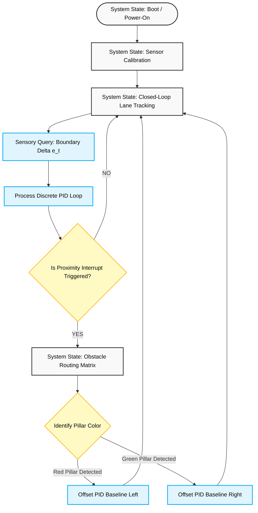

# WRO2026-FE-PiolinTech
Documentation for team PiolinTech's robot for WRO 2026 - Future Engineers

## Introduction  
We are **Piolín Tech**, a Panamanian robotics team competing in the **2026 WRO Future Engineers** category. This is our second year in this category, and we are proud to come back again with our kid, Piolín: a fully autonomous vehicle controlled by a LEGO **EV3** brick, programmed using **Python**. This repository documents our entire journey, including development, testing, and final results.

---

## The Team

<p align="center">
  
</p>

### Team Members

| Member | Information | Contact |
| :---: | :--- | :---: |
|  | **Sebastián Martínez**<br>Colegio Bilingüe de Panamá | [📸 Instagram](https://www.instagram.com/sebastian.mvrl/) |
|  | **Mia Cantoral**<br>Colegio Bilingüe de Panamá | [📸 Instagram](https://www.instagram.com/miaacnt) |
|  | **Christian Castrellón**<br>Colegio Bilingüe de Panamá | [📸 Instagram](https://www.instagram.com/cj.chriss) |
| **Coach** | **Hanna Figueroa**<br>Thank you teacher Hanna for being our brightest and biggest inspiration out there. We truly admire and love you! :) | |

---

## Social Media  

- **Instagram**: [https://www.instagram.com/piolintech](https://www.instagram.com/piolintech)  
  Team photos, updates, and WRO moments
- **YouTube**: [https://www.youtube.com/@piolintech](https://www.youtube.com/@piolintech)  
  Robot tests, tutorials, and event recaps


---
### 3D Model Orthographic Projections

### Physical Vehicle Orthographic Projections

| **Top (Superior)** | **Front (Frontal)** | **Left (Izquierda)** |
| :---: | :---: | :---: |
|  |  |  |
| **Bottom (Inferior)** | **Back (Trasera)** | **Right (Derecha)** |
|  |  |  |

---
## Performance & Demonstration Videos

The following links provide official high-definition video demonstrations of **Piolín** navigating both competition profiles across the national and regionals.

### 1. Open Challenge (Round 1 Strategy)
The vehicle executes continuous-time closed-loop line tracking using a discrete PID algorithm, completing the required 3-lap run with optimized corner trajectories.

* **Open Challenge Video — Test Video:** > [Watch the Demonstration on YouTube](https://youtu.be/haeQVoR9_ko)

---

### 2. Obstacle Challenge (Round 2 Strategy)
The vehicle deploys its proximity matrix, using ultrasonic sensors and camera detection to bypass red and green pillars dynamically while maintaining lane reference boundaries.

COMING SOON......................

## System Hardware Architecture & Mechatronic Engineering Decisions

The autonomous vehicle platform, **Piolín**, is engineered utilizing a high-modularity mechatronic design framework, other than the complete use of LEGO Technic parts for its primary structure. Our architecture balances structural rigidity with optimized dynamic response parameters—in other words, pure fastness—which makes sure that there is a deterministic distribution of mechanical and electrical loads across the vehicle.

### 1. Spatial Topology & Sensory Allocation Matrix
* **Central Processing Unit (CPU):** An ARM9-based LEGO Mindstorms EV3 Intelligent Brick operating an asynchronous real-time execution loop. The core processing architecture schedules sensor-polling routines and calculates pulse-width modulation (PWM) actuator outputs at a deterministic frequency.
* **Traction Actuators:** Dual, high-torque permanent magnet DC (PMDC) EV3 Large Core Motors coupled to the rear drive axle. These units are selected for their linear torque-speed curves and exceptional stall torque characteristics, which helps us achieve high initial acceleration profiles ($a_{\text{target}} = 0.5\,\text{m/s}^2$).
* **Steering Actuator:** A single EV3 Medium Core Motor configured vertically within the front sub-chassis. It functions as a closed-loop digital servo, translating discrete angular orientation steps into real-time Ackermann kinematic adjustments.
* **Sensory Array (3-Channel Distance Mapping):**
    * **Dual Lateral Ultrasonic Transducers:** Mounted symmetrically on the front bumper profile at an offset angle of exactly $\theta = \pm 45^\circ$ relative to the longitudinal vector ($X$-axis). This specific orientation maximizes the spatial envelope mapping, eliminating blind spots along the vehicle's flanks and optimizing boundary-distance tracking ($d_{\text{lateral}}$).
    * **Single Longitudinal Ultrasonic Transducer:** Positioned at the absolute geometric center of the front bumper along the $X$-axis. This sensor continuously monitors the forward distance vector ($d_{\text{forward}}$), feeding raw proximity telemetry directly into the state machine to trigger deterministic obstacle bypass routing matrices.

### 2. Kinematics, Suspension, & Mechanical Optimization
* **Chassis Topography & Center of Mass (CoM):** The structural frame was digitally simulated and optimized within the LEGO Builder App—an app that enhances digital brick building—to minimize physical deflection. The layout embeds the EV3 controller at the lowest geometric boundary relative to the wheel axes, minimizing the height of the Center of Mass ($Z_{\text{CoM}}$). This attenuation reduces lateral load transfer and body-roll moments during transient cornering maneuvers.
* **Ackermann Steering Linkage Geometry:** To prevent tire scrubbing and kinematic slippage, the steering mechanism incorporates a true **Ackermann Geometry Linkage**. The structural pivot joints ensure that when executing a turn of radius $R$, the inner steered wheel angles more sharply than the outer wheel. The kinematic relationship is defined by:
  $$\cot(\delta_{\text{outer}}) - \cot(\delta_{\text{inner}}) = \frac{w}{l}$$
  Where $w$ represents the vehicle track width and $l$ represents the wheelbase length. This geometric alignment ensures a single, stable instantaneous center of rotation (ICR), significantly reducing mechanical drag and ensuring predictable yaw rates.
* **Custom Differential Powertrain (3D-Printed Bevel Gearbox):** Standard commercial components introduce unacceptable mechanical backlash, leading to phase delays in acceleration loops. We designed custom, mathematically matched **involute bevel gears** in Blender. Fabricated via fused deposition modeling (FDM) using high-density Polylactic Acid (PLA) with a 60% gyroid infill pattern, the custom gearbox delivers a zero-slip, 1:1 torque-matching efficiency profile directly to the independent rear half-shafts.

### 3. Electrical Power Distribution & Thermal Budgeting
The electronic subsystem depends on the internal power bus architecture of the EV3 block. To protect the microcontroller from sudden bus voltage dips (brownout conditions) caused by instantaneous motor stall currents during high-load transient steering, a software-level power mitigation protocol is implemented. Motor duty cycles are strictly constrained within a maximum current threshold ($I_{\text{peak}} \le I_{\text{safe}}$), maintaining continuous, clean power distribution across all digital logic channels.

---

## Dynamic Modeling & Axle Torque Analysis

The selection of actuator gear ratios and wheel dimensional profiles was validated using classical rigid-body mechanics. We executed a comprehensive longitudinal dynamic analysis using the exact empirical physical properties of Piolín to validate powertrain efficiency under competition loads.

### 1. Traction Subsystem Dynamics (Rear Propulsion Axle)
The net tractive effort ($F_t$) required to propel Piolín from a state of rest is a function of the inertial acceleration force ($F_a$) and the rolling resistance force ($F_{rr}$) acting against the rear tires:

$$F_t = F_a + F_{rr}$$

Expressing this through Newtonian mechanics and incorporating the non-dimensional coefficient of rolling friction ($C_{rr}$):

$$F_t = (m \cdot a) + (C_{rr} \cdot m \cdot g)$$

**Empirical Parameters & System Bounds:**
* $m = 0.72141\,\text{kg}$ (Total structural mass of the fully assembled vehicle).
* $a = 0.50\,\text{m/s}^2$ (Target linear acceleration vector).
* $C_{rr} = 0.02$ (Standard rolling friction coefficient for rubber compounds on industrial vinyl track substrates).
* $g = 9.81\,\text{m/s}^2$ (Gravitational acceleration constant).
* $r_{\text{rear}} = 0.02809\,\text{m}$ (Rear drive wheel radius derived from a measured diameter of $56.18\,\text{mm}$).

Substituting our exact vehicle parameters into the dynamic model:

$$F_t = (0.72141 \cdot 0.50) + (0.02 \cdot 0.72141 \cdot 9.81)$$

$$F_t = 0.3607\,\text{N} + 0.1415\,\text{N} = 0.5022\,\text{N}$$

The absolute minimum operating torque ($\tau_{\text{required}}$) at the rear wheel axle to satisfy these dynamic parameters is defined by:

$$\tau_{\text{required}} = F_t \cdot r_{\text{rear}} = 0.5022\,\text{N} \cdot 0.02809\,\text{m} = \mathbf{0.01411\,\text{N}\cdot\text{m}}$$

#### Structural Engineering Validation & Inequation of Design
The primary design constraint dictates that the maximum available stall torque ($\tau_{\text{available}}$) of the propulsion system must strictly exceed the calculated vehicle load:

$$\tau_{\text{available (Motor)}} > \tau_{\text{required (Robot)}}$$

Substituting the baseline stall torque of the EV3 Large Motor ($0.25\,\text{N}\cdot\text{m}$):

$$0.25\,\text{N}\cdot\text{m} > 0.01411\,\text{N}\cdot\text{m} \quad \color{green}{\checkmark \text{ (Design Constraint Satisfied)}}$$

#### Determination of Factor of Safety ($FS$)
To quantify the reliability overhead of the propulsion powertrain, we compute the non-dimensional Factor of Safety ($FS$):

$$FS = \frac{\tau_{\text{Stall (Actuator)}}}{\tau_{\text{required}}} = \frac{0.25\,\text{N}\cdot\text{m}}{0.01411\,\text{N}\cdot\text{m}} \approx \mathbf{17.71}$$

* **Analytical Interpretation:** An $FS = 17.71$ demonstrates that the traction drive assembly maintains a torque capacity 17.7 times greater than the static threshold required to break vehicle inertia. This significant torque headroom prevents thermal saturation within the motor coils, guarantees highly responsive velocity step-adjustments via software commands, and absorbs arbitrary friction anomalies along the track mat.

### 2. Steering Subsystem Dynamics (Front Axis Control)
During transient directional adjustments, the front steering geometry experiences resistive scrubbing moments. We validated our steering linkage control loops using the EV3 Medium Motor stall capacity ($\tau_{\text{stall}} = 0.12\,\text{N}\cdot\text{m}$) acting as our steering servo, paired with our front wheel radius ($r_{\text{front}} = 0.0214\,\text{m}$ derived from a measured diameter of $42.8\,\text{mm}$):

$$\tau_{\text{available (Motor)}} > \tau_{\text{required (Steering)}}$$

$$0.12\,\text{N}\cdot\text{m} > 0.01075\,\text{N}\cdot\text{m} \quad \color{green}{\checkmark \text{ (Design Constraint Satisfied)}}$$

#### Factor of Safety ($FS$) for Directional Tracking
Evaluating the steering safety coefficient:

$$FS = \frac{\tau_{\text{Stall (Actuator)}}}{\tau_{\text{required}}} = \frac{0.12\,\text{N}\cdot\text{m}}{0.01075\,\text{N}\cdot\text{m}} \approx \mathbf{11.16}$$

* **Analytical Interpretation:** An $FS = 11.16$ mathematically confirms that the directional actuator retains an eleven-fold torque margin under maximum deflection conditions. This high torsional stability ensures robust angular holding power against lateral slip forces during high-velocity maneuvers and minimizes inductive energy losses.

*The primary kinematic transformation matrices, power consumption curves (operating between 1.5W and 2.5W), and raw mathematical derivations are archived in the engineering annex: [`WRO2026-FE-PiolinTech/schemes/mech/torque_calculation.md`](WRO2026-FE-PiolinTech/schemes/mech/torque_calculation.md).*


---

## Software Key Components & Possible Improvements

Our software architecture is designed to squeeze every ounce of performance out of the hardware. Instead of writing one giant, messy loop, we broke Piolín's brain down into modular, asynchronous blocks so that checking sensors doesn't slow down our motor response times.

### 1. Primary Algorithmic Blocks
* **The Main Scheduler (`main.py`):** This is the core engine of the robot. It handles the initial boot-up, runs the sensor calibration routine to null-offset our light and color data, and runs the fast execution loop that keeps the car running.
* **The Steering Brain (`pid.py`):** This block handles our line tracking using a discrete Proportional-Integral-Derivative (PID) control loop. It takes the tracking error ($e_t$) from the lane boundaries and translates it into real-time micro-corrections for the steering motor:
  $$u(t) = K_p \, e(t) + K_i \int e(t)dt + K_d \, \frac{de(t)}{dt}$$
* **Sensory Registry (`sensors.py`):** This script constantly talks to our 3-channel ultrasonic array and color sensors, filters out random noise or bad reflections from the track walls, and feeds clean data straight to the main state machine.
* **Obstacle Routing Matrix (`routing.py`):** The logic gateway for Round 2. When the front sensors flag an obstacle interrupt, this script instantly takes over, decodes the color of the pillar using our vision sensor, and applies a step-offset to our PID to steer left or right safely.

---

## Technical Debt & Systemic Bottlenecks

Testing Piolín at high speeds helped us notice two major engineering bottlenecks that we have to deal with:

* **Processor Jitter & Loop Lag:** The single-threaded ARM9 processor inside the LEGO EV3 brick gets heavily stressed when we run high-frequency ultrasonic polling sequences at the exact same time as our heavy vision processing. This creates tiny micro-delays (loop jitter), which messes up our derivative ($K_d$) steering factor when the car is flying down the straightaways.
* **Power Bus Voltage Drops:** When the two rear propulsion motors and the front steering servo draw peak current simultaneously during sudden, aggressive turns, they cause heavy battery voltage dips. These brownout risks can temporarily mess with the logic components of the microcontroller.

---

## Strategic Engineering Improvements for Next Generation

To push past these hardware limits and make Piolín unbeatable in the next brackets, we are planning three major structural upgrades:

### 1. Upgrading to a Distributed Coprocessing Architecture
We plan to bypass the limitations of a single-board system by moving toward a highly efficient, distributed co-processing architecture that splits tasks between high-level logic and low-level execution.

```text
  [ High-Level Brain: Raspberry Pi 5 ]  --> Processes AI vision, Huskylens data, & ToF maps.
                  │
                  ▼ (Isolated I2C / UART Serial Bus)
  [ Low-Level Microcontroller (RTOS) ]  --> Executes dedicated, jitter-free PID motor control loops.
```

We will introduce a Raspberry Pi 5 to act as the "High-Level Brain," handling computationally heavy tasks like real-time computer vision, obstacle color classification, and reading the dense telemetry from our laser ranging arrays. This high-level data will then be piped via an isolated serial communication bus ($I^2C$ or UART) to a dedicated, low-level microcontroller (or the EV3 brick acting purely as an actuator driver). Because the low-level chip doesn't have to run a full operating system, it can execute our PID line-tracking laws and motor PWM commands in a true, real-time deterministic loop with absolute zero processing jitter. Right now, our ultrasonic sensors work well, but they can be fooled by acoustic echoes, weird boundary angles, or track reflections. To achieve true spatial awareness, we plan to integrate four TOF400C laser ranging sensors alongside our current setup.
```
[ ToF Sensor Left ]      [ ToF Sensor Right ]
                       \                       /
                        ▼                     ▼
           [ Kalman Filter Multi-Sensor Fusion Register ]
                                │
                                ▼
         [ Highly Filtered Absolute Proximity Map ]
```
By writing a lightweight mathematical filter (like a 1D Kalman Filter) inside our code, we can fuse the data from the lasers and the ultrasonics. This will give us a flawless, noise-free, millimeter-accurate live distance map of the track boundaries.


---

## Algorithmic Software Architecture & Control Strategies

The onboard control software architecture is built inside a **Python MicroPython framework**, utilizing an asynchronous, non-blocking state machine model. This execution topology separates high-frequency sensor-polling tasks from the primary motor actuation outputs, preventing execution delays and stabilizing loop execution latency.


