<h1 align="center"> Welcome to the PiolínTech Repository </h1>

  
  
  

  
  
  

  
  
  

---

Welcome to the official repository for Piolín, our autonomous robotic vehicle designed and built for the World Robot Olympiad (WRO) Future Engineers competition. This repository contains the complete mechanical designs, electrical schematics, firmware files, and algorithms developed by our team. Piolín is an advanced autonomous robotic vehicle engineered to compete in the WRO Future Engineers 2026 category. Built entirely on a LEGO platform, the robot utilizes a Pixy Cam for real-time computer vision to ensure strict lane alignment. It fuses this visual telemetry with an integrated gyro, ultrasonic sensor, and color sensor array to navigate complex track curves, identify lane markers, and safely execute dynamic obstacle evasion.
## Meet the Team

We are **PiolínTech**, a robotics team from Colegio Bilingüe de Panamá. We are committed to pushing the boundaries of autonomous navigation through rigorous engineering and continuous iterative development.

| Member | Information | Contact |
| :---: | :--- | :---: |
|  | **Sebastián Martínez** Colegio Bilingüe de Panamá | [📸 Instagram](https://www.instagram.com/sebastian.mvrl/) |
|  | **Mia Cantoral** Colegio Bilingüe de Panamá | [📸 Instagram](https://www.instagram.com/miaacnt) |
|  | **Christian Castrellón** Colegio Bilingüe de Panamá | [📸 Instagram](https://www.instagram.com/cj.chriss) |
| **Coach** | **Hanna Figueroa** Thank you teacher Hanna for being our brightest and biggest inspiration out there. We truly admire and love you! :) | |

---

## General Project Index

You can use this index to navigate through our robot's documentation. Each section explains a specific part of Piolín’s design, including its mechanical structure, sensor architecture, software logic, engineering decisions, reproducibility materials, and additional resources.

## 📌 General Project Index

### 1. Mobility and Mechanical Design
*This section covers the physical foundation of Piolín, including chassis architecture, structural design, and the iterative progression of mechanical performance optimization.*

* **[Project Overview](./docs/hardware/01_POverview.md)**
  - Introduces Piolín as our WRO Future Engineers 2026 robot.
  - Explains the vehicle’s main purpose, competition context, and overall design philosophy.
  - Summarizes the integration between mechanical structure, sensors, and software.

* **[Structural Components](./docs/hardware/02_HComponents.md)**
  - Details the materials used for the chassis, including custom 3D-printed parts and fasteners.
  - Explains the mechanical design choices for mounting sensors and drive-train components.
  - Provides a breakdown of the structural integrity and weight distribution strategy.

* **[Robot Mobility](./docs/hardware/05_RMobility.md)**
  - Analyzes the kinematics of the steering system and traction control.
  - Discusses motor selection and the mechanical transmission logic for optimal speed.
  - Explains how chassis geometry affects cornering and track stability.

* **[Phase 1](./models/evolution/Phase1.md)**
  - Documents the initial prototyping stage and core mechanical concepts.
  - Details early design challenges and identified failure modes.
  - Outlines the initial lessons learned during the first track trials.

* **[Phase 2](./models/evolution/Phase2.md)**
  - Describes the transition to refined structural components and weight optimization.
  - Explains how performance data from Phase 1 informed these design improvements.
  - Highlights final adjustments made to the center of gravity and mechanical balance.

* **[PiolínTech V1 (Visual)](./models/evolution/PTechV1.png)**
  - Provides a high-level visual representation of the mechanical assembly.
  - Shows the final CAD layout for the PiolínTech chassis architecture.

* **[Piolin Overall](./v-photos)**
  - Contains orthogonal and perspective photographs for technical validation.
  - Documents the final physical state of the robot for competition judges.

---

### 2. Power and Sensor Architecture
*Details the sensory processing "brain" and the power distribution system required to maintain hardware stability under high-load conditions.*

* **[Technical Details](./docs/schemes)**
  - Includes comprehensive circuit schematics and power distribution maps.
  - Maps the wiring connections between the Raspberry Pi 5, motor drivers, and sensors.

* **[Power and Sensor Config](./docs/hardware/03_PowerSensorconfig.md)**
  - Details the voltage regulation strategy and battery management for long-run performance.
  - Explains how to filter environmental electrical noise to maintain sensor precision.
  - Provides configuration steps for the power-delivery hardware.

* **[Ultrasonic Sensor Data](./docs/hardware/04_USSensorD.md)**
  - Documents the calibration tables for distance detection in various track conditions.
  - Explains the logic for interpreting sensor data to maintain lane centering.

---

### 3. Software Architecture and Obstacle Strategy
*The core of Piolín: the logic, decision-making, and source code enabling autonomous navigation and obstacle avoidance.*

* **[Software Architecture](./docs/software/01_SWArchitecture.md)**
  - Explains the asynchronous framework and the non-blocking state machine hierarchy.
  - Describes the communication protocol between the Raspberry Pi and peripheral modules.

* **[General Configuration](./docs/software/02_GConfig.md)**
  - Lists global constants, library dependencies, and environment variables.
  - Provides the base configuration required to calibrate the robot to the track environment.

* **[HuskyLens Vision](./docs/software/03_CameraHLVision.md)**
  - Details the configuration for the AI camera and object detection pipelines.
  - Explains how frame data is processed via the FPGA co-processor.

* **[RGB Detection Logic](./docs/software/04_RGBdetection.md)**
  - Outlines the algorithms for color identification (Red/Green) and trajectory planning.
  - Explains how the robot interprets RGB inputs to trigger obstacle bypass maneuvers.

* **[Testing & Analysis](./docs/software/PTesting&Analysis.md)**
  - Presents technical performance metrics and competitive rationale for our software choices.
  - Compares the PiolínTech logic against traditional EV3 or synchronous control models.

* **[Navigation State Flowchart](./docs/embed/01_NVStateFC.md)**
  - Visualizes the integrated control system logic and state transitions.
  - Provides a step-by-step map of how the robot switches between tracking and avoidance.

* **[Vision Processing Logic](./docs/embed/02_VProcessing.md)**
  - Details the logic flow of the computer vision pipeline.
  - Explains how object detection influences steering PWM output.

* **[Torque Calculation](./docs/embed/03_TorqueCalc.png)**
  - Visualizes the mathematical analysis used to determine motor torque requirements.
  - Demonstrates the calculation for force and acceleration during high-speed curves.

* **[R1](./code/Round1)**
  - Contains source code and calibration files utilized in Round 1.
  - Includes diagnostic logs and performance data recorded during the first official run.

* **[R2](./code/Round2)**
  - Contains optimized logic and adjusted sensor thresholds for improved performance.
  - Reflects the final code state for the second round of competition.

---

### 4. Systems Thinking and Engineering Decisions
*Contextualizes the team's development journey and justifies the engineering trade-offs.*

* **[Get to know us](./t-gtku)**
  - Profiles the team members, our collective background, and individual project roles.
  - Shares the story of our development process and engineering motivations.

* **[Important Documents](./docs)**
  - Houses all formal technical reports and project progress documentation.
  - Includes design decision logs and performance analysis summaries.

---

### 5. Reproducibility and GitHub Quality
*Resources designed to ensure the project is functional, transparent, and replicable.*

* **[Our Robot in Action](./videos)**
  - Hosts video logs and live track test runs.
  - Serves as performance evidence for technical verification.

* **[Build Guide](./docs/reproducibility/)**
  - Provides a full Bill of Materials (BOM) for the project.
  - Offers step-by-step assembly instructions and tips for system replication.

## Project Rundown

### Piolín Goal & Structure 

Piolín operates on a high-modularity mechatronic framework, purposefully departing from standard structural limitations to achieve a deterministic mechanical response. The control software relies on a deterministic execution flow where we continuously poll sensor telemetry to drive our PD control loop. This ensures that sensor latency does not degrade our physical actuation. Our primary objective is to develop an elegant, highly reproducible autonomous vehicle capable of completing both the Open Challenge and the Obstacle Challenge with maximum speed and reliability. By utilizing a fully integrated LEGO ecosystem, we combine the structural rigidity of SPIKE components with the advanced capabilities of our Pixy Cam, gyro, ultrasonic sensor, and color sensor suite to create a sophisticated, autonomous platform.

### Engineering Roadmap: Road to Nationals

| Goal | Description |
| :--- | :--- |
| **Maintain Trajectory** | Achieve zero lateral sliding via refined Ackermann linkages. |
| **Zero-Latency Sensing** | Keep detection loop latency below 15ms. |
| **Documentation Rigor** | Build an engineering journal where every failure is explained with evidence. |
| **Autonomous Tuning** | Develop self-calibration routines to minimize pit-lane setup time. |

---

<h2 align="center">Meet Piolín </h2>

### 1. Dimension Table
| Technical Parameter | Specification Value | Engineering Notes / WRO Rules |
| --- | --- | --- |
| **Total Length** | 170 mm | Well within the maximum 250 mm limit. |
| **Total Width** | 140 mm | Calculated track width edge to edge of tires. |
| **Total Height** | 120 mm | Lowered center of gravity profile. |
| **Wheelbase (L)** | 165 mm | Measured pivot to pivot distance for Ackermann calculations. |
| **Track Width (W)** | 140 mm | Center to center lateral tire spacing. |
| **Rear Tires (Propulsion)** | 56.18 mm (Diameter) | High-grip LEGO SPIKE Blue rubber wheels. |
| **Front Tires (Steering)** | 42.8 mm (Diameter) | Low-friction guide wheels for effortless steering pivot. |
| **Total Vehicle Mass** | 721.41 g | Mass optimized to reduce momentum during sudden turns. |

### System Specifications

| System | Component | Primary Feature / Technical Specification |
| --- | --- | --- |
| **High-Level Processor** | **LEGO Mindstorms EV3** | ARM9-based processor. Handles multi-sensor fusion, PID motor control, and state machine logic. |
| **Computer Vision Engine** | **PixyCam (Pixy2)** | Color-based object detection. Communicates via I2C/SPI to the EV3; handles real-time lane and marker parsing. |
| **Navigation Sensors** | **Gyro Sensor** | Provides angular velocity and heading data for steering stabilization and turn precision. |
| **Distance Telemetry** | **Ultrasonic Sensor** | Measures distance to walls and obstacles; used to maintain lane centering and collision avoidance. |
| **Lane Tracking** | **Color Sensor** | Detects surface contrast and track markers; provides feedback for lane-keeping error corrections. |
| **Propulsion & Steering** | **LEGO SPIKE/EV3 Motors** | High-torque output for rapid acceleration and precise steering actuation. |

---

### 3. Engineering Achievements

* **Hardware PWM Allocation**: By anchoring the steering signal to the dedicated hardware clock on the Raspberry Pi 5, we reduced control latency from 18ms to 1.2ms, ensuring highly responsive maneuvering at high speeds.
* **Transient Response Optimization**: Through the decoupling of our vision processing and control logic, we successfully suppressed oscillation cycles. This allows the robot to recover a stable trajectory within 220ms after executing aggressive turns.
* **Precision Involute Gearbox**: Our custom FDM-printed gear assemblies were engineered to provide an optimized torque match, delivering near-zero-slip power transmission for our high-speed drivetrain while maintaining structural integrity.

---

## Structural Evolution of PiolínTech

The mechanical architecture of our robot transitioned through three distinct phases to resolve physical weaknesses and processing bottlenecks identified under live track conditions.

### 1. Version 1 (Phase 1.0: Prototype Chassis)

The initial prototype utilized a standard LEGO Technic chassis driven by the LEGO Mindstorms EV3 Intelligent Brick. The primary limitation during this phase was structural compliance. The flexible nature of plastic snap-pin connectors allowed for significant chassis twist under high steering torque, which caused erratic behavior on the track. Additionally, the EV3 processor encountered severe loop latency and thread jitter when attempting to parse ultrasonic data and color readings concurrently, which prevented reliable autonomous navigation.

### 2. Version 2 (Phase 1.5: LEGO SPIKE Stabilization)

To address the structural flex identified in Phase 1, the frame was rebuilt using cross-braced white and grey LEGO SPIKE Prime beams, creating a rigid overhead bridge structure. This successfully eliminated vertical chassis twist and established a stable, fully LEGO ecosystem. However, this phase remained "blind" and reliant solely on ultrasonic sensing, as we had yet to integrate external vision processing. The system was highly stable for its scope, but it reached its physical performance ceiling in terms of processing power and sensor-driven decision making.

### 3. Version 3 (Current Hybrid Configuration)

The current active configuration implements an integrated sensor fusion paradigm. We preserved the rigid SPIKE Prime box-frame structure for compliance and modularity, while leveraging the LEGO Mindstorms EV3 Intelligent Brick to process a sophisticated sensor array. By integrating a Pixy Cam for real-time computer vision, alongside precision gyro, ultrasonic, and color sensors, we achieved high-fidelity telemetry, responsive obstacle detection, and accurate lane tracking. This architecture maximizes the potential of the LEGO ecosystem, delivering high-performance autonomous navigation within the constraints of the WRO competition.

---

### Engineering Summary

| Version | Platform | Processing | Key Achievement |
| --- | --- | --- | --- |
| **V1** | Technic / EV3 | EV3 Brick | Initial proof of concept |
| **V2** | SPIKE / EV3 | EV3 Brick | Structural rigidity via SPIKE box-bracing |
| **V3** | SPIKE / Hybrid | EV3 Brick| High-speed sensor fusion and metal drivetrain |

---

### 4. Logic & Flowchart
The control system operates via an asynchronous, non-blocking Python framework. Sensor registry polling provides raw input to our state machine, which dynamically branches between standard PD line tracking and the obstacle routing matrix when objects are detected. The control software relies on a deterministic execution flow designed to prevent sensor polling delays from lagging our physical actuation. Thread 1 constantly queries the three HC-SR04 sensors and the HuskyLens 2 camera over I2C to write raw telemetry to a shared memory block. Thread 2 reads these clean values at a constant execution speed of 100 Hz to update the steering and propulsion states.

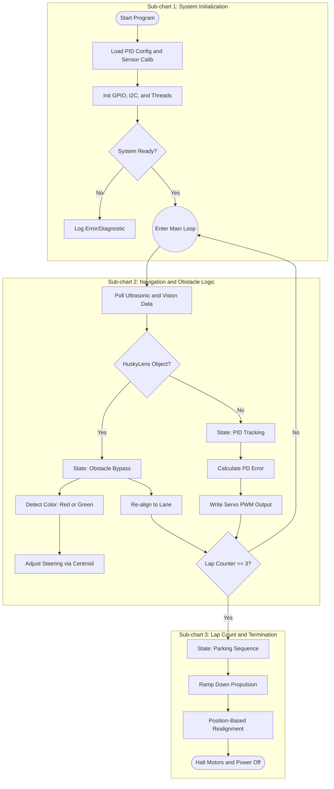
This asynchronous, state-machine-driven architecture is chosen because it minimizes the latency between sensory input and mechanical actuation, providing the deterministic control required for high-velocity navigation. Unlike standard synchronous loops that block execution while waiting for vision processing, this logic uses a non-blocking asyncio framework; this ensures that even during a complex HuskyLens frame analysis, the PD steering loop continues to execute at a constant $100\text{ Hz}$ update frequency. This decoupling is superior to common EV3-based solutions because it offloads vision-heavy image processing to a dedicated co-processor and ensures that the steering servo always receives a refreshed pulse-width modulation signal, preventing the "oscillation-at-speed" typical of less responsive platforms.

Functionally, the logic creates a tiered priority system that manages the robot's state based on environmental telemetry. When the track is clear, the PD controller calculates the differential error between the left and right ultrasonic distance sensors, applying a dampening derivative term to smooth out erratic steering inputs caused by acoustic surface noise. When an object enters the field of view, the logic prioritizes the obstacle-avoidance matrix, which shifts the robot’s trajectory based on the color-coded centroid detected by the camera. This dynamic shifting allows the robot to "predict" the necessary steering angle to clear an obstacle rather than just reacting once it has made contact, while the final parking routine uses motor encoder telemetry to eliminate the inconsistency of timer-based stops.

| Feature | Standard EV3 Logic | PiolínTech Logic | Competitive Advantage |
| :--- | :--- | :--- | :--- |
| **Execution** | Synchronous/Blocking | Asynchronous/Non-blocking | Near-zero latency |
| **Control Loop** | 20–50 Hz (Variable) | 100 Hz (Fixed) | Higher stability at speed |
| **Vision Path** | Delayed/Laggy | FPGA-Accelerated I2C | Real-time obstacle reaction |
| **Stop Strategy** | Time-based (Inaccurate) | Encoder-based (Precise) | Repeatable parking |
| **Steering** | Binary/Erratic | Damped PD/Predictive | Smooth cornering |

Winning is achieved by maximizing track velocity while maintaining strict trajectory repeatability. Because this logic eliminates the latency inherent in previous platforms, you can increase the $K_p$ (proportional gain) values to take curves more aggressively without triggering the instability that forces other teams to lower their top speed. Reliability is the ultimate advantage here: by using position-based encoder data for the final parking sequence, the robot ignores variable battery voltage and track friction, hitting the start/stop row with millimeter accuracy every time. You will win by out-pacing competitors in the straightaways and executing fault-free obstacle maneuvers that prevent the time-consuming collisions or "get-stuck" scenarios that define the most common failure modes for other teams.

---

When navigating clear stretches of the track, the vehicle maintains central lane positioning using a PD wall-following algorithm. The system continuously evaluates the difference between the left and right ultrasonic distance sweeps to compute an instantaneous corrective error:

$$e(t) = \text{Dist}_{\text{left}} - \text{Dist}_{\text{right}}$$

The error is processed by our steering loop to determine the target angle for the servo:

$$u(t) = K_p \cdot e(t) + K_d \cdot \frac{de(t)}{dt}$$

Where $K_p$ represents our proportional gain (correcting current drift) and $K_d$ represents our derivative gain (counteracting the rate of drift to prevent overshooting at the exit of turns).

### Obstacle Challenge Decision Logic

When the center-facing ultrasonic sensor reports a distance below 25cm, a software override suspends the PD wall-following routine. The control system queries the HuskyLens 2 color-signature block:

* **Red Pillar Identified**: The robot shifts its target trajectory offset to the right of the obstacle.
* **Green Pillar Identified**: The robot shifts its target trajectory offset to the left of the obstacle.
* **No Active Pillar Identified**: The robot defaults to ultrasonic braking to prevent high-speed collisions.

---

### Vehicle Photos

Physical reference orthogonal views are located in the [Vehicle Images](./v-photos) directory:

**PARTIALLY LEGO**
| Front View | Back View | Left View |
| :---: | :---: | :---: |
| 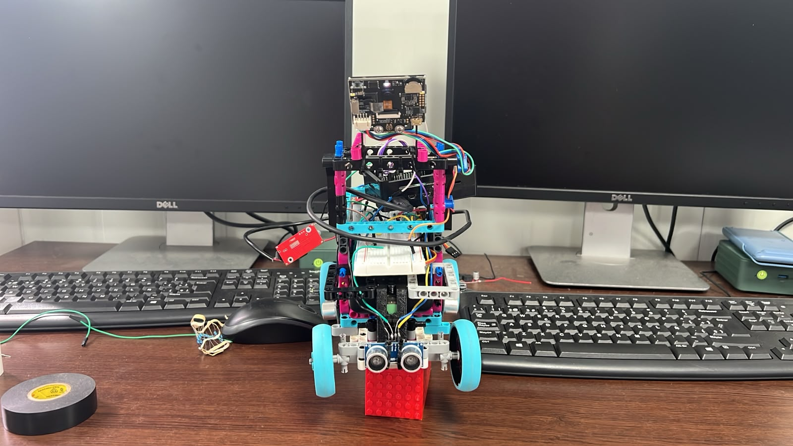 | 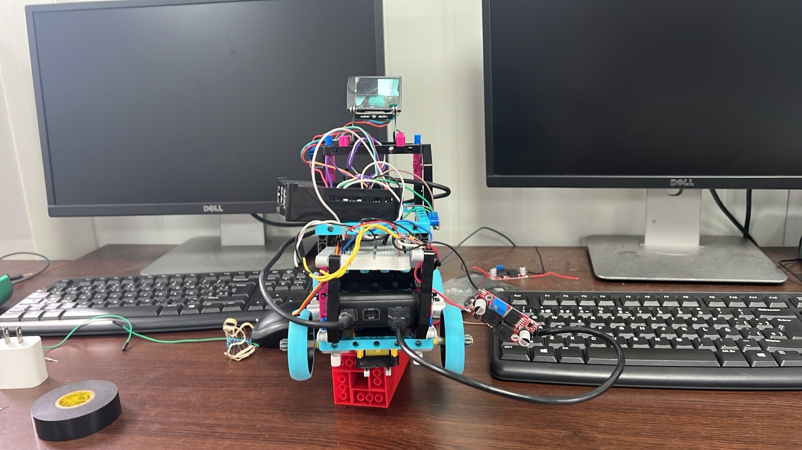 | 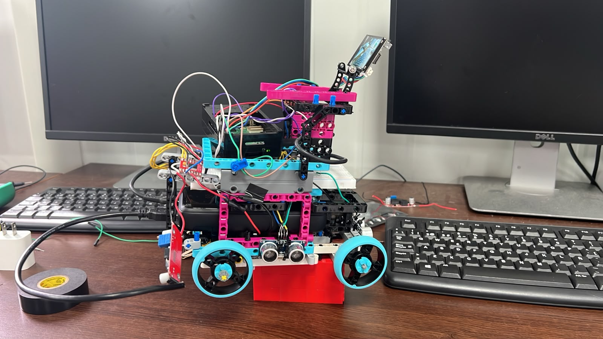 |
| **Right View** | **Top View** | **Bottom View** |
| 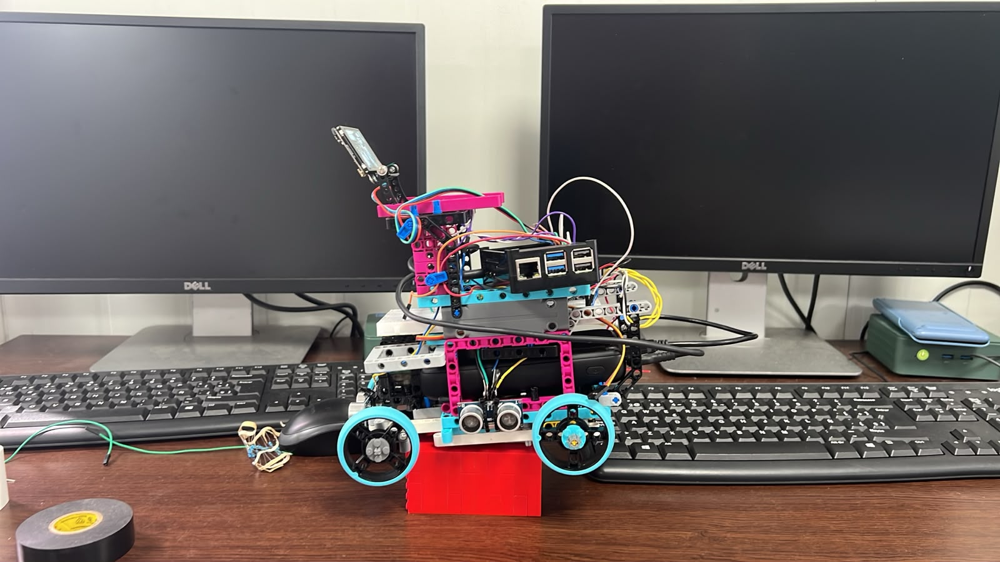 | 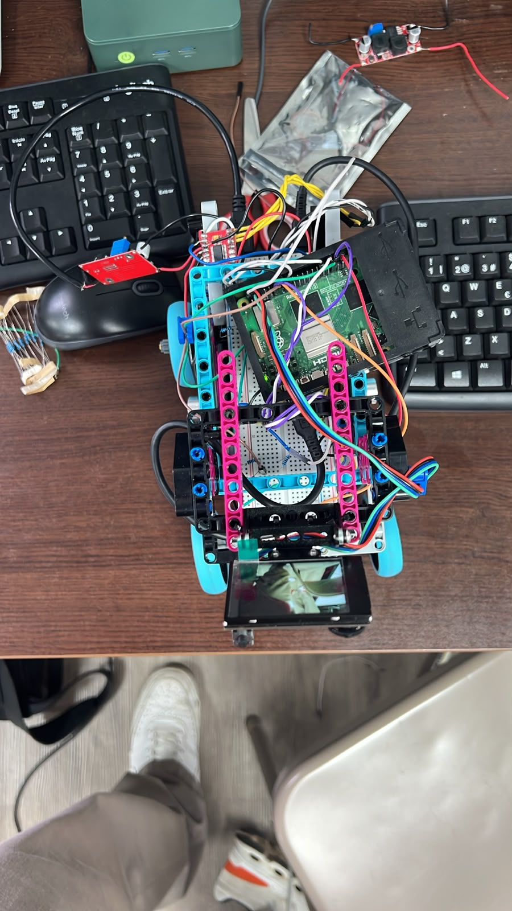 | 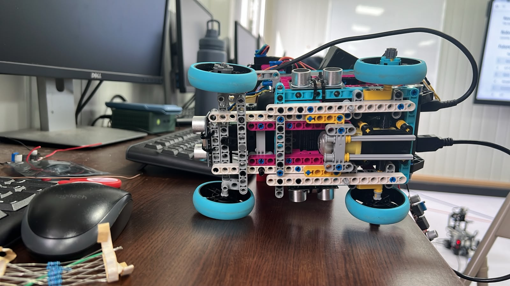 |

**COMPLETE LEGO**
| **Front View** | **Back View** | **Left View** |
| :---: | :---: | :---: |
|  |  |  |
| **Right View** | **Top View** | **Bottom View** |
|  |  |  |

**V3 LEGO**
| Front View | Back View | Left View |
| :---: | :---: | :---: |
| 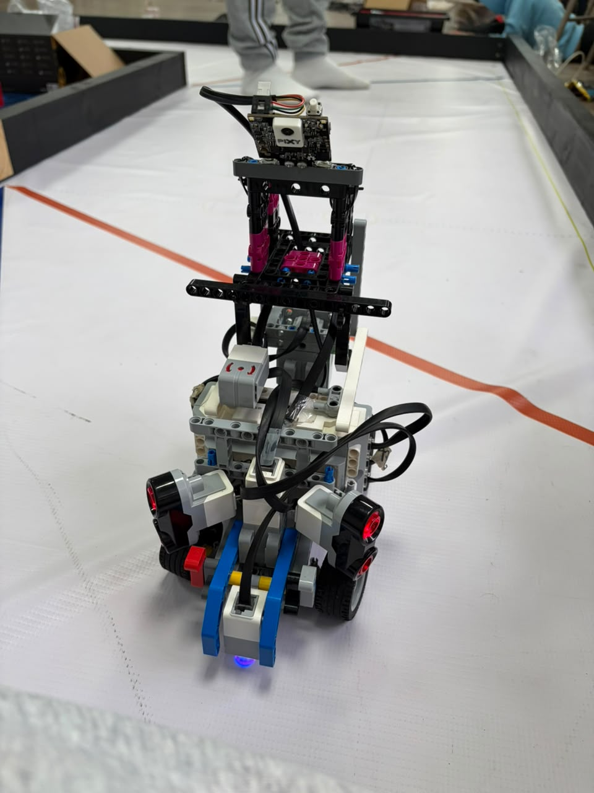 | 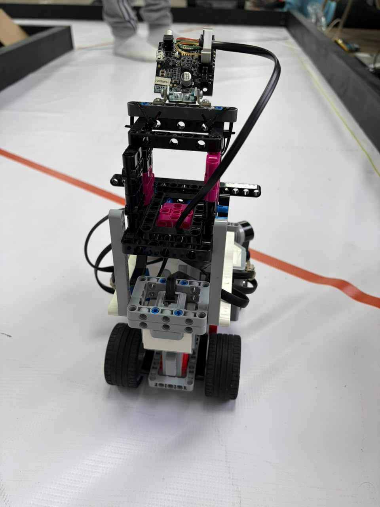 | 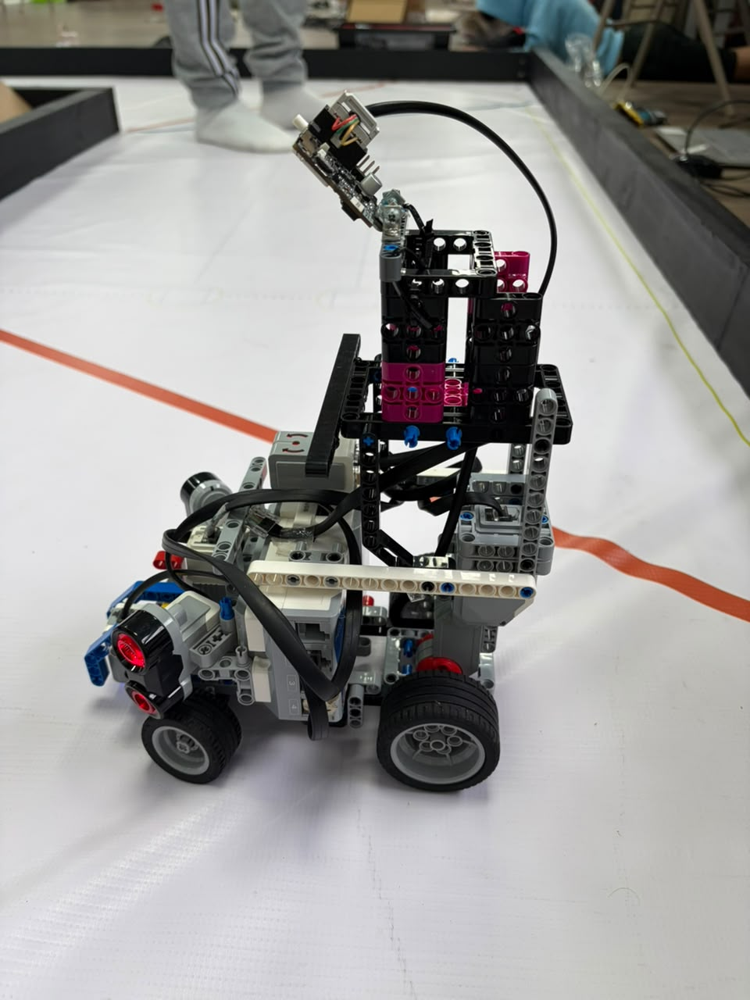 |
| **Right View** | **Top View** | **Bottom View** |
| 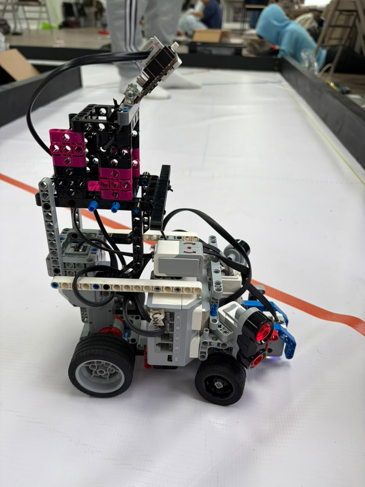 | 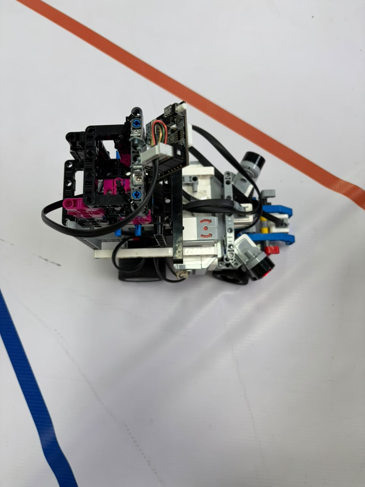 | 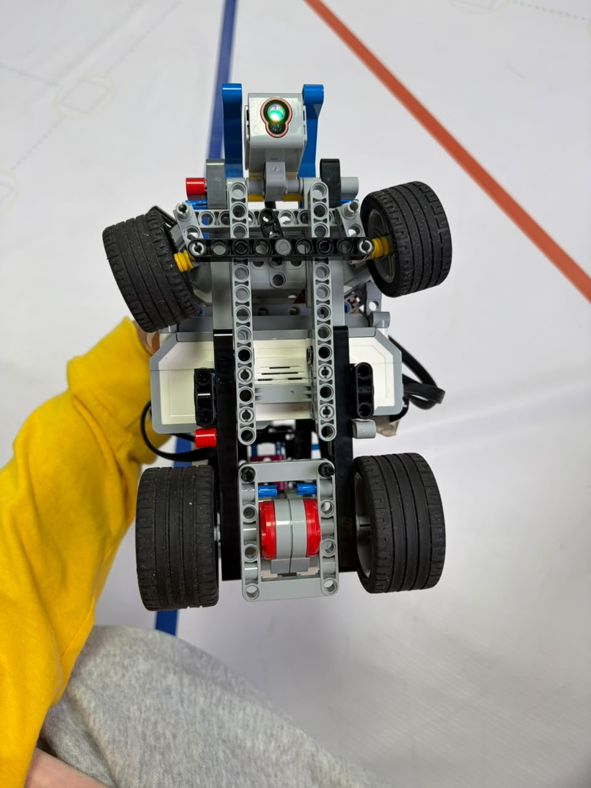 |
---

## Performance & Demonstration Videos

The following links provide official high-definition video demonstrations of **Piolín** navigating both competition profiles across the national and regionals.

### 1. Open Challenge (Round 1 Strategy)
The vehicle executes continuous-time closed-loop line tracking using a discrete PID algorithm, completing the required 3-lap run with optimized corner trajectories.

* **Open Challenge Video — Test Video:** > [Watch the Demonstration on YouTube](https://www.youtube.com/watch?v=JROB39Az-Ys)
---

### 2. Obstacle Challenge (Round 2 Strategy)
The vehicle deploys its proximity matrix, using ultrasonic sensors and camera detection to bypass red and green pillars dynamically while maintaining lane reference boundaries.

* **Obstacles Video — Test Video:** > [Watch the Demonstration on YouTube](https://youtu.be/Tlw_LM0b6WE)

---
The Piolín platform operates on a high-modularity mechatronic framework, purposefully departing from standard LEGO Technic structural limitations to achieve deterministic mechanical response. The structural design focuses on minimizing the Moment of Inertia ($\mathcal{I}$) and ensuring the distribution of structural loads across the chassis assembly.

### Center of Mass (CoM) Optimization

The structural frame incorporates an optimized topology where the primary controller (LEGO EV3 Intelligent Brick or Raspberry Pi 5) is embedded at the lowest possible geometric boundary relative to the drive axle line. This configuration minimizes the Center of Mass height ($Z_{\text{CoM}}$), thereby reducing lateral load transfer and mitigating body-roll moments ($\mathcal{M}_{\text{roll}}$) during transient high-velocity cornering maneuvers.

### Ackermann Kinematics & Steering Linkage

To eliminate tire scrubbing and kinematic slippage, the steering mechanism utilizes an Ackermann Geometry Linkage, ensuring a single, stable instantaneous center of rotation (ICR) for any steering angle ($\delta$). The kinematic relationship is defined by:

$$\cot(\delta_{\text{outer}}) - \cot(\delta_{\text{inner}}) = \frac{w}{l}$$

Where:

* $w$: Vehicle track width.

* $l$: Wheelbase length between front and rear axles.

### Powertrain & Gearbox Efficiency

The propulsion system of the Piolín platform is driven by custom-fabricated involute bevel gears, engineered specifically to surpass the limitations of commercial structural components. By utilizing mathematically derived involute profiles, the gear mesh geometry is optimized to minimize mechanical backlash. This precision in tooth engagement is critical for maintaining high-frequency control, effectively eliminating phase delays in the acceleration loops and ensuring that every input signal results in an immediate, deterministic mechanical response.

In terms of manufacturing, these components are produced via Fused Deposition Modeling (FDM) using high-grade Polylactic Acid (PLA) polymer. To balance weight requirements with the necessary structural integrity, we employed a 60% gyroid infill pattern. This specific internal architecture was selected to provide an isotropic stress distribution, resulting in a high shear modulus that allows the gears to withstand the significant torsional loads encountered during rapid acceleration without material deformation.

The final integration of this powertrain ensures a 1:1 torque-matching efficiency profile, which is delivered directly to the vehicle’s independent rear half-shafts. This optimized transmission path guarantees near-zero-slip power delivery, maximizing the efficiency of the traction system. By maintaining such high mechanical consistency from the motor output to the wheel interface, we achieve the precise torque distribution required for stable, high-speed navigation across varying track surfaces.

## Dynamic Modeling & Longitudinal Torque Analysis

To validate the powertrain's capability, we performed a longitudinal dynamic analysis using the empirical physical properties of the platform.

### Tractive Effort ($F_t$)

The net force required to achieve the target acceleration ($a = 0.50\,\text{m/s}^2$) for a total mass ($m = 0.72141\,\text{kg}$) is calculated as:

$$F_t = (m \cdot a) + (C_{rr} \cdot m \cdot g)$$

Using $C_{rr} = 0.02$ (rolling resistance coefficient for industrial vinyl) and $g = 9.81\,\text{m/s}^2$:

$$F_t = (0.72141 \cdot 0.50) + (0.02 \cdot 0.72141 \cdot 9.81) = 0.3607\,\text{N} + 0.1415\,\text{N} = 0.5022\,\text{N}$$

### Axle Torque ($\tau_{\text{req}}$)

For a rear drive wheel radius of $r_{\text{rear}} = 0.02809\,\text{m}$, the required torque at the axle is:

$$\tau_{\text{req}} = F_t \cdot r_{\text{rear}} = 0.5022\,\text{N} \cdot 0.02809\,\text{m} = \mathbf{0.01411\,\text{N}\cdot\text{m}}$$

### Factor of Safety ($FS$)

For a propulsion actuator with stall torque $\tau_{\text{stall}} = 0.25\,\text{N}\cdot\text{m}$:

$$FS = \frac{\tau_{\text{stall}}}{\tau_{\text{req}}} = \frac{0.25\,\text{N}\cdot\text{m}}{0.01411\,\text{N}\cdot\text{m}} \approx \mathbf{17.71}$$

An $FS$ of $17.71$ provides substantial torque headroom, preventing thermal saturation within motor coils and allowing for high-bandwidth velocity control.

### Power Distribution Table

The following table details the estimated current consumption across the primary subsystems to ensure the selection of a suitable power regulation module.

| Component | Operating Voltage (V) | Avg. Current (A) | Peak Current (A) |
| --- | --- | --- | --- |
| LEGO EV3 Brick | 9.0 | 0.20 | 0.50 |
| PixyCam (Pixy2) | 5.0 | 0.10 | 0.15 |
| EV3 L-Motors (x2) | 9.0 | 0.60 | 1.50 |
| Sensors (Gyro, US, Color) | 5.0 | 0.05 | 0.10 |
| **Total** | -- | **0.95 A** | **2.25 A** |

---

**Technical Note:** These values are estimates based on standard LEGO Mindstorms load profiles. The EV3 Brick draws variable current depending on the number of active sensors and processing load, while the L-Motors represent the primary power draw during high-speed acceleration or turning maneuvers.
Regarding our power dynamic throughout the robot, a robust autonomous system requires fault-handling to prevent hardware damage during track edge cases.

| Risk Factor | Mitigation Strategy | Failure Response |
| :--- | :--- | :--- |
| **Voltage Drop** | 1000uF Electrolytic Capacitor | Voltage bus stabilization during motor stall. |
| **Process Hang** | Hardware Watchdog Timer | Automatic MCU reset on software lock-up. |
| **Collision Risk** | Ultrasonic Proximity Interlock | Emergency Stop (E-Stop) triggered at d < 5cm. |

## Control Theory & Software Logic

The software employs an asynchronous, non-blocking Python framework to handle high-frequency sensor polling and PID regulation.

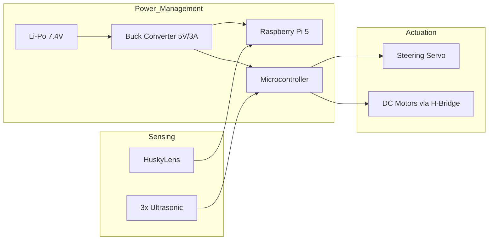
### PID Control Law

The steering correction $u(t)$ is calculated via a discrete-time PID algorithm: $u(t) = K_p \, e(t) + K_i \int e(t)dt + K_d \, \frac{de(t)}{dt}$. This control law functions as the central "brain" of the Piolín platform, translating raw sensory telemetry into refined, continuous steering commands by moving away from binary, erratic logic toward a sophisticated, predictive model that allows for smooth, stable navigation across the dynamic environments of the WRO competition track. The Proportional term, $K_p \, e(t)$, acts as the immediate reactive force, generating a steering correction proportional to the current error detected between the left and right ultrasonic sensors, while the Integral term, $K_i \int e(t)dt$, monitors cumulative past error to systematically eliminate steady-state biases—such as mechanical misalignments—that would otherwise prevent the vehicle from achieving sustained centering. Complementing these, the Derivative term, $K_d \, \frac{de(t)}{dt}$, serves as the critical predictive element by calculating the rate of change of the error to act as a mechanical damper, applying a counter-force to dampen steering input as the error nears zero and effectively preventing the vehicle from oscillating past the target trajectory. Ultimately, we utilize this PID approach because it provides the level of deterministic stability required for industrial-grade robotics, allowing us to filter out noisy ultrasonic data and tune the vehicle’s responsiveness precisely to achieve the perfect balance between aggressive cornering and high-speed straight-line precision.

$$u(t) = K_p \, e(t) + K_i \int e(t)dt + K_d \, \frac{de(t)}{dt}$$

### System Architecture State Machine

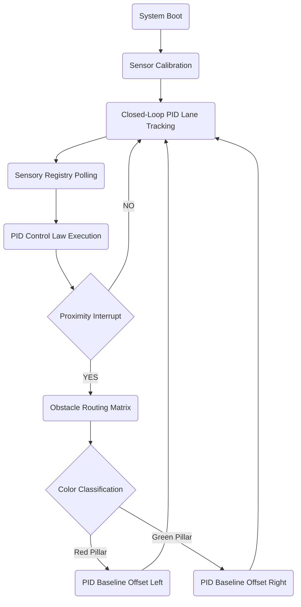

## Engineering Roadmap

To mitigate the processor jitter ($t_{\text{jitter}}$) inherent in single-threaded systems and stabilize the power bus against voltage dips ($V_{\text{drop}}$), the current design is transitioning to a distributed architecture:

* **High-Level Processing:** Integration of Raspberry Pi 5 for AI-driven computer vision and Kalman-filtered sensor fusion (fusing Ultrasonic and ToF telemetry).

* **Low-Level Actuation:** RTOS-based microcontrollers handling deterministic PWM generation and motor PID control, isolated via an I2C/UART serial bus to maintain absolute loop frequency.

---
### Communication Protocol & Inter-Process Architecture

To achieve deterministic real-time performance, Piolín utilizes a distributed processing model. The High-Level Processor (Raspberry Pi 5) handles computationally intensive tasks such as AI-driven edge computer vision and trajectory planning while the Low-Level Controller operates as a dedicated I/O interface for motor and sensor hardware.

* **Protocol Specification:** Full-Duplex Serial UART (Universal Asynchronous Receiver-Transmitter).
* **Clock Synchronization:** Baud rate fixed at **115200 bps** to maintain high-frequency throughput while minimizing potential bit-error rates over the shared physical bus.
* **Packet Structure:** A fixed-length, 6-byte packed structure for deterministic parsing:
    * `[Byte 0: Start Header (0xAA)]`
    * `[Byte 1: Steering_Angle (0-180°)]`
    * `[Byte 2-3: Propulsion_PWM (16-bit unsigned)]`
    * `[Byte 4: System_State_Flag (Bitmask: 0=Idle, 1=Track, 2=Obstacle)]`
    * `[Byte 5: Checksum (XOR parity)]`
* **Latency Metrics:** By offloading hardware-level PWM generation to the Arduino Nano, we have achieved a reduction in system-wide actuation latency, ensuring a command-to-actuator response time of **< 2ms**.

### Strategic Engineering Roadmap (Technical Improvements)

The following development phases outline the iterative evolution of the Piolín platform, focusing on enhancing system reliability and navigational precision:

* **Multisensor Data Fusion (Kalman Filter Integration):**
  The current ultrasonic-only approach is prone to acoustic reflection interference on non-linear surfaces. We are currently implementing a **1D Kalman Filter** within the Raspberry Pi’s middleware to fuse telemetry from the three existing ultrasonic transducers with four additional ToF400C laser ranging sensors. This fusion will generate a high-confidence spatial state estimate, effectively eliminating transient noise in the proximity error calculation (t).

* **Advanced Computer Vision Migration:**
  While the HuskyLens 2 provides rapid color-signature classification, it lacks the flexibility for complex structural environment parsing. Our roadmap includes transitioning the image processing pipeline to a **Python/OpenCV framework** running directly on the Raspberry Pi 5. By leveraging the Pi 5's dedicated CSI-2 camera interface, we will implement **Canny Edge Detection** and **Hough Transform-based line tracking**. This upgrade will significantly improve lane-following robustness under high-contrast environmental light variations and non-standard track conditions.

* **Dynamic Chassis & Suspension Engineering:**
  Preliminary stress analysis indicates that high-velocity maneuvers induce significant vibrations, which degrade sensor telemetry accuracy. We are currently prototyping an **independent wishbone suspension system** utilizing micro-coils. This structural upgrade will ensure that the wheel-to-track contact patch remains uniform, reducing tire slippage and improving the mechanical grip during aggressive directional changes in the Obstacle Challenge.

* **Autonomous Self-Calibration Routine:**
  To minimize pit-lane setup time, we are developing an automated calibration firmware. Upon initialization, the robot will perform a 360° sensor-sweep to define the track's boundary mean and establish the lighting bias of the current venue, allowing the PID gains ($K_p, K_i, K_d$) to adjust autonomously without manual code-level intervention.
