<h1 align="center">Welcome to the PiolínTech Repository ꒰ঌ( •ө• )໒꒱ </h1>

<h3 align="center">
WRO Future Engineers 2026 · Panama
</h3>

<p align="center">
  
</p>

<p align="center">
  <b>Meet Piolín — our autonomous EV3 vehicle developed for WRO Future Engineers 2026.</b>
</p>

<div align="center">

  <a href="https://youtube.com/@piolintech">
    
  </a>

  <a href="https://instagram.com/piolintech">
    
  </a>

  <a href="https://github.com/Piolintech123/WRO2026-FE-PiolinTech">
    
  </a>

</div>

<p align="center">
  
  
  
</p>

<p align="center">
  
  
  
  
  
</p>

---

## Project Summary

**Piolín** is the autonomous robotic vehicle developed by PiolínTech for the **WRO Future Engineers 2026 Self-Driving Car Challenge**. The robot is built around a LEGO MINDSTORMS EV3 controller and uses a car-like architecture with rear propulsion and Ackermann-style front steering.

Our objective is not only to complete the competition track. Piolín has been developed as a complete electromechanical system in which mechanical geometry, sensor placement, perception, control software, and physical testing continuously affect one another. A mechanical modification can change sensor readings, a sensor relocation can require new calibration, and a software change is only useful when the physical vehicle can reproduce the expected behavior.

The current vehicle uses an EV3 Large Motor for propulsion and an EV3 Medium Motor for steering. Two lateral EV3 Ultrasonic Sensors provide track geometry, while a downward-facing EV3 Color Sensor identifies physical floor landmarks. Sensor Port S1 is round-specific: the **Open Challenge uses an EV3 Gyro Sensor**, while the **Obstacle Challenge uses Pixy2.1**.

This repository documents the complete development process behind Piolín, including mechanics, power, sensors, software, obstacle avoidance, parking, testing, failures, calibration, technical diagrams, 3D-printed components, source code, videos, and the evolution of the robot since 2025.

---

# General Project Index

This index provides direct access to the most important parts of the PiolínTech repository. Each section corresponds to a major engineering area of the robot and contains the deeper technical documentation behind the summaries shown in this README.

---

## 1. Mobility & Mechanical Design

*This section explains how Piolín moves, steers, and maintains a mechanically repeatable vehicle geometry.*

- **[Mechanical Architecture](./docs/mobility_mechanical/01_mecharchitecture.md)**  
  Explains the complete mechanical organization of Piolín and how the main assemblies interact.

- **[Chassis Design](./docs/mobility_mechanical/02_chassis.md)**  
  Documents structural layout, reinforcement, component placement, and chassis development.

- **[Robot Mobility](./docs/mobility_mechanical/03_RMobility.md)**  
  Covers the vehicle's movement behavior and the relationship between propulsion and steering.

- **[Ackermann Steering](./docs/mobility_mechanical/04_steering.md)**  
  Explains the geometry, mechanism, steering angles, limitations, and physical tuning of the front axle.

- **[Drivetrain](./docs/mobility_mechanical/05_drivetrain.md)**  
  Documents Motor A, rear propulsion, wheel transmission, and drivetrain behavior.

- **[Mechanical Testing](./docs/mobility_mechanical/06_testing.md)**  
  Shows how mechanical changes are evaluated through repeated physical tests.

<p align="center">
  <a href="./docs/mobility_mechanical/">
    
  </a>
</p>

---

## 2. Power & Sensor Architecture

*This section documents how Piolín is powered, how its sensors are connected, and what information each device contributes to autonomous navigation.*

- **[Power & Sensor Configuration](./docs/power_sensors/01_PowerSensorconfig.md)**  
  Provides the complete overview of Piolín's current power and sensing architecture.

- **[Ultrasonic Sensor Design](./docs/power_sensors/02_USSensorD.md)**  
  Explains the two lateral sensors, their mounting geometry, and how S2 and S3 are interpreted.

- **[Color Sensor](./docs/power_sensors/03_color_sensor.md)**  
  Documents S4 floor detection, Blue/Orange recognition, event confirmation, and calibration.

- **[Pixy2.1 Vision](./docs/power_sensors/04_pixycam.md)**  
  Explains the current camera installation used during the Obstacle Challenge.

- **[Sensor Calibration](./docs/power_sensors/05_Calibration.md)**  
  Covers the practical calibration process required after changes to sensor mounting or environment.

- **[Technical Schemes](./schemes/README.md)**  
  Contains the EV3 electrical reference, port map, complete robot scheme, and Open configuration.

<p align="center">
  <a href="./docs/power_sensors/">
    
  </a>
  <a href="./schemes/README.md">
    
  </a>
</p>

---

## 3. Software Architecture & Obstacle Strategy

*This section contains the autonomous logic behind Piolín, from basic navigation and corner handling to vision, obstacle avoidance, course events, and parking.*

- **[Software Architecture](./docs/software_obstacles_strategy/01_SWArchitecture.md)**  
  Explains how sensing, perception, states, controllers, and actuation are organized.

- **[Navigation State Machine](./docs/software_obstacles_strategy/02_statemachine.md)**  
  Describes how Piolín changes behavior depending on its current physical situation.

- **[Wall Following & Geometry](./docs/software_obstacles_strategy/03_wallfollowing.md)**  
  Covers lateral navigation using the left and right Ultrasonic Sensors.

- **[Corner Handling](./docs/software_obstacles_strategy/04_cornerhandling.md)**  
  Explains why corners require different logic from ordinary straight navigation.

- **[Obstacle Detection](./docs/software_obstacles_strategy/05_obstacledetec.md)**  
  Documents how Pixy detections are validated before affecting the vehicle.

- **[Obstacle Strategy](./docs/software_obstacles_strategy/06_obstaclestrateg.md)**  
  Covers Red-right, Green-left passing logic, target handling, pass confirmation, and recovery.

- **[Software Tuning](./docs/software_obstacles_strategy/07_softwaretuning.md)**  
  Documents the process used to adjust controller behavior through track testing.

- **[Pixy Vision Processing](./docs/software_obstacles_strategy/08_CameraPXVision.md)**  
  Explains how signature, position, width, and height data are interpreted.

- **[RGB Detection](./docs/software_obstacles_strategy/09_RGBdetection.md)**  
  Covers floor-color classification and the logic used to separate relevant color regions.

- **[Color & Lap Counting](./docs/software_obstacles_strategy/10_color_and_lap_counting.md)**  
  Explains course-event detection, duplicate prevention, and progress counting.

### Parking

- **[Parking Overview](./docs/software_obstacles_strategy/parking/01_ParkingOverview.md)**  
  Introduces the complete parking problem and its role in the final navigation sequence.

- **[Parking Algorithm](./docs/software_obstacles_strategy/parking/02_ParkingAlgorithm.md)**  
  Describes the intended approach, entry, alignment, and stopping logic.

- **[Parking Geometry](./docs/software_obstacles_strategy/parking/03_ParkingGeom.md)**  
  Connects steering geometry and physical vehicle placement to parking behavior.

- **[Parking Calibration](./docs/software_obstacles_strategy/parking/04_ParkingCalib.md)**  
  Documents the parameters that must be tuned on the real track.

- **[Parking Testing](./docs/software_obstacles_strategy/parking/05_Parkingtesting.md)**  
  Records how parking performance is validated through repeated runs.

### Source Code

- **[Round 1 — Open Code](./code/round1/ev3v1.py)**  
  Published Open Challenge EV3 source code.

- **[Round 1 Code Explanation](./code/round1/r1_exp.md)**  
  Detailed explanation of the Open program and its development logic.

- **[Round 2 — Obstacle Code](./code/round2/ev3v1.py)**  
  Published Obstacle Challenge source code.

- **[Round 2 Code Explanation](./code/round2/r2_exp.md)**  
  Explains Pixy2.1, Ultrasonic control, pillar logic, and the limitations of the published version.

<p align="center">
  <a href="./docs/software_obstacles_strategy/">
    
  </a>
  <a href="./code/">
    
  </a>
</p>

---

## 4. Systems Thinking & Engineering Decisions

*This section explains why Piolín looks and behaves the way it does today, including alternatives, failures, trade-offs, risks, and the engineering decisions made throughout development.*

- **[Engineering Process](./docs/systems_engineering/01_engineeringprocess.md)**  
  Explains the observe–hypothesize–test–compare development method used by the team.

- **[Decision Log](./docs/systems_engineering/02_decisionlog.md)**  
  Records major design decisions and the reasoning behind them.

- **[Design Constraints](./docs/systems_engineering/03_designconstraints.md)**  
  Documents competition, mechanical, sensor, and software limitations that shaped the robot.

- **[Trade-offs](./docs/systems_engineering/04_tradeoffs.md)**  
  Compares alternatives and explains why specific solutions were selected.

- **[Risks & Mitigation](./docs/systems_engineering/05_risksandmitigation.md)**  
  Identifies important failure conditions and how the design attempts to reduce their impact.

- **[What Didn't Work](./docs/systems_engineering/06_whatdidntwork.md)**  
  Preserves unsuccessful ideas and explains what the team learned from them.

- **[Project Timeline](./t-gtku/timeline.md)**  
  Follows the complete PiolínTech journey from the first 2025 prototypes to the current robot.

- **[Robot Evolution](./models/evolution/Phase1.md)**  
  Documents how the physical and sensing architecture evolved through multiple phases.

<p align="center">
  <a href="./docs/systems_engineering/">
    
  </a>
  <a href="./t-gtku/timeline.md">
    
  </a>
</p>

---

## 5. Reproducibility & GitHub Quality

*This section contains the material required to understand how Piolín is assembled, wired, configured, calibrated, programmed, tested, and reproduced.*

- **[Reproducibility Overview](./docs/reproducibility/01_ReproducibilityOverview.md)**  
  Introduces the complete process for reproducing Piolín's hardware and software configuration.

- **[Bill of Materials](./docs/reproducibility/02_BOM.pdf)**  
  Lists the components required for the robot.

- **[Wiring Guide](./docs/reproducibility/03_wiring.md)**  
  Shows how motors, sensors, and round-specific devices are connected to the EV3.

- **[Electrical Schematics](./docs/reproducibility/04_elecschem.md)**  
  Provides the electrical reference and connection diagrams for the current system.

- **[Software Setup](./docs/reproducibility/05_softwaresetup.md)**  
  Explains how the EV3 environment is prepared and how the competition programs are transferred.

- **[Calibration Guide](./docs/reproducibility/06_HowToCalibrate.md)**  
  Covers steering, sensors, vision, and track calibration.

- **[Testing Protocol](./docs/reproducibility/07_TestingProtocol.md)**  
  Defines how PiolínTech performs repeatable tests and compares changes.

- **[Troubleshooting](./docs/reproducibility/08_Troubleshooting.md)**  
  Provides guidance for diagnosing common mechanical, sensor, and software failures.

- **[3D Printing Files](./models/3dprint/)**  
  Contains the printable Color Sensor and Pixy2.1 casing files and their manufacturing documentation.

- **[Vehicle Photo Archive](./v-photos/README.md)**  
  Provides visual evidence of the robot from early versions to the current V4 configuration.

- **[Videos](./videos/links.md)**  
  Contains autonomous driving demonstrations and test footage.

<p align="center">
  <a href="./docs/reproducibility/">
    
  </a>
  <a href="./docs/reproducibility/02_BOM.pdf">
    
  </a>
</p>

---

# Watch Piolín

The fastest way to understand Piolín is to see the robot operating on the physical WRO track. Our videos provide direct evidence of autonomous behavior under both competition configurations.

The Open Challenge demonstration shows Piolín operating with the gyro-based configuration, while the Obstacle Challenge demonstration shows the robot using its vision and obstacle-navigation architecture.

<p align="center">

<a href="https://www.youtube.com/watch?v=JROB39Az-Ys">
  
</a>

<a href="https://youtu.be/Tlw_LM0b6WE">
  
</a>

</p>

Additional demonstrations and testing material are available in [**videos/links.md**](./videos/links.md).

---

# Meet the Team

We are **PiolínTech**, a robotics team from Colegio Bilingüe de Panamá. The development of Piolín is a collaborative process involving mechanical construction, programming, testing, calibration, documentation, and engineering analysis.

Future Engineers has taught us that many problems cannot be separated into purely mechanical or purely software categories. A steering error may originate from code, but it can also result from linkage geometry or mechanical alignment. A sensor problem may originate from calibration, but it can also result from mounting position or lighting conditions. This systems perspective has strongly influenced the way we develop Piolín.

| Member | Information | Contact |
| :---: | :--- | :---: |
|  | **Sebastián Martínez**<br>Colegio Bilingüe de Panamá | [Instagram](https://www.instagram.com/sebastian.mvrl/) |
|  | **Mia Cantoral**<br>Colegio Bilingüe de Panamá | [Instagram](https://www.instagram.com/miaacnt) |
|  | **Christian Castrellón**<br>Colegio Bilingüe de Panamá | [Instagram](https://www.instagram.com/cj.chriss) |
| **Coach** | **Hanna Figueroa**<br>Colegio Bilingüe de Panamá | |

<p align="center">
  <a href="./t-gtku/officialpictureptech.md">
    
  </a>
  <a href="./t-gtku/funnypicture.md">
    
  </a>
</p>

---

# Meet Piolín

<p align="center">
  
</p>

The current V4 Piolín architecture is built around clearly defined subsystem responsibilities. Motor A handles propulsion, Motor B controls the Ackermann steering system, S2 and S3 observe lateral track geometry, and S4 detects physical floor landmarks.

S1 is the only major sensor port that changes between challenges. During Open, it contains the Gyro Sensor. During Obstacles, the gyro is removed and Pixy2.1 is installed instead.

Piolín currently has a measured mass of **0.84 kg**. The current physical configuration is approximately 250 mm long, approximately 119 mm across the front assembly, approximately 105 mm across the rear assembly, approximately 290 mm high, and has an approximate 120 mm wheelbase.

## Current Hardware

| System | Current Configuration |
| --- | --- |
| **Controller** | LEGO MINDSTORMS EV3 |
| **Propulsion** | EV3 Large Motor — Port A |
| **Steering** | EV3 Medium Motor — Port B |
| **Steering Geometry** | Ackermann-style |
| **Drive Layout** | Rear propulsion |
| **Left Distance Sensor** | EV3 Ultrasonic — S2 |
| **Right Distance Sensor** | EV3 Ultrasonic — S3 |
| **Floor Sensor** | EV3 Color Sensor — S4 |
| **Open S1 Device** | EV3 Gyro Sensor |
| **Obstacle S1 Device** | Pixy2.1 |
| **Battery** | EV3 Rechargeable Battery 45501 |
| **Measured Mass** | **0.84 kg** |

---

## Two Challenges, One Core Platform

The mechanical vehicle remains nearly identical between the two competition challenges. What changes is the type of information required from S1.

During Open, heading and rotation information are important, so the EV3 Gyro Sensor is installed. During Obstacles, visual classification becomes necessary, so Pixy2.1 replaces the gyro.

| Port | Open Challenge | Obstacle Challenge |
| :---: | --- | --- |
| **A** | Large Motor — propulsion | Large Motor — propulsion |
| **B** | Medium Motor — steering | Medium Motor — steering |
| **S1** | EV3 Gyro | Pixy2.1 |
| **S2** | LEFT Ultrasonic | LEFT Ultrasonic |
| **S3** | RIGHT Ultrasonic | RIGHT Ultrasonic |
| **S4** | Color Sensor | Color Sensor |

<p align="center">
  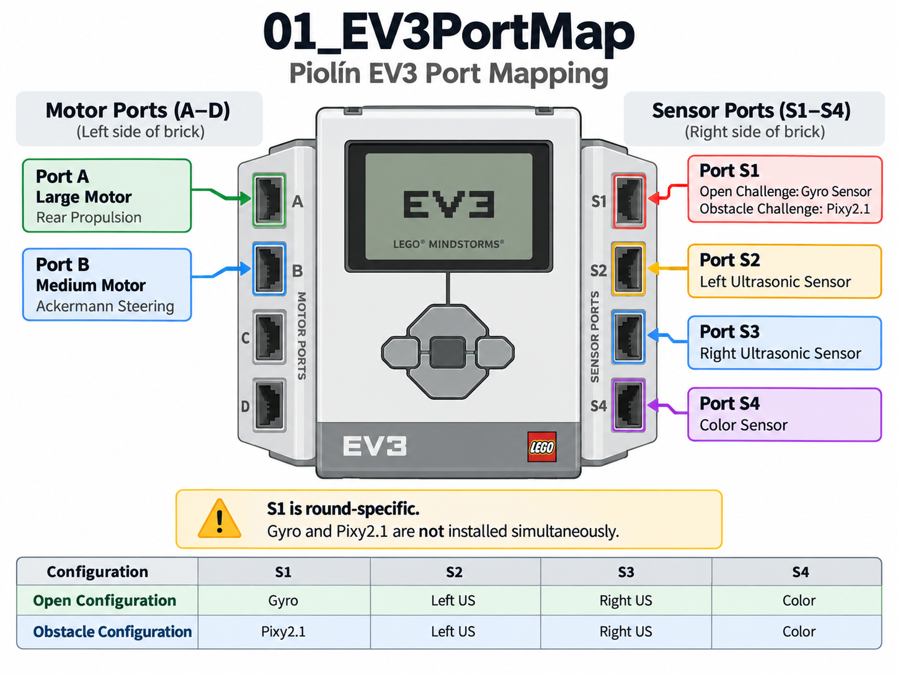
</p>

S2 remains physically left and S3 remains physically right in both challenges. Only their interpretation as the inner or outer sensor changes according to course direction.

---

<a id="mobility--mechanical-design"></a>

# Mobility & Mechanical Design

<p align="center">
  
</p>

Piolín uses a car-like architecture based on **rear propulsion and front Ackermann-style steering**. Motor A provides propulsion while Motor B changes the angle of the front wheels.

Unlike a differential-drive robot, Piolín follows curved trajectories through its steering geometry rather than by independently controlling left and right wheel speeds. Because of this, wheel alignment, steering geometry, motor position, tire behavior, and chassis rigidity all directly influence navigation.

<p align="center">
  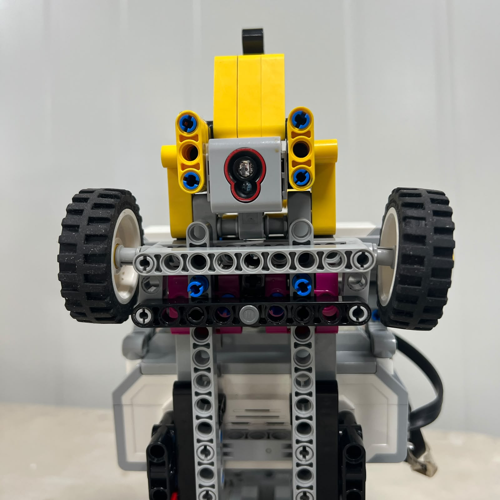
  
</p>

## Ackermann Steering

During a turn, the inner wheel follows a smaller radius than the outer wheel. The Ackermann mechanism allows the two front wheels to follow different steering angles instead of remaining parallel.

The ideal relationship can be represented by:

\[
\cot(\delta_{outer})-\cot(\delta_{inner})=\frac{w}{L}
\]

where \(w\) represents track width and \(L\) represents wheelbase.

This mathematical relationship provides a design reference, but the final steering response is validated physically because LEGO clearances, tire deformation, linkage geometry, wheel alignment, and Motor B limits affect the real trajectory.

<p align="center">
  
</p>

## Chassis & Drivetrain

Piolín's chassis evolved through repeated track testing. Mechanical revisions focused on maintaining steering alignment, supporting the EV3 securely, stabilizing sensor mounting, improving cable routing, and making the drivetrain more repeatable.

The current drivetrain uses an EV3 Large Motor on Port A. Maintaining propulsion inside the EV3 ecosystem simplifies electrical integration and gives the software direct access to motor encoder information.

<p align="center">
  
  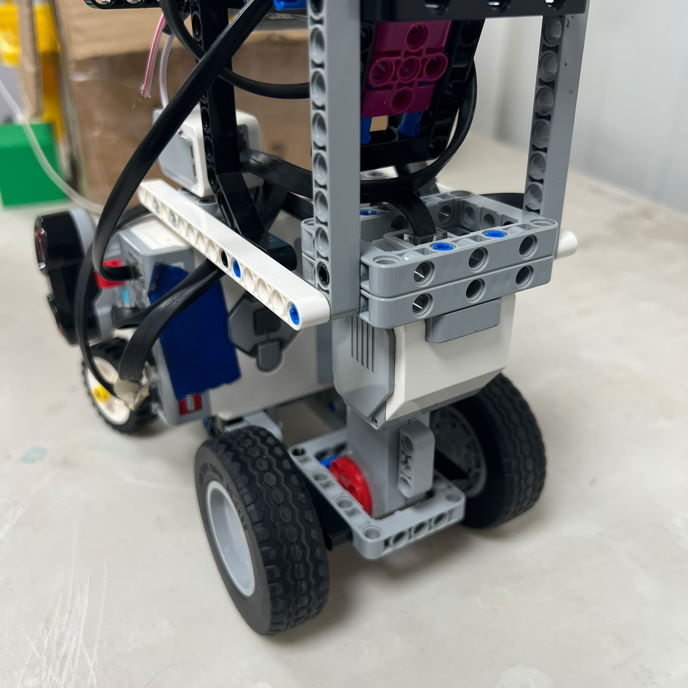
</p>

## Torque Reasoning

Piolín currently weighs **0.84 kg**, so drivetrain requirements are evaluated together with vehicle mass, wheel radius, acceleration, rolling resistance, and mechanical losses.

The longitudinal force requirement can be represented generally as:

\[
F_t = ma + F_{resistance}
\]

and the wheel torque as:

\[
\tau = F_t r
\]

Theoretical calculations provide an engineering reference, while actual drivetrain performance is verified through physical testing.

<p align="center">
  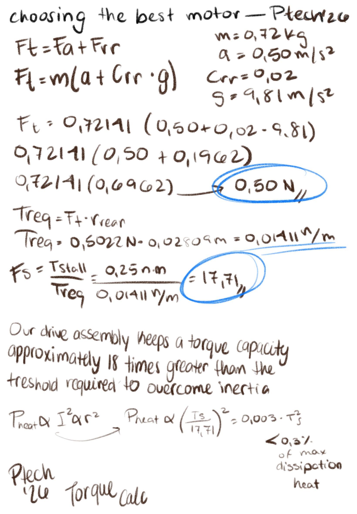
</p>

---

<a id="power--sensor-architecture"></a>

# Power & Sensor Architecture

<p align="center">
  
</p>

Piolín is powered by the official **LEGO MINDSTORMS EV3 Rechargeable DC Battery 45501**. The EV3 Brick acts as the central controller and provides the interfaces used by the motors and active sensors.

The current competition configuration avoids unnecessary external electronics. Piolín does not currently use a Raspberry Pi, external propulsion battery, custom H-bridge, or Arduino Nano. Earlier experiments using additional electronics remain preserved in the legacy documentation.

<p align="center">
  
  
</p>

## Ultrasonic Sensors

Piolín uses two lateral Ultrasonic Sensors. S2 observes the physical left side of the vehicle and S3 observes the right side.

Their measurements contribute to lateral track geometry, wall safety, course reacquisition, and obstacle recovery. Their mounting geometry is therefore treated as part of the calibrated navigation system.

<p align="center">
  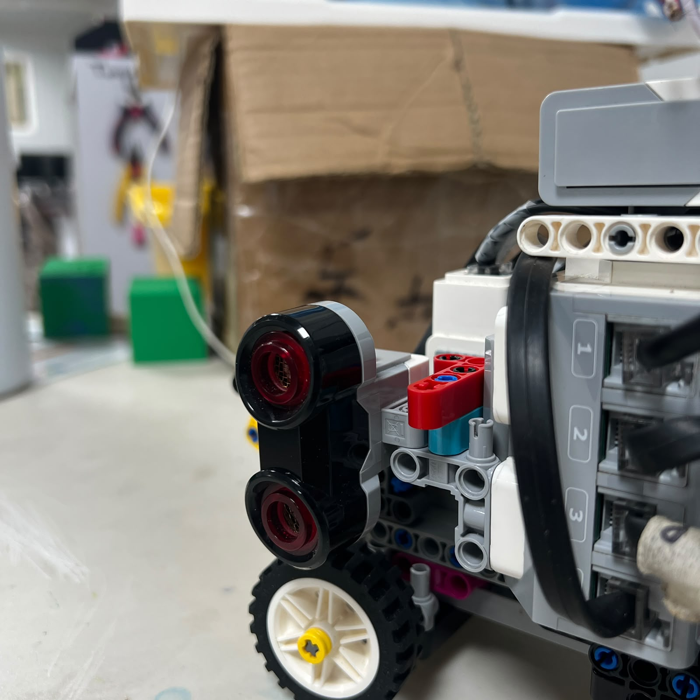
  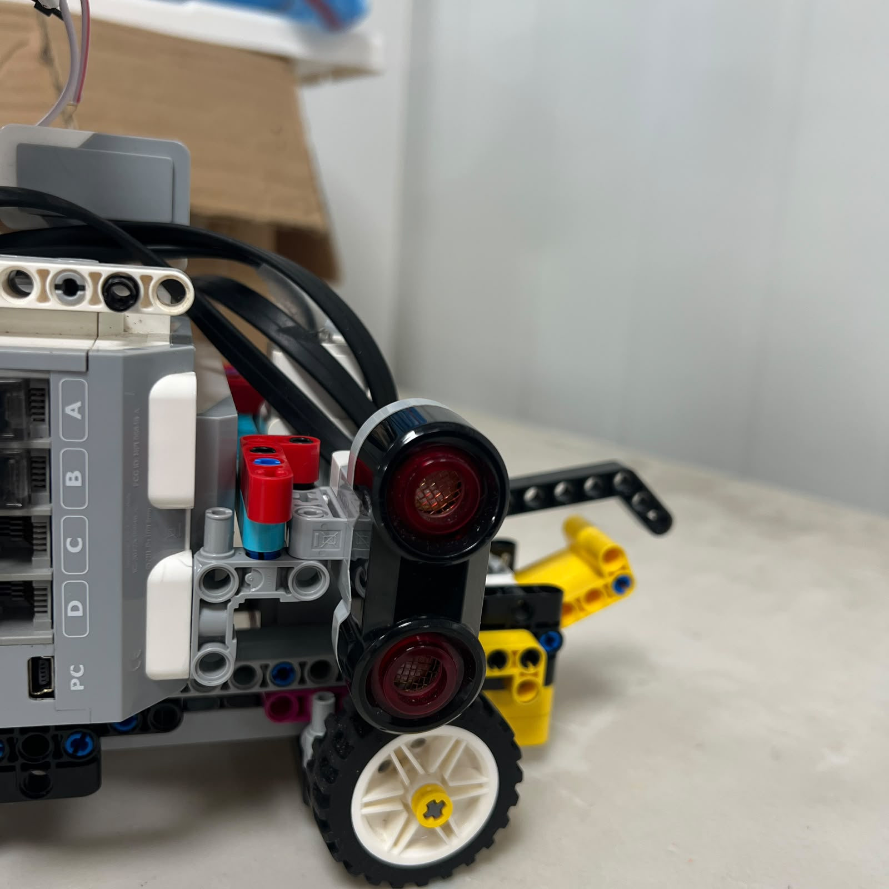
</p>

## Color Sensor

The downward-facing Color Sensor on S4 detects Blue and Orange course markings. A custom 3D-printed casing helps create a more controlled optical environment around the measurement area.

<p align="center">
  
  
</p>

## Round-Specific S1

During Open, S1 contains the EV3 Gyro Sensor and supplies heading and rotational information.

<p align="center">
  
</p>

During Obstacles, Pixy2.1 replaces the gyro and provides visual color-signature information.

<p align="center">
  
</p>

---

<a id="software--obstacle-strategy"></a>

# Software & Obstacle Strategy

<p align="center">
  
</p>

Piolín's software evolved from direct sensor reactions toward a layered control architecture. Sensor readings are interpreted in the context of the current physical situation before a steering decision is sent to Motor B.

A raw reading is not automatically a complete navigation event. Losing sight of a pillar does not prove that the obstacle has already been passed, and a sudden Ultrasonic change may happen because the vehicle is rotating through a corner.

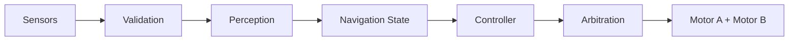
```mermaid
flowchart LR
    S[Sensors] --> V[Validation]
    V --> P[Perception]
    P --> ST[Navigation State]
    ST --> C[Controller]
    C --> A[Arbitration]
    A --> M[Motor A + Motor B]
```

---

## Round 1 — Open Challenge

The Open configuration combines lateral geometry from S2 and S3, heading information from the gyro, and physical course events from S4.

A first confirmed **Blue** marking indicates counterclockwise navigation, while a first confirmed **Orange** marking indicates clockwise navigation.

Straight sections combine lateral information and heading stabilization. Corners are handled separately because the geometry observed by the Ultrasonic Sensors changes as Piolín rotates.

<p align="center">
  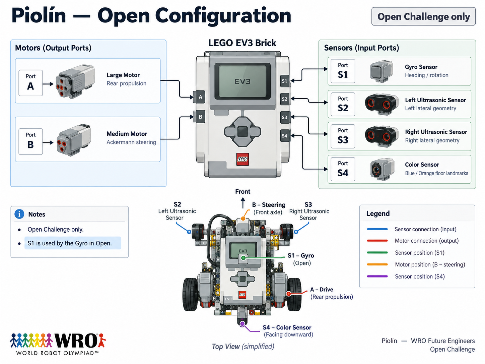
</p>

A simplified gyro heading correction can be represented as:

\[
u_{gyro}=K_p e_\theta + K_d\frac{\Delta e_\theta}{\Delta t}
\]

The gains are tuned through physical testing to balance correction strength and oscillation control.

---

## Round 2 — Obstacle Challenge

During Obstacles, Pixy2.1 replaces the gyro and provides signature, position, width, and height information about visible colored objects.

| Pixy Signature | Target | Required Behavior |
| :---: | --- | --- |
| **sig1** | Pink | Parking reference |
| **sig2** | Red pillar | Pass on the **RIGHT** |
| **sig3** | Green pillar | Pass on the **LEFT** |

<p align="center">
  
  
  
</p>

The pillar signature determines the passing side. Image position may influence how strongly Piolín reacts, but it does not redefine whether Red means right or Green means left.

Obstacle avoidance is treated as a complete maneuver:

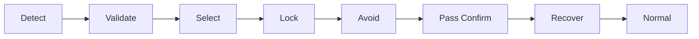
```mermaid
flowchart LR
    D[Detect] --> V[Validate]
    V --> S[Select]
    S --> L[Lock]
    L --> A[Avoid]
    A --> P[Pass Confirm]
    P --> R[Recover]
    R --> N[Normal]
```

---

## Control Arbitration

Several navigation behaviors can request different steering directions at the same time. Piolín therefore resolves these requests before sending the final command to Motor B.

Critical safety receives the highest priority, followed by the active maneuver and finally normal navigation.

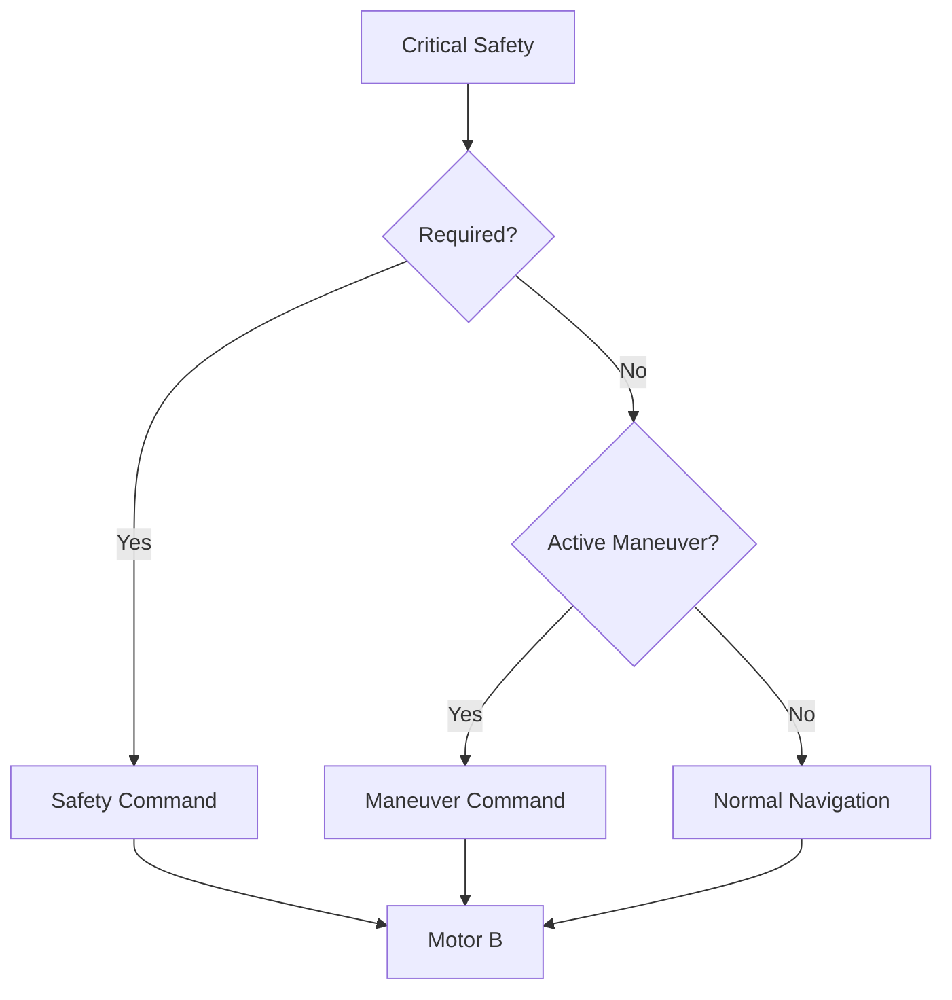
```mermaid
flowchart TD
    A[Critical Safety] --> D{Required?}
    D -- Yes --> S[Safety Command]
    D -- No --> M{Active Maneuver?}
    M -- Yes --> C[Maneuver Command]
    M -- No --> N[Normal Navigation]
    S --> B[Motor B]
    C --> B
    N --> B
```

---

## Color Events

One physical floor marking can remain below S4 for multiple control cycles. Piolín therefore converts repeated sensor samples into one physical course event using confirmation, latching, neutral-floor detection, and rearming.

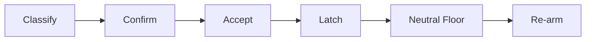
```mermaid
flowchart LR
    C[Classify] --> F[Confirm]
    F --> A[Accept]
    A --> L[Latch]
    L --> N[Neutral Floor]
    N --> R[Re-arm]
```

---

## Parking

Parking is treated as a dedicated navigation sequence rather than a fixed timed stop.


```mermaid
flowchart LR
    C[Course Complete] --> E[Eligible]
    E --> P[Parking Reference]
    P --> A[Approach]
    A --> EN[Entry]
    EN --> AL[Align]
    AL --> F[Final Position]
    F --> S[STOP]
```

The detailed parking architecture and calibration process are documented in the dedicated parking folder linked in the project index above.

---

<a id="systems-thinking--engineering-decisions"></a>

# Systems Thinking & Engineering Decisions

<p align="center">
  
</p>

Piolín did not reach V4 through one successful prototype. Several important decisions came directly from failed experiments.

When a run fails, we focus on identifying the **first incorrect behavior**, not only the final collision. A visible crash may originate from sensor interpretation, steering geometry, a state transition, controller conflict, poor target selection, or mechanical alignment.

The development process therefore focuses on modifying one relevant variable at a time and comparing the result against previous behavior.

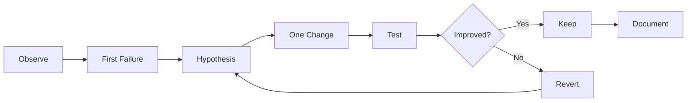
```mermaid
flowchart LR
    O[Observe] --> F[First Failure]
    F --> H[Hypothesis]
    H --> C[One Change]
    C --> T[Test]
    T --> D{Improved?}
    D -- Yes --> K[Keep]
    D -- No --> R[Revert]
    K --> DOC[Document]
    R --> H
```

This approach allows successful changes to be identified more clearly and prevents one improvement from silently breaking previously reliable behavior.

---

# Engineering Achievements

The most important improvements in Piolín are architectural rather than based on unsupported performance numbers.

| Engineering Development | Why It Matters |
| --- | --- |
| **Ackermann steering refinement** | Provides car-like steering using one actuator |
| **Separated propulsion and steering** | Motor A drives while Motor B steers |
| **Round-specific S1** | Uses the most appropriate sensor for each challenge |
| **Fixed S2/S3 identity** | Prevents ambiguity in lateral sensing |
| **Color event processing** | Prevents duplicate course-event counts |
| **Target validation** | Reduces reactions to weak or irrelevant visual detections |
| **Target memory** | Allows short camera losses without instantly abandoning a maneuver |
| **Pass confirmation** | Separates visual loss from real obstacle clearance |
| **Recovery behavior** | Helps Piolín return to useful track geometry |
| **Control arbitration** | Prevents competing behaviors from fighting for steering |

---

# Evolution of Piolín

PiolínTech began developing the project in **June 2025**. The robot has passed through several mechanical, sensing, and software configurations.

Early prototypes focused on understanding vehicle behavior. Later versions increasingly addressed steering geometry, sensor placement, structural organization, perception, course navigation, and repeatability.

V4 represents the current competition architecture.

| Generation | Main Development Focus |
| --- | --- |
| **Early Prototypes** | Basic autonomous vehicle behavior |
| **V2 / Partially LEGO** | Packaging and mechanical organization |
| **Complete LEGO** | Structural experimentation |
| **V3** | Ackermann, sensing, and vision development |
| **V4** | Current competition architecture |

<p align="center">
  <a href="./models/evolution/Phase1.md">
    
  </a>
  <a href="./models/evolution/Phase2.md">
    
  </a>
  <a href="./models/evolution/Phase3.md">
    
  </a>
  <a href="./models/evolution/phase4.md">
    
  </a>
</p>

---

# V4 — Current Competition Architecture

<p align="center">
  
</p>

V4 consolidates the current drivetrain, Ackermann steering, EV3 controller, two lateral Ultrasonic Sensors, downward Color Sensor, and round-specific S1 configuration.

The six views below provide the primary physical record of the current robot.

| Front | Rear | Left |
| :---: | :---: | :---: |
|  | 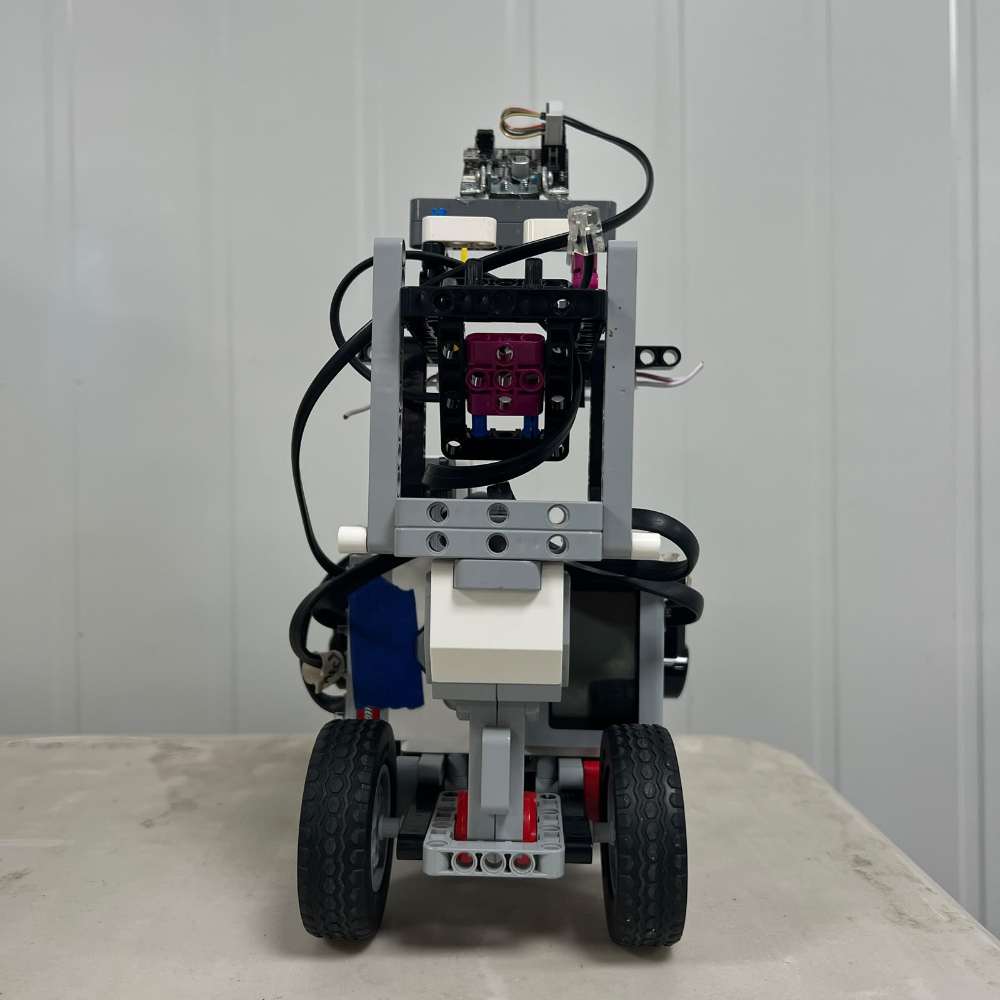 | 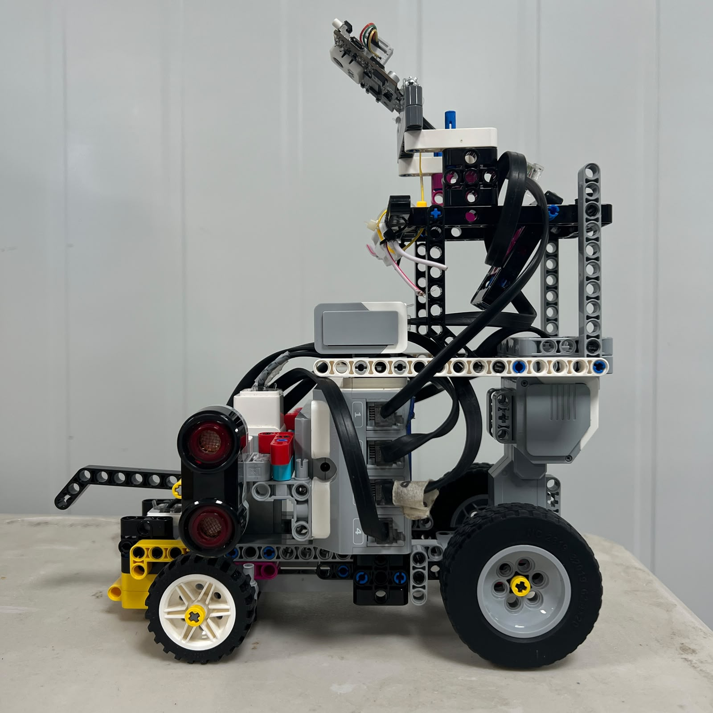 |
| **Right** | **Top** | **Bottom** |
| 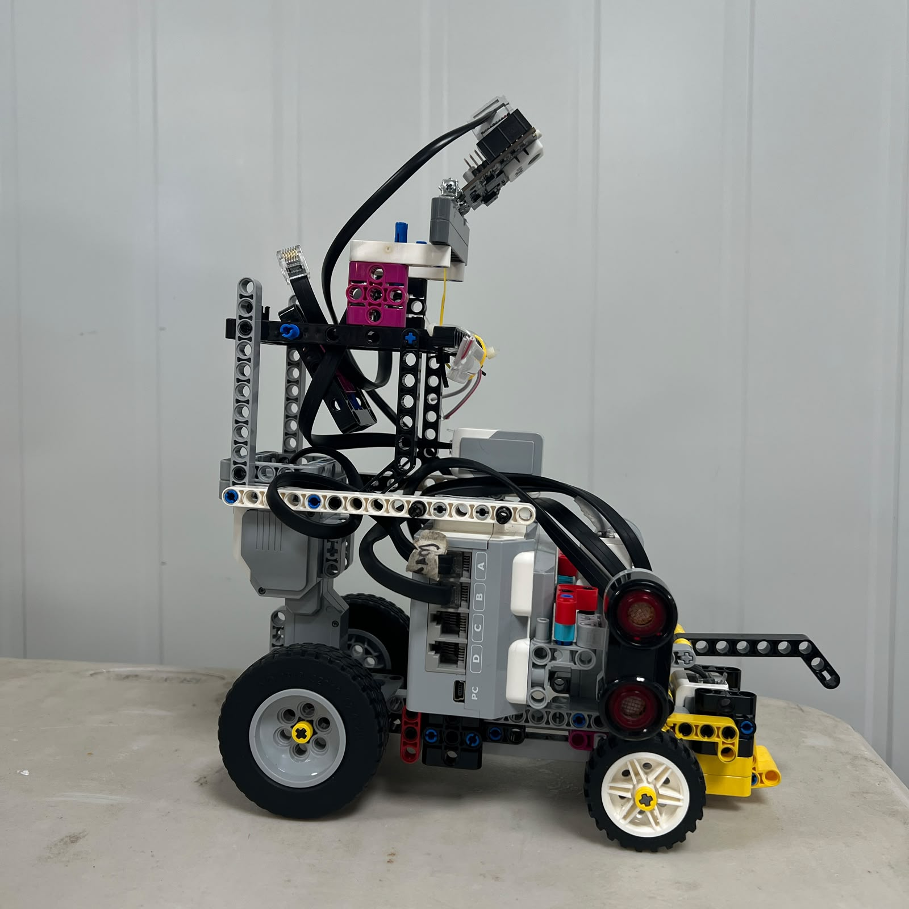 |  |  |

<p align="center">
  <a href="./v-photos/README.md">
    
  </a>
</p>

---

# 3D-Printed Components

Piolín uses custom 3D-printed components where repeatable sensor installation provides an advantage.

The Color Sensor casing helps maintain a more controlled optical environment around S4. The two-part Pixy2.1 case provides physical protection and helps maintain repeatable camera positioning.

The parts were manufactured using an **Anet ET4X** and **OVERTURE High Speed PLA 1.75 mm**, with a documented nozzle temperature of **200 °C**, bed temperature of **80 °C**, and the printer's **100% speed setting**.

<p align="center">
  
  
</p>

<p align="center">
  <a href="./models/3dprint/01_PrintingProcess.md">
    
  </a>
  <a href="./models/3dprint/02_ColorSensorCasing_Print.md">
    
  </a>
  <a href="./models/3dprint/03_PixyCase_Print.md">
    
  </a>
</p>

---

<a id="reproducibility--github-quality"></a>

# Reproducibility & GitHub Quality

<p align="center">
  
</p>

Our documentation is designed so another reader can understand how Piolín is assembled, connected, programmed, calibrated, and tested.

Reproducibility requires more than a list of components. Sensor orientation, port assignments, steering center, software dependencies, physical configuration, and calibration all influence the resulting robot behavior.

For this reason, the repository includes a BOM, wiring documentation, electrical diagrams, software setup, calibration instructions, testing protocols, troubleshooting, source code, STL files, photographs, and autonomous-driving videos.

---

## Software Preparation & Upload

Before either challenge program is executed, the physical steering is centered and all motor and sensor connections are verified.

Open requires the Gyro Sensor on S1. Obstacles requires Pixy2.1 on S1. S2 remains the left Ultrasonic Sensor, S3 remains the right Ultrasonic Sensor, and S4 remains the downward Color Sensor.

The appropriate Python program is then transferred to the EV3, the required sensors are calibrated, and a controlled test is performed before attempting a full course run.

The complete setup procedure is available in [**Software Setup**](./docs/reproducibility/05_softwaresetup.md).

---

# Testing & Reliability

A single successful run is not enough for us to consider a solution reliable.

During testing, we compare repeated starts, different valid starting positions, corner behavior, lateral geometry, Color Sensor events, visual detection, pillar passing, recovery, and parking.

When a failure occurs, the goal is to determine where the run first became incorrect. This makes it easier to distinguish between mechanical, sensing, perception, state, and controller problems.

<p align="center">
  <a href="./docs/reproducibility/07_TestingProtocol.md">
    
  </a>
  <a href="./docs/reproducibility/08_Troubleshooting.md">
    
  </a>
</p>

---

# Legacy Development

Not every system tested became part of V4.

Earlier development included different sensor arrangements and a HuskyLens + Arduino Nano vision bridge. These systems are preserved because they influenced later engineering decisions, but they are not part of the current competition architecture.

<p align="center">
  <a href="./docs/legacy/00_LEGACY_NOTICE.md">
    
  </a>
</p>

---

# Repository Structure

The project is organized so each engineering area has a clear place. The detailed individual links are available in the **General Project Index** at the top of this README.

```text
WRO2026-FE-PiolinTech/
│
├── code/
│   ├── round1/
│   └── round2/
│
├── docs/
│   ├── components/
│   ├── legacy/
│   ├── mobility_mechanical/
│   ├── power_sensors/
│   ├── project_overview/
│   ├── reproducibility/
│   ├── software_obstacles_strategy/
│   └── systems_engineering/
│
├── embed/
│
├── models/
│   ├── 3dprint/
│   └── evolution/
│
├── schemes/
│
├── t-gtku/
│
├── v-photos/
│   ├── v1/
│   ├── v2/
│   ├── v3/
│   └── v4/
│
├── videos/
│
└── README.md
```

`code/` contains the executable programs and their explanations. `docs/` contains the main engineering documentation. `embed/` contains software and engineering flowcharts. `models/` stores 3D-printing files and robot evolution. `schemes/` contains technical hardware diagrams. `v-photos/` provides photographic evidence, and `videos/` contains autonomous-driving demonstrations.

---

# Final Engineering Perspective

Piolín is not defined by one sensor, one controller, or one successful run. Its autonomous behavior comes from the interaction between mechanical geometry, sensor placement, perception, software state, and motor control.

The current architecture gives every major component a clear responsibility. Motor A provides rear propulsion. Motor B operates the Ackermann steering mechanism. S2 and S3 observe lateral geometry. S4 detects physical course landmarks. S1 provides either heading information through the Gyro Sensor or visual perception through Pixy2.1 depending on the challenge.

The most important change throughout PiolínTech's development has been the way we evaluate success. Instead of only asking whether the robot completed a maneuver, we now ask **why it worked, whether it can repeat that behavior, what changes when initial conditions are different, and which subsystem fails first when something goes wrong**.

That engineering process is what transformed the early prototypes into the current Piolín.

<p align="center">
  
</p>

<p align="center">
  <b>Designed · Built · Programmed · Tested · Documented by PiolínTech</b>
</p>
