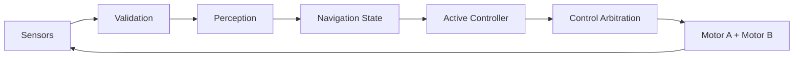
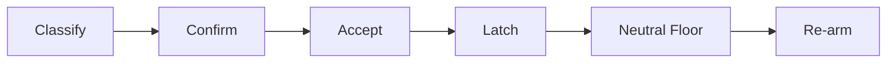
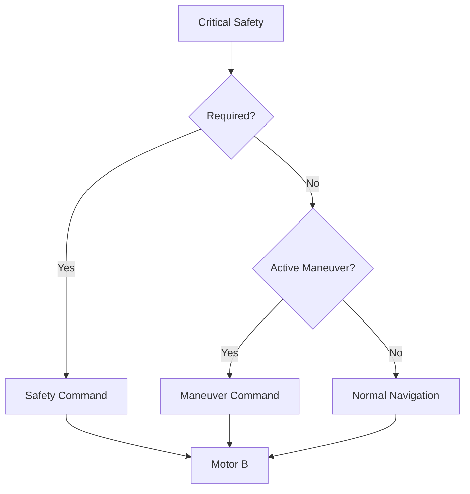
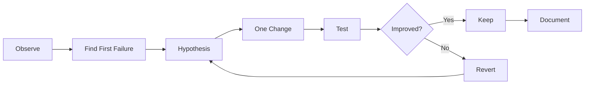

 <h1 align="center">Welcome to the PiolínTech Repository ꒰ঌ( •ө• )໒꒱ </h1>

<h3 align="center">
WRO Future Engineers 2026 · Panama
</h3>

<p align="center">
  
<p align="center">
  <b>Meet Piolín — our autonomous EV3 vehicle developed for WRO Future Engineers 2026.</b>
</p>

<div align="center">

  <a href="https://youtube.com/@piolintech">
    
  </a>

  <a href="https://instagram.com/piolintech">
    
  </a>

  <a href="https://github.com/Piolintech123/WRO2026-FE-PiolinTech">
    
  </a>

</div>

<p align="center">
  
  
  
</p>

<p align="center">
  
  
  
  
  
</p>

---

## Project Summary

Piolín is the autonomous robotic vehicle developed by PiolínTech for the WRO
Future Engineers 2026 Self-Driving Car Challenge. The project is built around a
LEGO MINDSTORMS EV3 controller and a car-like vehicle architecture with rear
propulsion and Ackermann-style front steering.

Our objective is not only to make the robot complete the track. Piolín has been
developed as a complete electromechanical system in which mechanics, sensor
placement, control software, perception, testing, and calibration affect one
another. A mechanical adjustment can change sensor measurements, a sensor
relocation can require new calibration, and a software change is only useful
when the physical vehicle can reproduce the expected behavior consistently.

The current vehicle uses an EV3 Large Motor for propulsion and an EV3 Medium
Motor for steering. Two lateral EV3 Ultrasonic Sensors describe Piolín's
relationship with the track boundaries, while a downward-facing EV3 Color
Sensor detects physical Blue and Orange course landmarks. Sensor Port S1 is
round-specific: the Open Challenge uses an EV3 Gyro Sensor, while the Obstacle
Challenge uses Pixy2.1.

The current design intentionally avoids treating every available sensor as
something that must be installed at all times. The gyro and Pixy2.1 solve
different information problems, so they are used in different challenge
configurations and are not installed simultaneously.

This repository documents the complete development process behind Piolín. It
includes mechanical design, components, power distribution, sensor
architecture, autonomous software, obstacle avoidance, parking, calibration,
testing, failed ideas, engineering trade-offs, technical diagrams, 3D-printed
parts, source code, videos, photographic evidence, and the physical evolution
of the robot since 2025.

---

# General Project Index

This index is designed as the fastest path through the repository. Each section
provides direct access to the detailed documents behind the summaries in this
README, while the short descriptions explain what a judge or reader can expect
to find before opening a file.

## 1. Mobility & Mechanical Design

This section explains how Piolín moves, steers, transfers propulsion to the
rear wheels, and maintains a repeatable physical vehicle geometry. It also
documents why Ackermann steering was selected and how mechanical testing is
connected to software reliability.

- **[Mechanical Architecture](./docs/mobility_mechanical/01_mecharchitecture.md)** — Complete mechanical organization of Piolín and the relationship between the chassis, drivetrain, steering, sensors, and controller.
- **[Chassis Design](./docs/mobility_mechanical/02_chassis.md)** — Structural layout, reinforcement, packaging, physical constraints, and the reasoning behind the present chassis configuration.
- **[Robot Mobility](./docs/mobility_mechanical/03_RMobility.md)** — Vehicle movement, steering behavior, physical trajectory, and the interaction between propulsion and steering.
- **[Ackermann Steering](./docs/mobility_mechanical/04_steering.md)** — Steering geometry, steering angles, linkage behavior, mechanical limitations, and calibration.
- **[Drivetrain](./docs/mobility_mechanical/05_drivetrain.md)** — Motor A, rear propulsion, wheel transmission, mechanical coupling, and drivetrain decisions.
- **[Mechanical Testing](./docs/mobility_mechanical/06_testing.md)** — Physical testing process used to compare mechanical changes and identify repeatability problems.

<p align="center">
  <a href="./docs/mobility_mechanical/">
    
  </a>
</p>

## 2. Power & Sensor Architecture

This section explains how Piolín is powered, how every active sensor is
connected, what each sensor measures, and why the current sensor arrangement is
different between the Open and Obstacle Challenges.

- **[Power & Sensor Configuration](./docs/power_sensors/01_PowerSensorconfig.md)** — Current power and sensing architecture for both challenge configurations.
- **[Ultrasonic Sensor Design](./docs/power_sensors/02_USSensorD.md)** — The two lateral ultrasonic sensors, their physical positions, their geometric purpose, and the S2-left / S3-right convention.
- **[Color Sensor](./docs/power_sensors/03_color_sensor.md)** — S4 floor sensing, Blue and Orange detection, event confirmation, optical considerations, and calibration.
- **[Pixy2.1 Vision](./docs/power_sensors/04_pixycam.md)** — Current Pixy2.1 obstacle configuration, S1 connection, signatures, and its role in perception.
- **[Sensor Calibration](./docs/power_sensors/05_Calibration.md)** — Calibration workflow used after physical changes or environmental changes.
- **[Hardware Components](./docs/components/)** — Individual documentation for the EV3, motors, sensors, battery, power distribution, and additional parts.
- **[Technical Schemes](./schemes/README.md)** — EV3 reference, port mapping, current robot scheme, and Open configuration diagram.

<p align="center">
  <a href="./docs/power_sensors/">
    
  </a>
  <a href="./schemes/README.md">
    
  </a>
</p>

## 3. Software Architecture & Obstacle Strategy

This section contains the autonomous control logic behind Piolín. It covers
normal navigation, corner handling, color events, vision processing, obstacle
avoidance, recovery, control arbitration, software tuning, and parking.

- **[Software Architecture](./docs/software_obstacles_strategy/01_SWArchitecture.md)** — Overall software organization from sensing to final actuation.
- **[Navigation State Machine](./docs/software_obstacles_strategy/02_statemachine.md)** — How Piolín changes behavior according to its current physical situation.
- **[Wall Following & Geometry](./docs/software_obstacles_strategy/03_wallfollowing.md)** — Lateral navigation using the left and right Ultrasonic Sensors.
- **[Corner Handling](./docs/software_obstacles_strategy/04_cornerhandling.md)** — Why corners are handled differently from straight sections and how physical evidence is used.
- **[Obstacle Detection](./docs/software_obstacles_strategy/05_obstacledetec.md)** — How vision detections are validated and filtered before changing the robot trajectory.
- **[Obstacle Strategy](./docs/software_obstacles_strategy/06_obstaclestrateg.md)** — Red-right, Green-left passing behavior, target lifecycle, pass confirmation, and recovery.
- **[Software Tuning](./docs/software_obstacles_strategy/07_softwaretuning.md)** — How controller values and behaviors are adjusted through real track testing.
- **[Pixy Vision Processing](./docs/software_obstacles_strategy/08_CameraPXVision.md)** — Interpretation of signature, x, y, width, height, candidate relevance, and target selection.
- **[RGB Detection](./docs/software_obstacles_strategy/09_RGBdetection.md)** — Color classification logic used for floor sensing and experimental detection work.
- **[Color & Lap Counting](./docs/software_obstacles_strategy/10_color_and_lap_counting.md)** — Physical event processing, duplicate prevention, course progress, and lap counting.

### Parking Documentation

Parking is documented separately because it is a complete navigation problem
rather than a final timing command.

- **[Parking Overview](./docs/software_obstacles_strategy/parking/01_ParkingOverview.md)** — Complete parking objective and the information available to the robot.
- **[Parking Algorithm](./docs/software_obstacles_strategy/parking/02_ParkingAlgorithm.md)** — Approach, entry, alignment, final position, and stopping logic.
- **[Parking Geometry](./docs/software_obstacles_strategy/parking/03_ParkingGeom.md)** — Relationship between vehicle geometry and the physical parking maneuver.
- **[Parking Calibration](./docs/software_obstacles_strategy/parking/04_ParkingCalib.md)** — Parameters that must be validated on the real robot.
- **[Parking Testing](./docs/software_obstacles_strategy/parking/05_Parkingtesting.md)** — Repeatability tests and failure analysis for the parking maneuver.

### Published Source Code

- **[Round 1 — Open Code](./code/round1/ev3v1.py)** — Published Open Challenge EV3 program.
- **[Round 1 Code Explanation](./code/round1/r1_exp.md)** — Detailed explanation of the Round 1 program, its logic, and its limitations.
- **[Round 2 — Obstacle Code](./code/round2/ev3v1.py)** — Published Obstacle Challenge EV3 program.
- **[Round 2 Code Explanation](./code/round2/r2_exp.md)** — Detailed explanation of the Pixy2.1, ultrasonic, obstacle, and steering logic used in the published Round 2 version.

<p align="center">
  <a href="./docs/software_obstacles_strategy/">
    
  </a>
  <a href="./code/">
    
  </a>
</p>

## 4. Systems Thinking & Engineering Decisions

This section explains why the current robot looks and behaves the way it does.
It records alternatives, trade-offs, failure modes, risk analysis, design
constraints, and the engineering process used to decide whether a change should
remain in the robot.

- **[Engineering Process](./docs/systems_engineering/01_engineeringprocess.md)** — Observe, identify the first incorrect behavior, form a hypothesis, change one variable, test, compare, and document.
- **[Decision Log](./docs/systems_engineering/02_decisionlog.md)** — Major mechanical, sensing, and software decisions with their reasoning.
- **[Design Constraints](./docs/systems_engineering/03_designconstraints.md)** — Competition, mechanical, sensor, control, and practical constraints.
- **[Trade-offs](./docs/systems_engineering/04_tradeoffs.md)** — Comparison of alternative approaches and the reasons behind current choices.
- **[Risks & Mitigation](./docs/systems_engineering/05_risksandmitigation.md)** — Important failure conditions and how the design attempts to reduce their impact.
- **[What Didn't Work](./docs/systems_engineering/06_whatdidntwork.md)** — Rejected ideas, failed experiments, and lessons that affected later versions.
- **[Project Timeline](./t-gtku/timeline.md)** — Development history beginning in June 2025.
- **[Robot Evolution](./models/evolution/Phase1.md)** — Entry point to the documented physical and architectural evolution of Piolín.

<p align="center">
  <a href="./docs/systems_engineering/">
    
  </a>
  <a href="./t-gtku/timeline.md">
    
  </a>
</p>

## 5. Reproducibility & GitHub Quality

This section contains the information required to understand how Piolín is
assembled, wired, configured, calibrated, programmed, tested, and diagnosed.

- **[Reproducibility Overview](./docs/reproducibility/01_ReproducibilityOverview.md)** — Starting point for reproducing the present hardware and software configuration.
- **[Bill of Materials](./docs/reproducibility/02_BOM.pdf)** — Components required for the robot.
- **[Wiring Guide](./docs/reproducibility/03_wiring.md)** — Motor, sensor, and round-specific S1 connections.
- **[Electrical Schematics](./docs/reproducibility/04_elecschem.md)** — Electrical and port-reference diagrams.
- **[Software Setup](./docs/reproducibility/05_softwaresetup.md)** — Preparing the EV3 environment and transferring the competition programs.
- **[Calibration Guide](./docs/reproducibility/06_HowToCalibrate.md)** — Steering, ultrasonic, color, gyro, and Pixy calibration.
- **[Testing Protocol](./docs/reproducibility/07_TestingProtocol.md)** — How tests are repeated and compared.
- **[Troubleshooting](./docs/reproducibility/08_Troubleshooting.md)** — Diagnosing common mechanical, sensing, and software problems.
- **[3D Printing Files](./models/3dprint/)** — STL files and manufacturing documentation.
- **[Vehicle Photo Archive](./v-photos/README.md)** — Visual evidence of the robot from previous generations through V4.
- **[Videos](./videos/links.md)** — Autonomous track demonstrations and test footage.

<p align="center">
  <a href="./docs/reproducibility/">
    
  </a>
  <a href="./docs/reproducibility/02_BOM.pdf">
    
  </a>
</p>

---

# Watch Piolín

## Video Evidence

The fastest way to understand Piolín is to see the vehicle operating on the
physical track. Our videos provide direct evidence of autonomous behavior under
both competition configurations and complement the source code and technical
documents stored in this repository.

The Open Challenge demonstration shows Piolín operating with the Open-round
sensing configuration. The Obstacle Challenge demonstration shows the vehicle
operating with visual traffic-sign detection and obstacle navigation.

<p align="center">
  <a href="https://www.youtube.com/watch?v=JROB39Az-Ys">
    
  </a>
  <a href="https://youtu.be/Tlw_LM0b6WE">
    
  </a>
</p>

Additional demonstrations and testing material are available in
[videos/links.md](./videos/links.md).

---

# Meet the Team

## Team Overview

We are PiolínTech, a robotics team from Colegio Bilingüe de Panamá. Developing
Piolín has required collaboration across mechanical construction, programming,
sensor calibration, testing, documentation, failure analysis, and redesign.

Future Engineers has repeatedly shown us that many problems cannot be separated
into purely mechanical or purely software categories. A steering error may
originate from code, but it can also result from linkage geometry or mechanical
alignment. A sensor problem may originate from software thresholds, but it may
also come from mounting geometry, light conditions, or the surface being
observed.

For that reason, the team approaches Piolín as a complete system. The objective
during testing is not only to make the visible symptom disappear, but to
understand which subsystem caused the first incorrect behavior.

| Member | Information | Contact |
| :---: | :--- | :---: |
|  | **Sebastián Martínez**<br>Colegio Bilingüe de Panamá | [Instagram](https://www.instagram.com/sebastian.mvrl/) |
|  | **Mia Cantoral**<br>Colegio Bilingüe de Panamá | [Instagram](https://www.instagram.com/miaacnt) |
|  | **Christian Castrellón**<br>Colegio Bilingüe de Panamá | [Instagram](https://www.instagram.com/cj.chriss) |
| **Coach** | **Hanna Figueroa**<br>Colegio Bilingüe de Panamá | |

<p align="center">
  <a href="./t-gtku/officialpictureptech.md">
    
  </a>
  <a href="./t-gtku/funnypicture.md">
    
  </a>
  <a href="./t-gtku/timeline.md">
    
  </a>
</p>

---

# Meet Piolín

## Current Vehicle Overview

<p align="center">
  
</p>

The current V4 Piolín architecture is built around clearly defined subsystem
responsibilities. Motor A handles propulsion, Motor B controls Ackermann
steering, S2 and S3 observe lateral track geometry, and S4 detects physical
floor landmarks.

S1 is the only major sensor port that changes between challenges. During the
Open Challenge, S1 contains the EV3 Gyro Sensor. During the Obstacle Challenge,
the gyro is removed and Pixy2.1 is installed instead.

Piolín currently has a measured mass of 0.84 kg. Current practical physical
references are approximately 250 mm in overall length, approximately 119 mm
across the front assembly, approximately 105 mm across the rear assembly,
approximately 290 mm in height, and approximately 120 mm between the axles.

These physical references are treated as current measurements rather than
permanent CAD values. Mechanical changes can alter the final configuration, so
the robot is rechecked when a modification affects the competition envelope,
sensor location, or steering geometry.

## Current Hardware

| System | Current Configuration |
| --- | --- |
| **Controller** | LEGO MINDSTORMS EV3 |
| **Propulsion** | EV3 Large Motor — Port A |
| **Steering** | EV3 Medium Motor — Port B |
| **Steering Geometry** | Ackermann-style |
| **Drive Layout** | Rear propulsion |
| **Left Distance Sensor** | EV3 Ultrasonic — S2 |
| **Right Distance Sensor** | EV3 Ultrasonic — S3 |
| **Floor Sensor** | EV3 Color Sensor — S4 |
| **Open S1 Device** | EV3 Gyro Sensor |
| **Obstacle S1 Device** | Pixy2.1 |
| **Battery** | EV3 Rechargeable Battery 45501 |
| **Measured Mass** | **0.84 kg** |

---

## Two Challenges, One Core Platform

Piolín uses the same core mechanical vehicle for both competition challenges.
Keeping the drivetrain, steering system, controller, two lateral Ultrasonic
Sensors, and Color Sensor consistent reduces the number of variables that
change when moving from one challenge to the other.

The main round-specific difference is S1. During Open, Piolín needs independent
heading and rotation information, so the EV3 Gyro Sensor occupies S1. During
Obstacles, visual color-signature information is required, so the gyro is
removed and Pixy2.1 takes its place.

The gyro and Pixy2.1 are not installed simultaneously in the current
competition architecture.

| Port | Open Challenge | Obstacle Challenge |
| :---: | --- | --- |
| **A** | EV3 Large Motor — propulsion | EV3 Large Motor — propulsion |
| **B** | EV3 Medium Motor — steering | EV3 Medium Motor — steering |
| **S1** | EV3 Gyro Sensor | Pixy2.1 |
| **S2** | LEFT Ultrasonic Sensor | LEFT Ultrasonic Sensor |
| **S3** | RIGHT Ultrasonic Sensor | RIGHT Ultrasonic Sensor |
| **S4** | Downward Color Sensor | Downward Color Sensor |

<p align="center">
  
</p>

S2 remains physically left and S3 remains physically right in both rounds.
Their interpretation as an inner or outer sensor changes only according to the
course direction.

---

<a id="mobility--mechanical-design"></a>

# Mobility & Mechanical Design

## Mechanical Overview

<p align="center">
  
</p>

Piolín uses a car-like architecture based on rear propulsion and
Ackermann-style front steering. Motor A drives the rear section of the vehicle,
while Motor B controls the steering mechanism at the front.

Unlike a differential-drive robot, Piolín cannot simply rotate by driving the
left and right sides at different speeds. Its path depends on the steering
angle of the front wheels and the forward or reverse motion generated by the
drivetrain.

This makes mechanical geometry part of the control problem. A different
steering angle, linkage position, wheel alignment, or chassis flex can change
the path produced by exactly the same software command.

The mechanical documentation therefore focuses not only on what pieces are
present, but also on how the physical arrangement affects autonomous behavior.

<p align="center">
  
  
</p>

## Ackermann Steering

During a turn, the inner front wheel follows a smaller radius than the outer
front wheel. The two wheels should therefore not remain perfectly parallel
throughout the maneuver.

Ackermann steering provides a geometric relationship between the inner and
outer wheel angles so the wheel paths converge toward a common turning center.

The ideal relationship can be represented by:

$$
\cot(\delta_{outer})-\cot(\delta_{inner})=\frac{w}{L}
$$

where \(w\) represents the track width and \(L\) represents the wheelbase.

The equation provides a useful geometric model, but the real LEGO mechanism
still has physical tolerances. Joint clearance, tire deformation, steering
linkage geometry, Motor B positioning, mechanical stops, and assembly alignment
influence the actual vehicle trajectory.

For that reason, steering geometry is evaluated through photographs, angle
observations, repeated runs, and physical calibration rather than assuming that
the theoretical model alone predicts the complete motion.

<p align="center">
  
</p>

## Steering Motor

The EV3 Medium Motor on Port B is dedicated to steering. Using a separate motor
for the steering system allows the software to reason about vehicle speed and
steering angle as different control variables.

The steering motor is centered before autonomous testing so its encoder
reference corresponds as closely as possible to the straight-wheel position.

A steering command is useful only when the mechanical linkage responds
consistently. If the linkage is loose, asymmetric, or physically obstructed, a
correct Motor B target can still produce an incorrect path.

This is why steering calibration always has both a software and mechanical
component.

<p align="center">
  
  
</p>

## Chassis Development

Piolín's chassis has changed repeatedly throughout development. Early versions
were useful for discovering how much space was required for the EV3, steering
mechanism, drivetrain, sensors, wiring, and later the vision system.

As the project matured, the chassis became more strongly connected to
navigation performance. A structural element that moves under load can affect
steering. A sensor mount that rotates slightly can change distance
measurements. A cable that interferes with steering can cause a software
symptom even though the controller is functioning correctly.

The current chassis therefore aims to maintain repeatable positions for the
main mechanical and sensing components while still remaining practical to
service and recalibrate.

The repository preserves previous versions because the transition from those
layouts to V4 provides evidence of the engineering process.

<p align="center">
  
  
</p>

## Rear Drivetrain

Motor A is an EV3 Large Motor dedicated to propulsion. Its role is mechanically
separate from Motor B, which means steering changes do not require differential
motor-speed control.

Keeping propulsion inside the EV3 ecosystem reduces wiring complexity and gives
the controller direct access to encoder information from the drive motor.

The drivetrain is evaluated as a complete path from motor output to wheel
motion. Mechanical losses, wheel grip, structural alignment, and the physical
load on the robot all influence how the vehicle accelerates and how
consistently it follows a requested path.

<p align="center">
  
  
</p>

## Torque and Dynamic Reasoning

Piolín currently has a measured mass of 0.84 kg. The drivetrain therefore has
to move the complete robot mass while overcoming rolling resistance and any
additional losses caused by wheel contact and drivetrain friction.

A simplified longitudinal force requirement can be represented as:

$$
F_t = ma + F_{resistance}
$$

and the corresponding wheel torque as:

$$
\tau = F_t r
$$

where \(m\) is vehicle mass, \(a\) is acceleration, \(F_{resistance}\)
represents resistive forces, and \(r\) is the effective radius of the driven
wheel.

These equations are used as engineering references rather than as claims of
guaranteed performance. Real track behavior depends on friction, tire
deformation, battery state, wheel alignment, and mechanical losses that are
difficult to represent perfectly in a simplified model.

<p align="center">
  
</p>

## Mechanical Testing Philosophy

Mechanical testing is performed with the same mindset used for software
testing. We try to isolate the first physical behavior that changes when a run
becomes unreliable.

If Piolín begins to drift, the first question is not automatically which
controller value should be changed. The team checks wheel alignment, steering
centering, sensor position, mechanical interference, and the condition of the
drivetrain before assuming that the problem originates in code.

This avoids compensating for a mechanical fault with increasingly aggressive
software corrections.

<p align="center">
  <a href="./docs/mobility_mechanical/01_mecharchitecture.md">
    
  </a>
  <a href="./docs/mobility_mechanical/04_steering.md">
    
  </a>
  <a href="./docs/mobility_mechanical/05_drivetrain.md">
    
  </a>
  <a href="./docs/mobility_mechanical/06_testing.md">
    
  </a>
</p>

---

<a id="power--sensor-architecture"></a>

# Power & Sensor Architecture

## Electrical and Sensing Overview

<p align="center">
  
</p>

Piolín is powered by the official LEGO MINDSTORMS EV3 Rechargeable DC Battery
45501. The EV3 Brick is the central controller and also provides the interfaces
used by the motors and active sensors.

The current competition architecture intentionally avoids unnecessary external
power and control layers. There is no Raspberry Pi, external propulsion
battery, custom H-bridge, or Arduino Nano in the current configuration.

Earlier experiments with additional electronics remain documented in the legacy
section because they influenced later engineering decisions, especially the
preference for simpler communication paths and fewer failure points.

<p align="center">
  
  
</p>

## EV3 Controller

The EV3 Brick is the central control unit in every current Piolín
configuration. It executes the navigation software, reads sensors, commands the
two motors, and provides the physical port structure that keeps the electrical
architecture organized.

The decision to remain centered around EV3 also improves reproducibility. The
motors, gyro, ultrasonic sensors, Color Sensor, and battery are all directly
associated with the same platform.

Pixy2.1 is the principal non-LEGO sensing device in the current obstacle
configuration.

<p align="center">
  
  
</p>

## Lateral Ultrasonic Sensors

Piolín uses two EV3 Ultrasonic Sensors mounted laterally. S2 is physically
installed on the left side of the robot and S3 is physically installed on the
right.

Their role is broader than detecting whether a wall exists. The distances help
describe the geometry around the vehicle and provide information that can be
used for lateral positioning, wall safety, corner reacquisition, and obstacle
recovery.

Because ultrasonic readings depend strongly on the surface being observed and
the angle between the sensor and that surface, sensor mounting is treated as
part of calibration.

Changing the orientation of one sensor can alter the apparent course geometry
without changing the actual robot position.

<p align="center">
  
  
</p>

## Ultrasonic Geometry

During straight navigation, the two side sensors provide complementary
information. When the robot is positioned near a wall, one sensor may describe
the nearer side more directly while the other provides context about the
surrounding corridor.

During a corner, those measurements change because the sensors begin observing
different surfaces or different angles of the same boundary.

This is why the software does not treat every sudden distance change as a
lateral error. Course state and heading context matter.

<p align="center">
  
</p>

## Color Sensor

The EV3 Color Sensor on S4 is mounted facing downward. Its purpose is to detect
important floor markings and convert them into physical navigation events.

Blue and Orange markings are used to determine initial driving direction and
contribute to course progression.

A custom 3D-printed casing surrounds the sensor to create a more controlled
local optical environment. The casing can reduce the effect of uncontrolled
light entering from the sides, but it does not make the Color Sensor immune to
environmental variation.

For that reason, the software still uses classification, confirmation, event
latching, and neutral-floor release.

<p align="center">
  
  
</p>

<p align="center">
  
  
</p>

## Gyro — Open Configuration

During the Open Challenge, an EV3 Gyro Sensor occupies S1. The gyro provides
heading and rotational information that complements the lateral Ultrasonic
Sensors.

This becomes especially useful during cornering. The Ultrasonic Sensors change
what they observe while the robot rotates, so they cannot always be interpreted
in the same way as during a straight section.

The gyro provides a separate indication of how the chassis is turning, helping
the software reason about corner progression and heading stabilization.

<p align="center">
  
</p>

## Pixy2.1 — Obstacle Configuration

During the Obstacle Challenge, the gyro is removed and Pixy2.1 occupies S1.

Pixy2.1 performs onboard color-signature detection and reports block
information such as signature, horizontal position, vertical position, width,
and height to the EV3.

The camera provides perception data, but it does not directly decide the
steering direction. The EV3 software interprets the camera output according to
the competition rule and current navigation state.

The current signature convention is Pink for parking, Red for a Red pillar, and
Green for a Green pillar.

<p align="center">
  
  
</p>

## Power Distribution

The battery supplies the EV3 Brick, and the EV3 provides the ports used by the
current motors and sensors.

The power architecture is intentionally simpler than several early experimental
configurations. Reducing extra converters, controllers, and communication
layers makes the system easier to reproduce and easier to diagnose.

| Device | Current Connection |
| --- | --- |
| EV3 Brick | EV3 Rechargeable Battery 45501 |
| EV3 Large Motor | Port A |
| EV3 Medium Motor | Port B |
| Open Gyro | S1 |
| Obstacle Pixy2.1 | S1 |
| Left Ultrasonic | S2 |
| Right Ultrasonic | S3 |
| Color Sensor | S4 |

<p align="center">
  
  
</p>

## Sensor Failure Considerations

A sensor can fail in more than one way. It can stop reporting entirely, return
a temporary noisy value, observe the wrong physical surface, produce an
ambiguous classification, or remain physically misaligned while still returning
valid-looking data.

For this reason, Piolín's software increasingly uses validation and context
rather than trusting every measurement immediately.

The Color Sensor uses confirmation and event logic. Pixy detections are
validated before being selected. Ultrasonic readings can be filtered or ignored
when they are outside useful conditions. The gyro is interpreted together with
course state rather than as an isolated source of truth.

<p align="center">
  <a href="./docs/power_sensors/01_PowerSensorconfig.md">
    
  </a>
  <a href="./schemes/README.md">
    
  </a>
  <a href="./docs/reproducibility/03_wiring.md">
    
  </a>
</p>

---

<a id="software--obstacle-strategy"></a>

# Software & Obstacle Strategy

## Software Overview

<p align="center">
  
</p>

Piolín's software architecture evolved from direct sensor reactions toward a
layered control system.

The earliest programs were useful because they made cause and effect simple to
observe. A color could trigger a steering command, or a wall distance could
generate a correction.

As more behaviors were added, direct reactions became harder to manage. A
sensor could be correct locally while the resulting steering command was wrong
for the larger maneuver.

The current architecture therefore separates raw sensing, validation,
perception, navigation state, active controller selection, control arbitration,
and final actuation.


```mermaid
flowchart LR
    S[Sensors] --> V[Validation]
    V --> P[Perception]
    P --> ST[Navigation State]
    ST --> C[Active Controller]
    C --> A[Control Arbitration]
    A --> M[Motor A + Motor B]
    M --> S
```

This structure also improves debugging. When a run fails, the team can ask
whether the problem began in the sensor data, in the interpretation of that
data, in state selection, in the selected controller, or in the mechanical
response of the robot.

## State-Based Thinking

State-based control is important because identical sensor values can mean
different things at different moments.

A short distance reading while driving normally may indicate a wall approach. A
similar reading while completing an obstacle maneuver may come from the pillar
or from a temporary vehicle angle.

Likewise, losing visual contact with a pillar can mean the target has been
passed, the camera has rotated away from it, the lighting changed, or the
object moved outside the field of view.

The state provides the context needed to interpret those events more safely.

## Open Challenge Strategy

The Open configuration combines the two lateral Ultrasonic Sensors, the Gyro
Sensor, and the Color Sensor.

S2 and S3 provide lateral geometry. The gyro provides heading and rotational
information. S4 provides physical floor landmarks.

The first confirmed floor event determines direction. Blue first corresponds to
counterclockwise navigation, while Orange first corresponds to clockwise
navigation.

Once direction is known, the software can interpret which physical side is
inner and which side is outer while still preserving the fixed S2-left and
S3-right naming.

<p align="center">
  
</p>

## Straight Navigation

Straight navigation is not treated as a demand to keep the steering motor
mathematically at zero.

The robot may require small corrections because the starting angle is
imperfect, the wheels are not perfectly aligned, the surface is not identical
everywhere, or the chassis drifts slightly.

Lateral ultrasonic geometry provides position information while the gyro helps
stabilize orientation.

The balance between these sources is important. A heading controller should not
ignore useful wall geometry, and a wall controller should not interpret every
geometry change as an ordinary lateral error.

## Gyro Heading Stabilization

A simplified gyro correction can be represented as:

$$
u_{gyro}=K_p e_\theta+K_d\frac{\Delta e_\theta}{\Delta t}
$$

The proportional component responds to the current heading error. The
derivative component responds to the rate of change of that error and helps
reduce aggressive oscillation.

The current Open development uses a PD-style gyro correction rather than
claiming a full PID controller with an integral term that is not part of the
documented current logic.

Controller gains are tuned through track testing because the same mathematical
gain can behave differently after mechanical changes.

## Corner Handling

Corners are one of the most important differences between simple wall following
and complete course navigation.

As Piolín begins to turn, the Ultrasonic Sensors stop observing the same
geometry that they saw during the straight section.

If the normal lateral controller remains dominant throughout the entire corner,
it can incorrectly fight the intended steering maneuver.

Corner handling therefore uses course-event information, geometry change, and
gyro rotation as different pieces of evidence.

The exact transition conditions are calibrated on the physical robot because
the final corner shape depends on steering geometry, speed, and sensor
placement.

## Color Events

A physical Blue or Orange marking can remain under S4 for multiple program
cycles.

If every raw sensor reading were counted independently, Piolín could
incorrectly count one physical line several times.

The event architecture separates classification from acceptance. A candidate
must be confirmed, accepted once, latched while the sensor remains over the
line, and released only after neutral floor has been observed.


```mermaid
flowchart LR
    C[Classify] --> F[Confirm]
    F --> A[Accept]
    A --> L[Latch]
    L --> N[Neutral Floor]
    N --> R[Re-arm]
```

This allows course progress to be represented by physical events instead of raw
samples.

## Obstacle Challenge Strategy

The Obstacle Challenge replaces the gyro with Pixy2.1.

The camera sees colored blocks, while the EV3 determines which detection is
relevant and what maneuver should follow.

The current signature convention is:

| Signature | Target | Rule |
| :---: | --- | --- |
| **sig1** | Pink | Parking reference |
| **sig2** | Red pillar | Pass on the **RIGHT** |
| **sig3** | Green pillar | Pass on the **LEFT** |

The key design rule is that the signature determines the passing side.

A Red pillar remains a right-side pass even if the pillar appears on the left
side of the camera image. A Green pillar remains a left-side pass even if its
image position changes.

This avoids confusing the rule-defined side with the camera's point of view.

<p align="center">
  
  
  
</p>

## Vision Geometry

Pixy2.1 provides more than a color signature.

The horizontal position can describe where the block appears across the field
of view. The vertical position and apparent size can contribute to an estimate
of which object is more relevant to the immediate maneuver.

These values are image-space observations. They are not automatically equal to
physical centimeters.

Piolín therefore uses them as relative perception information rather than
claiming direct metric distance unless a specific calibration supports that
conversion.

## Target Validation

Not every detected block should immediately control steering.

A weak reflection, distant object, partial color region, or ambiguous block may
not be the correct target.

The target-selection process therefore considers signature validity, block
size, image position, apparent relevance, and temporary continuity with the
previously selected target.

This reduces the chance that an irrelevant block suddenly takes control of the
robot trajectory.

## Target Commitment

Once Piolín begins to avoid a valid pillar, the software should not reverse its
rule-defined side simply because the camera view changes during the maneuver.

The active target therefore has a lifecycle rather than being reselected from
scratch during every control cycle.

This helps preserve Red-right and Green-left behavior while the chassis rotates
and the target moves through the image.

## Temporary Camera Loss

A camera can temporarily lose the pillar during a correct avoidance maneuver.

The object may leave the field of view, become partially hidden by the robot
geometry, become difficult to classify for a few frames, or appear differently
because of lighting.

Immediately abandoning the maneuver in response to one missing frame would make
the robot unstable.

Target memory and state context therefore allow a short visual loss without
immediately reversing the intended trajectory.

## Pass Confirmation

A pillar disappearing from the camera image does not prove that the robot has
physically passed it.

Pass confirmation is a separate problem.

The lateral Ultrasonic Sensors can contribute physical evidence because the
corresponding side distance may first decrease as the robot approaches the
obstacle region and then increase after the pillar is cleared.

The exact logic remains an area of testing, but the architectural distinction
is important: visual loss and physical pass completion are not the same event.

## Recovery

After passing a pillar, Piolín may be displaced from its normal navigation
corridor or may still be angled toward a wall.

Returning instantly to a strong normal controller can create a sudden steering
reversal.

Recovery is therefore treated as a dedicated part of the obstacle maneuver.

Its purpose is to help Piolín return toward useful geometry while normal
lateral control gradually becomes dominant again.

## Control Arbitration

Multiple controllers can request different steering directions at the same
time.

Normal navigation may want to move left while a pillar maneuver requires right
steering. A wall safety condition may request a stronger intervention than
either one.

Piolín has only one steering actuator, so there must be one final steering
decision.

The control hierarchy can be summarized as critical safety first, active
maneuver second, and normal navigation third.


```mermaid
flowchart TD
    A[Critical Safety] --> D{Required?}
    D -- Yes --> S[Safety Command]
    D -- No --> M{Active Maneuver?}
    M -- Yes --> C[Maneuver Command]
    M -- No --> N[Normal Navigation]
    S --> B[Motor B]
    C --> B
    N --> B
```

This prevents independent controllers from fighting for Motor B.

## Parking Strategy

Parking is treated as a dedicated navigation sequence rather than a
fixed-duration final command.

The intended sequence begins only after course progress indicates that parking
is allowed.

During Obstacles, the Pink Pixy signature can help identify the parking
reference. Encoder movement, steering state, and lateral ultrasonic geometry
can provide additional physical information.


```mermaid
flowchart LR
    C[Course Complete] --> E[Eligible]
    E --> P[Parking Reference]
    P --> A[Approach]
    A --> EN[Entry]
    EN --> AL[Align]
    AL --> F[Final Position]
    F --> S[STOP]
```

The exact entry and stopping parameters remain subject to physical calibration.

<p align="center">
  <a href="./docs/software_obstacles_strategy/01_SWArchitecture.md">
    
  </a>
  <a href="./docs/software_obstacles_strategy/06_obstaclestrateg.md">
    
  </a>
  <a href="./embed/04_ControlArbitration.md">
    
  </a>
</p>

---

<a id="systems-thinking--engineering-decisions"></a>

# Systems Thinking & Engineering Decisions

## Engineering Approach

<p align="center">
  
</p>

Piolín did not reach its current architecture through one successful prototype.

The project includes hardware failures, non-compliant experimental designs,
slow but mechanically useful configurations, sensor experiments, multiple
steering revisions, camera changes, and control strategies that were later
replaced.

These unsuccessful stages are preserved because they explain why the current
robot exists in its present form.

## Engineering Method

When a run fails, we try to identify the first incorrect behavior rather than
focusing only on the final visible collision.

The final crash may be several seconds after the real failure began.

The first problem may have been a sensor interpretation, a steering command, a
target-selection error, a state transition, a mechanical alignment issue, or an
interaction between two controllers.

Our engineering process therefore follows a repeatable cycle.


```mermaid
flowchart LR
    O[Observe] --> F[Find First Failure]
    F --> H[Hypothesis]
    H --> C[One Change]
    C --> T[Test]
    T --> D{Improved?}
    D -- Yes --> K[Keep]
    D -- No --> R[Revert]
    K --> DOC[Document]
    R --> H
```

Changing one meaningful variable at a time makes it easier to understand which
modification actually affected the behavior.

## Why We Preserve Failures

A failed design can still be valuable if it answers an engineering question.

The Yahboom failure changed the way the team thought about hardware reliability
and complexity.

A mechanically functional but non-compliant prototype reinforced the importance
of treating WRO rules as design constraints from the beginning.

A stronger but slow configuration showed that mechanical stability and
competitive movement cannot be separated.

Competition experience demonstrated that one successful run is not the same as
repeatability.

These lessons are documented so the repository shows the reasoning process
rather than only the final hardware.

## Design Constraints

The vehicle must satisfy the mechanical and operational constraints of the
Future Engineers challenge.

At the same time, Piolín has practical internal constraints created by the EV3
port count, the geometry of the chassis, the available steering range, sensor
field of view, cable routing, and the need to switch S1 between gyro and
Pixy2.1.

Good engineering decisions must respect both rule constraints and physical
constraints.

## Trade-Offs

Many decisions involve a trade-off instead of one universally correct answer.

A stronger steering correction can reduce one type of drift but may create
oscillation.

A slower speed can increase reaction time but may make the complete run
inefficient.

A camera position can increase visibility in one region while reducing it
elsewhere.

More sensors can provide more information but also create more wiring,
interpretation, and controller-conflict problems.

The trade-off documentation records why particular compromises were selected.

## Risk Management

The team also considers what happens when assumptions fail.

The Color Sensor may see an ambiguous floor value. Pixy2.1 may lose a target
temporarily. An Ultrasonic Sensor may see an unusual wall angle. Steering may
reach a mechanical limit. A software state may remain active longer than
expected.

Risk mitigation therefore includes validation, bounded steering, target memory,
event latching, safe-stop behavior, calibration checks, and testing under
multiple starting conditions.

## Regression Testing

A change is not automatically an improvement because one test becomes better.

The change also has to be tested against previously successful situations.

This is particularly important in autonomous navigation because one new
correction can solve a corner while damaging straight driving, or improve one
obstacle while causing another pillar to be approached incorrectly.

Regression testing protects previous successful behavior from being lost during
rapid tuning.

<p align="center">
  <a href="./docs/systems_engineering/01_engineeringprocess.md">
    
  </a>
  <a href="./docs/systems_engineering/02_decisionlog.md">
    
  </a>
  <a href="./docs/systems_engineering/04_tradeoffs.md">
    
  </a>
  <a href="./docs/systems_engineering/06_whatdidntwork.md">
    
  </a>
</p>

---

# Engineering Achievements

## Key Engineering Outcomes

The strongest improvements in Piolín are documented architectural changes
rather than unsupported claims about perfect accuracy, zero latency, or maximum
speed.

The current robot has a clear separation between propulsion and steering, fixed
physical identities for the lateral sensors, a round-specific S1 architecture,
event-based floor detection, structured obstacle target handling, control
arbitration, and dedicated recovery and parking concepts.

| Engineering Development | Why It Matters |
| --- | --- |
| **Ackermann steering refinement** | Provides car-like steering with one dedicated steering actuator |
| **Separated propulsion and steering** | Motor A drives while Motor B steers |
| **Round-specific S1** | Uses the information source needed by each challenge |
| **Fixed S2/S3 convention** | Keeps left and right sensor identities unambiguous |
| **Color event lifecycle** | Prevents one physical marking from being counted repeatedly |
| **Pixy target validation** | Reduces reactions to weak or irrelevant visual detections |
| **Target memory** | Allows short camera losses without immediately abandoning a maneuver |
| **Pass confirmation concept** | Separates visual disappearance from real obstacle clearance |
| **Recovery behavior** | Helps return the vehicle toward useful geometry |
| **Control arbitration** | Prevents competing controllers from fighting for Motor B |
| **3D-printed sensor integration** | Improves repeatability of physical sensor installation |
| **Testing methodology** | Makes changes easier to compare, keep, or revert |

---

# Evolution of Piolín

## Evolution Overview

PiolínTech began developing the project in June 2025.

The current robot is the result of many mechanical and sensing configurations
rather than one uninterrupted build.

Early stages focused on understanding basic motion and vehicle construction.
Later stages increasingly focused on steering geometry, sensor placement, track
navigation, perception, repeatability, and software architecture.

The evolution documents are intended to show how engineering decisions
accumulated over time.

## Phase 1 — Initial EV3 Prototype

Phase 1 represents early EV3-based experimentation with basic vehicle movement,
sensor placement, and structural concepts.

The goal was not to present a competition-ready system. It was to understand
what the vehicle needed mechanically before more advanced control could be
trusted.

The first phase created the baseline from which later mechanical and sensing
questions could be asked.

## Phase 2 — Mechanical and Navigation Development

Phase 2 focused more strongly on vehicle geometry, steering development,
lateral sensing, and the organization of the chassis.

This phase helped connect mechanical layout with navigation behavior.

It also reinforced the idea that sensor placement is not independent from
control logic.

## Phase 3 — Sensor, Vision, and Control Experimentation

Phase 3 included extensive experimentation with sensing and vision.

HuskyLens and Arduino Nano were investigated as one possible obstacle
architecture. Pixy2.1 was later evaluated as a more direct vision option.

The phase also exposed controller-conflict problems and the need to separate
perception, active maneuvers, and normal navigation.

## Phase 4 — Current Competition Architecture

Phase 4 represents the current competition architecture.

The EV3 remains the central controller. Motor A provides rear propulsion. Motor
B provides Ackermann steering. S2 remains left ultrasonic, S3 remains right
ultrasonic, and S4 remains the downward Color Sensor.

S1 is round-specific: Gyro for Open and Pixy2.1 for Obstacles.

Phase 4 is current, but individual navigation parameters and maneuvers continue
to be tuned through physical testing.

<p align="center">
  <a href="./models/evolution/Phase1.md">
    
  </a>
  <a href="./models/evolution/Phase2.md">
    
  </a>
  <a href="./models/evolution/Phase3.md">
    
  </a>
  <a href="./models/evolution/phase4.md">
    
  </a>
</p>

---

# V4 — Current Competition Architecture

## Current Physical Reference

<p align="center">
  
</p>

V4 consolidates the present drivetrain, Ackermann steering, EV3 controller, two
lateral Ultrasonic Sensors, downward Color Sensor, and round-specific S1
configuration.

The images below provide the principal six-view physical record of the current
vehicle.

| Front | Rear | Left |
| :---: | :---: | :---: |
|  |  |  |
| **Right** | **Top** | **Bottom** |
|  |  |  |

These photographs are complemented by close-up evidence of the chassis,
steering system, drivetrain, motors, sensors, battery, EV3 ports, Pixy
detections, wiring, and track tests.

<p align="center">
  <a href="./v-photos/README.md">
    
  </a>
  <a href="./t-gtku/timeline.md">
    
  </a>
</p>

---

# 3D-Printed Components

## Manufacturing and Sensor Integration

Piolín uses custom 3D-printed parts where a repeatable sensor installation
provides a practical advantage.

The Color Sensor casing helps maintain a more controlled optical environment
around S4 and helps preserve a repeatable physical relationship between the
sensor and the floor.

The two-part Pixy2.1 casing provides mechanical support and protection while
helping maintain a consistent camera position.

These parts are treated as part of the calibrated sensing system rather than
decorative accessories.

A different camera angle changes the x and y positions of detected blocks. A
different Color Sensor height can change reflection and RGB values.

Mechanical sensor installation and software calibration therefore have to be
considered together.

The current printed parts were manufactured using an Anet ET4X printer and
OVERTURE High Speed PLA 1.75 mm filament.

The documented print setup uses a nozzle temperature of 200 °C, a bed
temperature of 80 °C, and the printer's 100% speed setting.

The repository does not claim unrecorded layer height, infill, supports, or
print times when those values were not documented.

<p align="center">
  
  
</p>

### Printable Files

- [ColorSensorCasing.stl](./models/3dprint/ColorSensorCasing.stl)
- [PIXY_Case1.stl](./models/3dprint/PIXY_Case1.stl)
- [PIXY_Case2.stl](./models/3dprint/PIXY_Case2.stl)

<p align="center">
  <a href="./models/3dprint/01_PrintingProcess.md">
    
  </a>
  <a href="./models/3dprint/02_ColorSensorCasing_Print.md">
    
  </a>
  <a href="./models/3dprint/03_PixyCase_Print.md">
    
  </a>
</p>

---

<a id="reproducibility--github-quality"></a>

# Reproducibility & GitHub Quality

## Reproducibility Overview

<p align="center">
  
</p>

The repository is designed so another reader can understand how Piolín is
assembled, connected, programmed, calibrated, tested, and diagnosed.

Reproducibility requires more than a list of parts.

Sensor orientation, motor port assignment, steering center, software
dependencies, physical configuration, and calibration can all change the
resulting robot behavior.

For this reason, the repository contains a Bill of Materials, wiring
documentation, electrical schemes, software setup instructions, calibration
procedures, testing protocols, troubleshooting information, source code, STL
files, photographs, and videos.

## Software Preparation and Upload

Before either competition program is executed, the physical robot is checked
first.

Motor A and Motor B must be connected correctly. The steering mechanism must be
physically centered. S2 and S3 must correspond to the left and right Ultrasonic
Sensors. S4 must be installed correctly above the floor.

The correct round-specific sensor is then installed on S1.

Open requires the EV3 Gyro Sensor. Obstacles requires Pixy2.1.

The corresponding Python program is transferred to the EV3 and the necessary
sensors are calibrated before a full course attempt.

A controlled test is performed first so debug output and physical behavior can
be inspected without immediately risking a full-speed collision.

The complete setup process is documented in the software-setup guide.

## Calibration

Calibration is treated as a system process rather than only a
software-threshold adjustment.

Steering centering, Ultrasonic Sensor orientation, Color Sensor height, gyro
reset conditions, Pixy2.1 position, and camera signature training can all
influence the autonomous result.

If a mechanical sensor installation changes, the team does not assume that old
software values remain valid.

The corresponding subsystem is tested again before its previous calibration is
trusted.

## Testing

A single successful run is not sufficient evidence that a change is reliable.

Tests are repeated from different valid starting positions and under comparable
conditions.

The team observes start acquisition, straight driving, corner entry, corner
exit, lateral geometry, color events, target selection, obstacle side, pass
completion, recovery, parking, and stopping behavior.

A modification is evaluated both against the original problem and against
previously successful situations.

## Troubleshooting

Troubleshooting begins with the physical system.

If Piolín behaves incorrectly, the team checks sensor connections, steering
center, mechanical interference, wheel alignment, battery state, sensor
position, and visible damage before assuming that the software is responsible.

The software is then inspected through debug information, state behavior,
sensor values, and the first unexpected transition.

This order helps prevent software from compensating for a physical fault that
should be repaired directly.

<p align="center">
  <a href="./docs/reproducibility/02_BOM.pdf">
    
  </a>
  <a href="./docs/reproducibility/03_wiring.md">
    
  </a>
  <a href="./docs/reproducibility/05_softwaresetup.md">
    
  </a>
  <a href="./docs/reproducibility/06_HowToCalibrate.md">
    
  </a>
</p>

---

# Source Code

## Published Competition Programs

<p align="center">
  
</p>

The published code is separated by competition round.

Each round includes a Python program and a dedicated explanation so a reader
can understand the purpose of the program, the hardware assumptions, the main
variables, the control flow, and the limitations of that version.

| Challenge | Source Code | Explanation |
| --- | --- | --- |
| **Round 1 — Open** | [ev3v1.py](./code/round1/ev3v1.py) | [r1_exp.md](./code/round1/r1_exp.md) |
| **Round 2 — Obstacles** | [ev3v1.py](./code/round2/ev3v1.py) | [r2_exp.md](./code/round2/r2_exp.md) |

The source-code folders are intended to show the software evolution clearly
rather than hiding older development concepts after more advanced versions were
created.

---

---

# Technical Schemes and Flowcharts

## Diagram Organization

Hardware and software diagrams are stored separately so a reader can
distinguish the physical architecture from the control logic immediately. The
`schemes/` directory contains electrical, port, and configuration diagrams,
while `embed/` contains software, perception, parking, and engineering-process
flowcharts.

This separation keeps the repository readable and prevents a hardware wiring
diagram from being confused with a software-state diagram. Both groups are
linked directly from the README so judges can move from the overview to the
detailed evidence without manually searching the folder tree.

<p align="center">
  
</p>

## Hardware Schemes

- [**01 — EV3 KiCad Reference**](./schemes/01_EV3Kicad.png) — Technical EV3 electrical reference used alongside the robot documentation.
- [**02 — EV3 Port Map**](./schemes/02_EV3PortMap.png) — Current motor and sensor assignments for Piolín.
- [**03 — Overall Scheme**](./schemes/03_OverallScheme.png) — High-level electromechanical representation of the robot.
- [**04 — Open Configuration**](./schemes/04_OpenConfiguration.png) — Current Open Challenge sensor and motor configuration.
- [**Schemes README**](./schemes/README.md) — Explanation of the purpose and scope of each hardware scheme.

## Software and Engineering Flowcharts

- [**01 — Navigation State Flow**](./embed/01_NVStateFC.md) — State-based navigation logic.
- [**02 — Vision Processing**](./embed/02_VProcessing.md) — Processing path from Pixy detections to useful perception information.
- [**03 — Torque Calculation**](./embed/03_TorqueCalc.png) — Mechanical torque reference.
- [**04 — Control Arbitration**](./embed/04_ControlArbitration.md) — Priority between safety, active maneuvers, and normal navigation.
- [**05 — Obstacle Strategy**](./embed/05_ObstacleStrategyFC.md) — Full pillar-detection and avoidance flow.
- [**06 — Color Event Logic**](./embed/06_ColorEventFC.md) — Confirmation, latching, release, and rearming of physical floor events.
- [**07 — Parking State Flow**](./embed/07_ParkingStateFC.md) — Parking-state progression.
- [**08 — Parking Calibration**](./embed/08_ParkingCalibrationFC.md) — Structured parking-calibration process.
- [**09 — Engineering Process**](./embed/09_EngineeringProcessFC.md) — Observe, hypothesize, test, compare, and document cycle.
- [**10 — System Architecture**](./embed/10_SystemArchitectureFC.md) — High-level relationship between sensing, control, and actuation.
- [**Flowchart Index**](./embed/README.md) — Complete index of software and engineering diagrams.

<p align="center">
  <a href="./schemes/README.md">
    
  </a>
  <a href="./embed/README.md">
    
  </a>
</p>

---

# Legacy Development

## Historical Scope

Not every experiment became part of the current robot. Earlier development
included different sensor arrangements and a HuskyLens plus Arduino Nano vision
bridge. These configurations provided useful information about communication
complexity, target detection, sensor reliability, and the difficulty of
coordinating multiple control layers.

The current competition robot does not use HuskyLens or Arduino Nano. Legacy
material is intentionally separated from current documentation so historical
experiments can still demonstrate the engineering process without creating
ambiguity about the hardware that is installed today.

## Legacy Files

- [**Legacy Notice**](./docs/legacy/00_LEGACY_NOTICE.md) — Defines what is historical and what is current.
- [**HuskyLens Development**](./docs/legacy/01_HuskyLens.md) — Previous vision-system experimentation.
- [**Previous Testing & Analysis**](./docs/legacy/02_PTesting%26Analysis.md) — Historical test material and observations.
- [**Previous Testing Scheme**](./docs/legacy/PTScheme.png) — Visual evidence from earlier development.
- [**Previous Circuit Image**](./docs/legacy/PTechcircuit_image.png) — Previous electrical-development reference.

<p align="center">
  <a href="./docs/legacy/00_LEGACY_NOTICE.md">
    
  </a>
</p>

---

# Project History

## Development Timeline

PiolínTech began this project in June 2025. Since then, the vehicle has passed
through early prototypes, a major hardware failure, mechanically useful but
non-compliant experiments, stronger but slower designs, WRO competition
experience, steering development, several sensing configurations, vision
experiments, and the current V4 architecture.

The timeline is preserved because the current robot is easier to understand
when the decisions that preceded it remain visible. Some prototypes taught us
about competition constraints, some exposed hardware reliability problems, and
others revealed how closely mechanical geometry and autonomous control are
connected.

## From Early Prototypes to V4

The current architecture did not replace every earlier idea. Instead, the team
kept the parts that remained useful, modified the parts that created
repeatability problems, and removed systems that added more complexity than
value.

That process produced the present EV3-centered architecture, the dedicated
Motor A / Motor B responsibilities, the fixed S2-left and S3-right convention,
the S4 floor-sensing role, and the round-specific S1 design.

<p align="center">
  <a href="./t-gtku/timeline.md">
    
  </a>
</p>

---

# Engineering Roadmap

## Current Development Priorities

The current roadmap focuses on reliability and calibration rather than adding
unnecessary new hardware. The main engineering question is no longer how many
features can be added to Piolín, but how consistently the existing architecture
can perform under different valid starting conditions and track situations.

## Open Challenge Priorities

Open development focuses on start acquisition, straight-line stability, corner
entry, rotation, corner exit, geometric reacquisition, course-event counting,
and final parking behavior. Improvements are tested against multiple starting
positions so one successful case does not hide a weakness somewhere else on the
course.

## Obstacle Challenge Priorities

Obstacle development focuses on stable Red and Green target selection,
preserving the correct WRO passing side, preventing temporary camera loss from
cancelling a valid maneuver, confirming that a pillar has physically been
cleared, and recovering toward useful lateral geometry afterward.

## Regression Testing Priority

Regression testing remains important in both rounds. A new adjustment is not
accepted simply because one failure disappears. Previously successful cases are
tested again so the team can identify whether the modification solved the
original problem without creating a new one elsewhere.

| Area | Current Focus |
| --- | --- |
| **Open Start** | Reliable acquisition from valid starting positions |
| **Open Straight Driving** | Stable lateral geometry with controlled steering response |
| **Open Corners** | Repeatable entry, rotation, exit, and reacquisition |
| **Course Events** | One accepted software event for each physical marking |
| **Obstacle Detection** | Select the most relevant valid Pixy target |
| **Passing Side** | Preserve Red-right and Green-left behavior |
| **Pass Confirmation** | Distinguish temporary visual loss from physical clearance |
| **Recovery** | Return toward useful track geometry after a pillar |
| **Parking** | Improve approach, entry, alignment, and stopping |
| **Regression Testing** | Protect previously successful behavior |

---

# Repository Structure

## Directory Map

The repository is organized by engineering purpose so current hardware,
software, evidence, manufacturing files, and historical development remain easy
to distinguish.

```text
WRO2026-FE-PiolinTech/
├── code/
│   ├── round1/
│   │   ├── ev3v1.py
│   │   └── r1_exp.md
│   └── round2/
│       ├── ev3v1.py
│       └── r2_exp.md
├── docs/
│   ├── components/
│   ├── legacy/
│   ├── mobility_mechanical/
│   ├── power_sensors/
│   ├── project_overview/
│   ├── reproducibility/
│   ├── software_obstacles_strategy/
│   │   └── parking/
│   └── systems_engineering/
├── embed/
├── models/
│   ├── 3dprint/
│   └── evolution/
├── schemes/
├── t-gtku/
├── v-photos/
│   ├── v1/
│   ├── v2/
│   ├── v3/
│   └── v4/
├── videos/
└── README.md
```

## Folder Roles

`code/` contains the published programs and their explanations. `docs/`
contains the detailed engineering documentation. `embed/` contains software and
engineering flowcharts. `models/` contains 3D-printing files and the documented
evolution of the robot. `schemes/` contains hardware-oriented technical
diagrams. `t-gtku/` contains team and timeline material. `v-photos/` provides
physical evidence across robot generations, and `videos/` contains autonomous
demonstrations.

---

# Detailed Repository Navigation

## Components

The component files document the individual hardware elements before they are
combined into the complete system.

- [**Hardware Overview**](./docs/components/01_Hardwareoverview.md) — Current hardware architecture at a glance.
- [**EV3 Controller**](./docs/components/02_EV3.md) — Main onboard controller and port structure.
- [**Motors**](./docs/components/03_Motors.md) — Drive and steering motors.
- [**Steering Motor**](./docs/components/04_SteeringMotor.md) — Motor B and the steering mechanism.
- [**Ultrasonic Sensors**](./docs/components/05_UltrasonicSensors.md) — Lateral S2 and S3 sensing.
- [**Color Sensor**](./docs/components/06_ColorSensor.md) — Downward S4 floor sensing.
- [**Pixy Vision**](./docs/components/07_PixyVision.md) — Pixy2.1 obstacle perception.
- [**Battery**](./docs/components/08_Battery.md) — EV3 Rechargeable Battery 45501.
- [**Power Distribution**](./docs/components/09_PowerDistribution.md) — Current power path through the EV3 architecture.
- [**Other Components**](./docs/components/10_OtherComponents.md) — Additional physical components used by Piolín.

## Source Code

The source-code directory is intentionally separated by round because Open and
Obstacles use different S1 devices and different perception requirements.

- [**Round 1 EV3 V1**](./code/round1/ev3v1.py) — Open Challenge source code.
- [**Round 1 Explanation**](./code/round1/r1_exp.md) — Technical explanation of the Round 1 version.
- [**Round 2 EV3 V1**](./code/round2/ev3v1.py) — Obstacle Challenge source code.
- [**Round 2 Explanation**](./code/round2/r2_exp.md) — Technical explanation of the Round 2 version.

## 3D Models and Manufacturing

The manufacturing files make the custom sensor components reproducible and
connect the STL geometry with installation and recalibration.

- [**Printing Process**](./models/3dprint/01_PrintingProcess.md) — Printer, filament, manufacturing workflow, inspection, and installation.
- [**Color Sensor Casing Print**](./models/3dprint/02_ColorSensorCasing_Print.md) — S4 casing manufacturing and validation.
- [**Pixy2.1 Case Print**](./models/3dprint/03_PixyCase_Print.md) — Camera-case manufacturing and validation.
- [**ColorSensorCasing.stl**](./models/3dprint/ColorSensorCasing.stl) — Printable Color Sensor casing.
- [**PIXY_Case1.stl**](./models/3dprint/PIXY_Case1.stl) — First component of the Pixy2.1 case.
- [**PIXY_Case2.stl**](./models/3dprint/PIXY_Case2.stl) — Second component of the Pixy2.1 case.

## Evolution Files

The evolution files show how Piolín changed from early EV3 prototypes to the
current architecture.

- [**Phase 1**](./models/evolution/Phase1.md) — Initial EV3 prototype and foundational lessons.
- [**Phase 2**](./models/evolution/Phase2.md) — Mechanical and navigation development.
- [**Phase 3**](./models/evolution/Phase3.md) — Sensor, vision, and control experimentation.
- [**Phase 4**](./models/evolution/phase4.md) — Current competition architecture.

## Team and Timeline

- [**Official Team Picture**](./t-gtku/officialpictureptech.md) — Formal PiolínTech team image.
- [**Funny Team Picture**](./t-gtku/funnypicture.md) — Informal team photograph.
- [**Project Timeline**](./t-gtku/timeline.md) — Chronological development history.

## Videos

- [**Video Index**](./videos/links.md) — Central list of autonomous demonstrations and test videos.
- [**Open Challenge Video**](https://www.youtube.com/watch?v=JROB39Az-Ys) — Open-round autonomous demonstration.
- [**Obstacle Challenge Video**](https://youtu.be/Tlw_LM0b6WE) — Obstacle-round autonomous demonstration.

---

# V4 Photographic Evidence

## Current Vehicle Views

The V4 photo directory is the main photographic reference for the current
robot. It contains overall vehicle views as well as close-ups of the chassis,
steering, drivetrain, sensors, controller, battery, wiring, and Pixy
detections.

- [**Front View**](./v-photos/v4/Piolin_open_front.jpeg)
- [**Rear View**](./v-photos/v4/piolin_open_rear.jpg)
- [**Left View**](./v-photos/v4/piolin_open_left.jpg)
- [**Right View**](./v-photos/v4/piolin_open_right.jpg)
- [**Top View**](./v-photos/v4/piolin_open_top.jpg)
- [**Bottom View**](./v-photos/v4/piolin_bottom.jpg)
- [**Open Isometric View**](./v-photos/v4/piolin_open_isometric.jpg)
- [**Obstacle Isometric View**](./v-photos/v4/piolin_obstacle_isometric.jpg)

## Mechanical Evidence

- [**Ackermann Front View**](./v-photos/v4/ackermann_front.jpg)
- [**Ackermann Angles**](./v-photos/v4/ackermann_angles.jpg)
- [**Ackermann Center**](./v-photos/v4/ackermann_center.jpg)
- [**Left Steering Lock**](./v-photos/v4/ackermann_left_lock.jpg)
- [**Right Steering Lock**](./v-photos/v4/ackermann_right_lock.jpg)
- [**Rear Drivetrain Top**](./v-photos/v4/rear_drivetrain_top.jpg)
- [**Rear Drivetrain Bottom**](./v-photos/v4/rear_drivetrain_bottom.jpg)
- [**Steering Motion**](./v-photos/v4/steering_motion.gif)

## Sensor Evidence

- [**S2 Left Ultrasonic**](./v-photos/v4/ultrasonic_left_s2.jpg)
- [**S3 Right Ultrasonic**](./v-photos/v4/ultrasonic_right_s3.jpg)
- [**Ultrasonic Pair**](./v-photos/v4/ultrasonic_pair_top.jpg)
- [**S4 Installed**](./v-photos/v4/color_sensor_s4_installed.jpg)
- [**Color Sensor Casing**](./v-photos/v4/color_sensor_casing.jpg)
- [**Blue Mark**](./v-photos/v4/color_sensor_blue_mark.jpg)
- [**Orange Mark**](./v-photos/v4/color_sensor_orange_mark.jpg)
- [**Open Gyro**](./v-photos/v4/s1_open_gyro.jpg)
- [**Obstacle Pixy2.1**](./v-photos/v4/s1_obstacle_pixy.jpg)

## Vision Evidence

- [**Pixy2.1 Front**](./v-photos/v4/pixy21_front.jpg)
- [**Pixy2.1 Side**](./v-photos/v4/pixy21_side.jpg)
- [**Pixy2.1 Top**](./v-photos/v4/pixy21_top.jpg)
- [**Pixy2.1 S1 Connection**](./v-photos/v4/pixy21_s1_connection.jpg)
- [**Red Detection**](./v-photos/v4/pixy21_red_detection.jpg)
- [**Green Detection**](./v-photos/v4/pixy21_green_detection.jpg)
- [**Pink Parking Detection**](./v-photos/v4/pixy21_parking_detection.jpg)

## Wiring Evidence

- [**Open Wiring**](./v-photos/v4/wiring_open.jpg)
- [**Obstacle Wiring**](./v-photos/v4/wiring_obstacle.jpg)
- [**EV3 Motor Ports**](./v-photos/v4/ev3_motor_ports.jpg)
- [**EV3 Sensor Ports**](./v-photos/v4/ev3_sensor_ports.jpg)
- [**EV3 Battery 45501**](./v-photos/v4/ev3_battery_45501.jpg)

---

# Documentation Coverage

## WRO Engineering Documentation Map

The repository is organized so each major engineering area has both a
high-level explanation and direct technical evidence.

| Engineering Area | Main Evidence |
| --- | --- |
| **Mobility & Mechanical Design** | Mobility documentation, Ackermann analysis, drivetrain documentation, torque reasoning, and V4 mechanical photographs |
| **Power & Sensor Architecture** | Power and sensor documentation, component files, wiring, port mapping, current schemes, and sensor photographs |
| **Software Architecture & Obstacle Strategy** | Software documentation, Round 1 and Round 2 source code, vision flow, state logic, control arbitration, and obstacle strategy |
| **Systems Thinking & Engineering Decisions** | Engineering process, decision log, trade-offs, risks, rejected ideas, evolution documents, and project timeline |
| **Reproducibility & GitHub Quality** | BOM, wiring, software setup, calibration, testing, troubleshooting, STL files, photographs, videos, and clickable navigation |

## Evidence Philosophy

The README provides the project story and quick navigation, while the linked
files provide the deeper engineering detail. This prevents the main page from
becoming a disconnected collection of every calculation and experiment while
still allowing a judge to reach the supporting evidence directly.

The repository also separates current architecture from legacy development.
This is important because historical experimentation is valuable evidence only
when it is clearly identified as historical rather than presented as part of
the current competition robot.

---

# Final Engineering Perspective

## What Piolín Represents

Piolín is not defined by one sensor, one controller, or one successful run. Its
autonomous behavior comes from the interaction between mechanical geometry,
sensor placement, perception, navigation states, control logic, and motor
actuation.

The current architecture gives every major component a clear responsibility.
Motor A provides rear propulsion. Motor B operates the Ackermann steering
mechanism. S2 and S3 observe lateral geometry. S4 detects physical course
landmarks. S1 provides either heading information through the Gyro Sensor or
visual perception through Pixy2.1 depending on the challenge.

## How We Evaluate Success

The most important change throughout PiolínTech's development has been the way
the team evaluates a successful result. Instead of only asking whether the
robot completed a maneuver, we ask why it worked, whether the behavior can be
repeated, what changes when the initial conditions are different, and which
subsystem fails first when something goes wrong.

That process is what transformed the early prototypes into the current Piolín
and continues to guide the remaining calibration work for WRO Future Engineers
2026.

<p align="center">
  
</p>

<p align="center">
  <b>Designed · Built · Programmed · Tested · Documented by PiolínTech</b>
</p>


---

# Quick Evidence Checklist

## Mechanical & Sensor Evidence

Current V4 photographs, Ackermann documentation, drivetrain evidence, S2-left / S3-right sensing, S4 floor sensing, and the round-specific S1 configuration are all directly linked in this README.

## Software & Reproducibility Evidence

Round-specific source code, code explanations, flowcharts, BOM, wiring, setup, calibration, testing, troubleshooting, STL files, photographs, and videos are directly accessible.

## Engineering Evidence

Decision logs, trade-offs, risks, rejected approaches, project history, and evolution files document how the current architecture was reached.

<p align="center"><b>PiolínTech · WRO Future Engineers 2026</b></p>
