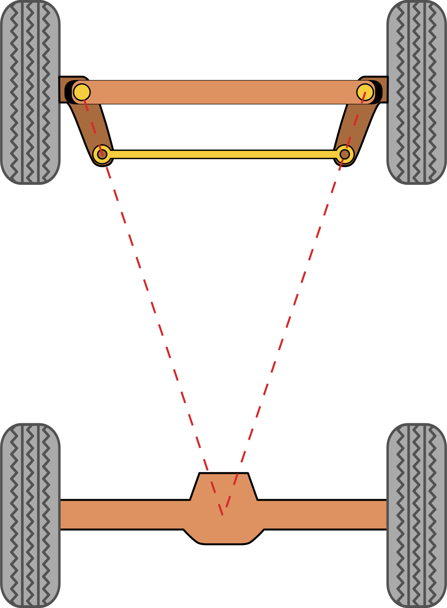

# PiolínTech WRO 2026 — Technical Documentation

<div align="center">


<br>

<sub><b>Figure D.1.</b> Piolín uses the same mechanical vehicle for both WRO Future Engineers rounds while changing the S1 sensing configuration according to the task.</sub>

</div>

This directory contains the engineering documentation for **Piolín**, PiolínTech's WRO Future Engineers 2026 autonomous vehicle.

The documentation is intended to explain more than the final robot.

It records:

```text
what Piolín is

how it was designed

how each subsystem works

why important decisions were made

which alternatives were tested

what did not work

how the software is organized

how the robot is calibrated

how results are tested

how another team could reproduce the system
```

The project is documented as an integrated engineering system rather than as separate pieces of hardware and code.

The main documentation areas are:

```text
PROJECT OVERVIEW

MOBILITY & MECHANICAL DESIGN

COMPONENTS

POWER & SENSORS

SOFTWARE & OBSTACLE STRATEGY

PARKING

SYSTEMS ENGINEERING

REPRODUCIBILITY
```

---

# 1. Piolín at a Glance

Piolín is a LEGO Mindstorms EV3-based autonomous vehicle designed for the **WRO Future Engineers 2026** competition.

Its current core architecture is:

```text
Controller
→ LEGO Mindstorms EV3 Brick

Motor A
→ EV3 Large Motor
→ rear propulsion

Motor B
→ EV3 Medium Motor
→ front Ackermann-style steering

S2
→ LEFT EV3 Ultrasonic Sensor

S3
→ RIGHT EV3 Ultrasonic Sensor

S4
→ downward-facing EV3 Color Sensor
```

Sensor Port S1 changes according to the competition round.

### Open Challenge

```text
S1 → EV3 Gyro Sensor
```

### Obstacle Challenge

```text
S1 → Pixy2.1
```

The Gyro Sensor and Pixy2.1 are **not installed simultaneously** in the current architecture.

All current competition hardware is LEGO Mindstorms EV3 except Pixy2.1.

The active power source is the:

```text
LEGO Mindstorms EV3 Rechargeable DC Battery
Model 45501
```

---

# 2. Current Hardware Architecture

<div align="center">


<br>

<sub><b>Figure D.2.</b> Open and Obstacles preserve the same propulsion, steering, lateral ultrasonic, and floor-sensing architecture while changing S1.</sub>

</div>

| Port | Open Challenge | Obstacle Challenge |
| :---: | :--- | :--- |
| Motor A | Rear propulsion | Rear propulsion |
| Motor B | Ackermann steering | Ackermann steering |
| S1 | Gyro Sensor | Pixy2.1 |
| S2 | LEFT Ultrasonic | LEFT Ultrasonic |
| S3 | RIGHT Ultrasonic | RIGHT Ultrasonic |
| S4 | Color Sensor | Color Sensor |

One of the most important conventions throughout the repository is:

```text
S2 = LEFT

S3 = RIGHT
```

These are permanent **physical identities**.

Logical roles such as:

```text
inner

outer
```

may change with course direction, but the physical sensor names do not.

---

# 3. Documentation Structure

The documentation is divided by engineering responsibility.

```text
docs/
│
├── project_overview/
│
├── mobility_mechanical/
│
├── components/
│
├── power_sensors/
│
├── software_obstacles_strategy/
│   └── parking/
│
├── systems_engineering/
│
└── reproducibility/
```

Each section answers a different engineering question.

```text
PROJECT OVERVIEW
→ What is Piolín?

MOBILITY
→ How does Piolín physically move?

COMPONENTS
→ What hardware is installed?

POWER & SENSORS
→ How is information and power provided?

SOFTWARE
→ How does Piolín interpret the course and control motion?

SYSTEMS ENGINEERING
→ Why was the architecture chosen?

REPRODUCIBILITY
→ How can the system be reconstructed, calibrated, and tested?
```

---

# 4. Project Overview

Start here for the highest-level explanation of the project.

### [Project Overview](project_overview/01_ProjectOverview.md)

This document introduces:

```text
PiolínTech

WRO Future Engineers 2026

Piolín's engineering objective

Open Challenge architecture

Obstacle Challenge architecture

major subsystem relationships

development philosophy
```

It provides context before the reader moves into detailed mechanical, electrical, and software documentation.

---

# 5. Mobility and Mechanical Design

Piolín uses a car-like mechanical architecture based on:

```text
rear propulsion

front Ackermann-style steering
```

rather than differential drive.

<div align="center">



<br>

<sub><b>Figure D.3.</b> Piolín's steering geometry determines the curved trajectories used for corners, obstacle avoidance, recovery, and parking.</sub>

</div>

The main mobility documents are:

### [Robot Mobility](mobility_mechanical/03_RMobility.md)

Explains the complete vehicle-motion architecture and how propulsion and steering work together.

### [Steering System](mobility_mechanical/04_steering.md)

Covers:

```text
Motor B

Ackermann linkage

steering geometry

left/right movement

mechanical limitations

software implications
```

### [Drivetrain](mobility_mechanical/05_drivetrain.md)

Documents:

```text
Motor A

rear propulsion

wheel transmission

vehicle movement

relationship between speed and steering
```

### [Mechanical Testing](mobility_mechanical/06_testing.md)

Describes the process used to evaluate:

```text
steering response

mechanical consistency

trajectory repeatability

physical integration
```

A central mechanical constraint is:

> **Piolín cannot rotate in place or translate directly sideways.**

Corners, obstacle maneuvers, recovery, and parking therefore require actual Ackermann arcs.

---

# 6. Components

The `components/` section documents the main physical elements of the current robot.

### [Hardware Overview](components/01_Hardwareoverview.md)

High-level inventory and subsystem relationships.

### [EV3 Brick](components/02_EV3.md)

Explains the role of the EV3 as:

```text
main controller

sensor interface

motor controller

software platform

power-distribution center
```

### [Motors](components/03_Motors.md)

Overview of both active motors.

### [Steering Motor](components/04_SteeringMotor.md)

Detailed documentation of Motor B and its steering responsibility.

### [Ultrasonic Sensors](components/05_UltrasonicSensors.md)

Documents the permanent:

```text
S2 LEFT

S3 RIGHT
```

lateral sensing architecture.

### [Color Sensor](components/06_ColorSensor.md)

Explains S4 floor sensing and the Color Sensor casing.

### [Pixy2.1 Vision](components/07_PixyVision.md)

Documents Pixy2.1 as the current non-LEGO vision component used in Obstacles.

### [Battery](components/08_Battery.md)

Documents the EV3 Rechargeable DC Battery 45501.

### [Power Distribution](components/09_PowerDistribution.md)

Explains how the EV3 supplies the active robot architecture.

### [Other Components](components/10_OtherComponents.md)

Covers supporting mechanical and electrical elements that do not require their own primary subsystem.

---

# 7. Power and Sensors

The `power_sensors/` section focuses on **sensor installation, sensing roles, and calibration** rather than general component descriptions.

### [Power and Sensor Configuration](power_sensors/01_PowerSensorconfig.md)

Defines both round-specific sensor architectures and the relationship between power, sensors, and the EV3.

### [Ultrasonic Sensor Design](power_sensors/02_USSensorD.md)

Explains:

```text
lateral mounting

S2/S3 roles

distance interpretation

geometry

limitations
```

### [Color Sensor](power_sensors/03_color_sensor.md)

Covers:

```text
downward floor detection

Blue and Orange markings

optical casing

course-state information
```

### [Pixy2.1 Camera](power_sensors/04_pixycam.md)

Documents the current Obstacle Challenge vision hardware, including:

```text
S1 integration

Pixy signatures

physical installation

3D-printed casing

camera limitations
```

### [Sensor Calibration](power_sensors/05_Calibration.md)

Explains why calibration is required and how sensing values should be obtained from the actual installed robot instead of assumed from theoretical values.

---

# 8. Software Architecture

The main software documentation is under:

```text
software_obstacles_strategy/
```

Although much of this section focuses on the more complex Obstacle Challenge, several architectural principles also originate from Open Challenge prototypes.

The overall philosophy is:

```text
SENSORS
   ↓
VALIDATION
   ↓
PERCEPTION
   ↓
STATE
   ↓
CONTROLLERS
   ↓
ARBITRATION
   ↓
ACTUATION
```

rather than:

```text
sensor sees something
→ immediately move motor
```

---

## 8.1 Software Architecture

### [Software Architecture](software_obstacles_strategy/01_SWArchitecture.md)

Explains the complete layered structure:

```text
sensor acquisition

filtering

geometry

perception

state management

controller authority

Motor A / Motor B output
```

It also documents control patterns already demonstrated in Piolín's Python prototypes, including:

```text
clamp()

short ultrasonic filtering

geometric fusion

steering smoothing

wall safety

debug telemetry
```

---

## 8.2 State Machine

### [State Machine](software_obstacles_strategy/02_statemachine.md)

Defines the intended navigation states:

```text
START

ACQUIRE

NORMAL

TARGET_ACQUIRE

AVOID

PASS_CONFIRM

RECOVER

CORNER

PARKING

STOP
```

The state machine answers:

> **What is Piolín currently trying to accomplish?**

This allows different controllers to receive authority at different times.

---

## 8.3 Wall Following

### [Wall Following](software_obstacles_strategy/03_wallfollowing.md)

Explains Piolín's use of:

```text
S2 LEFT

S3 RIGHT
```

as a geometric sensing pair rather than two independent threshold sensors.

Important ideas include:

```text
filtering

position estimation

geometry confidence

deadband

nonlinear correction

wall safety

state-dependent wall authority
```

A major architectural distinction is:

```text
NORMAL WALL CONTROL
≠
CRITICAL WALL SAFETY
```

---

## 8.4 Corner Handling

### [Corner Handling](software_obstacles_strategy/04_cornerhandling.md)

Documents how Piolín transitions between corridors.

The intended progression is:

```text
NORMAL
→ CORNER ENTRY
→ CORNER
→ CORNER EXIT
→ REACQUIRE
→ NORMAL
```

Corner handling deliberately reduces the authority of straight-corridor assumptions because S2/S3 geometry changes while the chassis rotates.

---

## 8.5 Obstacle Detection

### [Obstacle Detection](software_obstacles_strategy/05_obstacledetec.md)

Explains how raw Pixy detections become a meaningful target.

The intended process is:

```text
READ BLOCKS
→ VALIDATE
→ BUILD CANDIDATES
→ EVALUATE RELEVANCE
→ CONFIRM
→ LOCK
```

The obstacle rules are fixed:

```text
sig2
→ RED
→ PASS RIGHT
```

```text
sig3
→ GREEN
→ PASS LEFT
```

Camera position does **not** determine the passing rule.

---

## 8.6 Obstacle Strategy

### [Obstacle Strategy](software_obstacles_strategy/06_obstaclestrateg.md)

Describes the complete physical pillar maneuver:

```text
NORMAL
→ TARGET_ACQUIRE
→ APPROACH
→ AVOID
→ PASS_CONFIRM
→ RECOVER
→ NORMAL
```

During `AVOID`:

```text
Pixy obstacle objective
→ primary trajectory authority
```

while:

```text
S2/S3
→ physical context and critical wall safety
```

After the pillar is cleared, `RECOVER` deliberately restores useful track geometry.

---

## 8.7 Software Tuning

### [Software Tuning](software_obstacles_strategy/07_softwaretuning.md)

Defines the tuning philosophy:

```text
identify first incorrect layer

change one primary variable

repeat same test

compare

keep or reject
```

Important tuning categories include:

```text
speed

steering smoothing

target confirmation

target relevance

wall authority

obstacle steering

pass confirmation

recovery
```

The document emphasizes preserving a known-good baseline rather than modifying many parameters simultaneously.

---

## 8.8 Pixy2.1 Vision Software

### [Pixy2.1 Camera Vision](software_obstacles_strategy/08_CameraPXVision.md)

Explains Pixy2.1 as a perception subsystem.

The current signature mapping is:

```text
sig1 → Pink → Parking

sig2 → Red → PASS RIGHT

sig3 → Green → PASS LEFT
```

It documents:

```text
x / y / width / height

candidate validation

multiple-target selection

confirmation

target lock

temporary target loss

camera FOV

lighting

sensor fusion
```

The camera reports information.

The EV3 decides how that information affects the vehicle.

---

## 8.9 RGB Floor Detection

### [RGB Detection](software_obstacles_strategy/09_RGBdetection.md)

Documents the S4 floor-classification strategy.

The Color Sensor can use:

```text
reflection

R

G

B
```

to classify:

```text
BLUE

ORANGE

NONE
```

This subsystem is completely separate from Pixy's Red/Green obstacle classification.

```text
S4 RGB
→ floor

Pixy2.1
→ pillars / parking
```

Prototype RGB thresholds are documented as development parameters rather than final physical specifications.

---

## 8.10 Color Events and Lap Counting

### [Color and Lap Counting](software_obstacles_strategy/10_color_and_lap_counting.md)

Explains how continuous floor readings become discrete course events.

The pipeline is:

```text
CLASSIFY
→ CONFIRM
→ LATCH
→ COUNT
→ RELEASE
→ RE-ARM
```

The first confirmed course color can establish direction:

```text
BLUE first
→ COUNTERCLOCKWISE
```

```text
ORANGE first
→ CLOCKWISE
```

The current development model uses:

```text
12 accepted course events
```

as the intended progression reference for:

```text
3 laps / 12 corners
```

before parking becomes eligible.

---

# 9. Parking Subsystem

Parking is documented separately because it is a complete autonomous subsystem rather than a short final motor action.

Its intended architecture is:

```text
COURSE COMPLETE
      ↓
PARKING ELIGIBLE
      ↓
PINK CONFIRMED
      ↓
APPROACH
      ↓
ENTRY
      ↓
ALIGNMENT
      ↓
FINAL POSITION
      ↓
STOP
```

### [Parking Overview](software_obstacles_strategy/parking/01_ParkingOverview.md)

Introduces the complete parking architecture and sensor responsibilities.

### [Parking Algorithm](software_obstacles_strategy/parking/02_ParkingAlgorithm.md)

Defines:

```text
parking eligibility

Pink confirmation

target lock

APPROACH

ENTRY

ALIGN

FINAL

STOP
```

### [Parking Geometry](software_obstacles_strategy/parking/03_ParkingGeom.md)

Explains parking as an Ackermann vehicle-pose problem using:

```text
Pixy geometry

S2/S3 clearances

Motor A progression

Motor B steering state
```

Because Obstacles has no gyro installed, parking does not depend on direct absolute heading.

### [Parking Calibration](software_obstacles_strategy/parking/04_ParkingCalib.md)

Defines the calibration process:

```text
freeze hardware

verify sensors

calibrate Pink

establish repeatable approach

calibrate entry

freeze entry

calibrate alignment

calibrate final travel

define STOP tolerances
```

### [Parking Testing](software_obstacles_strategy/parking/05_Parkingtesting.md)

Explains how parking is validated from:

```text
individual phase tests

repeatability tests

variation tests

complete parking

full-course integration
```

No parking success percentage is treated as valid until supported by recorded physical trials.

---

# 10. Systems Engineering

The `systems_engineering/` section explains **why the robot became the system documented above**.

It records architecture evolution, trade-offs, constraints, failure modes, and lessons from approaches that were replaced.

This section is especially important because Piolín is not presented as a robot that was designed correctly on the first attempt.

It is presented as the result of an engineering process.

---

## 10.1 Engineering Process

### [Engineering Process](systems_engineering/01_engineeringprocess.md)

Documents the development cycle:

```text
observe

identify first failure

form hypothesis

change relevant subsystem

test

record

keep or reject

iterate
```

It also explains the evolution from:

```text
direct reactions
```

toward:

```text
layered sensing

state management

controller arbitration

repeatable testing
```

---

## 10.2 Decision Log

### [Engineering Decision Log](systems_engineering/02_decisionlog.md)

Records major architecture decisions such as:

```text
Ackermann steering

round-specific S1

Gyro in Open

Pixy2.1 in Obstacles

two lateral ultrasonics

state-based software

signature-based Red/Green rule

progress-gated parking

legacy separation
```

Each decision is documented in terms of:

```text
problem

alternatives

reasoning

trade-off

current result
```

---

## 10.3 Design Constraints

### [Design Constraints](systems_engineering/03_designconstraints.md)

Explains limitations that shape the system, including:

```text
EV3 port availability

Ackermann motion

lack of gyro in Obstacles

no permanent front ultrasonic

camera field of view

lighting

single steering actuator

physical course progression

software-environment differences
```

The design is intentionally based on the hardware Piolín actually has rather than capabilities that would be convenient but are unavailable.

---

## 10.4 Engineering Trade-Offs

### [Engineering Trade-Offs](systems_engineering/04_tradeoffs.md)

Documents compromises such as:

```text
Ackermann predictability
vs.
ability to rotate in place
```

```text
target confirmation
vs.
reaction delay
```

```text
steering smoothing
vs.
responsiveness
```

```text
higher speed
vs.
control margin
```

```text
more sensors
vs.
system complexity
```

```text
sensor-fused parking
vs.
software simplicity
```

The goal is system performance rather than optimizing one subsystem independently.

---

## 10.5 Risks and Mitigation

### [Risks and Mitigation](systems_engineering/05_risksandmitigation.md)

Maintains a qualitative risk register for failures such as:

```text
steering-center errors

S2/S3 inversion

ultrasonic spikes

Pixy target loss

target switching

controller conflict

incorrect state transitions

duplicate course counts

early parking

software regression
```

Mitigations include:

```text
validation

filtering

confirmation

locking

state guards

controller arbitration

critical safety

bounded commands

telemetry

known-good baselines
```

---

## 10.6 What Did Not Work

### [What Did Not Work](systems_engineering/06_whatdidntwork.md)

Documents approaches that were replaced or proved insufficient.

Examples include:

```text
HuskyLens + Arduino Nano active architecture

trying to keep too many sensors active

ambiguous ultrasonic identities

simple threshold-only wall reactions

wall following fighting pillar avoidance

direct camera-to-steering

image position determining passing side

first Pixy block wins

releasing a pillar immediately after visual loss

counting every S4 sample

timing-only maneuver completion

changing many tuning variables simultaneously

full-course testing too early
```

The purpose is to preserve engineering lessons rather than hide unsuccessful development.

---

# 11. Reproducibility

The `reproducibility/` section explains how the documented robot can be reconstructed, configured, calibrated, and tested.

The goal is:

> **Another technically capable reader should be able to understand what must be connected, which configuration is active, how the software should be prepared, and how calibration should be repeated.**

### [Reproducibility Overview](reproducibility/01_ReproducibilityOverview.md)

Introduces the complete reconstruction philosophy.

### [Wiring](reproducibility/03_wiring.md)

Documents:

```text
motor ports

sensor ports

Open wiring

Obstacle wiring

round-specific S1
```

### [Electrical Schematic](reproducibility/04_elecschem.md)

Explains the electrical relationships between:

```text
EV3

battery

motors

sensors

Pixy2.1
```

### [Software Setup](reproducibility/05_softwaresetup.md)

Documents the software environments and setup required for the current programs.

The main distinction is:

```text
Open
→ Pybricks MicroPython
```

```text
Obstacles
→ current direct Pixy integration through ev3dev2 + SMBus/I2C
```

### [Calibration Procedure](reproducibility/06_HowToCalibrate.md)

Explains how calibration should be repeated after relevant hardware changes.

### [Testing Protocol](reproducibility/07_TestingProtocol.md)

Defines a structured progression from:

```text
component tests
```

to:

```text
subsystem tests
```

to:

```text
full-course integration
```

### [Troubleshooting](reproducibility/08_Troubleshooting.md)

Provides a diagnostic process based on finding the first incorrect layer in:

```text
SENSING

INTERPRETATION

STATE

CONTROLLER

FINAL COMMAND

PHYSICAL RESPONSE
```

---

# 12. Current vs. Legacy Architecture

A critical documentation rule is that earlier prototypes are not presented as current hardware.

The current system is:

```text
OPEN

S1 Gyro
S2 LEFT US
S3 RIGHT US
S4 Color
```

and:

```text
OBSTACLES

S1 Pixy2.1
S2 LEFT US
S3 RIGHT US
S4 Color
```

Earlier experiments involving systems such as:

```text
HuskyLens

Arduino Nano

different camera interfaces

different sensor arrangements
```

are useful engineering evidence but should be understood as:

```text
LEGACY DEVELOPMENT
```

rather than current competition architecture.

This distinction allows the repository to preserve design history without making the current robot ambiguous.

---

# 13. Key Software Principles

Across the software documentation, several principles appear repeatedly.

### Validate before acting

```text
sensor value
→ validate
→ interpret
```

not:

```text
sensor value
→ immediate steering
```

### Convert samples into events

```text
candidate
→ confirm
→ lock
→ release
```

is used for both:

```text
floor landmarks

obstacle targets
```

### Keep sensor responsibilities clear

```text
Pixy
→ object identity / forward geometry
```

```text
S2/S3
→ lateral physical geometry
```

```text
S4
→ floor/course state
```

### Use the state machine to assign control authority

```text
NORMAL
→ wall geometry

AVOID
→ obstacle controller

CORNER
→ corner controller

RECOVER
→ recovery controller

PARKING
→ parking controller
```

### Keep safety independent

Critical wall protection can override an otherwise valid maneuver if the physical trajectory becomes unsafe.

### Use physical evidence when possible

The architecture increasingly favors:

```text
sensor geometry

course events

encoder progression
```

over timing alone.

---

# 14. Key Engineering Principles

The documentation also reflects several broader PiolínTech engineering rules.

```text
Do not change several unrelated parameters at once.
```

```text
Do not diagnose only from the final collision.
```

```text
Find the first layer where behavior becomes incorrect.
```

```text
Preserve a known-good software baseline.
```

```text
Distinguish current architecture from legacy prototypes.
```

```text
Do not publish old measurements as current specifications.
```

```text
Do not describe temporary calibration values as universal constants.
```

```text
Test subsystems before full-course integration.
```

```text
Use video, telemetry, test notes, and Git history together.
```

These practices are as important to the project as the individual control equations.

---

# 15. Suggested Reading Order

For a first-time technical reviewer, the recommended path is:

```text
1. Project Overview
        ↓
2. Hardware Overview
        ↓
3. Mobility / Steering
        ↓
4. Power & Sensors
        ↓
5. Software Architecture
        ↓
6. State Machine
        ↓
7. Obstacle Detection + Strategy
        ↓
8. Parking
        ↓
9. Systems Engineering
        ↓
10. Reproducibility
```

Direct links:

1. [Project Overview](project_overview/01_ProjectOverview.md)
2. [Hardware Overview](components/01_Hardwareoverview.md)
3. [Robot Mobility](mobility_mechanical/03_RMobility.md)
4. [Power and Sensor Configuration](power_sensors/01_PowerSensorconfig.md)
5. [Software Architecture](software_obstacles_strategy/01_SWArchitecture.md)
6. [State Machine](software_obstacles_strategy/02_statemachine.md)
7. [Obstacle Strategy](software_obstacles_strategy/06_obstaclestrateg.md)
8. [Parking Overview](software_obstacles_strategy/parking/01_ParkingOverview.md)
9. [Engineering Process](systems_engineering/01_engineeringprocess.md)
10. [Reproducibility Overview](reproducibility/01_ReproducibilityOverview.md)

A reader interested in one specific subsystem can instead enter directly through the relevant section above.

---

# 16. Documentation and WRO Engineering Criteria

The documentation is organized to provide evidence across the main engineering areas evaluated in the project.

| Engineering Area | Main Documentation |
| :--- | :--- |
| Mobility & Mechanical Design | `mobility_mechanical/`, `components/03–04` |
| Power & Sensors | `power_sensors/`, `components/05–09` |
| Software Architecture & Obstacle Avoidance | `software_obstacles_strategy/` |
| Systems Thinking & Engineering Decisions | `systems_engineering/` |
| Reproducibility & Repository Quality | `reproducibility/`, this documentation index |

No single file is intended to carry the complete engineering explanation.

Instead:

```text
MECHANICS
+
HARDWARE
+
SENSING
+
SOFTWARE
+
TESTING
+
DECISION HISTORY
```

together describe the complete Piolín system.

---

# 17. Current Development Status

Several parts of Piolín's architecture are already clearly established.

### Established architecture

```text
EV3 controller

Motor A propulsion

Motor B Ackermann steering

S2 LEFT

S3 RIGHT

S4 Color Sensor

Gyro on S1 during Open

Pixy2.1 on S1 during Obstacles

sig1 Pink

sig2 Red

sig3 Green

Red → PASS RIGHT

Green → PASS LEFT

state-based control architecture

progress-gated parking
```

### Still under active calibration

```text
final obstacle target-relevance equation

final obstacle steering profiles

pass-confirmation thresholds

recovery parameters

corner transition thresholds

final RGB thresholds

parking entry geometry

parking alignment

final parking encoder progression

final parking tolerances
```

The repository intentionally distinguishes:

```text
ARCHITECTURE DECIDED
```

from:

```text
CALIBRATION FINISHED
```

because an engineering system can have a stable design while still requiring numerical tuning.

---

# 18. Final Documentation Overview

PiolínTech's documentation is designed to answer four levels of questions.

### Level 1 — What is the robot?

Answered by:

```text
project overview

hardware overview

components
```

### Level 2 — How does it work?

Answered by:

```text
mobility

power and sensors

software architecture

parking
```

### Level 3 — Why was it designed this way?

Answered by:

```text
engineering process

decision log

constraints

trade-offs

risks

what did not work
```

### Level 4 — Can the result be reproduced?

Answered by:

```text
wiring

software setup

calibration

testing

troubleshooting

Git documentation
```

Together, these sections document Piolín not only as a finished competition vehicle, but as an engineering system whose:

```text
requirements

architecture

experiments

failures

decisions

control logic

calibration

testing
```

can be followed from early development to the current design.

The central documentation principle is:

> **A strong engineering repository should make it possible to understand not only what the robot does, but also how the subsystems interact, why the design evolved in its current direction, which limitations remain, and how the complete system can be reconstructed and tested.**

---

<div align="center">

### [← Back to PiolínTech Main README](../README.md)

</div>
