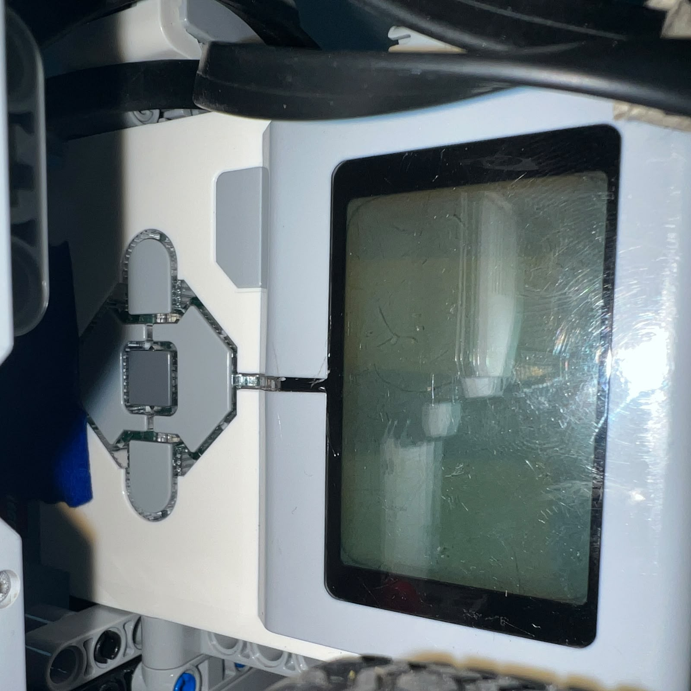

# 2. LEGO Mindstorms EV3 Intelligent Brick

<div align="center">


<br>

<sub><b>Figure 2.1.</b> LEGO Mindstorms EV3 Intelligent Brick installed as the main controller of Piolín.</sub>

</div>

The **LEGO Mindstorms EV3 Intelligent Brick** is the central controller of Piolín and one of the most important components in the complete WRO Future Engineers 2026 architecture. Both competition configurations are built around the same EV3 Brick, which means that propulsion, steering, sensor acquisition, navigation decisions, course-state interpretation, and the final autonomous behavior are all coordinated from a single main controller.

Keeping the EV3 as the center of the robot was a deliberate engineering decision. During Piolín's development, the team experimented with external processors and supporting controllers for different sensing tasks. These experiments demonstrated that additional processing hardware can expand what the robot is capable of doing, especially when cameras are involved, but they also showed the disadvantages of increasing the number of controllers, communication links, cables, and software environments that must operate correctly at the same time.

The current architecture therefore returns to a simpler principle: **the EV3 should directly control as much of the robot as possible**. The Open Challenge uses LEGO Mindstorms sensors connected directly to the EV3, while the Obstacle Challenge introduces only one major non-LEGO sensing device, the Pixy2.1 camera.

The result is a centralized system in which the EV3 is not simply a connection hub. It is the component that ultimately decides what Piolín should do.

---

## 2.1 Role of the EV3 in Piolín

The EV3 performs several different responsibilities simultaneously. It receives information about the environment, interprets that information according to the current navigation state, and converts the resulting decision into commands for the propulsion and steering motors.

The overall information flow is:

```text
ENVIRONMENT
     ↓
SENSORS
     ↓
LEGO EV3
     ↓
STATE INTERPRETATION
     ↓
NAVIGATION DECISION
     ↓
MOTOR COMMANDS
     ↓
PIOLÍN MOVEMENT
```

This organization means that the EV3 is responsible for the complete decision chain rather than receiving finished movement commands from another computer.

During the Open Challenge, the gyro does not decide when Piolín should turn, and the ultrasonic sensors do not directly move the steering motor. They provide measurements to the EV3. The EV3 interprets those measurements and determines the final response.

The same principle is used during Obstacles. Pixy2.1 identifies visual blocks and provides their position, but the camera does not directly command the steering mechanism. The EV3 interprets the visual information together with the current vehicle state and surrounding geometry before determining the final steering command.

---

## 2.2 Why the EV3 Was Retained as the Main Controller

The EV3 was retained because the majority of Piolín's hardware already belongs to the LEGO Mindstorms ecosystem. Both motors, both ultrasonic sensors, the Color Sensor, the Gyro Sensor used in Open, and the rechargeable battery are designed around the same platform.

This creates an important compatibility advantage.

```text
EV3 Controller
     │
     ├── EV3 Large Motor
     ├── EV3 Medium Motor
     ├── EV3 Ultrasonic Sensors
     ├── EV3 Color Sensor
     ├── EV3 Gyro Sensor
     └── EV3 Battery
```

Instead of designing additional interfaces for each of these components, the EV3 can communicate with them through its standard ports.

Centralization also improves troubleshooting. If the robot unexpectedly turns, stops, misses a wall, or counts a course marking incorrectly, the team can trace the problem through one main control system rather than attempting to synchronize several independent motion controllers.

This becomes particularly important during competition preparation, when reliability and the ability to make rapid adjustments are often more valuable than adding additional computational hardware.

---

## 2.3 EV3 Hardware Interfaces Used by Piolín

The EV3 provides dedicated ports for motors and sensors. Piolín uses two motor outputs and all four sensor inputs.

The permanent motor assignment is:

```text
A = EV3 Large Motor
    Rear propulsion

B = EV3 Medium Motor
    Ackermann steering
```

The sensor architecture is partly permanent and partly challenge-specific:

```text
S2 = Left Ultrasonic Sensor

S3 = Right Ultrasonic Sensor

S4 = Color Sensor
```

while:

```text
S1 = Gyro Sensor
     during Open
```

or:

```text
S1 = Pixy2.1
     during Obstacles
```

<div align="center">


<br>

<sub><b>Figure 2.2.</b> Motor connections used by Piolín. Port A controls propulsion while Port B controls steering.</sub>

</div>

<div align="center">


<br>

<sub><b>Figure 2.3.</b> EV3 sensor input area. S1 is challenge-specific while S2, S3, and S4 retain permanent functions.</sub>

</div>

This fixed naming is important because the software documentation must match the physical robot.

The current hardware convention is always:

```text
S2 = LEFT

S3 = RIGHT
```

Older code versions that used a different assignment should not be interpreted as the current wiring reference.

---

## 2.4 Motor Port A — Propulsion

Motor Port A is connected to the **LEGO EV3 Large Motor**, which powers the rear drivetrain.

```text
EV3
 │
 ▼
PORT A
 │
 ▼
EV3 LARGE MOTOR
 │
 ▼
REAR DRIVETRAIN
 │
 ▼
REAR WHEELS
```

The Large Motor was selected for the propulsion role because driving places the highest continuous mechanical demand on the vehicle. The motor must accelerate the complete robot, maintain forward motion, reverse when required, and continue providing torque while the steering mechanism changes the orientation of the front wheels.

The EV3 controls the motor electronically while the mechanical drivetrain determines how that rotation reaches the rear wheels.

This creates a clear separation between computation and mechanics:

```text
EV3
determines desired motion
        ↓
Large Motor
produces rotational motion
        ↓
Drivetrain
transfers motion
        ↓
Rear wheels
move the vehicle
```

The drivetrain itself is documented in greater detail in the mobility section, while the [Motors documentation](03_Motors.md) explains the actuator characteristics and their integration with the robot.

---

## 2.5 Motor Port B — Steering

Motor Port B is connected to the **LEGO EV3 Medium Motor**, which actuates the front Ackermann-style steering system.

```text
EV3
 │
 ▼
PORT B
 │
 ▼
EV3 MEDIUM MOTOR
 │
 ▼
STEERING LINKAGE
 │
 ▼
FRONT WHEELS
```

A Medium Motor is appropriate for this role because the steering system requires controlled angular positioning rather than continuous propulsion of the entire robot.

The EV3 can therefore treat the two motors differently:

```text
Port A
→ vehicle propulsion

Port B
→ steering position
```

This separation is important in software because propulsion and steering decisions can be calculated independently before being applied to the physical system.

The steering motor's encoder position should not be confused with the actual angle of the front wheels. The mechanical linkage transforms Motor B rotation into wheel movement, which means that steering calibration must be based on the installed mechanism rather than only on the motor's internal encoder.

---

## 2.6 The EV3 as the Center of a Car-Like Robot

Piolín differs from many educational EV3 robots because it does not use two independently driven wheels to turn.

Instead, the EV3 controls:

```text
one propulsion actuator
+
one steering actuator
```

which creates a car-like vehicle architecture.

<div align="center">


<br>

<sub><b>Figure 2.4.</b> Front Ackermann-style steering mechanism controlled by Motor B while Motor A independently drives the rear propulsion system.</sub>

</div>

This matters because the EV3 software cannot simply command a left motor and a right motor at different speeds to rotate the vehicle. Instead, it must coordinate vehicle movement with steering angle.

When steering becomes stronger, the vehicle follows a tighter curved trajectory. When steering returns toward center, the robot progressively approaches straight-line motion.

This vehicle-like control model influences ultrasonic interpretation, gyro correction, obstacle avoidance, cornering, and parking.

---

## 2.7 Sensor Port S2 — Left Ultrasonic Sensor

S2 is permanently assigned to the **left LEGO EV3 Ultrasonic Sensor**.

```text
S2 = LEFT
```

<div align="center">


<br>

<sub><b>Figure 2.5.</b> Left lateral ultrasonic sensor assigned to S2.</sub>

</div>

The EV3 uses this measurement to understand the geometry on the left side of the vehicle.

Depending on course direction, the same physical sensor can become either the inner-wall reference or the outer-wall reference.

The hardware identity remains:

```text
LEFT
```

while the EV3 software assigns its navigation meaning.

---

## 2.8 Sensor Port S3 — Right Ultrasonic Sensor

S3 is permanently assigned to the **right LEGO EV3 Ultrasonic Sensor**.

```text
S3 = RIGHT
```

<div align="center">


<br>

<sub><b>Figure 2.6.</b> Right lateral ultrasonic sensor assigned to S3.</sub>

</div>

Together, S2 and S3 provide Piolín with a two-sided description of the track.

The EV3 can compare:

```text
LEFT DISTANCE
       +
RIGHT DISTANCE
```

rather than relying exclusively on a single wall measurement.

The hardware relationship remains fixed:

```text
S2 = LEFT

S3 = RIGHT
```

while software determines which one is logically:

```text
INNER
```

or:

```text
OUTER
```

according to the detected direction of travel.

The detailed inner/outer transformation belongs in the [Ultrasonic Sensors documentation](05_UltrasonicSensors.md) rather than being duplicated here.

---

## 2.9 Sensor Port S4 — Color Sensor

S4 is permanently connected to the downward-facing **LEGO EV3 Color Sensor**.

<div align="center">


<br>

<sub><b>Figure 2.7.</b> Downward-facing Color Sensor permanently assigned to EV3 Port S4.</sub>

</div>

The EV3 interprets the floor sensor differently from the ultrasonic sensors.

Ultrasonic information describes geometry.

The Color Sensor describes **course events**.

The current direction convention is:

```text
BLUE FIRST
→ COUNTERCLOCKWISE


ORANGE FIRST
→ CLOCKWISE
```

The EV3 can then use later valid floor events to update course progression.

This avoids asking wheel encoders or the gyro to estimate the complete course without external landmarks.

The Color Sensor's physical isolation casing also improves the optical measurement environment before the data reaches the controller.

---

## 2.10 S1 as a Modular Sensor Port

The most distinctive feature of Piolín's EV3 configuration is **Port S1**.

S1 is intentionally not permanently assigned to one sensor.

Instead:

```text
                    S1
                    │
          ┌─────────┴─────────┐
          │                   │
          ▼                   ▼
        OPEN               OBSTACLES
          │                   │
          ▼                   ▼
     EV3 GYRO              PIXY2.1
```

<div align="center">


<br>

<sub><b>Figure 2.8.</b> S1 is intentionally reassigned between competition rounds to provide the sensing modality most valuable for each challenge.</sub>

</div>

This is a direct response to the EV3's limited number of sensor inputs.

Instead of attempting to keep every sensor connected simultaneously, Piolín uses S1 as a **challenge-specific interface**.

The decision allows the robot to retain:

```text
2 lateral ultrasonic sensors
+
1 floor sensor
+
1 specialized round sensor
```

in each competition mode.

---

## 2.11 Open Challenge EV3 Configuration

During Open, S1 is occupied by the **LEGO EV3 Gyro Sensor**.

The complete port assignment is:

| Port | Open Challenge Component |
| :---: | :--- |
| A | EV3 Large Motor — Drive |
| B | EV3 Medium Motor — Steering |
| S1 | EV3 Gyro Sensor |
| S2 | Left EV3 Ultrasonic Sensor |
| S3 | Right EV3 Ultrasonic Sensor |
| S4 | EV3 Color Sensor |

<div align="center">


<br>

<sub><b>Figure 2.9.</b> Reproducible EV3 connection map for Piolín's current Open Challenge configuration.</sub>

</div>

In this mode, the EV3 combines three complementary types of information.

```text
S2 + S3
→ lateral geometry


S1
→ angular orientation


S4
→ course state
```

The EV3 then converts that information into:

```text
Motor A
→ propulsion

Motor B
→ steering
```

---

## 2.12 Why the Gyro Is Connected Directly to the EV3

The gyro is a LEGO EV3 sensor, making it naturally compatible with the same controller that handles the motors and ultrasonic sensors.

<div align="center">


<br>

<sub><b>Figure 2.10.</b> Gyro Sensor installed as the Open Challenge S1 device.</sub>

</div>

Direct integration avoids the need to relay angle information through another processor.

The EV3 can read:

```text
wall geometry
+
gyro rotation
+
floor state
```

inside the same navigation loop.

The gyro was reintroduced specifically because the ultrasonic sensors describe lateral position better than orientation. By reading both types of sensors directly, the EV3 can use each measurement for the physical quantity it represents best.

---

## 2.13 Obstacle Challenge EV3 Configuration

For the Obstacle Challenge, the Gyro Sensor is removed and Pixy2.1 occupies S1.

The remaining hardware connections stay unchanged.

| Port | Obstacle Challenge Component |
| :---: | :--- |
| A | EV3 Large Motor — Drive |
| B | EV3 Medium Motor — Steering |
| S1 | Pixy2.1 |
| S2 | Left EV3 Ultrasonic Sensor |
| S3 | Right EV3 Ultrasonic Sensor |
| S4 | EV3 Color Sensor |

<div align="center">


<br>

<sub><b>Figure 2.11.</b> Reproducible EV3 connection map for Piolín's current Obstacle Challenge configuration.</sub>

</div>

This means that the same EV3 executes both rounds, but the information arriving through S1 changes.

```text
OPEN

S1
→ vehicle rotation


OBSTACLES

S1
→ visual target information
```

This is a strong example of hardware reuse because one controller supports two different sensor architectures without requiring a different vehicle.

---

## 2.14 Direct Pixy2.1 Integration

Pixy2.1 is the only major current sensor that is not part of the LEGO Mindstorms EV3 ecosystem.

<div align="center">


<br>

<sub><b>Figure 2.12.</b> Pixy2.1 physical connection used for the Obstacle Challenge S1 configuration.</sub>

</div>

The current architecture connects the camera directly to the EV3 through the S1 interface rather than using the previous HuskyLens–Arduino Nano communication chain.

Conceptually:

```text
CURRENT

Pixy2.1
   ↓
S1
   ↓
EV3
```

Compared with the previous architecture:

```text
LEGACY

HuskyLens
   ↓
Arduino Nano
   ↓
USB
   ↓
EV3
```

Removing the intermediate controller reduces the number of devices and software layers between visual perception and the final navigation controller.

The detailed reasons for this change are preserved in the legacy documentation and the current [Pixy2.1 Vision documentation](07_PixyVision.md).

---

## 2.15 EV3 Decision-Making During Obstacles

Pixy2.1 can provide visual information such as:

```text
Signature

X position

Y position

Width

Height
```

The EV3 can use that information to determine which obstacle is relevant and how the vehicle should react.

The current signature mapping is:

```text
Signature 1
→ Pink parking target


Signature 2
→ Red pillar
→ Pass RIGHT


Signature 3
→ Green pillar
→ Pass LEFT
```

However, the signature alone does not determine the complete movement.

The EV3 must also consider the current navigation state and the geometry provided by the lateral sensors.

This keeps the Pixy as a **perception sensor** and the EV3 as the **navigation controller**.

A more detailed explanation of target selection, visual position, and Pixy/ultrasonic interaction is kept in `07_PixyVision.md` rather than duplicated here.

---

## 2.16 EV3 Software Environment

The same physical EV3 supports different software paths because the requirements of the two rounds are different.

The current Open implementation uses:

```text
Pybricks MicroPython
```

while the current obstacle-development path uses:

```text
ev3dev2
+
SMBus / I2C
```

This difference does not mean that Piolín uses two controllers.

It means the same EV3 can execute different software depending on the installed S1 device.

Conceptually:

```text
OPEN

S1 = Gyro
   ↓
Open Challenge program
   ↓
Pybricks
```

and:

```text
OBSTACLES

S1 = Pixy2.1
   ↓
Obstacle Challenge program
   ↓
ev3dev2 + SMBus/I2C
```

Keeping the round programs separate is preferable to forcing one large program to support two incompatible S1 configurations simultaneously.

The repository can therefore maintain conceptually separate entry points such as:

```text
src/open_challenge.py

src/obstacle_challenge.py
```

with each program clearly documenting the hardware it expects.

---

## 2.17 EV3 Power Integration

The EV3 is powered by the **LEGO Mindstorms EV3 Rechargeable DC Battery, part 45501**.

<div align="center">


<br>

<sub><b>Figure 2.13.</b> Rechargeable EV3 Battery 45501 used as Piolín's main competition power source.</sub>

</div>

Using the standard EV3 battery allows most of Piolín's electrical architecture to remain inside one ecosystem.

The EV3 supplies and controls the LEGO motors and LEGO sensors through their normal interfaces, which avoids the need for separate motor drivers or additional power electronics for the primary mobility system.

Earlier architectures that introduced additional controllers also introduced additional questions about:

```text
power distribution

communication

external wiring

device initialization
```

The current system removes much of that complexity.

A detailed description of the electrical arrangement is provided in [Power Distribution](09_PowerDistribution.md).

---

## 2.18 EV3 User Interface During Testing

The physical EV3 interface also provides useful features during development.

The brick includes its screen and physical buttons, which can be used to:

```text
start programs

select modes

display diagnostic values

confirm sensor readings

stop a test

navigate programs
```

<div align="center">



<br>

<sub><b>Figure 2.14.</b> EV3 screen and button interface used during calibration, debugging, and program execution.</sub>

</div>

This is useful during track testing because the team can verify basic sensor behavior without adding an external display to the vehicle.

Diagnostic versions of the software can expose values such as:

```text
gyro angle

left distance

right distance

detected floor state

corner count

Pixy signature
```

before the complete autonomous behavior is evaluated.

---

## 2.19 Centralized Diagnostics

A navigation failure can originate from several layers.

For example:

```text
Robot turns the wrong way
```

does not automatically mean:

```text
Steering motor is wrong
```

The actual chain may be:

```text
sensor
  ↓
incorrect reading
  ↓
incorrect interpretation
  ↓
wrong navigation state
  ↓
correct motor response
to wrong information
```

Because the major information sources converge on the EV3, debugging can inspect the system in stages:

```text
RAW SENSOR
    ↓
PROCESSED VALUE
    ↓
STATE
    ↓
REQUESTED STEERING
    ↓
ACTUAL MOTOR COMMAND
```

This is another reason Piolín avoids unnecessary controller fragmentation.

The concept is simple enough to explain directly in the documentation and does not require a separate diagram.

---

## 2.20 Comparison with Alternative Controllers

During development, Piolín explored or considered external processing approaches including Arduino-based interfaces and Raspberry Pi concepts.

The alternatives offer real advantages, but they also introduce different engineering costs.

| Controller Architecture | Main Strength | Main Limitation for Piolín |
| :--- | :--- | :--- |
| EV3-centered | Direct compatibility with motors and LEGO sensors | Limited computing and port resources |
| Arduino as additional controller | Flexible interface with many devices | Adds another firmware and communication layer |
| Raspberry Pi | Greater computing capability and flexible software environment | Adds power, startup, integration, and communication complexity |
| EV3 + Nano + HuskyLens | Enabled external vision integration | Multi-stage vision communication path |
| **Current EV3 + round-specific S1** | **Centralized control with specialized sensing when required** | **Requires changing the S1 device between rounds** |

The current design does not claim that the EV3 is more computationally powerful than all alternatives.

That was not the selection criterion.

The more important question was:

> Which controller architecture provides enough capability for Piolín while minimizing unnecessary integration risk?

For the current robot, the answer was the EV3-centered architecture.

---

## 2.21 Advantages of the EV3 Architecture

The EV3 provides several advantages for the current system.

First, it provides direct integration with almost every major active component. This reduces the amount of custom interface electronics required.

Second, it allows propulsion, steering, wall sensing, floor sensing, and round-specific sensing to be coordinated from one location.

Third, the controller has already been integrated into the mechanical chassis, making its physical position, cable routes, battery, and software workflow part of a mature vehicle platform rather than a separate prototype.

Fourth, keeping the EV3 in control simplifies the relationship between software and mechanical behavior. A steering correction produced by the navigation logic can become a Motor B command without passing through another main controller.

These advantages improve:

```text
system simplicity

fault isolation

software traceability

competition preparation

reproducibility
```

---

## 2.22 Limitations of the EV3

The EV3 also imposes constraints that influenced the final design.

The most obvious is the limited number of sensor ports. Piolín needs:

```text
two lateral ultrasonic sensors

one Color Sensor

gyro for Open

Pixy for Obstacles
```

Instead of adding another controller simply to keep all possible sensors connected simultaneously, Piolín uses the round-specific S1 architecture.

```text
S1
↓
the sensor actually required
for the current challenge
```

Another limitation is that visual sensing is more demanding than reading typical LEGO sensors. This is one reason the Obstacle software currently uses a different software path for direct Pixy communication.

The architecture therefore accepts the EV3's limitations and designs around them rather than attempting to make the controller behave like a larger general-purpose computer.

---

## 2.23 Why a Front Ultrasonic Sensor Was Removed

Earlier Piolín versions used or considered a third ultrasonic sensor facing forward.

That sensor could provide direct frontal distance information. However, the current architecture gives greater value to the round-specific S1 device.

The engineering trade-off became:

```text
Front Ultrasonic
        vs.
Round-Specific Sensor
```

During Open, the gyro provides direct rotational information.

During Obstacles, Pixy2.1 provides visual target identity and image position.

The front ultrasonic was therefore removed from the final current architecture.

This decision illustrates an important systems principle:

> A useful component can still be removed if another use of the same limited resource provides more valuable information.

---

## 2.24 Why the Arduino Nano Was Removed

The Arduino Nano was useful during the HuskyLens development stage because it provided an interface between the camera and the EV3.

The communication chain was:

```text
HuskyLens
    ↓
Arduino Nano
    ↓
USB
    ↓
EV3
```

This configuration demonstrated that Piolín could integrate a non-LEGO vision sensor with the EV3.

However, each additional device created another possible failure point.

A visual failure could originate from:

```text
camera recognition

camera configuration

camera-to-Nano communication

Nano firmware

Nano-to-EV3 communication

EV3 parsing

navigation logic
```

The current Pixy architecture reduces that chain:

```text
Pixy2.1
   ↓
EV3
```

The Nano was therefore removed not because it was incapable of functioning, but because its role was no longer necessary.

Removing a functioning component can still be an engineering improvement when it reduces unnecessary system complexity.

---

## 2.25 EV3 and Reproducibility

Using the EV3 as the central controller improves reproducibility.

A second team attempting to reconstruct Piolín can identify:

```text
one main controller

two motor connections

four sensor-port assignments

one battery system
```

The round-specific connection map is explicit.

### Open

```text
A  = Large Motor
B  = Medium Motor

S1 = Gyro
S2 = Left Ultrasonic
S3 = Right Ultrasonic
S4 = Color
```

### Obstacles

```text
A  = Large Motor
B  = Medium Motor

S1 = Pixy2.1
S2 = Left Ultrasonic
S3 = Right Ultrasonic
S4 = Color
```

The two dedicated port-map diagrams provide the visual reconstruction reference, so a second round-comparison diagram is unnecessary.

---

## 2.26 EV3 Hardware Verification

Before testing navigation, the EV3 connections can be verified subsystem by subsystem.

Motor A should activate only the propulsion drivetrain.

Motor B should move only the steering mechanism.

S2 should respond to changes on the left side of the robot.

S3 should respond to changes on the right side.

S4 should respond to floor colors.

During Open, S1 should report gyro information.

During Obstacles, S1 should report Pixy information.

This verification sequence isolates hardware mapping before calibration values or navigation algorithms are changed.

```text
PORT
 ↓
COMPONENT
 ↓
RAW RESPONSE
 ↓
CORRECT PHYSICAL EFFECT
```

If this relationship is wrong, software tuning should not begin until the hardware assignment is corrected.

---

## 2.27 Current vs. Historical EV3 Configurations

The EV3 has remained an important part of Piolín throughout development, but the devices attached to it have changed significantly.

Previous versions included combinations such as:

```text
front ultrasonic on S1

gyro-free navigation

different ultrasonic assignments

HuskyLens through Arduino Nano

earlier Pixy experiments
```

The current configuration should always take priority over those historical versions.

```text
                  CURRENT PIOLÍN

Motor A ───── EV3 Large Motor / Drive

Motor B ───── EV3 Medium Motor / Steering


               S1
                │
        ┌───────┴───────┐
        ▼               ▼
      OPEN           OBSTACLES
      Gyro            Pixy2.1


S2 ─────────── Left Ultrasonic

S3 ─────────── Right Ultrasonic

S4 ─────────── Color Sensor
```

Older architectures remain valuable as engineering evidence because they explain why the current port assignments and sensor roles were selected, but they are not current reconstruction instructions.

---

## 2.28 Current EV3 Responsibility Matrix

| EV3 Function | Open Challenge | Obstacle Challenge |
| :--- | :--- | :--- |
| Propulsion control | Motor A | Motor A |
| Steering control | Motor B | Motor B |
| Left wall measurement | S2 | S2 |
| Right wall measurement | S3 | S3 |
| Floor detection | S4 | S4 |
| Heading measurement | S1 Gyro | Not used |
| Visual perception | Not used | S1 Pixy2.1 |
| Course-state processing | Yes | Yes |
| Navigation decision | Yes | Yes |
| Final motor command | Yes | Yes |

The table shows that the EV3 remains the final decision-maker regardless of the challenge configuration.

---

## 2.29 Final Engineering Assessment

The LEGO Mindstorms EV3 was not selected because it eliminates every limitation of autonomous vehicle development. It was selected because it provides a strong integration point for Piolín's current combination of LEGO motors, sensors, mechanical architecture, and software strategy.

Its limited number of sensor ports directly influenced the modular S1 design. Its compatibility with LEGO motors made centralized propulsion and steering control practical. Its ability to run programmable navigation logic allows the team to combine ultrasonic geometry, color events, gyro heading, and Pixy vision without replacing the complete platform.

The evolution of Piolín therefore demonstrates an important systems-engineering lesson:

> **The best controller is not necessarily the controller with the greatest theoretical computing capability; it is the controller that integrates the required hardware and software with acceptable complexity, reliability, and reproducibility.**

For Piolín, the EV3 remains that controller.

```text
                     LEGO EV3
                        │
       ┌────────────────┼────────────────┐
       │                │                │
       ▼                ▼                ▼
   PROPULSION        STEERING        PERCEPTION
       │                │                │
       ▼                ▼       ┌────────┼────────┐
   Large Motor      Medium Motor  S2/S3   S4      S1
                                            │      │
                                            │   Round-specific
                                            │
                                        Course state
```

<div align="center">


<br>

<sub><b>Figure 2.15.</b> Top view of Piolín showing the EV3 integrated into the complete mechanical and sensing architecture.</sub>

</div>

The EV3 therefore serves as the common technological foundation connecting Piolín's mechanical design, sensing system, autonomous software, calibration workflow, and competition behavior.

---

<div align="center">

### [← Back to PiolínTech Main README](../../README.md)

</div>
