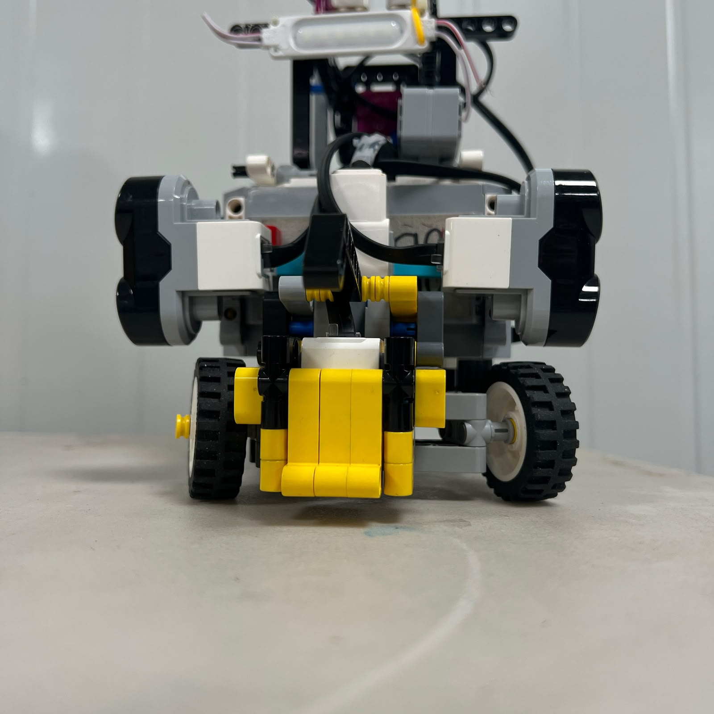
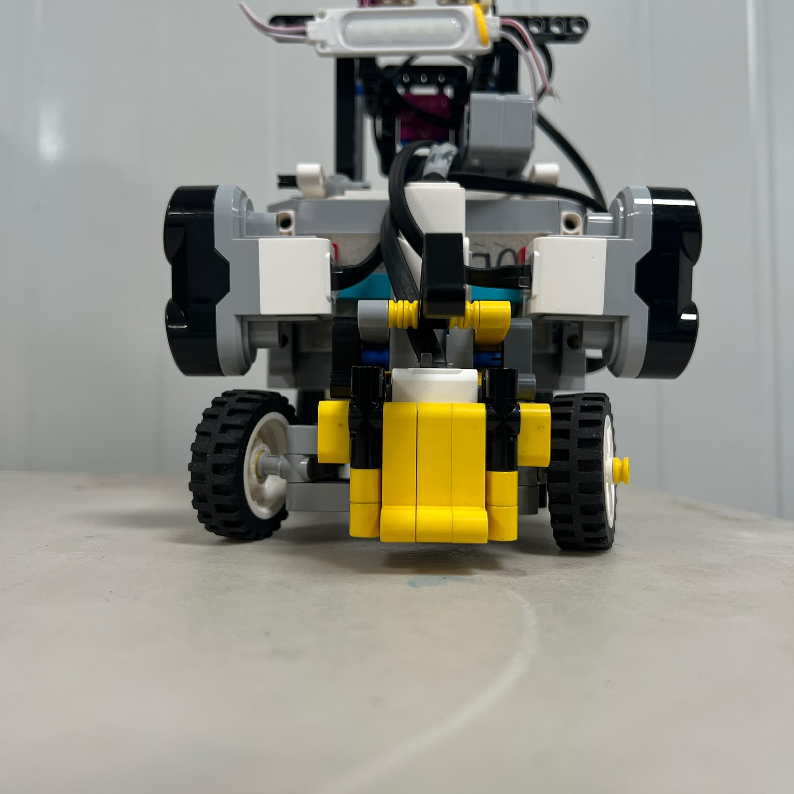

# 4. Steering Motor and Ackermann Actuation

<div align="center">


<br>

<sub><b>Figure 4.1.</b> LEGO Mindstorms EV3 Medium Motor installed on Piolín as the dedicated steering actuator connected to Motor Port B.</sub>

</div>

Piolín uses one **LEGO Mindstorms EV3 Medium Motor** connected to **Motor Port B** to control the complete front steering mechanism. Unlike Motor A, which is responsible for propulsion, Motor B does not move the robot forward. Its purpose is to position the front wheels so that Piolín can follow straight trajectories, negotiate corners, avoid obstacles, recover after lateral maneuvers, and align itself during parking.

The steering system is one of the most important mechanical-control interfaces in the robot because every navigation decision eventually has to become a physical wheel angle. Ultrasonic sensing, gyro correction, Pixy detections, color-state logic, and obstacle decisions can all calculate a desired direction, but none of those systems can move the robot laterally by themselves. Motor B is the actuator that converts those navigation decisions into physical steering.

Piolín does not use differential steering. Instead, Motor B drives a mechanical **Ackermann-style linkage** connected to both front wheels. This gives the vehicle a car-like turning behavior and creates a clear separation between propulsion and direction.

```text
Motor A
→ propulsion


Motor B
→ steering
```

The result is a system in which vehicle motion depends on the coordinated operation of both actuators rather than on different speeds between two drive wheels.

---

## 4.1 Steering System Architecture

The complete steering path can be represented as:

```text
Navigation decision
        ↓
EV3
        ↓
Motor Port B
        ↓
EV3 Medium Motor
        ↓
Mechanical steering linkage
        ↓
Left and right front wheel angles
        ↓
Vehicle turning trajectory
```

<div align="center">


<br>

<sub><b>Figure 4.2.</b> Steering actuation chain from an EV3 navigation command to the physical front-wheel trajectory.</sub>

</div>

This chain is important because a steering value in software does not directly represent a vehicle turning radius. The commanded motor position first passes through the Medium Motor, then through the steering linkage, then through the physical wheel geometry, and finally through the interaction between tires and the competition surface.

For this reason:

```text
software steering command
≠
motor encoder angle
≠
physical wheel angle
≠
turning radius
```

Each of these quantities describes a different layer of the steering system.

---

## 4.2 Why the EV3 Medium Motor Was Selected

The Medium Motor was selected because steering requires a different type of actuation from propulsion.

Motor A must continuously move the complete vehicle. Motor B only needs to reposition a mechanical linkage through a limited angular range. The steering actuator therefore benefits from being compact, responsive, and capable of repeatable position control rather than being optimized primarily for sustained propulsion load.

<div align="center">


<br>

<sub><b>Figure 4.3.</b> Mechanical integration of the EV3 Medium Motor with Piolín's front steering system.</sub>

</div>

Using the Medium Motor also helps keep the front section of the chassis compact. A larger steering actuator would occupy more space around the front axle and could interfere with the linkage, sensor placement, or wheel-clearance geometry.

The selection therefore follows the mechanical requirement rather than simply choosing the largest available actuator.

```text
Propulsion
→ high continuous vehicle load
→ Large Motor


Steering
→ controlled angular positioning
→ Medium Motor
```

This division gives each motor a specific role and avoids unnecessary mechanical capacity in the steering subsystem.

---

## 4.3 Why Ackermann Steering Was Used

Piolín uses an **Ackermann-style steering mechanism** rather than rotating both front wheels through exactly the same angle.

<div align="center">


<br>

<sub><b>Figure 4.4.</b> Top view of Piolín's current Ackermann-style front steering mechanism.</sub>

</div>

During a turn, the inner front wheel travels along a smaller radius than the outer front wheel. If both wheels were forced to the same angle, one or both tires would have to scrub laterally against the surface more than necessary.

Ideal Ackermann geometry therefore requires:

```text
INNER WHEEL
→ larger steering angle


OUTER WHEEL
→ smaller steering angle
```

The ideal relationship can be expressed as:

```text
cot(THETA_OUTER) - cot(THETA_INNER) = W / L
```

where:

```text
W = front track width

L = wheelbase

THETA_INNER = inner front-wheel angle

THETA_OUTER = outer front-wheel angle
```

The same turning geometry can also be represented through a vehicle-center turning radius `R`:

```text
THETA_INNER =
atan(
L / (R - W/2)
)
```

and:

```text
THETA_OUTER =
atan(
L / (R + W/2)
)
```

These equations describe the ideal geometric relationship. They are not used here to claim that the LEGO linkage produces mathematically perfect Ackermann steering at every position.

The physical Piolín mechanism is better described as **Ackermann-style** because real LEGO geometry includes finite link lengths, discrete mounting locations, mechanical play, and non-ideal pivot placement.

---

## 4.4 Actual Steering Motion

<div align="center">


<br>

<sub><b>Figure 4.5.</b> Actual movement of Piolín's current steering mechanism through its usable range.</sub>

</div>

The steering GIF provides direct evidence of the installed mechanism. It shows how one Medium Motor moves both front wheels through the mechanical linkage and makes it easier to observe the relative motion of the left and right steering assemblies.

This visual evidence is especially valuable because steering is a dynamic mechanism. A single photograph can show its construction, but it cannot clearly show:

```text
movement continuity

return toward center

relative wheel motion

mechanical clearance

left-to-right transition
```

The GIF should still be interpreted as physical evidence rather than mathematical proof of exact Ackermann geometry.

---

## 4.5 Motor B Encoder Position

The EV3 Medium Motor contains an internal rotational encoder. The EV3 can therefore know the approximate rotational position of Motor B and use that position as the steering actuator reference.

Conceptually:

```text
Motor B encoder
      ↓
steering reference
      ↓
mechanical linkage
      ↓
front-wheel orientation
```

However, the motor encoder measures the **motor shaft**, not the wheels.

Therefore:

```text
Motor B = 20°
```

does not imply:

```text
front wheels = 20°
```

The mechanism between them transforms the motion.

<div align="center">


<br>

<sub><b>Figure 4.6.</b> Motor B encoder position is transformed through the mechanical linkage before becoming a physical front-wheel angle.</sub>

</div>

The actual relationship may also be nonlinear. A fixed change in motor encoder position near the center does not necessarily create exactly the same wheel-angle change as the same motor movement close to a steering limit.

This is why the steering system must be calibrated as an installed mechanism.

---

## 4.6 Mechanical Steering Center

One of the most important references in the complete robot is the **steering center**.

<div align="center">


<br>

<sub><b>Figure 4.7.</b> Piolín's front wheels positioned at the physical steering-center reference.</sub>

</div>

The mechanical center represents the position at which the front wheels are aligned as closely as practical with the vehicle's longitudinal direction.

The software can then define a corresponding reference:

```text
STEERING_CENTER
```

All steering corrections are made relative to this position.

Conceptually:

```text
LEFT                   CENTER                    RIGHT
  ←-----------------------|------------------------→
                          0
```

The exact numerical convention depends on the active code, but in Piolín's current steering convention:

```text
positive steering
→ LEFT


negative steering
→ RIGHT
```

The sign convention is useful only if the physical motor orientation remains unchanged. If Motor B were physically reversed, the same software signs could produce the opposite wheel movement.

For that reason, steering direction should always be verified physically after mechanical changes.

---

## 4.7 Why Mechanical Center Matters

A small center error can affect the entire navigation system.

Suppose the software believes:

```text
Motor B = CENTER
```

but the actual wheels are slightly turned.

Piolín then begins a straight section with a small natural curvature.

The navigation system may observe:

```text
wall distance changes
```

or:

```text
gyro heading error
```

and continuously correct something that is actually caused by mechanical misalignment.

The resulting behavior can appear as:

```text
zig-zag

persistent wall drift

unequal left/right corrections

different corner behavior by direction
```

This is why steering-center verification should happen before wall-following gains or gyro gains are tuned.

A fundamental calibration principle is:

> **Software should not be used to hide a mechanical center error that can be corrected physically.**

---

## 4.8 Left and Right Steering Limits

The steering mechanism has finite physical limits.

<div align="center">



<br>

<sub><b>Figure 4.8.</b> Steering mechanism near its usable left-side limit.</sub>

</div>

<div align="center">



<br>

<sub><b>Figure 4.9.</b> Steering mechanism near its usable right-side limit.</sub>

</div>

The software should not command Motor B beyond the mechanically useful range.

Excessive steering travel can cause:

```text
linkage binding

increased tire scrub

motor stall load

structural flex

unpredictable steering geometry
```

A software limit can therefore be represented conceptually as:

```python
STEER = max(
    STEER_RIGHT_LIMIT,
    min(STEER_LEFT_LIMIT, STEER_REQUEST)
)
```

The exact current limit values should only be documented once the current V4 steering system is measured and verified.

---

## 4.10 Usable Range vs. Mechanical Maximum

The greatest mechanically possible steering angle is not necessarily the best angle to use during autonomous navigation.

Close to the mechanical extremes, several undesirable effects can become stronger:

```text
tire scrub

linkage stress

nonlinearity

large lateral acceleration

slow recovery

greater swept path
```

Therefore Piolín should use a **validated usable range** rather than simply command the largest physically possible steering motion.

This distinction is important:

```text
MECHANICAL MAXIMUM
≠
RECOMMENDED CONTROL LIMIT
```

The final control limit should be based on real turning behavior and repeatability.

---

## 4.11 Steering Symmetry

Ideally, equal-magnitude left and right motor requests should produce approximately comparable vehicle behavior.

In reality, LEGO steering mechanisms can develop slight asymmetries because of:

```text
link length

mounting position

axle friction

tire friction

structural flex

mechanical play
```

This means that:

```text
+X Motor B
```

and:

```text
-X Motor B
```

may not create perfectly symmetrical physical trajectories.

<div align="center">


<br>

<sub><b>Figure 4.10.</b> Steering symmetry can be evaluated by comparing equal-magnitude left and right commands under the same physical conditions.</sub>

</div>

If significant asymmetry appears, the first step should be to inspect the linkage mechanically before introducing separate software corrections.

Only persistent, repeatable physical asymmetry should justify direction-specific calibration.

---

## 4.12 Steering Repeatability

A useful steering system should not only reach one desired position once. It should return to similar physical positions repeatedly.

A repeatability sequence can be:

```text
CENTER
  ↓
LEFT
  ↓
CENTER
  ↓
RIGHT
  ↓
CENTER
```

repeated several times.

If the final center changes significantly between cycles, possible causes include:

```text
linkage backlash

loose axle connections

structural movement

motor-reference error

mechanical binding
```

<div align="center">


<br>

<sub><b>Figure 4.11.</b> Steering repeatability test structure for comparing repeated center, left, and right positioning.</sub>

</div>

This type of mechanical validation is especially important before tuning high-level navigation software.

---

## 4.13 Steering Backlash and Mechanical Play

No LEGO linkage is perfectly rigid.

Small clearances exist between:

```text
axles

pins

holes

steering arms

wheel pivots
```

When Motor B changes direction, part of the motor movement may initially take up this mechanical clearance before the wheels begin changing angle.

This is known as backlash or mechanical play.

Conceptually:

```text
Motor changes direction
        ↓
linkage clearance taken up
        ↓
wheel movement begins
```

Backlash can affect rapid sequences such as:

```text
avoid obstacle
→ countersteer
→ recenter
```

because the commanded motor reversal may not immediately produce an equal physical wheel reversal.

The current documentation therefore avoids claiming "zero play" or perfect steering response.

---

## 4.14 Steering and Chassis Rigidity

The steering mechanism relies on the chassis to maintain the relative positions of Motor B, the front pivots, and the linkage.

If the front chassis flexes:

```text
motor command remains the same
```

but:

```text
physical wheel geometry changes
```

This can create inconsistent steering even if the motor itself is operating correctly.

<div align="center">


<br>

<sub><b>Figure 4.12.</b> Front structural assembly supporting Motor B, steering linkage, and front-wheel pivots.</sub>

</div>

For this reason, structural reinforcement is part of steering accuracy.

A steering problem should not automatically be treated as a motor-control problem.

---

## 4.15 Steering and Vehicle Speed

The same physical steering angle can produce different practical behavior depending on vehicle speed.

At higher speed:

```text
more distance is traveled
during the same steering-response time
```

and lateral acceleration increases approximately according to:

```text
A_LATERAL =
V² / R
```

where:

```text
V = vehicle speed

R = turning radius
```

This means that increasing speed has a nonlinear effect on cornering demand.

If vehicle speed doubles while turning radius remains the same:

```text
lateral acceleration
increases by approximately 4×
```

This does not mean the robot literally experiences ideal rigid-body dynamics at every moment, but it demonstrates why steering and speed must be tuned together.

<div align="center">


<br>

<sub><b>Figure 4.13.</b> Steering performance depends on the interaction between Motor B position and Motor A propulsion speed.</sub>

</div>

---

## 4.16 Steering During Straight-Line Navigation

During a straight section, Motor B normally remains relatively close to the mechanical center.

The controller should avoid reacting aggressively to every small sensor variation because constant high-frequency steering corrections can create zig-zag.

Conceptually:

```text
small navigation error
        ↓
small steering correction


large navigation error
        ↓
stronger steering correction
```

This is preferable to a binary controller in which the robot is either:

```text
CENTER
```

or:

```text
FULL STEER
```

with nothing between them.

Progressive steering allows the mechanical system to stabilize smoothly.

---

## 4.17 Steering During the Open Challenge

During Open, Motor B receives steering decisions influenced primarily by:

```text
S1 Gyro

S2 Left Ultrasonic

S3 Right Ultrasonic

S4 course state
```

The ultrasonic sensors describe lateral track geometry, while the gyro describes orientation.

The EV3 can therefore separate two types of error:

```text
POSITION ERROR
→ too close / too far from wall


HEADING ERROR
→ vehicle rotated relative to desired direction
```

<div align="center">


<br>

<sub><b>Figure 4.14.</b> Motor B steering during Open is influenced by both lateral wall geometry and gyro-based orientation information.</sub>

</div>

The current strategy does not expect the gyro to determine lateral position, and it does not expect the ultrasonic sensors to provide a direct angular measurement.

Each sensor contributes the type of information it measures best.

---

## 4.18 Why Gyro Correction Should Not Fight Wall Correction

Because Open combines gyro and ultrasonic information, two steering requests can theoretically disagree.

For example:

```text
gyro says:
correct slightly LEFT
```

while:

```text
wall geometry says:
correct RIGHT
```

If both controllers independently produce large commands, they can fight each other and create oscillation.

A better architecture combines their influence inside one steering decision.

Conceptually:

```text
wall correction
+
gyro correction
        ↓
combined steering request
        ↓
Motor B
```

The gyro correction should therefore act as a stabilizing contribution rather than completely overriding valid wall geometry.

This is one reason the gyro is described as **assisting** Open navigation rather than replacing the lateral controller.

---

## 4.19 Steering During Open Corners

Cornering requires a larger steering request than normal straight-line corrections.

The sequence can be represented as:

```text
straight navigation
        ↓
corner condition detected
        ↓
steering magnitude increases
        ↓
vehicle rotates through corner
        ↓
gyro approaches expected heading change
        ↓
new wall geometry appears
        ↓
steering reduced
        ↓
straight stabilization
```

<div align="center">


<br>

<sub><b>Figure 4.15.</b> Conceptual Motor B sequence during an Open Challenge corner.</sub>

</div>

The corner should not end solely because a fixed amount of time has elapsed if better information is available.

The current direction of development is to use:

```text
gyro rotation
+
recovered wall geometry
```

as evidence that the vehicle has completed the turn.

---

## 4.20 Steering During the Obstacle Challenge

During Obstacles, the gyro is not connected.

S1 is occupied by Pixy2.1.

Motor B decisions are therefore influenced by:

```text
Pixy signature

Pixy X position

Pixy block dimensions

left ultrasonic

right ultrasonic

course state
```

The pillar color determines the required passing side:

```text
RED
→ pass RIGHT


GREEN
→ pass LEFT
```

However, Motor B should not use one fixed steering value for every red or green detection.

The required steering depends on where the pillar appears relative to the robot and how much safe space is available between the vehicle and the surrounding walls.

---

## 4.21 Pixy Horizontal Position and Steering

Pixy can report a block's horizontal image coordinate.

Conceptually:

```text
pillar far left in image
pillar near center
pillar far right in image
```

represent different relative visual situations.

The EV3 can calculate a visual error such as:

```text
E_X =
X_TARGET - X_BLOCK
```

and use that error as one factor in the steering request.

<div align="center">


<br>

<sub><b>Figure 4.16.</b> Pixy horizontal block position can influence the magnitude of an obstacle-avoidance steering request.</sub>

</div>

The final target value and control gain should only be documented once the current obstacle code has been calibrated.

---

## 4.22 Pillar Passing Side vs. Steering Direction

A particularly important distinction is:

```text
PASS LEFT OF PILLAR
```

does not always mean:

```text
STEER LEFT forever
```

An obstacle maneuver contains several phases.

For example, a green pillar requires a left-side pass:

```text
GREEN
   ↓
move trajectory toward left side of pillar
   ↓
pass obstacle
   ↓
countersteer
   ↓
recover normal trajectory
```

Similarly, red requires a right-side pass followed by recovery.

<div align="center">


<br>

<sub><b>Figure 4.17.</b> Obstacle steering is a multi-phase maneuver: avoidance, passing, countersteering, and recovery.</sub>

</div>

This is important because one of the main software problems during development was maintaining the avoidance direction for too long or reacting to a new camera observation before the previous maneuver had fully completed.

---

## 4.23 Countersteering

Countersteering is the action that returns Piolín from a displaced obstacle-avoidance path toward a useful straight trajectory.

Suppose Motor B steers strongly to avoid a pillar. The vehicle begins following a curved path away from the obstacle.

Once the pillar is passed, maintaining the same steering request would continue moving Piolín toward the track boundary.

The controller therefore needs an opposite steering phase.

```text
AVOID
   ↓
PASS
   ↓
COUNTERSTEER
   ↓
RECENTER
```

The timing and strength of this reversal matter greatly.

Too early:

```text
vehicle returns toward pillar
```

Too late:

```text
vehicle approaches wall
```

Too strong:

```text
vehicle overshoots center
```

Too weak:

```text
vehicle remains displaced
```

This is one reason Motor B control cannot be reduced to simple fixed left/right commands.

---

## 4.24 Steering and Post-Obstacle Recentering

After an obstacle, Piolín needs to establish a useful starting position for the next part of the course.

The lateral ultrasonic sensors provide important recovery information.

```text
Pixy
→ obstacle identity / visual position


S2 + S3
→ surrounding wall geometry
```

Once the pillar is no longer the primary steering concern, Motor B can progressively return control toward the wall-based navigation reference.

<div align="center">


<br>

<sub><b>Figure 4.18.</b> Post-obstacle recovery uses countersteering and lateral wall information to return Piolín toward a stable trajectory.</sub>

</div>

The recovery phase is as important as the avoidance itself because the next pillar may appear shortly after the previous maneuver.

---

## 4.25 Steering During Reverse Motion

Piolín can also steer while Motor A is driving backward.

The front wheels still determine vehicle curvature, but the trajectory is experienced in reverse.

For this reason, the same wheel position produces a different movement pattern relative to the vehicle's direction of travel.

Reverse steering is particularly relevant when Piolín backs away from:

```text
a wall

a pillar

an unsuccessful approach

a parking position
```

The steering system itself does not change, but the software must interpret the desired recovery path correctly.

---

## 4.26 Steering and Parking

Parking requires more precise alignment than ordinary navigation because the final position matters more than simply avoiding a collision.

Motor B may need to:

```text
align before entry

hold a controlled angle

change steering during entry

return toward center
```

while Motor A controls displacement.

The exact Open and Obstacle parking strategies are still being tuned, so this document does not present one final parking steering angle.

The important hardware fact is that the same Motor B and Ackermann mechanism are used for:

```text
wall corrections

corners

obstacle avoidance

countersteering

parking
```

This makes steering calibration one of the most reusable calibrations in the entire robot.

---

## 4.27 Steering Control Smoothing

A requested steering value can change suddenly in software.

For example:

```text
+20
→
-20
```

between consecutive control iterations.

Physically commanding that transition immediately can produce a strong steering reversal.

A smoothing concept can instead produce:

```text
+20
+12
+4
-4
-12
-20
```

over several updates.

One general smoothing relationship is:

```text
STEER_NEW =
ALPHA × STEER_PREVIOUS
+
(1 - ALPHA) × STEER_REQUEST
```

where `ALPHA` determines how strongly the previous command is retained.

<div align="center">


<br>

<sub><b>Figure 4.19.</b> Conceptual comparison between abrupt steering changes and progressive command smoothing.</sub>

</div>

Smoothing can reduce oscillation and mechanical shock, but too much smoothing also delays reaction.

Therefore:

```text
more smoothing
→ greater stability
→ slower response


less smoothing
→ faster response
→ potentially more oscillation
```

The final amount should be selected from actual driving behavior rather than from theory alone.

---

## 4.28 Steering Deadband

A deadband can be used around the steering center so that extremely small control errors do not constantly move Motor B.

Conceptually:

```text
if ABS(error) <= DEAD_BAND:
    steering correction = 0
```

The purpose is not to ignore meaningful navigation error.

It is to prevent sensor noise or extremely small variations from producing constant left-right movement.

A useful deadband must balance:

```text
stability
```

against:

```text
position accuracy
```

A deadband that is too small may contribute to zig-zag.

A deadband that is too large allows the robot to drift before correcting.

---

## 4.29 Steering Response and Zig-Zag

Zig-zag behavior can be caused by several different mechanisms.

```text
controller too aggressive

steering response too delayed

deadband too small

sensor noise

mechanical center incorrect

steering backlash

vehicle speed too high
```

Therefore, observing zig-zag does not prove that one PID or steering gain is wrong.

The diagnostic process should first determine whether the oscillation originates from:

```text
SENSING
MECHANICS
CONTROL
or
SPEED
```

<div align="center">


<br>

<sub><b>Figure 4.20.</b> Zig-zag can result from sensing, mechanical alignment, control aggressiveness, or vehicle speed rather than from one single steering parameter.</sub>

</div>

---

## 4.30 Ackermann Geometry vs. Actual Competition Path

Ideal Ackermann equations describe wheel geometry under simplified assumptions.

The real competition robot also includes:

```text
tire deformation

track friction

mechanical play

finite chassis rigidity

changing speed

wall corrections

camera-driven maneuvers
```

Therefore, theoretical Ackermann geometry provides a useful reference but cannot alone predict the exact path Piolín will follow.

The engineering process is:

```text
theory
  ↓
mechanical implementation
  ↓
measurement
  ↓
calibration
  ↓
track validation
```

This distinction prevents theoretical calculations from being presented as experimental results.

---

## 4.31 Turning Radius

For a simplified bicycle model:

```text
R =
L / tan(DELTA)
```

where:

```text
R = approximate turning radius

L = wheelbase

DELTA = equivalent steering angle
```

This relationship explains a basic property of steering:

```text
larger wheel angle
→ smaller turning radius


smaller wheel angle
→ larger turning radius
```

However, Piolín's current final wheelbase and effective physical steering angle should be measured before a final numerical minimum turning radius is published.

<div align="center">


<br>

<sub><b>Figure 4.21.</b> Ideal geometric relationship between wheelbase, steering angle, and vehicle turning radius.</sub>

</div>

---

## 4.32 Why Minimum Turning Radius Matters

The minimum usable turning radius influences:

```text
corner width

obstacle avoidance clearance

recovery path

parking geometry
```

A steering mechanism that can achieve extremely tight wheel angles is not necessarily better if those angles create excessive scrub or make recovery unstable.

The target is therefore not:

```text
smallest possible R
```

but rather:

```text
smallest repeatable and controllable R
```

that remains useful in the actual competition environment.

---

## 4.33 Comparison with Differential Steering

Piolín could theoretically have used differential steering, where two independently driven wheels turn the robot by rotating at different speeds.

That architecture has advantages. It is mechanically simple and can produce very tight turns.

However, it behaves differently from the vehicle-like architecture desired for Piolín.

| Steering Architecture | Strength | Limitation for Piolín |
| :--- | :--- | :--- |
| Differential drive | Simple turning and small rotation radius | Vehicle does not follow conventional front-steered geometry |
| Single rigid front steering axle | Simpler than Ackermann | Greater tire scrub because front wheels share one angle |
| External hobby servo steering | Compact and fast | Requires non-LEGO actuator integration, power, and control interface |
| Large EV3 Motor steering | Strong actuator | Larger and less space-efficient for steering |
| **EV3 Medium Motor + Ackermann-style linkage** | **Direct EV3 integration and car-like steering** | **Requires mechanical calibration and linkage design** |

The selected architecture therefore balances:

```text
vehicle-like motion

LEGO compatibility

software control

mechanical simplicity

reproducibility
```

---

## 4.34 Why an External Servo Was Not Used

A conventional hobby servo could provide compact position-controlled steering and is common in small autonomous vehicles.

However, adding one would require a different electrical and control architecture.

Possible additional requirements could include:

```text
servo-compatible power supply

signal interface

additional electronics

non-LEGO mechanical mounting

new software interface
```

The EV3 Medium Motor already provides encoder feedback and is directly supported by the main controller.

For Piolín, the Medium Motor therefore gives enough steering capability without creating another actuator ecosystem.

The choice was not based on the claim that an EV3 Medium Motor is universally better than a servo. It was based on compatibility with the rest of the robot.

---

## 4.35 Why a Large Motor Was Not Used for Steering

A Large Motor could also move the steering linkage, but its larger size and different role would offer little advantage in the current front assembly.

The steering subsystem needs:

```text
controlled position

compact installation

sufficient steering torque

rapid left/right changes
```

rather than propulsion-oriented continuous mechanical output.

The Medium Motor satisfies these requirements while leaving more space around the front structure.

This allows the Large Motor to remain dedicated to the mechanically more demanding propulsion subsystem.

---

## 4.36 Interaction with Sensor Geometry

Steering changes the orientation of the entire robot.

That means every strong Motor B command changes how the lateral ultrasonic sensors see the walls.

For example:

```text
robot begins turn
       ↓
chassis rotates
       ↓
US sensor orientation changes relative to wall
       ↓
measured distance changes
```

Part of that distance change can result from actual lateral movement, while another part can result from angular orientation.

This is especially important during corners.

The controller should not assume that every ultrasonic distance change is caused purely by sideways displacement.

<div align="center">


<br>

<sub><b>Figure 4.22.</b> Vehicle rotation changes the geometry observed by the lateral ultrasonic sensors even before large lateral displacement occurs.</sub>

</div>

This is another reason the gyro is useful during Open.

---

## 4.37 Interaction with Pixy Field of View

Steering also changes what Pixy2.1 can see.

During an obstacle maneuver:

```text
Motor B steers
     ↓
robot yaw changes
     ↓
camera orientation changes
     ↓
pillar moves through image
```

A pillar that disappears from the Pixy image has not necessarily been physically passed.

It may simply have moved outside the camera's current field of view.

This means camera-loss logic should not automatically command immediate steering reversal.

The steering subsystem and vision subsystem must be interpreted together.

---

## 4.38 Steering Failure Modes

Several observable failures can originate in the steering subsystem.

| Observed Behavior | Possible Cause |
| :--- | :--- |
| Robot constantly curves on a straight | Mechanical center error |
| Left turns stronger than right | Linkage asymmetry or unequal calibration |
| Steering responds late | Excessive smoothing, backlash, mechanical resistance |
| Steering oscillates | High gain, sensor noise, excessive speed, poor center |
| Motor moves but wheels barely move | Loose linkage / backlash |
| Motor stalls near limit | Steering command exceeds useful mechanical range |
| Robot exits corners rotated | Corner steering or gyro/geometry transition issue |
| Robot passes pillar but hits wall | Countersteering/recovery too late |
| Robot turns back toward pillar | Countersteering too early |
| Same command gives different results | Mechanical play, traction, battery/load variation |

The table emphasizes that steering failures should be diagnosed from both the mechanical and software perspectives.

---

## 4.39 Steering Diagnostic Order

When steering behaves incorrectly, the recommended diagnostic sequence is:

```text
1. Check physical wheel center
        ↓
2. Check linkage freedom
        ↓
3. Check Motor B attachment
        ↓
4. Check left/right physical range
        ↓
5. Check encoder response
        ↓
6. Check software sign convention
        ↓
7. Check steering limits
        ↓
8. Check sensor input
        ↓
9. Check controller gain/smoothing
        ↓
10. Check behavior at operating speed
```

This order prevents a navigation controller from being tuned around a mechanical problem.

---

## 4.40 Steering Calibration Variables

Several variables can eventually be documented from the final V4 calibration.

Examples include:

```text
STEERING_CENTER

STEERING_LEFT_LIMIT

STEERING_RIGHT_LIMIT

STEERING_DEADBAND

STEERING_SMOOTHING

MOTOR_TO_WHEEL_RELATION

TURNING_RADIUS
```

These variables describe different properties and should not be treated as interchangeable.

For example:

```text
STEERING_LEFT_LIMIT
```

is a motor-control boundary, while:

```text
TURNING_RADIUS
```

is a vehicle-level result.

The relationship between them must be measured through the complete mechanical system.

---

## 4.41 Values Intentionally Not Claimed as Final

The following steering values are not presented numerically in this component document until they have been measured on the current V4 robot:

```text
final Motor B center value

final left steering limit

final right steering limit

exact wheel angle at each limit

exact motor-angle to wheel-angle ratio

final wheelbase

final front track width

minimum usable turning radius

steering response time

measured left/right symmetry error

steering repeatability error

mechanical backlash magnitude
```

Older values may remain useful as development history, but they should not be presented as final physical specifications without current validation.

---

## 4.42 Current Steering Architecture

The final current steering hardware is therefore:

```text
LEGO EV3
   ↓
Motor Port B
   ↓
EV3 Medium Motor
   ↓
Mechanical Ackermann-style linkage
   ↓
Two front steering wheels
```

The same steering hardware is used in:

```text
OPEN
+
OBSTACLES
```

Only the information driving the steering decision changes.

During Open:

```text
gyro
+
ultrasonics
+
course state
```

influence Motor B.

During Obstacles:

```text
Pixy2.1
+
ultrasonics
+
course state
```

influence Motor B.

<div align="center">


<br>

<sub><b>Figure 4.23.</b> Motor B remains the same actuator in both rounds while its sensor inputs change with the competition task.</sub>

</div>

This makes the steering system one of the most stable reusable subsystems in the complete Piolín architecture.

---

## 4.43 Final Engineering Assessment

Piolín's steering system was selected because it combines **direct EV3 control, compact actuation, vehicle-like motion, and a mechanically understandable linkage**.

The Medium Motor provides a clear encoder-based steering reference, while the Ackermann-style mechanism converts that motion into coordinated front-wheel steering.

The architecture also exposes an important systems-engineering lesson: steering accuracy does not belong to one component alone.

```text
Sensor information
      ↓
Control algorithm
      ↓
Motor B
      ↓
Mechanical linkage
      ↓
Wheel geometry
      ↓
Tire-track interaction
      ↓
Actual trajectory
```

A failure in any one of those layers can appear as a steering problem.

For that reason, Piolín's steering system is treated as a complete **mechatronic subsystem** rather than simply as an EV3 Medium Motor.

<div align="center">


<br>

<sub><b>Figure 4.24.</b> Current Piolín steering subsystem integrating Motor B, mechanical linkage, front-wheel pivots, and the vehicle chassis.</sub>

</div>

The final design provides one common steering platform that can support wall navigation, gyro-assisted corners, Pixy-based obstacle avoidance, recovery maneuvers, reverse motion, and parking without changing the physical actuator between competition rounds.

---

<div align="center">

### [← Back to PiolínTech Main README](../../README.md)

</div>
