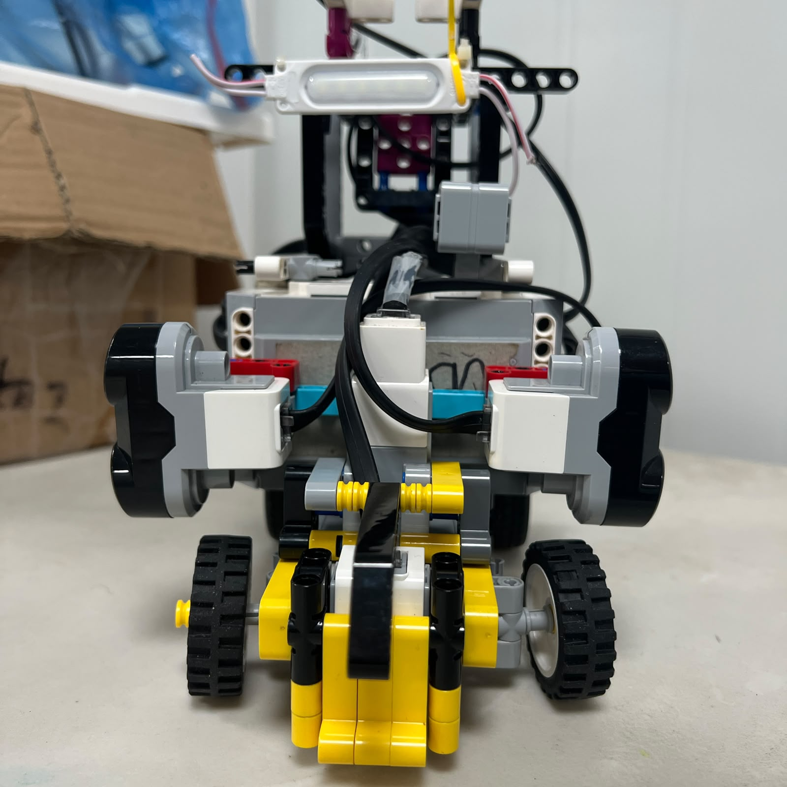
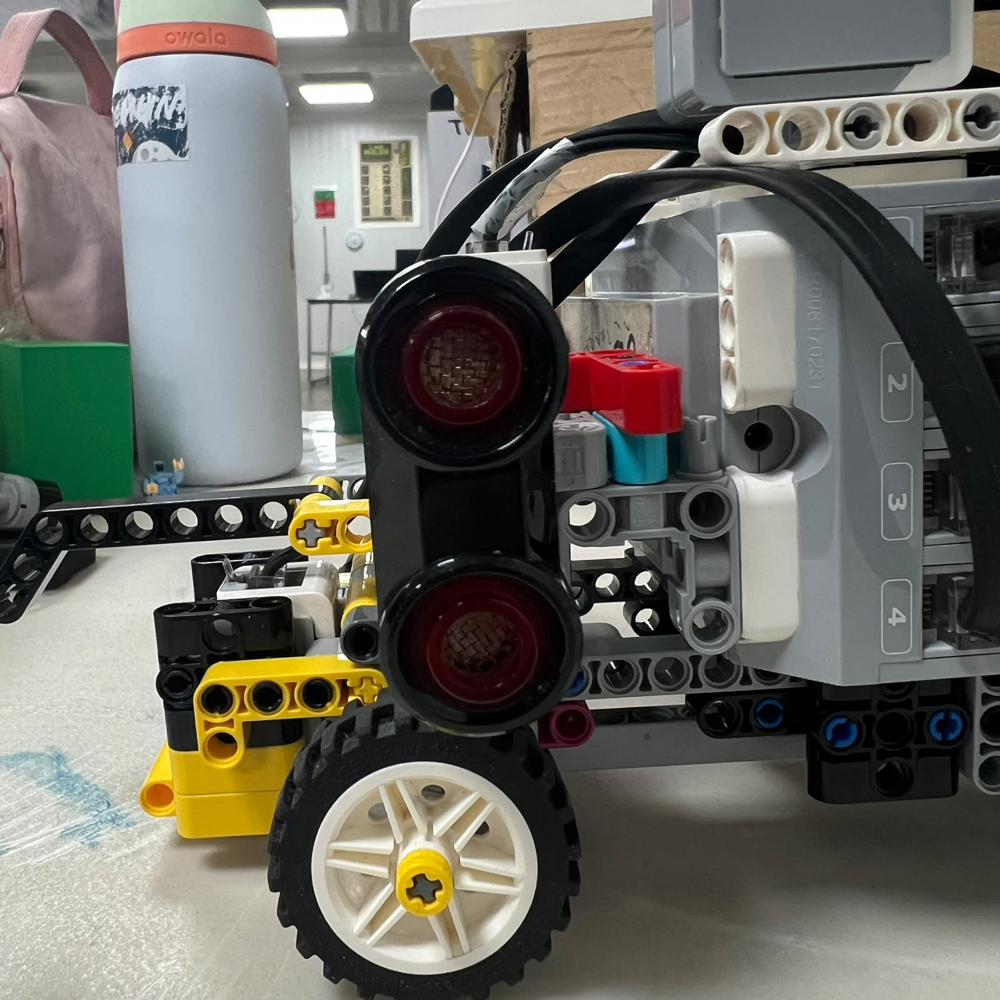

# 5. Ultrasonic Sensors and Lateral Track Geometry

<div align="center">


<br>

<sub><b>Figure 5.1.</b> Current pair of lateral LEGO EV3 Ultrasonic Sensors used by Piolín for track-relative geometry.</sub>

</div>

Piolín uses **two LEGO Mindstorms EV3 Ultrasonic Sensors** as its permanent distance-sensing system.

Their current assignments are fixed:

```text
S2 = LEFT Ultrasonic Sensor

S3 = RIGHT Ultrasonic Sensor
```

Both sensors are mounted laterally and remain installed during the **Open Challenge** and the **Obstacle Challenge**.

The current Piolín architecture does **not** use a permanent front ultrasonic sensor.

This is an important distinction from earlier prototypes. Previous configurations experimented with additional ultrasonic positions, including frontal and diagonal arrangements. The final architecture instead keeps two clearly defined side sensors and reserves S1 for the specialized sensor required by each competition round:

```text
OPEN
S1 = Gyro


OBSTACLES
S1 = Pixy2.1
```

The lateral ultrasonic pair therefore provides a permanent geometric reference while the role of S1 changes according to the challenge.

---

## 5.1 Current Sensor Assignment

The physical sensor mapping never changes between rounds.

| EV3 Port | Physical Sensor | Orientation | Main Role |
| :---: | :--- | :--- | :--- |
| S2 | Left Ultrasonic Sensor | Lateral | Measures geometry on Piolín's left side |
| S3 | Right Ultrasonic Sensor | Lateral | Measures geometry on Piolín's right side |

<div align="center">


<br>

<sub><b>Figure 5.2.</b> Physical ultrasonic convention used throughout the current Piolín documentation: S2 is LEFT and S3 is RIGHT.</sub>

</div>

This convention must remain consistent in:

```text
hardware

software

testing

calibration

documentation
```

Older code or documentation that assigns S2 and S3 differently belongs to previous development stages and must not be used as the current wiring reference.

---

# 5.2 Why the Sensors Are Mounted Laterally

The ultrasonic sensors are positioned to observe the walls beside Piolín rather than looking forward.

Conceptually:

```text
                 FRONT
                   ↑
                   │

LEFT US  ←   [ PIOLÍN ]   →  RIGHT US
   S2                         S3
```

This orientation gives the EV3 information about the robot's position relative to the surrounding track geometry.

Instead of asking:

```text
How far is the next object in front of me?
```

the lateral sensors primarily help answer:

```text
How is Piolín positioned between the walls?
```

That information is particularly useful because Piolín uses Ackermann-style steering. The robot follows curved vehicle trajectories and cannot simply rotate in place to correct its heading.

A stable understanding of the surrounding wall geometry therefore helps the controller make gradual steering corrections.

---

## 5.3 Lateral Alignment

<div align="center">



<br>

<sub><b>Figure 5.3.</b> Current lateral orientation of the ultrasonic sensors relative to Piolín's chassis.</sub>

</div>

Sensor orientation is a mechanical calibration variable.

An ultrasonic measurement represents distance along the direction in which the sensor is observing. If the sensor rotates relative to the chassis, the physical meaning of its reading also changes.

A sensor aimed approximately toward the side wall provides a relatively direct wall-separation reference.

A sensor aimed diagonally would instead measure a geometry-dependent line-of-sight distance.

This was one reason the current design moved toward a clearer lateral arrangement.

The objective is not simply to obtain a distance value.

The objective is to obtain a distance whose **physical meaning is predictable**.

---

# 5.4 Permanent Physical Identity vs. Logical Role

Piolín separates two different concepts:

```text
PHYSICAL SENSOR IDENTITY
```

and:

```text
NAVIGATION ROLE
```

The physical identities are permanent:

```text
S2 = LEFT

S3 = RIGHT
```

The logical roles can change:

```text
INNER

OUTER
```

depending on the direction of travel.

This distinction makes the same physical robot usable in both clockwise and counterclockwise navigation without changing the wiring.

---

## 5.5 Inner and Outer Wall Assignment

The first valid floor-color event establishes Piolín's direction.

The current convention is:

```text
BLUE FIRST
→ COUNTERCLOCKWISE


ORANGE FIRST
→ CLOCKWISE
```

Once the direction is known, the EV3 can interpret the two physical ultrasonic sensors as inner and outer references.

<div align="center">


<br>

<sub><b>Figure 5.4.</b> Dynamic conversion from permanent LEFT/RIGHT sensor identities to logical INNER/OUTER wall roles.</sub>

</div>

### Counterclockwise

```text
S2 LEFT
→ INNER


S3 RIGHT
→ OUTER
```

### Clockwise

```text
S2 LEFT
→ OUTER


S3 RIGHT
→ INNER
```

This conversion belongs in software rather than in physical wiring.

---

# 5.6 Why Inner and Outer Are Useful Software Variables

Suppose the wall-following logic were written directly around:

```text
LEFT
```

and:

```text
RIGHT
```

The controller would need different navigation equations depending on course direction.

Using:

```text
D_INNER

D_OUTER
```

allows the navigation logic to describe track geometry instead.

Conceptually:

```text
PHYSICAL INPUTS

S2
S3

    ↓ direction mapping

LOGICAL INPUTS

D_INNER
D_OUTER
```

The wall controller can then reason about:

```text
distance from inner wall

distance from outer wall

corridor geometry

corner opening
```

without continually rewriting the physical meaning of left and right.

This is an example of separating hardware representation from navigation representation.

---

# 5.7 Ultrasonic Measurements Are Geometric Information

Piolín does not treat the ultrasonic sensors simply as:

```text
collision sensors
```

Their more important role is to provide **geometric information**.

During a straight section, the measurements can help describe:

```text
lateral position

distance from inner wall

distance from outer wall

changes in track width

approach to a geometric transition
```

The EV3 uses these measurements as part of its steering decision.

Conceptually:

```text
LEFT DISTANCE
       +
RIGHT DISTANCE
       +
CURRENT STATE
       ↓
TRACK GEOMETRY
       ↓
STEERING DECISION
```

This makes the ultrasonic system part of the navigation architecture rather than only an emergency safety system.

---

# 5.8 Straight-Section Navigation

During a normal straight section, the surrounding walls provide a relatively stable geometric reference.

The inner wall is particularly useful for maintaining the intended lateral position.

Conceptually:

```text
desired inner distance
        -
measured inner distance
        ↓
lateral error
        ↓
steering correction
```

However, the current Open strategy does not depend only on one ultrasonic value.

The second sensor provides additional context.

A simplified representation is:

```text
D_INNER
→ primary lateral reference


D_OUTER
→ additional geometry / safety context
```

This allows the controller to interpret the corridor rather than blindly following one isolated measurement.

---

# 5.9 Wall Control Is Not Heading Control

A major engineering distinction is:

```text
LATERAL POSITION
≠
VEHICLE ORIENTATION
```

Piolín could temporarily have an acceptable distance to a wall while still being slightly rotated.

For example:

```text
        WALL
────────────────────

   / PIOLÍN
  /
```

A side distance measurement alone cannot fully describe that angular condition.

This is why the current Open architecture combines:

```text
Ultrasonics
→ lateral geometry


Gyro
→ angular orientation
```

The two systems provide complementary information.

The gyro does not replace the ultrasonic sensors, and the ultrasonic sensors do not replace the gyro.

---

# 5.10 Open Challenge Sensor Fusion

During Open, the permanent ultrasonic pair operates together with the Gyro Sensor on S1.

```text
S2 LEFT US ──┐
             │
S3 RIGHT US ─┼──→ EV3 → steering decision
             │
S1 GYRO ─────┘
```

The ultrasonic system primarily helps the EV3 understand:

```text
WHERE Piolín is relative to the walls
```

while the gyro helps it understand:

```text
HOW Piolín is oriented
```

and the Color Sensor contributes:

```text
WHICH course event has been reached
```

This separation of responsibilities is one of the major changes from earlier navigation approaches.

---

# 5.11 Corners Are Changes in Geometry

One important characteristic of a lateral ultrasonic system is that a corner can appear as a dramatic change in measured distance.

During a straight:

```text
wall present
→ finite distance
```

As the robot reaches an opening:

```text
wall geometry ends
→ measured distance can increase significantly
```

That increase should not always be interpreted as:

```text
Piolín suddenly moved far away from the wall
```

It may instead mean:

```text
the wall itself ended
```

This is fundamental to corner detection.

The controller therefore needs to distinguish:

```text
position error
```

from:

```text
track geometry transition
```

---

# 5.12 Why a Large Distance Can Be Useful

A very large ultrasonic reading is not automatically useless.

Depending on the state of the robot, it may indicate:

```text
open space

corner entry

loss of current wall

transition to another section
```

For example:

```text
normal inner wall
        ↓
distance suddenly opens
        ↓
possible corner geometry
```

This is different from treating every large value as a sensor failure.

The software interpretation must depend on the current navigation state.

---

# 5.13 Geometry During a Turn

Once Piolín begins an Ackermann turn, the complete chassis rotates.

Because the ultrasonic sensors are rigidly mounted to the chassis:

```text
vehicle rotates
        ↓
sensor orientation rotates
        ↓
measurement geometry changes
```

Therefore a reading during a corner cannot always be interpreted using the same assumptions as a reading during a straight.

The navigation system must expect changing geometry while the vehicle rotates.

As Piolín completes the turn and enters the next straight:

```text
wall geometry becomes stable again
```

and normal lateral control can be reacquired.

---

# 5.14 Reacquiring Wall Geometry

A robust corner does not end simply because Motor B has returned toward center.

Piolín also needs useful environmental geometry again.

A conceptual sequence is:

```text
STRAIGHT
   ↓
corner opening detected
   ↓
TURN
   ↓
vehicle rotates
   ↓
new walls enter sensor geometry
   ↓
lateral distances become usable
   ↓
REACQUIRE
   ↓
STRAIGHT
```

The current Open architecture can combine this geometric reacquisition with gyro turn information.

This is more reliable than assuming that one fixed turn duration always places Piolín correctly in the next corridor.

---

# 5.15 Ultrasonics During the Obstacle Challenge

The same two sensors remain installed during Obstacles.

However, their control role changes.

Pixy2.1 provides the visual information required to determine obstacle identity:

```text
RED
→ pass RIGHT


GREEN
→ pass LEFT
```

The ultrasonic sensors cannot identify pillar color.

Instead, they provide **physical context and safety information**.

Conceptually:

```text
Pixy2.1
→ what target is present
→ which passing side is required


Ultrasonics
→ surrounding geometry
→ available lateral space
→ recovery context
```

The obstacle strategy is still under active tuning, so no single sensor-priority formula is presented here as a final competition implementation.

---

# 5.16 Why Ultrasonics Should Not Override Every Obstacle Maneuver

One important lesson from obstacle development was that independent controllers can fight each other.

For example:

```text
Pixy objective
→ steer left around GREEN


wall controller
→ steer right toward previous wall target
```

If both have equal authority at every instant:

```text
LEFT
RIGHT
LEFT
RIGHT
```

can produce unstable zig-zag behavior.

A stronger architecture assigns different control priorities according to state.

Conceptually:

```text
NORMAL
→ wall geometry important


PILLAR AVOIDANCE
→ vision defines passing objective
→ US mainly constrains unsafe geometry


RECOVERY
→ lateral US becomes more important again
```

The sensors remain useful throughout the maneuver, but their **control authority does not need to remain identical in every state**.

---

# 5.17 Pillar Pass Confirmation

One useful behavior discovered during obstacle testing was that a lateral ultrasonic sensor can sometimes provide physical evidence that a pillar has moved alongside and then behind the vehicle.

A qualitative sequence can appear as:

```text
normal surrounding distance
        ↓
pillar enters lateral sensing region
        ↓
measured distance decreases
        ↓
pillar passes
        ↓
distance increases again
```

This creates an important distinction:

```text
CAMERA LOST TARGET
```

is not necessarily equal to:

```text
PILLAR PHYSICALLY PASSED
```

The camera can lose the target because the vehicle rotates.

Lateral geometry can therefore provide additional context for obstacle-state transitions.

The exact pass-confirmation thresholds are not presented as final because they still depend on real track geometry and current tuning.

---

# 5.18 Recentering After an Obstacle

After avoiding a pillar, Piolín may no longer be in a useful lateral position.

The ultrasonic sensors are therefore particularly valuable during the recovery phase.

Conceptually:

```text
PILLAR
  ↓
AVOID
  ↓
PASS
  ↓
RECENTER
  ↓
NORMAL
```

During `RECENTER`, the lateral sensor pair can help answer:

```text
Am I too close to one side?

Has safe corridor geometry returned?

Can normal navigation resume?
```

This keeps obstacle avoidance from becoming only a one-direction steering maneuver.

The vehicle must also recover afterward.

---

# 5.19 Sensor Mounting Stability

<div align="center">



<br>

<sub><b>Figure 5.5.</b> Close view of the ultrasonic mounting structure. Mechanical mounting is part of the distance-sensor calibration.</sub>

</div>

The sensor mount is part of the sensing system.

If a sensor rotates by a small amount:

```text
same wall
+
different sensor angle
=
different measured geometry
```

Therefore ultrasonic calibration depends on maintaining:

```text
sensor orientation

sensor position

sensor height

chassis rigidity
```

between tests.

A loose mount can produce what appears to be a software regression even when the code has not changed.

---

# 5.20 Ultrasonic Sensors Do Not Measure a Perfect Point

An ultrasonic sensor emits sound toward an area of the environment and interprets returning echoes.

The resulting measurement should therefore not be imagined as a perfectly narrow laser line.

The observed distance can be affected by:

```text
target angle

target shape

nearby surfaces

corner geometry

sensor orientation
```

This is particularly relevant around:

```text
wall edges

corners

pillars
```

where the reflecting surface changes rapidly.

For this reason, Piolín's control logic should interpret distance values together with context rather than assuming that every individual sample perfectly represents one point in space.

---

# 5.21 Filtering and Stability

Distance measurements can vary between control cycles.

A navigation controller should therefore avoid responding excessively to one isolated unusual sample.

Possible software techniques include:

```text
range validation

short persistence checks

limited smoothing

state-dependent interpretation
```

However, excessive filtering can also be harmful.

```text
too little filtering
→ noisy steering


too much filtering
→ delayed reaction
```

The objective is not to make the sensor value mathematically smooth at all costs.

The objective is to preserve enough stability for control without removing the geometric changes that Piolín actually needs to detect.

---

# 5.22 Why Sensor Filtering Must Preserve Corners

A corner naturally creates a rapid change in measured distance.

If a filter assumes:

```text
large change
=
invalid measurement
```

then it may accidentally remove the exact event needed to recognize the corner.

Therefore a good filter needs to distinguish between:

```text
implausible isolated measurement
```

and:

```text
real persistent geometry change
```

This is another reason ultrasonic processing should be connected to the robot's navigation state.

A measurement that is surprising during a straight may be completely expected during a corner.

---

# 5.23 Why the Front Ultrasonic Was Removed

Earlier Piolín prototypes explored a third, forward-facing ultrasonic sensor.

A frontal sensor can be useful for direct obstacle distance.

However, EV3 sensor-port availability became a systems-level constraint.

Piolín permanently requires:

```text
S2 = LEFT US

S3 = RIGHT US

S4 = Color
```

while S1 provides higher-value round-specific information:

```text
OPEN
→ Gyro


OBSTACLES
→ Pixy2.1
```

The engineering trade-off became:

```text
dedicated frontal distance
```

versus:

```text
direct orientation in Open
or
visual identity in Obstacles
```

The current architecture gives S1 to the round-specific sensor.

As a result, the final ultrasonic system contains exactly:

```text
2 lateral ultrasonic sensors
```

and no permanent front ultrasonic.

---

# 5.24 Why Two Sensors Were Retained

Using only one lateral ultrasonic would simplify the hardware further, but it would remove information about the opposite side of the track.

With two sensors, the EV3 has access to:

```text
LEFT geometry
+
RIGHT geometry
```

This allows more context when interpreting:

```text
straight sections

wall proximity

corner transitions

post-turn reacquisition

obstacle recovery
```

The second sensor therefore provides information that is distinct enough to justify its permanent EV3 port.

---

# 5.25 Why Three Sensors Were Not Retained

The earlier three-ultrasonic concept provided an additional measurement direction.

However, the goal of the final architecture is not:

```text
maximum number of sensors
```

It is:

```text
maximum useful information
for available integration complexity
```

The two side sensors already provide the geometry required by the current navigation architecture.

S1 can then provide information that ultrasonic sensing cannot reproduce effectively:

```text
angular rotation
```

during Open, or:

```text
visual obstacle identity
```

during Obstacles.

This produces a more specialized sensor architecture.

---

# 5.26 Current vs. Legacy Ultrasonic Architectures

| Configuration | Status | Main Characteristic |
| :--- | :--- | :--- |
| Diagonal side sensors | Legacy / experimental | Distance strongly dependent on viewing geometry |
| Two side sensors + front US | Legacy / experimental | Added frontal distance but consumed another sensor port |
| Three-ultrasonic concepts | Legacy | More distance directions, greater port usage |
| **Two lateral sensors** | **Current** | **Clear LEFT/RIGHT geometry with S1 available for round-specific sensing** |

The current documentation should therefore always use:

```text
S2 = LEFT

S3 = RIGHT
```

Older diagrams or source code using another mapping belong only in development-history documentation.

---

# 5.27 Calibration Strategy

Ultrasonic calibration should be performed on the fully assembled V4 robot.

A useful process is:

```text
1. Verify both mounts are rigid.

2. Verify S2 physically corresponds to LEFT.

3. Verify S3 physically corresponds to RIGHT.

4. Place Piolín in known track positions.

5. Record raw left and right readings.

6. Repeat measurements.

7. Test with the vehicle centered.

8. Test closer to the inner wall.

9. Test closer to the outer wall.

10. Test corner transitions.

11. Test readings while the vehicle is moving.

12. Tune control values only after geometry is understood.
```

This order prevents navigation parameters from compensating for incorrect hardware orientation.

---

# 5.28 Static and Dynamic Calibration

A sensor can behave correctly while the robot is stationary but differently during motion.

Static calibration helps determine:

```text
baseline distances

sensor orientation

repeatability
```

Dynamic testing adds:

```text
vehicle rotation

changing wall geometry

corners

vibration

control timing
```

Both are useful.

A good static result does not automatically prove that a controller will behave correctly on a complete lap.

---

# 5.29 Values Intentionally Not Claimed as Final

The following values should only be published after they are measured on the current V4 robot:

```text
exact sensor height

exact sensor longitudinal offset

exact sensor lateral offset

effective sensor angle

straight-section reference distances

corner-transition thresholds

minimum safe wall distance

obstacle pass-confirmation thresholds

measured noise distribution

dynamic filtering constants
```

Older measurements from previous physical configurations should not automatically be reused.

The current Open program may contain working control values, but those values should be treated as **software calibration parameters**, not immutable hardware specifications.

---

# 5.30 Ultrasonic Verification Before a Run

A simple pre-run verification can confirm the most important hardware assumptions.

### S2

Move an object closer to Piolín's left side.

Expected result:

```text
S2 distance decreases
```

### S3

Move an object closer to Piolín's right side.

Expected result:

```text
S3 distance decreases
```

Then verify:

```text
LEFT object
does not appear as RIGHT sensor


RIGHT object
does not appear as LEFT sensor
```

This test is simple but prevents one of the most damaging software errors: tuning navigation around an inverted sensor mapping.

---

# 5.31 Current Ultrasonic Responsibility Matrix

| Function | Open Challenge | Obstacle Challenge |
| :--- | :---: | :---: |
| Left-side geometry | Yes | Yes |
| Right-side geometry | Yes | Yes |
| Inner/outer wall mapping | Yes | Yes |
| Straight lateral reference | Yes | Yes |
| Corner geometry information | Yes | Yes |
| Heading measurement | No | No |
| Pillar color recognition | No | No |
| Obstacle physical context | Secondary | Yes |
| Post-obstacle recentering | Not primary | Yes |
| Course color detection | No | No |

The table highlights why the ultrasonic sensors remain permanent while S1 changes.

They provide a geometric measurement that is useful in both competition rounds.

---

# 5.32 Final Ultrasonic Architecture

The current system can be summarized as:

```text
                         FRONT
                           ↑
                           │
                     [ PIOLÍN ]
                    /         \
                   /           \
                  ▼             ▼
            S2 LEFT US     S3 RIGHT US
                  │             │
                  └──────┬──────┘
                         │
                         ▼
                     LEGO EV3
                         │
                         ▼
               GEOMETRY INTERPRETATION
                         │
                  ┌──────┴──────┐
                  │             │
                  ▼             ▼
                OPEN        OBSTACLES
                  │             │
          wall + gyro       wall + vision
                  │             │
                  └──────┬──────┘
                         ▼
                    MOTOR B
                    steering
```

The physical sensor identities remain constant.

The meaning assigned to those measurements changes according to:

```text
course direction

navigation state

competition round

surrounding geometry
```

This allows two relatively simple sensors to provide several forms of useful physical context without changing the hardware between rounds.

---

# 5.33 Final Engineering Assessment

Piolín's ultrasonic architecture evolved from experimenting with several sensor positions toward a simpler two-sensor system whose measurements have clearer physical meaning.

The final arrangement is:

```text
S2
→ LEFT lateral geometry


S3
→ RIGHT lateral geometry
```

The advantages of this architecture are not based on having the maximum possible sensing coverage.

They come from having **two permanent, understandable geometric references** that can be interpreted differently according to navigation state.

During Open, they complement the Gyro Sensor.

During Obstacles, they complement Pixy2.1.

During straight driving, they describe wall geometry.

During cornering, changes in their readings help describe track transitions.

During obstacle recovery, they can help Piolín return to a safer corridor position.

The central design principle is therefore:

> **Piolín uses ultrasonic sensing as a geometric reference system rather than as a collection of simple collision detectors. Keeping S2 permanently LEFT and S3 permanently RIGHT gives the software a stable physical foundation from which inner/outer wall roles and navigation states can be derived.**

---

<div align="center">

### [← Back to PiolínTech Main README](../../README.md)

</div>
