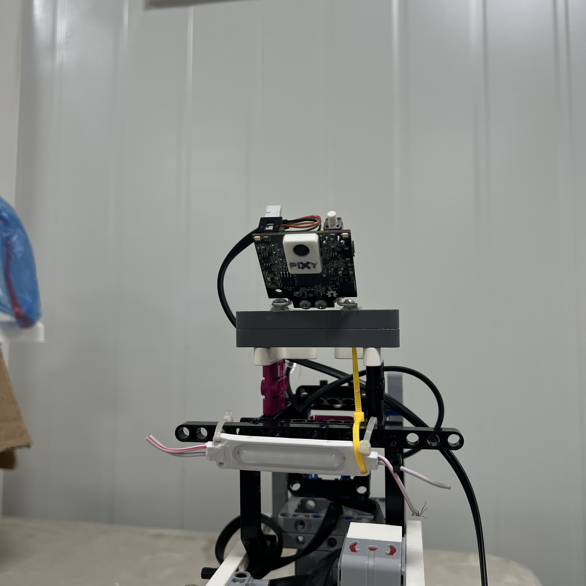
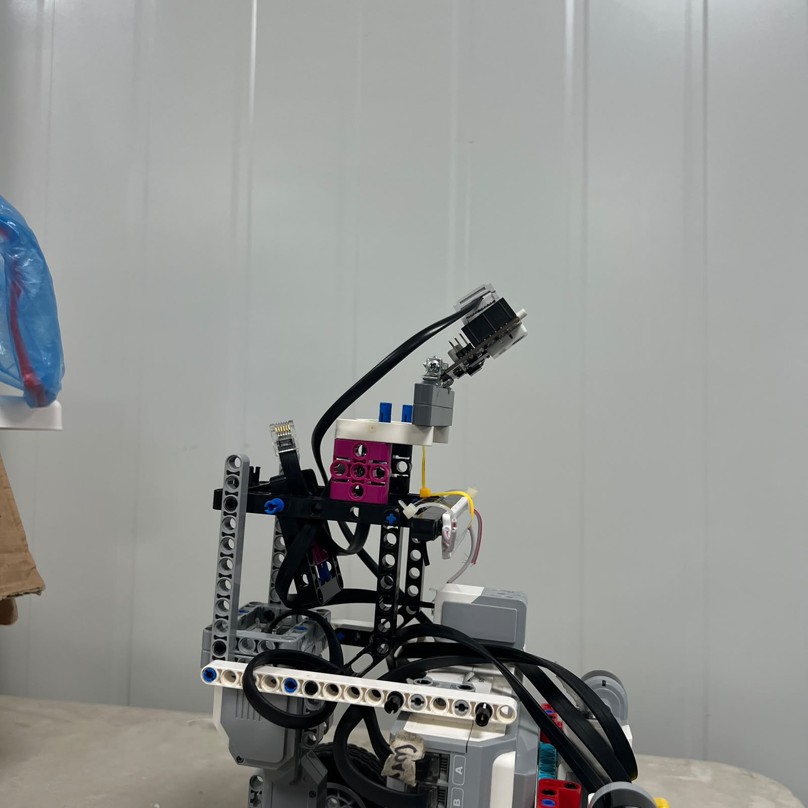
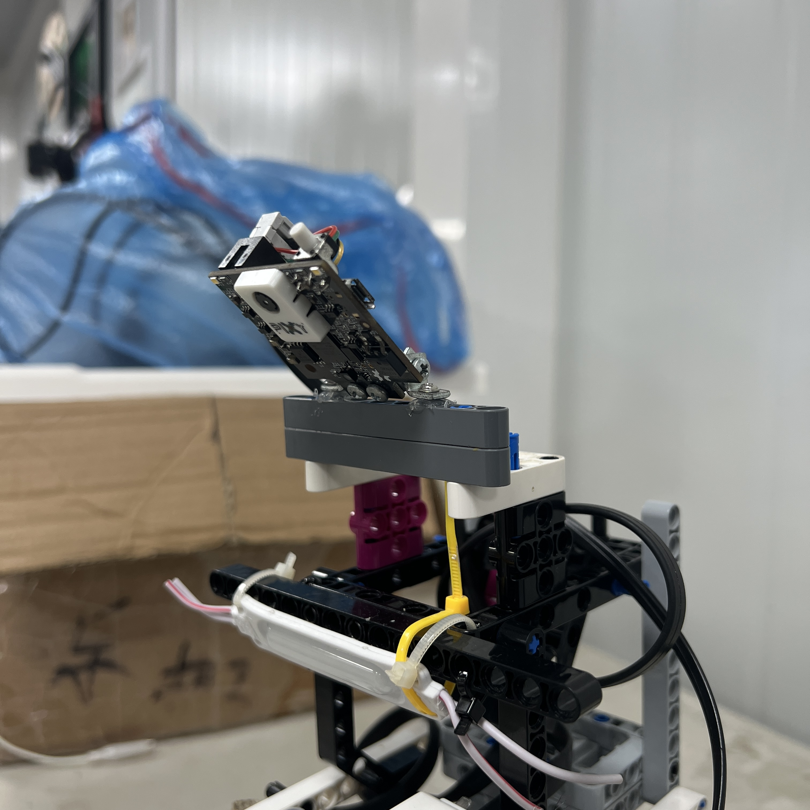
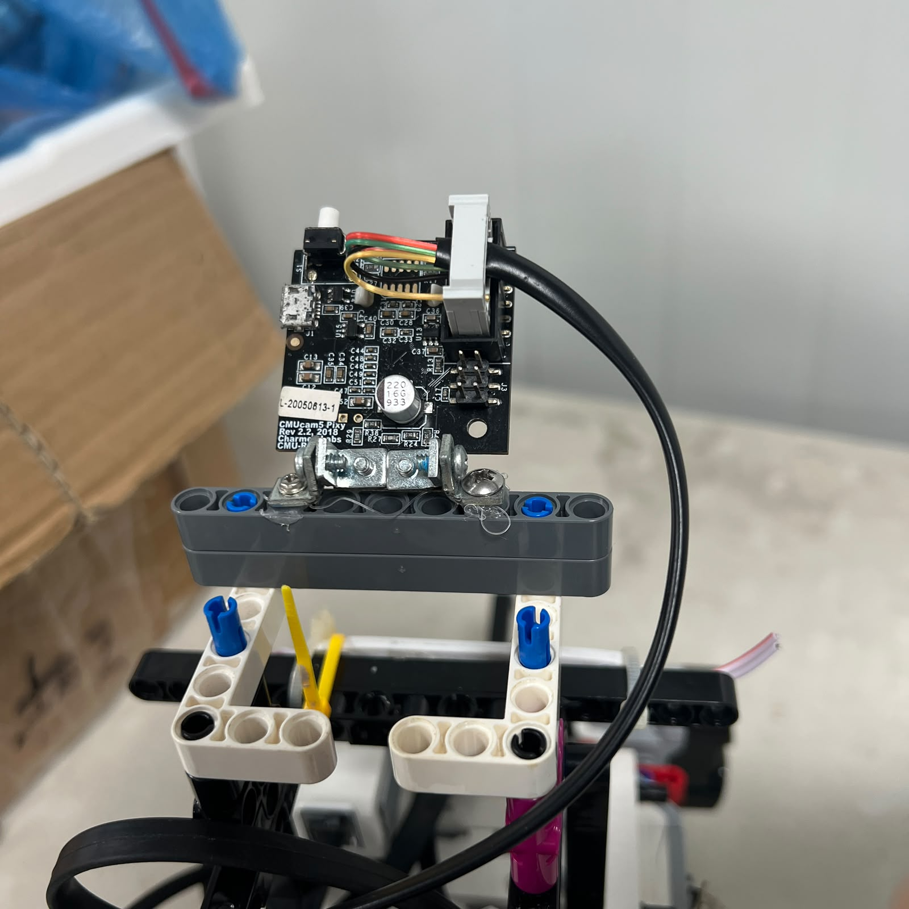
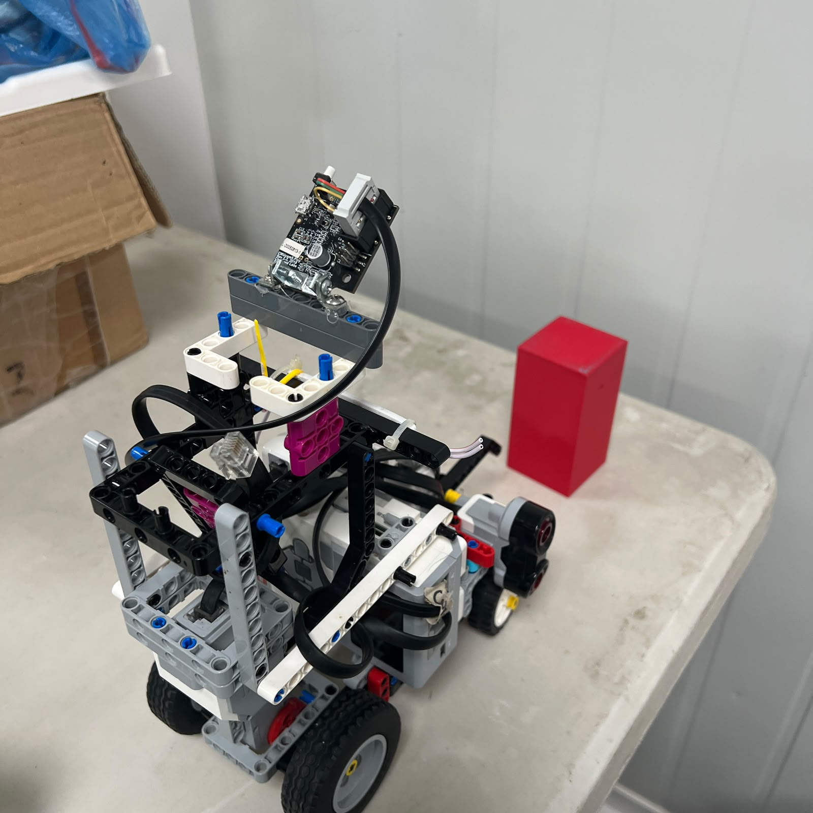
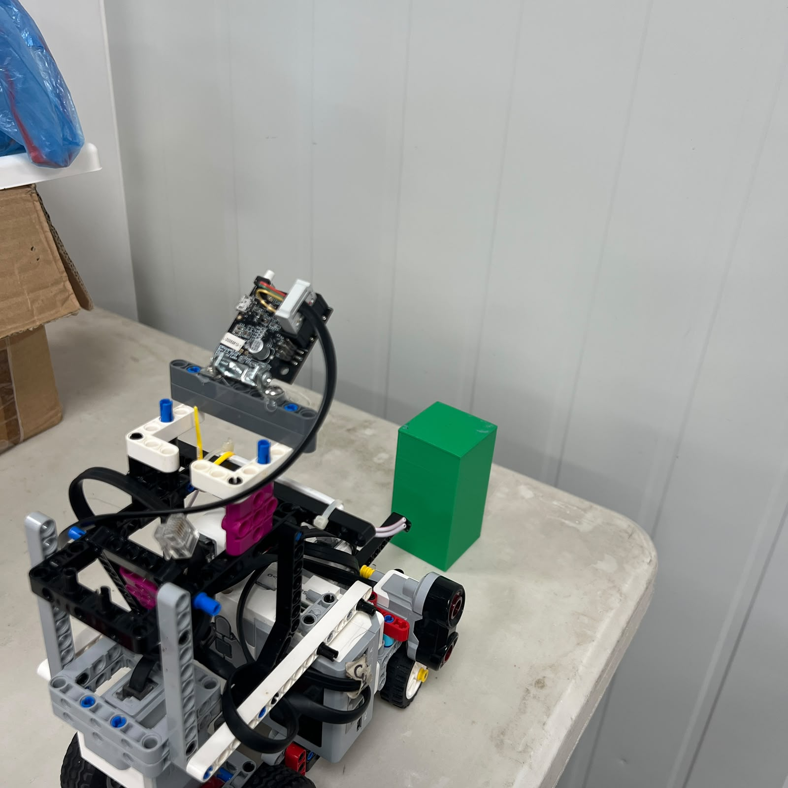
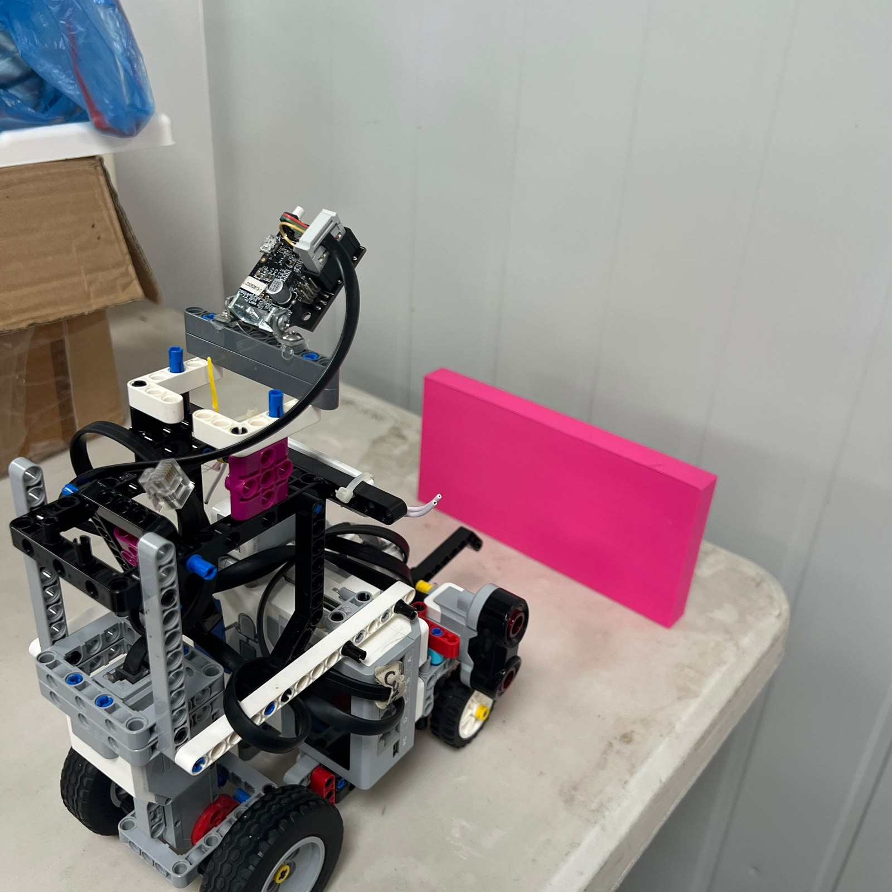
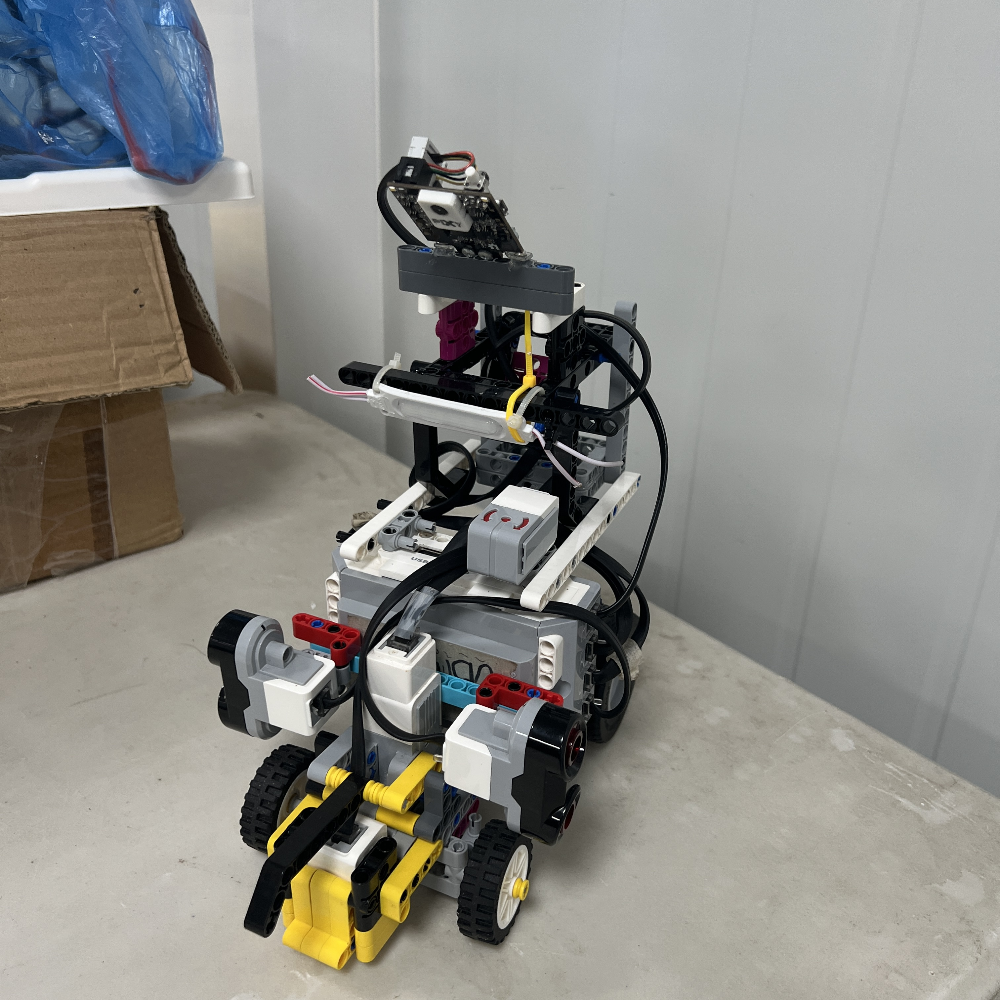

# 7. Pixy2.1 Vision System

<div align="center">



<br>

<sub><b>Figure 7.1.</b> Pixy2.1 installed at the front of Piolín for the Obstacle Challenge.</sub>

</div>

The **Pixy2.1** is Piolín's current visual-perception sensor for the WRO Future Engineers 2026 **Obstacle Challenge**. It is also the only major active sensing component in the current competition architecture that does not belong to the LEGO Mindstorms EV3 ecosystem.

Pixy2.1 is used because the Obstacle Challenge requires information that Piolín's ultrasonic sensors, Color Sensor, and Gyro Sensor cannot provide by themselves. The robot must distinguish between different colored traffic pillars and react differently depending on the pillar color. A red pillar and a green pillar can occupy similar physical positions in the track, but the required passing side is different.

The current obstacle rule implemented in Piolín is:

```text
RED
→ pass on the RIGHT


GREEN
→ pass on the LEFT
```

The Pixy2.1 therefore solves a **classification and localization problem**, while the two lateral ultrasonic sensors continue solving a **track-geometry problem**.

The current Obstacle Challenge architecture is:

```text
S1 = Pixy2.1

S2 = Left Ultrasonic Sensor

S3 = Right Ultrasonic Sensor

S4 = Color Sensor
```

The Gyro Sensor is not installed during this round.

This round-specific architecture allows S1 to carry the sensing modality that is most valuable for the active challenge.

---

## 7.1 Pixy2.1 Role in the Final Architecture

Pixy2.1 does not directly control Piolín's steering motor.

Its role is to provide visual information to the EV3.

The EV3 remains responsible for interpreting that information and combining it with the rest of the robot state before commanding Motor A or Motor B.

The complete decision chain is:

```text
COLORED PILLAR
      ↓
PIX Y2.1
      ↓
VISUAL BLOCK DATA
      ↓
EV3
      ↓
OBSTACLE INTERPRETATION
      ↓
NAVIGATION DECISION
      ↓
MOTOR A + MOTOR B
```

<div align="center">


<br>

<sub><b>Figure 7.2.</b> Pixy2.1 acts as a perception sensor while the EV3 remains responsible for the final navigation and motor decisions.</sub>

</div>

This separation is important because a camera detection alone does not determine a complete safe trajectory.

The EV3 must also consider:

```text
left wall distance

right wall distance

current steering state

current course state

previous obstacle detections

vehicle speed
```

before choosing how strongly and for how long Piolín should steer.

---

## 7.2 Why Vision Is Required

Ultrasonic sensors can measure distance to nearby surfaces, but they cannot identify the color of a traffic pillar.

Suppose two pillars are located at approximately the same position.

```text
PILLAR A
distance ≈ same


PILLAR B
distance ≈ same
```

One may be red and the other green.

The ultrasonic sensors cannot determine:

```text
which side must be used
```

because the passing rule depends on **visual identity**, not only distance.

The same limitation applies to the Gyro Sensor. A gyro can measure rotation but cannot identify an obstacle.

The Color Sensor also cannot solve the problem because it is mounted downward and observes the floor directly beneath the robot.

Pixy2.1 therefore provides a sensing modality that none of Piolín's LEGO sensors can replace directly.

---

## 7.3 Why Pixy2.1 Is Used Only During Obstacles

During the Open Challenge, Piolín does not need to distinguish traffic pillars.

Instead, the main sensing requirements are:

```text
wall geometry

vehicle orientation

floor landmarks
```

Those are provided by:

```text
S1 Gyro

S2 Left Ultrasonic

S3 Right Ultrasonic

S4 Color
```

Therefore Pixy2.1 is removed from S1 during Open.

During Obstacles, the sensing problem changes.

```text
pillar identity becomes essential
```

while gyro heading becomes less valuable than visual perception.

The architecture therefore changes to:

```text
OPEN

S1 = Gyro


OBSTACLE

S1 = Pixy2.1
```

<div align="center">


<br>

<sub><b>Figure 7.3.</b> S1 is reassigned according to the sensing requirement of each competition round.</sub>

</div>

This avoids permanently carrying a sensor that provides little value during a specific challenge.

---

## 7.4 Physical Installation

Pixy2.1 is mounted facing forward so that traffic pillars enter the camera image before Piolín reaches them.

<div align="center">



<br>

<sub><b>Figure 7.4.</b> Side view of the Pixy2.1 installation showing its position relative to the chassis.</sub>

</div>

The physical camera mount affects the complete perception system.

Important variables include:

```text
camera height

camera pitch

horizontal alignment

lateral offset

distance from front of robot

structural rigidity
```

If any of these change, the same physical pillar may appear at a different location in the camera image.

For that reason, Pixy calibration belongs to the **installed camera system**, not only to the camera electronics.

---

## 7.5 Camera Alignment

The intended camera orientation is approximately centered with the vehicle's forward direction.

<div align="center">



<br>

<sub><b>Figure 7.5.</b> Top view used to evaluate Pixy2.1 alignment relative to Piolín's longitudinal centerline.</sub>

</div>

If the camera is shifted or rotated:

```text
image center
```

does not necessarily correspond to:

```text
vehicle centerline
```

A software controller can compensate for a measured offset, but the preferred first step is to install the camera as consistently as possible.

A repeatable mechanical mount makes subsequent vision calibration easier.

---

## 7.6 Direct EV3 Integration

The current Pixy architecture connects the camera directly to the EV3 through **S1** during the Obstacle Challenge.

The communication path is:

```text
Pixy2.1
   ↓
S1
   ↓
EV3
```

<div align="center">



<br>

<sub><b>Figure 7.6.</b> Pixy2.1 connected directly to the EV3 through the round-specific S1 interface.</sub>

</div>

The current software path communicates with Pixy through the EV3 using an **I2C/SMBus-based interface**.

This direct connection removes the intermediate Arduino Nano used in the previous HuskyLens architecture.

The simpler communication chain reduces the number of devices whose configuration must match before visual information reaches the main controller.

---

## 7.7 Current vs. Previous Vision Architecture

Earlier development used:

```text
HuskyLens
    ↓
Arduino Nano
    ↓
USB
    ↓
EV3
```

The current architecture is:

```text
Pixy2.1
   ↓
S1
   ↓
EV3
```

<div align="center">


<br>

<sub><b>Figure 7.7.</b> Current Pixy2.1 integration removes the intermediate Nano/USB communication stage used by the previous vision system.</sub>

</div>

The previous system was valuable because it demonstrated that Piolín could integrate external vision with the EV3.

However, it created additional failure and debugging points.

A problem could originate from:

```text
camera recognition

camera configuration

camera-to-Nano communication

Nano code

USB communication

EV3 parsing

navigation logic
```

The direct Pixy architecture shortens that chain.

---

## 7.8 Why Pixy2.1 Replaced HuskyLens

The change to Pixy2.1 was not made because the HuskyLens was incapable of detecting colors.

The decision was based on how well each system fit Piolín's final obstacle strategy.

The main requirements are:

```text
recognize red

recognize green

recognize parking target

identify horizontal position

react quickly during driving

simplify integration with EV3
```

Pixy2.1 provides color-signature detection together with block-position information that can be used directly in steering logic.

The current obstacle strategy benefits especially from:

```text
signature

x position

y position

width

height
```

because Piolín does not only need to know **what color the pillar is**. It also needs to understand approximately **where that pillar appears in the image**.

---

## 7.9 Vision-System Comparison

| Architecture | Main Strength | Main Limitation | Current Role |
| :--- | :--- | :--- | :--- |
| HuskyLens + Nano | Dedicated visual recognition and external interface | More communication layers | Legacy |
| Earlier Pixy experiments | Direct color-based perception | Required additional integration development | Development stage |
| Camera-free obstacle logic | Low hardware complexity | Cannot identify red vs. green | Not sufficient |
| **Pixy2.1 direct to EV3** | **Color signatures + block position + simpler data path** | **Requires visual calibration and reliable target selection** | **Current obstacle architecture** |

The selected architecture therefore prioritizes:

```text
direct visual information

reduced communication complexity

position-aware obstacle logic
```

rather than simply selecting the camera with the greatest number of possible features.

---

## 7.10 Color Connected Components

Piolín uses Pixy2.1 for **color-signature-based object detection**, corresponding to the camera's Color Connected Components style of operation.

The camera identifies regions in the image that match learned/configured color signatures and represents those regions as blocks.

Conceptually:

```text
CAMERA IMAGE
      ↓
COLOR SIGNATURE MATCHING
      ↓
CONNECTED COLOR REGION
      ↓
BLOCK
```

<div align="center">


<br>

<sub><b>Figure 7.8.</b> Pixy2.1 converts a recognized colored image region into a block containing identity and position information.</sub>

</div>

This is well suited to WRO pillars because the relevant decision is strongly associated with target color.

---

## 7.11 Current Signature Mapping

The current configured signatures are:

| Pixy Signature | Target | Meaning |
| :---: | :--- | :--- |
| **1** | Pink | Parking target |
| **2** | Red | Pass on the right |
| **3** | Green | Pass on the left |

The mapping should remain consistent between:

```text
Pixy configuration

EV3 software

documentation

testing
```

If the physical signatures are retrained in a different order but the EV3 code is not updated, the camera may recognize the target correctly while the vehicle interprets it incorrectly.

This could create a failure such as:

```text
camera sees RED correctly
        ↓
reports unexpected signature
        ↓
EV3 interprets GREEN
        ↓
robot passes wrong side
```

For that reason, signature identity is part of the system configuration.

---

## 7.12 Red Pillar Detection

The current rule for a red pillar is:

```text
SIGNATURE 2
      ↓
RED
      ↓
PASS RIGHT
```

<div align="center">



<br>

<sub><b>Figure 7.9.</b> Pixy2.1 recognizing a red competition pillar using Signature 2.</sub>

</div>

The word **RIGHT** describes the required passing side relative to the pillar.

It does not mean:

```text
hold maximum right steering continuously
```

The final trajectory still contains several phases:

```text
detect

approach

avoid

pass

countersteer

recover
```

Pixy identifies the passing requirement, while the EV3 determines the actual steering sequence.

---

## 7.13 Green Pillar Detection

The current green mapping is:

```text
SIGNATURE 3
      ↓
GREEN
      ↓
PASS LEFT
```

<div align="center">



<br>

<sub><b>Figure 7.10.</b> Pixy2.1 recognizing a green competition pillar using Signature 3.</sub>

</div>

As with Red, the signature determines the maneuver class rather than one permanent Motor B command.

The EV3 must still consider the physical approach geometry before deciding how much steering is required.

---

## 7.14 Parking Signature

Pixy Signature 1 is reserved for the **pink parking target**.

```text
SIGNATURE 1
      ↓
PINK
      ↓
PARKING REFERENCE
```

<div align="center">



<br>

<sub><b>Figure 7.11.</b> Pixy2.1 recognizing the pink parking reference using Signature 1.</sub>

</div>

A parking detection should not necessarily begin a parking maneuver immediately.

The EV3 can also consider:

```text
lap/course progress

current state

encoder movement

ultrasonic geometry
```

before interpreting Signature 1 as the final parking condition.

This reduces the risk of responding to a visually similar target at the wrong point in the run.

---

## 7.15 Block Information

Pixy2.1 can provide several properties describing a detected block.

The useful information for Piolín includes:

```text
signature

x

y

width

height
```

These values describe the block in the camera image.

<div align="center">


<br>

<sub><b>Figure 7.12.</b> A detected block can be described through its signature, image position, width, and height.</sub>

</div>

The block area can also be represented conceptually as:

```text
AREA =
WIDTH × HEIGHT
```

This can provide a useful indication of apparent target size.

However:

```text
large block
```

does not automatically mean:

```text
exact physical distance
```

because apparent size is also influenced by object orientation, camera geometry, and partial visibility.

---

## 7.16 Horizontal Position — X

The horizontal coordinate `X` is especially useful for steering.

The image can be considered conceptually as:

```text
LEFT SIDE          CENTER          RIGHT SIDE
    │                 │                 │
    └─────────────────┼─────────────────┘
                      X
```

A block located far from the desired image region may require a different response from a block already close to the intended trajectory.

The EV3 can define:

```text
X_TARGET
```

and calculate:

```text
E_X =
X_TARGET - X_BLOCK
```

<div align="center">


<br>

<sub><b>Figure 7.13.</b> Horizontal block displacement can be converted into a visual error used as one input to the obstacle steering decision.</sub>

</div>

The final `X_TARGET` and steering relationship remain calibration parameters rather than universal constants.

---

## 7.17 Why X Is More Useful Than Color Alone

A purely color-based controller could behave like:

```text
RED
→ steer right


GREEN
→ steer left
```

This ignores where the pillar actually is.

Consider two green pillars:

```text
GREEN A
already far right in image


GREEN B
near vehicle path
```

Both require a left-side pass, but they may not require the same immediate steering magnitude.

Using image position allows the system to respond more proportionally to the observed situation.

The current strategy therefore aims to use:

```text
signature
→ maneuver direction


X position
→ maneuver magnitude / alignment
```

rather than treating each color as one fixed steering angle.

---

## 7.18 Y Position

The vertical image coordinate `Y` can also describe how the detected block appears in the frame.

As a target approaches or the camera perspective changes, its vertical position may change.

However, `Y` should not automatically be converted into exact physical forward distance without a calibrated camera model.

Piolín can use `Y` as a relative visual feature while avoiding unsupported claims such as:

```text
Y = 150
means
exactly 20 cm away
```

unless such a relationship has been experimentally calibrated.

This distinction keeps image coordinates separate from real-world metric distance.

---

## 7.19 Width and Height

Block width and height provide information about how large the target appears in the current camera frame.

Conceptually:

```text
small block
→ target may be visually farther / partially visible


larger block
→ target occupies more of the image
```

But several physical factors can change block size:

```text
distance

orientation

partial occlusion

camera angle

lighting

signature segmentation
```

Therefore width and height are useful as **relative perception features**, not perfect range measurements.

---

## 7.20 Apparent Area

A simple apparent-area variable can be defined as:

```text
A_BLOCK =
WIDTH × HEIGHT
```

This can help the EV3 distinguish a tiny distant detection from a large nearby visual target.

<div align="center">


<br>

<sub><b>Figure 7.14.</b> Block area provides a simple measure of apparent visual size but is not treated as an exact metric distance.</sub>

</div>

This can be useful during target selection when multiple blocks are simultaneously visible.

---

## 7.21 Multiple Visible Blocks

One of the most difficult vision problems occurs when Pixy sees more than one valid block.

For example:

```text
RED block

GREEN block
```

may both be present.

Selecting the first block returned by the camera can produce unstable behavior because the returned ordering is not necessarily equivalent to:

```text
most important obstacle
```

Piolín therefore needs a **target-selection strategy**.

The selected block should be the one most relevant to the immediate driving situation.

---

## 7.22 Why "First Block" Is Not Enough

A simple implementation could use:

```text
blocks[0]
```

and ignore the rest.

This is easy to program, but the first returned block may be:

```text
farther away

smaller

less centered

already passed

less relevant than another block
```

The vehicle could then steer according to the wrong obstacle even though the correct obstacle is visible in the same image.

This failure was especially relevant during development when the robot could become locked onto a previously seen block and fail to react correctly to the next one.

The final strategy should therefore rank or validate blocks rather than assuming ordering equals importance.

---

## 7.23 Target Relevance

A useful target-selection concept can combine several properties.

```text
VALID SIGNATURE
        +
APPARENT SIZE
        +
IMAGE POSITION
        +
CURRENT MANEUVER STATE
        ↓
TARGET RELEVANCE
```

<div align="center">


<br>

<sub><b>Figure 7.15.</b> Target selection should consider block identity, size, position, and current navigation state rather than relying only on returned order.</sub>

</div>

One conceptual score could be written as:

```text
SCORE =
W1 × SIZE_TERM
+
W2 × POSITION_TERM
+
W3 × STATE_TERM
```

This equation is illustrative.

The final obstacle software may implement a simpler or more specialized rule.

---

## 7.24 Temporary Target Lock

Once the EV3 has selected a relevant pillar, immediately switching to every new camera detection can create unstable steering.

A temporary target lock can help maintain consistency.

Conceptually:

```text
select target
      ↓
lock current obstacle
      ↓
perform avoidance
      ↓
confirm obstacle passed
      ↓
release lock
      ↓
search next target
```

<div align="center">


<br>

<sub><b>Figure 7.16.</b> A temporary target lock can prevent Piolín from switching obstacle identity during the middle of one avoidance maneuver.</sub>

</div>

The lock must also be releasable.

A permanent lock would cause the robot to ignore the next pillar.

---

## 7.25 Why a Lock Can Become a Problem

Too little target persistence creates:

```text
rapid target switching
```

but too much persistence creates:

```text
stale target tracking
```

The balance is:

```text
stable enough to finish one maneuver
```

but:

```text
short enough to detect the next obstacle
```

This is one of the main perception-state problems still being tuned in Piolín's Obstacle Challenge.

The vision system is therefore not considered complete simply because Pixy detects the correct colors.

Recognition and **target-state management** are separate problems.

---

## 7.26 Detection Confirmation

A single isolated visual detection should not necessarily trigger the strongest possible obstacle maneuver.

One possible strategy is to require:

```text
valid signature
+
sufficient visual relevance
+
short temporal confirmation
```

before fully committing to the obstacle state.

However, excessive confirmation creates reaction delay.

At competition speed:

```text
delay
→ additional physical travel
```

This creates the same engineering trade-off seen in several Piolín sensors:

```text
more confirmation
→ fewer false triggers
→ slower response


less confirmation
→ faster response
→ greater false-trigger risk
```

The final confirmation strategy must be validated while the robot is moving.

---

## 7.27 Field of View

Pixy2.1 can only react to targets that are inside its camera field of view.

<div align="center">


<br>

<sub><b>Figure 7.17.</b> Pixy2.1 perception depends on the target remaining inside the camera's usable field of view.</sub>

</div>

This means physical navigation and vision cannot be treated independently.

When Piolín steers:

```text
robot rotates
       ↓
camera rotates
       ↓
pillar image moves
       ↓
pillar may exit FOV
```

The camera can therefore lose a pillar even when the pillar has not yet been physically passed.

---

## 7.28 Camera Loss Does Not Mean Pillar Passed

This is a critical distinction.

```text
NO PIXY DETECTION
```

can mean several things:

```text
pillar was passed

pillar moved outside FOV

camera angle changed

target became partially hidden

signature temporarily failed

lighting changed
```

Therefore:

```text
target disappeared
```

should not automatically mean:

```text
reverse steering immediately
```

The EV3 should consider the current obstacle state and ultrasonic geometry before deciding that the maneuver is complete.

---

## 7.29 Steering Changes the Camera View

Motor B does more than change the vehicle trajectory.

It also changes the orientation of the camera.

```text
Motor B steers
      ↓
chassis yaws
      ↓
Pixy viewpoint rotates
      ↓
block X changes
```

<div align="center">


<br>

<sub><b>Figure 7.18.</b> Steering changes both the vehicle trajectory and the camera viewpoint, so block motion in the image is partly caused by Piolín itself.</sub>

</div>

This means a changing `X` coordinate does not always represent the pillar physically moving relative to the track.

Some of the change is caused by the camera's own rotation with the robot.

---

## 7.30 Pixy and Ultrasonic Sensor Fusion

Pixy2.1 and the ultrasonic sensors provide complementary information.

```text
PIXY

What target is visible?
Where is it in the image?


ULTRASONICS

Where are the track walls?
How much lateral clearance exists?
```

<div align="center">


<br>

<sub><b>Figure 7.19.</b> Pixy determines obstacle identity and image position while S2/S3 provide track-relative geometric constraints.</sub>

</div>

Neither system should blindly override the other.

A green pillar may require a left-side pass, but the left wall still limits how far Piolín can move in that direction.

A wall correction may request movement away from a boundary, but the vehicle must not correct directly into the pillar.

The EV3 therefore performs the final arbitration.

---

## 7.31 Red Avoidance

The current rule is:

```text
RED
→ pass RIGHT
```

A complete maneuver can be represented as:

```text
detect RED
      ↓
select / lock target
      ↓
create right-side trajectory
      ↓
approach and pass pillar
      ↓
confirm pillar passed
      ↓
countersteer
      ↓
recover wall geometry
```

<div align="center">


<br>

<sub><b>Figure 7.20.</b> Conceptual trajectory for passing a red pillar on the required right side.</sub>

</div>

The visual signature determines the side, while the actual trajectory is produced by Motor B together with current wall geometry.

---

## 7.32 Green Avoidance

For Green:

```text
GREEN
→ pass LEFT
```

The sequence is symmetrical in purpose but not necessarily perfectly symmetrical in physical steering values.

```text
detect GREEN
      ↓
select / lock target
      ↓
create left-side trajectory
      ↓
pass pillar
      ↓
confirm completion
      ↓
countersteer
      ↓
recover
```

<div align="center">


<br>

<sub><b>Figure 7.21.</b> Conceptual trajectory for passing a green pillar on the required left side.</sub>

</div>

Mechanical asymmetry, wall position, and approach geometry can make left and right maneuvers require slightly different calibration.

---

## 7.33 Confirming That a Pillar Has Been Passed

A strong obstacle strategy should not rely only on camera disappearance.

The lateral ultrasonic sensors can provide additional physical evidence.

One possible sequence is:

```text
pillar detected
      ↓
avoidance starts
      ↓
vehicle moves beside pillar
      ↓
lateral geometry changes
      ↓
vehicle continues
      ↓
geometry opens / stabilizes
      ↓
pillar considered passed
```

<div align="center">


<br>

<sub><b>Figure 7.22.</b> Pillar completion can be inferred from the combination of vision state and changing lateral geometry rather than camera disappearance alone.</sub>

</div>

The final implementation remains part of ongoing obstacle tuning.

---

## 7.34 Post-Pillar Recovery

Passing the obstacle is only part of the maneuver.

Afterward, Piolín must recover a trajectory that is useful for the next section.

```text
PILLAR PASSED
      ↓
Pixy influence decreases
      ↓
countersteering
      ↓
S2/S3 geometry becomes dominant
      ↓
vehicle recenters / stabilizes
```

<div align="center">


<br>

<sub><b>Figure 7.23.</b> After a pillar is passed, the ultrasonic geometry becomes increasingly important for returning Piolín toward a stable path.</sub>

</div>

This is necessary because the next pillar may become visible soon after the current one.

A robot that avoids one pillar successfully but exits at a poor angle or position may still fail at the next obstacle.

---

## 7.35 Why Recentering Is Not a Pixy-Only Problem

The camera can help determine the obstacle position, but after the obstacle has been passed, the walls become a more stable geometric reference.

The intended control transition is therefore:

```text
PIXY-DOMINANT APPROACH
        ↓
COMBINED AVOIDANCE
        ↓
ULTRASONIC-DOMINANT RECOVERY
```

This is more robust than attempting to keep one pillar visually centered even after the main avoidance task has already been completed.

---

## 7.36 Lighting

Vision performance depends on illumination.

A color signature that is clearly separated under one lighting condition can become more difficult to detect when:

```text
brightness changes

shadows appear

reflections occur

camera exposure changes

surface appearance changes
```

Piolín therefore needs to validate Pixy detection under representative competition lighting rather than only during stationary indoor tests.

<div align="center">


<br>

<sub><b>Figure 7.24.</b> Final vision validation should compare detection performance under representative lighting conditions.</sub>

</div>

This figure should contain **real measured data** once the test is performed. It should not be generated as fabricated performance evidence.

---

## 7.37 Why Lighting Matters More to Vision Than Ultrasonics

The two sensing methods respond to different environmental properties.

Ultrasonic sensors depend primarily on:

```text
surface geometry

echo behavior
```

Pixy depends on:

```text
visible appearance

color contrast

illumination

camera exposure
```

This means one sensor can remain stable while the other degrades.

That is another reason the current obstacle architecture benefits from combining multiple sensing modalities.

---

## 7.38 Color Signature Calibration

Pixy signatures should be calibrated using the actual competition targets and representative lighting.

The purpose is to create enough separation that:

```text
RED
```

does not become:

```text
GREEN
```

and vice versa.

The same applies to the parking target.

The calibration should consider several physical positions rather than one perfect centered image.

A useful test dataset includes:

```text
target near center

target left

target right

target farther away

target closer

different illumination
```

This validates the signature across the range in which Piolín actually needs to use it.

---

## 7.39 PixyMon Evidence

Pixy configuration can be documented through screenshots showing the active signatures.

<div align="center">


<br>

<sub><b>Figure 7.25.</b> PixyMon evidence of the red pillar signature used by Piolín.</sub>

</div>

<div align="center">


<br>

<sub><b>Figure 7.26.</b> PixyMon evidence of the green pillar signature used by Piolín.</sub>

</div>

<div align="center">


<br>

<sub><b>Figure 7.27.</b> PixyMon evidence of the pink parking signature used by Piolín.</sub>

</div>

These screenshots are especially valuable because they document the actual camera configuration rather than only describing it in text.

---

## 7.40 Vision Debugging

A visual-navigation failure can occur at several different layers.

```text
PHYSICAL TARGET
      ↓
CAMERA IMAGE
      ↓
SIGNATURE DETECTION
      ↓
BLOCK SELECTION
      ↓
TARGET LOCK
      ↓
EV3 INTERPRETATION
      ↓
STEERING REQUEST
      ↓
PHYSICAL MANEUVER
```

<div align="center">


<br>

<sub><b>Figure 7.28.</b> Vision debugging should separate detection, target selection, state management, EV3 interpretation, and physical steering.</sub>

</div>

If Piolín passes on the wrong side, the problem may not be camera recognition.

For example:

```text
Pixy recognizes RED correctly
```

but:

```text
EV3 steering mapping is inverted
```

The correct diagnostic process should identify where the chain first becomes incorrect.

---

## 7.41 Common Pixy Failure Modes

| Observed Behavior | Possible Cause |
| :--- | :--- |
| Red not detected | Signature calibration, lighting, FOV |
| Green not detected | Signature calibration, lighting, FOV |
| Camera sees pillar but robot reacts late | Confirmation, speed, steering timing |
| Robot reacts to wrong pillar | Target-selection problem |
| Robot keeps following previous pillar | Lock not released |
| Robot switches targets repeatedly | Lock too weak |
| Pillar disappears during turn | Camera FOV changed with vehicle yaw |
| Robot passes pillar but then hits wall | Recovery/recentering problem |
| Red detected but robot passes left | EV3 interpretation / steering sign issue |
| Green detected but robot passes right | EV3 interpretation / steering sign issue |
| Detection works stationary but fails driving | Motion, FOV, speed, lighting |
| Pink detected too early | Parking state not gated by course progression |

These failures demonstrate that successful visual recognition is only the first layer of a complete obstacle-navigation system.

---

## 7.42 Diagnostic Order

When obstacle vision behaves incorrectly, the recommended order is:

```text
1. Check Pixy physical mount
        ↓
2. Check S1 connection
        ↓
3. Verify camera is active
        ↓
4. Verify signatures in PixyMon
        ↓
5. Observe raw block data
        ↓
6. Verify red/green/pink mapping
        ↓
7. Verify block selection
        ↓
8. Verify target lock
        ↓
9. Verify lock release
        ↓
10. Verify EV3 steering interpretation
        ↓
11. Verify ultrasonic interaction
        ↓
12. Test at competition speed
```

This avoids retraining the camera when the actual problem exists later in the control chain.

---

## 7.43 Pixy and Vehicle Speed

Vehicle speed affects how much time the vision system has to react.

At greater speed:

```text
pillar approaches more quickly
```

which means:

```text
fewer control cycles
```

are available before Piolín reaches it.

The complete reaction chain is:

```text
pillar enters FOV
      ↓
Pixy detects
      ↓
EV3 reads block
      ↓
target validated
      ↓
steering requested
      ↓
Motor B moves
      ↓
vehicle trajectory changes
```

<div align="center">


<br>

<sub><b>Figure 7.29.</b> Vehicle speed changes the physical distance traveled between visual detection and the resulting steering response.</sub>

</div>

This is why vision tuning and Motor A speed cannot be completely separated.

---

## 7.44 Detection from Far Away

Reacting to every tiny distant block can make the steering unstable.

A very small detection may represent:

```text
a distant valid pillar

partial color region

noise

less relevant future obstacle
```

The EV3 therefore benefits from evaluating visual relevance before applying a strong maneuver.

The strategy can be progressive:

```text
small / distant detection
→ weak or preparatory influence


stronger / more relevant detection
→ larger avoidance influence
```

This avoids the two extremes:

```text
react immediately at maximum steering
```

and:

```text
ignore pillar until too late
```

---

## 7.45 Pixy and Steering Priority

During obstacle avoidance, Pixy needs enough authority to actually move Piolín around the pillar.

If wall correction always overrides Pixy, the robot may remain on its normal wall-following trajectory and collide with the obstacle.

If Pixy completely ignores wall information, Piolín may avoid the pillar but hit the track boundary.

The intended balance is:

```text
Pixy
→ obstacle objective


Ultrasonics
→ geometric constraint


EV3
→ arbitration
```

This is a more robust architecture than allowing either subsystem unrestricted steering authority.

---

## 7.46 No Gyro During Obstacles

The current Obstacle Challenge does not use the EV3 Gyro Sensor.

This is not because gyro data is inherently useless.

It is because S1 is occupied by Pixy2.1, and vision provides more essential information for this challenge.

The architecture therefore accepts the trade-off:

```text
lose direct gyro heading
```

in exchange for:

```text
gain visual pillar identity and position
```

The lateral ultrasonic sensors remain available to provide environmental geometry and post-obstacle recovery.

---

## 7.47 Why the Front Ultrasonic Is Also Absent

The current obstacle architecture also does not include the previous frontal ultrasonic sensor.

The complete sensor-port allocation is:

```text
S1 = Pixy2.1

S2 = Left Ultrasonic

S3 = Right Ultrasonic

S4 = Color
```

Adding the front ultrasonic permanently would require an additional interface or removal of another sensor.

The current architecture prioritizes:

```text
visual identity

two-sided geometry

course-state detection
```

because these three information types are central to the intended obstacle strategy.

---

## 7.48 Vision Power and Connection Simplicity

The direct Pixy-to-EV3 arrangement also simplifies the physical competition robot compared with the previous camera architecture.

The current system does not require:

```text
Arduino Nano

USB communication bridge

separate Nano firmware
```

The physical perception path is much easier to inspect.

```text
Pixy2.1
   ↓
EV3
```

This improves reproducibility because another team reconstructing Piolín has fewer external electronics to configure.

---

## 7.49 Comparison with Alternative Perception Methods

| Perception Method | Strength | Limitation for Piolín |
| :--- | :--- | :--- |
| Ultrasonic only | Strong range information | Cannot identify pillar color |
| Color Sensor only | Reliable floor detection | Looks downward, cannot see forward pillars |
| Gyro | Direct rotation measurement | No object identity |
| HuskyLens + Nano | Dedicated visual classification | Additional interface/controller chain |
| General-purpose camera + computer | Powerful vision processing | Greater hardware/software/power complexity |
| **Pixy2.1** | **Direct color-signature and block-position perception** | **Requires careful target selection, FOV management, and lighting calibration** |

The current system was selected because it provides the information Piolín needs without introducing a complete external computing platform.

---

## 7.50 Why a Raspberry Pi Was Not Added

A Raspberry Pi could provide more general-purpose image processing and support sophisticated computer-vision algorithms.

However, greater processing capability would introduce additional requirements such as:

```text
new power architecture

boot process

operating system

camera interface

communication with EV3

additional software dependencies

mounting and cable requirements
```

Piolín's obstacle problem does not currently require that level of general-purpose visual computing.

Pixy2.1 already provides the core visual features required:

```text
target identity

horizontal position

vertical position

apparent width

apparent height
```

The simpler solution was therefore retained.

---

## 7.51 Current Vision Architecture Evolution

Piolín's vision system evolved through several stages.

```text
Early camera experiments
        ↓
Pixy experimentation
        ↓
HuskyLens
        ↓
HuskyLens + Nano + USB
        ↓
integration complexity evaluated
        ↓
Pixy2.1 returned
        ↓
direct S1 architecture
```

<div align="center">


<br>

<sub><b>Figure 7.30.</b> Evolution of Piolín's vision system toward the current direct Pixy2.1 architecture.</sub>

</div>

This evolution demonstrates that returning to a previously explored technology does not mean the earlier development was wasted.

The intermediate systems revealed which information was actually useful and which integration layers created unnecessary complexity.

The current Pixy design benefits from those lessons.

---

## 7.52 Current Vision Responsibilities

The current Pixy2.1 responsibilities can be summarized as:

| Responsibility | Pixy2.1 |
| :--- | :---: |
| Detect Red pillar | Yes |
| Detect Green pillar | Yes |
| Detect Pink parking target | Yes |
| Provide visual X position | Yes |
| Provide visual Y position | Yes |
| Provide width/height | Yes |
| Measure wall distance | No |
| Measure vehicle heading | No |
| Detect floor markings | No |
| Directly command Motor B | No |
| Final obstacle decision | No — EV3 |
| Used during Open | No |
| Used during Obstacles | Yes |

This responsibility boundary prevents the camera from being treated as a complete navigation system by itself.

---

## 7.53 Values Intentionally Not Claimed as Final

The following values should only be documented numerically after current V4 calibration and testing:

```text
Pixy mounting height

Pixy pitch angle

Pixy lateral offset

exact usable field of view

final X_TARGET

final X steering gain

minimum accepted block size

maximum accepted block size

block-selection score weights

target-lock duration

target-release condition

detection confirmation count

measured detection distance

measured recognition accuracy

measured lighting sensitivity

final parking visual threshold

measured camera-to-steering latency
```

The architecture can be documented now without inventing those values.

---

## 7.54 Final Engineering Assessment

Pixy2.1 was selected because it provides a type of information Piolín cannot obtain reliably from its LEGO sensors alone: **visual identification and image-space localization of competition targets**.

The final vision architecture can be summarized as:

```text
                         COMPETITION TARGET
                                │
                                ▼
                             PIXY2.1
                                │
                ┌───────────────┼───────────────┐
                ▼               ▼               ▼
            SIGNATURE           X/Y          WIDTH/HEIGHT
                │               │               │
                └───────────────┼───────────────┘
                                ▼
                              EV3
                                ▲
                                │
                   ┌────────────┴────────────┐
                   ▼                         ▼
                S2 LEFT                  S3 RIGHT
              ULTRASONIC                ULTRASONIC
                   │                         │
                   └────────────┬────────────┘
                                ▼
                         NAVIGATION DECISION
                                │
                    ┌───────────┴───────────┐
                    ▼                       ▼
                  Motor A                 Motor B
```

<div align="center">



<br>

<sub><b>Figure 7.31.</b> Complete Obstacle Challenge configuration integrating Pixy2.1 with the EV3, lateral ultrasonics, color sensing, rear propulsion, and Ackermann steering.</sub>

</div>

The camera does not replace Piolín's other sensors.

Instead, it contributes the information it measures best:

```text
Pixy2.1
→ WHAT target is present
→ WHERE it appears visually


Ultrasonics
→ WHERE the track boundaries are


Color Sensor
→ WHERE Piolín is in course progression


EV3
→ WHAT THE ROBOT SHOULD DO
```

The current Pixy2.1 architecture therefore follows the same design philosophy used throughout Piolín: **use specialized sensors for complementary physical information, then centralize the final decision inside the EV3.**

---

<div align="center">

### [← Back to PiolínTech Main README](../../README.md)

</div>
