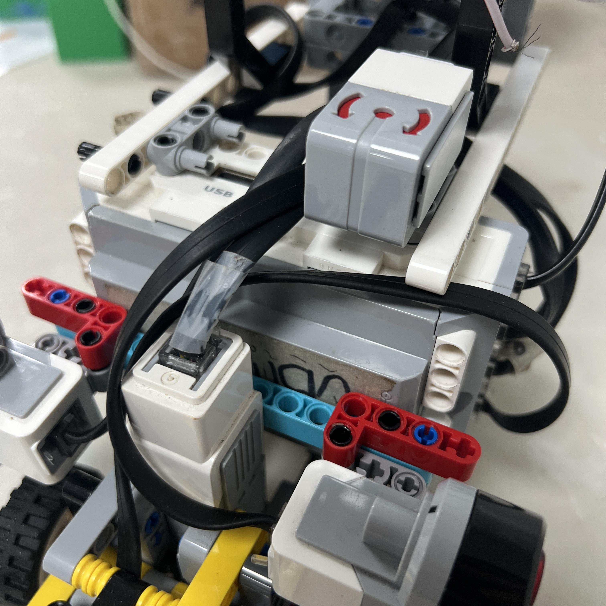
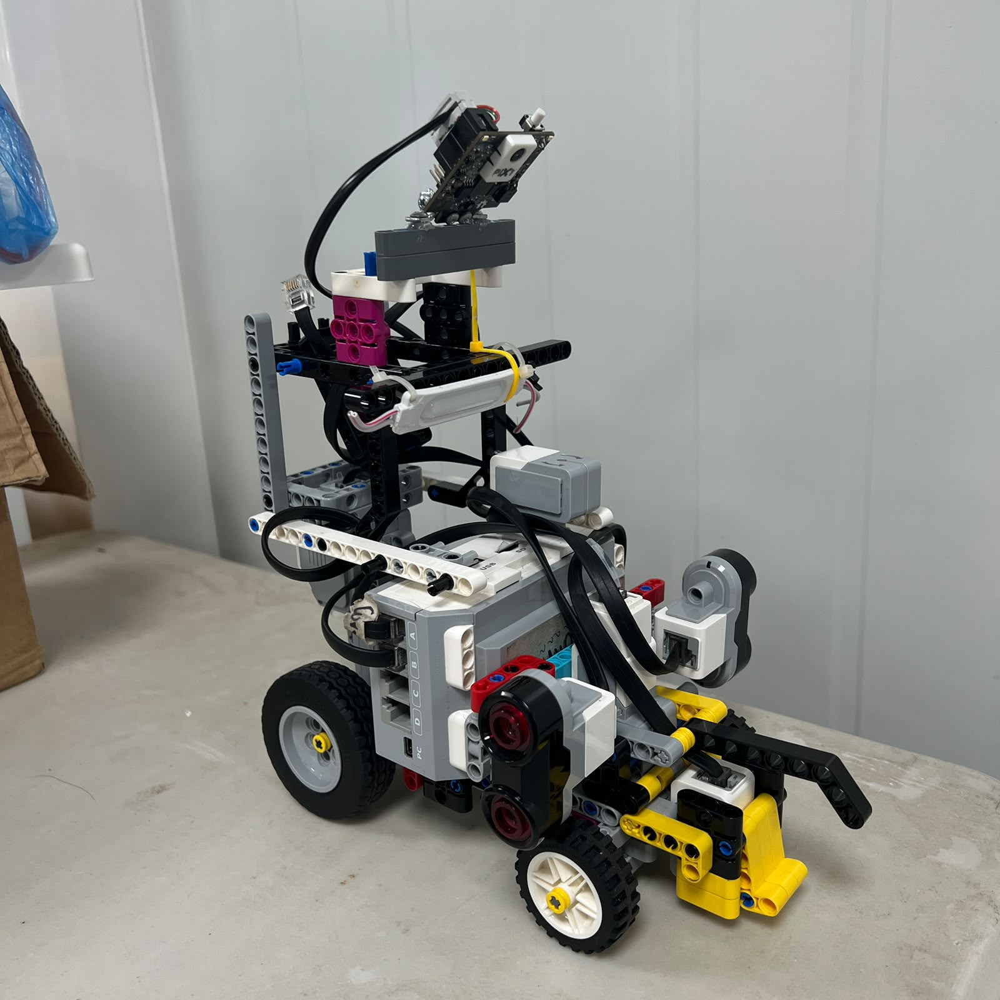

# 8. Battery and Main Power Source

<div align="center">



<br>

<sub><b>Figure 8.1.</b> LEGO Mindstorms EV3 Rechargeable DC Battery 45501 used as Piolín's main competition power source.</sub>

</div>

Piolín uses the **LEGO Mindstorms EV3 Rechargeable DC Battery, part 45501**, as its main power source. The battery is installed directly in the LEGO Mindstorms EV3 Intelligent Brick and powers the central controller together with the LEGO motors and sensors connected to it.

The decision to retain the official EV3 rechargeable battery was closely connected to the overall design philosophy of Piolín. Most of the robot already belongs to the LEGO Mindstorms EV3 ecosystem, including the main controller, propulsion motor, steering motor, ultrasonic sensors, Color Sensor, and the Gyro Sensor used during the Open Challenge. Keeping the standard EV3 battery therefore avoids introducing a separate vehicle power system for components that are already designed to operate together.

The current Piolín architecture does not use a second propulsion battery, an external battery pack, or a separate buck converter as part of the final competition configuration. Instead, the power system is kept centralized around the EV3.

This reduces electrical complexity while also making the robot easier to reproduce and troubleshoot.

---

## 8.1 Current Power Architecture

The main energy path can be represented as:

```text
LEGO EV3 Rechargeable Battery 45501
                ↓
         LEGO EV3 Brick
                ↓
      ┌─────────┼─────────┐
      │         │         │
      ▼         ▼         ▼
   MOTORS    LEGO SENSORS  S1 DEVICE
```

The two motors remain unchanged in both competition rounds:

```text
Port A
→ EV3 Large Motor
→ rear propulsion


Port B
→ EV3 Medium Motor
→ Ackermann steering
```

The permanent sensors are:

```text
S2
→ Left Ultrasonic


S3
→ Right Ultrasonic


S4
→ Color Sensor
```

S1 changes according to the challenge:

```text
OPEN
→ Gyro Sensor


OBSTACLES
→ Pixy2.1
```

<div align="center">


<br>

<sub><b>Figure 8.2.</b> Centralized power architecture based on the EV3 Rechargeable Battery and EV3 Brick.</sub>

</div>

This means that changing competition rounds does not require replacing the main battery architecture.

The same EV3 and the same battery remain the central electrical platform.

---

## 8.2 Physical Installation

<div align="center">


<br>

<sub><b>Figure 8.3.</b> Battery installed directly in Piolín's EV3 Brick as part of the current competition configuration.</sub>

</div>

The battery is mechanically integrated into the EV3 rather than mounted as a separate power module elsewhere in the chassis.

This provides several advantages.

The battery does not require:

```text
an external battery tray

additional power wiring

a separate motor driver supply

custom voltage conversion

an independent charging connector
```

The controller and battery therefore behave as one compact subsystem.

For a competition robot where structural space and cable organization are limited, this simplicity is valuable.

---

## 8.3 Why the Official EV3 Battery Was Selected

The battery was selected primarily because it matches the controller and the majority of Piolín's active hardware directly.

An alternative battery could theoretically provide:

```text
different capacity

different voltage characteristics

different physical dimensions
```

but it would also introduce additional engineering requirements.

These could include:

```text
voltage regulation

power connectors

electrical protection

mounting

charging procedure

compatibility verification
```

The official EV3 battery avoids most of these additional integration layers.

The decision can therefore be summarized as:

```text
required performance
+
native compatibility
+
low integration complexity
+
easy charging
+
reproducibility
```

rather than selecting a power source simply because it offers the largest possible electrical capacity.

---

## 8.4 Battery Integration with the EV3 Ecosystem

Piolín's current electronics are strongly centered around the EV3.

The main LEGO components are:

```text
EV3 Intelligent Brick

EV3 Large Motor

EV3 Medium Motor

2 × EV3 Ultrasonic Sensors

EV3 Color Sensor

EV3 Gyro Sensor during Open
```

All of these are designed to operate through the same controller ecosystem.

Using the standard EV3 battery therefore preserves a direct relationship:

```text
BATTERY
   ↓
EV3
   ↓
LEGO HARDWARE
```

<div align="center">


<br>

<sub><b>Figure 8.4.</b> The 45501 battery powers a controller already designed to interface directly with Piolín's LEGO motors and sensors.</sub>

</div>

The robot does not need separate motor drivers or a second electrical power architecture for its principal LEGO hardware.

---

## 8.5 Open Challenge Power Configuration

During the Open Challenge, Piolín uses:

```text
EV3 Battery
     ↓
EV3 Brick
     │
     ├── Motor A → Large Motor
     ├── Motor B → Medium Motor
     ├── S1 → Gyro
     ├── S2 → Left Ultrasonic
     ├── S3 → Right Ultrasonic
     └── S4 → Color Sensor
```

<div align="center">


<br>

<sub><b>Figure 8.5.</b> Power architecture used during the Open Challenge.</sub>

</div>

No external computing system is required for this round.

The power architecture is therefore completely centered around:

```text
45501 Battery
+
EV3
+
LEGO peripherals
```

This is the electrically simplest of Piolín's two current configurations.

---

## 8.6 Obstacle Challenge Power Configuration

During the Obstacle Challenge, the Gyro Sensor is removed and Pixy2.1 occupies S1.

The rest of the vehicle remains unchanged.

```text
EV3 Battery
     ↓
EV3 Brick
     │
     ├── Motor A → Large Motor
     ├── Motor B → Medium Motor
     ├── S1 → Pixy2.1
     ├── S2 → Left Ultrasonic
     ├── S3 → Right Ultrasonic
     └── S4 → Color Sensor
```

<div align="center">


<br>

<sub><b>Figure 8.6.</b> Obstacle Challenge power architecture with Pixy2.1 replacing the Gyro Sensor on S1.</sub>

</div>

In the current obstacle configuration, the Pixy2.1 connection to S1 provides the camera's connection to the EV3 without requiring the previous Arduino Nano subsystem or a separate external vehicle battery.

This keeps the obstacle configuration much closer to the Open configuration than earlier prototypes were.

---

## 8.7 Why the Power Architecture Remains the Same Between Rounds

One important advantage of Piolín's modular S1 strategy is that changing competition rounds does not require rebuilding the electrical architecture.

The transition is conceptually:

```text
OPEN

S1 = Gyro
```

to:

```text
OBSTACLES

S1 = Pixy2.1
```

while:

```text
battery
EV3
Motor A
Motor B
S2
S3
S4
```

remain unchanged.

<div align="center">


<br>

<sub><b>Figure 8.7.</b> Open and Obstacle configurations share the same main battery and EV3 power architecture; only the S1 sensing device changes.</sub>

</div>

This improves reproducibility because competition preparation does not require verifying two unrelated power systems.

---

## 8.8 Battery and Propulsion Motor

Motor A is the actuator that places the greatest continuous demand on Piolín's power system because it is responsible for moving the entire vehicle.

The power chain is:

```text
Battery
   ↓
EV3
   ↓
Motor Port A
   ↓
Large Motor
   ↓
Rear drivetrain
   ↓
Vehicle motion
```

<div align="center">


<br>

<sub><b>Figure 8.8.</b> Motor A is the primary propulsion load connected to the EV3 power architecture.</sub>

</div>

A change in available electrical conditions can therefore appear physically as a change in propulsion behavior.

This is one reason battery state should be controlled during performance testing rather than ignored as an unrelated variable.

---

## 8.9 Battery and Steering Motor

Motor B is also powered through the EV3.

Its electrical demand differs from Motor A because it performs short angular movements rather than continuously propelling the full vehicle.

However, steering load can increase when:

```text
front-wheel friction increases

linkage binds

steering approaches its mechanical limit

vehicle load presses strongly on the front wheels
```

A steering system that is mechanically difficult to move creates additional motor load.

For this reason, electrical performance and mechanical condition should be considered together.

Increasing motor command is not the ideal solution to a steering linkage that is physically binding.

---

## 8.10 Battery State as a Test Variable

A common mistake in robot testing is to treat the battery as if its condition were identical in every run.

It is not.

As testing continues, the battery state changes.

If one navigation parameter is tested with a recently charged battery and another is tested much later after repeated runs, the comparison may include an uncontrolled electrical variable.

Conceptually:

```text
TEST A
full / high battery condition


TEST B
different battery condition
```

may produce different physical behavior even if the software parameter under investigation is the only intended change.

This is particularly relevant when comparing:

```text
run time

acceleration

corner behavior

reverse response

parking displacement
```

---

## 8.11 Why Battery State Can Affect Navigation

Navigation depends on the physical response of the motors.

The control chain is:

```text
SENSOR ERROR
    ↓
EV3
    ↓
MOTOR COMMAND
    ↓
ACTUAL MOTOR RESPONSE
    ↓
VEHICLE MOTION
```

If actual motor response changes, the same navigation command may produce a different physical trajectory.

For example, if Motor A produces a different practical acceleration or speed under different electrical conditions, Piolín may travel a different distance before Motor B completes the same steering response.

This means battery consistency can indirectly affect:

```text
corner entry

corner width

obstacle reaction distance

countersteering timing

parking displacement
```

The battery is therefore part of control-system reproducibility even though it does not directly measure or calculate navigation.

---

## 8.12 Battery Condition and Cornering

Consider a corner controller that reacts to a geometric or gyro condition.

The sensor logic may be identical between two runs.

However, if Piolín enters the corner at a different actual speed:

```text
same steering command
+
different vehicle speed
=
different trajectory
```

<div align="center">


<br>

<sub><b>Figure 8.9.</b> Battery condition can indirectly influence navigation through its effect on actuator response and vehicle motion.</sub>

</div>

This is why battery condition should be considered when diagnosing a run that changes despite identical navigation code.

---

## 8.13 Battery Condition and Obstacle Avoidance

The same principle applies during Obstacles.

A pillar avoidance sequence involves:

```text
Pixy detection
      ↓
EV3 interpretation
      ↓
Motor B steering
      ↓
Motor A continues propulsion
      ↓
vehicle changes trajectory
```

The distance Piolín travels while the vision and steering systems react depends partly on actual propulsion behavior.

If the robot moves faster or slower than during calibration, the pillar can reach the vehicle at a different stage of the steering sequence.

For this reason, obstacle tuning should be performed under reasonably consistent electrical conditions.

---

## 8.14 Battery Condition and Reverse Maneuvers

Reverse motion is sometimes used to create more space before another steering or obstacle reaction.

A timed reverse maneuver depends strongly on actual motor behavior.

For example:

```text
reverse for X seconds
```

implicitly assumes a relationship between:

```text
time
```

and:

```text
distance traveled
```

If the propulsion response changes, that relationship also changes.

Encoder-based displacement can reduce dependence on time, but even encoder movement is not perfect physical distance because of wheel slip and mechanical effects.

This provides another reason to keep battery condition reasonably controlled during calibration.

---

## 8.15 Battery Condition and Parking

Parking is especially sensitive to repeatability because the final vehicle position matters.

A successful parking maneuver can depend on:

```text
approach speed

steering position

encoder displacement

reverse/forward response

final stopping behavior
```

Electrical inconsistency can make a time-based parking sequence less repeatable.

The preferred engineering approach is therefore to combine:

```text
stable battery conditions

encoder references

sensor evidence

mechanical calibration
```

rather than assuming timing alone will produce identical displacement.

---

## 8.16 Charging and Competition Preparation

The rechargeable battery allows Piolín to be prepared before competition without repeatedly replacing disposable cells.

A simple competition procedure should keep battery preparation consistent.

Conceptually:

```text
Charge battery
      ↓
Install / verify battery
      ↓
Power EV3
      ↓
Verify sensors
      ↓
Verify steering center
      ↓
Run calibration / test
      ↓
Competition run
```

<div align="center">


<br>

<sub><b>Figure 8.10.</b> Battery preparation is treated as part of the pre-run verification sequence rather than as an unrelated maintenance task.</sub>

</div>

This makes the electrical starting condition more reproducible between important tests.

---

## 8.17 Why Rechargeability Is Useful During Development

WRO development involves many repeated runs.

A typical development session can include:

```text
straight-line tests

corner tests

sensor tests

obstacle tests

parking tests

full runs
```

Using a rechargeable battery is practical because the same power system can be restored between testing sessions without changing the robot's physical battery architecture.

This also means that the battery can remain mechanically integrated in the EV3 while the robot is developed over many iterations.

---

## 8.18 Battery Placement and Center of Mass

The battery is not electrically significant only.

It also contributes to the robot's mass distribution because it is physically installed inside the EV3 Brick.

<div align="center">



<br>

<sub><b>Figure 8.11.</b> EV3 and battery placement contribute to the complete mass distribution of Piolín.</sub>

</div>

The current V4 center of mass has not yet been published as a measured final value, so this document does not claim an exact location.

However, the battery's physical position should still be considered when evaluating:

```text
front/rear loading

wheel traction

chassis balance

steering load
```

Moving a relatively significant component would change more than the wiring arrangement.

---

## 8.19 Why the Battery Is Kept Inside the Main Chassis

Keeping the EV3 and its battery structurally integrated provides a compact and protected power arrangement.

An externally mounted battery could create additional:

```text
cable length

mounting movement

connector exposure

weight distribution changes
```

The current arrangement keeps the battery inside the controller assembly that is already securely attached to Piolín.

This supports both electrical and mechanical reproducibility.

---

## 8.20 No Separate External Propulsion Battery

Piolín's current competition configuration does not use a second battery dedicated to Motor A.

A dual-battery architecture could theoretically separate:

```text
controller/sensors power
```

from:

```text
propulsion power
```

but it would introduce additional complexity.

Possible requirements would include:

```text
additional battery

additional mounting

power distribution

electrical isolation or common reference considerations

additional charging procedure

more wiring
```

The current propulsion demands do not justify introducing that second architecture.

---

## 8.21 No External Buck Converter in the Final Architecture

Earlier hardware experiments involving non-LEGO electronics could have created reasons to consider additional voltage-conversion hardware.

The current competition architecture does not use a separate buck converter as a permanent subsystem.

This was a deliberate simplification.

Every electrical component added to the robot creates additional:

```text
connections

failure points

mounting requirements

reproducibility requirements
```

If the component is not necessary for the current architecture, removing it produces a cleaner system.

---

## 8.22 Why Additional Power Electronics Were Avoided

A more complicated electrical system is not automatically a better electrical system.

Consider two conceptual approaches.

### Architecture A

```text
Battery
   ↓
EV3
   ↓
Robot hardware
```

### Architecture B

```text
Battery A
Battery B
   ↓
Regulator
Converter
External controller
Motor interface
   ↓
Robot hardware
```

Architecture B may offer capabilities that are useful in another robot.

However, each added device creates new questions:

```text
What voltage does it require?

How is it connected?

How is it protected?

How is it charged?

What happens if it disconnects?

How is it reproduced?
```

Piolín currently gains more from keeping the power architecture simple.

---

## 8.23 Comparison with Alternative Power Architectures

| Power Architecture | Advantage | Limitation for Piolín |
| :--- | :--- | :--- |
| Replaceable/disposable cells | Easy to replace quickly | Requires cell replacement and consistency management |
| External rechargeable battery | Potentially different capacity/output options | Requires custom power integration |
| Separate propulsion and logic batteries | Can isolate major loads | Adds mass, wiring, charging, and complexity |
| External regulated power system | Flexible voltage options | Additional converters and failure points |
| **EV3 Rechargeable Battery 45501** | **Native EV3 integration, rechargeable, compact architecture** | **Robot performance still depends on battery condition** |

The selected battery was therefore not chosen because every alternative is technically inferior.

It was chosen because it fits Piolín's existing controller and actuator ecosystem with the smallest integration burden.

---

## 8.24 Power-System Evolution

Piolín's electronics changed substantially during development.

Earlier vision architectures introduced components such as:

```text
HuskyLens

Arduino Nano

USB communication
```

and other experimental configurations increased the number of electrical interfaces around the EV3.

The current architecture intentionally moves back toward centralized power.

```text
EARLIER DEVELOPMENT

EV3
+
external vision/interface components
+
additional communication wiring
```

became:

```text
CURRENT OPEN

EV3
+
LEGO sensors
+
LEGO motors
```

and:

```text
CURRENT OBSTACLES

EV3
+
Pixy2.1
+
LEGO sensors
+
LEGO motors
```

<div align="center">


<br>

<sub><b>Figure 8.12.</b> Evolution toward a simpler EV3-centered electrical architecture with fewer external interface components.</sub>

</div>

The change demonstrates that electrical simplification can be an engineering improvement even when earlier components were technically functional.

---

## 8.25 Battery and Software Testing

Battery condition should be included in test notes whenever the team compares vehicle performance quantitatively.

A useful test record can contain:

```text
test name

software version

battery condition / reading

Motor A command

Motor B settings

sensor configuration

observed result
```

This makes it easier to distinguish:

```text
software change
```

from:

```text
electrical-condition change
```

when comparing runs.

---

## 8.26 Reading Battery State Through the Controller

The EV3 operating environment can provide battery-status information to software.

This means diagnostic programs can record an electrical reference together with navigation data rather than relying only on a subjective description such as:

```text
battery seemed charged
```

The exact API used depends on the active software environment.

Piolín currently uses different software paths for the two rounds:

```text
OPEN
→ Pybricks MicroPython


OBSTACLES
→ ev3dev2 / SMBus-oriented development
```

The specific battery-reading implementation should therefore be documented in the software setup or testing utilities rather than hard-coded into this hardware overview.

The important requirement is to record the electrical condition consistently when it is relevant to an experiment.

---

## 8.27 Battery Voltage Is Not a Navigation Parameter

Battery information should be monitored, but the navigation strategy should not normally depend on arbitrary battery-specific steering changes such as:

```text
if battery lower:
    turn more
```

unless real testing demonstrates a repeatable need and the relationship is justified.

A better engineering sequence is:

```text
maintain consistent battery condition
        ↓
mechanically validate robot
        ↓
calibrate control system
        ↓
measure performance
```

rather than creating software compensation for poorly controlled testing conditions.

---

## 8.28 Electrical Condition vs. Mechanical Problems

Reduced vehicle performance should not automatically be blamed on the battery.

A slow robot can also result from:

```text
drivetrain friction

misaligned axle

wheel rubbing

steering binding

excessive vehicle load
```

Similarly, a steering motor that struggles can be caused by mechanical resistance rather than insufficient battery power.

The diagnostic sequence should therefore distinguish:

```text
ELECTRICAL
```

from:

```text
MECHANICAL
```

before changing software.

---

## 8.29 Battery-Related Failure Modes

| Observed Behavior | Possible Cause |
| :--- | :--- |
| Robot generally feels slower than previous runs | Battery condition or increased mechanical resistance |
| Motor A response changes during long test session | Electrical state or drivetrain condition |
| Steering appears weaker | Battery condition or steering mechanical load |
| EV3 shuts down unexpectedly | Power/battery/contact issue |
| Behavior differs after charging | Motor response may have changed with electrical condition |
| Full-run time changes without code change | Battery, friction, track condition, or sensor behavior |
| Pixy/Obstacle configuration becomes unstable | Check S1 connection and general power/communication path |
| Robot works when stationary but fails under load | Inspect electrical state and mechanical drivetrain load |

No one symptom uniquely identifies the battery.

The complete system must be examined.

---

## 8.30 Battery Diagnostic Order

When a possible power problem appears, the recommended order is:

```text
1. Inspect battery installation
        ↓
2. Verify EV3 powers normally
        ↓
3. Check battery state
        ↓
4. Inspect motor and sensor cables
        ↓
5. Test Motor A without full navigation
        ↓
6. Test Motor B independently
        ↓
7. Inspect mechanical resistance
        ↓
8. Verify sensor operation
        ↓
9. Compare with known-good charged condition
        ↓
10. Resume full navigation testing
```

This avoids changing navigation parameters before the electrical and mechanical platform has been verified.

---

## 8.31 Competition Pre-Run Power Checklist

Before an important competition run, the power system should be treated as part of the robot's readiness check.

A concise procedure is:

```text
Battery sufficiently charged
        ↓
Battery securely installed
        ↓
EV3 boots normally
        ↓
Motor A responds
        ↓
Motor B responds
        ↓
S1 device responds
        ↓
S2 / S3 respond
        ↓
S4 responds
        ↓
Correct round program selected
        ↓
Robot ready
```

<div align="center">


<br>

<sub><b>Figure 8.13.</b> Pre-run verification checks the battery together with the components whose operation depends on the EV3 power system.</sub>

</div>

This turns power verification into a repeatable process instead of discovering a battery-related issue during a complete autonomous run.

---

## 8.32 Why Battery Consistency Matters for Engineering Evidence

If Piolín's repository presents test results such as:

```text
run time

corner repeatability

parking displacement

obstacle success rate
```

those results are more meaningful if important test conditions are controlled.

Battery condition is one of those conditions.

For example, comparing two steering algorithms is more useful when:

```text
same robot

same track

same mechanical configuration

similar battery condition
```

are maintained.

Otherwise, an observed improvement may not come entirely from the software change.

This is why electrical consistency contributes directly to the quality of engineering evidence.

---

## 8.33 Current Power Configuration

The current competition architecture can be summarized as:

```text
MAIN POWER SOURCE

LEGO Mindstorms EV3
Rechargeable DC Battery
Part 45501
```

which powers:

```text
LEGO EV3 Brick
        │
        ├── Motor A
        │   └── Large Motor
        │
        ├── Motor B
        │   └── Medium Motor
        │
        ├── S2
        │   └── Left Ultrasonic
        │
        ├── S3
        │   └── Right Ultrasonic
        │
        └── S4
            └── Color Sensor
```

while S1 is round-specific:

```text
OPEN
→ Gyro


OBSTACLES
→ Pixy2.1
```

No separate external propulsion battery, Arduino Nano power system, or permanent buck-converter subsystem is part of the current competition architecture.

---

## 8.34 Current vs. Legacy Power Hardware

The repository should clearly distinguish current and historical electronics.

### Current

```text
EV3 Battery 45501

EV3 Brick

EV3 motors

EV3 sensors

Gyro during Open

Pixy2.1 during Obstacles
```

### Legacy / development-only

```text
Arduino Nano

HuskyLens interface

additional prototype wiring

earlier external vision communication arrangements
```

Historical systems remain useful because they demonstrate engineering iteration, but they should not appear in current wiring or reproduction instructions.

---

## 8.35 Values Intentionally Not Claimed as Final

This component document intentionally does not invent or publish unverified current values for:

```text
measured battery voltage during competition

battery runtime per charge

measured capacity after use

current draw of complete robot

Motor A peak current

Motor B peak current

Pixy current consumption through current installation

power loss through connections

measured voltage sag under acceleration

number of full runs per charge
```

These quantities can be valuable engineering evidence, but they should only be added after they are measured on the actual current V4 robot.

A future power test can record them systematically.

---

## 8.36 Suggested Battery Test

A useful reproducibility experiment would compare vehicle behavior at several measured battery conditions.

For each test point, the team could record:

```text
battery reading

straight-line time over fixed distance

representative corner behavior

Motor A command

software version
```

A results table could later use the structure:

| Trial | Battery Reading | Motor A Command | Fixed-Distance Time | Notes |
| :---: | :---: | :---: | :---: | :--- |
| 1 | — | — | — | — |
| 2 | — | — | — | — |
| 3 | — | — | — | — |
| 4 | — | — | — | — |

No values should be entered until the experiment is physically performed.

<div align="center">


<br>

<sub><b>Figure 8.14.</b> Reserved evidence figure for measured battery condition versus vehicle performance. The graph should only be generated from real Piolín test data.</sub>

</div>

---

## 8.37 Why the Simplest Power System Was Preferred

Piolín's power-system decision follows the same engineering philosophy used in the rest of the robot.

The question was not:

> How many electrical components can be added?

The more useful question was:

> What is the simplest electrical architecture that reliably supports the hardware actually required by the robot?

Because the EV3 battery already powers the controller and LEGO platform for which Piolín was designed, adding a separate general-purpose power system would create complexity without a currently demonstrated need.

The final architecture therefore favors:

```text
compatibility

simplicity

reproducibility

low wiring complexity

easy charging

easy troubleshooting
```

---

## 8.38 Final Engineering Assessment

The LEGO Mindstorms EV3 Rechargeable DC Battery 45501 is more than a replaceable source of electrical energy inside Piolín. It is part of the decision to keep the complete robot centered around one consistent EV3 platform.

The current power architecture can be summarized as:

```text
                    EV3 BATTERY 45501
                           │
                           ▼
                       LEGO EV3
                           │
          ┌────────────────┼────────────────┐
          │                │                │
          ▼                ▼                ▼
       Motor A          Motor B          Sensors
          │                │                │
          ▼                ▼       ┌────────┼────────┐
     Propulsion        Steering     S2/S3    S4      S1
                                                  modular
```

<div align="center">


<br>

<sub><b>Figure 8.15.</b> The 45501 battery forms part of the centralized EV3 platform shared by both Piolín competition configurations.</sub>

</div>

The battery was retained because it integrates naturally with the EV3, eliminates the need for unnecessary external power electronics, supports repeated development through rechargeability, and preserves the same power platform between the Open and Obstacle Challenges.

At the same time, Piolín's testing methodology recognizes that electrical condition can influence physical motor response. Battery preparation and measurement are therefore treated as part of reproducible engineering testing rather than as an invisible background condition.

The final design demonstrates the same principle applied throughout Piolín:

> **A power system should provide the required capability with the smallest justified amount of additional electrical complexity.**

---

<div align="center">

### [← Back to PiolínTech Main README](../../README.md)

</div>
