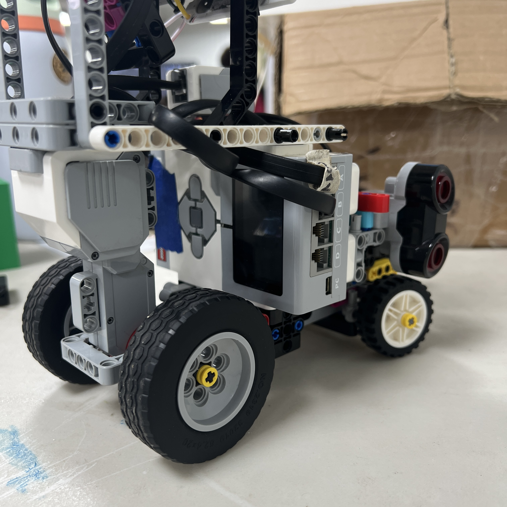
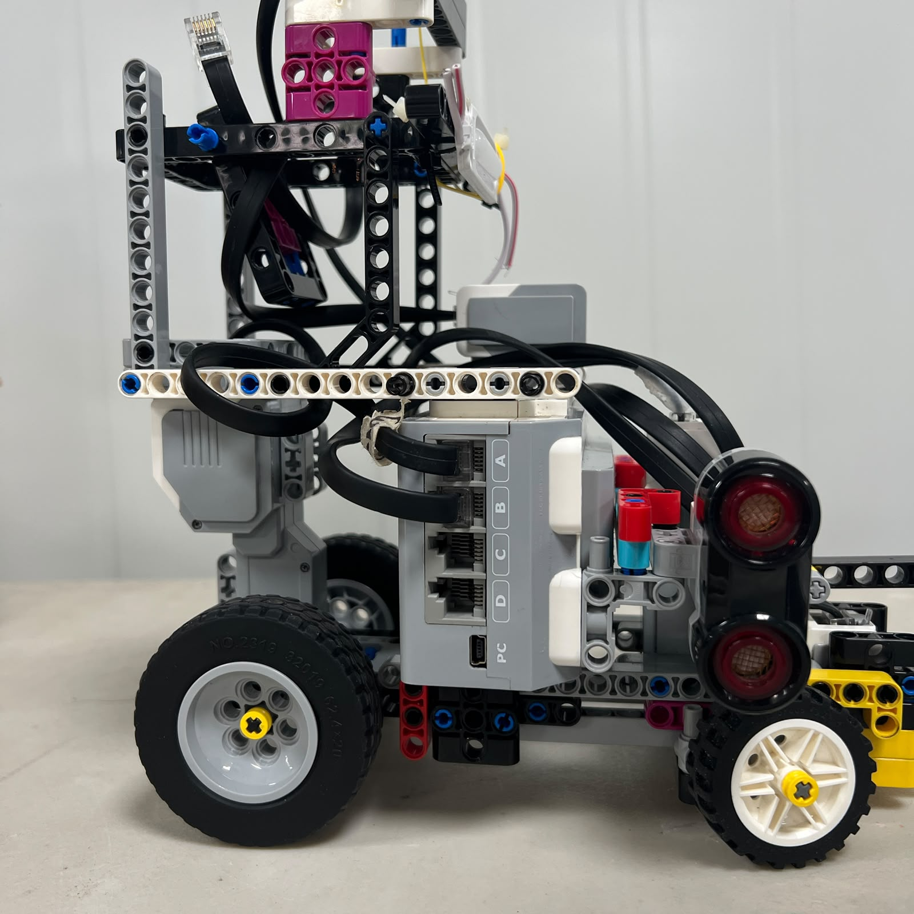
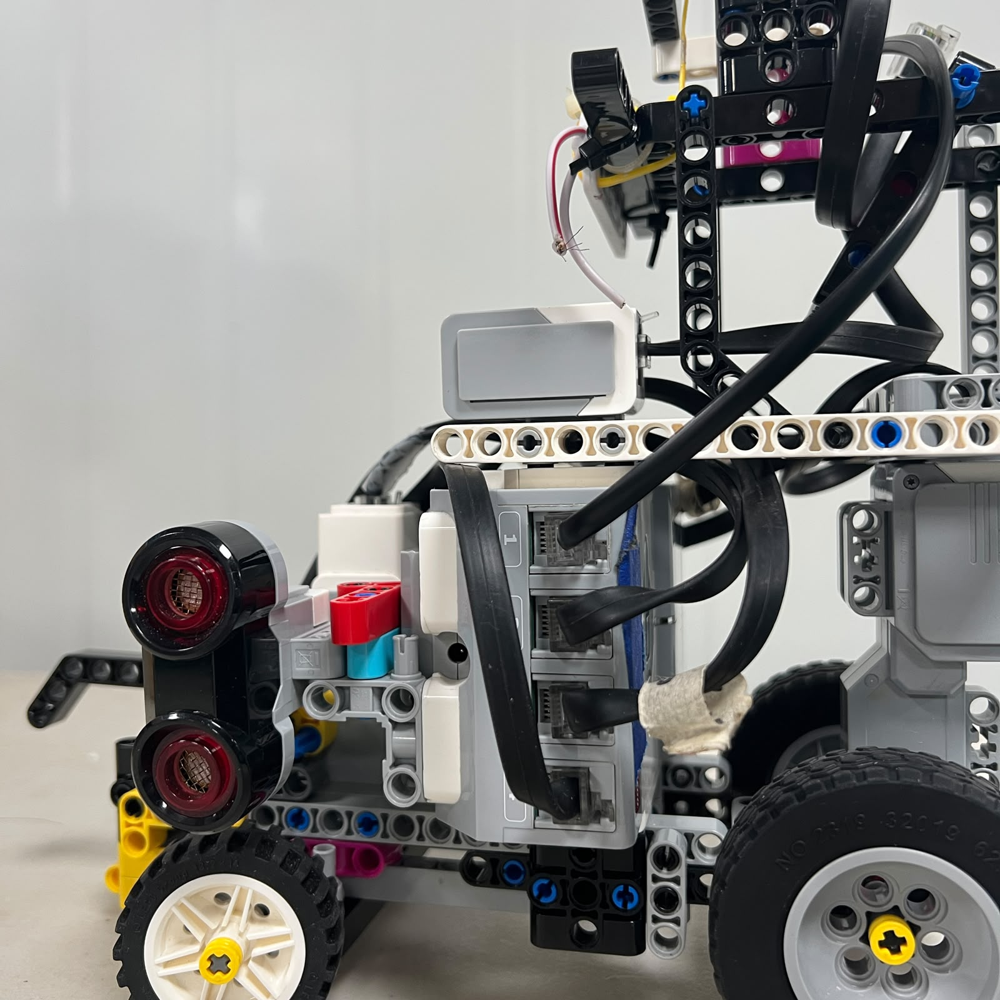
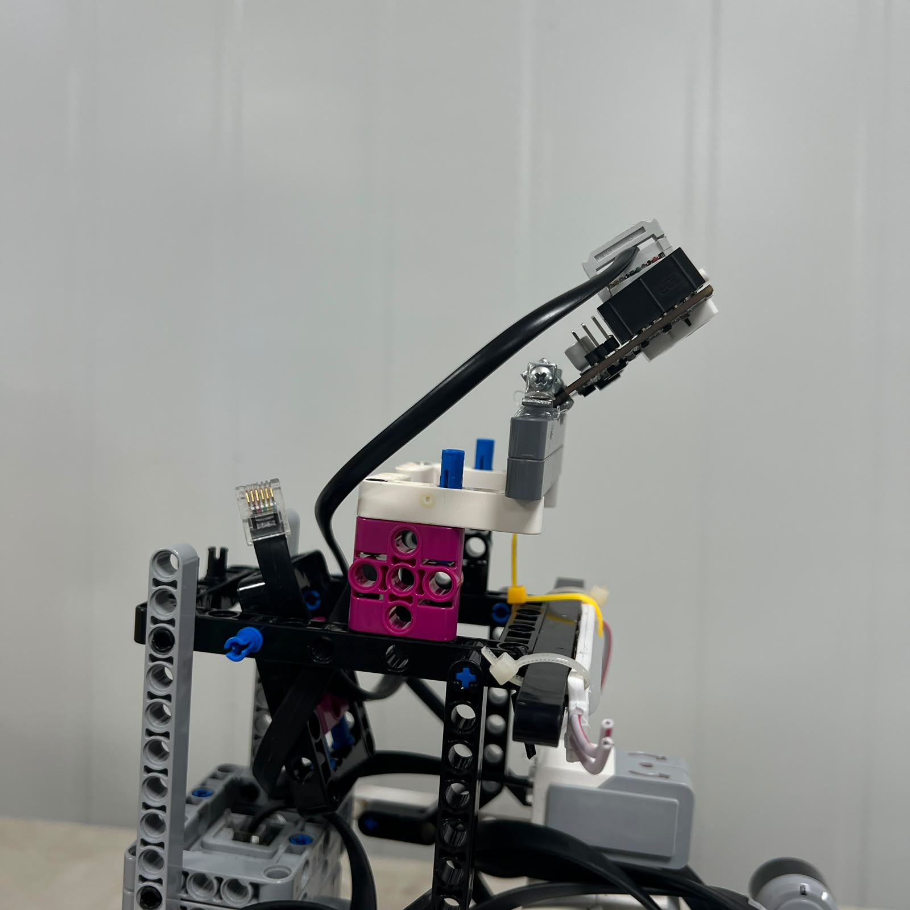

# 9. Power Distribution and Electrical Architecture

<div align="center">


<br>

<sub><b>Figure 9.1.</b> Current Piolín wiring in the Open Challenge configuration, with the EV3 acting as the central power and control hub.</sub>

</div>

Piolín uses a centralized electrical architecture built around the **LEGO Mindstorms EV3 Intelligent Brick** and the **LEGO Mindstorms EV3 Rechargeable DC Battery 45501**. Rather than distributing power through several independent regulators, batteries, controllers, or motor drivers, the current competition robot keeps nearly all electrical functions inside the EV3 ecosystem.

The battery is installed directly in the EV3 Brick. From there, the EV3 supplies and controls the two motors through Motor Ports A and B and interfaces with the sensors through Sensor Ports S1–S4.

The permanent connection structure is:

```text
Motor A
→ EV3 Large Motor
→ rear propulsion


Motor B
→ EV3 Medium Motor
→ Ackermann steering


S2
→ Left EV3 Ultrasonic Sensor


S3
→ Right EV3 Ultrasonic Sensor


S4
→ EV3 Color Sensor
```

The only connection that changes between competition rounds is S1:

```text
OPEN
S1 → EV3 Gyro Sensor


OBSTACLES
S1 → Pixy2.1
```

This modular arrangement allows the same controller, battery, motors, and permanent sensors to remain unchanged while adapting one sensor interface to the specific requirements of each challenge.

---

## 9.1 Centralized Power Philosophy

The current electrical design follows one central principle:

> **If the EV3 can directly power, communicate with, and control a required component reliably, an additional power subsystem should only be introduced when it provides a clear engineering benefit.**

This principle became increasingly important during Piolín's development.

Earlier prototypes included additional devices such as:

```text
Arduino Nano

HuskyLens

USB communication

additional prototype wiring
```

Those systems were useful for experimentation, but every additional active electronic component created another dependency.

A more complex architecture means more questions must be answered before the robot can operate:

```text
Is every controller powered?

Are the voltage levels compatible?

Did every interface initialize?

Is the communication bridge running?

Are both software environments synchronized?

Are all cables secure?
```

The current architecture removes several of those dependencies by returning the EV3 to the center of both control and power distribution.

---

## 9.2 Main Electrical Architecture

The high-level electrical architecture is:

```text
              EV3 Rechargeable Battery 45501
                          │
                          ▼
                     LEGO EV3
                          │
        ┌─────────────────┼─────────────────┐
        │                 │                 │
        ▼                 ▼                 ▼
     Motor A           Motor B          Sensor Ports
        │                 │                 │
        ▼                 ▼       ┌─────────┼─────────┐
 Large Motor        Medium Motor   S1        S2/S3      S4
        │                 │         │          │         │
        ▼                 ▼         │          ▼         ▼
 Propulsion          Steering       │     Ultrasonics   Color
                                    │
                         Round-specific device
```

<div align="center">


<br>

<sub><b>Figure 9.2.</b> High-level power distribution architecture centered around the EV3 Battery and EV3 Brick.</sub>

</div>

This diagram deliberately separates the **energy source**, **controller**, and **loads/interfaces**.

The battery provides the electrical energy.

The EV3 distributes that energy and provides the control interfaces.

The motors and sensors perform the physical and sensing functions required by the robot.

---

## 9.3 Power Source

The main and only current competition battery is:

**LEGO Mindstorms EV3 Rechargeable DC Battery — 45501**

<div align="center">


<br>

<sub><b>Figure 9.3.</b> EV3 Rechargeable DC Battery 45501 used as Piolín's main power source.</sub>

</div>

The battery is installed directly inside the EV3 Brick rather than connected as an external vehicle battery.

This simplifies the energy path:

```text
Battery
  ↓
EV3
  ↓
Robot hardware
```

rather than requiring:

```text
External battery
  ↓
distribution board
  ↓
regulators
  ↓
controller
  ↓
motor drivers / sensors
```

The simpler architecture is particularly appropriate because most of Piolín's hardware is already designed for direct EV3 integration.

---

## 9.4 Why One Main Battery Was Preferred

Using one centralized battery reduces the number of electrical conditions that need to be checked before a run.

With one main battery, competition preparation can focus on:

```text
battery state

EV3 boot

motor response

sensor response
```

A multi-battery architecture could require additional checks such as:

```text
battery A charged?

battery B charged?

both switches active?

shared ground correct?

voltage converter active?

external controller powered?
```

Those additional systems can be justified in robots that require them.

Piolín's current architecture does not.

The decision was therefore not based on the idea that one battery is always superior. It was based on the fact that one EV3 battery already satisfies the integration needs of the present LEGO-centered platform.

---

## 9.5 EV3 as Power and Control Hub

<div align="center">



<br>

<sub><b>Figure 9.4.</b> EV3 Brick installed as both the central controller and the main distribution point for Piolín's electrical subsystems.</sub>

</div>

The EV3 performs two closely related roles.

It is the computational controller responsible for:

```text
navigation

sensor interpretation

state logic

motor commands
```

and it is also the physical interface through which the principal motors and sensors receive their connection to the robot's electrical system.

This greatly simplifies Piolín's system architecture because sensing and actuation do not need to pass through separate general-purpose controllers.

---

## 9.6 Motor Power Distribution

The two motors are connected to dedicated EV3 motor outputs.

```text
PORT A
→ EV3 Large Motor
→ propulsion


PORT B
→ EV3 Medium Motor
→ steering
```

<div align="center">



<br>

<sub><b>Figure 9.5.</b> EV3 Motor Ports A and B provide the physical interface to Piolín's propulsion and steering actuators.</sub>

</div>

The two motors experience very different mechanical loads even though they share the EV3 power platform.

Motor A moves the entire vehicle and therefore represents the primary continuous propulsion load.

Motor B moves only the steering mechanism, but its demand can increase significantly if the steering linkage is binding or operating near a mechanical limit.

Electrical behavior therefore cannot be completely separated from mechanical condition.

---

## 9.7 Propulsion Power Path

The propulsion path is:

```text
Battery 45501
      ↓
EV3
      ↓
Motor Port A
      ↓
EV3 Large Motor
      ↓
Rear drivetrain
      ↓
Rear wheels
```

<div align="center">


<br>

<sub><b>Figure 9.6.</b> Motor A receives electrical power through the EV3 and converts it into mechanical rear-wheel propulsion.</sub>

</div>

The electrical path ends at the motor, but the useful vehicle output depends on everything that follows mechanically.

A reduction in vehicle speed can therefore result from:

```text
electrical condition
```

or:

```text
mechanical resistance
```

or both.

This is why drivetrain and power diagnostics should not be performed independently.

---

## 9.8 Steering Power Path

Motor B follows a similar electrical architecture but produces a different physical result.

```text
Battery 45501
      ↓
EV3
      ↓
Motor Port B
      ↓
EV3 Medium Motor
      ↓
Ackermann linkage
      ↓
Front-wheel angle
```

<div align="center">


<br>

<sub><b>Figure 9.7.</b> EV3 Medium Motor powered and controlled through Port B as Piolín's steering actuator.</sub>

</div>

The steering system benefits from the fact that no external servo interface or independent servo power supply is required.

This was one of the reasons to keep an EV3 Medium Motor instead of introducing a separate hobby-servo ecosystem.

---

## 9.9 Permanent Sensor Distribution

Three sensor ports remain physically unchanged between both competition rounds.

```text
S2
→ Left Ultrasonic Sensor


S3
→ Right Ultrasonic Sensor


S4
→ Color Sensor
```

<div align="center">



<br>

<sub><b>Figure 9.8.</b> EV3 sensor-port area. S2, S3, and S4 retain fixed functions while S1 is round-specific.</sub>

</div>

This fixed mapping reduces rewiring and prevents the two lateral ultrasonic sensors from changing identity between programs.

The hardware convention remains:

```text
S2 = LEFT

S3 = RIGHT
```

regardless of clockwise or counterclockwise navigation.

---

## 9.10 Sensor Interfaces Are Not Interchangeable with Motor Outputs

The EV3 motor and sensor ports serve different electrical and communication roles.

Motor Ports A and B connect to active actuators that receive commanded motor power and encoder communication.

Sensor Ports S1–S4 are used for sensing interfaces.

Therefore the architecture should not be interpreted as:

```text
all ports are equivalent power connectors
```

They are not.

The wiring diagrams must preserve the correct distinction between:

```text
MOTOR OUTPUTS
```

and:

```text
SENSOR / COMMUNICATION INPUTS
```

This is important for reproducibility because correct cable placement is part of the hardware definition.

---

# 9.11 Open Challenge Power Distribution

The Open Challenge uses the fully LEGO sensing configuration.

```text
                     BATTERY 45501
                          │
                          ▼
                         EV3
                          │
         ┌────────────────┼────────────────┐
         │                │                │
         ▼                ▼                ▼
      PORT A           PORT B          SENSOR PORTS
         │                │                │
         ▼                ▼       ┌────────┼─────────┐
    Large Motor       Medium Motor S1       S2        S3
         │                │         │        │         │
         ▼                ▼         ▼        ▼         ▼
    Rear Drive        Steering     Gyro    Left US   Right US

                                         S4
                                          │
                                          ▼
                                     Color Sensor
```

<div align="center">


<br>

<sub><b>Figure 9.9.</b> Current Open Challenge electrical architecture.</sub>

</div>

The Open configuration is especially simple because every active sensing and actuation device belongs to the LEGO EV3 ecosystem.

No camera, Arduino, USB bridge, or external regulator is required.

---

## 9.12 Open Challenge Wiring Evidence

<div align="center">


<br>

<sub><b>Figure 9.10.</b> Physical wiring of the current Open configuration.</sub>

</div>

A reconstruction of the Open robot should be able to verify the wiring directly from both the photograph and the corresponding diagram.

The expected connections are:

| EV3 Port | Open Component |
| :---: | :--- |
| A | Large Motor |
| B | Medium Motor |
| S1 | Gyro Sensor |
| S2 | Left Ultrasonic Sensor |
| S3 | Right Ultrasonic Sensor |
| S4 | Color Sensor |

This table should match both the code and the physical robot.

---

## 9.13 Open Challenge Electrical Advantages

The Open architecture provides several advantages.

First, every active component is designed for EV3 integration.

Second, all primary communication occurs through standard EV3 interfaces.

Third, no secondary controller must boot or initialize before navigation starts.

Fourth, troubleshooting can begin at one controller.

If an Open sensor does not respond, the diagnostic path is relatively short:

```text
sensor
  ↓
cable
  ↓
EV3 port
  ↓
software
```

rather than crossing multiple controllers.

---

# 9.14 Obstacle Challenge Power Distribution

During Obstacles, the only major electrical change is S1.

The Gyro Sensor is removed and Pixy2.1 is connected in its place.

```text
                     BATTERY 45501
                          │
                          ▼
                         EV3
                          │
         ┌────────────────┼────────────────┐
         │                │                │
         ▼                ▼                ▼
      PORT A           PORT B          SENSOR PORTS
         │                │                │
         ▼                ▼       ┌────────┼─────────┐
    Large Motor       Medium Motor S1       S2        S3
         │                │         │        │         │
         ▼                ▼         ▼        ▼         ▼
    Rear Drive        Steering    Pixy2.1  Left US   Right US

                                         S4
                                          │
                                          ▼
                                     Color Sensor
```

<div align="center">


<br>

<sub><b>Figure 9.11.</b> Current Obstacle Challenge power and interface architecture with Pixy2.1 installed on S1.</sub>

</div>

The important engineering advantage is that adding vision does not require replacing the complete power system.

---

## 9.15 Pixy2.1 S1 Connection

<div align="center">


<br>

<sub><b>Figure 9.12.</b> Current Pixy2.1 connection to S1 in the Obstacle Challenge configuration.</sub>

</div>

In the current Piolín configuration, Pixy2.1 connects directly to the EV3 through S1. The same connection provides the current camera interface to the EV3 and is the physical path used by the current I2C-based integration.

This replaces the older multi-stage architecture:

```text
HuskyLens
   ↓
Arduino Nano
   ↓
USB
   ↓
EV3
```

with:

```text
Pixy2.1
   ↓
S1
   ↓
EV3
```

The exact physical cable and connector arrangement should be documented photographically so another team can reproduce the same installation rather than assuming that every Pixy cable is electrically interchangeable.

---

## 9.16 Why the Pixy Connection Must Be Documented Carefully

Pixy2.1 is the only major current non-LEGO sensing device in the vehicle.

For the LEGO sensors, the standard EV3 connection makes the interface visually straightforward.

Pixy requires more attention because reproducibility depends on understanding:

```text
which Pixy connector is used

which cable is used

which EV3 port is used

which communication mode is configured
```

<div align="center">



<br>

<sub><b>Figure 9.13.</b> Physical Pixy2.1 connection cable used in the current obstacle configuration.</sub>

</div>

This photograph is particularly important because a block diagram alone cannot fully communicate a non-standard physical connection.

---

## 9.17 Power and Data Are Different Concepts

When documenting Pixy integration, power and communication should be conceptually separated even when they share the same physical connection.

```text
POWER
→ allows device to operate


DATA
→ transfers camera information
```

The current S1 connection performs the required interface role for Piolín's installed Pixy system.

However, this document does not invent or publish unverified electrical pin voltages, maximum current values, or connector pin assignments.

Those details should only be added after the exact current cable/interface has been electrically verified.

This prevents a high-level architecture diagram from being mistaken for an electrical pinout.

---

## 9.18 Obstacle Challenge Wiring Evidence

<div align="center">


<br>

<sub><b>Figure 9.14.</b> Current physical Obstacle Challenge wiring with Pixy2.1 installed on S1.</sub>

</div>

The expected obstacle connections are:

| EV3 Port | Obstacle Component |
| :---: | :--- |
| A | Large Motor |
| B | Medium Motor |
| S1 | Pixy2.1 |
| S2 | Left Ultrasonic Sensor |
| S3 | Right Ultrasonic Sensor |
| S4 | Color Sensor |

The table differs from Open in only one row.

That is exactly the goal of the modular architecture.

---

## 9.19 Round-to-Round Electrical Comparison

The two electrical configurations can be compared directly.

| Connection | Open | Obstacles |
| :--- | :--- | :--- |
| Battery | EV3 45501 | EV3 45501 |
| Controller | EV3 | EV3 |
| A | Large Motor | Large Motor |
| B | Medium Motor | Medium Motor |
| S1 | Gyro | Pixy2.1 |
| S2 | Left Ultrasonic | Left Ultrasonic |
| S3 | Right Ultrasonic | Right Ultrasonic |
| S4 | Color Sensor | Color Sensor |
| Arduino Nano | No | No |
| HuskyLens | No | No |
| External battery | No | No |
| Permanent buck converter | No | No |

<div align="center">


<br>

<sub><b>Figure 9.15.</b> Electrical comparison between both competition configurations. S1 is the only active sensor interface that changes.</sub>

</div>

This is a strong reproducibility advantage because changing rounds does not require rebuilding the drivetrain, sensor network, or battery system.

---

## 9.20 Why S1 Is Modular Instead of Adding Another Controller

One possible solution to the limited number of EV3 sensor inputs would be to keep every sensor and add another controller.

For example:

```text
EV3
+
Arduino
+
additional sensor
```

This would increase available interfaces, but it would also create another processing and power subsystem.

The final Piolín strategy instead asks:

> Which sensor actually provides the highest-value information for this round?

During Open:

```text
Gyro
```

is more valuable than vision.

During Obstacles:

```text
Pixy2.1
```

is more valuable than gyro heading.

The architecture therefore swaps the specialized sensor instead of carrying both simultaneously.

---

## 9.21 Why the Front Ultrasonic Is Not Present

Earlier Piolín versions used or tested a frontal ultrasonic sensor.

Keeping that sensor permanently would consume another EV3 sensor interface.

The final trade-off is:

```text
Permanent front ultrasonic
```

versus:

```text
Gyro during Open
+
Pixy2.1 during Obstacles
```

The front sensor provides frontal range.

The gyro provides orientation.

Pixy provides obstacle identity and visual position.

For the final navigation strategy, the specialized S1 information provides greater value.

Therefore the front ultrasonic was removed from the current electrical architecture.

---

## 9.22 Why the Arduino Nano Is Not Present

The Arduino Nano belonged to the previous HuskyLens vision architecture.

Its role was:

```text
HuskyLens
    ↓
Nano
    ↓
EV3
```

The Nano was useful because it allowed communication between the visual sensor and the main controller.

However, when the vision system changed to direct Pixy2.1 integration, that communication bridge became unnecessary.

Removing it reduced:

```text
component count

wiring

firmware dependencies

power dependencies

communication failure points
```

This is an example of system optimization through **removal**, not only addition.

---

## 9.23 Why No Permanent Buck Converter Is Used

A buck converter is useful when a system requires a regulated voltage different from the available supply.

The current Piolín architecture does not require a permanent external buck converter as part of its competition configuration.

Introducing one unnecessarily would create:

```text
input wiring

output wiring

voltage adjustment

mounting

additional connections

another failure mode
```

The current system therefore avoids a converter that does not provide a demonstrated requirement.

This does not mean buck converters are undesirable components in general. It means they are not justified in the present Piolín architecture.

---

## 9.24 Why No External Battery Is Used

A separate external battery could theoretically power a camera, processor, or motors independently.

However, it would introduce:

```text
additional mass

additional charging

additional mounting

additional wiring

different electrical states
```

The current vehicle does not require this complexity.

Using the EV3 Battery 45501 as the common main power source keeps both rounds closer to the same electrical baseline.

---

## 9.25 Current vs. Legacy Electrical Complexity

The architecture evolution can be represented conceptually as:

```text
EARLIER VISION ARCHITECTURE

Battery / EV3
      │
      ├── Motors
      ├── LEGO sensors
      └── USB
           ↓
        Arduino Nano
           ↓
        HuskyLens
```

compared with:

```text
CURRENT OBSTACLE ARCHITECTURE

Battery / EV3
      │
      ├── Motors
      ├── LEGO sensors
      └── S1
           ↓
         Pixy2.1
```

<div align="center">


<br>

<sub><b>Figure 9.16.</b> Evolution from a multi-device vision interface toward the current EV3-centered electrical system.</sub>

</div>

The newer architecture has fewer active electronic interfaces that must operate simultaneously.

---

## 9.26 Cable Management

Electrical reliability is influenced not only by the components themselves but also by how the cables are installed.

Poor cable routing can create:

```text
connector tension

moving-wire interference

steering interference

wheel contact

accidental disconnection
```

<div align="center">


<br>

<sub><b>Figure 9.17.</b> Cable routing should secure electrical connections without restricting steering, wheels, or service access.</sub>

</div>

Cable routing should therefore satisfy both electrical and mechanical requirements.

A perfectly connected sensor cable can still create a mechanical failure if it interferes with the steering linkage.

---

## 9.27 Avoiding Cable Stress

Cables should have enough slack to avoid pulling on connectors while also being restrained enough to stay away from moving parts.

The desired condition is:

```text
too tight
→ connector stress
```

```text
too loose
→ moving-part interference
```

The correct routing lies between those extremes.

Particular attention should be given to:

```text
Motor B steering area

front wheel movement

Pixy cable

sensor-port connections
```

because these regions are close to active mechanisms or removable round-specific hardware.

---

## 9.28 Modular S1 Cable Change

Changing from Open to Obstacles requires a controlled S1 reconfiguration.

Conceptually:

```text
Power off EV3
      ↓
Remove Gyro connection
      ↓
Install Pixy connection
      ↓
Verify S1 physical seating
      ↓
Boot correct software environment
      ↓
Verify S1 data
```

and the reverse process is used to return to Open.

<div align="center">


<br>

<sub><b>Figure 9.18.</b> Controlled S1 reconfiguration procedure between Open and Obstacle hardware.</sub>

</div>

Treating the change as a defined procedure reduces the risk of running Open code with Pixy installed or obstacle code with the gyro installed.

---

## 9.29 Why the Robot Should Be Powered Down During Reconfiguration

Physical sensor changes should preferably be performed with the robot powered down.

This prevents the electrical and software state from becoming ambiguous while the device on S1 is being changed.

A clean sequence is:

```text
STOP PROGRAM
      ↓
POWER DOWN
      ↓
CHANGE S1 DEVICE
      ↓
VERIFY CABLE
      ↓
POWER UP
      ↓
RUN CORRECT PROGRAM
```

This is also easier to reproduce and document than relying on hot-swapping behavior.

---

## 9.30 Electrical Architecture and Software Architecture Must Match

The robot has two different S1 hardware configurations and two corresponding software paths.

```text
OPEN HARDWARE

S1 = Gyro
      ↓
Pybricks-based Open program
```

```text
OBSTACLE HARDWARE

S1 = Pixy2.1
      ↓
ev3dev2 / SMBus-based obstacle program
```

<div align="center">


<br>

<sub><b>Figure 9.19.</b> The physical S1 configuration and the software environment must correspond to the same competition round.</sub>

</div>

This is an important reproducibility requirement.

Correct wiring with the wrong software configuration is still an incorrect system state.

---

## 9.31 Electrical Architecture and Sensor Initialization

When the EV3 starts a program, each connected sensor must initialize in a form expected by that program.

For Open:

```text
Gyro available

S2 available

S3 available

S4 available
```

For Obstacles:

```text
Pixy interface available

S2 available

S3 available

S4 available
```

A robust startup process should verify that the expected devices respond before beginning autonomous motion.

This prevents a missing sensor from becoming a driving failure several seconds later.

---

## 9.32 Power Distribution and Fault Isolation

A centralized architecture simplifies fault isolation.

Suppose the left ultrasonic stops producing valid information.

The diagnostic chain is:

```text
Left US
  ↓
sensor cable
  ↓
S2
  ↓
EV3
  ↓
software
```

If Motor A fails:

```text
Large Motor
  ↓
motor cable
  ↓
Port A
  ↓
EV3 / battery
```

If Pixy fails:

```text
Pixy2.1
  ↓
connection cable
  ↓
S1
  ↓
EV3 interface
  ↓
software
```

This clear chain makes failures easier to classify.

---

## 9.33 Electrical Failure vs. Software Failure

A sensor that produces no data can be caused by:

```text
disconnected cable

wrong port

incorrect software interface

device initialization failure
```

The first response should not automatically be to rewrite navigation logic.

The diagnostic process should identify the first layer where expected behavior disappears.

```text
PHYSICAL DEVICE
      ↓
CONNECTION
      ↓
EV3 INTERFACE
      ↓
RAW DATA
      ↓
SOFTWARE INTERPRETATION
```

This distinction is especially important with Pixy because its interface differs from the LEGO sensors.

---

## 9.34 Electrical Failure vs. Mechanical Failure

A motor can receive power correctly while still producing poor vehicle behavior.

Motor A may struggle because:

```text
axle friction

wheel rubbing

drivetrain binding
```

Motor B may struggle because:

```text
steering linkage binding

mechanical limit

wheel friction
```

Therefore:

```text
weak physical response
```

does not automatically mean:

```text
power distribution failure
```

Electrical and mechanical diagnostics must be performed together.

---

## 9.35 Power Distribution and Battery Condition

The EV3 battery powers both sensing and actuation.

As explained in the battery documentation, electrical state can influence actuator response and therefore indirectly influence navigation performance.

For repeatable testing, the team should record or control battery condition when comparing:

```text
run times

corner behavior

obstacle timing

parking
```

However, the wiring architecture itself should not require software compensation for ordinary battery-condition changes if testing conditions can instead be controlled.

---

## 9.36 Current Electrical Interfaces

The current architecture contains:

```text
1 × EV3 Battery 45501

1 × EV3 Brick

2 × EV3 motor connections

3 × permanent sensor connections

1 × round-specific S1 connection
```

The active competition electronics do not include:

```text
Arduino Nano

HuskyLens

external battery

permanent buck converter

front ultrasonic sensor
```

This is significantly simpler than several development configurations.

---

## 9.37 Signal Architecture

Power distribution and information flow overlap physically but are logically different.

For example, the ultrasonic path can be considered:

```text
EV3
  ↓
sensor interface
  ↓
Ultrasonic Sensor
  ↓
distance information
  ↓
EV3
```

while Motor A follows:

```text
EV3
  ↓
motor command / power
  ↓
Large Motor
  ↓
encoder information
  ↓
EV3
```

Pixy follows:

```text
EV3 / S1 interface
      ↕
Pixy2.1
      ↓
visual block data
```

<div align="center">


<br>

<sub><b>Figure 9.20.</b> Power and information share portions of the physical architecture but represent different functional flows.</sub>

</div>

Keeping this distinction clear makes the electrical documentation easier to understand.

---

## 9.38 Electrical Schematic vs. Wiring Diagram

Piolín should maintain both types of documentation.

A **wiring diagram** answers:

> Where does each physical cable connect?

An **electrical architecture schematic** answers:

> How are energy, communication, sensors, and actuators organized as a system?

These two representations serve different purposes.

The wiring diagram is more useful during reconstruction.

The architecture schematic is more useful for understanding system design.

<div align="center">


<br>

<sub><b>Figure 9.21.</b> Functional electrical architecture for the Open Challenge.</sub>

</div>

<div align="center">


<br>

<sub><b>Figure 9.22.</b> Functional electrical architecture for the Obstacle Challenge.</sub>

</div>

---

## 9.39 Reproducible Wiring Maps

For reconstruction, the wiring diagrams should make each port explicit.

### Open

```text
MOTOR PORTS

A → Large Motor
B → Medium Motor


SENSOR PORTS

S1 → Gyro
S2 → Left Ultrasonic
S3 → Right Ultrasonic
S4 → Color Sensor
```

### Obstacles

```text
MOTOR PORTS

A → Large Motor
B → Medium Motor


SENSOR PORTS

S1 → Pixy2.1
S2 → Left Ultrasonic
S3 → Right Ultrasonic
S4 → Color Sensor
```

<div align="center">


<br>

<sub><b>Figure 9.23.</b> Reproducible wiring diagram for the Open configuration.</sub>

</div>

<div align="center">


<br>

<sub><b>Figure 9.24.</b> Reproducible wiring diagram for the Obstacle configuration.</sub>

</div>

These diagrams should match the physical photographs and the source code.

---

## 9.40 Why Wiring Consistency Matters to Software

A software controller only interprets the sensor according to the port it expects.

If the physical left ultrasonic is accidentally connected to S3 instead of S2 while the program assumes:

```text
S2 = LEFT
```

then the software may make logically correct decisions using physically incorrect information.

The result can look like:

```text
robot turns away from correct wall

inner / outer mapping seems inverted

wall safety reacts incorrectly
```

The software may be correct while the wiring is wrong.

This is why current port definitions must remain consistent throughout:

```text
hardware

code

documentation

testing
```

---

## 9.41 Cable Labels

For competition preparation and reproduction, physical labels can reduce connection mistakes.

Useful labels are:

```text
A DRIVE

B STEER

S1 ROUND

S2 LEFT

S3 RIGHT

S4 COLOR
```

S1 requires special attention because its physical device changes.

The cable/device can be identified as:

```text
S1 OPEN — GYRO
```

or:

```text
S1 OBSTACLE — PIXY
```

Simple labeling can prevent a configuration mistake from becoming a software debugging session.

---

## 9.42 Pre-Run Electrical Verification

Before a full autonomous run, the electrical system can be verified in a short sequence.

```text
Battery ready
      ↓
EV3 boots
      ↓
Motor A responds
      ↓
Motor B responds
      ↓
S2 responds to LEFT obstacle/wall
      ↓
S3 responds to RIGHT obstacle/wall
      ↓
S4 responds to floor
      ↓
S1 correct for current round
      ↓
Correct program loaded
      ↓
RUN
```

<div align="center">


<br>

<sub><b>Figure 9.25.</b> Pre-run verification confirms both electrical connections and the corresponding software configuration before autonomous driving begins.</sub>

</div>

This procedure is faster than diagnosing a complete run after one port was connected incorrectly.

---

## 9.43 Electrical Diagnostic Matrix

| Symptom | First Electrical Checks |
| :--- | :--- |
| Robot does not power on | Battery installation, battery state, EV3 |
| Motor A does not move | Port A, motor cable, Large Motor |
| Steering does not move | Port B, cable, Medium Motor |
| Left wall appears missing | S2, left US cable, left sensor |
| Right wall appears missing | S3, right US cable, right sensor |
| Floor color never changes | S4, Color Sensor cable/mount |
| Open gyro unavailable | S1, Gyro connection, Open software |
| Pixy unavailable | S1, Pixy cable, I2C/software interface |
| Pixy works intermittently | Cable seating, mount, interface configuration |
| Robot behaves inverted after rebuild | Verify S2/S3 and Motor B direction before tuning |

The purpose of the matrix is not to diagnose every possible failure automatically. It gives the team a consistent first inspection path.

---

## 9.44 Power Architecture Comparison

Several power-distribution approaches could have been used.

| Architecture | Advantage | Limitation for Piolín |
| :--- | :--- | :--- |
| Multiple batteries | Allows separate subsystem supplies | More mass, charging, mounting, and state management |
| EV3 + external regulated rail | Supports additional electronics | Adds converter and wiring complexity |
| EV3 + Arduino + camera | Flexible interface layer | Additional controller and communication path |
| Separate hobby motor drivers | Greater hardware flexibility | Unnecessary for EV3 motors |
| **EV3-centered single-battery architecture** | **Low component count and native integration** | **Limited by EV3 interfaces and requires round-specific S1** |

The selected architecture does not maximize electrical flexibility.

It prioritizes **sufficient capability with minimal additional integration risk**.

---

## 9.45 Why Simplicity Matters During Competition

A competition electrical system must do more than function in a controlled test.

It must also survive:

```text
transport

battery charging

repeated configuration changes

mechanical handling

multiple test runs

time pressure
```

Every additional connector or board increases the number of physical items that can become loose or incorrectly configured.

Reducing unnecessary electronics therefore improves not only elegance but practical competition robustness.

---

## 9.46 Electrical Architecture and Reproducibility

A strong GitHub repository should allow another team to reconstruct Piolín without having to infer hidden wiring decisions.

For that reason, the electrical documentation should provide three levels of evidence:

```text
1. Physical photographs

2. Wiring diagrams

3. Functional architecture diagrams
```

A photograph proves what was installed.

A wiring diagram shows where it connects.

An architecture diagram explains why it exists.

Together, those three forms of evidence are much stronger than a simple list of components.

---

## 9.47 Current Electrical Architecture vs. Historical Prototypes

Historical documentation may show:

```text
front ultrasonic on S1

Arduino Nano

HuskyLens

USB communication

different ultrasonic port assignments

earlier Pixy wiring
```

Those configurations should not be mixed with the current system.

The current architecture is:

```text
OPEN

Battery 45501
→ EV3

A  → Large Motor
B  → Medium Motor

S1 → Gyro
S2 → Left Ultrasonic
S3 → Right Ultrasonic
S4 → Color
```

and:

```text
OBSTACLES

Battery 45501
→ EV3

A  → Large Motor
B  → Medium Motor

S1 → Pixy2.1
S2 → Left Ultrasonic
S3 → Right Ultrasonic
S4 → Color
```

Any different configuration should be explicitly identified as historical or experimental.

---

## 9.48 Values Intentionally Not Claimed as Final

This document intentionally does not invent numerical electrical values that have not been measured or verified on the current robot.

These include:

```text
complete robot current draw

Motor A peak current

Motor B peak current

sensor current consumption

Pixy2.1 current consumption in current installation

EV3 sensor-port current margin

measured cable voltage drop

battery voltage sag

electrical efficiency

runtime per charge

exact Pixy cable pinout
```

These values can strengthen the repository later if measured, but they are not necessary to explain the current system architecture correctly.

---

## 9.49 Suggested Electrical Measurements

If additional engineering evidence is collected, useful measurements could include:

```text
battery reading before run

battery reading after run

vehicle current under idle condition

vehicle current during propulsion

comparison between straight and high-load steering

camera stability during Motor A acceleration
```

Any such test should clearly document:

```text
hardware configuration

software version

measurement method

instrument used

test conditions
```

so the result is reproducible.

Until those measurements exist, the repository should distinguish conceptual architecture from measured electrical performance.

---

## 9.50 Final Current Architecture

The final electrical system can be summarized as:

```text
                   EV3 BATTERY 45501
                          │
                          ▼
                       LEGO EV3
                          │
          ┌───────────────┼───────────────┐
          │               │               │
          ▼               ▼               ▼
        PORT A          PORT B        SENSOR PORTS
          │               │               │
          ▼               ▼       ┌───────┼────────┐
    Large Motor      Medium Motor   S1     S2/S3     S4
          │               │         │        │        │
          ▼               ▼         │        ▼        ▼
    Rear Drive        Steering       │    Walls      Floor
                                     │
                    ┌────────────────┴────────────────┐
                    │                                 │
                  OPEN                           OBSTACLES
                    │                                 │
                    ▼                                 ▼
                  Gyro                              Pixy2.1
```

<div align="center">


<br>

<sub><b>Figure 9.26.</b> Current Piolín electrical system demonstrating the same EV3-centered platform used across both competition challenges.</sub>

</div>

The current power distribution system was selected because it provides the required motor, sensor, and vision interfaces while avoiding electrical subsystems that no longer provide enough value to justify their complexity.

Piolín therefore does not treat power distribution as an isolated electrical problem. It is part of the complete systems architecture.

The battery influences the motors.

The EV3 distributes control and power.

The sensor ports define the available perception architecture.

S1 modularity determines which specialized sensor can be used in each challenge.

Cable routing affects mechanical reliability.

Software must match the installed electrical configuration.

Together, these relationships form one integrated system.

The final engineering principle is therefore:

> **Piolín's electrical architecture is designed around the minimum number of active power and communication layers required to support reliable sensing, actuation, and round-specific perception.**

---

<div align="center">

### [← Back to PiolínTech Main README](../../README.md)

</div>
