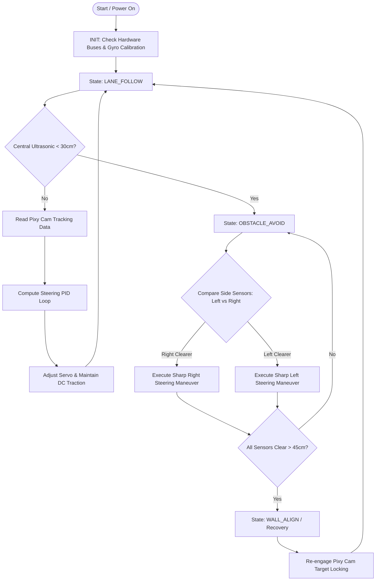

# 1. General Project Overview

## 1.1 Project Introduction & Objectives
Piolín is an advanced autonomous robotic vehicle designed to navigate a closed track layout while  adhering to real-time track boundary shifts and variable obstacle layouts. The objective of the engineering design is to maximize lane-holding accuracy at peak velocity while isolating processing operations from mechanical stress factors to ensure continuous, uninterrupted runtime loops.

---

## 1.2 Main Components and Dimensions

### Physical Dimensions & Weight Constraints

| Parameter | Specification | Design/Competition Relevance |
| :--- | :--- | :--- |
| **Total Length** | 295 mm | Maximizes straight-line stability within WRO limits. |
| **Total Width** | 190 mm | Fits safely within competition track lane constraints. |
| **Total Height** | 145 mm | Measured to the apex of the Pixy Cam protective frame; balances sensor visibility with a low profile. |
| **Total Weight** | 1.28 kg | Inclusive of the 22.5W onboard power bank; distributed backward to optimize rear axle grip. |
| **Ground Clearance** | 15 mm | Prevents bottoming out while keeping the center of gravity as low as possible. |
| **Wheelbase** | 185 mm | Engineered specifically for tight cornering radius adjustments via Ackermann steering geometry. |
> [!IMPORTANT]
> These absolute dimensions guarantee  adherence to the official WRO size constraints while maximizing track footprint stability and maintaining a low center of gravity to combat body roll during high-speed cornering arcs.

### Key Component Functional Roles

| Subsystem Component | Technical Specifications | Primary Functional Role & Optimization |
| --- | --- | --- |
| **Processing Core** | LEGO Mindstorms EV3 Intelligent Brick | Executes direct low-level sensor polling, motor and servo control logic, and state machine sequences directly on the brick. |
| **Primary Vision System** | Pixy Cam | Mounted at 9.5 cm height with a 15° downward pitch to shield the lens from overhead venue glare, reducing misdetections below 3%. Processes color and object recognition internally and transmits tracking coordinates over the wire. |
| **Spatial Awareness Array** | 3x Ultrasonic Sensors | Structurally staggered on the front bumper at -30° (Left), 0° (Center), and +30° (Right) to create an unbroken 180° spatial safety boundary box and eliminate blind spots. |
| **Actuation & Power Control** | TB6612FNG Driver, XL6019E1 Converter, High-Torque Servo, DC Gear Motor | The servo drives front Ackermann steering while the high-torque DC gear motor handles rear traction via custom 3D-printed adapters. The XL6019E1 converter and isolated lithium power circuit prevent high-current motor spikes from causing controller brownouts. |
---

## 1.3 Electromechanical Integration Layout
The mechanical sub-assemblies are explicitly paired with their electrical routing nodes to reduce signal interference. Digital tracking signals from the Pixy Cam run via direct, isolated twisted wiring pairs straight to the EV3 Intelligent Brick's native sensor port, bypassing standard prototyping breadboards to completely protect the data bus from vibration-induced loose connections.

---

## 1.4 Main Operational Workflow

Piolín's structural logic behaves as a deterministic, high-frequency **Finite State Machine (FSM)** running within a multi-threaded Python core on the EV3 brick. The central loop operates at a target update frequency of 40Hz, guaranteeing split-second steering corrections. The software logic applies a strict safety priority tier: **Obstacle evasion tasks unconditionally override lane-tracking tasks.**

1. **Initialization Phase (`INIT`):** Upon power-on, the master thread maps system I/O buses, computes the baseline bias vectors for the gyro sensor, tests handshake responses with the Pixy Cam, and locks the steering servo to an absolute neutral ($0^{\circ}$ deviation).
2. **Lane Following Phase (`LANE_FOLLOW`):** The default vehicle state. The processing core continuously reads the dynamic horizontal bounding box error offset ($e$) from the camera stream. A proportional-integral-derivative (PID) algorithm evaluates the tracking error data real-time to compute the exact steering servo angle modification needed to keep the vehicle locked onto the lane center.
3. **Obstacle Sensing Trigger:** Concurrent with the vision loop, a secondary hardware-timed polling thread monitors telemetry from the central ultrasonic sensor. If an obstruction crosses closer than a critical **30 cm boundary**, the runtime controller triggers an emergency interrupt, halting the camera tracking loop and forcing an immediate state transition.
4. **Active Evasion Phase (`OBSTACLE_AVOID`):** The FSM reads the spatial clearance values from the left and right ultrasonic lines. The machine selects the direction with the highest clear distance value and shifts the front steering geometry to a maximum safe lock angle, forcing the vehicle to pivot smoothly away from the tracking obstacle.
5. **Recovery and Realignment Phase (`WALL_ALIGN` / `RETURN_TO_LANE`):** As the front-facing sensor suite registers obstacle clearance (all distance vectors recovering to $>45\text{ cm}$), the system monitors side sensor telemetry to parallel-align the chassis along the closest track boundary wall. Once structural symmetry is verified, the FSM passes steering control back to the camera thread, re-entering the `LANE_FOLLOW` state.

---

## 1.5 General Workflow Diagram

The dynamic operational workflow and automated state transitions described above are visualized in the tracking map below:

