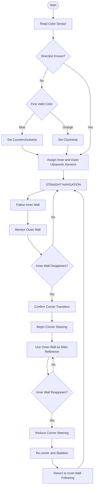

# 1. General Project Overview

## 1.1 Project Introduction & Objectives

**Piolín** is an autonomous robotic vehicle developed by **PiolínTech** for the **WRO Future Engineers 2026** competition.

The robot was designed to complete both competition challenges using a compact LEGO EV3-based control architecture, lateral ultrasonic sensing, floor-color detection, and an independent vision system based on a HuskyLens camera and Arduino Nano.

The main engineering objective is not simply to achieve the highest possible speed, but to obtain a reliable balance between:

- stable autonomous navigation,
- accurate corner handling,
- collision prevention,
- consistent lap counting,
- obstacle recognition,
- mechanical steering stability,
- and repeatable performance under competition conditions.

Piolín uses **Ackermann-style front steering**, allowing the front wheels to change the vehicle's direction while the rear wheels provide traction. This architecture was selected to produce smoother vehicle-like turns than differential or skid steering.

For the **Open Challenge**, navigation is primarily based on two lateral ultrasonic sensors and a floor-facing color sensor. The ultrasonic sensors identify the robot's position relative to the inner and outer track walls, while the color sensor detects the colored floor markings used to determine direction and track progress.

For the **Obstacle Challenge**, the same navigation platform is combined with a **HuskyLens vision sensor**. The HuskyLens is connected to an **Arduino Nano**, which acts as the communication interface between the camera and the EV3 through USB.

The final system was developed through several mechanical and software iterations. Earlier sensor arrangements and navigation strategies were tested and later replaced when they proved less reliable. These iterations are documented separately in the engineering development and testing sections.

---

## 1.2 Main Components and Dimensions

### 1.2.1 Final Physical Dimensions

The following measurements correspond to the final 2026 Piolín configuration.

| Parameter | Final Measurement | Engineering Relevance |
| :--- | :---: | :--- |
| **Total Length** | **210 mm** | Compact longitudinal footprint improves maneuverability inside the track. |
| **Total Width** | **150 mm** | Provides sufficient mechanical stability while leaving clearance from track boundaries. |
| **Total Height** | **230 mm** | Includes the upper electronic and sensing structure of the final robot. |
| **Total Mass** | **0.80476 kg** | Total measured mass of the assembled robot. |
| **Rear Wheel Diameter** | **2.4 in / ~61 mm** | Rear wheels provide the main traction for vehicle movement. |
| **Front Wheel Diameter** | **1.5 in / ~38 mm** | Smaller front wheels form part of the Ackermann steering assembly. |
| **Ultrasonic Sensor Height** | **1.7 in / ~43 mm** | Positions the lateral sensors to observe the track walls during navigation. |

> [!NOTE]
> Only measurements verified on the final robot are presented here. Additional steering geometry dimensions are documented separately when required for mechanical analysis.

---

### 1.2.2 Final Electronic Architecture

| Component | Connection | Primary Role |
| :--- | :--- | :--- |
| **LEGO Mindstorms EV3 Intelligent Brick** | Main controller | Executes navigation logic, reads sensors, processes line detections, and controls the drive and steering motors. |
| **Drive Motor** | EV3 Port A | Provides rear-wheel propulsion. |
| **Steering Motor** | EV3 Port B | Controls the Ackermann steering mechanism. |
| **Right Ultrasonic Sensor** | EV3 Port S2 | Measures distance to the wall on the right side of the robot. |
| **Left Ultrasonic Sensor** | EV3 Port S3 | Measures distance to the wall on the left side of the robot. |
| **Color Sensor** | EV3 Port S4 | Detects the blue and orange floor markings used for direction determination and lap progression. |
| **HuskyLens** | Connected to Arduino Nano | Detects colored obstacles during the Obstacle Challenge. |
| **Arduino Nano** | USB connection to EV3 | Acts as the communication interface between the HuskyLens and EV3. |
| **Front Ultrasonic sensor** | **EV3 Port S1** | Measures distance to the wall on front so that it can park. |

The two ultrasonic sensors are mounted **laterally**, with one facing the left wall and the other facing the right wall.

This arrangement allows Piolín to evaluate both sides of the track instead of depending on a front-facing ultrasonic sensor.

---

## 1.3 Electromechanical Integration Layout

Piolín uses the LEGO EV3 as the central control unit for movement and navigation.

The final hardware architecture is intentionally divided into two functional sensing groups:

### Navigation Sensors

The two lateral ultrasonic sensors and the color sensor connect directly to the EV3.

```text
Left Ultrasonic  ── S3 ──┐
                          │
Right Ultrasonic ── S2 ──┤
                          ├── LEGO EV3
Color Sensor ───── S4 ───┤
                          │
Drive Motor ────── A ─────┤
Steering Motor ─── B ─────┘
````

These components are sufficient for the Open Challenge.

### Vision System

Obstacle recognition is handled separately:

```text
HuskyLens
    │
    │ I²C
    ▼
Arduino Nano
    │
    │ USB
    ▼
LEGO EV3
```

The Arduino Nano allows the HuskyLens to operate without occupying one of the EV3 sensor ports used by the navigation sensors.

This separation is particularly useful because the Open Challenge can operate independently from the camera system, while the Obstacle Challenge can add vision information without changing the basic driving hardware.

---

## 1.4 Main Operational Workflow

Piolín does not use one identical navigation strategy for every section of the track.

Instead, the robot interprets its sensors according to the geometry currently observed.

For the Open Challenge, the navigation sequence is:

1. **Detect Initial Floor Color**
2. **Determine Driving Direction**
3. **Identify the Inner and Outer Walls**
4. **Follow the Inner Wall During Straight Sections**
5. **Detect the Disappearance of the Inner Wall**
6. **Begin the Corner Maneuver**
7. **Use the Outer Wall as the Main Temporary Reference**
8. **Detect the Reappearance of the Inner Wall**
9. **Complete the Corner**
10. **Re-center and Stabilize the Robot**
11. **Return to Inner-Wall Following**

This cycle repeats throughout the three laps.

### Direction Selection

The first valid colored floor marking determines the driving direction.

* **Blue first → counterclockwise**
* **Orange first → clockwise**

Once the direction is known, Piolín can determine which ultrasonic sensor corresponds to the inner wall and which corresponds to the outer wall.

### Straight-Line Navigation

During normal straight sections:

* the **inner ultrasonic sensor** provides the main wall-distance reference;
* the **outer ultrasonic sensor** provides additional geometric information and collision protection.

The objective is to maintain a stable trajectory without continuously producing large steering corrections.

### Corner Detection

A large increase in the inner ultrasonic distance does not automatically mean that the robot has moved too far from the wall.

At a corner, the inner wall physically ends from the sensor's point of view.

The controller therefore interprets the disappearance of the inner wall as a possible corner transition rather than immediately attempting to steer back toward it.

Additional sensor confirmation is used to reduce the possibility of false corner detections caused by isolated ultrasonic readings.

### Corner Navigation

Once a corner is confirmed, Piolín begins steering toward the corner.

During this phase, the inner sensor may temporarily observe open space and becomes less useful as a wall-following reference.

The **outer ultrasonic sensor therefore becomes the primary temporary reference** during the turn.

### Corner Exit and Re-centering

As Piolín progresses through the turn, the inner wall eventually becomes visible again.

Its reappearance indicates that the robot is reaching the next straight section.

The controller then:

1. reduces the corner steering command,
2. transitions back toward the inner-wall reference,
3. re-centers the vehicle,
4. and resumes normal straight-line navigation.

This transition is designed to avoid an abrupt steering change at the end of a corner.

---

## 1.5 Floor-Line Detection and Lap Tracking

The color sensor serves two different purposes.

### Initial Direction Detection

The first valid colored line determines whether the robot will navigate clockwise or counterclockwise.

### Track Progress

After the driving direction has been established, the colored lines are used to track Piolín's progress around the course.

Each of the four corners contains:

* one blue line,
* one orange line.

Therefore, during three complete laps:

$$
4\ corners/lap \times 3\ laps = 12\ corners
$$

Piolín consequently expects to encounter:

$$
12\ blue\ detections
$$

and

$$
12\ orange\ detections
$$

before the three-lap sequence has been completed.

The software includes line-validation logic so that a single physical strip is not repeatedly counted while the sensor remains above it.

---

## 1.6 Challenge-Specific Sensor Usage

Piolín uses the same mechanical platform for both Future Engineers challenges, but the importance of each sensor changes depending on the round.

| System             |        Open Challenge       | Obstacle Challenge |
| :----------------- | :-------------------------: | :----------------: |
| EV3                |              ✅              |          ✅         |
| Ackermann Steering |              ✅              |          ✅         |
| Drive Motor        |              ✅              |          ✅         |
| Left Ultrasonic    |              ✅              |          ✅         |
| Right Ultrasonic   |              ✅              |          ✅         |
| Color Sensor       |              ✅              |          ✅         |
| Arduino Nano       | Not required for navigation |          ✅         |
| HuskyLens          | Not required for navigation |          ✅         |

This modular architecture allows the basic wall-navigation system to remain functional independently of the vision subsystem.

---

## 1.7 General Open Challenge Workflow



---

## 1.8 Design Philosophy

The final Piolín architecture prioritizes **repeatability and sensor interpretation over unnecessary algorithmic complexity**.

Rather than assuming that the same ultrasonic reading always has the same meaning, the controller considers the geometry of the track:

* an inner-wall distance is useful during a straight;
* a suddenly open inner side may indicate a corner;
* the outer wall becomes more useful while turning;
* and the return of the inner wall indicates the transition back into a straight section.

This approach allows the robot to use a relatively small sensor set while assigning each sensor a clear role depending on the current navigation situation.

The objective is a navigation system that is understandable, testable, and reproducible rather than one that depends on undocumented behavior or unverified assumptions.


