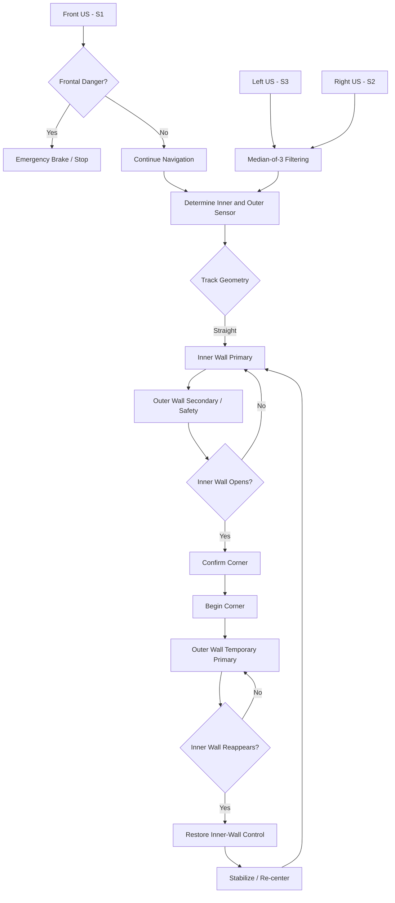

# 4. Ultrasonic Sensor Array Design and Placement

Piolín's final WRO Future Engineers 2026 ultrasonic architecture uses **three LEGO ultrasonic sensors with two clearly separated responsibilities**.

Two ultrasonic sensors are mounted laterally, one on each side of the chassis. These sensors form the main geometric navigation system and allow Piolín to understand its position relative to the inner and outer track walls.

A third ultrasonic sensor is mounted at the front of the robot and connected to the previously available EV3 Sensor Port S1. Unlike the lateral sensors, the front sensor does not participate in normal wall-following calculations. Its responsibility is to provide an independent frontal safety layer capable of stopping the robot when an object or wall becomes dangerously close.

This separation allows Piolín to increase sensor coverage without complicating the mathematical model used for track navigation.

> [!IMPORTANT]
> The final ultrasonic architecture uses:
>
> **Left + Right Ultrasonic Sensors → track geometry and lateral navigation**
>
> **Front Ultrasonic Sensor → emergency frontal collision protection**

---

## 4.1 Final Ultrasonic Sensor Configuration

The three ultrasonic sensors are connected directly to the LEGO EV3.

| Parameter | Front Ultrasonic | Left Ultrasonic | Right Ultrasonic |
| :--- | :---: | :---: | :---: |
| **Sensor Type** | LEGO Ultrasonic Sensor | LEGO Ultrasonic Sensor | LEGO Ultrasonic Sensor |
| **EV3 Port** | **S1** | **S3** | **S2** |
| **Position** | Front of chassis | Left side | Right side |
| **Orientation** | Forward-facing | Lateral, facing left | Lateral, facing right |
| **Primary Measurement** | Distance directly ahead | Distance to left wall | Distance to right wall |
| **Primary Software Role** | Emergency stop | Wall geometry/navigation | Wall geometry/navigation |
| **Normal Steering Authority** | None | Dynamic | Dynamic |

The two lateral sensors are approximately perpendicular to Piolín's longitudinal direction. They are not intentionally angled forward.

This direct lateral orientation makes the measured distance easier to relate to Piolín's actual position between the track boundaries.

The physical arrangement can be represented as:

```text
                        FRONT
                          ↑
                    [ FRONT US ]
                          │
                          │

          LEFT US ←  [ PIOLÍN ]  → RIGHT US

                          │
                          ↓
                         REAR
```

The front sensor observes the area directly ahead, while the lateral sensors observe opposite track boundaries.

---

## 4.2 Relevant Robot Geometry

Piolín's final chassis measures approximately **210 mm long, 150 mm wide, and 230 mm high**, with a measured mass of approximately **0.80476 kg**.

The lateral ultrasonic sensors are mounted approximately **43 mm above the competition surface**. Their position was selected so that they can observe the track walls while remaining mechanically integrated into the chassis.

| Physical Parameter | Final Piolín Value |
| :--- | :---: |
| **Robot Length** | **210 mm** |
| **Robot Width** | **150 mm** |
| **Robot Height** | **230 mm** |
| **Robot Mass** | **0.80476 kg** |
| **Lateral US Height Above Floor** | **~43 mm / 1.7 in** |
| **Number of Ultrasonic Sensors** | **3** |
| **Lateral Sensor Orientation** | **Direct lateral** |
| **Front Sensor Orientation** | **Forward-facing** |

The height of the front ultrasonic sensor is not included as a final measured value because it has not yet been independently measured.

---

## 4.3 Separation Between Navigation and Safety Sensors

Although Piolín now uses three ultrasonic sensors, only the **left and right sensors participate in normal wall-navigation geometry**.

The lateral sensors answer the question:

> **Where is Piolín relative to the track walls?**

The front sensor answers a different question:

> **Is something dangerously close directly ahead?**

Keeping these responsibilities separate prevents the front sensor from continuously competing with the lateral navigation controller.

For example, a front wall visible during a corner should not automatically modify Piolín's lateral wall-following equation. Instead, the front sensor only takes control when the measured distance indicates an immediate collision risk.

This creates a clear division between **navigation information** and **emergency safety information**.

---

## 4.4 Dynamic Inner and Outer Sensor Assignment

The lateral ultrasonic sensors remain physically identified as left and right, but their navigation role changes depending on the driving direction.

When Piolín travels counterclockwise, the left side corresponds to the inner wall. When Piolín travels clockwise, the right side becomes the inner wall.

| Driving Direction | Inner Wall | Inner Ultrasonic | Outer Wall | Outer Ultrasonic |
| :--- | :--- | :---: | :--- | :---: |
| **Counterclockwise** | Left | **S3 / Left US** | Right | **S2 / Right US** |
| **Clockwise** | Right | **S2 / Right US** | Left | **S3 / Left US** |

For counterclockwise navigation:

```text
LEFT US  = INNER
RIGHT US = OUTER
```

For clockwise navigation:

```text
RIGHT US = INNER
LEFT US  = OUTER
```

The front ultrasonic sensor on S1 is never classified as inner or outer. Its role remains identical regardless of direction.

---

## 4.5 Straight-Track Geometric Model

During a normal straight section, the two lateral ultrasonic sensors observe approximately parallel track walls.

The nominal track corridor width used during Piolín's mathematical development is:

```text
W = 1000 mm
```

The main inner-wall navigation reference used during development is:

```text
TARGETINNER = 270 mm
```

An approximate development-model distance from the center of Piolín to each lateral sensor was:

```text
OFFSET = 75 mm
```

Using this simplified model, the expected sum of the two lateral sensor measurements is:

```text
CREF = W - (2 × OFFSET)

CREF = 1000 - (2 × 75)

CREF = 850 mm
```

Therefore:

```text
CREF ≈ 850 mm
```

This value is used as a geometric reference rather than an exact requirement. Real ultrasonic measurements can vary because of robot heading, sensor alignment, reflection angle, track geometry, and normal measurement noise.

| Geometric Parameter | Development Value | Purpose |
| :--- | :---: | :--- |
| **Corridor Width W** | **1000 mm** | Straight-track reference |
| **Inner-Wall Target TARGETINNER** | **270 mm** | Main straight-navigation reference |
| **Approximate Sensor Offset OFFSET** | **~75 mm** | Development geometric model |
| **Expected Distance Sum CREF** | **~850 mm** | Straight-geometry consistency |
| **Lateral Sensor Height** | **~43 mm** | Final mounting measurement |

> [!NOTE]
> The approximately 75 mm sensor offset is retained as a development-model value and is not presented as a newly re-measured final mechanical dimension.

---

## 4.6 Straight-Section Sensor Geometry

During a straight section, the geometry can be represented as:

```text
OUTER WALL
────────────────────────────────────────

             ↑ DOUTER

           [ PIOLÍN ]

             ↓ DINNER

────────────────────────────────────────
INNER WALL
```

`DINNER` represents the distance measured by whichever lateral sensor is currently assigned to the inner wall.

`DOUTER` represents the measurement from the opposite lateral sensor.

The inner sensor provides the primary trajectory reference while the outer sensor supplies additional geometric information and wall-safety protection.

---

## 4.7 Estimating Lateral Position

When both lateral sensors observe valid parallel walls, their measurements can be combined to estimate Piolín's lateral position.

The model uses:

```text
W      = corridor width
DINNER = inner ultrasonic distance
DOUTER = outer ultrasonic distance
X      = estimated robot-center position
```

The position estimate is:

```text
X = (W + DINNER - DOUTER) / 2
```

For Piolín's development corridor:

```text
X = (1000 + DINNER - DOUTER) / 2
```

One recorded measurement produced:

```text
DINNER = 429.8 mm
DOUTER = 433.0 mm
```

Substituting these values:

```text
X = (1000 + 429.8 - 433.0) / 2

X = 498.4 mm
```

The geometric center of a 1000 mm corridor is:

```text
500 mm
```

The difference between the ultrasonic position estimate and the theoretical center was therefore:

```text
500 - 498.4 = 1.6 mm
```

This experiment showed that the two lateral sensors can provide useful information about Piolín's lateral position when both walls are visible and approximately parallel.

---

## 4.8 Recorded Ultrasonic Measurements

Several measurements were collected with Piolín positioned at different lateral locations between the track walls.

| Test Position | DINNER | DOUTER | DINNER + DOUTER | Estimated X | Interpretation |
| :--- | ---: | ---: | ---: | ---: | :--- |
| **Near Inner-Wall Trajectory** | **229 mm** | **595 mm** | **824 mm** | **317 mm** | Piolín is relatively close to the inner side |
| **Middle of Corridor** | **429.8 mm** | **433.0 mm** | **862.8 mm** | **498.4 mm** | Piolín is almost exactly at the geometric center |
| **Toward Outer Wall** | **699.5 mm** | **227 mm** | **926.5 mm** | **736.3 mm** | Piolín is strongly displaced toward the outer side |

The middle-position test is particularly useful because the left and right measurements were nearly equal and the mathematical estimate placed Piolín extremely close to the theoretical center of the track.

These measurements demonstrated that the difference between the two lateral ultrasonic readings contains useful information about the robot's position.

---

## 4.9 Geometric Consistency

The two-sensor position equation is most reliable when Piolín is approximately parallel to two valid track walls.

A geometric consistency value can therefore be calculated using:

```text
G = ABS((DINNER + DOUTER) - CREF)
```

Using:

```text
CREF = 850 mm
```

the equation becomes:

```text
G = ABS((DINNER + DOUTER) - 850)
```

A relatively small value of `G` means that the observed geometry resembles the expected straight corridor.

A larger value may indicate that Piolín has rotated, that one wall is disappearing, that the robot is approaching a corner, or that one ultrasonic measurement is abnormal.

| Test Condition | DINNER + DOUTER | G | Interpretation |
| :--- | ---: | ---: | :--- |
| **Near Inner-Wall Trajectory** | **824 mm** | **26 mm** | Strong straight-geometry agreement |
| **Middle of Corridor** | **862.8 mm** | **12.8 mm** | Very strong straight-geometry agreement |
| **Toward Outer Wall** | **926.5 mm** | **76.5 mm** | Larger geometric difference |
| **Corner / Inner Wall Open** | Large deviation expected | Large | Straight model becomes unreliable |

The purpose of `G` is not to create one perfect threshold. Its main purpose is to show when the assumptions behind the straight-track model are becoming less reliable.

---

## 4.10 Why Corners Require Different Sensor Interpretation

One of the most important findings during Piolín's development was that a large ultrasonic distance does not always mean the robot moved away from a wall.

During a straight section, an increasing `DINNER` value can indicate lateral displacement.

At a corner, however, the inner wall physically ends. The inner sensor begins looking toward open space and its measurement can increase dramatically even if Piolín's lateral position has not suddenly changed.

During a straight:

```text
──────────────────────────── INNER WALL

              ↑
           DINNER
              │
          [ PIOLÍN ]
```

At corner entry:

```text
INNER WALL
──────────────────────┐
                      │
                      │
              [PIOLÍN]│
                   ↗  │
```

In the second situation, the increase in `DINNER` represents a **change in track geometry**, not simply a wall-following error.

For this reason, the final navigation concept does not blindly apply the straight-wall target throughout the entire corner.

---

## 4.11 Final Ultrasonic Navigation Strategy

The final Open Challenge concept combines the useful two-sensor geometry from Piolín's earlier mathematical tests with the wall-transition behavior learned from later corner experiments.

```text
                    STRAIGHT
                       ↓
          Inner US = Primary Reference
          Outer US = Secondary Reference
                       ↓
              Monitor Geometry
                       ↓
          Inner Wall Disappears?
                       ↓
                   Confirm
                       ↓
                    CORNER
                       ↓
      Outer US = Temporary Main Reference
                       ↓
          Inner Wall Reappears?
                       ↓
                   Confirm
                       ↓
           Reduce Corner Steering
                       ↓
            Stabilize / Re-center
                       ↓
            Follow Inner Wall Again
```

During a straight section, the inner sensor controls the normal trajectory while the outer sensor provides additional geometric and safety information.

When the inner wall disappears, the software interprets the change as a possible corner rather than immediately producing a large steering correction.

During the corner, the outer wall becomes the more useful physical reference. Once the next inner wall becomes visible again, the controller can progressively restore normal inner-wall navigation.

---

## 4.12 Straight Navigation

During normal straight navigation, Piolín attempts to maintain approximately:

```text
TARGETINNER = 270 mm
```

from the inner wall.

The navigation logic uses a progressive steering response. Small wall-distance errors should result in small corrections, while larger errors can produce stronger steering commands.

The outer sensor remains active but does not continuously fight the inner-wall controller. Instead, it provides secondary geometric information and protection against excessive movement toward the opposite boundary.

This separation of responsibilities reduces unnecessary steering oscillation.

---

## 4.13 Corner Entry Confirmation

A complete corner maneuver should not be triggered from one abnormal ultrasonic reading.

Ultrasonic sensors can occasionally return unexpected values because of reflection angle, track geometry, partial loss of the reflecting surface, or acoustic behavior.

Piolín therefore uses the principle:

```text
Normal straight geometry
          ↓
Inner wall appears open
          ↓
Condition remains present
          ↓
Multiple consistent readings
          ↓
Corner confirmed
```

One experimental controller used **three consecutive readings** to confirm both corner entry and corner exit.

This is different from filtering. Filtering attempts to reject a single abnormal measurement. Confirmation determines whether a new condition has remained present long enough to represent a real change in track geometry.

---

## 4.14 Corner Navigation

During the turn, the normal relationship between `DINNER`, `DOUTER`, and the straight corridor model becomes less reliable.

The inner sensor may temporarily observe open space, part of a rounded corner, or the beginning of the next wall.

The outer wall normally remains visible for a larger portion of the turn.

```text
             OUTER WALL
              ╭────────────
             ╱
            ╱  ← OUTER US
           ╱
      [ PIOLÍN ]
            ↗

Inner US → changing/open geometry
```

For this reason, the final concept gives the outer sensor greater navigation authority during the corner.

The robot therefore transitions from:

```text
INNER WALL CONTROL
```

to:

```text
OUTER WALL CONTROL
```

and later returns to:

```text
INNER WALL CONTROL
```

when the next straight section becomes visible.

---

## 4.15 Inner-Wall Reacquisition

As Piolín approaches the end of a corner, the next inner wall enters the lateral sensor's field of view.

A stable return of the inner-wall measurement indicates that the robot is transitioning toward the next straight section.

The steering should not immediately return to zero as soon as one inner-wall measurement appears. A sudden steering change can create overshoot or cause Piolín to leave the corner pointing toward the opposite wall.

Instead, the controller progressively reduces the corner steering, restores the inner sensor as the main reference, stabilizes the vehicle, and then resumes normal wall following.

---

## 4.16 Re-centering After the Corner

One experimental strategy compared the two lateral distances using:

```text
CENTERDIFF = LEFTDISTANCE - RIGHTDISTANCE
```

A development version accepted Piolín as sufficiently balanced when the difference remained within approximately:

```text
±150 mm
```

for multiple consecutive control cycles.

| Centering Parameter | Development-Test Value |
| :--- | :---: |
| **Comparison** | **LEFTDISTANCE - RIGHTDISTANCE** |
| **Accepted Difference** | **±150 mm** |
| **Confirmation Requirement** | **8 consecutive loops** |
| **Corrective Steering Target** | **8 motor-target degrees** |

These values are retained as development evidence rather than being treated as permanent final parameters.

The important concept is that Piolín should demonstrate a stable position for several consecutive cycles before leaving the centering phase.

---

## 4.17 Front Ultrasonic Emergency Safety Layer

The front-facing ultrasonic sensor is connected to **EV3 Port S1**.

This sensor has a completely different responsibility from the two lateral sensors. It does not calculate track position and does not participate in normal corner geometry.

Instead, it continuously monitors the area directly ahead of Piolín.

If an object or wall becomes dangerously close, the front sensor can interrupt normal navigation and stop the propulsion motor.

The safety hierarchy is:

```text
FRONT COLLISION SAFETY
          ↓
LATERAL WALL SAFETY
          ↓
CORNER NAVIGATION
          ↓
NORMAL WALL FOLLOWING
```

The front sensor therefore has higher safety priority than normal steering behavior.

If Piolín is following a wall or navigating a corner but the front sensor detects an immediate collision risk, propulsion can be stopped regardless of the current navigation state.

The front sensor does **not** continuously modify the steering target. This prevents it from competing with the lateral navigation controller.

---

## 4.18 Initial Front Safety Parameters

The initial safety implementation uses a short stopping distance combined with confirmation from more than one measurement.

| Front Safety Parameter | Initial Value |
| :--- | :---: |
| **Emergency Stop Distance** | **100 mm / 10 cm** |
| **Required Close Readings** | **2 consecutive readings** |
| **Reaction** | **Stop drive motor using brake** |
| **Steering Control** | **No normal steering authority** |
| **Software Priority** | **Highest safety priority** |

The initial logic can be represented as:

```text
Front distance > 100 mm
          ↓
Continue normal navigation
```

and:

```text
Front distance <= 100 mm
          ↓
Confirm second close reading
          ↓
Emergency stop
```

The 100 mm value is an initial tuning value and should be verified experimentally on the final robot.

A higher threshold may be required if braking tests show that Piolín needs additional stopping distance at competition speed.

> [!NOTE]
> The front sensor is designed to **reduce the probability of a frontal collision**. It should not be documented as guaranteeing that a collision can never occur.

---

## 4.19 Lateral Ultrasonic Filtering

The left and right ultrasonic sensors use a short **median-of-three filter**.

Three consecutive measurements are stored:

```text
READING1
READING2
READING3
```

The filtered value is:

```text
FILTERED = MEDIAN(READING1, READING2, READING3)
```

This allows an isolated abnormal reading to be rejected without producing the long delay associated with a large moving-average filter.

| Filtering Parameter | Tested Value | Purpose |
| :--- | :---: | :--- |
| **Filter Type** | **Median** | Reject isolated spikes |
| **Samples per Filter** | **3** | Maintain fast response |
| **Left Buffer** | **3 readings** | Left sensor filtering |
| **Right Buffer** | **3 readings** | Right sensor filtering |
| **Minimum Software Clamp** | **20 mm** | Prevent unrealistically small values |
| **Maximum Experimental Clamp** | **2550 mm** | Limit extremely large/open readings |
| **Corner Entry Confirmation** | **3 readings** | Reduce false corner entry |
| **Corner Exit Confirmation** | **3 readings** | Reduce premature exit |

The 2550 mm value represents a software limit used during development. It is not presented as the measured physical maximum range of the LEGO ultrasonic sensor.

---

## 4.20 Median Filter Example

Consider the following three measurements:

| Sample | Reading |
| :--- | ---: |
| **READING1** | **269 mm** |
| **READING2** | **271 mm** |
| **READING3** | **1120 mm** |

A normal arithmetic average would produce:

```text
(269 + 271 + 1120) / 3 = 553.3 mm
```

This would incorrectly suggest that the robot had moved much farther from the wall.

The median filter produces:

```text
MEDIAN(269, 271, 1120) = 271 mm
```

The isolated 1120 mm measurement therefore does not create a large steering correction.

A much larger averaging window could produce even smoother measurements, but it would also create additional delay.

Because Piolín needs to react quickly when the inner wall disappears at a corner, a short median filter provides a useful compromise between stability and response speed.

---

## 4.21 Front Sensor Validation

The front sensor uses a different validation strategy because its responsibility is emergency stopping.

Applying a large smoothing filter to the front sensor could delay an important stop.

For that reason, the initial design uses a small number of consecutive close readings rather than a long average.

| Sensor Group | Validation Strategy | Reason |
| :--- | :--- | :--- |
| **Left + Right US** | Median of 3 | Stable geometric navigation |
| **Front US** | 2 consecutive close readings | Fast emergency response |

This means the three sensors use different processing methods because they solve different problems.

---

## 4.22 Experimental Corner Parameters

One experimental navigation version used large inner-wall distances to determine when the wall had disappeared and when it had become visible again.

| Parameter | Experimental Value | Purpose |
| :--- | :---: | :--- |
| **Inner-Wall Open Threshold** | **2400 mm** | Experimental corner-entry detection |
| **Inner-Wall Return Threshold** | **2300 mm** | Experimental corner-exit detection |
| **Entry Confirmation** | **3 readings** | Avoid false corner entry |
| **Exit Confirmation** | **3 readings** | Avoid premature corner exit |

> [!CAUTION]
> These values belong to an experimental development controller and are preserved as engineering evidence.
>
> They are not necessarily the final thresholds used by the final gyro-free navigation program.

The important engineering result was not the exact numerical value. The important result was that the disappearance and reappearance of the inner wall could be used to identify different phases of a corner.

---

## 4.23 Ultrasonic Calibration Process

The ultrasonic sensors are calibrated using the actual Piolín chassis and track geometry rather than relying only on theoretical sensor specifications.

For the lateral sensors, the first calibration stage places Piolín next to a flat wall at known physical distances and compares the ultrasonic measurements against the real distance. This identifies normal measurement variation and isolated spikes.

The second stage places Piolín at different lateral positions between two track boundaries. Both ultrasonic measurements are recorded and compared with the mathematical position model.

The third stage focuses on corner entry. Piolín approaches a corner slowly while the inner and outer sensor measurements are observed. This allows the characteristic increase in inner-wall distance to be identified.

The fourth stage studies corner exit and determines when the new inner wall becomes sufficiently stable to restore normal navigation.

The front sensor requires a separate calibration procedure. Piolín should be driven toward a safe test obstacle at normal competition speed while the actual braking distance is measured. The emergency threshold can then be adjusted so that the robot stops with a useful safety margin.

---

## 4.24 Navigation Responsibility by Track Phase

The three ultrasonic sensors do not have equal authority during every navigation phase.

| Navigation Phase | Inner US | Outer US | Front US |
| :--- | :--- | :--- | :--- |
| **Straight** | **Primary** | Secondary | Emergency monitoring |
| **Straight Safety** | Primary | Outer-wall safety | **Frontal safety** |
| **Corner Detection** | **Primary indicator** | Geometry confirmation | Emergency monitoring |
| **Corner Entry** | Reduced authority | Increasing authority | Emergency monitoring |
| **Corner** | Reacquisition monitoring | **Temporary primary** | Emergency monitoring |
| **Corner Exit** | Increasing authority | Secondary | Emergency monitoring |
| **Stabilization** | **Primary** | Secondary | Emergency monitoring |
| **Re-centering** | Used | Used | Emergency monitoring |
| **Next Straight** | **Primary** | Secondary / safety | Emergency monitoring |

The front sensor never becomes an inner or outer reference.

Its safety authority remains independent from the current navigation phase.

---

## 4.25 Layered Collision Protection

Piolín now uses two different forms of ultrasonic collision protection.

The lateral sensors protect the robot from excessive movement toward the track boundaries. Even when one lateral sensor is not the primary navigation reference, it can still provide information indicating that Piolín is approaching a side wall dangerously closely.

The front sensor provides an independent second layer. Instead of correcting lateral position, it monitors for a direct frontal collision and can stop propulsion.

```text
             ULTRASONIC SAFETY
                    │
          ┌─────────┴─────────┐
          │                   │
    LATERAL SAFETY        FRONT SAFETY
          │                   │
   Avoid side-wall       Emergency stop
      collision          before frontal impact
```

This separation prevents one sensor from being responsible for every possible type of collision.

---

## 4.26 Acoustic Reflection and Cross-Talk

Ultrasonic sensors determine distance by emitting acoustic pulses and measuring the returning echo.

Measurements can occasionally be affected by wall angle, rounded corners, nearby structures, track seams, or other reflecting surfaces.

Because Piolín's lateral sensors face opposite directions and the front sensor faces forward, the sensors observe substantially different regions. This reduces the likelihood of direct acoustic interference compared with placing several sensors toward the same area.

However, the design does not assume that cross-talk is impossible.

Filtering, short confirmation windows, and separate sensor responsibilities are used to reduce the effect of isolated abnormal measurements.

> [!IMPORTANT]
> Piolín's documentation does not claim that ultrasonic noise or cross-talk is completely eliminated. The architecture is designed to reduce its probability and limit its effect on navigation.

---

## 4.27 Failure Mode Analysis

| Failure Mode | Sensor Behavior | Navigation Risk | Mitigation |
| :--- | :--- | :--- | :--- |
| **Single lateral spike** | Sudden large or small reading | False steering correction | Median-of-three filtering |
| **Inner wall disappears at corner** | Inner distance increases greatly | Robot may steer toward missing wall | Interpret as geometry change |
| **False corner opening** | Temporary large reading | Unnecessary corner maneuver | Multiple-reading confirmation |
| **Premature wall reacquisition** | Short inner reading during turn | Corner ends too early | Exit confirmation |
| **Outer wall too close** | Outer distance decreases | Side collision | Lateral safety correction |
| **Unexpected frontal obstacle** | Front distance becomes very small | Frontal collision | Emergency motor stop |
| **Single false front reading** | One unexpectedly short value | Unnecessary stop | Two-reading confirmation |
| **Robot rotated relative to walls** | Two-US geometry becomes inconsistent | Incorrect position estimate | Reduce trust in straight model |
| **Rounded-corner reflection** | Reading fluctuates | Steering instability | Filtering and sensor-role transition |
| **Sensor mounting changes** | Persistent measurement bias | Incorrect wall reference | Mechanical inspection and recalibration |
| **Acoustic interference** | Isolated abnormal measurement | Incorrect correction or stop | Orientation separation and confirmation |

This analysis treats incorrect sensor readings as an engineering possibility instead of assuming that every measurement is always valid.

---

## 4.28 Why the Diagonal Arrangement Was Replaced

Earlier Piolín prototypes experimented with angled ultrasonic sensors because a forward inclination could observe parts of the track before the chassis physically reached them.

However, diagonal sensing also changed the mathematical meaning of the measured distance.

When a sensor is angled relative to a wall, the measured acoustic path is no longer equivalent to the perpendicular lateral distance.

The reading becomes more dependent on robot heading, wall orientation, sensor angle, and corner geometry.

Because the final navigation strategy relies heavily on understanding Piolín's lateral distance from each track boundary, direct lateral sensing provided a simpler and more useful relationship between measurement and physical position.

The diagonal arrangement was therefore replaced by direct lateral mounting.

---

## 4.29 Why the Front Ultrasonic Sensor Was Added

Earlier versions of the final architecture relied primarily on the two lateral ultrasonic sensors for navigation and wall protection.

These sensors provide strong information about the left and right sides of the robot, but they cannot reliably observe every object located directly ahead.

This created a specific unprotected situation. If the navigation controller produced an incorrect trajectory toward a frontal wall or obstacle, the lateral sensors might not detect the problem soon enough.

The previously available EV3 Sensor Port S1 was therefore assigned to a third ultrasonic sensor facing forward.

Importantly, the new sensor does not replace the two-sensor mathematical navigation model. It adds a separate layer of redundancy.

The engineering principle is:

> **The lateral sensors attempt to prevent Piolín from entering a dangerous trajectory, while the front sensor provides a final emergency response if a frontal collision is still developing.**

This increases sensor coverage without requiring the normal wall-following equations to be redesigned.

---

## 4.30 Evolution of the Ultrasonic Architecture

Piolín's final three-sensor system is the result of several navigation experiments.

| Development Stage | Main Idea | Engineering Result |
| :--- | :--- | :--- |
| **Continuous Two-US Geometry** | Combine both lateral wall distances | Demonstrated useful lateral-position estimation in straights |
| **Geometric Consistency Model** | Detect when straight equations become less reliable | Improved interpretation near corners |
| **Gyro-Assisted Experiment** | Inner wall in straights, outer wall in corners | Demonstrated the value of changing wall reference |
| **Gyro-Free Hybrid Concept** | Inner → outer → inner wall transition | Removed dependency on gyro heading |
| **Front Safety Addition** | Add forward S1 ultrasonic independent from navigation | Added frontal emergency protection |
| **Final Architecture** | 2 lateral navigation sensors + 1 front safety sensor | Geometry-aware navigation with independent collision safety |

The two-ultrasonic mathematical tests demonstrated that the robot could estimate its position well during straight geometry.

The largest limitation appeared at corners, where the inner wall disappeared and the mathematical assumptions changed.

Later tests demonstrated that the outer wall could become the more useful temporary reference during the turn.

The final concept retains this transition while removing the gyro dependency.

The front ultrasonic sensor was then added as a separate safety improvement rather than as another navigation variable.

---

## 4.31 Final Navigation and Safety Flow



The important feature of this architecture is that frontal safety is evaluated independently from the lateral navigation process.

---

## 4.32 Final Reproducibility Summary

Another team should be able to reproduce the ultrasonic architecture from the following information.

| Parameter | Final Configuration |
| :--- | :--- |
| **Number of Ultrasonic Sensors** | **3** |
| **Front Sensor Port** | **S1** |
| **Right Sensor Port** | **S2** |
| **Left Sensor Port** | **S3** |
| **Front Orientation** | **Forward-facing** |
| **Lateral Orientation** | **Direct lateral** |
| **Lateral Sensor Height** | **~43 mm** |
| **Primary Straight Reference** | **Inner lateral US** |
| **Primary Corner Reference** | **Outer lateral US** |
| **Front Sensor Role** | **Emergency stop** |
| **Lateral Filtering** | **Median of 3** |
| **Initial Front Confirmation** | **2 close readings** |
| **Initial Front Stop Distance** | **100 mm** |
| **Direction Assignment** | Dynamic from initial floor color |

The final EV3 sensor-port map is:

```text
LEGO EV3
│
├── S1 → Front Ultrasonic Sensor
├── S2 → Right Ultrasonic Sensor
├── S3 → Left Ultrasonic Sensor
└── S4 → Color Sensor
```

The physical ultrasonic arrangement is:

```text
                        FRONT
                          ↑
                    [ FRONT US ]
                          │

          LEFT US ←  [ PIOLÍN ]  → RIGHT US

                          │
                          ↓
                         REAR
```

---

## 4.33 Engineering Conclusion

Piolín's final ultrasonic architecture combines **two navigation sensors with one independent safety sensor**.

The lateral sensors are responsible for understanding the geometry of the track. During straight navigation, the inner wall provides the primary trajectory reference while the outer wall provides secondary geometric information and collision protection.

As Piolín approaches a corner, the disappearance of the inner wall changes the meaning of the ultrasonic measurement. Instead of treating the increased distance as a normal wall-following error, the controller interprets it as a possible change in track geometry.

During the corner, the outer wall becomes the more useful temporary navigation reference. Once the next inner wall becomes visible and stable again, the controller progressively returns to normal inner-wall navigation and re-centers the robot.

The third front-facing ultrasonic sensor solves a different problem. Because the two lateral sensors cannot reliably observe the entire area directly ahead of Piolín, the S1 front sensor provides an independent emergency stopping layer. It does not continuously modify steering, which prevents it from interfering with the mathematical wall-navigation system.

The resulting responsibility structure is:

> **Front US → emergency frontal collision protection**

> **Left + Right US → track geometry, corner interpretation, and lateral collision protection**

This architecture also reflects an important engineering lesson learned throughout Piolín's development:

> **Adding a sensor is most useful when it solves a specific missing problem rather than when every sensor attempts to control the same navigation variable.**

The final three-sensor configuration therefore increases physical coverage and safety while preserving the simpler two-sensor geometric model that Piolín uses for normal navigation.
