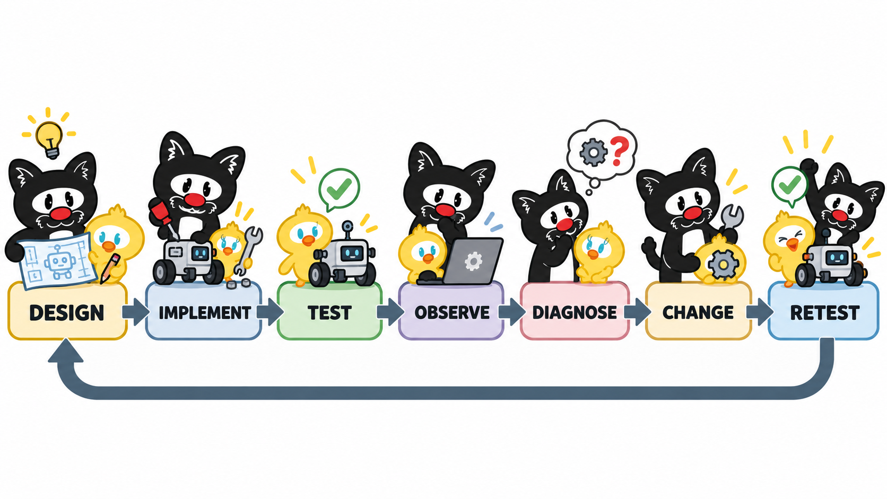
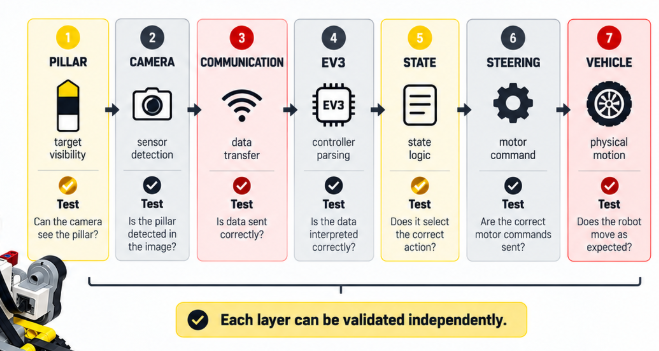

# 2. Legacy Prototype Testing and Analysis

> [!WARNING]
> This document describes **historical Piolín prototype testing, experimental control strategies, failed iterations, and engineering analysis** carried out during WRO Future Engineers 2026 development.
>
> The configurations, thresholds, sensor combinations, and software behaviors described here are not necessarily part of the current competition robot.
>
> Current hardware and software documentation always takes priority over this legacy analysis.

Piolín did not reach its current architecture through a single successful design. The robot evolved through repeated cycles of construction, programming, track testing, failure observation, modification, and retesting.

Many of the most useful engineering conclusions came from situations where the physical robot behaved differently from what the software designer expected.

Examples included:

```text
correct color detected
but wrong physical passing side

correct steering command
but unstable vehicle trajectory

pillar visible to camera
but EV3 did not react

robot completed one corner
but software counted two

same code
but different behavior from different starting positions

camera lost target
before obstacle had actually been passed
```

These observations gradually changed the development process from:

```text
change code
→ run robot
→ visually judge result
```

toward:

```text
identify subsystem
      ↓
define expected behavior
      ↓
change one variable
      ↓
test
      ↓
observe
      ↓
classify failure
      ↓
retain or revert
```

The purpose of this document is to preserve that testing history and the engineering reasoning produced by it.

---

# 2.1 Why Prototype Testing Was Necessary

Piolín is an Ackermann-steered autonomous vehicle operating in a constrained track environment.

Its behavior depends on several interacting systems:

```text
mechanical steering

rear propulsion

sensor geometry

camera perception

wall sensing

floor-color detection

software state

vehicle speed

battery condition
```

A parameter that appears reasonable mathematically can still behave incorrectly when these systems interact physically.

For example:

```text
Motor B command
      ↓
steering linkage
      ↓
front-wheel angle
      ↓
vehicle moves
      ↓
actual turning trajectory
```

The software does not directly command the final trajectory.

It commands actuators that operate through a mechanical vehicle.

Testing was therefore required to verify whether the physical robot matched the assumptions made in software.

---

# 2.2 Core Testing Loop

A useful description of Piolín's development loop is:

```text
DESIGN
   ↓
IMPLEMENT
   ↓
TEST
   ↓
OBSERVE
   ↓
DIAGNOSE
   ↓
CHANGE
   ↓
RETEST
```

<div align="center">



<br>

<sub><b>Figure L2.1.</b> Piolín prototype development followed repeated design, implementation, testing, diagnosis, modification, and retesting cycles.</sub>

</div>

The quality of the final decision depended heavily on the **diagnosis** stage.

For example:

```text
steering failure
misdiagnosed as
camera failure
```

could lead to unnecessary vision changes.

Likewise:

```text
electrical connection failure
misdiagnosed as
navigation failure
```

could make software more complicated without correcting the real cause.

The goal eventually became:

> **Identify the failing layer before modifying the system.**

---

# 2.3 Failure Classification

Over time, Piolín's failures could be grouped into several categories.

| Category | Typical Examples |
| :--- | :--- |
| Perception | False camera detection, missed target, unstable recognition |
| Geometry | Wall distance, FOV, sensor orientation, starting position |
| State logic | Double counting, stale target lock, incorrect transition |
| Control | Zig-zag, overcorrection, weak steering, late response |
| Mechanical | Steering play, wheel alignment, drivetrain friction |
| Electrical / communication | Wrong port, missing sensor, Nano/USB communication |
| Integration | Several controllers requesting conflicting steering |
| Methodology | Too many simultaneous changes between tests |

One visible symptom could have several possible causes.

For example:

```text
robot hits RED pillar
```

could result from:

```text
RED not detected

RED detected too late

EV3 never received detection

steering sign inverted

wall controller overrode vision

steering mechanically weak

vehicle speed too high
```

This is why visible behavior alone was not enough to identify the failing subsystem.

---

# 2.4 Layered Testing

One of the most useful development improvements was separating the system into layers.

For the historical HuskyLens architecture:

```text
PILLAR
   ↓
CAMERA
   ↓
COMMUNICATION
   ↓
EV3
   ↓
STATE
   ↓
STEERING
   ↓
VEHICLE
```

<div align="center">



<br>

<sub><b>Figure L2.2.</b> Piolín testing separated the perception, communication, EV3 processing, state, steering, and physical vehicle layers so each could be verified independently.</sub>

</div>

A complete diagnostic process could therefore ask:

```text
Does the camera see the target?

Does the camera identify the correct target?

Does the communication layer transfer that data?

Does the EV3 receive it?

Does the EV3 parse it correctly?

Does the state machine select the correct behavior?

Does Motor B receive the correct steering request?

Does the physical vehicle steer correctly?
```

This prevented a correct camera from being blamed for a downstream control error.

---

# 2.5 Static Testing Was Not Enough

Several sensing systems behaved well while Piolín was stationary.

However, stationary tests remove many effects that appear during autonomous driving.

While moving:

```text
camera orientation changes

background changes

lighting changes

pillar moves across image

reaction distance decreases

ultrasonic geometry changes

vehicle heading changes
```

Therefore:

```text
works while stationary
```

did not imply:

```text
works during complete autonomous motion
```

Static tests were useful for confirming basic functionality.

Dynamic track testing was required for validating integration.

---

# 2.6 Historical HuskyLens Testing

The HuskyLens stage demonstrated that Piolín could distinguish:

```text
ID 1 = GREEN

ID 2 = RED
```

but dynamic tests exposed several additional problems:

```text
false detections

intermittent Green recognition

lighting sensitivity

objects outside the track being recognized

target leaving field of view

multiple visible blocks

target lock remaining active too long
```

These observations showed that:

```text
correct classification
```

was only one part of autonomous obstacle perception.

Piolín also needed:

```text
relevance

continuity

state memory

physical pass confirmation

controller arbitration
```

---

# 2.7 False Detection Testing

False detections were tested in realistic track environments rather than only with isolated targets.

Potential confusing visual regions included:

```text
track materials

reflections

shadows

colored external objects

background structures
```

This produced a filtering trade-off:

| Filter Behavior | Possible Result |
| :--- | :--- |
| Too permissive | Irrelevant objects accepted |
| Moderate | Better rejection of false targets |
| Too restrictive | Real pillars rejected |

The conclusion was:

```text
more thresholds
≠
automatically better perception
```

The filters had to reject irrelevant detections without making the valid target impossible to acquire.

---

# 2.8 Green vs. Red Testing

During HuskyLens development, Green was often observed to be less consistent than Red.

The two colors therefore had to be tested independently.

A useful qualitative test sequence was:

```text
RED
→ stationary
→ moving
→ different angle
→ different distance


GREEN
→ stationary
→ moving
→ different angle
→ different distance
```

This demonstrated that the statement:

```text
camera detects colors
```

was too general.

Each target class had its own behavior under real operating conditions.

---

# 2.9 Intermittent Detection

A physical target could remain visually present while software received:

```text
DETECTED

NOT DETECTED

DETECTED

NOT DETECTED
```

A controller responding directly to every frame could repeatedly enter and exit obstacle mode.

This created unstable steering.

Temporary memory helped:

```text
target confirmed
      ↓
remember target
      ↓
brief detection loss
      ↓
continue maneuver
```

but immediately created another engineering question:

```text
When should the remembered target be released?
```

This eventually became a target-state problem rather than only a camera problem.

---

# 2.10 Field-of-View Testing

Field-of-view tests were especially important after corners.

A typical failure sequence was:

```text
corner completed
      ↓
robot exits slightly rotated
      ↓
next pillar outside camera FOV
      ↓
no detection
      ↓
robot continues forward
      ↓
pillar enters FOV later
      ↓
less distance remains for avoidance
```

This demonstrated that:

```text
camera performance
```

and:

```text
vehicle alignment
```

were physically connected.

The camera cannot detect a target that the vehicle is not pointing toward.

---

# 2.11 Target-Loss Testing

One of the most important experiments compared:

```text
target disappeared from camera
```

with:

```text
vehicle physically passed target
```

These are different events.

When Piolín begins avoiding a pillar:

```text
vehicle turns
      ↓
camera rotates
      ↓
target moves toward image edge
      ↓
target disappears
```

while the pillar may still be beside the robot.

This produced the important rule:

> **Target lost does not mean target passed.**

---

# 2.12 Lateral Ultrasonic Pass Confirmation

The lateral ultrasonic sensors provided one possible source of physical pass evidence.

A qualitative sequence could be:

```text
normal distance
      ↓
distance decreases
      ↓
pillar beside sensor
      ↓
minimum region
      ↓
distance increases
```

The conceptual fusion became:

```text
CAMERA
→ obstacle identity


ULTRASONIC
→ physical side geometry
```

and:

```text
camera target
+
side-distance change
+
distance opening again
```

could provide stronger evidence of physical completion than camera disappearance alone.

The exact thresholds remained dependent on the current geometry and were not universal constants.

---

# 2.13 Target-Lock Testing

Target locking was introduced because intermittent recognition could produce unstable target switching.

Without memory:

```text
RED
→ lost
→ false GREEN
→ RED
```

could create contradictory steering requests.

With a lock:

```text
RED confirmed
      ↓
maintain RED target
```

the maneuver became more stable.

However, testing also exposed the opposite failure:

```text
pillar 1 locked
      ↓
pillar 1 passed
      ↓
pillar 2 appears
      ↓
old lock remains
      ↓
pillar 2 ignored
```

Therefore target locking had two equally important requirements:

```text
reliable acquisition
```

and:

```text
reliable release
```

---

# 2.14 Target Lifecycle

A more complete interpretation became:

```text
SEARCH
   ↓
ACQUIRE
   ↓
VALIDATE
   ↓
LOCK
   ↓
AVOID
   ↓
PASS CONFIRMED
   ↓
RELEASE
   ↓
SEARCH NEXT
```

This separated concepts that had previously been combined:

```text
visible target

selected target

remembered target

passed target

next target
```

The result was a clearer state-management model.

---

# 2.15 Multiple-Block Testing

Another perception problem appeared when several candidate blocks were visible.

The rule:

```text
take first valid block
```

did not guarantee:

```text
take most relevant obstacle
```

The first returned block could be:

```text
smaller

farther away

near image edge

future pillar

false visual region
```

This motivated a target-relevance model based on several features.

Conceptually:

```text
valid identity
+
position
+
size
+
temporal continuity
+
navigation state
      ↓
target relevance
```

This lesson later transferred directly into Pixy2.1 development.

---

# 2.16 Image Coordinates and Calibration

Another important lesson was that camera values such as:

```text
X

Y

W

H
```

are image-space measurements.

They are not automatically metric physical values.

For example:

```text
larger apparent block
```

may provide useful relative information.

However:

```text
block width = value
```

does not automatically mean:

```text
pillar distance = exact centimeters
```

without physical calibration.

The relationship depends on:

```text
camera height

camera angle

lens geometry

target geometry

vehicle orientation
```

This became especially important when studying code from other teams.

---

# 2.17 Testing External Reference Code

PiolínTech studied successful WRO implementations to understand useful strategies.

Concepts such as:

```text
wall following

camera-based target selection

corner handling

state management
```

could be transferred conceptually.

Their numerical constants could not.

Another team's values may depend on:

```text
different camera

different mounting height

different wheelbase

different steering geometry

different motor configuration

different speed
```

The correct process became:

```text
study strategy
      ↓
understand meaning
      ↓
adapt architecture
      ↓
measure Piolín
      ↓
calibrate values
```

The engineering principle was:

> **Reuse the idea, not the calibration.**

---

# 2.18 Hardware-Mapping Validation

Several historical problems occurred because software assumptions did not match the physical robot.

Piolín's current mapping is:

```text
A = propulsion

B = steering

S2 = LEFT Ultrasonic

S3 = RIGHT Ultrasonic
```

Reference code and older prototypes sometimes used different assignments.

A mathematically valid controller could therefore behave incorrectly if:

```text
software LEFT
```

was physically:

```text
RIGHT
```

This produced one of the most important testing rules:

> **Verify physical hardware mapping before tuning control behavior.**

---

# 2.19 Steering-Sign Testing

Steering direction also needed independent validation.

Before testing autonomous obstacle logic:

```text
command LEFT
→ wheels must physically steer left


command RIGHT
→ wheels must physically steer right
```

Without this test:

```text
RED correctly detected
```

could still result in:

```text
wrong passing side
```

because perception and steering mapping are separate layers.

---

# 2.20 Wrong-Side Passing Diagnosis

Suppose Piolín passes a Red pillar on the left.

Possible causes include:

```text
camera classified target incorrectly

EV3 parsed target incorrectly

stale target lock remained

passing-side mapping inverted

Motor B sign inverted

wall control overrode obstacle control
```

Therefore:

```text
wrong physical side
```

does not uniquely indicate:

```text
wrong color detection
```

This was one reason internal state logging became increasingly valuable.

---

# 2.21 Conflicting Controllers

One of the most repeated causes of zig-zag behavior was several controllers requesting steering at the same time.

For example:

```text
vision says LEFT

wall control says RIGHT

recenter says LEFT

safety says RIGHT
```

If these requests dominate on alternating loops:

```text
LEFT
RIGHT
LEFT
RIGHT
```

the physical robot oscillates.

The solution was not necessarily to add another correction term.

It was to define **control authority**.

---

# 2.22 State-Dependent Steering Authority

Later development moved toward assigning a primary controller according to state.

Conceptually:

```text
NORMAL
→ wall navigation


CORNER
→ corner controller


PILLAR
→ vision objective


PASSING
→ maintain obstacle trajectory


RECENTER
→ lateral geometry


SAFETY
→ emergency constraint
```

This produced one of the most important control lessons from prototype testing:

> **Control arbitration can matter more than increasing controller complexity.**

---

# 2.23 Overcorrection Testing

Several Piolín controllers produced a common oscillation:

```text
small error
      ↓
large correction
      ↓
robot crosses desired state
      ↓
error changes sign
      ↓
large opposite correction
      ↓
repeat
```

This appeared in:

```text
wall following

camera steering

post-pillar recentering

initial acquisition
```

A controller therefore had to be evaluated using two questions:

```text
Does it correct the error?
```

and:

```text
Does it settle without repeatedly overshooting?
```

---

# 2.24 Correction Strength and Speed

Reducing correction strength can reduce oscillation.

However:

```text
too weak
→ response becomes late
```

while:

```text
too strong
→ overshoot increases
```

Vehicle speed changes the same trade-off.

Therefore:

```text
steering gain
```

and:

```text
forward speed
```

could not be tuned independently.

---

# 2.25 Vehicle Speed Testing

Lowering speed sometimes helped perception because it increased reaction time.

However, extremely slow driving created another problem.

Piolín uses Ackermann steering.

```text
front wheels steer
+
vehicle moves longitudinally
=
curved trajectory
```

If the vehicle barely advances:

```text
steering changes
```

but the physical trajectory develops slowly.

The objective was therefore not:

```text
minimum possible speed
```

but a speed that provided:

```text
sufficient perception time

sufficient steering response

sufficient longitudinal movement
```

---

# 2.26 Corner-Strength Testing

Corner tuning repeatedly moved between two extremes.

```text
too weak
→ wide turn
→ wall risk
```

and:

```text
too strong
→ excessive cut
→ over-rotation
```

This demonstrated that corner geometry depends on more than Motor B steering magnitude.

The result also depends on:

```text
forward speed

entry position

entry orientation

mechanical steering

turn duration

track geometry
```

This later strengthened the case for using a direct orientation reference during Open.

---

# 2.27 Corner Start Testing

Several corner failures occurred because the robot began steering too late.

A typical sequence was:

```text
approach corner
      ↓
corner evidence not recognized
      ↓
continue forward
      ↓
turn starts late
      ↓
wide turn / collision
```

Testing clarified that cornering requires:

```text
a start condition
```

and:

```text
a completion condition
```

Possible evidence included:

```text
floor event

wall geometry change

expected wall opening

gyro rotation after turn begins
```

---

# 2.28 Corner Completion Testing

Timed turns were useful during early testing but depended on:

```text
speed

battery condition

friction

entry orientation

steering response
```

Therefore:

```text
turn for N milliseconds
```

was not equivalent to:

```text
rotate vehicle by desired angle
```

This historical limitation contributed to the current use of the Gyro Sensor during Open.

---

# 2.29 Color-Sensor Event Testing

The downward Color Sensor generated another important distinction:

```text
sensor sample
≠
physical course event
```

For example:

```text
BLUE
BLUE
BLUE
BLUE
```

could correspond to one physical marking.

A naive counter could interpret this as several events.

The required behavior was:

```text
one physical marking
→ one logical event
```

---

# 2.30 Event Latching

The event-latching concept became:

```text
detect valid color
      ↓
count once
      ↓
lock event
      ↓
ignore repeated samples
      ↓
move away from marking
      ↓
re-arm
```

Possible release evidence included:

```text
neutral floor

encoder displacement

course state
```

This lesson remains relevant to current course-progress logic.

---

# 2.31 Color Sensor and Ambient Light

The downward Color Sensor also experienced environmental-light variation.

Instead of solving the problem entirely through wider software thresholds, Piolín introduced a physical casing.

The reasoning was:

```text
unstable optical environment
      ↓
less repeatable readings
      ↓
physical light isolation
      ↓
more controlled measurement conditions
```

This was an important example of fixing a sensing problem at the mechanical level rather than compensating only in software.

---

# 2.32 Ultrasonic Orientation Testing

Historical Piolín versions tested different ultrasonic orientations.

These included:

```text
diagonal arrangements

lateral arrangements

front-sensor configurations
```

Sensor orientation changes the physical meaning of the measurement.

For a lateral sensor approximately perpendicular to a wall:

```text
reading
≈ lateral separation
```

For a diagonal sensor:

```text
reading
=
geometry-dependent line-of-sight distance
```

This is one reason the current architecture favors clearly lateral:

```text
S2 LEFT

S3 RIGHT
```

sensors.

---

# 2.33 Initial-Position Testing

Another repeated issue occurred when starting from different lateral positions.

A controller tuned near the center could behave aggressively when starting near a wall.

For example:

```text
large initial error
      ↓
large correction
      ↓
robot crosses corridor too aggressively
```

This encouraged the use of gradual acquisition rather than immediately demanding the final operating distance.

---

# 2.34 Progressive Acquisition

A more controlled concept was:

```text
measure starting geometry
      ↓
begin from current position
      ↓
shift desired reference gradually
      ↓
approach normal operating region
```

The objective was to avoid one extreme initial steering command.

This became especially useful because starting placement may vary slightly between tests.

---

# 2.35 Mechanical Testing Before Software Tuning

Another important improvement was checking the physical vehicle before modifying gains.

A useful order became:

```text
check steering movement

check wheel alignment

check drivetrain friction

check sensor mounts

check cable interference

then tune software
```

If Motor B rotates but the steering linkage does not respond consistently, increasing a software gain does not correct the mechanical problem.

---

# 2.36 Steering Play and Ackermann Geometry

Piolín's steering system contains mechanical linkage and clearance.

Therefore:

```text
Motor B encoder angle
```

is not identical to:

```text
physical wheel angle
```

The relationship depends on:

```text
linkage geometry

mechanical play

pivot friction

connection points
```

This explained why theoretically similar motor commands could produce slightly different physical turns.

Mechanical repeatability became a prerequisite for meaningful software calibration.

---

# 2.37 Structural Reinforcement

Reinforcing the steering and wheel assemblies sometimes improved repeatability without changing software.

The relationship was:

```text
stronger structure
      ↓
less unintended movement
      ↓
more repeatable steering response
      ↓
better calibration
```

This demonstrated that software performance can improve through mechanical changes.

---

# 2.38 Drivetrain Testing

Motor A also required independent physical verification.

Unexpectedly slow movement could result from:

```text
software speed

battery condition

axle friction

wheel rubbing

drivetrain misalignment
```

The propulsion system therefore needed to be checked separately before navigation behavior was blamed.

---

# 2.39 Reverse-Maneuver Testing

Reverse movement was explored as a recovery technique.

Possible uses included:

```text
create additional obstacle distance

reacquire target

recover from close approach

reposition before steering
```

However, reverse also introduced:

```text
another direction state

another steering transition

another timing or encoder condition

more recovery logic
```

Reverse was therefore treated as a tool for specific recovery cases rather than a universal fix.

---

# 2.40 Parking Testing

Parking became difficult when introduced before basic navigation was stable.

A controller attempting to solve:

```text
straight navigation

corners

course counting

obstacles

three laps

parking
```

at the same time contained too many unresolved interactions.

A stronger sequence became:

```text
stable movement
      ↓
stable corners
      ↓
stable counting
      ↓
complete laps
      ↓
parking
```

Parking was therefore treated as the final state of a successful run rather than an isolated maneuver.

---

# 2.41 Communication Testing

The historical HuskyLens/Nano architecture also demonstrated the importance of preserving validated low-level interfaces.

A known working communication path used formatted information such as:

```text
ID,X,Y,W,H
```

and an EV3-side method based on:

```python
nano.readline()
```

Changing the acquisition method while simultaneously modifying obstacle logic introduced unnecessary uncertainty.

The lesson became:

> **Freeze known-good lower layers while tuning higher layers.**

---

# 2.42 Runtime and Hardware Errors

Not every unsuccessful test was an autonomous-navigation failure.

Development also encountered implementation errors such as:

```text
NameError

UnboundLocalError

OSError / missing device

TypeError

incorrect sensor initialization
```

A useful validation order became:

```text
1. Program starts.

2. Hardware initializes.

3. Raw sensor values are plausible.

4. Motors move in correct directions.

5. State transitions work.

6. Autonomous navigation is tested.
```

This prevents basic execution errors from being analyzed as control-system failures.

---

# 2.43 The Cost of Changing Too Many Variables

One of the largest methodology problems was changing too many values at once.

An iteration might simultaneously modify:

```text
speed

wall correction

corner strength

reverse behavior

camera filter

target lock

recentering

timeout
```

If the result became worse:

```text
which change caused it?
```

was difficult to answer.

This reduced the value of each test.

---

# 2.44 One-Variable Testing

The improved method became:

```text
KNOWN-GOOD BASELINE
        ↓
ONE CHANGE
        ↓
TEST
        ↓
OBSERVE
        ↓
IMPROVED?
   ┌────┴────┐
   │         │
  YES       NO
   │         │
 KEEP      REVERT
```

This made cause-and-effect relationships much clearer.

The concept also made Git version history useful as experimental evidence rather than simply file storage.

---

# 2.45 Avoid Rewriting Stable Code

Another recurring problem was replacing working sections of software to fix one isolated failure.

The pattern could become:

```text
A works

B works

C fails

      ↓

rewrite A + B + C

      ↓

C changes
but A and B regress
```

The stronger development approach became:

```text
preserve working behavior

identify failing region

make smallest justified change
```

This reduced regression risk.

---

# 2.46 Known-Good Baselines

A version that successfully performs a meaningful behavior is an engineering asset.

Examples include:

```text
stable straight driving

successful corner behavior

three-lap completion

correct pillar pass
```

A known-good version provides:

```text
comparison baseline

fallback implementation

regression reference
```

Version control therefore became part of the testing method.

---

# 2.47 Logs and Diagnostics

Visual observation alone was often insufficient.

Useful internal diagnostics included:

```text
current state

detected target

left ultrasonic

right ultrasonic

gyro heading when applicable

steering request

event counter

target lock
```

For example:

```text
robot passed left of RED
```

with:

```text
TARGET = RED
STEER_REQUEST = LEFT
```

suggests a passing-side or steering mapping problem.

But:

```text
TARGET = GREEN
STEER_REQUEST = LEFT
```

suggests a perception or state problem.

The physical symptom looks similar.

The internal evidence identifies a different subsystem.

---

# 2.48 Evidence Must Be Measured, Not Invented

The repository distinguishes between:

```text
qualitative observation
```

and:

```text
quantitative measurement
```

A statement such as:

```text
Green was observed to be less consistent than Red.
```

can accurately preserve a repeated historical observation.

A claim such as:

```text
Green accuracy = 73%
```

requires a documented dataset that actually supports that value.

The same applies to:

```text
success rates

run times

camera latency

corner error

sensor noise

statistical reliability
```

No graph should imply measurements that were never collected.

---

# 2.49 Historical Test Record Structure

A useful prototype test record can use:

| Field | Information |
| :--- | :--- |
| Test ID | Sequential identifier |
| Date | Test date |
| Code version | Exact file or commit |
| Hardware configuration | Sensors and port mapping |
| Starting position | Inner / center / outer |
| Variable changed | One parameter or behavior |
| Expected result | Intended physical outcome |
| Actual result | What physically happened |
| Internal state | Relevant logs |
| Diagnosis | Most likely subsystem |
| Decision | Keep / revert / retest |

This allows unsuccessful runs to remain useful engineering evidence.

---

# 2.50 Recommended Testing Hierarchy

A structured autonomous-vehicle development sequence is:

```text
LEVEL 1
Hardware presence
        ↓
LEVEL 2
Raw sensor values
        ↓
LEVEL 3
Motor directions
        ↓
LEVEL 4
Single subsystem
        ↓
LEVEL 5
Two-system interaction
        ↓
LEVEL 6
Single course feature
        ↓
LEVEL 7
Several course features
        ↓
LEVEL 8
Complete run
        ↓
LEVEL 9
Parking / final state
```

This prevents the team from debugging the entire autonomous vehicle when the real problem exists in one basic layer.

---

# 2.51 Examples of Isolated Tests

### Steering

```text
center
→ left
→ center
→ right
→ center
```

Observe physical repeatability.

### Ultrasonics

Place Piolín at known relative wall positions and compare readings.

### Color Sensor

Cross Blue and Orange markings independently.

### Vision

Present Red and Green pillars at several image positions without autonomous steering.

### Propulsion

Drive a simple straight command and verify free drivetrain motion.

These tests isolate a subsystem before more complex integration begins.

---

# 2.52 Integration Tests

Once individual systems behave correctly, interactions can be tested progressively.

Examples include:

```text
Ultrasonics + steering

Color + course state

Gyro + steering

Camera + steering

Camera + ultrasonic safety
```

Only after those combinations are understood should the robot move toward complete multi-state runs.

---

# 2.53 Repeated Global Failure Pattern

Across several Piolín versions, one pattern appeared repeatedly:

```text
sensor detects error
      ↓
controller reacts strongly
      ↓
robot crosses desired state
      ↓
opposite error appears
      ↓
another correction begins
      ↓
robot crosses again
      ↓
oscillation
```

The long-term solution was not:

```text
add another correction
```

but:

```text
reduce overlapping authority

improve state separation

reduce unnecessary correction strength

improve mechanical repeatability
```

This was one of the strongest systems-level lessons from the prototype period.

---

# 2.54 Open Challenge Lessons

Historical Open testing gradually clarified the value of separating sensing responsibilities.

The current architecture uses:

```text
ULTRASONICS
→ lateral geometry


GYRO
→ vehicle orientation


COLOR
→ direction and course events


ENCODERS
→ relative actuator movement
```

This is cleaner than expecting one controller or one sensor to solve every aspect of the course.

The return of the Gyro Sensor also reflects the observed limitations of relying only on timing or wall geometry for turn progress.

---

# 2.55 Obstacle Challenge Lessons

Obstacle development produced a similar separation.

The later architecture moved toward:

```text
VISION
→ target identity and passing objective


ULTRASONICS
→ physical context, safety, pass confirmation, recovery


COLOR
→ course events


ENCODERS
→ relative movement
```

This was partly a response to earlier versions in which:

```text
camera control

wall control

recenter control

safety control
```

all attempted to influence Motor B simultaneously.

---

# 2.56 Why the Current Architecture Became More Modular

Prototype testing showed that Piolín became easier to understand when subsystem roles were explicit.

Instead of:

```text
every sensor always affects steering
```

the architecture moved toward:

```text
navigation state
→ primary information source
```

For example:

```text
OPEN STRAIGHT
→ ultrasonic geometry + gyro


OPEN CORNER
→ corner state + gyro + geometry


OBSTACLE APPROACH
→ vision


OBSTACLE PASS
→ vision + physical context


RECOVERY
→ lateral ultrasonics
```

This reduces ambiguity and improves debugging.

---

# 2.57 Why HuskyLens Was Replaced

The HuskyLens stage should not be summarized as:

```text
camera failed
```

because it successfully demonstrated useful visual recognition.

A more accurate analysis is:

```text
HuskyLens could identify pillar colors
```

but moving-track testing revealed a combined burden of:

```text
false detections

Green instability

lighting sensitivity

field-of-view limitations

target loss

multiple-target ambiguity

target-lock management

Nano bridge

USB communication

additional debugging layers
```

The transition to Pixy2.1 therefore represented both:

```text
perception redesign
```

and:

```text
integration simplification
```

---

# 2.58 Why the Front Ultrasonic Was Removed

Earlier versions used or explored a frontal ultrasonic sensor.

Testing demonstrated that EV3 sensor-port allocation had to prioritize the most valuable information.

The current architecture retains:

```text
S2 = LEFT Ultrasonic

S3 = RIGHT Ultrasonic

S4 = Color Sensor
```

while S1 is used for:

```text
OPEN
→ Gyro
```

or:

```text
OBSTACLES
→ Pixy2.1
```

The front ultrasonic was therefore removed as a systems-level architecture decision.

This is an example of engineering development leading to **less hardware rather than more hardware**.

---

# 2.59 Why the Gyro Returned

The Gyro Sensor appeared, disappeared, and later returned during Piolín's development.

Historical Open testing continued to demonstrate the usefulness of a direct orientation reference for:

```text
heading stabilization

turn progress

corner completion
```

The current Open architecture therefore uses:

```text
S1 = Gyro
```

again.

This demonstrates that engineering evolution is not always linear.

A component can be:

```text
tested
→ removed
→ reconsidered
→ returned
```

when the system architecture changes.

---

# 2.60 Why Pixy2.1 Returned in a New Role

Pixy technology also appeared in earlier experiments.

The current Pixy2.1 configuration should not be interpreted as identical to those earlier tests.

Later development clarified that Piolín needed access to:

```text
signature

X

Y

width

height
```

with a shorter communication path.

The current system therefore revisited vision hardware under a better-defined set of requirements.

---

# 2.61 Current vs. Historical Context

| Historical Element | Current Status |
| :--- | :--- |
| HuskyLens | Legacy |
| Arduino Nano | Legacy |
| Husky → Nano → USB | Legacy |
| Front ultrasonic | Not current |
| Three-ultrasonic configurations | Legacy |
| Diagonal ultrasonic arrangements | Legacy |
| Alternative S2/S3 mappings | Not current |
| Gyro-free Open concepts | Historical |
| Gyro on S1 during Open | Current |
| Pixy2.1 on S1 during Obstacles | Current |
| S2 LEFT / S3 RIGHT | Current |
| Motor A drive / Motor B steering | Current |

Historical observations must always be interpreted according to the hardware version in which they occurred.

---

# 2.62 Engineering Method Lessons

The strongest lessons from this prototype period were methodological.

### Verify hardware first

```text
physical robot
→ software
```

not the reverse.

### Test one layer at a time

```text
sensor
→ communication
→ interpretation
→ control
→ motion
```

### Preserve known-good versions

A stable baseline should remain available.

### Change one meaningful variable

Otherwise cause and effect become unclear.

### Prefer physical feedback over assumption

```text
elapsed time
≠
guaranteed physical state
```

### Separate controller responsibilities

More simultaneous corrections can produce less stability.

### Distinguish recognition from navigation

```text
correct target
≠
correct trajectory
```

### Record failures

A failed run becomes useful when its state and configuration are known.

---

# 2.63 Failure Analysis Matrix

A condensed historical diagnostic matrix is:

| Symptom | Possible Perception Cause | Possible Control Cause | Possible Hardware Cause |
| :--- | :--- | :--- | :--- |
| Wrong pillar side | Wrong ID / stale target | Sign or mapping error | — |
| No pillar response | Target not detected | State rejected detection | Camera / communication |
| Zig-zag | Intermittent target | Controllers fighting | Steering play |
| Late avoidance | Late visibility | Excessive confirmation | Camera FOV / mount |
| Hits wall after pass | — | Recovery incorrect | US geometry |
| Double course count | — | Event latch missing | Color-sensor positioning |
| Wide corner | — | Weak / late steering | Steering mechanics |
| Tight corner | — | Excess steering | Steering mechanics |
| Different start behavior | — | Large initial correction | Starting placement |
| Sensor appears reversed | — | Port interpretation | S2/S3 mapping |
| Slow vehicle | — | Low command | Battery / drivetrain |

The matrix does not automatically diagnose each failure.

Its purpose is to show that several hypotheses may need to be tested before software is changed.

---

# 2.64 Legacy Evidence and Quantitative Claims

Many historical tests produced qualitative observations rather than complete quantitative datasets.

This should be preserved honestly.

The repository should not retroactively invent:

```text
success percentages

latency measurements

mean error

standard deviation

sensor accuracy
```

when those measurements were not recorded.

If historical logs or videos later provide enough evidence for formal measurements, they can be added with a documented method.

Until then:

```text
observed repeatedly
```

must remain distinct from:

```text
measured statistically
```

---

# 2.65 Recommended Current Testing Standard

The lessons from this period suggest a stronger current test record.

Each test should ideally include:

```text
date

hardware configuration

software version / commit

battery condition

track setup

starting position

single variable changed

expected result

actual result

important logs

diagnosis

decision
```

The development process becomes:

```text
BASELINE
   ↓
HYPOTHESIS
   ↓
ONE CHANGE
   ↓
CONTROLLED TEST
   ↓
EVIDENCE
   ↓
DECISION
```

No additional diagram is required here because the same engineering process is already represented by **Figure L2.1**.

---

# 2.66 How Legacy Testing Shaped the Current Robot

Several current design decisions can be traced directly to the prototype period.

### Two fixed lateral ultrasonic sensors

```text
S2 = LEFT

S3 = RIGHT
```

because their geometry is easier to interpret consistently than several changing ultrasonic configurations.

### Modular S1

```text
OPEN
→ Gyro


OBSTACLES
→ Pixy2.1
```

because the most valuable specialized measurement changes between rounds.

### No permanent front ultrasonic

The available EV3 input was better used for the round-specific sensor.

### No HuskyLens + Nano bridge

The current vision architecture uses a shorter communication chain.

### Color Sensor casing

A mechanical solution improved the optical measurement environment.

### State-dependent control

Different navigation states assign clearer authority to different sensor systems.

### Stronger baseline discipline

Working versions are preserved while isolated changes are evaluated.

---

# 2.67 Final Engineering Analysis

The most important result of Piolín's prototype-testing period was not a particular threshold or steering value.

It was a better understanding of the complete autonomous system.

Early development often treated failures as isolated software problems:

```text
robot turns wrong
→ change steering


camera misses target
→ add filter


robot oscillates
→ add correction
```

Repeated testing showed that many failures were interactions across layers.

A more useful model became:

```text
PHYSICAL ENVIRONMENT
        ↓
SENSORS
        ↓
PERCEPTION / GEOMETRY
        ↓
NAVIGATION STATE
        ↓
CONTROL AUTHORITY
        ↓
MOTOR COMMAND
        ↓
MECHANICAL RESPONSE
        ↓
NEW PHYSICAL STATE
        ↓
NEW SENSOR INPUT
```

This explains several recurring development observations:

```text
camera problem
→ can become steering problem


steering problem
→ can become camera FOV problem


mechanical misalignment
→ can appear as wall-control problem


port-mapping error
→ can appear as mathematical error


wall controller
→ can prevent correct obstacle maneuver
```

The strongest engineering improvement was therefore not simply adding more software.

It was learning to:

```text
separate responsibilities

test layers independently

preserve working baselines

modify one variable at a time

use physical evidence

classify failures before changing code
```

The final lesson is:

> **Piolín became easier to improve when testing moved away from repeatedly modifying visible symptoms and toward identifying the physical subsystem responsible for each behavior. Known-good baselines, layered diagnostics, one-variable testing, and state-dependent control authority became central parts of the engineering process.**

The legacy prototypes remain documented because they provide evidence of how those conclusions were discovered.

---

<div align="center">

### [← Back to PiolínTech Main README](../../README.md)

</div>
