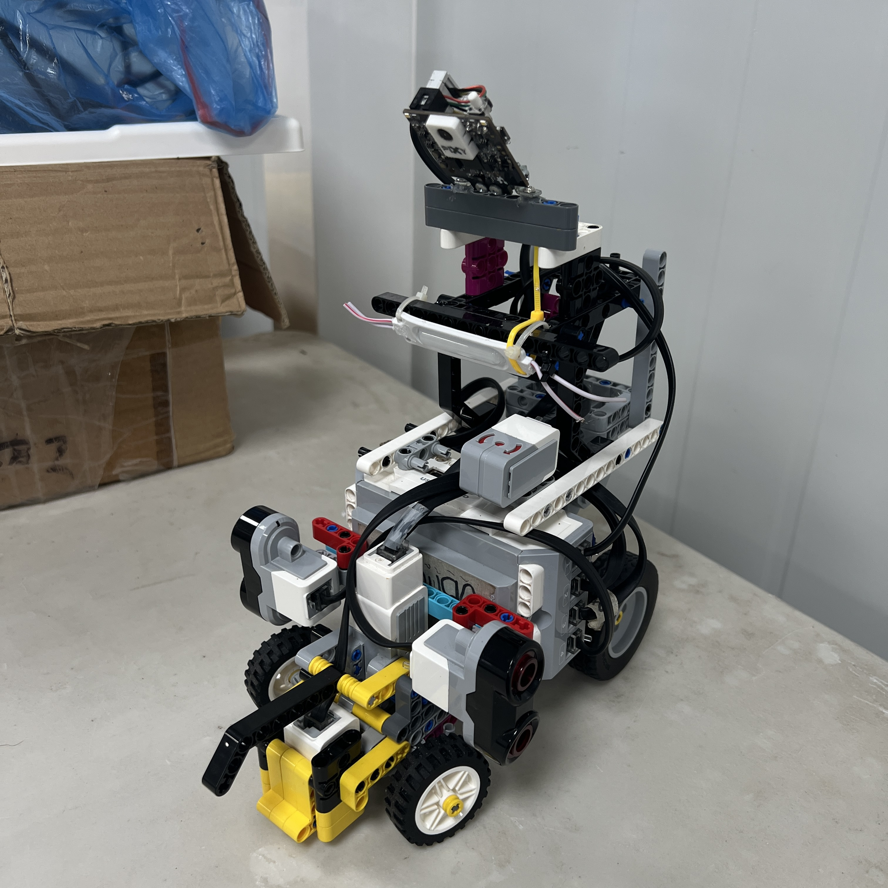
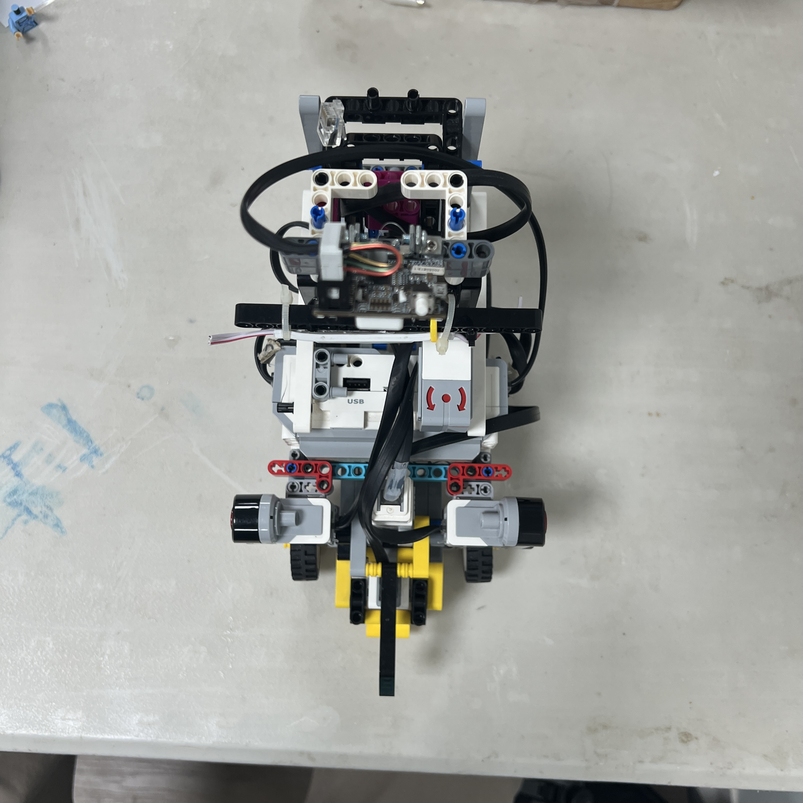
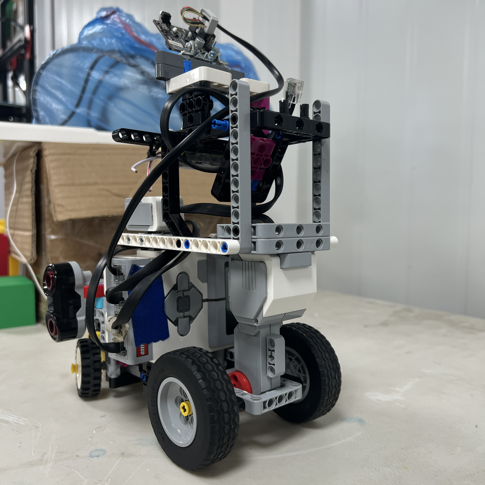
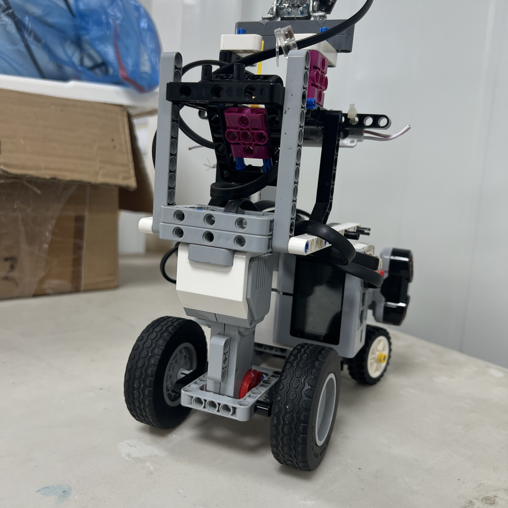
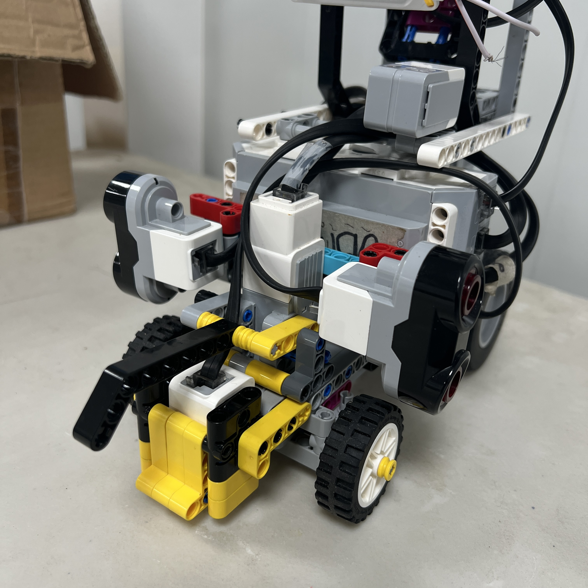

# 1. Mechanical Architecture

<div align="center">



<br>

<sub><b>Figure 1.1.</b> Current Piolín mechanical platform. The same core chassis, drivetrain, and steering architecture is used in both WRO Future Engineers competition rounds.</sub>

</div>

Piolín is built around a **single rear-driven, front-steered LEGO Mindstorms EV3 vehicle platform** designed for the WRO Future Engineers 2026 competition. Its mechanical architecture separates propulsion from steering: a LEGO EV3 Large Motor drives the rear wheels, while a LEGO EV3 Medium Motor operates the front Ackermann-style steering mechanism.

The core mechanical system can be summarized as:

```text
REAR
Motor A
→ propulsion
→ rear drivetrain
→ rear wheels


FRONT
Motor B
→ steering
→ mechanical linkage
→ front wheels
```

This separation gives each actuator a clear responsibility. Motor A controls longitudinal vehicle motion, while Motor B changes the orientation of the front wheels and therefore the direction of the vehicle trajectory.

The same base vehicle is used for both the **Open Challenge** and **Obstacle Challenge**. The chassis, drivetrain, steering system, motors, lateral ultrasonic mounts, Color Sensor position, EV3, and battery remain fundamentally common between the two rounds. The main round-specific change occurs at the sensing level, where S1 carries the Gyro Sensor during Open and Pixy2.1 during Obstacles.

The goal of the mechanical design is therefore not to create two different robots, but to create **one mechanically consistent autonomous vehicle whose sensing architecture can change according to the competition task**.

---

## 1.1 Mechanical System Overview

Piolín can be divided into five major mechanical regions:

| Region | Primary Function |
| :--- | :--- |
| Central chassis | Supports and connects all subsystems |
| Rear drivetrain | Converts Motor A rotation into vehicle propulsion |
| Front steering assembly | Converts Motor B rotation into front-wheel steering |
| Sensor-support structure | Maintains sensor position and orientation |
| EV3 and battery support | Integrates controller mass and electrical hardware into the chassis |

The complete physical chain is:

```text
              CENTRAL CHASSIS
                     │
        ┌────────────┼────────────┐
        │            │            │
        ▼            ▼            ▼
  REAR DRIVE    FRONT STEERING   CONTROLLER
        │            │            │
        ▼            ▼            ▼
     Motor A       Motor B        EV3
        │            │          + Battery
        ▼            ▼
 Rear Wheels    Front Wheels
```

The chassis acts as the reference structure for every other subsystem.

This is important because software assumes that the physical relationship between:

```text
wheels

motors

sensors

camera

EV3
```

remains sufficiently repeatable between tests.

---

## 1.2 Chassis Architecture

The chassis is built primarily from LEGO Mindstorms EV3 and LEGO Technic structural elements. Beams, frames, pins, axles, connectors, and supports combine to form a rigid platform around which the vehicle's active components are installed.

<div align="center">



<br>

<sub><b>Figure 1.2.</b> Top view showing the relationship between the central chassis, rear propulsion system, front steering system, EV3, and sensor locations.</sub>

</div>

The structure must perform more than a simple mounting function. It must preserve the geometry between subsystems during:

```text
acceleration

braking

cornering

reverse motion

obstacle avoidance

handling between runs
```

If the chassis or a subsystem mount changes position, the behavior of the robot can change even when the software is identical.

Examples include:

```text
ultrasonic mount rotates
→ measured wall geometry changes


camera mount shifts
→ pillar X coordinate changes


steering support flexes
→ same Motor B position produces different wheel angle
```

Mechanical repeatability is therefore part of control-system repeatability.

---

## 1.3 Structural Rigidity vs. Mass

A competition chassis must be rigid enough to preserve alignment, but adding structure without purpose can increase mass and complexity.

Piolín therefore follows a balance:

```text
TOO FLEXIBLE
→ geometry changes
→ inconsistent calibration


TOO MUCH STRUCTURE
→ unnecessary mass
→ more connections
→ harder maintenance
```

The intended design region is:

```text
ENOUGH REINFORCEMENT
        +
LOW UNNECESSARY COMPLEXITY
```

Structural reinforcement is concentrated around mechanically important areas such as:

```text
steering supports

motor mounts

wheel supports

EV3 mounting

sensor mounts
```

rather than treating every region of the chassis identically.

---

# 1.4 Rear-Wheel Propulsion

Piolín uses **Motor A**, a LEGO Mindstorms EV3 Large Motor, as the single propulsion actuator.

<div align="center">



<br>

<sub><b>Figure 1.3.</b> Motor A provides the mechanical input to Piolín's rear-wheel drivetrain.</sub>

</div>

The propulsion path is:

```text
Motor A
   ↓
drivetrain
   ↓
rear axle / wheel system
   ↓
rear wheels
   ↓
track surface
   ↓
vehicle motion
```

The Large Motor was assigned to propulsion because this subsystem must move the complete mass of the vehicle rather than only reposition a linkage.

The rear-drive architecture also keeps propulsion mechanically separate from the front steering mechanism.

This simplifies the division of vehicle functions:

```text
rear
→ generates longitudinal motion


front
→ defines direction
```

---

## 1.5 Why Rear-Wheel Drive Was Retained

Rear propulsion works naturally with Piolín's Ackermann-style configuration because the front assembly can focus on steering instead of simultaneously transmitting the main drive torque.

This provides a relatively clear mechanical architecture:

```text
DRIVEN REAR AXLE
+
STEERED FRONT AXLE
```

A more complex alternative could have included:

```text
front-wheel drive

four-wheel drive

independent wheel motors
```

but those approaches would introduce additional drivetrain elements or actuator requirements.

Piolín does not currently require that additional complexity.

The selected architecture provides the required mobility while preserving only two motors:

```text
1 drive motor

1 steering motor
```

---

# 1.6 Drivetrain Behavior

The drivetrain converts motor rotation into wheel rotation, but wheel rotation is not automatically identical to real vehicle displacement.

The theoretical relationship can be represented as:

```text
wheel travel
=
wheel rotations × wheel circumference
```

However, the real track motion can also be influenced by:

```text
tire slip

surface friction

wheel deformation

drivetrain friction

turning motion
```

Therefore motor encoder information is useful as a relative movement reference but should not be treated as perfect physical odometry without calibration.

The current wheel diameter and drivetrain ratio should be physically verified on the final V4 robot before numerical conversion constants are presented as final specifications.

---

## 1.7 Drivetrain Mechanical Losses

Mechanical resistance can create software symptoms.

For example:

```text
same Motor A command
+
greater axle friction
=
lower actual vehicle speed
```

Potential sources include:

```text
axle misalignment

tight bushings

wheel rubbing

gear friction

structural deformation
```

This is why propulsion problems should be diagnosed mechanically before compensating by simply increasing motor command.

A software adjustment should not be used to hide a drivetrain that is physically binding.

---

# 1.8 Front Steering Architecture

Piolín uses **Motor B**, a LEGO Mindstorms EV3 Medium Motor, to operate the front steering system.

<div align="center">



<br>

<sub><b>Figure 1.4.</b> Motor B operates the mechanical linkage responsible for front-wheel steering.</sub>

</div>

The steering chain is:

```text
Motor B
   ↓
steering transmission / linkage
   ↓
steering arms
   ↓
left and right front pivots
   ↓
front wheel angles
   ↓
vehicle curvature
```

Motor B therefore does not directly represent vehicle heading.

It controls a mechanism that changes front-wheel geometry.

Actual vehicle rotation occurs only when:

```text
front wheels are angled
+
vehicle moves longitudinally
```

This is a fundamental characteristic of Ackermann-style steering.

---

# 1.9 Ackermann-Style Geometry

Piolín uses an **Ackermann-style front steering mechanism** rather than differential steering.

<div align="center">



<br>

<sub><b>Figure 1.5.</b> Top view of the current front steering mechanism showing coordinated left and right wheel movement.</sub>

</div>

During a turn, the inner and outer front wheels follow different-radius paths.

Conceptually:

```text
         TURN CENTER
              ●
             / \
            /   \
           /     \
      INNER     OUTER
      WHEEL     WHEEL
```

The inner wheel follows a smaller radius than the outer wheel.

A steering linkage that allows the two front wheels to respond differently can reduce unnecessary tire scrub compared with forcing both wheels to remain perfectly parallel throughout the turn.

Piolín's mechanism is described as **Ackermann-style** because the design follows this steering principle, while the exact geometric relationship should be measured before claiming ideal theoretical Ackermann geometry.

---

## 1.10 Why Ackermann Was Chosen

Ackermann steering was selected because the Future Engineers challenge is fundamentally a vehicle-navigation task.

Compared with differential steering, it provides behavior closer to a conventional wheeled vehicle:

```text
forward motion
+
front steering
→ curved trajectory
```

This creates useful characteristics for:

```text
wall following

smooth straight sections

controlled corners

obstacle passing

parking
```

It also creates specific engineering challenges.

The robot cannot rotate in place.

A steering change requires forward or reverse motion to create a trajectory.

This means speed and steering cannot be tuned independently.

---

# 1.11 Steering Angle Is Not Motor Angle

One important mechanical distinction is:

```text
Motor B encoder angle
≠
front wheel angle
```

Motor B moves the steering linkage through a mechanical geometry.

The resulting wheel angle depends on:

```text
link lengths

pivot positions

connection points

mechanical play

structural stiffness
```

Therefore a software command such as:

```text
Motor B = X degrees
```

should not automatically be documented as:

```text
front wheels = X degrees
```

unless that relationship has been physically measured.

This is important for reproducibility and for any future mathematical turning model.

---

## 1.12 Steering Center

The steering system requires a repeatable neutral position.

Conceptually:

```text
LEFT
   \
    \
   CENTER
    /
   /
RIGHT
```

The neutral Motor B reference should correspond as closely as practical to:

```text
front wheels aligned for straight motion
```

However, software centering cannot compensate completely for:

```text
unequal linkage geometry

bent structure

wheel misalignment

mechanical play
```

For this reason, steering center should be checked both:

```text
electronically
```

and:

```text
physically
```

before navigation tuning begins.

---

# 1.13 Mechanical Steering Limits

Motor B must also operate inside safe mechanical limits.

The steering mechanism has physical end positions determined by the LEGO linkage and front-wheel assembly.

Commanding beyond a useful mechanical range can create:

```text
binding

high motor load

linkage stress

little additional wheel movement
```

The preferred software range should therefore remain inside the mechanically useful steering region rather than relying on the absolute point where the linkage physically cannot move farther.

The final usable left and right limits should be documented from the current V4 steering calibration.

---

# 1.14 Backlash and Mechanical Play

LEGO mechanical assemblies contain small clearances between:

```text
pins

axles

connectors

gears

steering joints
```

Therefore some difference can exist between:

```text
Motor B begins moving
```

and:

```text
front wheels visibly respond
```

especially when changing direction.

For example:

```text
LEFT steering
      ↓
command changes to RIGHT
      ↓
mechanical clearance is taken up
      ↓
wheel response begins
```

This can influence rapid obstacle maneuvers involving:

```text
avoid
→ countersteer
→ recover
```

The documentation therefore does not claim zero backlash or exact wheel-angle repeatability.

The engineering goal is to **reduce unnecessary play enough that the software receives a mechanically consistent platform**.

---

# 1.15 Steering and Vehicle Speed Are Coupled

Ackermann steering requires longitudinal movement.

The physical trajectory depends on both:

```text
steering angle
```

and:

```text
forward speed
```

A stronger steering command at one speed may not produce the same trajectory at another speed.

This can be represented conceptually as:

```text
TRAJECTORY
=
f(steering, forward motion, geometry, traction)
```

This explains why some early tuning attempts that changed steering without considering speed produced inconsistent corner behavior.

A corner is not defined by one steering value alone.

---

# 1.16 Sensor Placement as Mechanical Architecture

Sensors are electronic components, but their **mounting positions are mechanical design decisions**.

The current common layout contains:

```text
S2
→ LEFT lateral Ultrasonic Sensor


S3
→ RIGHT lateral Ultrasonic Sensor


S4
→ downward-facing Color Sensor
```

The ultrasonic sensors are intentionally mounted laterally rather than as the earlier diagonal configurations.

This makes the physical interpretation of the measurement more direct:

```text
lateral sensor
→ side geometry relative to wall
```

The Color Sensor is mounted toward the floor and uses a light-isolation casing to improve the consistency of its optical environment.

These mounting choices affect the navigation mathematics just as directly as the sensor software itself.

---

# 1.17 Round-Specific S1 Integration

The current mechanical platform supports two round-specific sensing configurations.

### Open Challenge

```text
S1
→ EV3 Gyro Sensor
```

The gyro is mounted rigidly relative to the chassis so its measured rotation corresponds meaningfully to vehicle rotation.

### Obstacle Challenge

```text
S1
→ Pixy2.1
```

The Pixy camera is mounted forward so that competition pillars can enter the visual field before Piolín physically reaches them.

The two devices are never part of the same active round configuration.

This modular approach allows the base vehicle to remain unchanged while the specialized perception device changes.

---

# 1.18 Why One Common Mechanical Platform Matters

Using the same chassis for Open and Obstacles reduces the number of variables that change between rounds.

The following remain common:

```text
wheelbase

drivetrain

steering geometry

Motor A

Motor B

front wheel structure

rear wheel structure

ultrasonic placement

Color Sensor placement

EV3 position

battery position
```

Therefore the team does not need to recalibrate an entirely different vehicle for each challenge.

The architecture can be represented as:

```text
             COMMON VEHICLE
                   │
        ┌──────────┴──────────┐
        │                     │
       OPEN               OBSTACLES
        │                     │
      Gyro                  Pixy2.1
```

The mechanical platform is intentionally common; the perception layer is modular.

---

# 1.19 EV3 and Battery Placement

The EV3 Brick and its rechargeable battery form one of the larger concentrated masses in Piolín.

Their physical location affects:

```text
front/rear loading

traction

steering load

overall balance
```

The EV3 mount also needs to provide practical access to:

```text
buttons

screen

battery

motor ports

sensor ports
```

while preventing the controller from shifting during vehicle motion.

The final center of mass has not yet been measured on the current V4 robot, so this document does not claim an exact center-of-mass position.

---

# 1.20 Mechanical Load Paths

A useful way to understand Piolín is through its mechanical load paths.

### Propulsion

```text
Motor A
→ drivetrain
→ rear wheels
→ track
→ chassis acceleration
```

### Steering

```text
Motor B
→ linkage
→ steering pivots
→ front tires
→ lateral tire force
→ vehicle rotation
```

### Structural

```text
EV3 / battery / sensors / motors
→ mounting points
→ Technic chassis
→ wheels
→ track
```

The chassis therefore connects every mechanical reaction in the robot.

A weak mounting region can influence behavior far beyond that local component.

---

# 1.21 Mechanical Symmetry

Piolín benefits from left/right mechanical symmetry where practical, particularly around:

```text
front steering

wheel supports

ultrasonic placement
```

However, a LEGO vehicle should not automatically be assumed to be perfectly symmetric.

Small differences can come from:

```text
linkage geometry

component mounting

cable routing

mechanical play
```

This means a physically measured left turn may not be exactly identical to a physically measured right turn.

Software should therefore be calibrated against the actual robot rather than assuming perfect theoretical symmetry.

---

# 1.22 Serviceability

A competition robot must be maintainable under limited time.

Important components should remain reasonably accessible for:

```text
cable inspection

battery charging

sensor replacement

S1 reconfiguration

steering inspection

motor inspection
```

This creates another mechanical trade-off.

A completely enclosed robot could protect components but make troubleshooting difficult.

An excessively open structure could reduce rigidity or expose cables.

Piolín therefore prioritizes access to critical components while keeping them mechanically secured.

---

# 1.23 Cable Routing as a Mechanical Constraint

Although wiring is documented primarily in the electrical section, cable routing also affects mechanical architecture.

A cable can interfere with:

```text
front steering

wheel rotation

rear drivetrain

sensor orientation
```

particularly when Motor B moves through its full steering range.

For this reason, mechanical testing should verify cable clearance at:

```text
full left

center

full right
```

rather than inspecting the robot only with the wheels centered.

The complete mechanical envelope includes moving cables as well as rigid LEGO structure.

---

# 1.24 Mechanical Evolution

Piolín's current architecture resulted from several physical iterations.

During development, changes included:

```text
ultrasonic orientation

front sensing configuration

camera mounting

wheel reinforcement

steering reinforcement

sensor support

cable arrangement
```

Not every earlier configuration was mechanically incorrect.

Many were prototypes used to determine which geometry produced the most interpretable and repeatable behavior.

The current mechanical philosophy increasingly favors:

```text
stable geometry

clear subsystem roles

fewer unnecessary components

repeatable mounting
```

rather than adding structures to solve every individual software symptom.

---

# 1.25 Earlier Ultrasonic Geometry

Earlier Piolín configurations experimented with ultrasonic sensors in different orientations, including diagonal placements and a frontal sensor.

Those layouts provided useful information during development, but they also made sensor interpretation more dependent on geometry.

The current architecture uses:

```text
S2 = LEFT lateral US

S3 = RIGHT lateral US
```

with no permanent frontal ultrasonic.

This creates a simpler relationship between:

```text
measured side distance
```

and:

```text
vehicle position relative to walls
```

while S1 is reserved for the specialized sensor required by each competition round.

---

# 1.26 Mechanical Problems Should Be Solved Mechanically First

One of the strongest lessons from prototype development was that software should not automatically compensate for a mechanical defect.

Examples include:

```text
robot drifts
→ first check wheel/steering alignment


steering responds slowly
→ first check linkage friction/play


vehicle moves slowly
→ first check drivetrain resistance


sensor values move unexpectedly
→ first check sensor mount
```

Only after the physical platform has been verified should control parameters be changed.

This prevents software from becoming a collection of compensations for an unstable mechanical system.

---

# 1.27 Mechanical Inspection Before Testing

A practical mechanical pre-test sequence is:

```text
Check chassis joints
      ↓
Check Motor A mount
      ↓
Check rear drivetrain
      ↓
Check rear wheels
      ↓
Check Motor B mount
      ↓
Check steering linkage
      ↓
Check front wheels
      ↓
Check sensor mounts
      ↓
Check S1 device mount
      ↓
Check cable clearance
      ↓
Move steering through full range
      ↓
Begin software test
```

This inspection can prevent a mechanical change from being mistaken for a control regression.

---

# 1.28 Current Values That Must Be Remeasured

Several earlier mechanical measurements exist from previous Piolín configurations.

Because the vehicle has changed, those values should not automatically appear as current V4 specifications.

The following should be physically measured again:

```text
overall length

overall width

overall height

wheelbase

front track width

rear track width

wheel diameters

ground clearance

vehicle mass

Pixy mounting height

Pixy lateral offset

Pixy pitch angle
```

Current rough references exist for some of these quantities, but they are not used here as official final values.

The purpose of the mechanical architecture document is to explain the **design and relationships** without presenting outdated measurements as current engineering evidence.

---

# 1.29 Mechanical Measurements Required for Reproduction

For a fully reproducible final design, the most useful measurements will include:

| Measurement | Why It Matters |
| :--- | :--- |
| Wheelbase | Vehicle turning geometry |
| Front track | Steering geometry |
| Rear track | Chassis and drivetrain reproduction |
| Front wheel diameter | Steering/odometry model |
| Rear wheel diameter | Encoder-to-distance conversion |
| Steering center | Straight-line calibration |
| Left/right usable steering limits | Control safety and repeatability |
| Sensor offsets | Navigation geometry |
| Camera position | Vision calibration |
| Vehicle mass | Dynamic and power analysis |

These values should be measured only after the final physical structure is frozen.

---

# 1.30 Mechanical Architecture Trade-Offs

The final architecture represents several deliberate trade-offs.

| Decision | Advantage | Trade-Off |
| :--- | :--- | :--- |
| Rear-wheel propulsion | Clear separation of drive and steering | Single primary driven system |
| Ackermann-style steering | Vehicle-like smooth trajectory | Cannot rotate in place |
| One steering motor | Low actuator complexity | Steering depends on linkage precision |
| LEGO Technic chassis | Highly modular and repairable | Mechanical play must be managed |
| Two lateral ultrasonic mounts | Direct wall geometry | No dedicated current front-ranging sensor |
| Common chassis for both rounds | Calibration consistency | Requires modular S1 change |
| EV3-integrated battery/controller | Compact architecture | Mass concentrated around EV3 |
| Fixed camera mount | Repeatable vision geometry | Camera rotates with chassis during turns |

No architecture removes every limitation.

The engineering objective is to select a combination whose limitations can be understood, calibrated, and managed.

---

# 1.31 Current Mechanical Architecture Summary

Piolín's current mechanical architecture can be summarized as:

```text
                    LEGO EV3
                  + BATTERY
                      │
                      ▼
               CENTRAL CHASSIS
                      │
           ┌──────────┴──────────┐
           │                     │
           ▼                     ▼
      REAR PROPULSION       FRONT STEERING
           │                     │
        Motor A               Motor B
           │                     │
           ▼                     ▼
       Drivetrain             Linkage
           │                     │
           ▼                     ▼
      Rear Wheels           Front Wheels
           │                     │
           └──────────┬──────────┘
                      ▼
               VEHICLE MOTION
```

Around this mobility platform, the sensors are mounted according to their physical measurement roles:

```text
LEFT SIDE
→ S2 Ultrasonic


RIGHT SIDE
→ S3 Ultrasonic


FLOOR
→ S4 Color Sensor


OPEN ORIENTATION
→ S1 Gyro


OBSTACLE VISION
→ S1 Pixy2.1
```

The mechanical architecture therefore provides the stable physical reference on which the sensing and software architectures depend.

---

# 1.32 Final Engineering Assessment

Piolín's mechanical architecture is based on a relatively simple idea:

```text
one chassis

one propulsion motor

one steering motor

rear drive

front Ackermann-style steering

stable sensor mounting

round-specific perception
```

The engineering complexity comes from making those elements interact repeatably.

A motor command must become a predictable mechanical response.

A sensor must remain in the geometry assumed by the software.

A camera must remain aligned to the chassis.

The drivetrain must move freely.

The steering linkage must provide sufficient rigidity without binding.

The same platform must remain usable in both competition rounds.

Piolín therefore treats mechanical design as part of the autonomous control system rather than as a structure built before programming begins.

The complete relationship is:

```text
MECHANICAL GEOMETRY
        ↓
SENSOR GEOMETRY
        ↓
CONTROL ASSUMPTIONS
        ↓
MOTOR COMMANDS
        ↓
MECHANICAL RESPONSE
        ↓
NEW SENSOR STATE
```

The current architecture was selected because it provides a clear division between propulsion and steering, preserves one common vehicle platform across both rounds, and allows the software to operate on a physical system whose geometry can be measured and progressively calibrated.

The central mechanical design principle is:

> **Build a vehicle whose physical behavior is simple enough to understand, rigid enough to repeat, and modular enough to evolve without rebuilding the entire robot.**

---

<div align="center">

### [← Back to PiolínTech Main README](../../README.md)

</div>
