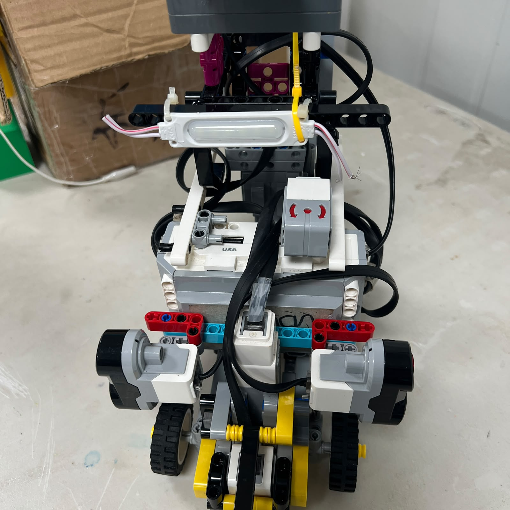
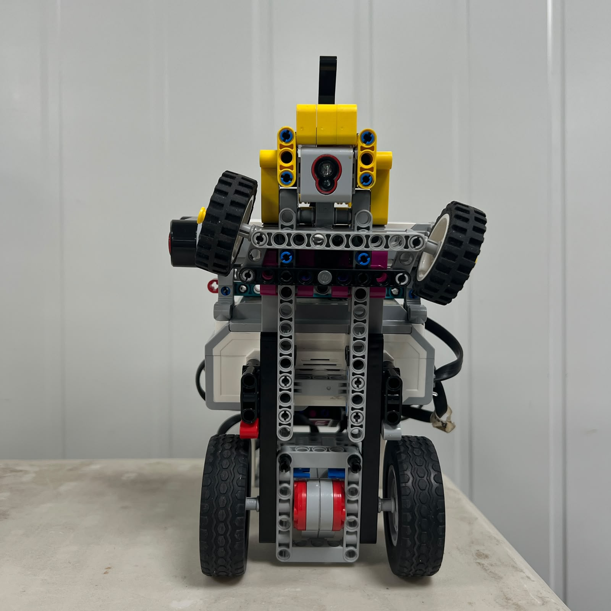
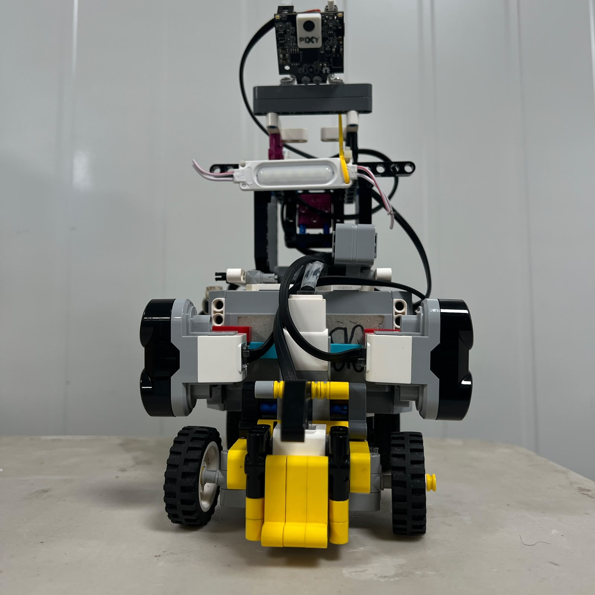
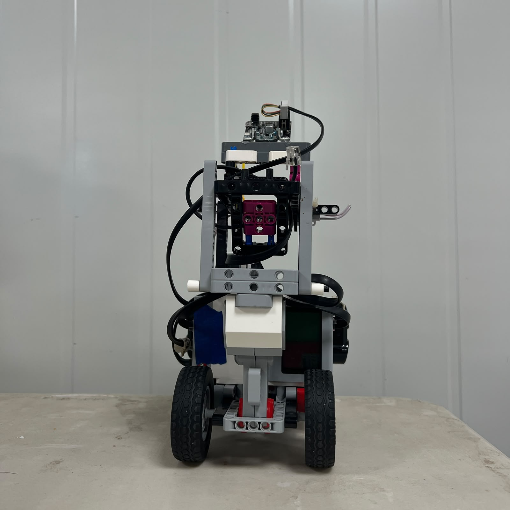

# 2. Chassis Design and Structural Integration

<div align="center">


<br>

<sub><b>Figure 2.1.</b> Current Piolín V4 platform showing the common LEGO Technic chassis used for both competition rounds.</sub>

</div>

Piolín's chassis is the mechanical structure that connects every major subsystem into one autonomous vehicle.

It supports:

```text
EV3 Intelligent Brick

EV3 Rechargeable Battery

Motor A propulsion system

Motor B steering system

front Ackermann linkage

rear drivetrain

left and right ultrasonic sensors

downward Color Sensor

round-specific S1 sensor

wiring and supporting structure
```

The chassis is therefore not simply the body of the robot.

It defines the physical relationships on which sensing, steering, propulsion, and software calibration depend.

A useful systems-level relationship is:

```text
CHASSIS GEOMETRY
       ↓
COMPONENT POSITION
       ↓
SENSOR / MOTOR BEHAVIOR
       ↓
SOFTWARE CALIBRATION
       ↓
VEHICLE MOTION
```

If the chassis changes significantly, the calibration of other subsystems may also need to change.

---

## 2.1 Current Chassis Architecture

Piolín uses a primarily **LEGO Technic structural platform** built around one common vehicle architecture.

The same basic chassis is used in:

```text
OPEN CHALLENGE
```

and:

```text
OBSTACLE CHALLENGE
```

The permanent vehicle systems are:

```text
Motor A
→ rear propulsion


Motor B
→ front Ackermann-style steering


S2
→ LEFT Ultrasonic Sensor


S3
→ RIGHT Ultrasonic Sensor


S4
→ downward Color Sensor
```

Only the S1 perception device changes between rounds:

```text
OPEN
→ Gyro Sensor


OBSTACLES
→ Pixy2.1
```

This allows Piolín to remain mechanically the same vehicle while changing only the specialized sensing system required by the challenge.

---

# 2.2 Why One Common Chassis Is Used

A possible alternative would have been to build one robot for Open and another for Obstacles.

That could allow each vehicle to be highly specialized.

However, it would also require maintaining:

```text
two chassis

two steering systems

two drivetrains

two mechanical calibrations

two wiring arrangements

two sets of structural tolerances
```

Piolín instead uses one common platform.

This means that improvements to:

```text
steering rigidity

wheel alignment

drivetrain friction

sensor mounting

cable routing
```

benefit both competition rounds.

The common chassis therefore reduces duplicated engineering work and makes the vehicle easier to reproduce.

---

# 2.3 Top-Level Chassis Layout

<div align="center">



<br>

<sub><b>Figure 2.2.</b> Top view of Piolín's current chassis showing the relative placement of the controller, drivetrain, steering system, and sensor structures.</sub>

</div>

The chassis is organized around several functional regions.

```text
                FRONT
                  ↑
                  │
        ┌──────────────────┐
        │ FRONT STEERING   │
        │ + SENSING AREA   │
        │                  │
        │  EV3 / CENTRAL   │
        │     STRUCTURE    │
        │                  │
        │ REAR DRIVETRAIN  │
        └──────────────────┘
                  │
                  ↓
                 REAR
```

The front section contains the Ackermann steering mechanism and the structures required to support forward or lateral sensing.

The central section provides structural support for the EV3 and battery assembly.

The rear section supports propulsion and the drivetrain.

This functional separation helps make mechanical problems easier to diagnose.

---

# 2.4 Chassis as the Mechanical Reference Frame

Several autonomous measurements are only meaningful because their sensors remain fixed relative to the chassis.

For example:

```text
Gyro orientation
→ relative to chassis


Ultrasonic direction
→ relative to chassis


Pixy viewing direction
→ relative to chassis


Color Sensor position
→ relative to chassis


Steering center
→ relative to chassis
```

If one of these components changes position physically, the software may receive different information even though the code has not changed.

The chassis therefore acts as Piolín's mechanical reference frame.

---

# 2.5 Structural Rigidity

A vehicle chassis should resist unnecessary deformation under normal movement.

Potential sources of mechanical load include:

```text
acceleration

steering

countersteering

reverse movement

wheel friction

handling between tests
```

If the chassis flexes significantly:

```text
motor mounts can move

sensor angles can change

steering pivots can shift

wheel alignment can change
```

which reduces repeatability.

The goal is not to claim that LEGO Technic has zero flexibility.

Instead, Piolín's structure is designed to keep movement small enough that calibrated geometry remains useful from one run to another.

---

# 2.6 Bottom Structure

<div align="center">



<br>

<sub><b>Figure 2.3.</b> Bottom view showing Piolín's drivetrain, steering support, wheel arrangement, and lower structural connections.</sub>

</div>

The underside is especially important because it contains or supports several mechanically sensitive elements:

```text
rear drivetrain

wheel axles

front steering pivots

Color Sensor

lower chassis reinforcement
```

The bottom structure must provide enough rigidity while also preserving:

```text
wheel clearance

sensor clearance

free axle rotation

ground clearance
```

A structure that is strong but interferes with moving components would not be useful.

---

# 2.7 Structural Load Paths

Motor forces must eventually be transferred through the chassis.

For propulsion:

```text
Motor A
   ↓
drivetrain
   ↓
rear wheels
   ↓
track
   ↓
reaction through chassis
```

For steering:

```text
Motor B
   ↓
steering linkage
   ↓
front wheel pivots
   ↓
tire forces
   ↓
reaction through chassis
```

This means the motor mounts cannot be considered independently from the frame.

The surrounding Technic structure must resist the forces generated by each actuator so that intended motor motion becomes wheel motion rather than chassis deformation.

---

# 2.8 Motor A Integration

Motor A is the EV3 Large Motor used for rear propulsion.

Its mounting must maintain a stable relationship between:

```text
motor

drivetrain

axles

rear wheels
```

If the motor or axle support shifts:

```text
friction can increase

transmission alignment can change

vehicle speed can change

encoder-based displacement can become less repeatable
```

For this reason, drivetrain behavior should be inspected mechanically before propulsion parameters are changed in software.

Detailed Motor A behavior is documented in:

[Motors and Actuation System](../components/03_Motors.md)

---

# 2.9 Motor B Integration

Motor B is the EV3 Medium Motor used for steering.

The chassis must hold the steering motor and linkage supports firmly enough that:

```text
Motor B movement
```

is converted primarily into:

```text
front-wheel movement
```

rather than:

```text
structural movement
```

This relationship is especially important because the software uses Motor B position as an actuator reference.

If the support structure flexes, the same Motor B position can create different wheel geometry.

Detailed steering design is documented in:

[Steering Motor and Ackermann Actuation](../components/04_SteeringMotor.md)

---

# 2.10 Front Chassis Structure

<div align="center">



<br>

<sub><b>Figure 2.4.</b> Front view of Piolín showing the structural area responsible for supporting the steering mechanism and front sensing configuration.</sub>

</div>

The front of Piolín has several competing mechanical requirements.

It must provide:

```text
steering rigidity

wheel clearance

sensor support

camera visibility during Obstacles

low interference with moving linkage
```

while remaining compact enough for the vehicle to navigate the course.

This makes the front structure one of the most mechanically sensitive regions of the chassis.

---

# 2.11 Steering Clearance

The steering mechanism moves through a significant angular range.

The chassis must therefore provide clearance at:

```text
LEFT steering

CENTER

RIGHT steering
```

for:

```text
front wheels

linkage

axles

cables
```

A component that does not interfere while the wheels are centered can still create a problem at steering lock.

For example:

```text
wheel turns
      ↓
cable becomes tight
      ↓
Motor B experiences extra load
      ↓
steering response changes
```

This is why clearance must be evaluated dynamically rather than only through static inspection.

---

# 2.12 Rear Chassis Structure

<div align="center">



<br>

<sub><b>Figure 2.5.</b> Rear view of Piolín's current chassis showing the propulsion region and rear structural support.</sub>

</div>

The rear section is primarily responsible for supporting the propulsion system.

It must maintain:

```text
wheel alignment

axle alignment

Motor A position

drivetrain clearance
```

while supporting the rest of the vehicle.

Because the rear wheels generate the longitudinal driving force, unnecessary friction in this region directly affects propulsion performance.

---

# 2.13 Wheel Alignment

Wheel alignment influences both mechanical efficiency and autonomous control.

Potential problems include:

```text
wheel rubbing

axle misalignment

unequal friction

wheel looseness
```

A vehicle with asymmetric rolling resistance can curve even when the steering system is mechanically centered.

This can be misinterpreted as:

```text
gyro problem

wall-control problem

steering-center problem
```

when the actual cause exists in the chassis or drivetrain.

Mechanical alignment should therefore be checked before compensating through software.

---

# 2.14 Ackermann Geometry Depends on the Chassis

Piolín's steering geometry depends on several physical relationships.

These include:

```text
wheelbase

front track width

pivot positions

steering-arm geometry

linkage attachment points
```

All of these are defined by the chassis.

Therefore the Ackermann mechanism cannot be treated as an isolated front attachment.

It is part of the complete vehicle geometry.

A small structural change near the pivot positions can affect:

```text
inner wheel angle

outer wheel angle

turning radius

left/right symmetry
```

even when Motor B code remains unchanged.

---

# 2.15 EV3 and Battery Placement

The EV3 Intelligent Brick and its rechargeable battery form one of the largest concentrated masses in the vehicle.

Their placement affects:

```text
vehicle balance

front/rear loading

accessibility

cable length

overall structural arrangement
```

The EV3 must also remain accessible enough for:

```text
starting programs

connecting cables

charging

inspection

debugging
```

The chassis therefore balances structural support with serviceability.

---

# 2.16 Mass Distribution

Mass distribution can influence:

```text
rear-wheel traction

front steering load

turning behavior

mechanical inertia
```

However, Piolín's exact V4 center of mass and front/rear load distribution have not yet been formally measured.

This document therefore does not assign precise numerical values to them.

The important current engineering requirement is to keep heavy components securely mounted and avoid unnecessary high or unsupported mass.

---

# 2.17 Center of Gravity

A lower center of gravity generally reduces the tendency of a vehicle to experience excessive body movement during changes in direction.

For Piolín, this is relevant because autonomous movement includes:

```text
corners

wall corrections

pillar avoidance

countersteering
```

However, this document does not claim a measured center-of-gravity height.

Such a value should only be published if it is actually measured or calculated from verified component masses and locations.

---

# 2.18 Permanent Ultrasonic Mounting

Piolín uses two permanently installed lateral ultrasonic sensors:

```text
S2 = LEFT

S3 = RIGHT
```

The chassis must preserve their:

```text
orientation

height

position

left/right identity
```

A sensor that rotates physically changes the geometry of the measurement.

Therefore ultrasonic performance depends partly on the structural mount.

Detailed sensor geometry is documented in:

[Ultrasonic Sensors](../components/05_UltrasonicSensors.md)

---

# 2.19 Color Sensor Integration

The Color Sensor is mounted downward and connected to S4.

The chassis defines:

```text
sensor height above floor

sensor position along vehicle

sensor orientation

light-isolation casing position
```

These properties affect both raw color readings and the physical timing of course events.

For example:

```text
Color Sensor crosses marking
```

does not mean the geometric center of the robot is at exactly the same location.

Its mounting position must therefore remain consistent between calibration and competition.

---

# 2.20 Modular S1 Architecture

Piolín uses one round-specific S1 device.

### Open Challenge

```text
S1 = Gyro
```

### Obstacle Challenge

```text
S1 = Pixy2.1
```

The chassis must support this modularity without requiring a complete vehicle rebuild.

This is an important design decision because the specialized sensing requirement changes while:

```text
drivetrain

steering

ultrasonic sensors

Color Sensor

EV3
```

remain the same.

---

# 2.21 Gyro Mechanical Requirements

During Open, the Gyro Sensor must remain fixed relative to the chassis.

If its mount moves:

```text
sensor orientation changes
```

while:

```text
vehicle orientation may not
```

making calibration less meaningful.

The chassis therefore treats the gyro as a fixed orientation sensor rather than as a loosely positioned accessory.

---

# 2.22 Pixy2.1 Mechanical Requirements

During Obstacles, Pixy2.1 becomes the S1 device.

Its perception depends strongly on mounting geometry.

Important physical variables include:

```text
camera height

camera pitch

camera yaw

lateral offset

structural vibration
```

The exact values should be measured before being published numerically.

What matters structurally is that the mount remains stable enough that:

```text
same physical target position
```

produces approximately repeatable:

```text
image geometry
```

between tests.

---

# 2.23 Camera Field of View and Chassis Design

The chassis can also obstruct a camera.

A forward vision sensor needs a useful field of view toward the obstacle region.

Therefore surrounding structure should avoid unnecessary obstruction in front of the Pixy.

At the same time, the camera needs enough structural support that it does not shift during:

```text
cornering

pillar avoidance

vehicle transport
```

This creates a trade-off between:

```text
visibility
```

and:

```text
mechanical protection / rigidity
```

---

# 2.24 Cable Routing

Cable management is part of chassis design.

Piolín's cables should remain clear of:

```text
front wheels

Ackermann linkage

rear wheels

drivetrain axles

other moving components
```

A cable can be electrically correct but mechanically harmful.

For example:

```text
cable contacts steering
      ↓
additional resistance
      ↓
Motor B response changes
```

or:

```text
cable pulls sensor
      ↓
sensor orientation changes
      ↓
measurement changes
```

Cable routing therefore contributes directly to repeatability.

---

# 2.25 Serviceability

A competition chassis must be practical to inspect between tests.

Important components should remain reasonably accessible:

```text
EV3 controls

battery

Motor A connection

Motor B connection

sensor ports

S1 device

Color Sensor

steering linkage
```

A structure that is extremely difficult to service can increase testing time and make simple faults harder to identify.

Piolín therefore prioritizes both:

```text
structural support
```

and:

```text
maintenance access
```

rather than treating them as separate concerns.

---

# 2.26 Structural Simplicity

Adding more beams does not automatically produce a better chassis.

Additional structure can increase:

```text
mass

construction complexity

access difficulty

part count
```

without necessarily improving the areas that actually carry load.

The stronger design principle is:

> **Add structure where it preserves important geometry or load paths, not simply where additional pieces can fit.**

This is similar to the philosophy used elsewhere in Piolín:

```text
more hardware
≠
automatically better system
```

---

# 2.27 Rigidity vs. Mass

Chassis design contains an unavoidable trade-off.

```text
MORE REINFORCEMENT
→ potentially greater rigidity
→ potentially greater mass
```

while:

```text
LESS STRUCTURE
→ lower mass
→ potentially greater flex
```

The correct solution is not necessarily the lightest or the heaviest structure.

It is a structure that provides enough mechanical stability for repeatable sensing and actuation without carrying unnecessary material.

The current V4 mass must be physically remeasured before any final numerical claim is added.

---

# 2.28 Chassis and Propulsion Efficiency

Structural alignment influences the energy required for propulsion.

If the rear drivetrain is misaligned:

```text
friction increases
      ↓
Motor A works against additional resistance
      ↓
vehicle response changes
```

This can create symptoms such as:

```text
lower speed

different acceleration

less repeatable movement
```

The appropriate correction may therefore be mechanical rather than software-based.

---

# 2.29 Chassis and Steering Repeatability

The same principle applies to steering.

If the front structure flexes or one pivot changes position:

```text
Motor B command
```

may produce:

```text
different wheel geometry
```

between tests.

A stable chassis makes steering calibration meaningful because the relationship between:

```text
motor position
```

and:

```text
wheel response
```

remains more consistent.

---

# 2.30 Chassis and Sensor Repeatability

Sensor calibration also assumes fixed geometry.

For example:

```text
S2/S3 wall distance thresholds
```

assume stable ultrasonic orientation.

```text
Color Sensor thresholds
```

assume stable floor height and casing position.

```text
Pixy X values
```

assume stable camera geometry.

```text
Gyro heading
```

assumes stable sensor orientation.

Mechanical repeatability is therefore one of the foundations of software repeatability.

---

# 2.31 Open Challenge Structural Configuration

During Open, Piolín uses:

```text
S1 = Gyro

S2 = LEFT Ultrasonic

S3 = RIGHT Ultrasonic

S4 = Color Sensor
```

The chassis supports:

```text
rear propulsion

front steering

lateral wall sensing

floor sensing

heading sensing
```

without requiring any camera hardware.

The vehicle remains the same mechanical platform used for Obstacles.

---

# 2.32 Obstacle Challenge Structural Configuration

During Obstacles:

```text
S1 = Pixy2.1

S2 = LEFT Ultrasonic

S3 = RIGHT Ultrasonic

S4 = Color Sensor
```

The major structural difference is the front vision installation.

The underlying:

```text
chassis

motors

steering

drivetrain

lateral ultrasonics

Color Sensor
```

remain common.

This modularity reduces the risk of changing vehicle geometry between competition rounds.

---

# 2.33 Why a Front Ultrasonic Is Not Part of the Current Chassis

Earlier Piolín versions experimented with a frontal ultrasonic sensor.

The current competition architecture no longer uses one.

S1 is now reserved for:

```text
OPEN
→ Gyro
```

or:

```text
OBSTACLES
→ Pixy2.1
```

The current chassis should therefore not be documented as requiring a permanent front-US mount.

Historical mounts may remain in older photographs or development notes, but they are not part of current reconstruction instructions.

---

# 2.34 Why HuskyLens and Nano Are Not Part of the Current Chassis

Earlier obstacle prototypes required structural space for:

```text
HuskyLens

Arduino Nano

additional wiring
```

The current Pixy2.1 architecture removed those components.

This simplified more than the electronics.

It also reduced:

```text
mounting requirements

cable routing

component count

structural clutter
```

This demonstrates how an architecture change in one subsystem can simplify the mechanical vehicle as well.

---

# 2.35 Mechanical Inspection Before Testing

Before major autonomous testing, the chassis should be checked physically.

A useful sequence is:

```text
1. Inspect chassis connections.

2. Verify EV3 is secure.

3. Verify Motor A mount.

4. Verify Motor B mount.

5. Check rear wheels for free rotation.

6. Check steering through left / center / right.

7. Check ultrasonic mounts.

8. Check Color Sensor and casing.

9. Verify active S1 device is secure.

10. Inspect cables near moving parts.

11. Verify nothing rubs against wheels.

12. Begin sensor validation.
```

This prevents avoidable structural faults from being interpreted as software regressions.

---

# 2.36 Mechanical Failure Can Look Like Software Failure

Several visible behaviors can have structural causes.

| Symptom | Possible Chassis / Mechanical Cause |
| :--- | :--- |
| Piolín curves while commanded straight | Steering center or wheel alignment shifted |
| Left and right turns differ | Linkage asymmetry or structural play |
| Motor A appears weak | Drivetrain friction |
| Motor B reacts slowly | Steering binding |
| Ultrasonic values suddenly changed | Sensor mount moved |
| Pixy coordinates changed | Camera mount moved |
| Color detection changed | Sensor or casing height shifted |

This is why the chassis should be considered during debugging instead of assuming every autonomous failure originates in code.

---

# 2.37 Reproducibility

A second team does not need every LEGO beam to be explained in prose to understand the vehicle.

However, the documentation should make the functional geometry reproducible.

Important relationships include:

```text
rear propulsion

front Ackermann steering

Motor A fixed to drivetrain

Motor B fixed to steering linkage

S2 physically LEFT

S3 physically RIGHT

S4 downward-facing

S1 configured by competition round
```

The photographs in this document provide direct evidence of the physical implementation.

Detailed subsystem documents then explain the individual mechanisms.

---

# 2.38 Dimensions to Measure

The following current V4 measurements should be collected before final competition documentation is frozen:

```text
overall length

overall width

overall height

wheelbase

front track width

rear track width

ground clearance
```

The approximate development references available for the current robot should not be presented as official dimensions until physically confirmed.

Older robot dimensions are not automatically valid for V4.

---

# 2.39 Why Wheelbase Matters

Wheelbase is particularly important for Piolín because it affects vehicle curvature.

In a simplified steering model:

```text
larger wheelbase
→ generally larger turning radius
for the same steering angle
```

and:

```text
shorter wheelbase
→ generally tighter curvature
```

The actual behavior also depends on front steering geometry.

This is why final wheelbase measurement belongs in the mechanical documentation rather than being treated as an arbitrary cosmetic dimension.

---

# 2.40 Why Track Width Matters

Front track width affects Ackermann geometry.

The inner and outer wheels need different angles because they follow different radii.

Therefore the relationship between:

```text
wheelbase
```

and:

```text
front track width
```

helps define the ideal steering geometry.

Once current V4 measurements are available, they can support the more detailed calculations in the steering documentation.

---

# 2.41 Mass to Measure

The current V4 robot should also be reweighed.

Previous mass values belonged to previous physical configurations.

The final measured mass should correspond to the robot in the configuration being documented.

If Open and Obstacles differ measurably because of the S1 hardware change, those values can be recorded separately.

Until then, this document intentionally avoids claiming an exact mass.

---

# 2.42 Measurements Should Describe the Real Robot

The objective of physical measurement is not to make the documentation appear more precise.

It is to make it reproducible.

Therefore:

```text
measured current value
```

is preferable to:

```text
precise old value
```

even if the older number looks more complete.

This principle applies to:

```text
dimensions

mass

wheel diameters

sensor heights

camera geometry

steering angles
```

throughout the repository.

---

# 2.43 Structural Trade-Off Summary

| Design Decision | Advantage | Trade-Off |
| :--- | :--- | :--- |
| Common chassis for both rounds | Shared calibration and fewer duplicated systems | S1 mount must support modular hardware |
| LEGO Technic construction | Modular, repairable, EV3-compatible | Mechanical play must be controlled |
| Rear propulsion | Keeps front assembly focused on steering | Rear drivetrain alignment becomes important |
| Front Ackermann steering | Car-like trajectory | More complex than differential drive |
| Central EV3/battery structure | Common control and power platform | Concentrated mass must be supported |
| Fixed lateral ultrasonics | Stable geometry in both rounds | Mounting angle must remain consistent |
| Modular S1 | Specialized sensing for each challenge | Physical sensor swap required |
| Reduced external electronics | Simpler structure and wiring | Less hardware redundancy |

The chassis therefore reflects systems-level compromises rather than one isolated mechanical objective.

---

# 2.44 Relationship to the Mechanical Architecture

This file focuses specifically on the physical chassis.

The broader relationship between:

```text
propulsion

steering

sensor placement

vehicle geometry
```

is documented in:

[Mechanical Architecture](01_mecharchitecture.md)

The component-level details are documented separately in:

```text
03_Motors.md

04_SteeringMotor.md

05_UltrasonicSensors.md

06_ColorSensor.md

07_PixyVision.md
```

This avoids duplicating the same technical explanation across every mechanical document.

---

# 2.45 Values Intentionally Not Claimed as Final

The following values should only be added after measurement on the current V4 Piolín:

```text
final total mass

overall length

overall width

overall height

wheelbase

front track width

rear track width

ground clearance

front wheel diameter

rear wheel diameter

center-of-mass position

weight distribution

sensor mounting heights

Pixy mounting height and angle
```

Older measurements may remain in historical development records.

They should not automatically be reused as final V4 specifications.

---

# 2.46 Current Chassis Architecture

The current mechanical structure can be summarized as:

```text
                    PIOLÍN CHASSIS
                          │
       ┌──────────────────┼──────────────────┐
       │                  │                  │
       ▼                  ▼                  ▼
   PROPULSION          STEERING           SENSING
       │                  │                  │
    Motor A            Motor B           S2 / S3
       │                  │                  │
 rear drivetrain       Ackermann             S4
       │               linkage               │
       ▼                  ▼                  ▼
 rear wheels         front wheels      course geometry
                                                │
                                                ▼
                                          MODULAR S1
                                          Gyro / Pixy
```

All of these subsystems depend on the chassis maintaining their physical relationships.

---

# 2.47 Final Engineering Assessment

Piolín's chassis is not treated as a passive container.

It is the mechanical foundation that allows all other systems to remain calibrated.

The relationship is:

```text
STABLE STRUCTURE
       ↓
STABLE COMPONENT GEOMETRY
       ↓
REPEATABLE SENSOR READINGS
       ↓
REPEATABLE ACTUATOR RESPONSE
       ↓
MEANINGFUL SOFTWARE CALIBRATION
```

The chassis must therefore balance several requirements:

```text
rigidity

mass

serviceability

component clearance

sensor stability

motor support

modularity

reproducibility
```

The current architecture also reflects a broader lesson from Piolín's development:

> **A good autonomous-vehicle chassis is not the structure with the most pieces. It is the structure in which every important component is held in a stable, useful, and reproducible position.**

Piolín's common V4 chassis provides that mechanical foundation for both Open and Obstacles while allowing the specialized S1 sensor to change without redesigning the rest of the vehicle.

---

<div align="center">

### [← Back to PiolínTech Main README](../../README.md)

</div>
