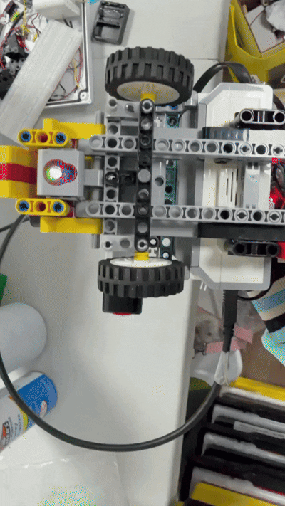

# 4. Ackermann Steering System

Piolín uses a **front-wheel Ackermann-style steering system** actuated by **Motor B**.

Unlike a differential-drive robot, Piolín does not change direction by independently varying the speed of left and right drive wheels. Propulsion and steering are mechanically separated:

```text
Motor A
   ↓
Rear propulsion


Motor B
   ↓
Front steering
```

Motor B changes the orientation of the front wheels through a mechanical linkage, while Motor A continues producing longitudinal motion through the rear drivetrain.

The complete steering chain is:

```text
LEGO EV3
   ↓
Motor B
   ↓
Steering linkage
   ↓
Left + Right steering pivots
   ↓
Front wheel angles
   ↓
Vehicle curvature
```

This architecture gives Piolín car-like mobility and provides the mechanical foundation for:

```text
Wall following

Cornering

Obstacle avoidance

Post-obstacle recovery

Parking maneuvers
```

For the overall vehicle architecture, see:

[Mechanical Architecture](01_mecharchitecture.md)

[Robot Mobility](03_RMobility.md)

---

## 4.1 Current Steering Configuration

The current steering subsystem consists of:

| Component | Current Role |
| :--- | :--- |
| **Motor B** | Steering actuator |
| **Front steering linkage** | Transfers motor motion to the wheels |
| **Left steering pivot** | Controls left front-wheel orientation |
| **Right steering pivot** | Controls right front-wheel orientation |
| **Front wheels** | Produce directional vehicle motion |
| **LEGO Technic chassis** | Maintains steering geometry and alignment |
| **EV3** | Calculates and commands steering position |

The current front wheel diameter is:

```text
D_FRONT = 38.1 mm
```

therefore:

```text
R_FRONT = 19.05 mm
```

and the theoretical circumference is:

```text
C_FRONT = PI × D_FRONT
```

```text
C_FRONT ≈ 119.7 mm
```

The front wheels are primarily responsible for **directional control**, while the larger rear wheels are associated with propulsion.

---

# 4.2 Why Ackermann Steering Is Used

When a four-wheeled vehicle follows a curve, the inner and outer front wheels travel along different radii.

```text
                    TURN CENTER
                         ●


                   smaller radius
                       /
                      /
             INNER WHEEL


                         larger radius
                             /
                            /
                     OUTER WHEEL
```

The inner front wheel must follow a tighter path than the outer front wheel.

If both front wheels were mechanically forced to remain at exactly the same steering angle, their ideal circular paths would not coincide.

Ackermann steering addresses this by allowing:

```text
THETA_INNER > THETA_OUTER
```

during a turn.

This allows the two front wheels to more closely align with their respective trajectories.

---

# 4.3 Steering Motion Evidence

The following GIF shows the physical Piolín steering mechanism moving through its steering range.

<div align="center">



<br>

<sub><b>Figure 4.1.</b> Physical movement of Piolín's front steering mechanism actuated by Motor B.</sub>

</div>

The animation is useful because it shows the complete mechanical relationship between:

```text
Motor B
   ↓
Linkage displacement
   ↓
Left and right steering pivots
   ↓
Front-wheel orientation
```

The GIF provides visual evidence of the actual installed steering mechanism rather than only an idealized steering diagram.

It should not be interpreted as a direct measurement of wheel angle. Its purpose is to document the physical steering motion and mechanical integration.

---

# 4.4 Steering Architecture

The steering mechanism can be separated into three functional layers.

```text
ACTUATION
   ↓
Motor B


TRANSMISSION
   ↓
Mechanical linkage


OUTPUT
   ↓
Front wheel orientation
```

The EV3 does not directly control the physical wheel angles.

Instead:

```text
EV3
 ↓
Motor command
 ↓
Motor B encoder position
 ↓
Mechanical linkage
 ↓
Wheel angle
```

This distinction is fundamental to understanding the steering system.

---

# 4.5 Motor B Is the Steering Actuator

Motor B is dedicated to steering.

Its purpose is not propulsion.

The responsibility separation is:

```text
Motor A
=
Drive


Motor B
=
Steering
```

When the EV3 requests a steering change, Motor B rotates to a commanded actuator position.

That rotation is transferred through the mechanical linkage to the front steering assembly.

Conceptually:

```text
Motor B rotates
       ↓
Linkage moves
       ↓
Steering pivots rotate
       ↓
Front wheels change angle
       ↓
Vehicle path changes
```

Detailed motor information is available in:

[Steering Motor](../components/04_SteeringMotor.md)

---

# 4.6 Motor Angle Is Not Wheel Angle

One of the most important characteristics of Piolín's steering architecture is:

```text
MOTOR B ANGLE
      ≠
FRONT WHEEL ANGLE
```

The motor encoder measures the angular position of the motor shaft.

The front wheel angle is the mechanical result after that motion passes through the steering linkage.

The relationship is therefore:

```text
THETA_MOTOR
      ↓
Linkage Geometry
      ↓
THETA_WHEEL
```

It cannot be assumed that:

```text
Motor B = 20°
```

means:

```text
Front wheel = 20°
```

The actual relationship depends on:

```text
Link lengths

Pivot locations

Mechanical leverage

Connection points

Steering geometry
```

For this reason, software values related to steering should be interpreted as **actuator commands**, not direct physical wheel-angle measurements.

---

# 4.7 Mechanical Steering Center

Piolín requires a neutral steering reference.

This corresponds approximately to the front wheels being aligned with the longitudinal axis of the vehicle.

```text
LEFT TURN          CENTER          RIGHT TURN

    \                 |                 /
     \                |                /
      \               |               /
```

The center position forms the reference from which steering corrections are applied.

The relationship should be:

```text
SOFTWARE STEERING CENTER
            ≈
PHYSICAL MECHANICAL CENTER
```

If these do not correspond closely:

```text
Software requests straight
        ↓
Front wheels remain angled
        ↓
Robot follows curved path
        ↓
Wall controller begins compensating
```

A poor steering-center reference can therefore appear as a software navigation problem even when the original cause is mechanical.

---

# 4.8 Left and Right Steering

Motor B must support steering movement in both directions.

Conceptually:

```text
Negative steering direction
        ↓
One turning direction


0 / neutral
        ↓
Approximately straight


Positive steering direction
        ↓
Opposite turning direction
```

The exact software sign convention depends on how Motor B is installed and how steering commands are defined in the program.

The physically important relationship is:

```text
COMMAND LEFT
     ↓
Front wheels rotate toward left-turn geometry


COMMAND RIGHT
     ↓
Front wheels rotate toward right-turn geometry
```

---

# 4.9 Steering Limits

The mechanism has finite physical travel.

The usable steering region can be represented as:

```text
MAX LEFT
    │
    │<--------- USABLE RANGE --------->│
                                       │
                                  MAX RIGHT
```

The steering linkage cannot rotate indefinitely.

Software must therefore prevent steering requests from forcing the mechanism beyond its intended range.

Excessive commands can cause:

```text
Mechanical binding

Increased motor load

Linkage stress

Delayed recovery

Inconsistent steering position
```

The steering system should therefore be treated as a **bounded actuator**.

---

# 4.10 Steering Clamp

A software steering clamp can represent this physical limitation.

Conceptually:

```python
if steering_command > MAX_STEER:
    steering_command = MAX_STEER

elif steering_command < -MAX_STEER:
    steering_command = -MAX_STEER
```

The exact final steering constants belong to the active competition software rather than this mechanical document.

The engineering principle is:

```text
Calculated steering request
        ↓
Mechanical limit applied
        ↓
Safe actuator command
```

This prevents software calculations from demanding movement beyond what the physical mechanism can achieve.

---

# 4.11 Ideal Ackermann Geometry

For an ideal Ackermann steering system:

```text
THETA_INNER
>
THETA_OUTER
```

during a turn.

The ideal geometric relationship can be written as:

```text
cot(THETA_OUTER) - cot(THETA_INNER)
=
W / L
```

where:

```text
THETA_INNER
=
Inner front-wheel angle


THETA_OUTER
=
Outer front-wheel angle


W
=
Front track width


L
=
Wheelbase
```

Another representation uses the desired turning radius `R`.

```text
THETA_INNER =
atan(L / (R - W/2))
```

and:

```text
THETA_OUTER =
atan(L / (R + W/2))
```

These equations describe the **ideal geometric principle**.

No final numerical values for `W` or `L` are inserted here because the current final front track and wheelbase have not been established as confirmed measurements in the current documentation.

---

# 4.12 Why the Inner Wheel Turns More

Consider a left turn.

```text
                   TURN CENTER
                        ●

               LEFT FRONT
                   \
                    \
                     \

                       \ RIGHT FRONT
                        \
```

The left front wheel is closer to the center of rotation.

Therefore:

```text
R_LEFT < R_RIGHT
```

The left wheel must consequently point toward a tighter circular path.

This requires:

```text
THETA_LEFT > THETA_RIGHT
```

for the ideal left-turn condition.

For a right turn, the roles reverse.

---

# 4.13 Steering Radius

A simplified bicycle model can approximate the relationship between steering and turning radius.

```text
R =
L / tan(DELTA)
```

where:

```text
R
=
Turning radius


L
=
Wheelbase


DELTA
=
Equivalent steering angle
```

Therefore:

```text
Small DELTA
     ↓
Large R
     ↓
Broad curve
```

while:

```text
Large DELTA
     ↓
Small R
     ↓
Tighter curve
```

This relationship explains why stronger steering produces a tighter vehicle trajectory.

The real Piolín steering behavior also depends on the physical linkage and dynamic conditions.

---

# 4.14 Ackermann vs. Parallel Steering

A parallel steering arrangement would maintain:

```text
THETA_LEFT
≈
THETA_RIGHT
```

during a turn.

Ackermann steering instead aims for:

```text
THETA_INNER
>
THETA_OUTER
```

This better matches the fact that each front wheel travels around a different radius.

Conceptually:

```text
PARALLEL

\          \
 \          \


ACKERMANN

\           \
 \           \
  \           \
```

The difference may appear small mechanically, but it changes how the wheel paths relate to the turning center.

---

# 4.15 Real Ackermann vs. Ideal Ackermann

Piolín uses an **Ackermann-style LEGO linkage**.

It should not be described as mathematically perfect Ackermann geometry.

Real steering systems are affected by:

```text
Discrete LEGO geometry

Linkage dimensions

Pin clearance

Mechanical play

Component flexibility

Available mounting points
```

Therefore:

```text
REAL PIOLÍN STEERING
       ≈
ACKERMANN PRINCIPLE
```

rather than:

```text
REAL PIOLÍN STEERING
       =
PERFECT IDEAL ACKERMANN
```

This distinction keeps the mechanical documentation consistent with the actual physical robot.

---

# 4.16 Why Ackermann Geometry Matters

During a curve, each front wheel follows a different trajectory.

If the steering geometry does not accommodate this difference, the tires may experience additional lateral scrub.

Conceptually:

```text
Ideal wheel orientation
        ↓
Wheel points approximately
along its local path
```

compared with:

```text
Geometrically incompatible orientation
        ↓
Wheel direction and path differ
        ↓
Additional lateral tire deformation / slip
```

Ackermann-style steering helps reduce this geometric conflict.

The practical benefit for Piolín is more predictable car-like turning behavior.

---

# 4.17 Steering and Tire Scrub

Tire scrub occurs when the direction a wheel is pointing does not perfectly match the direction in which its contact patch is moving.

During a turn:

```text
Wheel orientation
       +
Actual wheel trajectory
       ↓
Tire-track interaction
```

Ackermann geometry attempts to make these directions more compatible.

However, real Piolín motion still includes:

```text
Tire deformation

Mechanical play

Surface friction

Dynamic loading
```

so some difference between ideal geometry and real behavior can remain.

---

# 4.18 Steering Linkage as a Mechanical Transmission

The steering linkage behaves as a mechanical transmission between Motor B and the wheels.

It transforms:

```text
Motor rotation
```

into:

```text
Steering displacement
```

and then:

```text
Wheel rotation about steering pivots
```

This means the linkage defines a mechanical relationship similar to a transmission ratio, although it may not remain perfectly constant throughout the full steering range.

Conceptually:

```text
Motor displacement
      ↓
Mechanical leverage
      ↓
Wheel displacement
```

This is another reason that motor angle and wheel angle are not interchangeable.

---

# 4.19 Linkage Geometry Can Be Non-Linear

The relationship between Motor B position and front-wheel angle may be non-linear.

For example:

```text
First 10° of motor motion
```

does not necessarily produce the same wheel-angle change as:

```text
Next 10° of motor motion
```

because linkage geometry changes as the mechanism rotates.

Therefore:

```text
DELTA_WHEEL
/
DELTA_MOTOR
```

can vary with steering position.

This is normal for many linkage-based steering systems.

---

# 4.20 Structural Support

The steering mechanism depends heavily on the chassis.

The fixed structure must support:

```text
Motor B

Left steering pivot

Right steering pivot

Linkage anchoring points
```

while allowing only the intended components to move.

The desired relationship is:

```text
Fixed chassis
      ↓
Stable reference

Moving linkage
      ↓
Controlled motion
```

If the fixed structure moves significantly under steering load, some Motor B motion can be lost to structural deformation rather than changing wheel position.

---

# 4.21 Mechanical Play

LEGO steering mechanisms contain some unavoidable clearance between:

```text
Pins

Axles

Connectors

Pivot elements

Linkage joints
```

This creates mechanical play.

Conceptually:

```text
Motor begins reversing
        ↓
Small movement may first
take up mechanical clearance
        ↓
Wheel response begins
```

Therefore, steering direction changes may not be perfectly instantaneous.

The design objective is to **minimize unnecessary play**, not to claim that the mechanism has zero backlash.

---

# 4.22 Why Steering Reversal Matters

Piolín frequently changes steering direction during autonomous navigation.

For example:

```text
Correction left
      ↓
Error reduced
      ↓
Correction right
```

or during obstacle behavior:

```text
Avoid pillar
      ↓
Reverse steering direction
      ↓
Recover toward normal path
```

If steering reversals occur excessively:

```text
Mechanical play is repeatedly crossed

Motor direction changes repeatedly

Vehicle trajectory can oscillate
```

This is one reason steering software should avoid unnecessary rapid left-right commands.

---

# 4.23 Steering and Wall Following

During normal wall following, steering corrections should usually be relatively small compared with full cornering.

Conceptually:

```text
Inner wall error
      ↓
Small steering request
      ↓
Vehicle follows shallow curve
      ↓
Wall-distance error decreases
      ↓
Steering moves toward center
```

The objective is not to continuously steer aggressively.

It is to make enough correction to maintain a useful track-relative trajectory.

---

# 4.24 Steering and Zig-Zag

If the wall controller commands too much steering:

```text
Too close to wall
        ↓
Strong steering away
        ↓
Robot overshoots desired region
        ↓
Strong steering back
        ↓
Robot overshoots again
```

producing:

```text
~ ~ ~ ~ ~ ~
```

instead of a smoother path:

```text
────────────
```

The mechanical steering system itself may be functioning correctly while the control magnitude is too aggressive.

Therefore, distinguishing between:

```text
Mechanical steering problem
```

and:

```text
Control tuning problem
```

is important during development.

---

# 4.25 Steering During Corners

Corners require significantly larger steering movement than normal wall-following corrections.

The physical sequence is:

```text
Straight navigation
        ↓
Corner detected
        ↓
Motor B moves farther from center
        ↓
Front wheel angles increase
        ↓
Turning radius decreases
        ↓
Vehicle rotates through corner
```

Once the corner is completed:

```text
Motor B returns toward center
        ↓
Turning radius increases
        ↓
Vehicle transitions back toward straight motion
```

This makes cornering a controlled change in curvature rather than an instantaneous rotation.

---

# 4.26 Corner Entry

A corner cannot be executed instantaneously because Piolín has finite:

```text
Steering speed

Vehicle velocity

Mechanical response
```

The sequence is:

```text
Corner condition detected
        ↓
Steering command changes
        ↓
Motor B begins moving
        ↓
Front wheel angles change
        ↓
Vehicle curvature changes
```

This introduces a difference between:

```text
Moment the corner is detected
```

and:

```text
Moment the vehicle reaches full turning response
```

The corner-handling software must account for this physical behavior.

---

# 4.27 Corner Exit

The steering system also determines how quickly Piolín exits a curve.

If steering remains aggressive for too long:

```text
Corner already completed
        ↓
Wheels remain strongly turned
        ↓
Robot continues rotating
        ↓
Vehicle approaches wrong side of track
```

Therefore:

```text
Corner exit detection
        ↓
Steering reduction
        ↓
Trajectory opens
        ↓
Wall-following resumes
```

The physical steering recovery is just as important as the initial corner entry.

---

# 4.28 Steering and Vehicle Speed

The same steering angle does not necessarily produce the same real-world behavior at every speed.

Geometrically:

```text
Same steering angle
        ↓
Similar ideal radius
```

but dynamically:

```text
Higher speed
        ↓
Greater lateral acceleration
```

because:

```text
A_LATERAL =
V² / R
```

Therefore:

```text
Higher V
      ↓
Greater lateral demand
      ↓
More sensitivity to steering behavior
```

This is why steering and propulsion tuning must be considered together.

---

# 4.29 Steering and Momentum

Piolín has a measured mass of:

```text
0.80476 kg
```

When moving, the robot has momentum:

```text
p =
m × v
```

Changing steering does not instantly redirect this momentum.

Therefore:

```text
Steering command changes
        ↓
Wheel direction changes
        ↓
Tire forces change
        ↓
Vehicle trajectory changes progressively
```

This explains why the robot may continue moving along its previous trajectory briefly after a new steering command.

---

# 4.30 Steering and Obstacle Avoidance

During the Obstacle Challenge, steering performs a different role.

The HuskyLens identifies the pillar, but the steering mechanism physically executes the avoidance path.

```text
Pillar detected
      ↓
Passing side selected
      ↓
EV3 calculates response
      ↓
Motor B
      ↓
Steering linkage
      ↓
Avoidance trajectory
```

In the current obstacle configuration:

```text
GREEN
ID 1
   ↓
Pass on LEFT
```

and:

```text
RED
ID 2
  ↓
Pass on RIGHT
```

The camera therefore determines the required passing side, while the steering system determines the actual vehicle path.

---

# 4.31 Obstacle Avoidance Requires More Than One Steering Angle

Because Piolín cannot move sideways directly, a complete obstacle maneuver generally requires a sequence of curved trajectories.

Conceptually:

```text
Normal path
     ↓
Steer away from pillar
     ↓
Vehicle shifts laterally
     ↓
Pillar clearance
     ↓
Steering changes
     ↓
Vehicle recovers
     ↓
Normal path
```

Therefore:

```text
AVOIDANCE
      ≠
Single steering command
```

Instead:

```text
AVOIDANCE
      =
Trajectory sequence
```

The steering system must be able to transition smoothly between these stages.

---

# 4.32 Post-Obstacle Steering Recovery

Once the pillar is cleared, obstacle steering should no longer dominate the trajectory.

The physical recovery sequence is:

```text
Pillar cleared
      ↓
Avoidance steering reduced
      ↓
Wall geometry evaluated
      ↓
Motor B changes toward recovery position
      ↓
Vehicle moves toward normal path
      ↓
Steering returns toward center
```

This prevents Piolín from continuing the avoidance arc after it is no longer required.

---

# 4.33 Steering and Lateral Wall Safety

Obstacle steering cannot be considered independently from wall clearance.

For example:

```text
Pillar logic requests LEFT
```

while:

```text
Left ultrasonic indicates
limited available space
```

The EV3 must prevent the obstacle maneuver from simply replacing one collision risk with another.

Conceptually:

```text
Obstacle request
       +
Wall geometry
       ↓
Constrained steering response
```

The steering motor is the final actuator receiving this combined decision.

---

# 4.34 Front Ultrasonic and Steering

The S1 front ultrasonic sensor has a different responsibility.

It provides frontal safety information.

If normal steering and propulsion would continue toward a close frontal obstacle:

```text
Front distance
      ↓
Safety condition
      ↓
Normal mobility can be interrupted
```

The front sensor does not calculate the Ackermann wheel geometry.

It influences whether ordinary steering and drive behavior should continue.

This separation keeps:

```text
STEERING MECHANICS
```

distinct from:

```text
FRONTAL SAFETY
```

---

# 4.35 Steering Without a Gyroscope

The current Piolín architecture does not use a gyro to control steering heading.

Instead, the steering response is determined from environmental references such as:

```text
Left wall

Right wall

Corner geometry

Front safety

Obstacle information

Course state
```

The general relationship is:

```text
ENVIRONMENTAL ERROR
       ↓
EV3
       ↓
STEERING COMMAND
       ↓
Motor B
```

The previous gyro-based approach is preserved only in:

[Legacy Gyroscope Configuration](../legacy/01_GConfig.md)

---

# 4.36 Steering During Reverse Motion

Piolín can also move in reverse.

The physical wheel orientation remains controlled by Motor B, but vehicle velocity changes direction.

Conceptually:

```text
Same front wheel angle
        +
Forward velocity
        ↓
One curved trajectory
```

while:

```text
Same front wheel angle
        +
Reverse velocity
        ↓
Opposite heading evolution
```

This is the same basic behavior observed when reversing a car.

It allows Piolín to perform repositioning and parking-related maneuvers without requiring a separate rear steering mechanism.

---

# 4.37 Steering During Parking

Parking depends heavily on the Ackermann steering system because Piolín cannot rotate in place.

A parking maneuver may require:

```text
Approach
   ↓
Steering change
   ↓
Reverse movement
   ↓
Vehicle rotation
   ↓
Steering adjustment
   ↓
Final positioning
```

The front-wheel steering geometry defines the shape of this path.

Parking therefore demonstrates one of the strongest differences between Piolín and a differential-drive robot.

Detailed parking strategy:

[Parking Overview](../software_obstacles_strategy/parking/01_ParkingOverview.md)

---

# 4.38 Steering and Swept Path

Piolín has confirmed overall dimensions of:

```text
Length = 210 mm

Width = 150 mm
```

During a turn, the entire vehicle occupies a larger swept region than its straight-line footprint.

Conceptually:

```text
          Front outside corner
                 ↓
            wider path


      ┌──────────────┐
      │    PIOLÍN    │
      └──────────────┘
           \
            \
             curved movement
```

The outside front region may sweep outward while the inside rear region follows a tighter trajectory.

Steering must therefore account for the physical chassis rather than only the path of one wheel.

---

# 4.39 Steering and Sensor Geometry

Changing the steering angle changes the orientation of the entire chassis as the robot moves.

That affects what the lateral ultrasonic sensors observe.

```text
Motor B changes
      ↓
Front wheel angles change
      ↓
Vehicle heading changes
      ↓
Ultrasonic orientation relative to walls changes
      ↓
Distance readings change
```

Therefore, steering influences sensor measurements indirectly.

This creates a feedback relationship:

```text
SENSOR
   ↓
STEERING
   ↓
VEHICLE MOTION
   ↓
NEW SENSOR READING
```

---

# 4.40 Steering and Color Sensor

The color sensor does not directly modify front-wheel geometry.

Instead, it provides course-state information.

For example:

```text
BLUE first
     ↓
Counterclockwise
```

or:

```text
ORANGE first
      ↓
Clockwise
```

This changes which lateral ultrasonic sensor is interpreted as the inner-wall sensor.

The resulting wall logic then affects the steering command.

Therefore:

```text
COLOR
   ↓
Navigation interpretation
   ↓
Steering behavior
```

rather than:

```text
COLOR
   ↓
Direct mechanical steering
```

---

# 4.41 Steering Control Hierarchy

Several navigation systems can influence the requested steering direction.

At the system level, a useful priority structure is:

```text
FRONT COLLISION SAFETY
        ↓
LATERAL WALL SAFETY
        ↓
OBSTACLE / CORNER RESPONSE
        ↓
NORMAL WALL FOLLOWING
```

This prevents independent controllers from treating Motor B as if each had exclusive control.

Ultimately:

```text
Multiple navigation inputs
        ↓
One final steering command
        ↓
Motor B
```

The exact software implementation belongs to the software documentation.

---

# 4.42 Why Independent Steering Commands Can Conflict

Suppose wall following requests:

```text
Steer slightly LEFT
```

while obstacle logic requests:

```text
Steer strongly RIGHT
```

If both commands are independently applied without coordination:

```text
Conflicting control
       ↓
Rapid direction changes
       ↓
Oscillation / unstable path
```

The mechanical steering system can only occupy one physical position at a time.

Therefore, the software must produce a coherent final target for Motor B.

---

# 4.43 Progressive Steering

Not every navigation error requires maximum steering.

A progressive strategy can conceptually produce:

```text
Small error
   ↓
Small steering


Medium error
   ↓
Medium steering


Large error
   ↓
Larger steering
```

This allows the robot to make gentle corrections during normal wall following while reserving larger steering motion for:

```text
Corners

Obstacle avoidance

Emergency trajectory recovery
```

This use of variable steering magnitude better matches the mechanical capabilities of a car-like platform.

---

# 4.44 Steering Smoothing

Rapid changes in target steering can cause abrupt mechanical motion.

Conceptually:

```text
+Large command
      ↓
-Large command
      ↓
+Large command
```

can create:

```text
Motor reversals

Mechanical play transitions

Vehicle oscillation
```

A software controller can therefore limit how rapidly the requested steering position changes.

The exact smoothing algorithm is software-dependent, but mechanically the objective is:

```text
Calculated target
      ↓
Controlled transition
      ↓
Motor B movement
```

rather than demanding unnecessary instantaneous reversals.

---

# 4.45 Steering Center Recovery

After a large corner or obstacle maneuver, Motor B must return toward the normal steering region.

This process can be represented as:

```text
Large steering angle
        ↓
Maneuver completed
        ↓
Steering reduced
        ↓
Vehicle curvature decreases
        ↓
Wall geometry stabilizes
        ↓
Normal corrections resume
```

Returning the motor toward neutral does not instantaneously center the robot.

It only changes the future curvature.

The vehicle still requires physical travel to recover its track position.

---

# 4.46 Why Centering Is Not the Same as Steering Center

Two different concepts must not be confused.

### Steering center

```text
Front wheels approximately straight
```

### Track centering

```text
Robot positioned appropriately
between track boundaries
```

A robot can have:

```text
Steering = center
```

while still being:

```text
Too close to left wall
```

Similarly, Piolín may need a temporary steering correction even when its current lateral position is near the desired region.

Therefore:

```text
STEERING CENTER
      ≠
TRACK CENTER
```

---

# 4.47 Steering Delay

There is a finite response time between an EV3 decision and a new vehicle trajectory.

```text
EV3 computes command
       ↓
Motor B begins rotating
       ↓
Linkage moves
       ↓
Wheel angles change
       ↓
Tire forces change
       ↓
Vehicle trajectory changes
```

At greater drive speeds, the robot travels farther during this response interval.

Therefore, steering timing cannot be separated from propulsion speed.

---

# 4.48 Mechanical Steering Failure Propagation

A mechanical steering issue can create errors in several other subsystems.

For example:

```text
Loose steering linkage
        ↓
Wheel does not reach expected position
        ↓
Vehicle deviates
        ↓
Ultrasonic distance changes
        ↓
Controller requests correction
        ↓
Motor B works harder
```

The software may appear unstable even though the root cause is mechanical.

This is why steering diagnostics must consider both:

```text
CONTROL
```

and:

```text
MECHANICS
```

---

# 4.49 Current Steering vs. Legacy Systems

The final Piolín steering architecture is:

```text
LEGO EV3
    ↓
Motor B
    ↓
LEGO mechanical linkage
    ↓
Ackermann-style front steering
```

It does not use:

```text
External steering servo

Raspberry Pi PWM steering

Arduino Mega as main controller

Gyroscope-based heading control
```

Those concepts belong to earlier development stages.

Historical configurations are preserved in:

[Legacy Documentation](../legacy/00_LEGACY_NOTICE.md)

---

# 4.50 Confirmed Steering-Related Specifications

The currently confirmed steering-related information is:

| Parameter | Current Value |
| :--- | :--- |
| **Steering actuator** | Motor B |
| **Steering type** | Ackermann-style front steering |
| **Driven axle** | Rear |
| **Front wheel diameter** | 38.1 mm |
| **Front wheel radius** | 19.05 mm |
| **Front wheel circumference** | ~119.7 mm |
| **Main controller** | LEGO EV3 |
| **Steering reference** | Mechanical center + software command |

No final numerical value is claimed here for:

```text
Wheelbase

Front track width

Maximum physical wheel angle

Minimum turning radius

Motor-to-wheel steering ratio

Steering response time
```

because those values have not been established as confirmed final measurements in the current documentation.

---

# 4.51 Steering Responsibility Matrix

| Steering Requirement | Primary Element |
| :--- | :--- |
| **Generate steering motion** | Motor B |
| **Transfer motor movement** | Steering linkage |
| **Provide different wheel paths** | Ackermann-style geometry |
| **Maintain mechanism alignment** | Chassis |
| **Define neutral position** | Mechanical steering center |
| **Restrict excessive movement** | Mechanical/software limits |
| **Wall correction** | EV3 + lateral ultrasonic data |
| **Corner steering** | EV3 navigation logic |
| **Obstacle avoidance** | EV3 + HuskyLens information |
| **Post-obstacle recovery** | EV3 + wall feedback |
| **Reverse steering** | Motor B + reverse propulsion |
| **Parking trajectory** | Drive + steering coordination |

---

# 4.52 Steering as a Closed-Loop System

The steering mechanism forms part of a larger closed-loop navigation system.

```text
TRACK GEOMETRY
       ↓
SENSORS
       ↓
LEGO EV3
       ↓
STEERING CALCULATION
       ↓
Motor B
       ↓
STEERING LINKAGE
       ↓
FRONT WHEELS
       ↓
VEHICLE TRAJECTORY
       ↓
NEW TRACK POSITION
       ↓
NEW SENSOR DATA
```

This loop repeats continuously while Piolín is moving.

The steering mechanism is therefore the physical actuator that closes the connection between environmental perception and directional vehicle motion.

---

# 4.53 Engineering Significance

The steering architecture is one of the most important mechanical decisions in Piolín.

It directly influences:

```text
Turning radius

Corner behavior

Wall-following stability

Obstacle bypass geometry

Recovery trajectory

Parking capability
```

It also creates a strong relationship between software and physical construction.

The same calculated steering command can only be useful if:

```text
Motor B is correctly mounted

Mechanical center is consistent

Linkage geometry is maintained

Wheel supports remain aligned

The chassis remains sufficiently stable
```

The steering system therefore cannot be considered only a motor-control problem.

It is a combined:

```text
MECHANICAL
     +
GEOMETRIC
     +
CONTROL
```

problem.

---

# 4.54 Final Steering Architecture

Piolín's final steering system can be summarized as:

```text
                   NAVIGATION INPUT
                         ↓
                     LEGO EV3
                         ↓
                 Steering Command
                         ↓
                      Motor B
                         ↓
                 Mechanical Linkage
                    /          \
                   /            \
                  ▼              ▼
           Left Front        Right Front
              Wheel             Wheel
                  \              /
                   \            /
                    ACKERMANN
                    GEOMETRY
                        ↓
                 VEHICLE CURVATURE
```

The architecture gives Piolín a car-like method of changing direction.

Motor B determines actuator position.

The steering linkage transforms that movement.

The two front wheels follow related but different steering angles.

Motor A continues providing rear propulsion.

Together:

```text
PROPULSION
     +
STEERING
     ↓
VEHICLE TRAJECTORY
```

The steering system enables Piolín to perform:

```text
Small wall corrections

Broad trajectory adjustments

Track corners

Obstacle avoidance

Post-obstacle recovery

Reverse repositioning

Parking maneuvers
```

while maintaining the same fundamental mechanical architecture throughout the run.

The animation in **Figure 4.1** provides direct visual evidence of this physical steering mechanism operating on the current Piolín robot.

---

## Continue Reading

[Drivetrain](05_drivetrain.md)

[Mechanical Testing](06_testing.md)

Return to:

[Mechanical Architecture](01_mecharchitecture.md)

[Chassis Design](02_chassis.md)

[Robot Mobility](03_RMobility.md)

Related documentation:

[Steering Motor](../components/04_SteeringMotor.md)

[Motors](../components/03_Motors.md)

[Wall Following](../software_obstacles_strategy/03_wallfollowing.md)

[Corner Handling](../software_obstacles_strategy/04_cornerhandling.md)

[Obstacle Strategy](../software_obstacles_strategy/06_obstaclestrateg.md)

[Parking Overview](../software_obstacles_strategy/parking/01_ParkingOverview.md)
