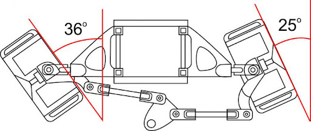
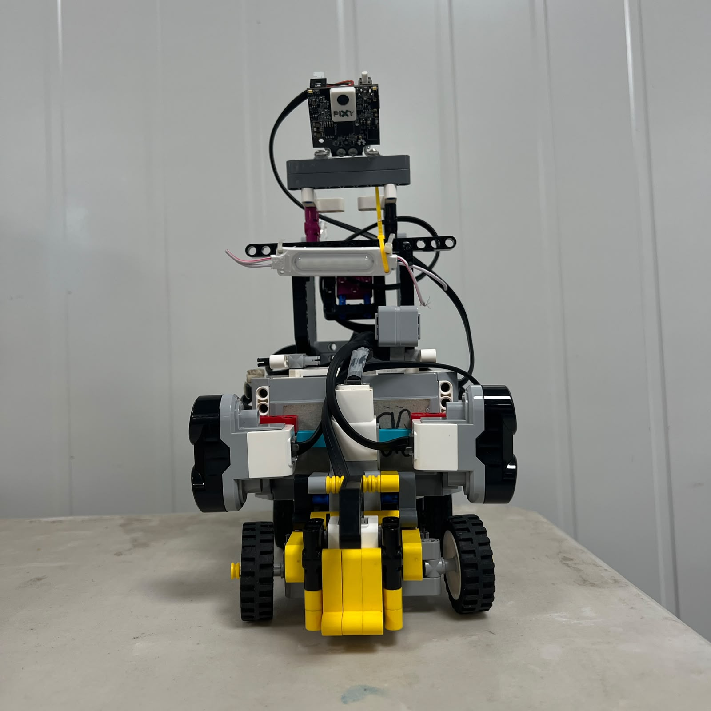
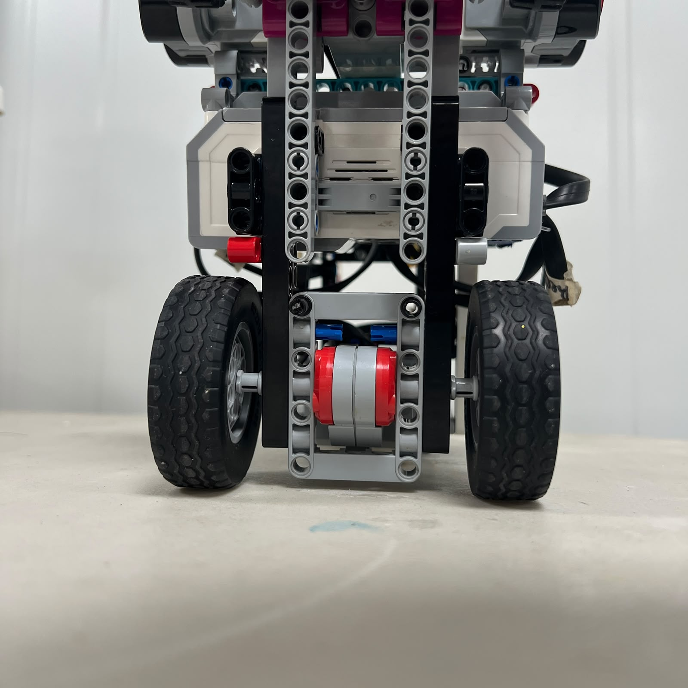

# 6. Mobility and Mechanical Testing

<div align="center">


<br>

<sub><b>Figure 6.1.</b> Full competition-style track used to evaluate Piolín's mobility system under representative driving conditions.</sub>

</div>

Piolín's mechanical design is evaluated through repeated physical testing rather than only through visual inspection or theoretical calculations. The purpose of the testing process is to determine whether the drivetrain, steering system, wheels, chassis, and vehicle geometry produce sufficiently repeatable behavior for autonomous navigation.

The main mechanical subsystems tested are:

```text
steering center

steering range

left/right steering behavior

drivetrain freedom

forward movement

reverse movement

straight-line stability

corner execution

obstacle maneuvering

post-obstacle recovery

parking
```

Testing is also used to separate software problems from mechanical problems.

A robot can produce an incorrect trajectory because:

```text
the controller made the wrong decision
```

but it can also fail because:

```text
the mechanical system did not reproduce
the commanded motion correctly
```

For this reason, Piolín's testing process evaluates both the **command** and the **physical response**.

---

## 6.1 Purpose of Mechanical Testing

The objective of mobility testing is not simply to prove that Piolín can move.

A useful autonomous mobility system must be:

```text
repeatable

predictable

mechanically stable

controllable

consistent between runs
```

A drivetrain that works once but changes behavior after several runs is difficult to calibrate.

Likewise, a steering system that reaches a different physical center each time cannot provide a stable reference for wall following, cornering, obstacle avoidance, or parking.

The testing process therefore asks questions such as:

```text
Does Motor B return to the same center?

Do equal left/right commands create similar behavior?

Does the drivetrain travel repeatable distances?

Does reverse motion behave consistently?

Does a corner exit into a useful position?

Does Piolín recover after avoiding a pillar?

Does parking finish in a repeatable area?
```

These questions connect mechanical design directly to autonomous performance.

---

# 6.2 Testing Philosophy

Piolín's testing process follows a simple principle:

> **Change as few variables as possible between two tests.**

If several software and mechanical variables are changed at the same time, it becomes difficult to identify which change caused the observed result.

A useful experimental comparison should therefore try to preserve:

```text
same robot configuration

same starting position

same track

same battery condition

same software version

same sensor arrangement
```

while changing only the variable being investigated.

For example, a steering test should not simultaneously change:

```text
Motor B command

Motor A speed

starting position

steering linkage
```

unless the purpose of the experiment is explicitly to evaluate their interaction.

---

## 6.3 Mechanical Condition Before Testing

Before collecting useful test evidence, Piolín should first be placed in a known mechanical condition.

The inspection sequence includes:

```text
rear wheels secure

drivetrain free

Motor A mount secure

Motor B mount secure

steering linkage connected

front pivots free

steering center checked

ultrasonic mounts stable

Color Sensor mount stable

S1 device correct for the round
```

The reason is straightforward:

```text
unstable hardware
→ unstable experiment
```

A controller cannot be meaningfully compared across trials if the robot itself changes mechanically between them.

---

# 6.4 Test Environment

<div align="center">


<br>

<sub><b>Figure 6.2.</b> Mechanical tests should progress from isolated subsystem tests to representative full-track runs.</sub>

</div>

Piolín is tested at several levels.

The first level isolates the subsystem as much as possible:

```text
steering while stationary

manual drivetrain inspection

encoder movement

wheel alignment
```

The second level introduces controlled vehicle motion:

```text
short straight

single steering maneuver

single reverse maneuver

single corner
```

The final level uses the complete track:

```text
multiple corners

three-lap Open behavior

obstacle sequence

recovery

parking
```

This progression helps prevent a full-track failure from hiding the original cause.

---

# 6.5 Test Progression

A useful progression is:

```text
STATIC MECHANICAL TEST
          ↓
LOW-SPEED MOTION TEST
          ↓
ISOLATED MANEUVER
          ↓
REPEATED MANEUVER
          ↓
MULTI-MANEUVER TEST
          ↓
FULL RUN
```

Each level adds additional variables.

For example, a full Obstacle Challenge run combines:

```text
camera detection

steering

drivetrain

walls

multiple pillars

corners

recovery

parking
```

If the robot cannot reproduce a simple steering-center test, testing all of those variables together would provide little useful diagnostic information.

---

# 6.6 Steering Center Test

<div align="center">


<br>

<sub><b>Figure 6.3.</b> Mechanical center is the first reference used during steering testing.</sub>

</div>

The steering-center test determines whether Motor B can repeatedly return the front wheels to approximately the same neutral orientation.

A test sequence can use:

```text
CENTER
  ↓
LEFT
  ↓
CENTER
  ↓
RIGHT
  ↓
CENTER
```

and repeat the cycle several times.

The observation should answer:

```text
Do the wheels return to the same visual center?

Does center depend on the direction from which it was approached?

Does Motor B stop at the expected position?

Is there visible linkage play?
```

A different center when approached from the left and right can indicate backlash or mechanical clearance.

---

## 6.7 Why Center Repeatability Matters

Steering center influences every other mobility test.

If center changes:

```text
straight-line behavior changes
```

which then changes:

```text
wall distance

corner approach

obstacle approach

parking alignment
```

Therefore a small center error can propagate into many apparently unrelated failures.

The steering-center test should be repeated after:

```text
front structure changes

Motor B remounting

linkage changes

wheel-support changes
```

before the previous software calibration is reused.

---

# 6.8 Steering Range Test

<div align="center">


<br>

<sub><b>Figure 6.4.</b> Left-side usable steering limit.</sub>

</div>

<div align="center">


<br>

<sub><b>Figure 6.5.</b> Right-side usable steering limit.</sub>

</div>

The steering-range test identifies the mechanically useful limits of Motor B.

The purpose is not to force the system to its absolute maximum.

Instead, the test identifies the range where:

```text
linkage remains free

wheels move predictably

no structure is contacted

Motor B is not pushing against a hard stop
```

These physical observations establish the safe region within which software steering limits should later be selected.

---

# 6.9 Steering Angle Characterization

<div align="center">



<br>

<sub><b>Figure 6.6.</b> Steering-angle reference used to characterize the relationship between Motor B command and physical wheel orientation.</sub>

</div>

A more detailed test can relate:

```text
Motor B position
```

to:

```text
left wheel angle

right wheel angle
```

A measurement table can use the following format:

| Trial Position | Motor B Reference | Left Wheel Angle | Right Wheel Angle |
| :--- | :---: | :---: | :---: |
| Maximum useful left | — | — | — |
| Intermediate left | — | — | — |
| Center | — | — | — |
| Intermediate right | — | — | — |
| Maximum useful right | — | — | — |

The table should only be populated with measured V4 values.

The purpose is to document that:

```text
motor encoder angle
```

and:

```text
wheel steering angle
```

are different physical quantities.

---

# 6.10 Left/Right Steering Comparison

A steering system should also be tested for practical symmetry.

Equal-magnitude Motor B commands can be applied in opposite directions:

```text
-X
```

and:

```text
+X
```

The physical responses can then be compared.

Relevant observations include:

```text
wheel angle

turning strength

motor effort

response time

mechanical interference
```

The objective is not to force perfect mathematical symmetry.

Instead, the test determines whether the difference between sides is important enough to affect autonomous control.

If a consistent difference exists, software can later treat left and right maneuvers separately.

---

# 6.11 Steering Motion Test

<div align="center">


<br>

<sub><b>Figure 6.7.</b> Dynamic steering movement used to inspect smoothness, delay, and mechanical play.</sub>

</div>

Static photographs show the final positions.

The GIF demonstrates the movement between them.

During this test, the team can observe:

```text
smoothness

linkage delay

backlash

left/right response difference

binding

mechanical vibration
```

This matters because autonomous steering consists mainly of **transitions**, not only fixed positions.

Piolín frequently changes between:

```text
straight correction

corner steering

obstacle avoidance

countersteering

recovery
```

The transition quality therefore matters as much as the final steering angle.

---

# 6.12 Straight-Line Test

<div align="center">



<br>

<sub><b>Figure 6.8.</b> Front alignment of the vehicle provides a mechanical reference before straight-line testing.</sub>

</div>

The straight-line test evaluates the complete relationship between:

```text
steering center

rear-wheel alignment

drivetrain

vehicle structure
```

A basic test should use:

```text
same start position

Motor B at center

same Motor A command

same travel distance
```

and repeat the run several times.

The final position can then be compared.

Useful observations include:

```text
lateral drift direction

final lateral displacement

whether drift is consistent or random

whether the vehicle remains mechanically stable
```

A consistent drift can indicate a fixed bias.

A highly variable drift can indicate mechanical play, sensor influence, surface variation, or inconsistent starting geometry.

---

# 6.13 Mechanical Straight-Line Bias

If Piolín consistently moves toward one side with Motor B physically centered, possible causes include:

```text
front-wheel alignment

rear-axle alignment

unequal wheel resistance

chassis geometry

steering-center offset
```

The appropriate response is not immediately:

```text
increase steering correction
```

The preferred sequence is:

```text
inspect wheels
      ↓
inspect steering center
      ↓
inspect drivetrain
      ↓
repeat straight test
      ↓
then modify software if necessary
```

This prevents software from compensating for a mechanical fault that may later change.

---

# 6.14 Drivetrain Inspection Test

<div align="center">


<br>

<sub><b>Figure 6.9.</b> Rear drivetrain should be inspected before propulsion tests are interpreted as software results.</sub>

</div>

The drivetrain test begins with the robot powered off.

The rear-wheel system should be inspected for:

```text
unexpected resistance

wheel rubbing

axle movement

gear binding

structural movement

unequal left/right behavior
```

A change in any of these can alter:

```text
acceleration

vehicle speed

reverse behavior

encoder-distance relationship
```

without any software modification.

---

# 6.15 Rear-Wheel Test

<div align="center">



<br>

<sub><b>Figure 6.10.</b> Rear-wheel condition and alignment are included in drivetrain testing.</sub>

</div>

The rear wheels should be inspected for:

```text
secure attachment

free rotation

similar condition

clearance from chassis

axle stability
```

Because Motor A is the only propulsion actuator, drivetrain irregularities directly influence the complete vehicle speed.

A wheel rubbing against the chassis can create a navigation symptom that appears similar to a weak motor or low drive command.

---

# 6.16 Encoder-to-Distance Test

Motor A's encoder can be used as a repeatable rotational reference.

A controlled test can command a fixed encoder displacement:

```text
Motor A rotates N degrees
```

and measure:

```text
actual physical vehicle distance
```

The test should be repeated several times.

A useful table is:

| Trial | Motor A Encoder Movement | Measured Distance | Difference from Mean | Notes |
| :---: | :---: | :---: | :---: | :--- |
| 1 | — | — | — | — |
| 2 | — | — | — | — |
| 3 | — | — | — | — |
| 4 | — | — | — | — |
| 5 | — | — | — | — |

This experiment provides more useful information than relying only on theoretical wheel circumference.

It includes the effect of the actual robot:

```text
wheel geometry

drivetrain

traction

mechanical condition
```

---

# 6.17 Forward Repeatability Test

The encoder test can also be used to evaluate repeatability.

If the same command is given repeatedly:

```text
same Motor A encoder movement
```

Piolín should finish at approximately the same longitudinal position.

The test does not require the displacement to perfectly match the theoretical value.

The important question is:

> **Does the same command produce sufficiently similar physical movement between trials?**

Repeatability is particularly useful for:

```text
parking

short repositioning maneuvers

controlled recovery
```

---

# 6.18 Reverse Repeatability Test

Reverse motion should be tested separately from forward motion.

The sequence can use:

```text
same starting position

same steering position

same reverse encoder command
```

and compare the final positions.

Possible differences between forward and reverse include:

```text
drivetrain backlash

traction

direction-change delay

mechanical play
```

Therefore:

```text
forward distance per encoder degree
```

should not automatically be assumed to be identical to:

```text
reverse distance per encoder degree
```

without testing.

---

# 6.19 Direction-Reversal Test

A useful additional test evaluates the transition:

```text
FORWARD
→ STOP
→ REVERSE
```

and:

```text
REVERSE
→ STOP
→ FORWARD
```

The drivetrain can contain mechanical clearance.

When direction changes:

```text
Motor A reverses
      ↓
clearance changes side
      ↓
rear wheels begin responding
```

This creates a small delay before the vehicle moves in the opposite direction.

The effect is particularly relevant to short recovery or parking maneuvers.

---

# 6.20 Turning Test

Turning tests evaluate the drivetrain and steering together.

A controlled turning test should hold:

```text
Motor A command
```

and:

```text
Motor B steering reference
```

approximately constant while the vehicle follows an arc.

The resulting path can be measured to estimate a practical turning radius.

Useful comparisons include:

```text
left vs. right

different steering references

different Motor A speeds
```

The objective is to measure the real vehicle rather than assuming the theoretical Ackermann model perfectly predicts the path.

---

# 6.21 Why Turning Must Be Tested Dynamically

Steering photographs establish geometry while stationary.

They do not capture:

```text
tire deformation

vehicle inertia

traction

drivetrain load

dynamic steering response
```

A physical turning test therefore provides information unavailable from static measurements.

This is especially important because Piolín must execute approximately 90-degree course corners repeatedly during a complete run.

---

# 6.22 Open Challenge Testing

Open testing combines:

```text
drivetrain

steering

S2/S3 geometry

gyro heading

Color Sensor progression
```

The first Open tests should normally focus on:

```text
stable start

straight-line control

single corner

corner exit
```

before attempting the entire three-lap sequence.

A successful single corner should be repeatable from a controlled starting condition before it is assumed to work twelve times consecutively.

---

# 6.23 Corner-Entry Testing

Corner entry can be tested by placing Piolín in the same approach position repeatedly.

The observations should include:

```text
where steering begins

distance to inner wall

distance to outer wall

vehicle heading

entry speed
```

If the turn begins too late:

```text
the path becomes wide
```

If it begins too early:

```text
the path cuts inward
```

Testing should therefore focus not only on whether the robot completes the turn but on **where the turn begins**.

---

# 6.24 Corner-Exit Testing

The exit should also be evaluated independently.

Relevant questions include:

```text
Is Piolín parallel enough to the new straight?

Is it too close to the inner wall?

Is it too close to the outer wall?

Has Motor B returned toward center?

Are the ultrasonic readings usable again?
```

A corner that reaches the correct approximate heading but leaves poor geometry can create a failure several seconds later.

For this reason, the test result should include both:

```text
corner rotation
```

and:

```text
corner exit condition
```

---

# 6.25 Multi-Corner Testing

Once one corner is repeatable, testing can progress to several consecutive corners.

This reveals accumulated errors.

For example:

```text
small exit error
      ↓
next corner begins from worse position
      ↓
second error becomes larger
      ↓
vehicle eventually collides
```

A controller that completes one isolated corner successfully may still fail during a full lap because the state between corners is not sufficiently recovered.

Multi-corner testing therefore evaluates the stability of the complete navigation cycle.

---

# 6.26 Obstacle Challenge Testing

Obstacle testing combines the same mobility platform with visual perception.

The mechanical sequence is:

```text
approach

avoid

pass

countersteer

recover
```

The testing process should determine whether Piolín can complete the full sequence rather than only whether it initially turns away from the pillar.

---

# 6.27 Red Pillar Test

<div align="center">


<br>

<sub><b>Figure 6.11.</b> Representative red-pillar test used to evaluate the required pass-right trajectory and recovery.</sub>

</div>

The required rule is:

```text
RED
→ pass RIGHT
```

A red-pillar test should evaluate:

```text
detection

initial steering

clearance from pillar

wall clearance

countersteering

final recovery
```

A successful test should not be defined only as:

```text
Piolín did not hit the red pillar
```

A better result is:

```text
passed correct side
+
maintained acceptable track clearance
+
recovered for next maneuver
```

---

# 6.28 Green Pillar Test

<div align="center">


<br>

<sub><b>Figure 6.12.</b> Representative green-pillar test used to evaluate the required pass-left trajectory.</sub>

</div>

For Green:

```text
GREEN
→ pass LEFT
```

The same test criteria apply.

Testing Red and Green separately is important because the physical steering system should not automatically be assumed to behave identically in both directions.

The comparison can reveal:

```text
left/right steering asymmetry

different recovery timing

different wall clearance

different camera geometry
```

---

# 6.29 Obstacle Recovery Test

One of the most important tests occurs **after** the pillar has been passed.

The robot should be evaluated for:

```text
residual steering angle

vehicle heading

distance from walls

readiness for next pillar
```

A failure can occur even after a technically correct pass.

For example:

```text
pillar successfully passed
      ↓
countersteering too late
      ↓
Piolín continues laterally
      ↓
wall collision
```

The obstacle test must therefore include recovery as part of the success criterion.

---

# 6.30 Consecutive-Pillar Testing

After single-pillar maneuvers are repeatable, several obstacles should be tested consecutively.

This determines whether:

```text
target state is released

steering recovers

camera geometry recovers

ultrasonic geometry becomes usable

next obstacle is approached correctly
```

A robot that passes an isolated pillar but fails when another appears immediately afterward does not yet have a complete obstacle-navigation solution.

---

# 6.31 Parking Testing

<div align="center">


<br>

<sub><b>Figure 6.13.</b> Parking area used to test final vehicle positioning.</sub>

</div>

Parking tests should begin separately from full autonomous runs.

A controlled parking test can establish:

```text
same approach position

same heading

same steering state

same propulsion displacement
```

and compare the final position across multiple attempts.

Useful observations include:

```text
longitudinal error

lateral error

final heading

steering position

whether the robot remains inside the required area
```

The final parking strategy is still under development, so no final success rate should be claimed until enough representative trials exist.

---

# 6.32 Full-Run Testing

<div align="center">


<br>

<sub><b>Figure 6.14.</b> Full-run testing combines every previously isolated mobility behavior into one continuous autonomous sequence.</sub>

</div>

A full run is the highest-level test.

It combines:

```text
starting behavior

straight driving

cornering

course progression

multiple laps

obstacles when applicable

recovery

parking
```

The full run should be performed only after the major isolated behaviors are reasonably stable.

Otherwise, a single failure can be difficult to diagnose because many subsystems are active simultaneously.

---

# 6.33 Why One Successful Run Is Not Enough

A single successful run demonstrates possibility.

It does not demonstrate repeatability.

Autonomous competition performance depends on the probability that the robot can reproduce the same behavior.

Therefore testing should emphasize:

```text
multiple trials
```

rather than:

```text
one best attempt
```

A useful result record can contain:

| Trial | Completed? | Main Failure / Observation |
| :---: | :---: | :--- |
| 1 | — | — |
| 2 | — | — |
| 3 | — | — |
| 4 | — | — |
| 5 | — | — |

The table should be filled with actual testing evidence rather than estimated performance.

---

# 6.34 Success Rate

Once enough comparable trials exist, a success rate can be calculated as:

```text
Success Rate =
Successful Trials
/
Total Trials
× 100%
```

For example, this can be calculated separately for:

```text
single left corner

single right corner

red pillar

green pillar

parking

complete Open run

complete Obstacle run
```

Separate success rates are more informative than combining unrelated maneuvers into one number.

The repository should only publish success rates when the test conditions and number of trials are documented.

---

# 6.35 Test Logging

Each significant test should record enough information to reproduce the conditions.

A useful log can contain:

| Field | Example of Information to Record |
| :--- | :--- |
| Date | Test date |
| Software version | File / commit / version |
| Challenge | Open or Obstacles |
| Battery condition | Measured or recorded state |
| Starting position | Track location / reference |
| Motor A setting | Active propulsion setting |
| Steering configuration | Relevant Motor B settings |
| Sensor configuration | Current S1 + S2/S3/S4 |
| Mechanical configuration | Any recent hardware change |
| Result | Success / failure / partial |
| Observation | What happened physically |
| Next change | Only the next variable to test |

This makes the development history easier to understand later.

---

# 6.36 Software Version Control During Testing

The code used during a successful test should be identifiable.

Otherwise, observations such as:

```text
this version turned better
```

become difficult to reproduce after several code changes.

A useful testing workflow is:

```text
save known code version
      ↓
run controlled trial
      ↓
record result
      ↓
change one parameter / behavior
      ↓
test again
```

Git commits or clearly named test versions can provide the software reference for each mechanical observation.

---

# 6.37 Mechanical Changes Must Be Logged

Software is not the only variable that should be documented.

Mechanical changes can include:

```text
Motor A remounted

Motor B remounted

steering linkage changed

wheel support reinforced

sensor mount moved

camera angle changed

chassis reinforcement added
```

Any of these can alter vehicle behavior.

If a mechanical change is made between two software tests but is not recorded, the resulting comparison can be misleading.

---

# 6.38 Battery as a Controlled Variable

The battery state should remain reasonably consistent when comparing mobility tests.

A different battery condition can change practical motor response.

This is especially relevant when comparing:

```text
vehicle speed

corner timing

reverse distance

parking

full-run time
```

The battery should therefore be considered a test condition rather than an invisible background variable.

---

# 6.39 Track Condition as a Controlled Variable

The track itself can also affect mobility.

Relevant variables include:

```text
surface cleanliness

pillar position

wall placement

parking configuration

starting position
```

A wheel may behave differently on a dusty or contaminated section of mat.

Likewise, moving an obstacle slightly can significantly change the required steering trajectory.

For meaningful comparisons, track conditions should be kept as consistent as practical.

---

# 6.40 Starting Position Repeatability

Autonomous tests should begin from a repeatable physical reference whenever possible.

A small starting-position difference can affect:

```text
first wall measurement

first steering correction

first corner entry

first obstacle approach
```

A test result should therefore distinguish between:

```text
controller failure
```

and:

```text
significantly different starting geometry
```

Starting position is particularly important during early Open acquisition and obstacle approach testing.

---

# 6.41 Testing at Competition Speed

Low-speed testing is useful because failures are easier to observe.

However, a controller that works slowly is not automatically validated at competition speed.

At higher speed:

```text
reaction distance increases

steering develops over more physical distance

corner timing changes

obstacle margin decreases
```

The testing progression should therefore be:

```text
low-speed validation
      ↓
intermediate-speed validation
      ↓
target competition-speed validation
```

rather than moving immediately to maximum available speed.

---

# 6.42 Failure Classification

A useful testing process classifies failures before changing parameters.

### Mechanical failure

Examples:

```text
wheel rubbing

linkage disconnected

drivetrain binding

Motor B mount moved
```

### Perception failure

Examples:

```text
wrong pillar selected

color not recognized

wall distance invalid
```

### Control failure

Examples:

```text
steering too strong

steering too weak

countersteering late

corner release early
```

### State failure

Examples:

```text
corner counted twice

target lock not released

parking triggered at wrong time
```

Separating the failure type prevents random parameter changes.

---

# 6.43 Failure Reproduction

When a failure occurs once, the next useful question is:

> **Can the same failure be reproduced under the same conditions?**

If the failure repeats consistently, it is easier to diagnose.

If it appears randomly, possible causes include:

```text
mechanical play

sensor variability

starting-position variation

lighting changes

software timing

target selection
```

The team should try to reproduce the condition before redesigning the entire controller.

---

# 6.44 One Change at a Time

A disciplined test cycle is:

```text
observe problem
      ↓
form hypothesis
      ↓
change one relevant variable
      ↓
repeat same test
      ↓
compare result
```

For example:

```text
Problem:
corner is too wide

Possible hypothesis:
steering begins too late

Change:
earlier corner-entry condition

Do NOT simultaneously:
increase Motor B angle
reduce Motor A speed
change gyro gain
move ultrasonic sensor
```

If four variables are changed at once and performance improves, the team does not know which one produced the improvement.

---

# 6.45 Test Matrix

A mobility test matrix can organize the main experiments.

| Test | Main Variable | Main Measurement / Observation |
| :--- | :--- | :--- |
| Steering center | Motor B return position | Center repeatability |
| Steering range | Motor B position | Mechanical limits |
| Steering symmetry | Left vs. right command | Wheel geometry / path |
| Straight-line test | Centered steering | Lateral drift |
| Encoder-distance | Motor A rotation | Physical displacement |
| Reverse test | Reverse rotation | Reverse displacement |
| Turning test | Steering command | Turning radius / path |
| Corner test | Entry + steering | Exit geometry |
| Red pillar | Pass-right maneuver | Clearance + recovery |
| Green pillar | Pass-left maneuver | Clearance + recovery |
| Parking | Final displacement | Final position |
| Full Open | Complete system | Completion + failure point |
| Full Obstacles | Complete system | Completion + failure point |

This matrix helps prevent testing from becoming a sequence of unrelated full runs.

---

# 6.46 Evidence Quality

Good engineering evidence should show:

```text
what was tested

how it was tested

what changed

what was measured

what happened

what decision followed
```

A statement such as:

> "The robot was better."

is much weaker than:

> "The same starting position and drive command were used. After reducing the steering response, the repeated left-right oscillation decreased during the same straight section."

The repository should prefer the second style.

---

# 6.47 Quantitative vs. Qualitative Tests

Not every useful observation must be numerical.

Quantitative evidence can include:

```text
distance

time

angle

success rate

number of trials
```

Qualitative evidence can include:

```text
visible binding

consistent drift direction

late countersteering

camera target leaving FOV

wheel rubbing
```

Both are useful when clearly documented.

The important requirement is that qualitative observations should not be presented as invented numerical measurements.

---

# 6.48 Current Testing Status

Piolín's mechanical architecture is current, but several performance values are still being calibrated.

The current testing process is actively focused on:

```text
Open corner consistency

initial course acquisition

multi-corner stability

Obstacle pillar selection

red/green passing consistency

countersteering

post-pillar recovery

parking
```

The repository should therefore distinguish:

```text
CURRENT ARCHITECTURE
```

from:

```text
FINAL VALIDATED PERFORMANCE
```

The first can be documented now.

The second should only be claimed after representative testing is complete.

---

# 6.49 Values That Should Come From Real Tests

The following should not be invented:

```text
straight-line deviation

steering repeatability

measured wheel angles

turning radius

encoder-distance scale

reverse-distance error

corner success rate

red-pillar success rate

green-pillar success rate

parking success rate

Open full-run success rate

Obstacle full-run success rate

average run time

fastest validated run
```

These values become strong engineering evidence only when accompanied by a real test method and enough trials.

---

# 6.50 Suggested Test Record

A compact test record can use the following format:

```text
TEST ID:
DATE:

CHALLENGE:
OPEN / OBSTACLES

SOFTWARE VERSION:

HARDWARE CONFIGURATION:

BATTERY CONDITION:

START POSITION:

VARIABLE CHANGED:

EXPECTED RESULT:

ACTUAL RESULT:

FAILURE POINT:

MECHANICAL OBSERVATION:

NEXT CHANGE:
```

Using a consistent record prevents important development information from being lost between sessions.

---

# 6.51 Testing Loop

The full development process can be summarized as:

```text
BUILD
  ↓
INSPECT
  ↓
CALIBRATE
  ↓
TEST
  ↓
OBSERVE
  ↓
CLASSIFY FAILURE
  ↓
CHANGE ONE VARIABLE
  ↓
RETEST
  ↓
COMPARE
  ↓
KEEP / REJECT CHANGE
```

This process applies equally to mechanical and software development.

It also explains why failed prototypes remain useful: a failed experiment can still identify a limit or eliminate an incorrect assumption.

---

# 6.52 Full-System Mechanical Evidence

<div align="center">


<br>

<sub><b>Figure 6.15.</b> Mobility testing evaluates the complete physical system rather than treating drivetrain, steering, and chassis as unrelated mechanisms.</sub>

</div>

A navigation result is produced by the interaction of:

```text
chassis

drivetrain

rear wheels

steering mechanism

front wheels

motors

sensors

software
```

A test must therefore consider whether a behavior originated from one subsystem or from the interaction between several.

This systems perspective is especially important during full runs.

---

# 6.53 Final Engineering Assessment

Piolín's mobility and mechanical testing process is designed to convert observations into engineering decisions.

The goal is not to produce the largest number of test runs.

The goal is to produce tests that answer specific questions.

The most important sequence is:

```text
verify mechanical condition
      ↓
isolate the behavior
      ↓
control test variables
      ↓
repeat the experiment
      ↓
measure or observe the result
      ↓
identify the failure layer
      ↓
change one relevant variable
      ↓
test again
```

This approach is particularly important for Piolín because its autonomous performance depends on the close interaction between a mechanical Ackermann steering system, a single rear drivetrain, multiple sensors, and two different round-specific perception architectures.

A corner failure may originate from steering timing.

A straight-line failure may originate from mechanical center.

A parking error may originate from drivetrain displacement.

An obstacle failure may originate from visual perception even though it appears as incorrect steering.

Testing allows these causes to be separated.

The final engineering principle is therefore:

> **Piolín is not considered mechanically successful because it can perform one correct run; the mechanical system is successful when the same known conditions produce sufficiently repeatable physical behavior for autonomous control.**

For this reason, repeatability, controlled variables, documented failures, and measured evidence form a central part of Piolín's mechanical-development process.

---

<div align="center">

### [← Back to PiolínTech Main README](../../README.md)

</div>
