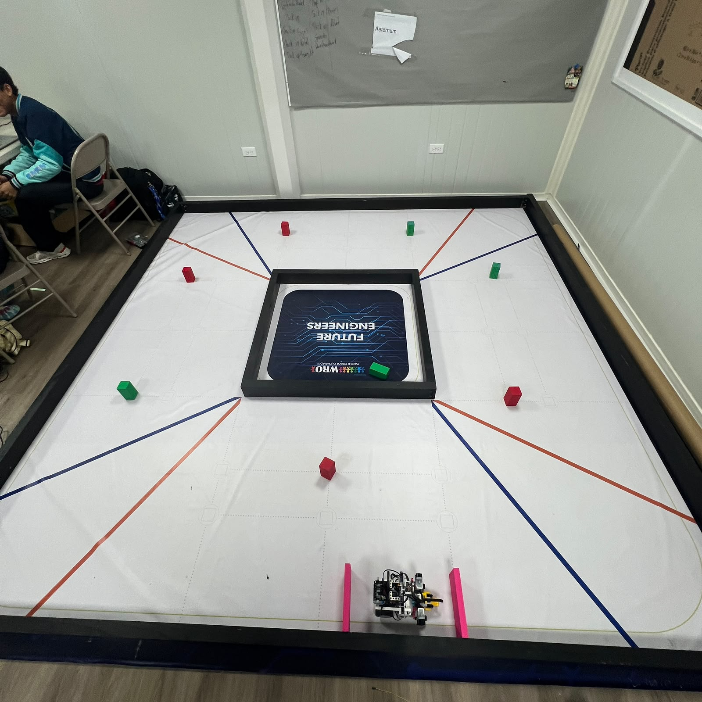
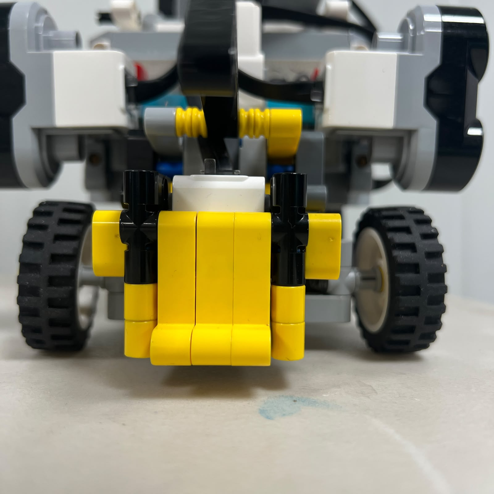
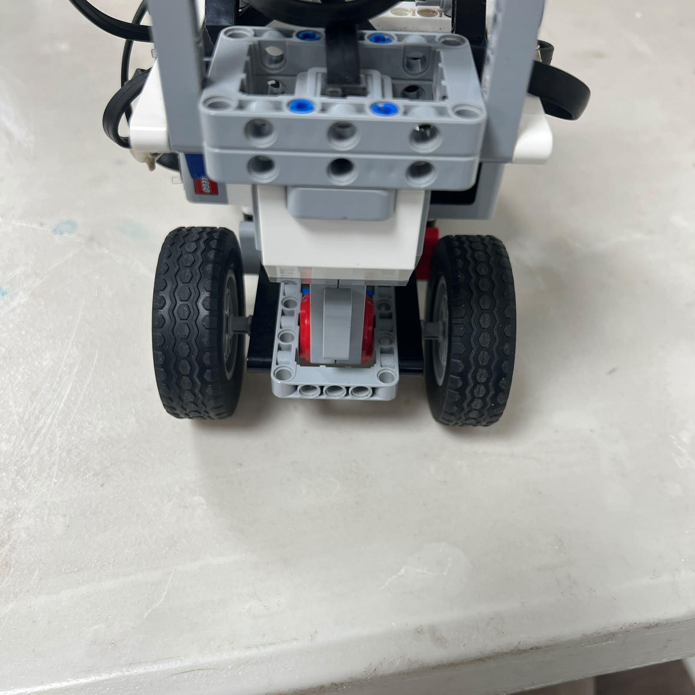
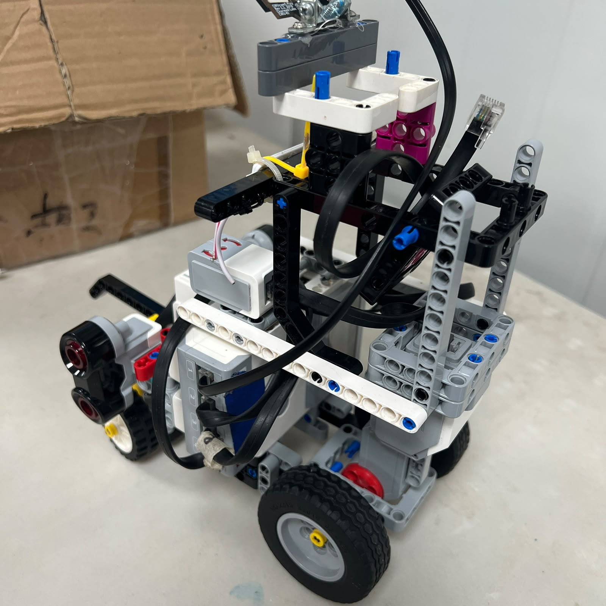
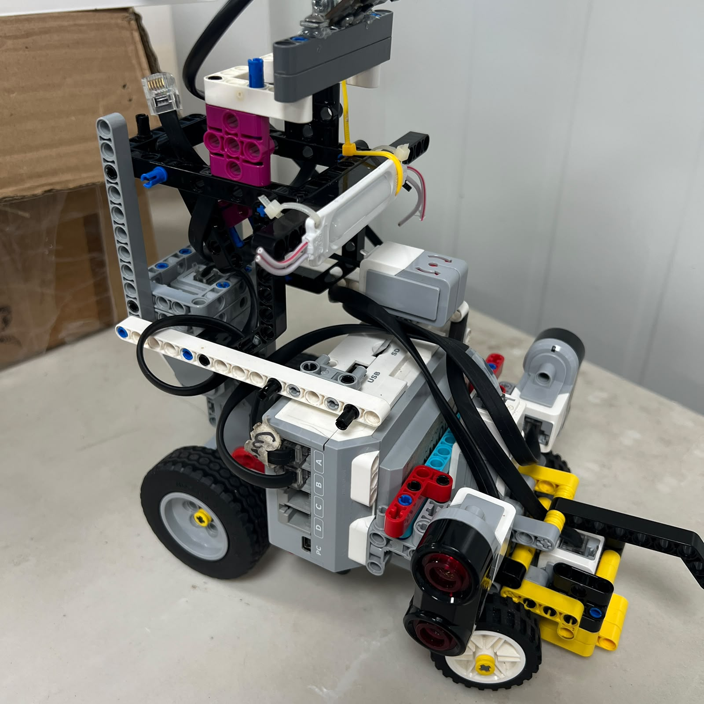
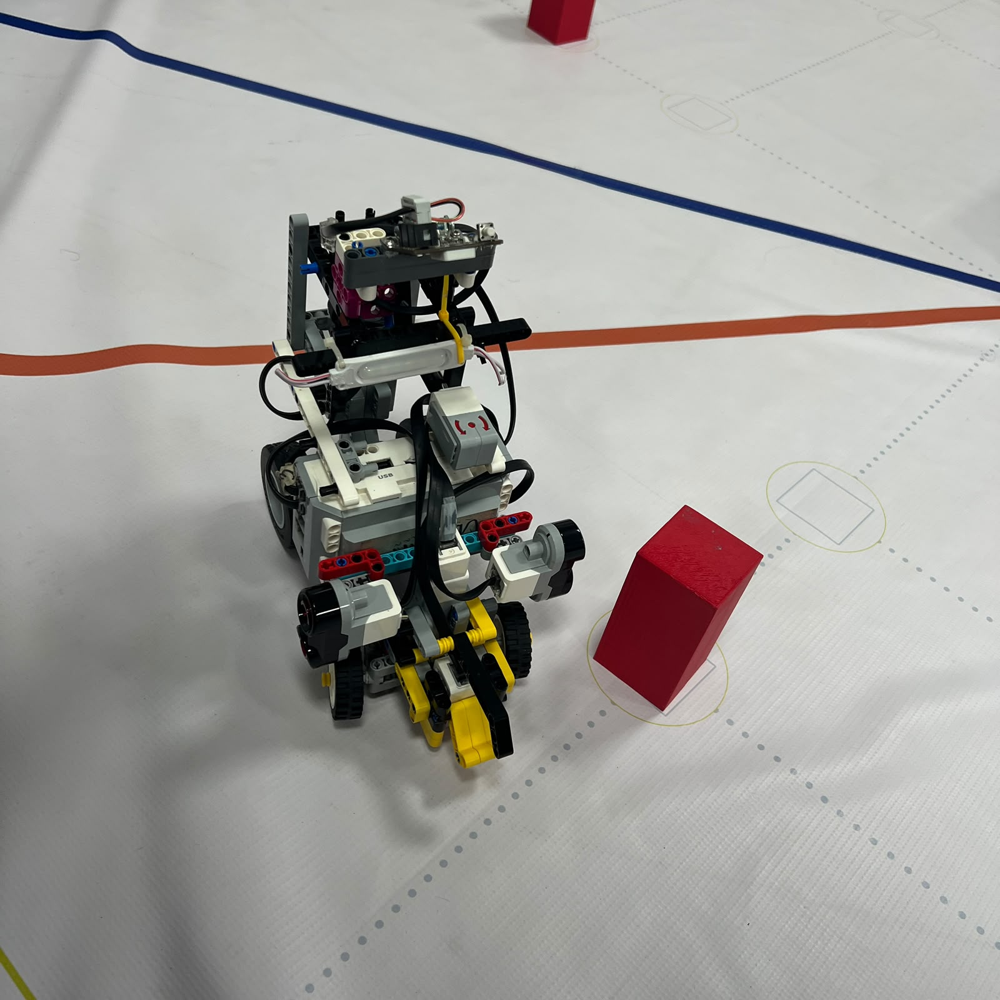
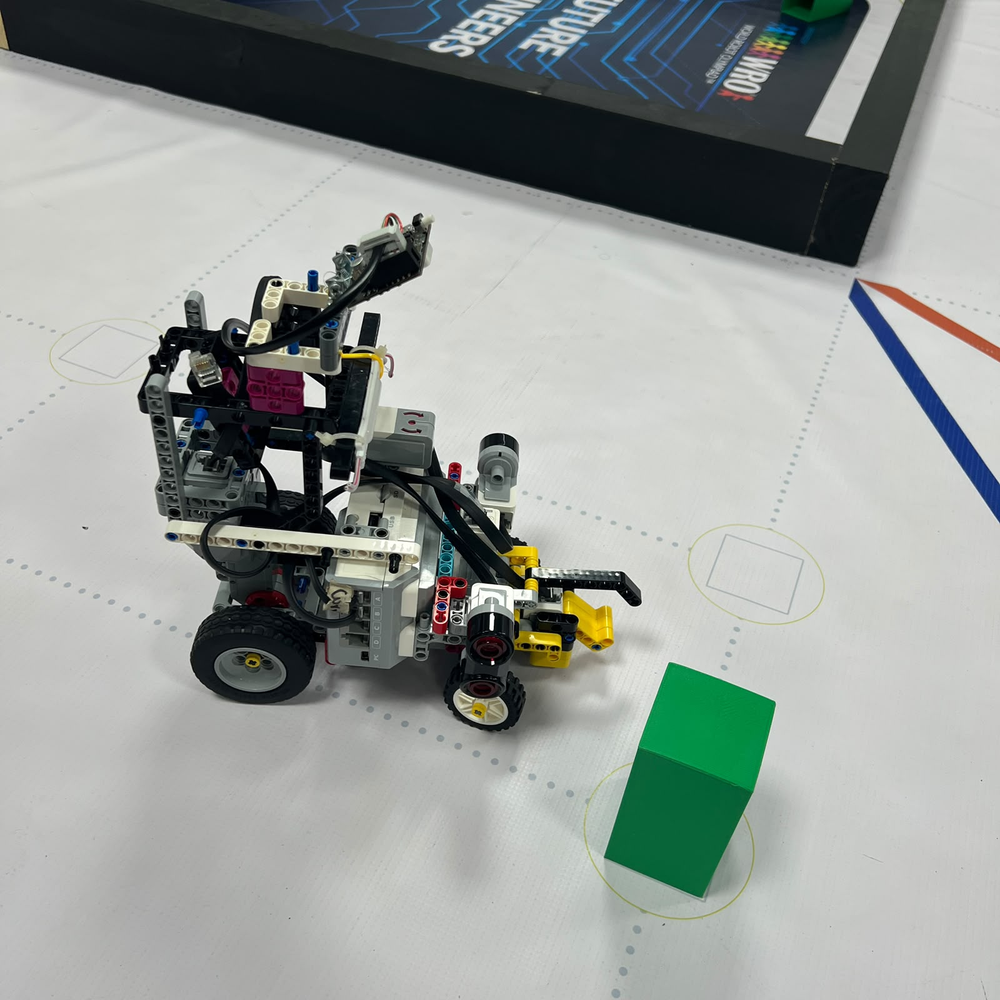
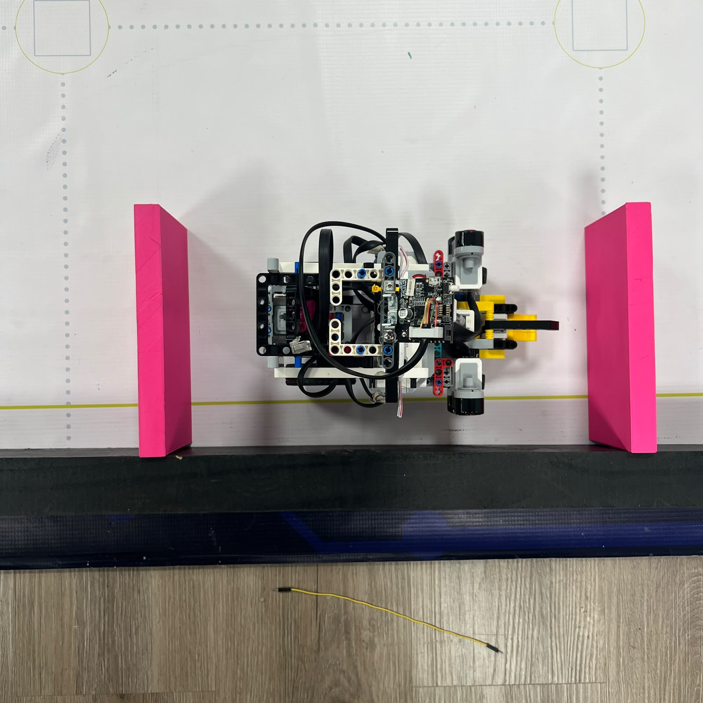
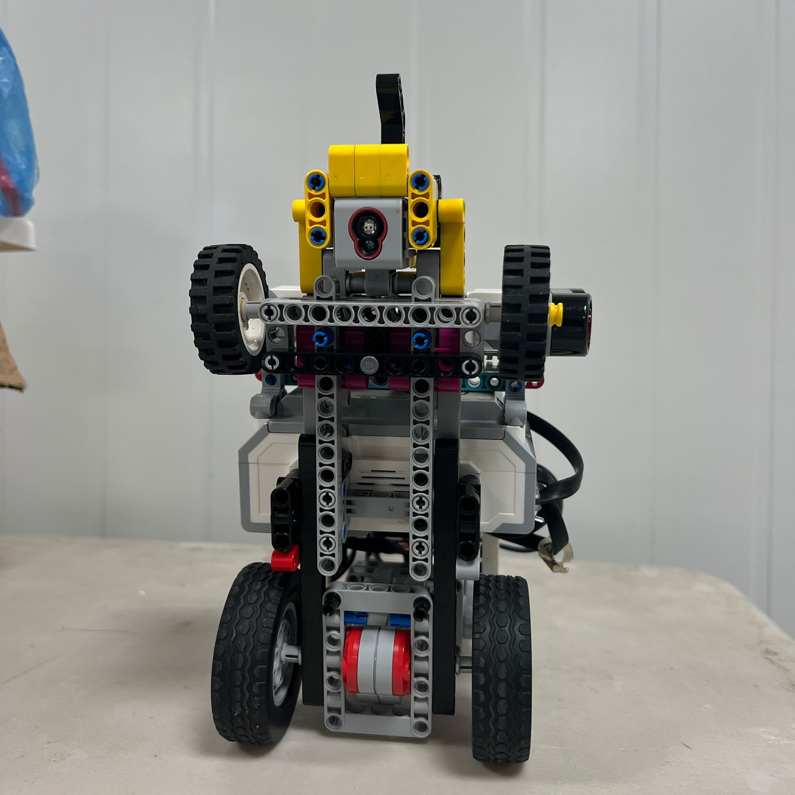

# 7. Testing Protocol

<div align="center">



<br>

<sub><b>Figure 7.1.</b> Piolín's testing protocol progresses from isolated subsystem checks to repeated full-track trials under documented conditions.</sub>

</div>

PiolínTech uses a structured testing protocol to evaluate whether a mechanical, sensing, or software modification actually improves the robot.

A successful autonomous run is useful evidence, but **one successful run alone does not demonstrate repeatability**. The purpose of this protocol is to make tests comparable by controlling the most important variables and recording enough information to understand why a result occurred.

The general testing process is:

```text
DEFINE QUESTION
      ↓
VERIFY ROBOT CONDITION
      ↓
RECORD TEST CONFIGURATION
      ↓
RUN CONTROLLED TRIAL
      ↓
OBSERVE / MEASURE RESULT
      ↓
CLASSIFY FAILURE
      ↓
CHANGE ONE RELEVANT VARIABLE
      ↓
REPEAT SAME TEST
      ↓
COMPARE
      ↓
KEEP OR REJECT CHANGE
```

Testing should progress from simple isolated behaviors toward complete autonomous runs.

```text
STATIC TEST
     ↓
LOW-SPEED SUBSYSTEM TEST
     ↓
ISOLATED MANEUVER
     ↓
REPEATED MANEUVER
     ↓
MULTI-MANEUVER TEST
     ↓
FULL RUN
```

This structure reduces the risk of changing multiple controller parameters in response to a failure whose real cause may be mechanical, electrical, or perceptual.

---

## 7.1 Test Preconditions

A test is only useful if the robot starts from a known condition.

Before every important trial, verify the physical architecture.

### Common hardware

```text
Motor A
→ propulsion

Motor B
→ steering

S2
→ LEFT Ultrasonic

S3
→ RIGHT Ultrasonic

S4
→ Color Sensor
```

### Open

```text
S1
→ Gyro
```

### Obstacles

```text
S1
→ Pixy2.1
```

The Gyro and Pixy2.1 must not be active simultaneously in the current competition configuration.

Before testing, confirm:

```text
battery ready

Motor A mount secure

Motor B mount secure

steering linkage intact

rear drivetrain moves freely

rear wheels secure

S2/S3 mounts unchanged

Color Sensor casing secure

correct S1 device installed

sensor cables secure
```

During Obstacle Challenge tests, also verify that the **Pixy2.1 3D-printed casing is installed and secure**, because the casing forms part of the current calibrated camera installation.

A hardware change should be recorded before comparing the new run with older results.

---

## 7.2 Test Identification and Record

Every meaningful experiment should have enough information to reconstruct the conditions later.

A recommended test record is:

```text
TEST ID:

DATE:

CHALLENGE:
Open / Obstacles

SOFTWARE FILE:

GIT COMMIT / VERSION:

ROBOT CONFIGURATION:

BATTERY CONDITION:

STARTING POSITION:

TEST OBJECTIVE:

VARIABLE BEING CHANGED:

VALUES USED:

EXPECTED RESULT:

ACTUAL RESULT:

FAILURE POINT:

MECHANICAL OBSERVATION:

SENSOR OBSERVATION:

NEXT CHANGE:
```

A compact table can also be used:

| Field | Record |
| :--- | :--- |
| Test ID | — |
| Date | — |
| Challenge | Open / Obstacles |
| Software version | — |
| Git commit | — |
| Battery condition | — |
| Starting condition | — |
| Variable changed | — |
| Result | — |
| Failure point | — |
| Notes | — |

The objective is to avoid test descriptions such as:

```text
"this code was better"
```

without knowing:

```text
which code

which robot configuration

which starting position

which parameter changed
```

---

## 7.3 Control the Test Variables

A comparison is strongest when only one meaningful variable changes between two trials.

For example, if an Open corner is too wide, possible variables include:

```text
corner-entry timing

Motor A speed

steering command

gyro release condition

starting position
```

Changing all of them simultaneously may improve the run, but it does not reveal which modification caused the improvement.

The preferred process is:

```text
TEST A
known configuration
      ↓
observe failure
      ↓
change ONE variable
      ↓
TEST B
same remaining conditions
      ↓
compare result
```

Important conditions that should remain as consistent as practical include:

```text
robot mechanical configuration

software version except intended change

starting position

course setup

sensor mounting

battery condition

lighting during Pixy tests
```

This does not mean every laboratory condition must be perfectly identical. It means major uncontrolled changes should be avoided or documented.

---

## 7.4 Mechanical Baseline Tests

Before testing autonomous navigation, Piolín should pass a small set of mechanical baseline checks.

<div align="center">



<br>

<sub><b>Figure 7.2.</b> Steering-center repeatability should be verified before interpreting track behavior as a controller problem.</sub>

</div>

### Steering center

Repeat:

```text
CENTER
  ↓
LEFT
  ↓
CENTER
  ↓
RIGHT
  ↓
CENTER
```

and observe whether the front wheels return to approximately the same physical position.

### Steering movement

Verify that:

```text
left steering is free

right steering is free

no linkage binding occurs

Motor B does not force the mechanism into a hard stop
```

### Drivetrain

<div align="center">



<br>

<sub><b>Figure 7.3.</b> Drivetrain condition should remain stable when comparing software performance.</sub>

</div>

Verify:

```text
rear wheels rotate freely

no wheel rub exists

axles remain aligned

Motor A mount is secure

no unexpected drivetrain resistance appears
```

If the mechanical baseline fails, navigation tuning should stop until the physical problem is corrected.

---

## 7.5 Sensor Baseline Tests

Before full navigation, verify raw sensor behavior independently.

### Ultrasonics

The permanent mapping must be:

```text
S2 = LEFT

S3 = RIGHT
```

Place Piolín near known wall geometry and confirm that both values respond plausibly when the robot is moved.

### Color Sensor

Verify that S4 distinguishes:

```text
Blue

Orange

normal floor
```

using the current sensor casing and mounting.

### Open Gyro

Confirm that:

```text
gyro initializes

gyro can be reset

angle changes when Piolín rotates

sign matches controller assumptions
```

### Obstacle Pixy2.1

Confirm that:

```text
camera communicates

sig1 = Pink

sig2 = Red

sig3 = Green
```

and that `x`, `y`, `width`, and `height` change plausibly as the object moves in the camera view.

A full autonomous run should not be the first test used to discover that a sensor is unavailable.

---

## 7.6 Open Challenge Testing Protocol

<div align="center">



<br>

<sub><b>Figure 7.4.</b> Open testing uses the Gyro on S1 together with permanent S2/S3 lateral sensing and the S4 Color Sensor.</sub>

</div>

Open testing should progress through increasingly difficult stages.

### Stage 1 — Initial acquisition

Test Piolín from the intended starting area.

Observe:

```text
Does the robot begin in a controlled direction?

Does it avoid immediately driving into a wall?

Does the gyro begin from a valid zero reference?

Are S2/S3 values plausible?
```

The purpose is to validate the transition from:

```text
stationary start
```

to:

```text
stable course following
```

before corners are evaluated.

### Stage 2 — Direction selection

Test both possible first colors:

```text
BLUE first
→ COUNTERCLOCKWISE
```

```text
ORANGE first
→ CLOCKWISE
```

Once selected, direction must remain persistent.

Verify the logical ultrasonic mapping:

```text
CCW:
S2 = inner
S3 = outer
```

```text
CW:
S3 = inner
S2 = outer
```

### Stage 3 — Straight-line control

Use a representative straight section and observe:

```text
wall clearance

vehicle heading

steering activity

zig-zag behavior

drift
```

The objective is not zero Motor B movement.

The objective is stable motion without unnecessary large oscillation.

### Stage 4 — Single corner

Use one controlled corner repeatedly.

Record:

```text
entry position

entry heading

Motor A speed

steering behavior

gyro behavior

exit position

S2/S3 geometry after turn
```

A corner should not be classified as successful only because Piolín rotated.

A useful success condition is:

```text
corner completed
+
no collision
+
usable exit heading
+
usable lateral geometry
```

### Stage 5 — Multiple consecutive corners

Once one corner is repeatable, test:

```text
2 corners

4 corners

one complete lap
```

before attempting all three laps.

This reveals accumulated error that a single-corner test cannot show.

### Stage 6 — Full Open run

The intended full Open course is:

```text
3 laps

12 corners

final parking sequence
```

Record not only whether the run completed, but the **first significant failure point** when it did not.

---

## 7.7 Open Failure Classification

Open failures should be classified before changing code.

| Failure | Possible Layer |
| :--- | :--- |
| Piolín launches into wall | Initial acquisition / steering / sensor geometry |
| Straight drift | Steering center, gyro, wall geometry |
| Zig-zag | Excessive correction, delayed response, mechanical play |
| First color sets wrong direction | Color-state mapping |
| Direction later reverses | Persistent-state logic |
| One corner counted twice | Event/debounce/state logic |
| Corner begins too late | Detection / entry condition / speed |
| Corner cuts too far inward | Entry timing / steering strength |
| Correct turn but bad exit | Release timing / geometry reacquisition |
| Works one lap but fails later | Accumulated state or geometry error |
| Parking triggers at wrong time | Progress-state logic |
| Parking position varies | Approach geometry / drivetrain / final control |

The first failure should be investigated before symptoms that occur afterward.

For example:

```text
bad corner exit
      ↓
bad next straight
      ↓
bad next corner
      ↓
collision
```

The collision may not be the original problem.

---

## 7.8 Obstacle Challenge Testing Protocol

<div align="center">



<br>

<sub><b>Figure 7.5.</b> Obstacle tests use Pixy2.1 on S1 while preserving the same S2/S3/S4 configuration.</sub>

</div>

Obstacle testing should also progress from isolated vision tests to complete sequences.

### Stage 1 — Camera detection

With Piolín stationary, verify each trained signature independently.

```text
Pink
→ sig1

Red
→ sig2

Green
→ sig3
```

The camera should be tested with its current **3D-printed casing installed**.

### Stage 2 — Single target geometry

Move one pillar through:

```text
left image region

center region

right image region
```

and observe:

```text
x

y

width

height
```

Then vary the distance to the pillar and confirm that apparent block dimensions change plausibly.

### Stage 3 — Single Red maneuver

<div align="center">



<br>

<sub><b>Figure 7.6.</b> Red tests must evaluate the required pass-right trajectory and the recovery after the pillar.</sub>

</div>

The rule is always:

```text
RED
→ PASS RIGHT
```

A successful Red test should include:

```text
correct target selected

correct passing side

pillar cleared

wall collision avoided

target released

recovery completed
```

### Stage 4 — Single Green maneuver

<div align="center">



<br>

<sub><b>Figure 7.7.</b> Green tests independently validate the required pass-left trajectory.</sub>

</div>

The rule is:

```text
GREEN
→ PASS LEFT
```

Red and Green should be tested independently because the physical steering system may not behave identically in both directions.

### Stage 5 — Target-loss test

During a real maneuver, verify behavior when the pillar leaves the camera field of view.

The desired behavior is not:

```text
target disappears once
→ immediately reverse maneuver
```

Instead, recent target state, vehicle motion, and ultrasonic context should help determine whether Piolín is still passing the same obstacle.

### Stage 6 — Multiple visible targets

Test:

```text
Red + Green

near Red + distant Green

near Green + distant Red
```

The controller should select the most relevant obstacle rather than permanently using the first visual block returned.

### Stage 7 — Consecutive pillars

Test sequences such as:

```text
RED → RED

GREEN → GREEN

RED → GREEN

GREEN → RED
```

This verifies:

```text
target lock

target release

state reset

recovery

next-target selection
```

### Stage 8 — Complete Obstacle run

Only after isolated obstacle states are reasonably stable should a full sequence be used as the main evaluation.

---

## 7.9 Obstacle Success Criteria

A pillar maneuver should not be recorded as successful simply because Piolín did not hit the obstacle.

A complete successful maneuver should satisfy:

```text
correct obstacle identified
+
correct passing side
+
pillar cleared
+
track boundary remains safe
+
current target released
+
vehicle recovers to usable geometry
```

For Red:

```text
RED
→ RIGHT
```

For Green:

```text
GREEN
→ LEFT
```

The target's image position must not change this rule.

A Red pillar appearing on the left side of the image is still a pass-right obstacle.

Likewise, a Green pillar appearing on the right side of the image remains a pass-left obstacle.

---

## 7.10 Parking Testing

<div align="center">



<br>

<sub><b>Figure 7.8.</b> Parking should be tested as an isolated final-position maneuver before being evaluated only at the end of complete runs.</sub>

</div>

Parking combines several variables:

```text
course progression

approach position

vehicle heading

steering center

Motor A displacement

wall geometry

visual parking reference in Obstacles
```

The first parking experiments should therefore begin from a controlled approach rather than requiring a complete run before every trial.

For each attempt, record:

```text
starting position

starting heading

parking state

steering behavior

forward/reverse displacement

final position
```

The Obstacle configuration currently reserves:

```text
sig1
→ Pink
→ parking reference
```

but Pink detection should not automatically trigger parking at any point in the course.

A stronger parking condition should also include the correct progression state.

The final parking algorithm remains under development, so no final success rate should be claimed until representative repeated trials are available.

---

## 7.11 Repeatability and Success Rate

A test should normally be repeated several times under comparable conditions before a conclusion is made.

The repository should record the actual number of trials rather than implying reliability from one successful demonstration.

A trial table can use:

| Trial | Result | Failure Point | Notes |
| :---: | :---: | :--- | :--- |
| 1 | — | — | — |
| 2 | — | — | — |
| 3 | — | — | — |
| 4 | — | — | — |
| 5 | — | — | — |

When enough comparable trials exist, success rate can be calculated as:

```text
Success Rate =
Successful Trials
-----------------
Total Trials
× 100%
```

Success rates should be reported separately for meaningful behaviors, for example:

```text
CCW single corner

CW single corner

complete Open run

Red pillar pass

Green pillar pass

parking

complete Obstacle run
```

Combining unrelated tests into one overall percentage would provide less useful engineering information.

No percentage should be published without also identifying:

```text
number of trials

test conditions

definition of success
```

---

## 7.12 Performance Measurements

Quantitative testing can later include measurements such as:

```text
straight-line deviation

turning radius

corner completion time

full-run time

encoder displacement

parking error

sensor repeatability
```

However, the repository should only publish measurements collected from the current V4 robot.

Older values should not automatically be reused after mechanical changes.

Similarly, unsupported statements such as:

```text
perfectly centered

100% reliable

zero steering play

always detects pillars
```

should be avoided unless the evidence actually supports them.

A strong engineering statement is:

```text
"4 of 5 trials completed the maneuver
under the documented test condition."
```

rather than:

```text
"the maneuver is fully reliable."
```

---

## 7.13 Test Evidence and Engineering Decisions

The value of a test is not only the result.

The repository should show how the result influenced the next engineering decision.

A useful development record follows:

```text
OBSERVATION

Piolín passed the pillar but continued toward the wall.
```

```text
HYPOTHESIS

Post-pillar countersteering begins too late.
```

```text
CHANGE

Modify only the recovery transition.
```

```text
RETEST

Use the same pillar and starting condition.
```

```text
RESULT

Compare wall clearance and final heading.
```

This is much stronger than changing unrelated parameters until one run happens to succeed.

The same logic applies to failed tests.

A failed experiment is useful when it establishes:

```text
what was tried

what happened

why the approach was rejected
```

---

## 7.14 Known-Good Versions

When a configuration performs better repeatedly, preserve it before further experimentation.

Record:

```text
Git commit

source file

calibration values

mechanical configuration

test result
```

Then continue development from a new version or commit.

This allows PiolínTech to return to a stable baseline if the next experimental change performs worse.

A useful development flow is:

```text
KNOWN-GOOD VERSION
        ↓
new hypothesis
        ↓
experimental change
        ↓
test
   ┌────┴────┐
   │         │
better      worse
   │         │
   ▼         ▼
keep      return to baseline
```

Git therefore becomes part of the physical testing process rather than only a code-storage service.

---

## 7.15 Testing After Mechanical Changes

A software result should not be compared directly with an older result if the mechanical robot changed significantly without accounting for that difference.

Recheck relevant calibration after changes such as:

```text
Motor A remounted

Motor B remounted

steering linkage changed

front structure changed

wheel alignment changed

ultrasonic sensor moved

Color Sensor casing changed

gyro moved

Pixy2.1 moved

Pixy 3D casing changed

camera orientation changed
```

The same software constant can produce different physical behavior when the mechanism around it changes.

For this reason, every significant mechanical change should be included in the test record.

---

## 7.16 Failure Classification Framework

Every major failure should first be assigned to the most likely layer.

| Layer | Examples |
| :--- | :--- |
| Mechanical | Steering binding, wheel rub, loose mount |
| Electrical | Sensor disconnected, cable problem |
| Perception | Wrong color, wrong Pixy target, invalid distance |
| Interpretation | S2/S3 inverted logically, wrong signature meaning |
| Control | Steering too strong, weak, or late |
| State management | Double corner count, target not released |
| Recovery | Obstacle passed but normal geometry not restored |
| Progression | Parking triggered at incorrect course state |

The diagnostic sequence is:

```text
PHYSICAL ROBOT
      ↓
ELECTRICAL CONNECTION
      ↓
RAW SENSOR VALUE
      ↓
SOFTWARE INTERPRETATION
      ↓
STATE
      ↓
MOTOR COMMAND
      ↓
PHYSICAL RESPONSE
```

The first incorrect layer is normally the most useful place to investigate.

---

## 7.17 Final Competition-Style Validation

<div align="center">



<br>

<sub><b>Figure 7.9.</b> Final testing evaluates Piolín as one complete mechatronic system rather than as isolated sensors and motors.</sub>

</div>

After subsystem and maneuver testing are sufficiently stable, the robot should be evaluated under representative full-run conditions.

For final validation, document:

```text
current mechanical configuration

current software commit

current calibration

active round

battery condition

starting position

course setup

number of attempts

completed runs

first failure point in unsuccessful runs

run time when measured
```

The objective is not to hide failed attempts.

Repeated failures provide information about the remaining weak point in the system.

For example:

```text
Trial 1 → fails corner 2

Trial 2 → fails corner 2

Trial 3 → fails corner 2
```

is strong evidence that the problem is reproducible and localized.

By contrast:

```text
Trial 1 → corner 2

Trial 2 → parking

Trial 3 → start

Trial 4 → pillar detection
```

suggests a broader repeatability issue that may require checking mechanical condition, sensor stability, or state management before tuning one specific maneuver.

---

## 7.18 Testing Protocol Checklist

Before accepting a test result, verify:

| Requirement | Check |
| :--- | :--- |
| Test objective defined | Yes / No |
| Correct round hardware installed | Yes / No |
| Correct software version recorded | Yes / No |
| Starting condition documented | Yes / No |
| Mechanical condition checked | Yes / No |
| Sensor configuration checked | Yes / No |
| Only intended variable changed | Yes / No |
| Result recorded | Yes / No |
| First failure identified | Yes / No |
| Test repeated where appropriate | Yes / No |
| Next engineering decision documented | Yes / No |

A test that cannot answer these questions may still be useful for exploration, but it should not be treated as strong comparative evidence.

---

## 7.19 Final Engineering Assessment

PiolínTech's testing protocol is designed to transform autonomous robot development from trial-and-error into a traceable engineering process.

The core principle is not:

```text
run robot
→ change many values
→ run again
```

but:

```text
define problem
      ↓
control conditions
      ↓
observe
      ↓
identify likely cause
      ↓
change one relevant variable
      ↓
repeat
      ↓
compare
```

Open testing progresses from:

```text
mechanics
→ sensors
→ initial acquisition
→ straight driving
→ single corner
→ multiple corners
→ full three-lap run
→ parking
```

Obstacle testing progresses from:

```text
camera communication
→ signature detection
→ single Red / Green target
→ correct passing side
→ target lock
→ pillar clearance
→ recovery
→ consecutive pillars
→ full run
→ parking
```

The current Pixy2.1 must be tested with its **3D-printed casing installed**, and the Color Sensor must remain in its current cased installation, because both physical enclosures form part of the calibrated sensing systems.

The testing protocol also distinguishes between:

```text
POSSIBLE
```

and:

```text
REPEATABLE
```

One successful run proves that a behavior can occur. Repeated controlled trials are required to understand whether the behavior is sufficiently reliable for autonomous competition use.

The final testing principle is:

> **A change is valuable when its effect can be observed, repeated, documented, and connected to a clear engineering reason.**

By preserving test conditions, software versions, mechanical states, failures, and known-good baselines, PiolínTech can improve the robot systematically while maintaining enough evidence for another engineer to understand and reproduce the development process.

---

<div align="center">

### [← Back to PiolínTech Main README](../../README.md)

</div>
