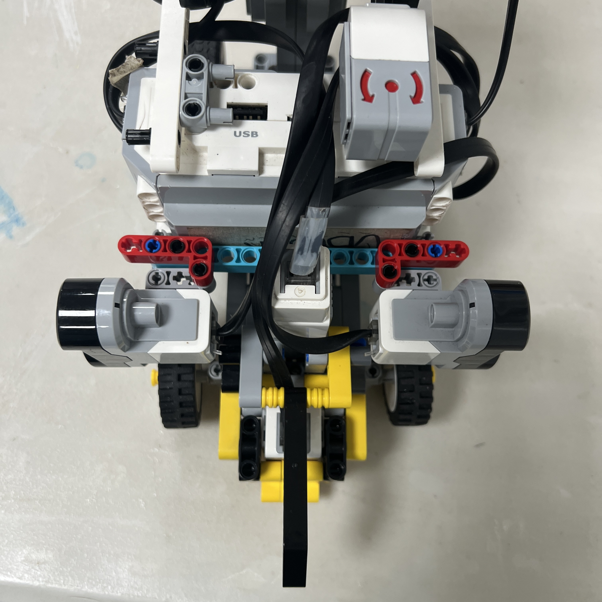

# 3. Parking Geometry

<div align="center">


<br>

<sub><b>Figure 3.1.</b> Piolín's final parking maneuver is fundamentally a geometric problem: the vehicle must enter the parking region, change its orientation, establish acceptable lateral clearance, and stop at a repeatable final position.</sub>

</div>

Piolín's parking system cannot be designed only as a sequence of motor timings.

The robot uses an Ackermann-style steering architecture, which means that its final position depends on the interaction between:

```text
vehicle position before parking

front-wheel steering angle

distance traveled

entry direction

parking-space geometry

lateral clearance
```

The parking problem is therefore better represented as:

```text
INITIAL VEHICLE POSE
        ↓
CURVED ENTRY
        ↓
ORIENTATION CHANGE
        ↓
ALIGNMENT
        ↓
FINAL LONGITUDINAL POSITION
```

rather than:

```text
turn for N milliseconds
→ move for N milliseconds
→ stop
```

For the Obstacle Challenge, Piolín does not have the Gyro Sensor installed. The parking geometry must therefore be estimated using the sensors that are actually available:

```text
S1 → Pixy2.1

S2 → LEFT Ultrasonic Sensor

S3 → RIGHT Ultrasonic Sensor

S4 → Color Sensor

Motor A → propulsion encoder

Motor B → steering position
```

No permanent front ultrasonic sensor is used in the current final hardware architecture.

---

## 3.1 Parking as a Vehicle-Pose Problem

A useful way to describe the parking state is through the vehicle's **pose**.

Conceptually:

```text
pose = position + orientation
```

For a planar vehicle, this can be represented abstractly as:

```text
P = (x, y, theta)
```

where:

```text
x
→ longitudinal position
```

```text
y
→ lateral position
```

```text
theta
→ vehicle orientation
```

Piolín does not directly measure all three values with one sensor.

Instead, different observations provide partial information.

```text
Pixy target
→ forward visual relationship
```

```text
S2 / S3
→ lateral physical relationships
```

```text
Motor A encoder
→ longitudinal progression estimate
```

```text
Motor B encoder
→ current steering configuration
```

The parking controller therefore reconstructs a **useful geometric state** from several measurements rather than depending on one absolute position sensor.

---

## 3.2 Ackermann Geometry Determines the Entry Path

<div align="center">


<br>

<sub><b>Figure 3.2.</b> Piolín's front steering changes vehicle curvature rather than rotating the chassis in place.</sub>

</div>

Piolín has:

```text
Motor A
→ rear propulsion
```

and:

```text
Motor B
→ front steering
```

The robot therefore behaves differently from a differential-drive vehicle.

It cannot command:

```text
move directly left
```

or:

```text
move directly right
```

while preserving the same orientation.

Instead:

```text
Motor B changes wheel angle
        +
Motor A moves the vehicle
        ↓
Piolín follows an arc
```

The approximate kinematic relationship for an ideal bicycle-style model is:

```text
R = L / tan(delta)
```

where:

```text
R
→ turning radius

L
→ wheelbase

delta
→ effective steering angle
```

This equation is useful as a geometric concept, but the final parking controller should not assume that the ideal model perfectly describes the physical LEGO mechanism.

Real Piolín includes:

```text
Ackermann linkage geometry

steering play

tire deformation

surface interaction

motor response

mechanical tolerances
```

Therefore the final parking path must still be calibrated experimentally.

---

## 3.3 Stronger Steering Changes More Than Direction

The steering command affects the shape of the complete entry path.

Conceptually:

```text
smaller steering angle
→ larger turning radius
→ wider trajectory
```

while:

```text
larger steering angle
→ smaller turning radius
→ tighter trajectory
```

This creates an important trade-off.

If the parking steering is too weak:

```text
Piolín may not enter far enough laterally
```

or:

```text
the vehicle may require excessive longitudinal distance
```

If the parking steering is too strong:

```text
Piolín may rotate too aggressively
```

and can end with:

```text
poor alignment

wall approach

overshoot

difficult countersteering
```

The correct entry is therefore not simply:

```text
maximum steering
```

It is the steering trajectory that creates a useful combination of:

```text
lateral displacement

orientation change

remaining clearance
```

---

## 3.4 Geometric Phases of the Parking Maneuver

Parking can be understood geometrically as four connected phases:

```text
APPROACH
   ↓
ENTRY ARC
   ↓
ALIGNMENT ARC
   ↓
FINAL TRANSLATION
```

### Approach

The robot establishes a repeatable relationship with the parking region before committing to strong steering.

Desired outcome:

```text
Piolín reaches a useful entry position
```

not necessarily:

```text
Piolín is already centered in the parking space
```

### Entry Arc

Motor B creates the primary steering angle while Motor A moves the robot through a curved path.

The purpose is:

```text
generate lateral displacement
+
change orientation
```

### Alignment Arc

A controlled opposite steering action can reduce the orientation error produced by the first arc.

The purpose is:

```text
preserve the lateral displacement
+
straighten the chassis
```

### Final Translation

Once the chassis is sufficiently aligned, Piolín can use a smaller steering demand and move longitudinally toward the calibrated stopping position.

These phases create the geometric form:

```text
          ENTRY
            )
           )
----------) 
            \
             \
              \ ALIGN
               ----------
                     FINAL
```

The exact physical trajectory depends on the actual parking orientation and must be tuned on the real track.

---

## 3.5 The Parking Reference Coordinate System

A useful parking controller needs a consistent frame of reference.

Piolín can conceptually define:

```text
FORWARD
→ current longitudinal direction
```

```text
LEFT
→ physical S2 side
```

```text
RIGHT
→ physical S3 side
```

The physical ultrasonic identities must never change:

```text
S2 = LEFT

S3 = RIGHT
```

even when:

```text
parking entry direction changes

course direction changes

steering direction changes
```

The controller should interpret these measurements relative to the parking state rather than renaming the sensors.

For example:

```text
S2 gets smaller
```

always means:

```text
physical geometry is becoming closer on Piolín's LEFT
```

It does not automatically mean:

```text
move right
```

unless the current parking phase and geometry make that correction appropriate.

This distinction prevents coordinate-system inversions inside parking logic.

---

## 3.6 Pixy Geometry Provides the Forward Reference

<div align="center">


<br>

<sub><b>Figure 3.3.</b> Pixy2.1 provides forward visual geometry for the Pink parking reference while S2 and S3 observe lateral physical geometry.</sub>

</div>

Pixy signature:

```text
sig1
```

identifies the Pink parking reference.

Once parking is logically enabled, the block can provide:

```text
x

y

width

height
```

The most immediately useful geometric quantity is the horizontal position.

Conceptually:

```python
visual_error = (
    pink_x
    - camera_center_x
)
```

This describes where the target appears relative to the camera's optical center.

The interpretation is:

```text
negative / left-side visual error
→ target appears toward one side of the image
```

```text
positive / right-side visual error
→ target appears toward the other side
```

However, Pixy coordinates should not be confused with an absolute track coordinate.

When Piolín rotates:

```text
camera rotates with chassis
        ↓
Pink x changes
```

even if the parking reference remains physically stationary.

Therefore:

> **Pink x is a relative visual measurement, not an absolute lateral position of Piolín on the course.**

It is most useful when interpreted together with the current parking phase.

---

## 3.7 Apparent Size as Geometric Context

Pixy also provides:

```text
width

height
```

for the Pink block.

Under comparable viewing conditions:

```text
smaller apparent target
→ generally farther / less dominant
```

while:

```text
larger apparent target
→ generally closer / more visually relevant
```

This can help the parking controller distinguish between:

```text
Pink detected at long range
```

and:

```text
Pink has become relevant to the entry
```

However:

```text
width
≠
millimeters from parking area
```

and:

```text
height
≠
exact vehicle distance
```

unless PiolínTech creates a measured camera calibration relating image geometry to physical geometry.

Until then, apparent size should be used as:

```text
relative progression evidence
```

rather than an exact distance measurement.

---

## 3.8 Lateral Geometry from S2 and S3

<div align="center">



<br>

<sub><b>Figure 3.4.</b> The lateral ultrasonic pair provides physical clearance information during entry, alignment, and final parking positioning.</sub>

</div>

The permanent measurements are:

```text
D_LEFT = S2
```

and:

```text
D_RIGHT = S3
```

These values do not provide complete vehicle pose, but they give useful information about lateral surroundings.

A basic geometric difference is:

```text
E_SIDE = D_LEFT - D_RIGHT
```

If the parking geometry were perfectly symmetric, then:

```text
E_SIDE ≈ 0
```

could indicate approximate lateral centering.

However, Piolín's final parking objective should **not automatically assume equal distances**.

The actual desired condition may be:

```text
D_LEFT_target ≠ D_RIGHT_target
```

depending on:

```text
parking-space orientation

robot dimensions

sensor mounting

final required vehicle location
```

Therefore the better general formulation is:

```text
E_LEFT  = D_LEFT  - D_LEFT_target

E_RIGHT = D_RIGHT - D_RIGHT_target
```

where the target distances are obtained through physical calibration.

Until those values are measured, the repository should not publish invented final distances.

---

## 3.9 Why S2 and S3 Cannot Determine Orientation Alone

Two lateral distances can help estimate whether Piolín is well positioned, but they do not uniquely determine the complete vehicle orientation in every parking geometry.

For example:

```text
S2 = acceptable

S3 = acceptable
```

does not necessarily guarantee:

```text
chassis perfectly parallel
```

because the measurements depend on:

```text
which surfaces the ultrasonic beams currently see

sensor orientation

vehicle location

parking geometry
```

This is especially important during an entry arc.

As Piolín rotates:

```text
S2 and S3 beams rotate too
```

so a sudden change may represent:

```text
orientation change
```

rather than only:

```text
lateral translation
```

The state machine should therefore interpret ultrasonic geometry differently during:

```text
ENTRY
```

and:

```text
ALIGN
```

instead of demanding one fixed relationship throughout the entire maneuver.

---

## 3.10 Geometry During the Entry Arc

During the main entry maneuver:

```text
Piolín begins with one orientation
      ↓
Motor B steers
      ↓
Motor A advances/reverses
      ↓
chassis rotates
      ↓
lateral position changes
```

The ultrasonic readings may change quickly during this period.

Normal wall-centering logic should therefore not have full authority.

Otherwise:

```text
parking controller
→ intentionally move laterally
```

while:

```text
normal wall controller
→ tries to restore previous corridor position
```

and the two commands can fight each other.

During `ENTRY`, the intended priority is:

```text
parking trajectory
→ primary geometry objective
```

```text
critical wall safety
→ physical protection
```

```text
normal corridor centering
→ reduced / inactive
```

This is consistent with the controller arbitration used during obstacle avoidance.

---

## 3.11 Geometry During Alignment

Alignment begins after the primary entry arc has created sufficient lateral displacement.

At this point, Piolín must reduce its orientation error without losing the achieved parking position.

Conceptually:

```text
ENTRY STEER
      ↓
vehicle rotates into region
      ↓
COUNTERSTEER
      ↓
orientation begins returning
      ↓
S2/S3 geometry becomes more stable
```

The required countersteering should not simply be:

```text
same steering magnitude
×
same time
×
opposite direction
```

because the second arc starts from a completely different pose.

Instead, alignment can consider:

```text
current S2

current S3

current Motor B angle

Motor A progression

last known Pink geometry
```

and gradually reduce steering as the final relationship improves.

A generic alignment error can be expressed as:

```text
E_ALIGN =
measured_parking_geometry
-
desired_parking_geometry
```

with a bounded controller:

```python
align_command = (
    PARK_ALIGN_GAIN
    * geometry_error
)

align_command = clamp(
    align_command,
    -PARK_ALIGN_LIMIT,
    PARK_ALIGN_LIMIT
)
```

The exact geometry function and constants remain to be calibrated.

---

## 3.12 Motor A Encoder as Longitudinal Geometry

The Motor A encoder provides another independent geometric variable.

If:

```python
encoder_start = drive.angle()
```

is stored at the beginning of a parking phase, then:

```python
encoder_delta = (
    drive.angle()
    - encoder_start
)
```

provides a repeatable measure of drivetrain rotation.

This can represent:

```text
progress through entry

progress through alignment

final longitudinal travel
```

depending on where the reference is reset.

The current development controller includes a prototype value:

```text
PARK_EXTRA_DEG = 300
```

for additional parking travel.

That value is useful as development evidence but is **not a final geometric specification**.

Motor degrees should eventually be calibrated against the real parking maneuver.

The relationship is conceptually:

```text
motor rotation
      ↓
wheel rotation
      ↓
nominal ground travel
```

but real travel can differ because of:

```text
wheel slip

surface interaction

turning scrub

mechanical deformation
```

Therefore the encoder should be treated as a strong progression estimate, not a perfect absolute position measurement.

---

## 3.13 Why Encoder Distance Changes During a Turn

When Piolín drives straight, the Motor A encoder is relatively easy to interpret as longitudinal progression.

During a curve, the relationship is more complex.

Different parts of the vehicle follow different path radii.

Conceptually:

```text
inside path
→ shorter arc

outside path
→ longer arc
```

while Piolín's drive motor continues measuring wheel rotation.

This means the same encoder change can correspond to different changes in:

```text
x position

y position

orientation
```

depending on steering angle.

The parking algorithm should therefore avoid assuming:

```text
300 motor degrees
→ same x/y displacement
```

for every steering configuration.

A parking phase should ideally use:

```text
encoder
+
steering phase
+
sensor geometry
```

together.

---

## 3.14 Motor B Position Is Also Geometric Information

Motor B is not only an actuator.

Its encoder provides information about the physical steering state.

Conceptually:

```python
steering_position = steer.angle()
```

can answer:

```text
Are the wheels still strongly turned?

Is countersteering complete?

Has steering returned near the intended final position?
```

This is especially useful during alignment.

A final parking condition may eventually require:

```text
lateral geometry acceptable

AND

Motor B close to final steering target
```

before transitioning to final translation or `STOP`.

This avoids declaring the robot aligned while its front wheels remain strongly turned.

---

## 3.15 Final Parking Geometry

A successful final parking pose should be defined by tolerances rather than one mathematically exact point.

Conceptually:

```text
D_LEFT within acceptable range

D_RIGHT within acceptable range

steering near acceptable final position

longitudinal progression reached
```

A generic condition can be represented as:

```python
left_ok = (
    abs(left_mm - LEFT_TARGET)
    <= LEFT_TOLERANCE
)

right_ok = (
    abs(right_mm - RIGHT_TARGET)
    <= RIGHT_TOLERANCE
)

steering_ok = (
    abs(steer.angle() - FINAL_STEER_TARGET)
    <= STEER_TOLERANCE
)
```

followed by:

```python
geometry_valid = (
    left_ok
    and right_ok
    and steering_ok
)
```

This is intentionally conceptual.

The repository should not assign values to:

```text
LEFT_TARGET

RIGHT_TARGET

FINAL_STEER_TARGET

TOLERANCES
```

until the final physical parking position has been measured and repeatedly tested.

The purpose of the equation is to show **how measured geometry can eventually become a stopping condition**.

---

## 3.16 Why a Tolerance Region Is Better Than One Exact Value

Physical robots rarely stop at exactly the same sensor value on every run.

Small differences may come from:

```text
sensor noise

wheel slip

mechanical backlash

surface variation

camera detection variation

braking distance
```

Therefore the parking target should be represented as an acceptable region:

```text
TARGET - tolerance
≤
measurement
≤
TARGET + tolerance
```

rather than:

```text
measurement == TARGET
```

The desired final state is therefore better visualized as:

```text
+----------------------------------+
|                                  |
|       ACCEPTABLE PARKING         |
|           REGION                 |
|                                  |
|             [Piolín]             |
|                                  |
+----------------------------------+
```

rather than one infinitely precise point.

This makes the controller more robust without weakening the actual geometric requirement.

---

## 3.17 Parking Geometry Without a Gyroscope

A major difference between Open and Obstacles is the S1 device.

During Open:

```text
S1 = Gyro
```

During Obstacles:

```text
S1 = Pixy2.1
```

Therefore the Obstacle parking controller does not have a Gyro Sensor available for direct heading measurements.

It should not contain logic such as:

```text
turn until gyro == exact parking heading
```

in the current hardware configuration.

Instead, heading is inferred indirectly from the physical evolution of:

```text
Pixy geometry

S2/S3 geometry

Motor B steering state

Motor A progression

parking phase
```

This makes the parking problem more dependent on controlled state transitions.

For example:

```text
ENTRY
→ known steering behavior
→ known progression
```

followed by:

```text
ALIGN
→ opposite steering behavior
→ lateral geometry stabilizes
```

provides indirect evidence that the chassis orientation has changed as intended.

The final system should document this as **sensor fusion without direct gyro heading**, not imply that orientation is measured absolutely.

---

## 3.18 Geometric Failure Diagnosis

Parking failures can often be understood by identifying which geometric variable became incorrect first.

| Physical Observation | Likely Geometric Problem |
| :--- | :--- |
| Piolín does not move far enough into parking | Entry radius too large or entry progression too short |
| Piolín rotates too aggressively | Entry curvature too tight |
| Piolín enters correctly but remains angled | Alignment arc insufficient |
| Piolín countersteers out of the space | Alignment too strong or too long |
| Final lateral position good but robot overshoots | Final longitudinal progression |
| Final longitudinal position good but too close to one side | Entry/alignment lateral geometry |
| Pink looks centered but robot is physically offset | Camera geometry used without lateral confirmation |
| S2/S3 look acceptable but robot is visibly angled | Ultrasonic geometry insufficient for orientation |
| Parking result changes when speed changes | Steering-distance relationship not recalibrated |
| Same encoder value produces different endpoint in curves | Encoder interpreted without steering context |

The debugging order should be:

```text
APPROACH POSITION
      ↓
ENTRY CURVATURE
      ↓
ENTRY PROGRESSION
      ↓
ALIGNMENT CURVATURE
      ↓
ALIGNMENT RELEASE
      ↓
FINAL LONGITUDINAL POSITION
```

Changing the final encoder distance should not be used to compensate for a vehicle that already entered at the wrong angle.

---

## 3.19 Recommended Geometry Calibration

The final parking geometry should be tuned physically in stages.

### Stage A — Steering Geometry

Test:

```text
fixed starting position

one steering target

controlled Motor A progression
```

Observe:

```text
resulting trajectory

lateral displacement

orientation change
```

Repeat for several useful steering commands.

---

### Stage B — Entry Progression

Choose a promising entry steering command and vary only:

```text
Motor A progression
```

Observe where the robot finishes the entry arc.

The goal is to identify a region from which alignment becomes possible.

---

### Stage C — Alignment

Keep the successful entry fixed.

Then tune:

```text
countersteering strength

countersteering progression

release timing
```

until the chassis reaches a useful final orientation.

---

### Stage D — Final Position

Once entry and alignment are repeatable, calibrate:

```text
final Motor A encoder travel

S2 final range

S3 final range

Motor B final position
```

Only at this stage should final stopping tolerances be recorded.

This ordering prevents one stage from compensating for an earlier geometric error.

---

## 3.20 Complete Parking Geometry Model

The full geometric interpretation can be summarized as:

```text
                         PARKING REFERENCE
                                │
                                ▼
                            PIXY sig1
                                │
                      visual x / size
                                │
                                ▼
                         APPROACH POSE
                                │
                                ▼
                      MOTOR B ENTRY ANGLE
                                │
                                +
                                │
                      MOTOR A PROGRESSION
                                │
                                ▼
                           ENTRY ARC
                                │
                 ┌──────────────┴──────────────┐
                 │                             │
                 ▼                             ▼
              S2 LEFT                       S3 RIGHT
          lateral geometry              lateral geometry
                 │                             │
                 └──────────────┬──────────────┘
                                ▼
                       ALIGNMENT DECISION
                                │
                                ▼
                        COUNTERSTEERING
                                │
                                +
                                │
                       MOTOR A PROGRESSION
                                │
                                ▼
                         FINAL ORIENTATION
                                │
                 ┌──────────────┼──────────────┐
                 │              │              │
                 ▼              ▼              ▼
               S2/S3        MOTOR B         ENCODER
             clearance      position        progression
                 │              │              │
                 └──────────────┼──────────────┘
                                ▼
                    FINAL GEOMETRY VALID?
                                │
                               YES
                                │
                                ▼
                              STOP
```

No individual quantity is treated as a perfect representation of the entire vehicle pose.

The parking state combines them according to the phase of the maneuver.

---

## 3.21 Final Engineering Assessment

Piolín's parking system is fundamentally constrained by its **Ackermann vehicle geometry**.

Because the robot cannot translate sideways, the final parking pose must be produced through a sequence of curved and longitudinal movements.

The physical strategy is therefore:

```text
approach

→ create lateral displacement with an entry arc

→ correct orientation with an alignment arc

→ complete final longitudinal positioning

→ validate final geometry

→ stop
```

During the Obstacle Challenge, Piolín does not have a gyro installed. Its parking geometry is instead inferred from complementary measurements:

```text
Pixy2.1
→ visual relationship with Pink reference
```

```text
S2 / S3
→ lateral physical geometry
```

```text
Motor A encoder
→ progression
```

```text
Motor B encoder
→ steering state
```

These measurements should not be interpreted independently.

For example:

```text
Pixy x
```

cannot prove lateral centering because the camera rotates with the chassis.

Likewise:

```text
S2 and S3
```

cannot always provide absolute vehicle orientation.

And:

```text
Motor A encoder
```

cannot uniquely determine the robot's final x/y position while the vehicle follows a curved trajectory.

The strength of the parking architecture comes from combining these incomplete observations within a known maneuver state.

Final geometric targets such as:

```text
parking entry distance

entry steering

alignment steering

left clearance

right clearance

final encoder progression

final steering tolerance
```

must be measured on the actual robot and course rather than invented from an ideal model.

The central geometric principle is:

> **Piolín should not attempt to reach one parking point using one sensor. It should construct the final pose through controlled Ackermann arcs, observe how the real geometry changes, and declare parking complete only when the combined lateral, longitudinal, and steering evidence falls inside a calibrated acceptable region.**

This converts the final maneuver from a timed movement into a measurable vehicle-geometry problem that PiolínTech can calibrate, reproduce, and improve systematically.

---

<div align="center">

### [← Back to PiolínTech Main README](../../README.md)

</div>
