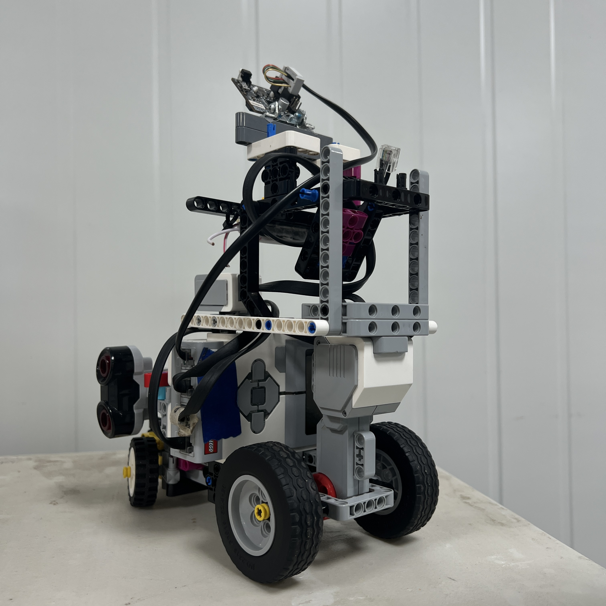

# 5. Parking Testing and Validation

<div align="center">


<br>

<sub><b>Figure 5.1.</b> Piolín's parking system is validated through controlled phase testing before being evaluated as part of a complete competition run.</sub>

</div>

Parking testing is the final stage used to determine whether Piolín's parking architecture works **repeatedly on the physical robot**, rather than only appearing correct in software.

The parking subsystem combines several independent elements:

```text
course progression

Pixy2.1 Pink detection

parking-state transitions

Ackermann entry trajectory

S2 / S3 lateral geometry

Motor A encoder progression

Motor B steering control

final STOP condition
```

A successful final position does not automatically prove that all of these systems are correct.

For example, one run may park successfully because several errors happened to compensate for each other.

PiolínTech therefore tests parking in progressively more complete stages:

```text
SENSOR TEST
      ↓
TARGET TEST
      ↓
APPROACH TEST
      ↓
ENTRY TEST
      ↓
ALIGNMENT TEST
      ↓
FINAL POSITION TEST
      ↓
COMPLETE PARKING TEST
      ↓
FULL-COURSE INTEGRATION
```

The goal is not to obtain one visually successful attempt.

The goal is to determine whether the same logic produces an acceptable final state under repeated and representative conditions.

---

## 5.1 What Counts as a Successful Parking Test

Parking success should be defined before testing begins.

A complete parking maneuver should satisfy all of the following high-level conditions:

```text
1. Parking does not activate before the required course progression.

2. Pixy2.1 correctly identifies the Pink parking reference.

3. Piolín transitions into PARKING deliberately.

4. Entry occurs in the intended direction.

5. The robot remains inside safe physical boundaries.

6. Alignment improves the final vehicle orientation.

7. Final movement does not significantly overshoot the intended region.

8. Piolín reaches an acceptable final parking pose.

9. The controller enters STOP.

10. Piolín remains stopped.
```

The exact final geometric tolerances should be taken from the measurements established during parking calibration.

Therefore:

```text
SUCCESS
```

should eventually mean:

```text
final geometry lies inside the calibrated acceptable region
+
terminal software state is STOP
```

rather than only:

```text
robot visually looks approximately parked
```

---

## 5.2 Test Environment and Hardware Configuration

Parking tests should be performed using the same physical configuration intended for the Obstacle Challenge.

The active sensor architecture is:

```text
S1 → Pixy2.1

S2 → LEFT Ultrasonic Sensor

S3 → RIGHT Ultrasonic Sensor

S4 → Color Sensor
```

with:

```text
Motor A → propulsion

Motor B → steering
```

The Pixy2.1 should remain in its current physical installation with its **3D-printed casing** installed.

Before a test series, verify that the following have not changed unexpectedly:

```text
Pixy mounting

Pixy casing

steering linkage

Motor B center

S2 alignment

S3 alignment

wheel configuration

battery installation

parking-area geometry
```

If the hardware changes significantly between test sets, the results should not automatically be treated as directly comparable.

<div align="center">



<br>

<sub><b>Figure 5.2.</b> Parking tests use the same Obstacle Challenge sensor configuration as the competition navigation system.</sub>

</div>

---

## 5.3 Test Parking in Phases Before Testing the Complete Maneuver

A full parking failure can have many possible causes.

For example:

```text
bad Pink detection

late parking activation

incorrect entry

weak alignment

incorrect encoder travel

bad final STOP condition
```

If every subsystem is tested simultaneously from the beginning, identifying the first incorrect stage becomes difficult.

The preferred development method is:

```text
isolate one phase
      ↓
make it repeatable
      ↓
freeze it temporarily
      ↓
test the next phase
```

The phase sequence should be:

| Test Phase | Main Objective |
| :--- | :--- |
| `P1` Sensor validation | Confirm S1/S2/S3 and steering information |
| `P2` Pink acquisition | Confirm `sig1` is detected reliably |
| `P3` Approach | Reach a repeatable parking-entry pose |
| `P4` Entry | Produce the intended lateral displacement |
| `P5` Alignment | Reduce vehicle orientation error |
| `P6` Final travel | Reach the intended longitudinal position |
| `P7` STOP | Terminate motion reliably |
| `P8` Complete parking | Execute all parking phases together |
| `P9` Full-course integration | Reach parking from a real competition-style run |

This progression makes failures easier to reproduce and diagnose.

---

## 5.4 Phase Tests

### Sensor and target validation

Before moving the robot, verify:

```text
Pink → sig1

Red → sig2

Green → sig3
```

Then verify:

```text
object near LEFT
→ S2 decreases
```

and:

```text
object near RIGHT
→ S3 decreases
```

Also verify that Motor B steering commands correspond to the intended physical direction.

A parking test should not proceed if the software begins with an incorrect physical coordinate system.

---

### Approach testing

Place Piolín in a repeatable starting pose.

Run only the approach logic.

Stop the test when:

```text
APPROACH
→ ENTRY
```

would normally occur.

Record:

```text
Pink x

Pink y

Pink width

Pink height

S2

S3

Motor A encoder

Motor B angle
```

The purpose is to determine whether Piolín repeatedly reaches a similar physical entry condition.

---

### Entry testing

Once the approach is repeatable, execute:

```text
APPROACH
→ ENTRY
```

but stop before alignment.

Observe:

```text
lateral displacement

vehicle orientation

wall clearance

entry consistency
```

Entry testing answers:

> **Does the selected steering and progression place Piolín inside a useful region from which alignment is possible?**

It does not yet evaluate the final parking position.

---

### Alignment testing

Use the same successful entry configuration for every trial.

Run:

```text
ENTRY
→ ALIGN
```

and stop before final longitudinal movement.

Observe:

```text
chassis orientation

S2 distance

S3 distance

Motor B final angle
```

The desired result is not merely:

```text
robot moved farther
```

but:

```text
orientation became more suitable
while preserving useful lateral placement
```

---

### Final-position testing

Once entry and alignment are repeatable, test only the last progression.

Record:

```text
starting Motor A encoder

ending Motor A encoder

S2

S3

Motor B angle

physical final pose
```

This isolates the value used for:

```text
final encoder progression
```

without allowing a poor entry to distort the result.

---

## 5.5 Repeatability Testing

One successful test is not enough to validate a parking parameter.

Each important configuration should be repeated from approximately the same initial conditions.

A useful trial sheet is:

| Trial | Pink Lock | Approach | Entry | Alignment | Final Pose | STOP | Notes |
| :---: | :---: | :---: | :---: | :---: | :---: | :---: | :--- |
| 1 | — | — | — | — | — | — | — |
| 2 | — | — | — | — | — | — | — |
| 3 | — | — | — | — | — | — | — |
| 4 | — | — | — | — | — | — | — |
| 5 | — | — | — | — | — | — | — |

Possible result labels can remain simple:

```text
PASS

FAIL

PARTIAL
```

but the notes should identify the **first incorrect phase**.

For example:

```text
FAIL — entry too wide
```

is more useful than:

```text
FAIL — did not park
```

because it immediately identifies which controller should be investigated.

The repository should only publish a numerical success rate after enough real trials have actually been completed and recorded.

---

## 5.6 Controlled Variation Tests

After the nominal starting condition works, Piolín should be tested from slightly different but still reasonable approach conditions.

This helps determine whether the parking algorithm is:

```text
trajectory dependent
```

or:

```text
capable of correcting moderate variation
```

Useful controlled variations include:

```text
slightly different lateral starting position

slightly different Pink x-position

small difference in approach distance

small difference in steering starting angle
```

Only one variation should be introduced at a time.

A test matrix can use:

| Test | Starting Variation | Result | First Failure |
| :---: | :--- | :---: | :--- |
| V01 | Nominal | — | — |
| V02 | Slightly left | — | — |
| V03 | Slightly right | — | — |
| V04 | Slightly earlier Pink acquisition | — | — |
| V05 | Slightly later Pink acquisition | — | — |

The acceptable variation should be based on actual competition-like conditions rather than unrealistically large disturbances.

The objective is not to prove that Piolín can park from any possible location.

It is to verify that small normal variations do not immediately destroy the maneuver.

---

## 5.7 Testing the STOP State

A parking maneuver is not complete merely because Motor A stops once.

The controller must also remain stopped.

After Piolín reaches the terminal state, verify:

```text
Motor A remains stopped

Motor B does not restart navigation

new Pixy detections do not trigger AVOID

new floor readings do not trigger CORNER

parking state does not return to NORMAL
```

The expected state transition is:

```text
PARKING
   ↓
STOP
   ↓
STOP
   ↓
STOP
```

A conceptual terminal implementation is:

```python
if state == STOP:
    drive.stop(Stop.BRAKE)
    steer.stop(Stop.HOLD)
```

The test should continue briefly after physical stopping to ensure that the control loop does not resume movement.

This is particularly important because Pixy2.1 may continue detecting:

```text
Pink

Red

Green
```

after parking is already complete.

Those detections should no longer create navigation changes once `STOP` has become authoritative.

---

## 5.8 Telemetry and Video Evidence

Parking tests should combine:

```text
physical video
+
terminal telemetry
```

whenever practical.

The video shows:

```text
where Piolín actually moved

when entry started

how strongly it rotated

when alignment began

where it finally stopped
```

while telemetry shows:

```text
what the software believed was happening
```

A useful parking debug stream should include:

```text
STATE

PARK_PHASE

COURSE_COUNT

PINK_VISIBLE

PINK_X

PINK_WIDTH

S2_LEFT

S3_RIGHT

MOTOR_A_ENCODER

PHASE_ENCODER_DELTA

MOTOR_B_TARGET

MOTOR_B_REAL

PARK_COMMAND

WALL_SAFETY
```

Example development output:

```text
STATE: PARKING
PHASE: APPROACH
COUNT: 12
PINK: True
X: ...
W: ...
S2: ...
S3: ...
```

then:

```text
STATE: PARKING
PHASE: ENTRY
ENC_D: ...
CMD: ...
TARGET: ...
REAL: ...
```

then:

```text
STATE: PARKING
PHASE: ALIGN
S2: ...
S3: ...
```

and finally:

```text
STATE: STOP
FINAL_ENC: ...
S2: ...
S3: ...
```

The strongest test evidence connects these values to a specific recorded run.

---

## 5.9 Failure Classification

Parking failures should be classified according to the earliest point where software behavior diverges from the intended physical sequence.

| Observed Result | First Area to Investigate |
| :--- | :--- |
| Parking starts before course completion | Lap/progression gate |
| Count reaches parking condition incorrectly | Floor event counting |
| Pink never detected | Pixy signature / FOV / lighting |
| Pink detected but never confirmed | Confirmation logic |
| Pink locks too early | Confirmation/relevance too permissive |
| Entry begins from poor pose | Approach transition |
| Entry goes wrong direction | Steering sign |
| Entry does not move far enough laterally | Entry curvature/progression |
| Entry rotates robot too much | Entry steering too strong/long |
| Wall safety interrupts normal parking repeatedly | Safety threshold or poor entry geometry |
| Alignment does not straighten robot | Alignment controller |
| Alignment moves robot out of parking area | Countersteering too strong/long |
| Final position is consistently short | Final progression |
| Final position consistently overshoots | Final progression/speed/braking |
| Endpoint varies greatly | Earlier phases not repeatable |
| Geometry is acceptable but STOP never occurs | Final condition |
| Piolín starts driving again | Terminal-state logic |

The testing rule is:

> **Correct the first incorrect phase, not the most visible final symptom.**

For example:

```text
final position too far right
```

does not automatically mean:

```text
change final steering
```

if video shows that Piolín had already entered too far right during `ENTRY`.

---

## 5.10 Full Parking Integration Test

After the individual phases are stable, the complete parking state can be tested from a controlled position.

The sequence should be:

```text
parking_eligible = True
      ↓
Pink becomes visible
      ↓
Pink confirmed
      ↓
parking target locked
      ↓
APPROACH
      ↓
ENTRY
      ↓
ALIGN
      ↓
FINAL
      ↓
STOP
```

A complete test log can use:

| Trial | Acquire | Approach | Entry | Align | Final | STOP | Overall |
| :---: | :---: | :---: | :---: | :---: | :---: | :---: | :---: |
| P01 | — | — | — | — | — | — | — |
| P02 | — | — | — | — | — | — | — |
| P03 | — | — | — | — | — | — | — |
| P04 | — | — | — | — | — | — | — |
| P05 | — | — | — | — | — | — | — |

This test determines whether the transitions themselves create new problems.

For example:

```text
ENTRY works alone
```

and:

```text
ALIGN works alone
```

but:

```text
ENTRY → ALIGN fails
```

indicates a state-transition or initial-condition problem between the two phases.

---

## 5.11 Full-Course Parking Validation

<div align="center">


<br>

<sub><b>Figure 5.3.</b> Final parking validation must eventually begin from a complete course run because obstacle avoidance, corner handling, and recovery determine the pose from which the final maneuver begins.</sub>

</div>

The most important final validation is not:

```text
place Piolín near parking
→ test parking
```

but:

```text
complete autonomous course
      ↓
correct progression count
      ↓
reach final section
      ↓
detect Pink
      ↓
park
```

This test verifies the interaction between:

```text
lap counting

corner handling

pillar avoidance

recovery

parking target acquisition

parking
```

The parking controller may work perfectly from a manually ideal starting pose but fail after a full course if the final:

```text
lateral position

heading

speed

steering state
```

are different.

Therefore both forms of testing are necessary:

```text
ISOLATED PARKING TEST
→ validates parking subsystem
```

and:

```text
FULL-COURSE TEST
→ validates parking integration
```

A failure in the second test does not automatically mean the parking algorithm itself is incorrect.

The approach state inherited from the previous navigation phase must also be inspected.

---

## 5.12 Parking Test Record

A complete engineering test record should eventually include:

```text
Test ID

date

software commit/version

hardware configuration

parking parameters

starting condition

course count

Pink detection behavior

entry result

alignment result

final S2

final S3

final Motor A progression

final Motor B angle

STOP reached?

video reference

notes
```

A repository table can use:

| Test ID | Version | Start | Final S2 | Final S3 | STOP | Result | Notes |
| :--- | :--- | :--- | :---: | :---: | :---: | :---: | :--- |
| PT-01 | — | Controlled | — | — | — | — | — |
| PT-02 | — | Controlled | — | — | — | — | — |
| PT-03 | — | Variation | — | — | — | — | — |
| PT-04 | — | Full course | — | — | — | — | — |

Values should be filled only from actual physical runs.

Blank fields are preferable to fabricated measurements.

Once enough results exist, the table can become evidence for:

```text
repeatability

failure trends

selected calibration values
```

and later support any reported parking success rate.

---

## 5.13 Acceptance and Regression Testing

Once a parking version becomes the known-good baseline, later software changes should not be assumed safe simply because they target another subsystem.

For example, modifying:

```text
normal drive speed

corner exit

obstacle recovery

steering smoothing
```

can change the pose from which parking begins.

Therefore major software changes should include a **parking regression test**.

A simple regression checklist is:

```text
[ ] Course progression still enables parking correctly

[ ] Pink remains sig1

[ ] Pink confirmation still works

[ ] Entry direction is unchanged

[ ] Entry remains inside safe geometry

[ ] Alignment remains stable

[ ] Final travel remains appropriate

[ ] STOP remains terminal
```

If a previously stable parking maneuver fails after another subsystem changes, compare:

```text
parking entry pose before change
```

against:

```text
parking entry pose after change
```

before retuning the parking parameters themselves.

This prevents parking calibration from being used to hide a regression elsewhere in the autonomous system.

---

## 5.14 Complete Parking Validation Flow

The full testing methodology can be summarized as:

```text
                         VERIFY HARDWARE
                               │
                               ▼
                         VERIFY SENSORS
                               │
                               ▼
                       VERIFY PIXY sig1
                               │
                               ▼
                     TEST PINK CONFIRMATION
                               │
                               ▼
                      CONTROLLED APPROACH
                               │
                               ▼
                         ENTRY TESTING
                               │
                         repeatable?
                           /       \
                         NO         YES
                         │           │
                         ▼           ▼
                     tune entry   freeze entry
                                     │
                                     ▼
                              ALIGNMENT TESTING
                                     │
                               repeatable?
                                 /       \
                               NO         YES
                               │           │
                               ▼           ▼
                           tune align    freeze align
                                           │
                                           ▼
                                FINAL POSITION TEST
                                           │
                                     acceptable?
                                       /       \
                                     NO         YES
                                     │           │
                                     ▼           ▼
                               tune final     test STOP
                                                   │
                                                   ▼
                                          COMPLETE PARKING
                                                   │
                                             repeatable?
                                               /       \
                                             NO         YES
                                             │           │
                                             ▼           ▼
                                   identify first      FULL
                                   incorrect phase     COURSE
                                                       TEST
                                                         │
                                                         ▼
                                                   VALIDATED
```

This process ensures that the final parking result is traceable to individually tested physical behaviors.

---

## 5.15 Final Engineering Assessment

PiolínTech treats parking testing as a **validation process**, not as a search for one successful video.

The parking subsystem contains several stages:

```text
course eligibility

Pink acquisition

target confirmation

approach

entry

alignment

final positioning

STOP
```

and each stage should first be tested independently.

The complete system is only tested after those individual behaviors become sufficiently repeatable.

The active sensors provide complementary evidence:

```text
Pixy2.1
→ Pink parking target and visual geometry
```

```text
S2 / S3
→ physical lateral clearances
```

```text
Motor A encoder
→ movement progression
```

```text
Motor B encoder
→ steering state
```

while the software state machine records:

```text
which parking phase is currently authoritative
```

Testing should combine:

```text
controlled initial conditions

repeated physical trials

terminal telemetry

video evidence

known-good Git versions
```

to identify the first stage where behavior becomes incorrect.

No success percentage, final S2/S3 target, final encoder travel, or final parking tolerance should be published until those values are supported by measured trials.

The final validation must also include a complete competition-style run because the pose inherited from:

```text
corner handling

obstacle avoidance

recovery
```

directly affects parking entry.

The central testing principle is:

> **A parking maneuver is validated only when Piolín can reach an acceptable final pose through the intended sequence of states repeatedly, from representative starting conditions, while the software telemetry confirms that the physical behavior occurred for the expected reason.**

This testing methodology gives PiolínTech traceable evidence not only that the robot can park, but also that the team understands how to isolate, measure, reproduce, and improve the behavior when it fails.

---

<div align="center">

### [← Back to PiolínTech Main README](../../../README.md)

</div>
