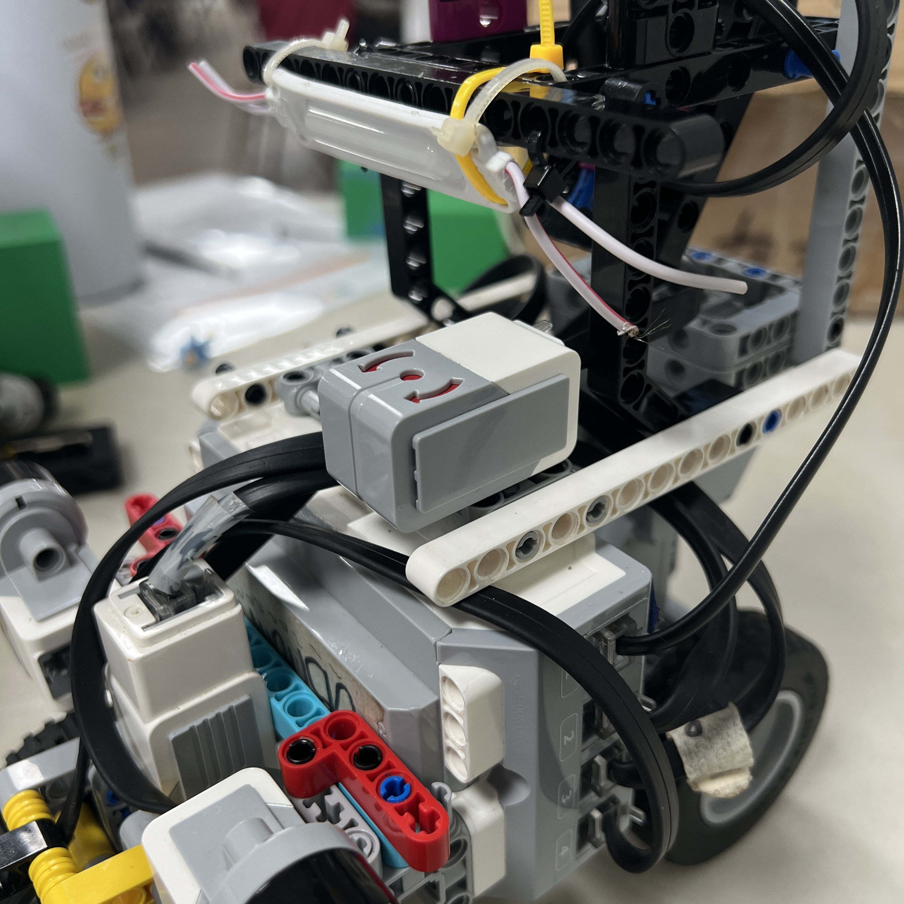
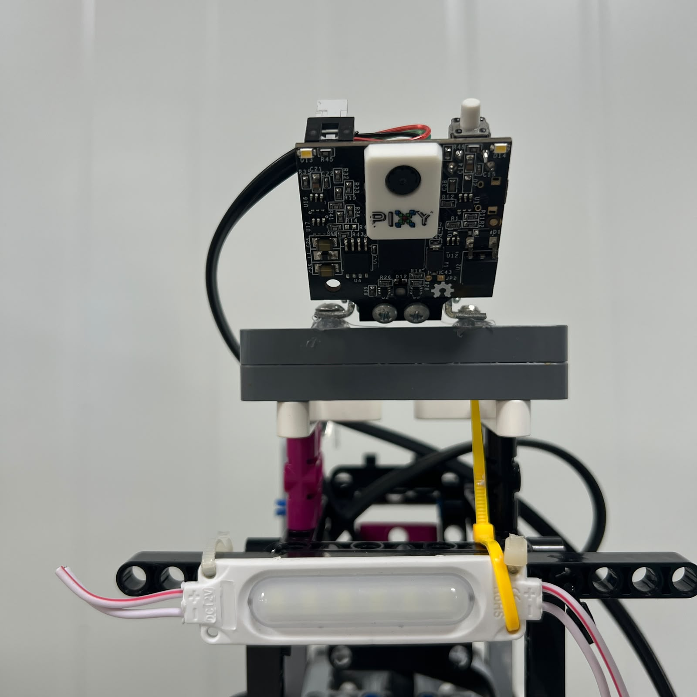
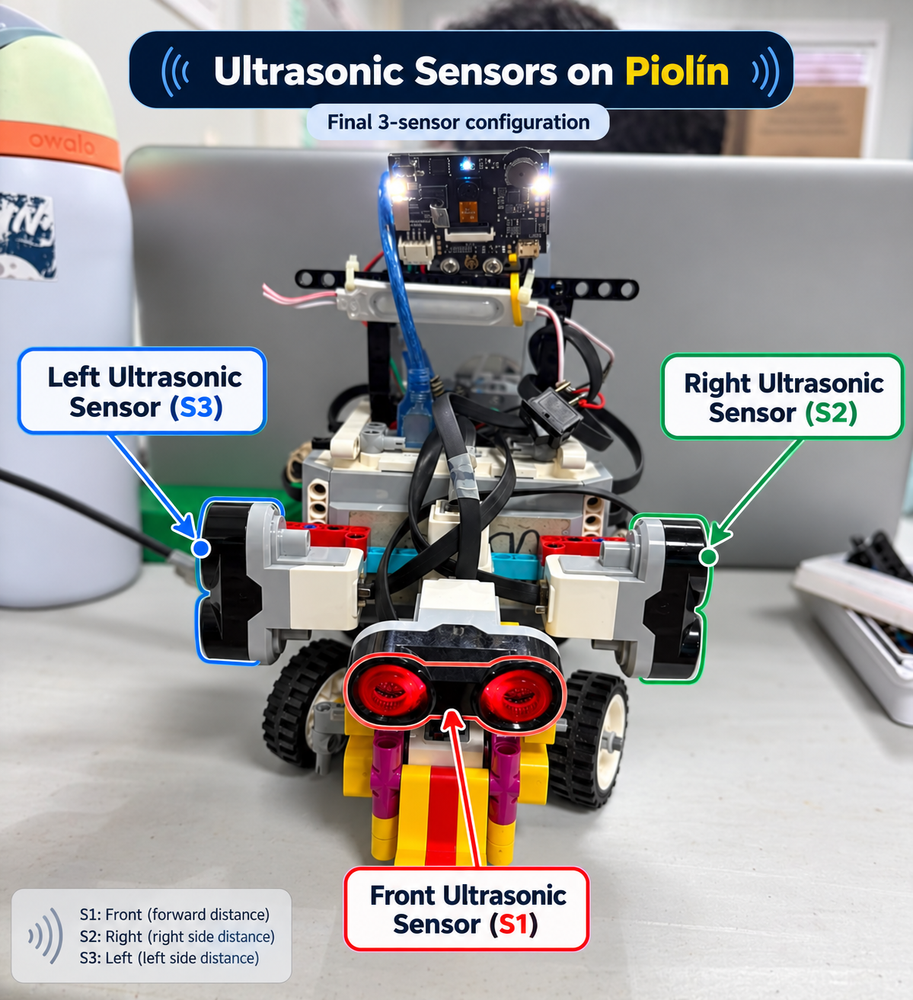

# 3. Design Constraints

<div align="center">


<br>

<sub><b>Figure 3.1.</b> Piolín's final architecture is shaped by interacting mechanical, sensing, electrical, software, and course constraints.</sub>

</div>

Every engineering design is created inside a set of constraints.

Piolín is no exception.

The robot cannot be designed only around the question:

```text
What would make navigation easiest?
```

It must instead satisfy several conditions simultaneously:

```text
COMPETITION TASKS

EV3 HARDWARE LIMITS

AVAILABLE SENSOR PORTS

AVAILABLE MOTOR PORTS

ACKERMANN VEHICLE GEOMETRY

CAMERA FIELD OF VIEW

ULTRASONIC GEOMETRY

COLOR-SENSOR LIGHTING

PROCESSING ENVIRONMENT

PHYSICAL COURSE GEOMETRY

REPRODUCIBILITY
```

These constraints directly influenced decisions such as:

```text
using separate Open and Obstacle configurations

placing the Gyro and Pixy2.1 on the same round-specific S1 port

keeping two permanent lateral ultrasonic sensors

using Motor A only for propulsion

using Motor B only for steering

separating obstacle perception from wall safety

using states instead of allowing every controller to act simultaneously
```

The purpose of this document is to explain the design limits that shaped Piolín's current architecture and the trade-offs created by those limits.

---

## 3.1 Competition Behavior Constraints

Piolín must solve several different navigation problems with the same mechanical vehicle.

The robot must be capable of:

```text
stable straight driving

corner negotiation

course-direction determination

course-progress tracking

Red pillar avoidance

Green pillar avoidance

recovery after pillars

final parking
```

The obstacle-color rules impose an especially important hard constraint:

```text
RED
→ PASS RIGHT
```

```text
GREEN
→ PASS LEFT
```

These are not tunable controller preferences.

They are requirements that the software architecture must preserve regardless of:

```text
camera position

course direction

previous steering direction

wall-controller output
```

This is why PiolínTech separates:

```text
PILLAR IDENTITY
```

from:

```text
PILLAR IMAGE POSITION
```

Pixy2.1 can report where a pillar appears, but its signature determines which competition rule applies.

Likewise, the current course model requires Piolín to maintain progression across:

```text
3 laps

12 corners
```

before transitioning to the final parking objective.

As a result, navigation cannot be treated as an unlimited continuous drive. The software must retain course state.

---

## 3.2 EV3 Port Availability

One of the strongest hardware constraints comes from the LEGO Mindstorms EV3 Brick itself.

Piolín uses four EV3 sensor ports:

```text
S1

S2

S3

S4
```

and the current architecture already requires:

```text
S2 → LEFT Ultrasonic Sensor

S3 → RIGHT Ultrasonic Sensor

S4 → Color Sensor
```

This leaves:

```text
S1
```

as the main round-specific port.

Rather than adding additional complexity to keep both vision and gyro sensing active at the same time, PiolínTech selected two configurations.

### Open Challenge

```text
S1 → Gyro

S2 → LEFT Ultrasonic

S3 → RIGHT Ultrasonic

S4 → Color
```

### Obstacle Challenge

```text
S1 → Pixy2.1

S2 → LEFT Ultrasonic

S3 → RIGHT Ultrasonic

S4 → Color
```

Therefore:

> **Gyro and Pixy2.1 are never installed simultaneously in Piolín's current architecture.**

This is not an accidental omission.

It is a direct response to the sensor-port constraint and the different information priorities of each round.

---

## 3.3 The Two Rounds Do Not Have Identical Observability

<div align="center">



<br>

<sub><b>Figure 3.2.</b> Open has direct heading information because S1 is assigned to the Gyro Sensor.</sub>

</div>

During Open:

```text
Gyro
→ direct heading-related information
```

This allows Piolín to combine:

```text
lateral ultrasonic geometry

+

heading stabilization
```

During Obstacles:

<div align="center">



<br>

<sub><b>Figure 3.3.</b> Obstacles sacrifices direct gyro heading in exchange for forward visual perception through Pixy2.1.</sub>

</div>

the Gyro Sensor is absent.

The available sensing becomes:

```text
Pixy2.1
→ forward visual geometry

S2/S3
→ lateral geometry

S4
→ floor landmarks

encoders
→ actuator progression
```

This means Obstacle software cannot depend on logic such as:

```text
turn until gyro reaches exact heading
```

because that information is unavailable.

Instead, maneuver progression must be inferred through combinations of:

```text
camera history

ultrasonic geometry

Motor A encoder

Motor B steering state

navigation state
```

This difference is one reason Open and Obstacle software are maintained as separate configurations.

---

## 3.4 Motor and Steering Constraints

<div align="center">


<br>

<sub><b>Figure 3.4.</b> Piolín's Ackermann steering constrains the vehicle to curved trajectories rather than instantaneous heading changes.</sub>

</div>

The current motor architecture is:

```text
Motor A
→ Large EV3 Motor
→ propulsion
```

```text
Motor B
→ Medium EV3 Motor
→ steering
```

Only these two motors are required for the current vehicle architecture.

This creates an important physical constraint:

> **Piolín cannot rotate in place.**

Changing heading requires:

```text
steering angle

+

vehicle movement
```

which produces a curved trajectory.

Conceptually:

```text
Motor B changes wheel angle
        ↓
Motor A moves vehicle
        ↓
chassis follows an arc
```

This affects:

```text
corners

pillar avoidance

recovery

parking
```

A software controller cannot request:

```text
move 5 cm sideways
```

directly.

It must produce that lateral displacement through one or more arcs.

This is why parking requires:

```text
entry

alignment

final positioning
```

rather than a direct sideways movement into the space.

---

## 3.5 Steering Angle, Speed, and Distance Are Coupled

For an Ackermann-style vehicle, steering cannot be calibrated independently from speed.

Conceptually:

```text
same steering angle
+
different Motor A speed
→ different physical behavior
```

because higher speed means Piolín travels farther while:

```text
Motor B reaches its target

the controller receives new measurements

the state machine detects the next condition
```

The software must therefore coordinate:

```text
STEERING

SPEED

PHYSICAL PROGRESSION
```

For example:

```text
strong steering + high speed
```

can create:

```text
overshoot

unstable corner exit

excessive obstacle trajectory
```

while:

```text
weak steering + high speed
```

can create:

```text
late avoidance

wide corner

wall impact
```

This coupling is why Piolín uses state-dependent speed rather than assuming one drive speed is optimal for every maneuver.

---

## 3.6 Ultrasonic Sensor Constraints

<div align="center">



<br>

<sub><b>Figure 3.5.</b> Piolín's permanent ultrasonic geometry consists of two lateral sensors with fixed physical identities.</sub>

</div>

The current ultrasonic architecture is constrained to:

```text
S2 = LEFT

S3 = RIGHT
```

with both sensors operating laterally.

There is no permanent front ultrasonic sensor in the current architecture.

This provides strong information about:

```text
left clearance

right clearance

corridor geometry

post-pillar recovery

parking geometry
```

but it also creates a limitation:

```text
S2/S3
```

do not directly measure:

```text
distance to an object directly ahead
```

The Obstacle Challenge therefore relies primarily on:

```text
Pixy2.1
```

for forward obstacle perception.

Another limitation is that lateral ultrasonic measurements depend on orientation.

During a straight:

```text
sensor beams
→ approximately lateral relative to course geometry
```

During a corner:

```text
chassis rotates
→ sensor beams rotate
→ measured geometry changes
```

Therefore one formula cannot be assumed equally valid during:

```text
NORMAL

CORNER

AVOID

PARKING
```

The software must interpret the same S2/S3 values according to the active state.

---

## 3.7 Camera Field-of-View Constraints

<div align="center">


<br>

<sub><b>Figure 3.6.</b> Pixy2.1 provides forward perception, but its observations are constrained by its mounting geometry and field of view.</sub>

</div>

Pixy2.1 gives Piolín forward color-object perception during Obstacles.

However, the camera does not provide unlimited visibility.

A target can leave the camera image because:

```text
Piolín turns

the target moves toward the image boundary

another object becomes dominant

the target becomes physically lateral to the robot
```

This creates a major perception constraint:

```text
TARGET NOT VISIBLE
```

does not always mean:

```text
TARGET NO LONGER EXISTS
```

or:

```text
TARGET HAS BEEN PASSED
```

The software therefore requires:

```text
target confirmation

target lock

temporary target memory

pass confirmation
```

rather than releasing an obstacle after one missing camera frame.

Camera geometry is also installation-dependent.

Changing:

```text
height

lateral position

pitch

yaw

3D-printed casing position
```

can affect:

```text
x

y

width

height

visibility duration
```

for the same physical pillar.

As a result, camera calibration is tied to the physical installation used during testing.

---

## 3.8 Lighting Is a Perception Constraint

Both:

```text
Pixy2.1
```

and:

```text
S4 Color Sensor
```

depend on optical information.

Lighting can therefore affect:

```text
color signatures

RGB values

reflection

detection stability
```

Piolín uses physical design to reduce part of this sensitivity.

The S4 Color Sensor has a casing around its floor-sensing region:

<div align="center">


<br>

<sub><b>Figure 3.7.</b> The Color Sensor casing helps make the floor-sensing environment more repeatable, although it does not eliminate all lighting variation.</sub>

</div>

The current Pixy2.1 installation also includes a 3D-printed casing.

These mechanical additions support more repeatable sensing, but they do not create perfect optical isolation.

Software still needs:

```text
calibrated signatures

RGB thresholds

event confirmation

target confirmation
```

to handle realistic variation.

The design strategy is therefore:

```text
improve physical sensing conditions
+
use software validation
```

rather than expecting either mechanical shielding or software filtering to solve lighting variation alone.

---

## 3.9 Processing and Software-Environment Constraints

The two rounds also impose different software-interface requirements.

The current Open development uses:

```text
Pybricks MicroPython
```

for:

```text
motors

gyro

ultrasonics

color sensor

control loop
```

The direct Pixy2.1 integration used for Obstacles requires a different communication path:

```text
I2C / SMBus
```

with the current development direction based around:

```text
ev3dev2 + SMBus/I2C
```

The design should therefore not force both environments into one large program simply for visual uniformity.

A more maintainable structure is conceptually:

```text
src/
  open_challenge.py
  obstacle_challenge.py
```

This creates a software constraint:

```text
shared engineering logic
≠
necessarily shared hardware driver code
```

The two programs can preserve the same concepts:

```text
states

bounded commands

sensor validation

debug telemetry

event confirmation
```

without pretending their hardware interfaces are identical.

---

## 3.10 Control-Authority Constraints

Piolín has several controllers that can potentially request steering:

```text
wall geometry

wall safety

pillar avoidance

corner handling

recovery

parking
```

Motor B, however, can only receive one physical target at a time.

This creates a fundamental software constraint:

> **Multiple objectives must eventually become one steering command.**

The architecture therefore cannot safely use:

```text
controller A
+
controller B
+
controller C
```

with unrestricted authority.

Instead, the state machine determines which behavior currently owns the trajectory.

Conceptually:

```text
CRITICAL WALL SAFETY
        ↓
CURRENT COMMITTED MANEUVER
        ↓
NORMAL NAVIGATION
```

For example:

```text
NORMAL
→ wall geometry has authority
```

```text
AVOID
→ obstacle controller has authority
```

```text
CORNER
→ corner controller has authority
```

```text
PARKING
→ parking controller has authority
```

Critical safety remains capable of overriding these states where necessary.

This constraint directly motivated Piolín's controller-arbitration architecture.

---

## 3.11 Physical Size and Measurement Constraints

The vehicle must physically fit and maneuver inside the course.

Current rough design references place Piolín approximately around:

```text
length ≈ 250 mm

height ≈ 290 mm

front width ≈ 119 mm

rear width ≈ 105 mm

wheelbase ≈ 120 mm
```

These values are **rough engineering references**, not final published V4 dimensions.

Final repository specifications still require physical remeasurement.

The following should not be treated as finalized until measured again:

```text
exact overall dimensions

vehicle mass

wheel diameters

track widths

Pixy height

Pixy lateral offset

Pixy angle
```

This creates an important documentation constraint:

> **A useful engineering model must not become a fabricated physical specification.**

Approximate values can guide design reasoning, but official reproducibility documentation should distinguish:

```text
estimated

measured

calibrated
```

values clearly.

<div align="center">


<br>

<sub><b>Figure 3.8.</b> Final dimensional documentation should be based on measurements of the current robot rather than inherited measurements from earlier versions.</sub>

</div>

---

## 3.12 Power and Electronics Constraints

Piolín uses the official:

```text
LEGO Mindstorms EV3 Rechargeable DC Battery
45501
```

as its active power source.

<div align="center">


<br>

<sub><b>Figure 3.9.</b> Piolín uses the EV3 rechargeable battery as the common power source for the current robot architecture.</sub>

</div>

The current robot does not depend on:

```text
external battery

separate buck converter

permanent Arduino power system

additional competition power source
```

Pixy2.1 is connected through the current S1 physical interface in the Obstacle configuration.

This creates a simpler electrical architecture, but also means the design should remain aware of:

```text
EV3 power availability

motor load

sensor stability

cable routing
```

The final robot should prefer:

```text
fewer active electrical interfaces
```

where those interfaces do not provide meaningful additional capability.

This was one reason the previous:

```text
HuskyLens
+
Arduino Nano
```

chain was not retained as the current architecture.

---

## 3.13 Reproducibility Is Also a Design Constraint

A robot that works only when one team member remembers:

```text
which sensor was swapped

which file was the good version

which threshold was changed

which camera angle was used
```

is difficult to reproduce.

PiolínTech therefore treats documentation and configuration control as part of the engineering system.

The current architecture aims to make the following explicit:

```text
sensor port mapping

motor port mapping

round configuration

software environment

camera signature mapping

calibration values

test procedure

known-good code version
```

This also means avoiding ambiguous conventions.

For example:

```text
S2 = LEFT

S3 = RIGHT
```

must remain identical across:

```text
code

wiring documentation

debug output

testing documentation
```

Likewise:

```text
sig2 = Red

sig3 = Green
```

should not change silently between software versions.

A design that is slightly more complicated internally can still be preferable if it is significantly easier to:

```text
understand

test

reproduce

debug
```

---

## 3.14 Constraint-to-Decision Traceability

The major relationships between constraints and current design decisions can be summarized as:

| Constraint | Resulting Engineering Decision |
| :--- | :--- |
| Only one available round-specific sensor port after S2/S3/S4 | S1 changes between Gyro and Pixy2.1 |
| Open needs heading information | Gyro used during Open |
| Obstacles need color-object recognition | Pixy2.1 used during Obstacles |
| No gyro in Obstacles | Use Pixy, US, encoder, steering state, and state history |
| No permanent front ultrasonic | Pixy provides forward obstacle perception |
| Ackermann steering cannot rotate in place | Corners, recovery, and parking require physical arcs |
| Motor B has one final target | Controllers require arbitration |
| Camera has limited FOV | Target confirmation, lock, and temporary memory |
| Optical sensing varies with lighting | Physical shielding + software calibration |
| One floor marking generates many samples | Event latch/release logic |
| Course duration is variable | Progress tracked by physical events rather than time alone |
| Pink may appear before run completion | Parking gated by course progress |
| Encoder is not perfect absolute position | Combine progression with sensor geometry |
| Round hardware differs | Separate Open and Obstacle software configurations |
| Physical dimensions continue evolving | Do not publish obsolete measurements as current |
| Final robot must be reproducible | Fixed naming, wiring, calibration, and test documentation |

This traceability demonstrates that many features of Piolín are responses to specific engineering limitations rather than isolated design preferences.

---

## 3.15 Constraints as Part of the System Architecture

The complete relationship can be represented as:

```text
                    COMPETITION TASKS
                           │
                           ▼
                    DESIGN CONSTRAINTS
                           │
        ┌──────────────────┼──────────────────┐
        │                  │                  │
        ▼                  ▼                  ▼
    MECHANICAL          SENSING            SOFTWARE
    CONSTRAINTS        CONSTRAINTS        CONSTRAINTS
        │                  │                  │
        ▼                  ▼                  ▼
   Ackermann           S1 limited        one Motor B
   steering            by round          command
        │                  │                  │
        ▼                  ▼                  ▼
 curved motion      Gyro OR Pixy       state/arbitration
        │                  │                  │
        └──────────────────┼──────────────────┘
                           ▼
                    CONTROL ARCHITECTURE
                           │
           ┌───────────────┼───────────────┐
           │               │               │
           ▼               ▼               ▼
         OPEN          OBSTACLES        PARKING
           │               │               │
           └───────────────┼───────────────┘
                           ▼
                       TESTING
                           │
                           ▼
                     CALIBRATION
                           │
                           ▼
                  CURRENT PIOLÍN DESIGN
```

The final architecture is therefore a compromise among several competing goals:

```text
sensor information

mechanical simplicity

software controllability

physical safety

competition performance

reproducibility
```

No subsystem can be optimized independently without considering its effect on the others.

---

## 3.16 Final Engineering Assessment

Piolín's current design is strongly shaped by constraints rather than by unlimited hardware or idealized control assumptions.

Several of the most important are:

```text
limited EV3 sensor ports

different information priorities between rounds

Ackermann steering geometry

no direct gyro heading during Obstacles

no permanent front ultrasonic

limited camera field of view

lighting-sensitive visual sensing

one physical steering actuator

variable physical course progression

incomplete absolute localization
```

Rather than treating these limitations as isolated disadvantages, PiolínTech uses them to define clearer subsystem responsibilities.

For example:

```text
Open needs heading
→ Gyro receives S1
```

```text
Obstacles need pillar identity
→ Pixy2.1 receives S1
```

```text
S2/S3 are lateral
→ use them for geometry and safety
```

```text
camera can lose targets
→ use confirmation and target memory
```

```text
Motor B can follow only one target
→ use state-based controller arbitration
```

```text
Ackermann cannot move sideways
→ use controlled arcs for avoidance and parking
```

```text
course duration varies
→ count physical events rather than rely on time
```

The result is not a robot in which every limitation has disappeared.

It is a robot whose architecture explicitly acknowledges those limitations and assigns each subsystem a role that matches the information or motion it can actually provide.

The central design-constraint principle is:

> **PiolínTech does not design software around sensors or capabilities the robot does not have. Each maneuver is built around the actual mechanical degrees of freedom, available measurements, processing environment, and physical uncertainties of the current Piolín configuration.**

Documenting these constraints is important because they explain not only **what Piolín can do**, but also **why the current architecture was chosen and where future improvements would provide the greatest engineering value**.

---

<div align="center">

### [← Back to PiolínTech Main README](../../README.md)

</div>
