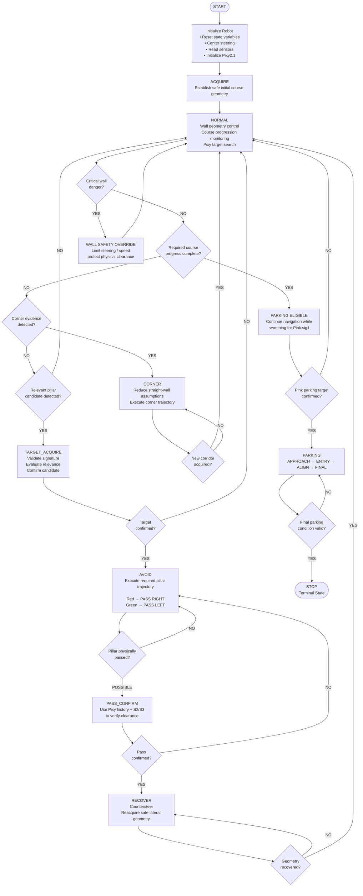

# Piolín Navigation State Flowchart

This flowchart summarizes the high-level navigation logic used for Piolín's **Obstacle Challenge** architecture.



---

## State Meaning

| State | Main Responsibility |
| :--- | :--- |
| `START` | Program entry point |
| `ACQUIRE` | Establish usable initial course geometry |
| `NORMAL` | Normal navigation, wall geometry, target search, and course monitoring |
| `TARGET_ACQUIRE` | Validate and confirm a relevant Pixy obstacle |
| `AVOID` | Execute the required Red/Green passing trajectory |
| `PASS_CONFIRM` | Verify that the active pillar has physically been cleared |
| `RECOVER` | Restore stable track geometry after avoidance |
| `CORNER` | Handle course geometry where straight-wall assumptions are temporarily invalid |
| `PARKING ELIGIBLE` | Course progression is complete and Pink parking detection may now become authoritative |
| `PARKING` | Perform approach, entry, alignment, and final positioning |
| `STOP` | Terminal state; autonomous navigation does not resume |

---

## Fixed Obstacle Rules

```text
Pixy sig2
→ RED
→ PASS RIGHT
```

```text
Pixy sig3
→ GREEN
→ PASS LEFT
```

The pillar's horizontal image position does **not** change the required passing side.

```text
signature
→ determines competition rule

x / y / width / height
→ describe target geometry and relevance
```

---

## Controller Priority

The state machine determines which navigation controller has primary authority.

```text
CRITICAL WALL SAFETY
        ↓
ACTIVE STATE CONTROLLER
        ↓
NORMAL NAVIGATION
```

Examples:

```text
NORMAL
→ wall geometry control
```

```text
AVOID
→ obstacle trajectory
```

```text
CORNER
→ corner handling
```

```text
RECOVER
→ post-pillar recentering
```

```text
PARKING
→ terminal parking controller
```

Critical wall safety remains independent so that a committed maneuver cannot freely continue into an unsafe physical boundary.

---

## Navigation Sequence

The main obstacle-navigation cycle is:

```text
NORMAL
   ↓
TARGET_ACQUIRE
   ↓
AVOID
   ↓
PASS_CONFIRM
   ↓
RECOVER
   ↓
NORMAL
```

Corner handling forms a second loop:

```text
NORMAL
   ↓
CORNER
   ↓
NORMAL
```

Once course progression is complete:

```text
NORMAL
   ↓
PARKING ELIGIBLE
   ↓
Pink sig1 confirmed
   ↓
PARKING
   ↓
STOP
```

`STOP` is terminal and does not transition back to normal navigation.
