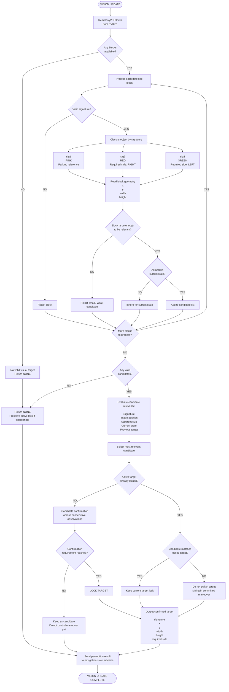

# Pixy2.1 Vision Processing Flowchart

This flowchart represents Piolín's intended **Pixy2.1 perception pipeline** during the WRO Future Engineers Obstacle Challenge.

Pixy2.1 is used as a perception sensor.

It provides information about visible colored objects, but it does **not directly control Motor B**.



---

## Pixy2.1 Signature Mapping

```text
sig1
→ PINK
→ Parking reference
```

```text
sig2
→ RED
→ PASS RIGHT
```

```text
sig3
→ GREEN
→ PASS LEFT
```

The required obstacle side is determined by the **signature**, not by where the pillar appears in the camera image.

Therefore:

```text
Red appears left in image
→ still PASS RIGHT
```

and:

```text
Green appears right in image
→ still PASS LEFT
```

---

## Information Extracted from Each Block

For every useful Pixy block, Piolín's perception layer uses:

```text
signature
→ object identity
```

```text
x
→ horizontal image position
```

```text
y
→ vertical image position
```

```text
width
→ apparent horizontal size
```

```text
height
→ apparent vertical size
```

These values describe **visual geometry**.

They do not directly represent:

```text
absolute track coordinates

exact distance in millimeters

absolute vehicle heading
```

without additional calibration.

---

## Candidate Validation

Not every detected color block should become a navigation target.

The vision pipeline first asks:

```text
Is the signature useful?
```

then:

```text
Is the block large/relevant enough?
```

then:

```text
Does this object make sense in the current navigation state?
```

For example:

```text
Pink sig1
```

should not become the active parking target during the normal run unless:

```text
parking_eligible == True
```

Likewise, very small Red or Green detections may represent distant or unstable candidates rather than the obstacle Piolín should avoid immediately.

---

## Multiple Visible Pillars

Piolín should not use:

```python
target = blocks[0]
```

as the final strategy.

Instead:

```text
all blocks
    ↓
valid candidates
    ↓
relevance evaluation
    ↓
best candidate
```

The intended relevance logic can consider:

```text
signature

x

y

width

height

current state

previous target
```

The final numerical relevance equation remains under calibration.

---

## Target Confirmation

A newly selected block should first become:

```text
CANDIDATE
```

and only later:

```text
CONFIRMED TARGET
```

Conceptually:

```text
candidate detected
      ↓
same relevant target appears again
      ↓
confirmation increases
      ↓
required confidence reached
      ↓
LOCK
```

This reduces the probability that:

```text
one unstable frame
```

immediately becomes:

```text
a major steering maneuver
```

---

## Target Lock

Once Piolín commits to a pillar:

```text
TARGET_ACQUIRE
→ AVOID
```

the selected target should remain temporarily locked.

This prevents behavior such as:

```text
Red selected
      ↓
begin PASS RIGHT
      ↓
Green becomes visually dominant
      ↓
switch target
      ↓
steering reverses
```

Instead:

```text
select target
→ confirm
→ lock
→ avoid
→ confirm pass
→ release
```

Target lock is therefore part of the perception-to-navigation interface.

---

## Temporary Vision Loss

During avoidance:

```text
Piolín turns
      ↓
camera turns
      ↓
pillar moves toward image edge
      ↓
pillar may disappear
```

A missing Pixy block does not automatically mean:

```text
pillar passed
```

The system distinguishes:

```text
TARGET NOT VISIBLE
```

from:

```text
TARGET PHYSICALLY PASSED
```

If a target is already locked, temporary visual loss can be handled using:

```text
previous target state

current maneuver

S2 / S3 geometry

vehicle progression
```

before the target is released.

---

## Perception Output

The vision subsystem should provide a structured result to the navigation layer.

Conceptually:

```python
target = {
    "signature": signature,
    "x": x,
    "y": y,
    "width": width,
    "height": height,
    "required_side": required_side,
    "confirmed": True
}
```

For obstacle targets:

```text
sig2
→ required_side = RIGHT
```

```text
sig3
→ required_side = LEFT
```

For:

```text
sig1
```

the result is interpreted by the parking subsystem instead of the normal obstacle controller.

---

## Vision-to-Control Separation

The complete responsibility chain is:

```text
PIXY2.1
   ↓
detect colored blocks
   ↓
VISION PROCESSING
   ↓
select / confirm target
   ↓
STATE MACHINE
   ↓
select active maneuver
   ↓
CONTROLLER
   ↓
CONTROL ARBITRATION
   ↓
MOTOR B
```

Not:

```text
PIXY X
→ MOTOR B
```

This separation is important because the same visual observation can require different actions depending on:

```text
current state

target history

course progression

wall geometry

whether the pillar is already being passed
```

---

## Complete Vision Pipeline

```text
PIXY2.1 FRAME
      ↓
READ BLOCKS
      ↓
VALID SIGNATURE?
      │
      ├── NO → REJECT
      │
      └── YES
             ↓
      READ X / Y / W / H
             ↓
      VALID GEOMETRY?
             │
             ├── NO → REJECT
             │
             └── YES
                    ↓
             VALID FOR STATE?
                    │
                    ├── NO → IGNORE
                    │
                    └── YES
                           ↓
                   ADD CANDIDATE
                           ↓
                 MORE THAN ONE?
                           │
                           ├── YES
                           │     ↓
                           │  RANK RELEVANCE
                           │
                           └────────┐
                                    ▼
                             SELECT TARGET
                                    ↓
                          ALREADY LOCKED?
                           /              \
                         YES               NO
                          │                 │
                          ▼                 ▼
                    KEEP TARGET         CONFIRM
                          │                 │
                          │          CONFIRMED?
                          │            /      \
                          │          NO        YES
                          │          │          │
                          │          ▼          ▼
                          │        WAIT        LOCK
                          │                     │
                          └──────────┬──────────┘
                                     ▼
                             OUTPUT TARGET
                                     ↓
                              STATE MACHINE
```

The key perception principle is:

> **Pixy2.1 reports what is visible. The vision-processing layer decides which observation is trustworthy and relevant. The state machine decides what Piolín is currently trying to accomplish. Only after those decisions does the control layer determine how Motor B should move.**
