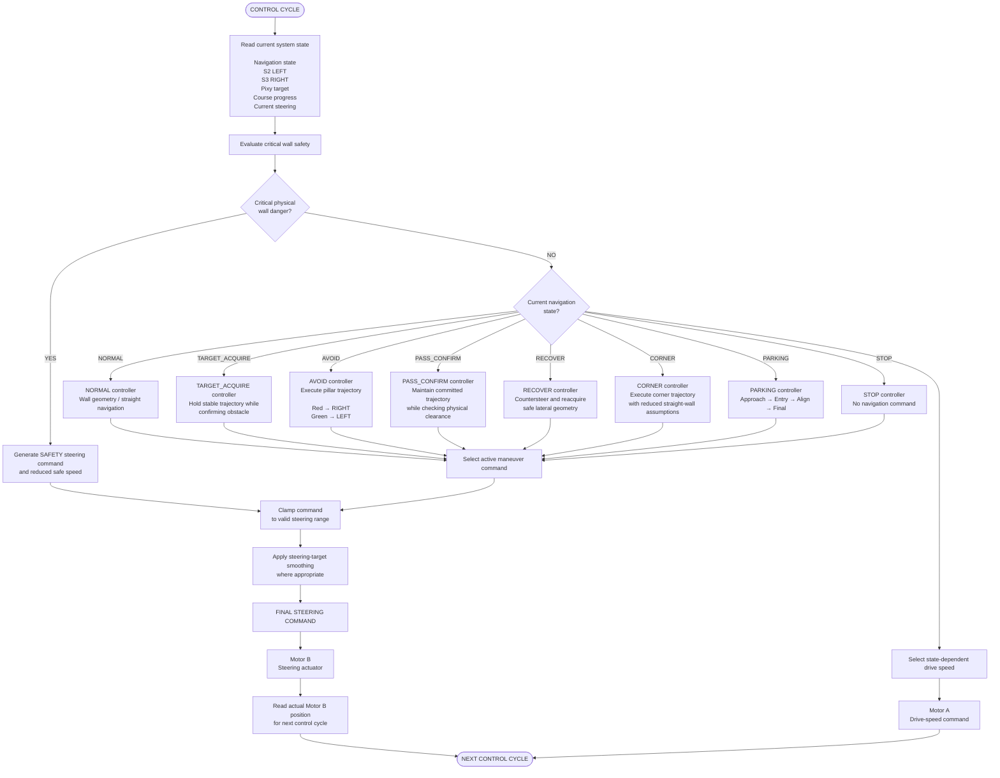

# Piolín Control Arbitration Flowchart

This flowchart represents Piolín's **steering-control arbitration system**.

Several subsystems may generate steering requests at the same time, but Motor B can only follow **one final steering target**.

The purpose of control arbitration is to decide which controller currently has authority.



---

## Arbitration Principle

Piolín does not allow every controller to influence steering with equal authority.

A naive system could behave like this:

```text
wall command
+
pillar command
+
corner command
+
recovery command
=
final steering
```

This can create controller conflict.

For example:

```text
Red pillar
→ obstacle controller requests RIGHT
```

while:

```text
wall controller
→ requests LEFT
```

If both commands are mixed directly, Piolín may produce:

```text
weak steering

oscillation

late avoidance

apparently inverted behavior
```

The arbitration system instead determines which maneuver currently owns the trajectory.

---

## Priority Structure

The intended control hierarchy is:

```text
1. CRITICAL SAFETY

2. ACTIVE MANEUVER

3. NORMAL NAVIGATION
```

Conceptually:

```text
CRITICAL WALL DANGER?
        │
      YES
        │
        ▼
SAFETY OVERRIDE
        │
        ▼
FINAL COMMAND
```

Otherwise:

```text
CURRENT STATE
      ↓
ACTIVE CONTROLLER
      ↓
FINAL COMMAND
```

---

## Critical Safety Override

Critical wall safety is separate from ordinary wall following.

The two should not be confused.

```text
NORMAL WALL CONTROL
→ tries to maintain useful track geometry
```

while:

```text
CRITICAL WALL SAFETY
→ prevents dangerous physical proximity
```

If the safety layer detects a serious condition, it may override the active maneuver.

Conceptually:

```python
wall_active, wall_cmd, safe_speed = side_wall_guard(
    left_mm,
    right_mm
)

if wall_active:
    final_cmd = wall_cmd
    drive_speed = safe_speed
```

This means that even during:

```text
AVOID

CORNER

RECOVER

PARKING
```

the robot can still protect itself from an immediately dangerous wall condition.

---

## State-Dependent Authority

Each navigation state gives priority to a different controller.

| State | Primary Steering Authority |
| :--- | :--- |
| `NORMAL` | Wall / track geometry |
| `TARGET_ACQUIRE` | Stable approach while confirming target |
| `AVOID` | Pillar-avoidance trajectory |
| `PASS_CONFIRM` | Continue committed pass until clearance is verified |
| `RECOVER` | Post-pillar recentering |
| `CORNER` | Corner trajectory |
| `PARKING` | Parking controller |
| `STOP` | No navigation movement |

The same sensor can therefore have different influence depending on the current state.

For example:

```text
S2 / S3 during NORMAL
→ strong navigation influence
```

but:

```text
S2 / S3 during AVOID
→ physical context and safety
```

This prevents normal wall centering from cancelling a deliberate obstacle maneuver.

---

## NORMAL

During `NORMAL`, Piolín is not committed to a special maneuver.

The primary objective is:

```text
maintain useful track geometry
```

using:

```text
S2 LEFT

S3 RIGHT
```

and the normal wall / geometry controller.

Conceptually:

```text
S2 + S3
   ↓
geometry estimate
   ↓
position error
   ↓
normal steering command
```

This is the state where ordinary wall-following authority is strongest.

---

## TARGET_ACQUIRE

When Pixy2.1 identifies a possible relevant pillar, Piolín should not immediately create a maximum steering maneuver.

During `TARGET_ACQUIRE`, the system is still:

```text
validating

ranking

confirming
```

the candidate.

The controller should preserve a stable approach while the perception system decides whether the target is trustworthy.

This reduces the risk that:

```text
one unstable detection
```

creates:

```text
one large steering correction
```

---

## AVOID

Once a target is confirmed, the obstacle controller becomes the primary maneuver controller.

The competition rules remain fixed:

```text
sig2
→ RED
→ PASS RIGHT
```

```text
sig3
→ GREEN
→ PASS LEFT
```

During `AVOID`:

```text
pillar trajectory
→ primary authority
```

while:

```text
normal wall centering
→ reduced authority
```

and:

```text
critical wall safety
→ remains available
```

This is one of the most important arbitration decisions in Piolín.

Without it, wall following can fight the required obstacle trajectory.

---

## PASS_CONFIRM

`PASS_CONFIRM` exists because:

```text
pillar not visible
```

does not automatically mean:

```text
pillar physically passed
```

During this state, Piolín preserves the committed maneuver while checking:

```text
Pixy history

S2 / S3 geometry

vehicle progression
```

The obstacle controller should not be released simply because one camera frame is missing.

Once pass evidence becomes sufficient:

```text
PASS_CONFIRM
→ RECOVER
```

---

## RECOVER

After the pillar is passed, Piolín must return toward useful track geometry.

This is not the same as normal wall following.

Recovery is a deliberate maneuver:

```text
pillar passed
      ↓
countersteer
      ↓
reacquire corridor
      ↓
stabilize
      ↓
NORMAL
```

During `RECOVER`, the recovery controller has primary authority until the robot reaches an acceptable geometry.

Then control returns to normal navigation.

---

## CORNER

During a corner, the straight-wall model becomes temporarily less reliable because:

```text
chassis rotates

sensor beams rotate

wall geometry changes
```

Therefore:

```text
NORMAL wall controller
```

should not retain full authority.

The `CORNER` controller becomes primary until:

```text
new corridor geometry
```

is reacquired.

Then:

```text
CORNER
→ NORMAL
```

---

## PARKING

Once:

```text
course progression complete
+
Pink sig1 confirmed
```

parking becomes the active navigation objective.

At that point:

```text
PARKING
```

takes authority over normal navigation.

Its internal phases are:

```text
APPROACH
→ ENTRY
→ ALIGN
→ FINAL
```

Normal wall following should not try to pull the robot back into its previous corridor during a deliberate parking entry.

Critical physical safety may still remain active.

---

## STOP

`STOP` is terminal.

Once parking is complete:

```text
state = STOP
```

the arbitration result becomes:

```text
no further navigation command
```

The controller should not return to:

```text
NORMAL

AVOID

CORNER

PARKING
```

because of later sensor detections.

Conceptually:

```python
if state == STOP:
    drive.stop(...)
    steer.stop(...)
```

and the state remains `STOP`.

---

## Command Limiting

Even after a controller wins arbitration, its output should remain bounded.

Conceptually:

```python
final_cmd = clamp(
    requested_cmd,
    -MAX_STEER,
    MAX_STEER
)
```

This prevents one controller from requesting a steering value outside the calibrated physical range.

Command limiting is therefore separate from controller priority.

```text
ARBITRATION
→ decides WHICH controller wins
```

```text
CLAMP
→ limits HOW LARGE its command can become
```

---

## Steering Smoothing

After arbitration and command limiting, Piolín may apply target smoothing.

Conceptually:

```python
diff = target - current_target

diff = clamp(
    diff,
    -TARGET_STEP,
    TARGET_STEP
)

current_target += diff
```

This reduces:

```text
steering shock

oscillation

rapid target changes
```

However, smoothing must be calibrated carefully.

Too much smoothing can make:

```text
AVOID
```

react too slowly.

For this reason, smoothing belongs **after state selection**, not before the system knows which maneuver is active.

---

## State-Dependent Speed

Arbitration applies to drive speed as well as steering.

Different states require different control margins.

Conceptually:

```text
NORMAL
→ normal drive speed
```

```text
TARGET_ACQUIRE
→ controlled approach speed
```

```text
AVOID
→ obstacle maneuver speed
```

```text
RECOVER
→ recovery speed
```

```text
CORNER
→ corner speed
```

```text
PARKING
→ parking speed
```

```text
critical safety
→ reduced safe speed
```

The exact numerical speeds remain calibration parameters.

---

## Complete Command Pipeline

```text
SENSORS
   ↓
PERCEPTION
   ↓
STATE MACHINE
   ↓
CONTROLLER REQUESTS
   ↓
┌──────────────────────────────┐
│      CONTROL ARBITRATION     │
│                              │
│  Critical danger?            │
│     │                        │
│    YES → SAFETY              │
│     │                        │
│    NO                        │
│     ↓                        │
│  Use active-state controller │
└──────────────┬───────────────┘
               ↓
         CLAMP COMMAND
               ↓
        SMOOTH TARGET
               ↓
        FINAL MOTOR B TARGET
               ↓
          MOTOR B ACTUATION
               ↓
        ACTUAL STEERING FEEDBACK
```

---

## Why Arbitration Matters

The purpose of this architecture is not simply to make the software more organized.

It solves a physical control problem.

Piolín has:

```text
many possible objectives
```

but only:

```text
one steering actuator
```

Therefore the system must answer:

> **Which objective has the right to control Motor B right now?**

The answer depends on:

```text
physical danger

current state

committed maneuver
```

rather than on which controller happens to produce the largest numerical output.

The central arbitration principle is:

> **Piolín does not combine every steering opinion equally. Safety receives the highest authority, the currently committed maneuver controls the trajectory, and normal navigation resumes only when that maneuver has been completed.**
