# Piolín Obstacle Strategy Flowchart

This flowchart represents Piolín's complete **pillar-handling sequence** during the WRO Future Engineers Obstacle Challenge.

The objective is not only to detect a Red or Green pillar.

Piolín must:

```text
detect
→ validate
→ select
→ confirm
→ commit
→ avoid
→ verify the pass
→ recover
→ return to normal navigation
```

The fixed competition rules are:

```text
sig2
→ RED
→ PASS RIGHT
```

```text
sig3
→ GREEN
→ PASS LEFT
```

The pillar's position inside the camera image does not change the required passing side.

---

## Obstacle Strategy Flowchart

```mermaid
flowchart TD

    NORMAL([NORMAL NAVIGATION])

    SEARCH["Search Pixy2.1 blocks<br/>while maintaining normal<br/>track geometry"]

    CANDIDATE{"Relevant Red or Green<br/>candidate detected?"}

    CONTINUE["Continue NORMAL navigation"]

    VALIDATE["Validate candidate<br/><br/>Signature<br/>Image geometry<br/>Apparent size<br/>Current state"]

    VALID{"Candidate valid?"}

    REJECT["Reject candidate"]

    SELECT["Evaluate target relevance"]

    MULTI{"Multiple valid<br/>candidates?"}

    RANK["Rank candidates<br/><br/>Position<br/>Apparent size<br/>State context<br/>Previous target"]

    BEST["Select most relevant target"]

    CONFIRM["TARGET_ACQUIRE<br/>Confirm candidate across<br/>successive observations"]

    CONFIRMED{"Target confirmed?"}

    WAIT["Maintain stable approach<br/>while waiting for confirmation"]

    LOCK["LOCK TARGET"]

    CLASSIFY{"Target signature?"}

    RED["RED — sig2<br/>Required pass: RIGHT"]

    GREEN["GREEN — sig3<br/>Required pass: LEFT"]

    APPROACH["APPROACH<br/>Maintain target awareness<br/>and prepare avoidance trajectory"]

    RELEVANT{"Target sufficiently<br/>relevant / close?"}

    KEEP_APPROACH["Continue controlled approach"]

    AVOID_R["AVOID<br/>Execute RIGHT-side<br/>passing trajectory"]

    AVOID_L["AVOID<br/>Execute LEFT-side<br/>passing trajectory"]

    SAFETY_R{"Critical wall<br/>danger?"}

    SAFETY_L{"Critical wall<br/>danger?"}

    WALL_R["Apply critical wall<br/>safety override"]

    WALL_L["Apply critical wall<br/>safety override"]

    TARGET_VISIBLE_R{"Target still<br/>visible?"}

    TARGET_VISIBLE_L{"Target still<br/>visible?"}

    MAINTAIN_R["Continue committed<br/>RIGHT trajectory"]

    MAINTAIN_L["Continue committed<br/>LEFT trajectory"]

    MEMORY_R["Use target memory<br/>+ S2/S3 context"]

    MEMORY_L["Use target memory<br/>+ S2/S3 context"]

    PASS_EVIDENCE_R{"Possible pass<br/>evidence?"}

    PASS_EVIDENCE_L{"Possible pass<br/>evidence?"}

    PASS_CONFIRM_R["PASS_CONFIRM<br/>Verify Red pillar clearance<br/>using vision history + S2/S3"]

    PASS_CONFIRM_L["PASS_CONFIRM<br/>Verify Green pillar clearance<br/>using vision history + S2/S3"]

    PASSED_R{"Pass confirmed?"}

    PASSED_L{"Pass confirmed?"}

    KEEP_R["Continue RIGHT maneuver"]

    KEEP_L["Continue LEFT maneuver"]

    RELEASE_R["Release Red target lock"]

    RELEASE_L["Release Green target lock"]

    RECOVER_R["RECOVER<br/>Countersteer and restore<br/>safe track geometry"]

    RECOVER_L["RECOVER<br/>Countersteer and restore<br/>safe track geometry"]

    RECOVERED_R{"Track geometry<br/>recovered?"}

    RECOVERED_L{"Track geometry<br/>recovered?"}

    STABILIZE_R["Continue recovery"]

    STABILIZE_L["Continue recovery"]

    RETURN([RETURN TO NORMAL])


    NORMAL --> SEARCH
    SEARCH --> CANDIDATE

    CANDIDATE -- "NO" --> CONTINUE
    CONTINUE --> NORMAL

    CANDIDATE -- "YES" --> VALIDATE
    VALIDATE --> VALID

    VALID -- "NO" --> REJECT
    REJECT --> NORMAL

    VALID -- "YES" --> SELECT
    SELECT --> MULTI

    MULTI -- "YES" --> RANK
    RANK --> BEST

    MULTI -- "NO" --> BEST

    BEST --> CONFIRM
    CONFIRM --> CONFIRMED

    CONFIRMED -- "NO" --> WAIT
    WAIT --> CONFIRM

    CONFIRMED -- "YES" --> LOCK
    LOCK --> CLASSIFY

    CLASSIFY -- "sig2" --> RED
    CLASSIFY -- "sig3" --> GREEN

    RED --> APPROACH
    GREEN --> APPROACH

    APPROACH --> RELEVANT

    RELEVANT -- "NO" --> KEEP_APPROACH
    KEEP_APPROACH --> APPROACH

    RELEVANT -- "YES / RED" --> AVOID_R
    RELEVANT -- "YES / GREEN" --> AVOID_L

    AVOID_R --> SAFETY_R
    AVOID_L --> SAFETY_L

    SAFETY_R -- "YES" --> WALL_R
    WALL_R --> AVOID_R

    SAFETY_L -- "YES" --> WALL_L
    WALL_L --> AVOID_L

    SAFETY_R -- "NO" --> TARGET_VISIBLE_R
    SAFETY_L -- "NO" --> TARGET_VISIBLE_L

    TARGET_VISIBLE_R -- "YES" --> MAINTAIN_R
    MAINTAIN_R --> PASS_EVIDENCE_R

    TARGET_VISIBLE_L -- "YES" --> MAINTAIN_L
    MAINTAIN_L --> PASS_EVIDENCE_L

    TARGET_VISIBLE_R -- "NO" --> MEMORY_R
    MEMORY_R --> PASS_EVIDENCE_R

    TARGET_VISIBLE_L -- "NO" --> MEMORY_L
    MEMORY_L --> PASS_EVIDENCE_L

    PASS_EVIDENCE_R -- "NO" --> AVOID_R
    PASS_EVIDENCE_L -- "NO" --> AVOID_L

    PASS_EVIDENCE_R -- "YES" --> PASS_CONFIRM_R
    PASS_EVIDENCE_L -- "YES" --> PASS_CONFIRM_L

    PASS_CONFIRM_R --> PASSED_R
    PASS_CONFIRM_L --> PASSED_L

    PASSED_R -- "NO" --> KEEP_R
    KEEP_R --> AVOID_R

    PASSED_L -- "NO" --> KEEP_L
    KEEP_L --> AVOID_L

    PASSED_R -- "YES" --> RELEASE_R
    PASSED_L -- "YES" --> RELEASE_L

    RELEASE_R --> RECOVER_R
    RELEASE_L --> RECOVER_L

    RECOVER_R --> RECOVERED_R
    RECOVER_L --> RECOVERED_L

    RECOVERED_R -- "NO" --> STABILIZE_R
    STABILIZE_R --> RECOVER_R

    RECOVERED_L -- "NO" --> STABILIZE_L
    STABILIZE_L --> RECOVER_L

    RECOVERED_R -- "YES" --> RETURN
    RECOVERED_L -- "YES" --> RETURN

    RETURN --> NORMAL
```



---

## Complete Obstacle Sequence

The complete maneuver is:

```text
NORMAL
   ↓
DETECT CANDIDATE
   ↓
VALIDATE
   ↓
SELECT RELEVANT TARGET
   ↓
CONFIRM
   ↓
LOCK
   ↓
CLASSIFY
   ↓
APPROACH
   ↓
AVOID
   ↓
PASS_CONFIRM
   ↓
RELEASE
   ↓
RECOVER
   ↓
NORMAL
```

The system deliberately separates each stage because they answer different questions.

```text
DETECTION
→ Is something visible?
```

```text
VALIDATION
→ Is it a useful Pixy block?
```

```text
SELECTION
→ Is this the pillar Piolín should care about now?
```

```text
CONFIRMATION
→ Is the observation stable enough to trust?
```

```text
CLASSIFICATION
→ Which competition rule applies?
```

```text
AVOID
→ How should Piolín physically pass it?
```

```text
PASS_CONFIRM
→ Has the vehicle actually cleared the pillar?
```

```text
RECOVER
→ How does Piolín return to useful course geometry?
```

---

## 1. Normal Navigation

Before a pillar becomes relevant:

```text
state = NORMAL
```

Piolín continues normal course navigation.

The primary responsibilities are:

```text
maintain lateral geometry

monitor S2 LEFT

monitor S3 RIGHT

search Pixy2.1 blocks

monitor course state
```

Seeing a small colored block does not immediately interrupt this behavior.

---

## 2. Candidate Detection

Pixy2.1 searches for useful obstacle signatures:

```text
sig2
→ RED
```

```text
sig3
→ GREEN
```

A new observation first becomes a:

```text
candidate
```

rather than an active maneuver.

This prevents:

```text
one unstable frame
```

from directly changing Motor B.

---

## 3. Candidate Validation

A block can be rejected if it is not useful for the current obstacle decision.

Validation may consider:

```text
valid signature

image position

apparent width

apparent height

current navigation state
```

The exact numerical thresholds remain calibration parameters.

The principle is:

```text
DETECTED
≠
VALID TARGET
```

---

## 4. Multiple-Target Selection

If several valid blocks are visible, Piolín should not automatically use:

```python
blocks[0]
```

Instead:

```text
all valid candidates
        ↓
evaluate relevance
        ↓
select current target
```

Relevance can consider:

```text
apparent size

image location

state context

previous target

target history
```

The final numerical scoring method remains under development.

---

## 5. Target Confirmation

After selection, the candidate enters:

```text
TARGET_ACQUIRE
```

Piolín should observe enough consistent evidence before committing to the obstacle.

Conceptually:

```text
candidate
      ↓
same target observed again
      ↓
confirmation increases
      ↓
required level reached
      ↓
target confirmed
```

The confirmation requirement must balance:

```text
noise rejection
```

against:

```text
reaction delay
```

---

## 6. Target Lock

Once confirmed:

```text
target_locked = True
```

The purpose is to prevent target switching during a committed maneuver.

Without a lock:

```text
Red selected
→ steer RIGHT
→ Green becomes visually stronger
→ switch Green
→ steer LEFT
```

could occur while Piolín is already beside the first pillar.

Instead:

```text
select
→ confirm
→ lock
→ pass
→ release
```

---

## 7. Fixed Passing Rule

The required side is determined only by signature.

### Red

```text
sig2
→ RED
→ PASS RIGHT
```

### Green

```text
sig3
→ GREEN
→ PASS LEFT
```

This remains true regardless of whether the pillar appears:

```text
left

center

right
```

inside the Pixy image.

The image coordinates help describe geometry.

They do not redefine the WRO passing rule.

---

## 8. Approach

After target confirmation, Piolín does not necessarily need maximum steering immediately.

During `APPROACH`, the target can become progressively more relevant.

The controller can use information such as:

```text
x

y

width

height
```

to determine when the obstacle has become sufficiently relevant for the avoidance trajectory.

Conceptually:

```text
far / weak target
→ small influence
```

```text
closer / relevant target
→ stronger committed maneuver
```

The exact mapping remains a calibration problem.

---

## 9. Avoidance

During `AVOID`, the pillar strategy becomes the primary trajectory controller.

For Red:

```text
AVOID RIGHT
```

For Green:

```text
AVOID LEFT
```

Normal wall following should not maintain full authority during this state.

Otherwise:

```text
pillar controller
→ move away from normal corridor
```

while:

```text
wall controller
→ return to normal corridor
```

can fight each other.

The intended hierarchy is:

```text
CRITICAL WALL SAFETY
        ↓
AVOID CONTROLLER
        ↓
reduced normal wall influence
```

---

## 10. Critical Wall Safety

Obstacle authority does not mean that Piolín may ignore dangerous walls.

During either passing direction:

```text
critical S2/S3 condition
```

can activate a safety override.

This is different from ordinary centering.

```text
normal wall controller
→ preferred trajectory
```

```text
wall safety
→ prevent unsafe physical proximity
```

The safety layer therefore remains independent from the obstacle rule.

---

## 11. Temporary Pixy Loss

Piolín's camera rotates with the chassis.

During a pass:

```text
vehicle turns
      ↓
camera turns
      ↓
pillar moves across image
      ↓
pillar may disappear
```

Therefore:

```text
not visible
```

does not automatically mean:

```text
passed
```

If the target is already locked, Piolín can temporarily maintain the committed maneuver using:

```text
previous target

current pass side

S2/S3 geometry

maneuver state
```

rather than immediately reversing steering.

---

## 12. Pass Confirmation

The system needs to distinguish:

```text
camera lost target
```

from:

```text
vehicle physically cleared target
```

This is the purpose of:

```text
PASS_CONFIRM
```

Useful evidence can include:

```text
Pixy target history

corresponding lateral ultrasonic behavior

distance increasing again

vehicle progression

current maneuver side
```

Conceptually:

```text
pillar approaches lateral side
        ↓
lateral distance changes
        ↓
Piolín moves past pillar
        ↓
distance increases again
        ↓
pass evidence strengthens
```

The exact thresholds remain under calibration.

---

## 13. Target Release

The target should only be released after pass confirmation.

```text
PASS_CONFIRMED
      ↓
target_locked = False
```

This prevents the obstacle from remaining active forever.

It also allows the vision system to select:

```text
the next pillar
```

after the current maneuver has been completed.

---

## 14. Recovery

After avoidance, Piolín is intentionally displaced from its normal corridor.

Immediately returning to normal wall following can sometimes produce an excessive correction.

`RECOVER` therefore exists as its own maneuver.

The sequence is:

```text
pillar cleared
      ↓
countersteer
      ↓
restore lateral geometry
      ↓
reduce steering
      ↓
stabilize
      ↓
NORMAL
```

Recovery may use:

```text
S2

S3

Motor B position

vehicle progression
```

to determine when Piolín has returned to a useful track relationship.

---

## 15. Recovery Completion

Piolín should not remain permanently stuck in recovery.

The transition:

```text
RECOVER
→ NORMAL
```

requires acceptable geometry.

Conceptually:

```python
if recovery_geometry_valid:
    state = NORMAL
```

The final condition should be calibrated so that:

```text
too early
```

does not return an unstable vehicle to wall control, while:

```text
too late
```

does not keep unnecessary countersteering active.

---

## Red Pillar Sequence

```text
Pixy sig2
      ↓
RED confirmed
      ↓
LOCK RED
      ↓
PASS RIGHT
      ↓
maintain right-side trajectory
      ↓
confirm physical clearance
      ↓
release Red
      ↓
RECOVER
      ↓
NORMAL
```

---

## Green Pillar Sequence

```text
Pixy sig3
      ↓
GREEN confirmed
      ↓
LOCK GREEN
      ↓
PASS LEFT
      ↓
maintain left-side trajectory
      ↓
confirm physical clearance
      ↓
release Green
      ↓
RECOVER
      ↓
NORMAL
```

---

## Sensor Responsibilities During a Pillar Maneuver

| Information | Primary Source |
| :--- | :--- |
| Pillar color / identity | Pixy2.1 signature |
| Required passing side | Competition rule derived from signature |
| Horizontal target position | Pixy `x` |
| Apparent target relevance | Pixy `width`, `height`, position |
| Left physical clearance | S2 |
| Right physical clearance | S3 |
| Steering state | Motor B encoder |
| Vehicle progression | Motor A encoder |
| Active maneuver | State machine |

No single sensor is expected to solve the complete obstacle problem.

---

## Control Authority During the Maneuver

```text
NORMAL
→ wall geometry controller
```

then:

```text
TARGET_ACQUIRE
→ stable approach
```

then:

```text
AVOID
→ obstacle trajectory
```

then:

```text
PASS_CONFIRM
→ committed obstacle trajectory
```

then:

```text
RECOVER
→ recovery controller
```

then:

```text
NORMAL
→ wall geometry controller again
```

Critical wall safety remains available across the maneuver where required.

---

## Final Obstacle Pipeline

```text
                NORMAL NAVIGATION
                       │
                       ▼
                  PIXY SEARCH
                       │
                candidate found?
                   /       \
                 NO         YES
                 │           │
                 ▼           ▼
              NORMAL      VALIDATE
                              │
                          valid target?
                           /       \
                         NO         YES
                         │           │
                         ▼           ▼
                      NORMAL      SELECT
                                    │
                                    ▼
                                 CONFIRM
                                    │
                              confirmed?
                               /        \
                             NO          YES
                             │            │
                             ▼            ▼
                           WAIT          LOCK
                                          │
                                          ▼
                                    READ SIGNATURE
                                      /          \
                                    RED          GREEN
                                     │             │
                                     ▼             ▼
                               PASS RIGHT      PASS LEFT
                                     │             │
                                     └──────┬──────┘
                                            ▼
                                          AVOID
                                            │
                                            ▼
                                   POSSIBLE CLEARANCE?
                                      /           \
                                    NO             YES
                                    │               │
                                    ▼               ▼
                                  AVOID       PASS_CONFIRM
                                                    │
                                             pass confirmed?
                                               /         \
                                             NO           YES
                                             │             │
                                             ▼             ▼
                                           AVOID        RELEASE
                                                           │
                                                           ▼
                                                        RECOVER
                                                           │
                                                geometry recovered?
                                                   /           \
                                                 NO             YES
                                                 │               │
                                                 ▼               ▼
                                              RECOVER          NORMAL
```

The central obstacle-strategy principle is:

> **Piolín does not consider obstacle avoidance complete when it simply turns away from a colored pillar. The maneuver is complete only after the target has been validated, the correct WRO passing rule has been executed, physical clearance has been confirmed, and the vehicle has recovered to a stable course geometry.**
