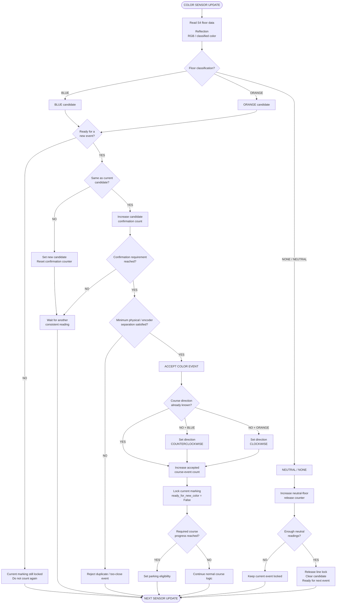

# Piolín Color Event Processing Flowchart

This flowchart represents Piolín's **S4 floor-event processing pipeline**.

The EV3 Color Sensor continuously observes the floor, but the navigation system must convert those continuous readings into **discrete course events**.

The objective is:

```text
one physical Blue or Orange marking
→ one confirmed software event
```

rather than:

```text
one physical marking
→ many loop detections
→ many counts
```

The same event-processing system also supports:

```text
initial course-direction detection

course progression

corner context

lap / event counting

parking eligibility
```

---

## Color Event Flowchart



---

## Core Event Principle

The Color Sensor operates continuously.

A physical floor marking may remain under S4 for several control cycles.

For example:

```text
BLUE
BLUE
BLUE
BLUE
```

should represent:

```text
ONE BLUE EVENT
```

not:

```text
FOUR BLUE EVENTS
```

The event-processing layer therefore separates:

```text
RAW SENSOR READINGS
```

from:

```text
CONFIRMED COURSE EVENTS
```

The intended lifecycle is:

```text
DETECT
   ↓
CANDIDATE
   ↓
CONFIRM
   ↓
ACCEPT
   ↓
LATCH
   ↓
RELEASE
   ↓
RE-ARM
```

---

## 1. Read S4

Piolín's floor sensor is:

```text
S4
→ LEGO EV3 Color Sensor
→ downward-facing
```

The sensor can provide information such as:

```text
reflection

red

green

blue
```

or, in simpler development versions:

```text
built-in EV3 color classification
```

The more detailed RGB approach allows PiolínTech to inspect the optical relationships that distinguish the floor markings.

---

## 2. Floor Classification

The classifier should return one of three logical results:

```text
BLUE

ORANGE

NONE
```

Conceptually:

```python
detected = classify_floor()
```

The purpose of this function is only to answer:

```text
What floor region is S4 currently observing?
```

It should not itself:

```text
turn the robot

increment multiple counters

start parking
```

Those responsibilities belong to later layers.

---

## 3. Blue Detection

One development approach identifies Blue using:

```text
reflection information

relative RGB dominance
```

Conceptually, Blue is recognized when:

```text
Blue channel is sufficiently dominant
+
surface reflection matches the calibrated floor marking
```

The exact thresholds must remain based on physical calibration.

A detected Blue sample first becomes:

```text
BLUE CANDIDATE
```

rather than an immediate course event.

---

## 4. Orange Detection

Orange can be more difficult for a basic named-color classifier because the sensor may interpret similar floor conditions as:

```text
RED

YELLOW

BROWN
```

depending on lighting and surface conditions.

Piolín's RGB development approach therefore evaluates relationships between:

```text
R

G

B
```

rather than relying only on a color name.

A detected Orange region similarly begins as:

```text
ORANGE CANDIDATE
```

and must be confirmed before becoming an event.

---

## 5. Candidate Confirmation

A single reading should not automatically become a course event.

Conceptually:

```python
if detected == candidate_color:
    candidate_count += 1
else:
    candidate_color = detected
    candidate_count = 1
```

Then:

```python
if candidate_count >= COLOR_CONFIRMATIONS:
    event_confirmed = True
```

The confirmation requirement reduces sensitivity to:

```text
one noisy reading

boundary transitions

brief optical variation
```

However, excessive confirmation can cause Piolín to pass a marking before enough readings are collected.

Therefore:

```text
COLOR_CONFIRMATIONS
```

is a calibration parameter.

---

## 6. Line Lock

After an event is accepted, Piolín should stop accepting additional events from the same physical marking.

Conceptually:

```python
ready_for_new_color = False
```

or:

```python
line_locked = True
```

The sequence becomes:

```text
BLUE detected
      ↓
BLUE confirmed
      ↓
BLUE counted
      ↓
LOCK
      ↓
additional BLUE readings ignored
```

This solves the duplicate-counting problem caused by S4 remaining over the same strip for multiple software loops.

---

## 7. Neutral-Floor Release

The line lock should not be released immediately after one non-color reading.

Near a marking edge, the sensor could observe:

```text
BLUE
NONE
BLUE
```

while still physically crossing the same marking.

If one `NONE` reading immediately re-armed the system, that marking could be counted twice.

Piolín therefore uses the concept of:

```text
neutral confirmation
```

Conceptually:

```python
if detected is None:
    neutral_reads += 1
else:
    neutral_reads = 0
```

After enough neutral readings:

```python
line_locked = False
ready_for_new_color = True
```

The system is then ready for the next physical marking.

---

## 8. Encoder Separation

A second layer of duplicate protection can use Motor A progression.

The principle is:

```text
previous accepted marking
      ↓
robot must physically move
      ↓
next marking may become valid
```

Conceptually:

```python
distance_from_last_event = abs(
    drive.angle()
    - last_line_angle
)
```

and:

```python
if distance_from_last_event >= MIN_EVENT_SEPARATION:
    event_can_be_accepted = True
```

This prevents two detections that are physically too close together from being treated as separate course landmarks.

The exact separation value is a development calibration parameter and should be validated on the real track.

---

## 9. Why Lock and Encoder Separation Are Both Useful

The two protections solve different failure modes.

### Line lock

Protects against:

```text
many readings
from the same continuous marking
```

### Encoder separation

Protects against:

```text
re-detection shortly after leaving
the same physical region
```

Together:

```text
CONFIRMATION
+
LATCH
+
NEUTRAL RELEASE
+
PHYSICAL SEPARATION
```

provide a stronger event detector than any one method alone.

---

## 10. Initial Direction Detection

The first accepted floor event can establish course direction.

The current intended rule is:

```text
FIRST BLUE
→ COUNTERCLOCKWISE
```

and:

```text
FIRST ORANGE
→ CLOCKWISE
```

Conceptually:

```python
if direction is None:

    if event == "BLUE":
        direction = "COUNTERCLOCKWISE"

    elif event == "ORANGE":
        direction = "CLOCKWISE"
```

Once direction is established, later Blue/Orange events should not repeatedly redefine it.

They instead contribute primarily to:

```text
course progression
```

and:

```text
corner / landmark context
```

---

## 11. Course Event Counting

After an event has passed:

```text
classification

confirmation

duplicate protection
```

it becomes an accepted course event.

Conceptually:

```python
course_count += 1
```

The count should represent:

```text
confirmed physical landmarks
```

not:

```text
raw sensor samples
```

The current development model uses:

```text
12 accepted events
```

as the progression reference associated with:

```text
3 laps / 12 corners
```

before the final parking objective becomes eligible.

This count belongs to the current course model and should remain tied to actual track validation.

---

## 12. Color Event vs. Steering Command

An important architecture rule is:

```text
COLOR EVENT
≠
DIRECT MOTOR B COMMAND
```

Earlier/simple prototypes may react immediately to a detected floor color.

The stronger architecture instead uses:

```text
S4
→ detect landmark
→ confirm event
→ update course state
→ state machine interprets context
→ corner logic controls steering
```

This separation prevents one noisy floor sample from directly producing a large steering action.

---

## 13. Color Event and Corner Handling

A confirmed floor event can provide evidence that Piolín is entering a known course transition.

However, a floor event alone does not necessarily describe the complete physical corner.

A stronger corner decision can combine:

```text
confirmed floor event
+
course state
+
ultrasonic geometry change
```

and, during Open:

```text
gyro information
```

The floor sensor therefore acts as a:

```text
LANDMARK SENSOR
```

rather than the only source of vehicle orientation.

---

## 14. Color Event and Parking Eligibility

Course events also help determine when parking is logically allowed.

Conceptually:

```text
accepted events
      ↓
course_count
      ↓
required progression reached
      ↓
parking_eligible = True
```

This creates a critical separation:

```text
Pink visible
```

does not automatically mean:

```text
start parking
```

Instead:

```text
COURSE COMPLETE
+
PINK CONFIRMED
→ PARKING
```

The S4 event system therefore indirectly protects the parking subsystem from activating too early.

---

## 15. Typical Duplicate-Count Failure

Without event management:

```text
Robot reaches Blue strip

Loop 1 → BLUE → count = 1
Loop 2 → BLUE → count = 2
Loop 3 → BLUE → count = 3
Loop 4 → BLUE → count = 4
```

The software incorrectly interprets one landmark as four.

With event processing:

```text
Loop 1 → BLUE candidate

Loop 2 → BLUE confirmed
         count = 1
         lock = True

Loop 3 → BLUE ignored

Loop 4 → BLUE ignored

Loop 5 → NONE

Loop 6 → NONE

release confirmed
lock = False
```

Result:

```text
one physical line
→ one software event
```

---

## 16. Typical Missed-Line Failure

The opposite problem can occur if filtering is too strict.

For example:

```text
robot moving quickly
      ↓
sensor sees Blue briefly
      ↓
confirmation requirement too large
      ↓
marking ends
      ↓
event never accepted
```

This creates the trade-off:

```text
more confirmation
→ better noise rejection
→ more detection delay
```

versus:

```text
less confirmation
→ faster detection
→ greater false-event risk
```

This is why color-event calibration must be performed while Piolín is moving at representative course speed.

---

## 17. Event State Variables

A clean implementation may maintain variables such as:

```python
candidate_color = None
candidate_count = 0

ready_for_new_color = True

release_count = 0

line_locked = False

last_line_angle = drive.angle()

course_count = 0

direction = None
```

These variables represent different parts of the event lifecycle.

```text
candidate_color
→ what color may be present
```

```text
candidate_count
→ confidence accumulation
```

```text
line_locked
→ whether current physical marking has already been accepted
```

```text
release_count
→ evidence that Piolín has returned to neutral floor
```

```text
last_line_angle
→ physical progression reference
```

```text
course_count
→ accepted navigation events
```

---

## 18. Recommended Debug Telemetry

Color-event debugging should expose more than the final count.

Useful information includes:

```text
RAW CLASSIFICATION

RGB

REFLECTION

CANDIDATE

CONFIRMATION COUNT

LINE LOCK

NEUTRAL RELEASE COUNT

ENCODER SEPARATION

ACCEPTED EVENT

COURSE COUNT

DIRECTION
```

For example:

```text
RGB: ...
CLASS: BLUE
CAND: BLUE
CONF: 2
LOCK: False
EVENT: BLUE
COUNT: 4
DIR: COUNTERCLOCKWISE
```

Then while still over the same line:

```text
CLASS: BLUE
LOCK: True
EVENT: NONE
COUNT: 4
```

This makes duplicate-event failures much easier to isolate.

---

## 19. Complete Color Event Pipeline

```text
                         S4 FLOOR SENSOR
                               │
                               ▼
                   READ REFLECTION / RGB
                               │
                               ▼
                         CLASSIFICATION
                     /          |          \
                  BLUE        ORANGE       NONE
                    │            │           │
                    └─────┬──────┘           │
                          ▼                  │
                      CANDIDATE               │
                          │                  │
                          ▼                  │
                      CONFIRMATION             │
                          │                  │
                    confirmed?               │
                     /       \                │
                   NO         YES             │
                   │           │              │
                   ▼           ▼              │
                 WAIT    ALREADY LOCKED?      │
                            /      \           │
                          YES      NO          │
                          │         │           │
                          ▼         ▼           │
                        IGNORE   CHECK PHYSICAL │
                                 SEPARATION     │
                                     │          │
                              sufficient?       │
                               /        \        │
                             NO          YES      │
                             │            │       │
                             ▼            ▼       │
                           IGNORE      ACCEPT EVENT
                                          │
                                          ▼
                                DIRECTION KNOWN?
                                  /             \
                                NO               YES
                                │                 │
                        ┌───────┴───────┐         │
                        │               │         │
                        ▼               ▼         │
                     BLUE           ORANGE        │
                        │               │         │
                        ▼               ▼         │
                      CCW              CW         │
                        └───────┬───────┘         │
                                ▼                 │
                           INCREMENT COUNT ◄──────┘
                                │
                                ▼
                              LOCK
                                │
                                ▼
                         WAIT FOR NEUTRAL
                                ▲
                                │
                    NONE readings confirmed
                                │
                                ▼
                             RELEASE
                                │
                                ▼
                             RE-ARM
```

---

## Final Event Principle

The complete responsibility chain is:

```text
S4 SENSOR
   ↓
FLOOR CLASSIFICATION
   ↓
CANDIDATE
   ↓
CONFIRMATION
   ↓
DUPLICATE PROTECTION
   ↓
ACCEPTED EVENT
   ↓
COURSE STATE
   ↓
NAVIGATION STATE MACHINE
```

Not:

```text
S4 sees Blue
→ immediately count repeatedly
→ immediately turn
```

The central color-event principle is:

> **Piolín treats Blue and Orange markings as physical navigation landmarks, not as isolated sensor samples. A marking becomes a course event only after it has been classified, confirmed, separated from the previous event, counted once, and released before the detector is allowed to accept another one.**
