# Piolín Parking State Flowchart

This flowchart represents Piolín's **terminal parking state sequence** during the WRO Future Engineers Obstacle Challenge.

Parking is not triggered only because Pixy2.1 detects Pink.

The maneuver requires:

```text
course progression complete
+
Pink parking reference confirmed
+
parking target locked
```

before Piolín commits to the final maneuver.

The complete parking sequence is:

```text
PARKING ELIGIBLE
      ↓
PINK ACQUIRE
      ↓
PINK CONFIRM
      ↓
APPROACH
      ↓
ENTRY
      ↓
ALIGN
      ↓
FINAL
      ↓
STOP
```

---

## Parking State Flowchart

```mermaid
flowchart TD

    NORMAL([NORMAL NAVIGATION])

    PROGRESS{"Required course<br/>progress complete?"}

    CONTINUE["Continue normal navigation<br/>and course-event counting"]

    ELIGIBLE["PARKING ELIGIBLE<br/><br/>Parking may now use<br/>Pixy sig1"]

    SEARCH["Search for Pink<br/>parking reference"]

    PINK{"Pink sig1<br/>candidate visible?"}

    NO_PINK["Continue controlled navigation<br/>while searching for parking"]

    VALIDATE["Validate Pink candidate<br/><br/>Signature<br/>Image geometry<br/>Current state"]

    VALID{"Valid parking<br/>candidate?"}

    REJECT["Reject Pink candidate"]

    CONFIRM["Confirm Pink across<br/>successive observations"]

    CONFIRMED{"Pink confirmation<br/>requirement reached?"}

    WAIT["Continue controlled approach<br/>while waiting for confirmation"]

    LOCK["LOCK PARKING TARGET"]

    PARK_INIT["Enter PARKING state<br/><br/>Store encoder reference<br/>Initialize parking phase<br/>Preserve target lock"]

    APPROACH["APPROACH<br/><br/>Use Pink visual geometry<br/>to establish entry condition"]

    ENTRY_READY{"Entry condition<br/>reached?"}

    APPROACH_MORE["Continue APPROACH"]

    ENTRY["ENTRY<br/><br/>Execute primary<br/>Ackermann parking arc"]

    WALL_ENTRY{"Critical wall<br/>danger?"}

    SAFETY_ENTRY["Critical wall safety override<br/>Limit steering / speed"]

    ENTRY_DONE{"Entry geometry / progression<br/>complete?"}

    ENTRY_MORE["Continue ENTRY"]

    ALIGN["ALIGN<br/><br/>Countersteer and improve<br/>final vehicle orientation"]

    WALL_ALIGN{"Critical wall<br/>danger?"}

    SAFETY_ALIGN["Critical wall safety override"]

    ALIGN_DONE{"Alignment geometry<br/>acceptable?"}

    ALIGN_MORE["Continue ALIGN"]

    FINAL["FINAL POSITION<br/><br/>Controlled longitudinal<br/>movement toward final pose"]

    WALL_FINAL{"Critical wall<br/>danger?"}

    SAFETY_FINAL["Critical wall safety override"]

    FINAL_ENCODER{"Required Motor A<br/>progression reached?"}

    FINAL_GEOM{"Final parking geometry<br/>acceptable?"}

    FINAL_MORE["Continue final positioning"]

    STOP_STATE["STOP<br/><br/>Motor A stopped<br/>Motor B held<br/>Navigation disabled"]

    TERMINAL([TERMINAL STATE])


    NORMAL --> PROGRESS

    PROGRESS -- "NO" --> CONTINUE
    CONTINUE --> NORMAL

    PROGRESS -- "YES" --> ELIGIBLE
    ELIGIBLE --> SEARCH

    SEARCH --> PINK

    PINK -- "NO" --> NO_PINK
    NO_PINK --> SEARCH

    PINK -- "YES" --> VALIDATE
    VALIDATE --> VALID

    VALID -- "NO" --> REJECT
    REJECT --> SEARCH

    VALID -- "YES" --> CONFIRM
    CONFIRM --> CONFIRMED

    CONFIRMED -- "NO" --> WAIT
    WAIT --> SEARCH

    CONFIRMED -- "YES" --> LOCK
    LOCK --> PARK_INIT

    PARK_INIT --> APPROACH

    APPROACH --> ENTRY_READY

    ENTRY_READY -- "NO" --> APPROACH_MORE
    APPROACH_MORE --> APPROACH

    ENTRY_READY -- "YES" --> ENTRY

    ENTRY --> WALL_ENTRY

    WALL_ENTRY -- "YES" --> SAFETY_ENTRY
    SAFETY_ENTRY --> ENTRY

    WALL_ENTRY -- "NO" --> ENTRY_DONE

    ENTRY_DONE -- "NO" --> ENTRY_MORE
    ENTRY_MORE --> ENTRY

    ENTRY_DONE -- "YES" --> ALIGN

    ALIGN --> WALL_ALIGN

    WALL_ALIGN -- "YES" --> SAFETY_ALIGN
    SAFETY_ALIGN --> ALIGN

    WALL_ALIGN -- "NO" --> ALIGN_DONE

    ALIGN_DONE -- "NO" --> ALIGN_MORE
    ALIGN_MORE --> ALIGN

    ALIGN_DONE -- "YES" --> FINAL

    FINAL --> WALL_FINAL

    WALL_FINAL -- "YES" --> SAFETY_FINAL
    SAFETY_FINAL --> FINAL

    WALL_FINAL -- "NO" --> FINAL_ENCODER

    FINAL_ENCODER -- "NO" --> FINAL_MORE
    FINAL_MORE --> FINAL

    FINAL_ENCODER -- "YES" --> FINAL_GEOM

    FINAL_GEOM -- "NO" --> FINAL_MORE

    FINAL_GEOM -- "YES" --> STOP_STATE

    STOP_STATE --> TERMINAL
```



---

## Parking Activation

Parking must first become logically allowed.

The current course model uses confirmed S4 floor events to represent course progression.

The intended sequence is:

```text
S4 floor events
      ↓
course count
      ↓
required progression complete
      ↓
parking_eligible = True
```

This creates an important protection:

```text
Pink detected early
≠
start parking
```

Instead:

```text
course complete
+
Pink confirmed
→ PARKING
```

---

## Pink Parking Target

The Pixy2.1 signature mapping is:

```text
sig1
→ PINK
→ Parking
```

```text
sig2
→ RED
→ PASS RIGHT
```

```text
sig3
→ GREEN
→ PASS LEFT
```

Only:

```text
sig1
```

is relevant to the parking subsystem.

A Pink observation first becomes:

```text
candidate
```

before becoming:

```text
confirmed parking target
```

---

## Pink Confirmation and Target Lock

The target lifecycle is:

```text
PINK DETECTED
      ↓
VALIDATE
      ↓
CONFIRM
      ↓
LOCK
```

Once Pink is locked:

```text
parking owns the high-level objective
```

and ordinary obstacle-target selection should no longer replace it.

The target lock also prevents temporary camera changes from immediately cancelling parking.

---

## Parking Initialization

When Piolín enters the parking state, the controller should initialize parking-specific references.

Conceptually:

```python
state = "PARKING"

parking_phase = "APPROACH"

parking_target_locked = True

parking_start_encoder = drive.angle()

parking_complete = False
```

This creates a clean reference for measuring progression during the final maneuver.

---

## APPROACH

The purpose of `APPROACH` is to establish a useful entry condition.

Piolín can use:

```text
Pink x

Pink y

Pink width

Pink height

S2 LEFT

S3 RIGHT

Motor B position
```

during this phase.

The objective is not:

```text
drive directly toward Pink
```

but:

```text
reach a repeatable pose
from which the parking arc can begin
```

The transition is:

```text
APPROACH
→ entry condition valid
→ ENTRY
```

---

## ENTRY

`ENTRY` creates the main lateral displacement.

Because Piolín uses Ackermann steering:

```text
Motor B steering
+
Motor A movement
→ curved trajectory
```

The purpose of the phase is:

```text
move into the parking region
+
change chassis orientation
```

During `ENTRY`:

```text
parking trajectory
→ primary control authority
```

while:

```text
normal wall centering
→ reduced / inactive
```

and:

```text
critical wall safety
→ remains available
```

The exact:

```text
steering

speed

encoder progression
```

remain calibration parameters.

---

## ALIGN

After the entry arc, Piolín must improve its orientation.

The intended sequence is:

```text
ENTRY curvature
      ↓
vehicle inside parking region
      ↓
controlled countersteering
      ↓
lateral geometry stabilizes
      ↓
ALIGNMENT complete
```

Useful information includes:

```text
S2 LEFT

S3 RIGHT

Motor B angle

Motor A progression

last useful Pink geometry
```

Alignment should not rely only on:

```text
opposite steering for the same amount of time
```

because the robot begins `ALIGN` from a different physical pose than it had at the start of `ENTRY`.

---

## FINAL POSITION

After alignment:

```text
parking_phase = FINAL
```

The remaining objective is primarily longitudinal positioning.

Motor A encoder progression can provide a physical reference:

```python
final_progress = abs(
    drive.angle()
    - final_start_encoder
)
```

A current development prototype includes:

```text
PARK_EXTRA_DEG = 300
```

but this remains a **prototype calibration value**, not a final validated parking distance.

The final movement should ultimately consider:

```text
encoder progression

S2/S3 geometry

Motor B steering state
```

together.

---

## Final Geometry Check

Reaching the encoder target alone does not necessarily prove that Piolín is correctly parked.

The intended terminal logic is conceptually:

```text
required progression reached
+
final lateral geometry acceptable
+
steering state acceptable
→ STOP
```

The actual:

```text
S2 target

S3 target

steering tolerance

encoder target
```

must be obtained through physical parking calibration.

No unmeasured final values should be treated as validated constants.

---

## Critical Wall Safety

Critical wall safety remains separate from the parking controller.

During:

```text
ENTRY

ALIGN

FINAL
```

a dangerous physical clearance can temporarily override the normal parking command.

The hierarchy is:

```text
CRITICAL WALL SAFETY
        ↓
CURRENT PARKING PHASE
```

This does not mean ordinary wall following remains active at full strength.

The distinction is:

```text
NORMAL WALL CONTROL
→ preferred corridor position
```

versus:

```text
CRITICAL WALL SAFETY
→ prevent unsafe physical proximity
```

---

## STOP

`STOP` is a terminal state.

Once the final parking condition has been accepted:

```text
PARKING
→ STOP
```

the robot must not return to:

```text
NORMAL

AVOID

RECOVER

CORNER

PARKING
```

because of later sensor observations.

Conceptually:

```python
if state == "STOP":
    drive.stop(...)
    steer.stop(...)
```

and:

```text
state remains STOP
```

The intended state behavior is:

```text
STOP
 ↓
STOP
 ↓
STOP
```

until the program is deliberately restarted.

---

## Sensor Responsibilities During Parking

| Information | Source |
| :--- | :--- |
| Course completion | S4 confirmed course events |
| Parking identity | Pixy2.1 `sig1` |
| Visual parking geometry | Pixy `x`, `y`, `width`, `height` |
| Left physical clearance | S2 |
| Right physical clearance | S3 |
| Longitudinal progression | Motor A encoder |
| Steering state | Motor B encoder |
| Current maneuver phase | Parking state machine |

No single measurement represents the complete parked pose.

---

## Complete Parking Pipeline

```text
                  NORMAL NAVIGATION
                         │
                         ▼
                 COURSE PROGRESSION
                         │
                  complete?
                   /     \
                 NO       YES
                 │         │
                 ▼         ▼
              NORMAL    PARKING
                        ELIGIBLE
                           │
                           ▼
                     SEARCH PINK
                           │
                       sig1 seen?
                        /     \
                      NO       YES
                      │         │
                      ▼         ▼
                   SEARCH    VALIDATE
                                │
                                ▼
                             CONFIRM
                                │
                          confirmed?
                           /      \
                         NO        YES
                         │          │
                         ▼          ▼
                       WAIT        LOCK
                                      │
                                      ▼
                                  APPROACH
                                      │
                               entry ready?
                                /       \
                              NO         YES
                              │           │
                              ▼           ▼
                         APPROACH        ENTRY
                                           │
                                    entry complete?
                                      /        \
                                    NO          YES
                                    │            │
                                    ▼            ▼
                                  ENTRY        ALIGN
                                                 │
                                         alignment valid?
                                           /         \
                                         NO           YES
                                         │             │
                                         ▼             ▼
                                       ALIGN         FINAL
                                                       │
                                                encoder reached?
                                                  /        \
                                                NO          YES
                                                │            │
                                                ▼            ▼
                                              FINAL    geometry valid?
                                                         /       \
                                                       NO         YES
                                                       │           │
                                                       ▼           ▼
                                                     FINAL        STOP
```

---

## Parking State Principle

The parking subsystem is intentionally structured as a progression of physical objectives:

```text
ELIGIBLE
→ Is Piolín allowed to park?

CONFIRM
→ Is the Pink reference trustworthy?

APPROACH
→ Is Piolín in a useful entry pose?

ENTRY
→ Has the vehicle moved into the parking region?

ALIGN
→ Has the orientation improved enough?

FINAL
→ Has the final longitudinal position been reached?

STOP
→ Is the autonomous run complete?
```

The central parking-state principle is:

> **Piolín does not treat parking as one timed turn followed by a stop. Parking is a terminal state sequence in which course progress enables the maneuver, Pixy confirms the parking reference, controlled Ackermann phases construct the final pose, physical sensor evidence validates the endpoint, and STOP permanently ends autonomous navigation.**
