# Piolín Parking Calibration Flowchart

This flowchart represents PiolínTech's **parking calibration process** for the WRO Future Engineers Obstacle Challenge.

Parking calibration is performed progressively.

The objective is not:

```text
change several values
→ run complete parking
→ keep changing numbers
```

Instead, PiolínTech calibrates one physical stage at a time:

```text
VERIFY HARDWARE
      ↓
VERIFY SENSORS
      ↓
CALIBRATE VISION
      ↓
CALIBRATE APPROACH
      ↓
CALIBRATE ENTRY
      ↓
FREEZE ENTRY
      ↓
CALIBRATE ALIGNMENT
      ↓
FREEZE ALIGNMENT
      ↓
CALIBRATE FINAL POSITION
      ↓
VALIDATE STOP
      ↓
REPEAT
      ↓
SAVE BASELINE
```

---

## Parking Calibration Flowchart

```mermaid
flowchart TD

    START([START PARKING CALIBRATION])

    FREEZE["Freeze physical configuration<br/><br/>Pixy mount<br/>Pixy casing<br/>S2/S3 position<br/>Steering linkage<br/>Wheel configuration"]

    HARDWARE{"Hardware configuration<br/>unchanged and secure?"}

    FIX_HW["Correct mechanical / mounting issue<br/>before software tuning"]

    SENSOR_TEST["Verify sensor identities<br/><br/>S1 = Pixy2.1<br/>S2 = LEFT US<br/>S3 = RIGHT US<br/>S4 = Color"]

    SENSOR_OK{"Sensor readings<br/>correct?"}

    FIX_SENSOR["Correct wiring / mapping / mounting"]

    STEER_TEST["Verify Motor B<br/>center and steering direction"]

    STEER_OK{"Steering behavior<br/>repeatable?"}

    FIX_STEER["Correct steering center<br/>or mechanical issue"]

    PIXY_TEST["Test Pink sig1<br/><br/>Record x<br/>y<br/>width<br/>height"]

    PIXY_OK{"Pink detection<br/>stable enough?"}

    PIXY_TUNE["Adjust Pixy signature / mounting /<br/>physical sensing conditions"]

    CONFIRM_TUNE["Calibrate Pink confirmation<br/>and target-lock behavior"]

    APPROACH_SETUP["Define repeatable<br/>parking starting pose"]

    APPROACH_TEST["Run APPROACH only"]

    APPROACH_OK{"Entry condition<br/>repeatable?"}

    TUNE_APPROACH["Tune one approach variable<br/><br/>Speed<br/>visual condition<br/>transition threshold"]

    FREEZE_APPROACH["Freeze successful<br/>APPROACH configuration"]

    ENTRY_TEST["Run ENTRY only<br/>from known-good approach"]

    ENTRY_OK{"Useful parking<br/>entry achieved?"}

    ENTRY_DIAG{"Main entry problem?"}

    ENTRY_STEER["Tune entry steering"]

    ENTRY_PROGRESS["Tune Motor A<br/>entry progression"]

    ENTRY_SPEED["Tune entry speed"]

    FREEZE_ENTRY["Freeze successful<br/>ENTRY configuration"]

    ALIGN_TEST["Run ALIGN from<br/>known-good entry"]

    ALIGN_OK{"Orientation and lateral<br/>geometry acceptable?"}

    ALIGN_DIAG{"Main alignment<br/>problem?"}

    ALIGN_STEER["Tune countersteering"]

    ALIGN_PROGRESS["Tune alignment progression"]

    ALIGN_SPEED["Tune alignment speed"]

    FREEZE_ALIGN["Freeze successful<br/>ALIGN configuration"]

    MEASURE_GEOM["Measure successful parked poses<br/><br/>S2 LEFT<br/>S3 RIGHT<br/>Motor B angle"]

    GEOM_REPEAT{"Measurements form a<br/>repeatable acceptable range?"}

    MORE_GEOM["Collect more successful<br/>geometry samples"]

    SET_TARGETS["Define measured parking<br/>targets and tolerances"]

    FINAL_TEST["Calibrate FINAL movement<br/><br/>Store Motor A reference<br/>Test encoder progression"]

    FINAL_OK{"Final longitudinal<br/>position acceptable?"}

    FINAL_SHORT["Increase / adjust final progression"]

    FINAL_LONG["Reduce progression / speed"]

    STOP_TEST["Test final STOP condition"]

    STOP_OK{"STOP reached correctly<br/>and remains terminal?"}

    FIX_STOP["Tune final geometry conditions<br/>or terminal-state logic"]

    COMPLETE["Run complete parking sequence<br/><br/>Pink → Approach → Entry<br/>→ Align → Final → STOP"]

    REPEATABLE{"Complete parking<br/>repeatable?"}

    FIRST_FAIL["Identify first incorrect phase"]

    ROUTE{"Which phase<br/>failed first?"}

    BACK_APPROACH["Return to APPROACH calibration"]

    BACK_ENTRY["Return to ENTRY calibration"]

    BACK_ALIGN["Return to ALIGN calibration"]

    BACK_FINAL["Return to FINAL / STOP calibration"]

    SAVE["Save known-good parking baseline<br/><br/>Software version<br/>Parameters<br/>Hardware configuration<br/>Test notes"]

    FULL_RUN["Validate from complete<br/>competition-style course"]

    FULL_OK{"Parking still works<br/>after full-course approach?"}

    ENTRY_POSE["Compare parking entry pose<br/>with controlled baseline"]

    VALIDATED([CALIBRATION BASELINE VALIDATED])


    START --> FREEZE
    FREEZE --> HARDWARE

    HARDWARE -- "NO" --> FIX_HW
    FIX_HW --> FREEZE

    HARDWARE -- "YES" --> SENSOR_TEST

    SENSOR_TEST --> SENSOR_OK

    SENSOR_OK -- "NO" --> FIX_SENSOR
    FIX_SENSOR --> SENSOR_TEST

    SENSOR_OK -- "YES" --> STEER_TEST

    STEER_TEST --> STEER_OK

    STEER_OK -- "NO" --> FIX_STEER
    FIX_STEER --> STEER_TEST

    STEER_OK -- "YES" --> PIXY_TEST

    PIXY_TEST --> PIXY_OK

    PIXY_OK -- "NO" --> PIXY_TUNE
    PIXY_TUNE --> PIXY_TEST

    PIXY_OK -- "YES" --> CONFIRM_TUNE

    CONFIRM_TUNE --> APPROACH_SETUP
    APPROACH_SETUP --> APPROACH_TEST

    APPROACH_TEST --> APPROACH_OK

    APPROACH_OK -- "NO" --> TUNE_APPROACH
    TUNE_APPROACH --> APPROACH_TEST

    APPROACH_OK -- "YES" --> FREEZE_APPROACH

    FREEZE_APPROACH --> ENTRY_TEST
    ENTRY_TEST --> ENTRY_OK

    ENTRY_OK -- "NO" --> ENTRY_DIAG

    ENTRY_DIAG -- "Curvature" --> ENTRY_STEER
    ENTRY_DIAG -- "Travel" --> ENTRY_PROGRESS
    ENTRY_DIAG -- "Control margin" --> ENTRY_SPEED

    ENTRY_STEER --> ENTRY_TEST
    ENTRY_PROGRESS --> ENTRY_TEST
    ENTRY_SPEED --> ENTRY_TEST

    ENTRY_OK -- "YES" --> FREEZE_ENTRY

    FREEZE_ENTRY --> ALIGN_TEST
    ALIGN_TEST --> ALIGN_OK

    ALIGN_OK -- "NO" --> ALIGN_DIAG

    ALIGN_DIAG -- "Orientation" --> ALIGN_STEER
    ALIGN_DIAG -- "Travel" --> ALIGN_PROGRESS
    ALIGN_DIAG -- "Control margin" --> ALIGN_SPEED

    ALIGN_STEER --> ALIGN_TEST
    ALIGN_PROGRESS --> ALIGN_TEST
    ALIGN_SPEED --> ALIGN_TEST

    ALIGN_OK -- "YES" --> FREEZE_ALIGN

    FREEZE_ALIGN --> MEASURE_GEOM
    MEASURE_GEOM --> GEOM_REPEAT

    GEOM_REPEAT -- "NO" --> MORE_GEOM
    MORE_GEOM --> MEASURE_GEOM

    GEOM_REPEAT -- "YES" --> SET_TARGETS

    SET_TARGETS --> FINAL_TEST
    FINAL_TEST --> FINAL_OK

    FINAL_OK -- "Too short" --> FINAL_SHORT
    FINAL_SHORT --> FINAL_TEST

    FINAL_OK -- "Overshoot" --> FINAL_LONG
    FINAL_LONG --> FINAL_TEST

    FINAL_OK -- "YES" --> STOP_TEST

    STOP_TEST --> STOP_OK

    STOP_OK -- "NO" --> FIX_STOP
    FIX_STOP --> STOP_TEST

    STOP_OK -- "YES" --> COMPLETE

    COMPLETE --> REPEATABLE

    REPEATABLE -- "NO" --> FIRST_FAIL
    FIRST_FAIL --> ROUTE

    ROUTE -- "APPROACH" --> BACK_APPROACH
    ROUTE -- "ENTRY" --> BACK_ENTRY
    ROUTE -- "ALIGN" --> BACK_ALIGN
    ROUTE -- "FINAL / STOP" --> BACK_FINAL

    BACK_APPROACH --> APPROACH_TEST
    BACK_ENTRY --> ENTRY_TEST
    BACK_ALIGN --> ALIGN_TEST
    BACK_FINAL --> FINAL_TEST

    REPEATABLE -- "YES" --> SAVE

    SAVE --> FULL_RUN
    FULL_RUN --> FULL_OK

    FULL_OK -- "NO" --> ENTRY_POSE
    ENTRY_POSE --> FIRST_FAIL

    FULL_OK -- "YES" --> VALIDATED
```



---

## Calibration Philosophy

Parking calibration should follow:

```text
ONE PHASE
→ ONE PRIMARY VARIABLE
→ REPEAT
→ COMPARE
```

rather than:

```text
change steering

change speed

change Pixy threshold

change encoder distance

change alignment

all at once
```

If several variables are changed simultaneously, PiolínTech cannot determine which change caused the improvement or failure.

---

## 1. Freeze the Hardware

The physical robot should be stable before calibration begins.

The relevant configuration includes:

```text
Pixy2.1 mounting

Pixy2.1 3D-printed casing

S2 LEFT position

S3 RIGHT position

Motor B steering linkage

rear drivetrain

wheel configuration
```

Changing the physical installation can change previously calibrated software behavior.

For example:

```text
Pixy moved
→ x / y / apparent size change
```

or:

```text
steering linkage changed
→ same Motor B command produces different arc
```

Therefore:

> **Mechanical stability comes before numerical tuning.**

---

## 2. Verify Sensor Identity

Before testing parking:

```text
S1 = Pixy2.1

S2 = LEFT

S3 = RIGHT

S4 = Color Sensor
```

The ultrasonic test is simple:

```text
object near LEFT
→ S2 decreases
```

```text
object near RIGHT
→ S3 decreases
```

If this mapping is incorrect, later parking corrections can be reversed even if the parking equations are correct.

---

## 3. Verify Steering

Motor B should be tested before entry calibration.

The team should verify:

```text
steering center

left command

right command

return to center

repeatability
```

If steering behavior changes mechanically, parking trajectory calibration becomes invalid.

---

## 4. Calibrate Pink Detection

The parking reference is:

```text
Pixy sig1
→ Pink
```

Before using Pink for motion, record real camera observations from representative positions.

Useful values are:

```text
x

y

width

height
```

Test from:

```text
far

medium

near

slightly left

slightly right
```

The purpose is to understand what the actual installed Pixy2.1 sees.

---

## 5. Calibrate Pink Confirmation

A parking target should not be accepted from one unstable observation.

Conceptually:

```text
Pink candidate
      ↓
repeat observation
      ↓
confirmation
      ↓
lock
```

Too little confirmation can create:

```text
false parking activation
```

Too much confirmation can create:

```text
late parking entry
```

The correct value should be tested at the actual approach speed.

---

## 6. Establish a Repeatable Approach

Before calibrating the entry arc, Piolín should reach approximately the same starting condition.

The approach test should record:

```text
Pink x

Pink width

Pink height

S2

S3

Motor B angle
```

at:

```text
APPROACH
→ ENTRY
```

If the entry starts from a different pose every time, no fixed steering or encoder value can be evaluated fairly.

---

## 7. Entry Calibration

The main entry variables are:

```text
ENTRY STEERING

ENTRY SPEED

ENTRY PROGRESSION
```

They should be separated during testing.

### Curvature problem

If Piolín follows the wrong arc:

```text
adjust steering
```

### Travel problem

If the arc shape is useful but stops too early or too late:

```text
adjust Motor A progression
```

### Control-margin problem

If the path varies because Piolín moves too quickly:

```text
adjust speed
```

The first incorrect physical characteristic should determine which variable changes.

---

## 8. Freeze the Entry

Once entry becomes repeatable:

```text
DO NOT keep changing it
```

while alignment is being calibrated.

The successful entry becomes the new controlled starting condition.

```text
known-good approach
+
known-good entry
→ alignment calibration
```

This prevents alignment tuning from compensating for a broken entry.

---

## 9. Alignment Calibration

Alignment is responsible for improving orientation after the main parking arc.

The main variables are:

```text
countersteering strength

alignment progression

alignment speed

steering release
```

The desired result is:

```text
acceptable lateral position
+
acceptable chassis orientation
```

not merely:

```text
robot moved farther into parking
```

---

## 10. Measure Successful Geometry

Once acceptable parked poses can be produced, PiolínTech should measure them.

For each successful pose, record:

```text
S2 LEFT

S3 RIGHT

Motor B angle
```

The purpose is to discover:

```text
what successful parking actually looks like
to Piolín's sensors
```

rather than inventing target values before testing.

---

## 11. Define Tolerances from Measurements

Final parking should normally use a region:

```text
TARGET ± TOLERANCE
```

rather than:

```text
measurement == exact value
```

because real robotic behavior contains variation.

Conceptually:

```python
left_ok = (
    abs(left_mm - LEFT_TARGET)
    <= LEFT_TOLERANCE
)
```

The values for:

```text
LEFT_TARGET

RIGHT_TARGET

TOLERANCES
```

should come from measured successful poses.

---

## 12. Final Encoder Calibration

Once:

```text
APPROACH

ENTRY

ALIGN
```

are repeatable, the final longitudinal movement can be calibrated.

Motor A provides:

```text
encoder progression
```

which is stronger physical evidence than time alone.

A current development prototype contains:

```text
PARK_EXTRA_DEG = 300
```

but this remains a prototype value.

The final encoder travel should be determined experimentally from the actual parking geometry.

---

## 13. Final Speed

Final speed affects stopping accuracy.

Higher speed can create:

```text
more movement before complete stop

greater endpoint variation
```

while lower speed can provide:

```text
greater positioning control
```

at the cost of time.

Final speed should therefore be calibrated together with final encoder progression.

---

## 14. STOP Calibration

The final `STOP` condition can combine:

```text
encoder progression

S2 geometry

S3 geometry

Motor B steering state
```

rather than depending on one variable alone.

Conceptually:

```text
encoder valid
+
left geometry valid
+
right geometry valid
+
steering acceptable
→ STOP
```

The exact final conditions remain calibration parameters.

---

## 15. Repeatability Test

A parameter should not become part of the known-good configuration because it worked once.

The complete parking sequence should be repeated:

```text
APPROACH
→ ENTRY
→ ALIGN
→ FINAL
→ STOP
```

If results vary, PiolínTech should identify:

```text
the FIRST phase that becomes inconsistent
```

and return to that calibration stage.

---

## 16. Why the First Failure Matters

Suppose the final parking position is too far left.

Possible causes include:

```text
approach started too far left

entry curvature was too strong

entry lasted too long

alignment was too weak

final movement was incorrect
```

Changing only:

```text
final encoder travel
```

may hide the real cause.

The calibration process therefore follows:

```text
observe final failure
      ↓
review earlier phases
      ↓
identify first incorrect phase
      ↓
change that phase
```

---

## 17. Save a Known-Good Baseline

Once parking becomes repeatable, record:

```text
software version / Git commit

hardware configuration

Pixy installation

approach values

entry values

alignment values

final encoder value

parking tolerances

test results
```

This creates a known-good baseline.

Future experiments should begin from this reference rather than from an unknown combination of values.

---

## 18. Full-Course Validation

A parking configuration that works from a manually controlled starting pose is not automatically validated for competition.

The final test must be:

```text
full autonomous course
      ↓
course progression complete
      ↓
Pink acquisition
      ↓
APPROACH
      ↓
ENTRY
      ↓
ALIGN
      ↓
FINAL
      ↓
STOP
```

If parking fails only after a full course, compare:

```text
actual parking entry pose
```

with:

```text
controlled calibration entry pose
```

before changing parking parameters.

The problem may originate from:

```text
previous corner

pillar recovery

wall positioning
```

rather than parking itself.

---

## Complete Calibration Sequence

```text
                    FREEZE HARDWARE
                           │
                           ▼
                    VERIFY SENSORS
                           │
                           ▼
                    VERIFY STEERING
                           │
                           ▼
                     VERIFY PIXY
                           │
                           ▼
                   CALIBRATE PINK
                           │
                           ▼
               REPEATABLE APPROACH?
                     /          \
                   NO            YES
                   │              │
                   ▼              ▼
              tune approach   FREEZE APPROACH
                                  │
                                  ▼
                          ENTRY REPEATABLE?
                             /          \
                           NO            YES
                           │              │
                           ▼              ▼
                      tune entry      FREEZE ENTRY
                                          │
                                          ▼
                              ALIGNMENT REPEATABLE?
                                  /             \
                                NO               YES
                                │                 │
                                ▼                 ▼
                           tune alignment   FREEZE ALIGNMENT
                                                  │
                                                  ▼
                                      MEASURE SUCCESSFUL POSES
                                                  │
                                                  ▼
                                       DEFINE TOLERANCES
                                                  │
                                                  ▼
                                      CALIBRATE FINAL TRAVEL
                                                  │
                                                  ▼
                                          CALIBRATE STOP
                                                  │
                                                  ▼
                                     COMPLETE PARKING TEST
                                                  │
                                           repeatable?
                                           /      \
                                         NO        YES
                                         │          │
                                         ▼          ▼
                                  find first     SAVE
                                  bad phase     BASELINE
                                                    │
                                                    ▼
                                            FULL COURSE TEST
                                                    │
                                               successful?
                                                /       \
                                              NO         YES
                                              │           │
                                              ▼           ▼
                                      inspect entry    VALIDATED
                                           pose
```

---

## Final Calibration Principle

The complete process follows one rule:

> **PiolínTech calibrates parking from the beginning of the maneuver toward the end. A later phase should only be tuned after the previous phase has become sufficiently repeatable, and a configuration becomes a baseline only after repeated physical testing confirms that the result can be reproduced.**

This prevents:

```text
final movement
```

from compensating for:

```text
bad alignment
```

prevents:

```text
alignment
```

from compensating for:

```text
bad entry
```

and prevents:

```text
entry
```

from compensating for:

```text
an inconsistent approach
```

The resulting calibration chain is therefore:

```text
HARDWARE
→ SENSORS
→ VISION
→ APPROACH
→ ENTRY
→ ALIGNMENT
→ FINAL POSITION
→ STOP
→ REPEATABILITY
→ BASELINE
```
