# PiolínTech Engineering Process Flowchart

This flowchart represents the **iterative engineering process** used by PiolínTech during the development of Piolín for WRO Future Engineers 2026.

The objective is not simply to make a visible failure disappear.

The development process attempts to identify:

```text
what failed first

which subsystem caused it

what assumption may be incorrect

what single change should be tested

whether the improvement can be reproduced
```

The complete cycle is:

```text
OBSERVE
   ↓
IDENTIFY FAILURE
   ↓
LOCATE FIRST INCORRECT LAYER
   ↓
FORM HYPOTHESIS
   ↓
CHANGE ONE PRIMARY VARIABLE
   ↓
CONTROLLED TEST
   ↓
COMPARE
   ↓
KEEP OR REVERT
   ↓
SAVE BASELINE
   ↓
INTEGRATE
   ↓
REPEAT
```

---

## Engineering Process Flowchart

```mermaid
flowchart TD

    START([ENGINEERING ITERATION])

    REQUIREMENT["Competition requirement<br/>or current performance goal"]

    OBSERVE["Observe Piolín behavior<br/><br/>Video<br/>Telemetry<br/>Physical result"]

    FAILURE{"Expected behavior<br/>achieved?"}

    VALIDATE["Repeat successful behavior<br/>under similar conditions"]

    REPEATABLE{"Result<br/>repeatable?"}

    RECORD_SUCCESS["Record successful result<br/>and current configuration"]

    INTEGRATE["Integrate with larger subsystem<br/>or complete course"]

    INTEGRATION_OK{"Still works after<br/>integration?"}

    NEXT_GOAL["Move to next engineering goal"]

    IDENTIFY["Identify first visible failure"]

    TRACE["Trace failure backward through layers"]

    LAYER{"First incorrect<br/>layer?"}

    MECHANICAL["MECHANICAL<br/><br/>Steering linkage<br/>Mounting<br/>Wheels<br/>Chassis"]

    SENSOR["SENSOR / INPUT<br/><br/>S2/S3<br/>S4<br/>Gyro<br/>Pixy2.1"]

    PERCEPTION["PERCEPTION<br/><br/>Classification<br/>Validation<br/>Target selection"]

    STATE["STATE / DECISION<br/><br/>Wrong state<br/>Wrong transition<br/>Wrong rule"]

    CONTROL["CONTROL<br/><br/>Gain<br/>Trajectory<br/>Arbitration<br/>Speed"]

    ACTUATION["ACTUATION<br/><br/>Motor B response<br/>Motor A progression"]

    HYPOTHESIS["Form engineering hypothesis"]

    VARIABLE["Select ONE primary variable<br/>or subsystem change"]

    BASELINE["Record known-good baseline<br/>before modification"]

    CHANGE["Implement controlled change"]

    TEST_SETUP["Reproduce same test condition"]

    TEST["Run controlled physical test"]

    DATA["Collect evidence<br/><br/>Video<br/>Telemetry<br/>Sensor values<br/>Physical trajectory"]

    IMPROVED{"Behavior improved<br/>for expected reason?"}

    REPEAT_TEST["Repeat modified configuration"]

    MOD_REPEAT{"Improvement<br/>repeatable?"}

    KEEP["KEEP CHANGE"]

    SAVE["Save new known-good baseline<br/><br/>Git version<br/>Parameters<br/>Test notes"]

    REVERT["REVERT CHANGE"]

    NEW_HYPOTHESIS["Update hypothesis"]

    SYSTEM_EFFECT{"Did the change affect<br/>another subsystem?"}

    REGRESSION["Run regression test<br/>on affected downstream behavior"]

    REG_OK{"Regression test<br/>acceptable?"}

    DOCUMENT["Document decision<br/><br/>Problem<br/>Change<br/>Trade-off<br/>Result"]

    END([NEXT ITERATION])


    START --> REQUIREMENT
    REQUIREMENT --> OBSERVE

    OBSERVE --> FAILURE

    FAILURE -- "YES" --> VALIDATE
    VALIDATE --> REPEATABLE

    REPEATABLE -- "NO" --> IDENTIFY

    REPEATABLE -- "YES" --> RECORD_SUCCESS
    RECORD_SUCCESS --> INTEGRATE

    INTEGRATE --> INTEGRATION_OK

    INTEGRATION_OK -- "NO" --> IDENTIFY
    INTEGRATION_OK -- "YES" --> NEXT_GOAL

    NEXT_GOAL --> END


    FAILURE -- "NO" --> IDENTIFY

    IDENTIFY --> TRACE
    TRACE --> LAYER

    LAYER -- "Mechanics" --> MECHANICAL
    LAYER -- "Sensor" --> SENSOR
    LAYER -- "Perception" --> PERCEPTION
    LAYER -- "State / Decision" --> STATE
    LAYER -- "Controller" --> CONTROL
    LAYER -- "Actuation" --> ACTUATION

    MECHANICAL --> HYPOTHESIS
    SENSOR --> HYPOTHESIS
    PERCEPTION --> HYPOTHESIS
    STATE --> HYPOTHESIS
    CONTROL --> HYPOTHESIS
    ACTUATION --> HYPOTHESIS

    HYPOTHESIS --> VARIABLE
    VARIABLE --> BASELINE
    BASELINE --> CHANGE
    CHANGE --> TEST_SETUP
    TEST_SETUP --> TEST

    TEST --> DATA
    DATA --> IMPROVED

    IMPROVED -- "NO" --> REVERT
    REVERT --> NEW_HYPOTHESIS
    NEW_HYPOTHESIS --> HYPOTHESIS

    IMPROVED -- "YES" --> REPEAT_TEST
    REPEAT_TEST --> MOD_REPEAT

    MOD_REPEAT -- "NO" --> NEW_HYPOTHESIS

    MOD_REPEAT -- "YES" --> KEEP
    KEEP --> SAVE

    SAVE --> SYSTEM_EFFECT

    SYSTEM_EFFECT -- "YES" --> REGRESSION
    REGRESSION --> REG_OK

    REG_OK -- "NO" --> NEW_HYPOTHESIS
    REG_OK -- "YES" --> DOCUMENT

    SYSTEM_EFFECT -- "NO" --> DOCUMENT

    DOCUMENT --> INTEGRATE
```



---

## Engineering Philosophy

PiolínTech does not treat development as:

```text
robot fails
→ change random numbers
→ try again
```

The preferred engineering sequence is:

```text
OBSERVATION
      ↓
DIAGNOSIS
      ↓
HYPOTHESIS
      ↓
CONTROLLED CHANGE
      ↓
TEST
      ↓
EVIDENCE
      ↓
DECISION
```

A modification is valuable only when the team can explain:

```text
what problem it addressed

why it was expected to help

what physical behavior changed

whether the result can be repeated
```

---

## 1. Start from a Requirement

Every engineering iteration should begin from a defined objective.

Examples include:

```text
drive straighter

reduce wall collision risk

correct Red / Green passing

improve pillar recovery

reduce duplicate floor counts

improve corner exit

make parking repeatable
```

A clear objective prevents unrelated parameters from being modified at the same time.

---

## 2. Observe the Physical Robot

The first source of information is the real vehicle.

Useful evidence includes:

```text
physical trajectory

video

sensor telemetry

state transitions

Motor B target

Motor B actual position

Motor A progression
```

The visible result matters, but it is not enough by itself.

For example:

```text
Piolín passed Red on the wrong side
```

does not prove that:

```text
Pixy classified Red incorrectly
```

The error may have occurred later in the software chain.

---

## 3. Find the First Incorrect Layer

Piolín's behavior can be traced through:

```text
SENSOR
   ↓
VALIDATION
   ↓
PERCEPTION
   ↓
STATE / DECISION
   ↓
CONTROLLER
   ↓
ARBITRATION
   ↓
ACTUATION
   ↓
PHYSICAL RESULT
```

The goal is to find the **first point** where actual behavior differs from expected behavior.

For example:

```text
Pixy says RED
PASS rule says RIGHT
Obstacle command says RIGHT
Final command says LEFT
```

indicates:

```text
arbitration / controller interaction problem
```

rather than:

```text
camera classification problem
```

---

## 4. Mechanical Failure Layer

Not every failure originates in software.

Possible mechanical causes include:

```text
steering linkage movement

Motor B mount movement

wheel support flex

incorrect steering center

mechanical play

binding near steering limits
```

If:

```text
software target is correct
```

but:

```text
physical wheel movement is incorrect
```

the mechanical system should be inspected before changing navigation gains.

---

## 5. Sensor Failure Layer

A navigation algorithm cannot produce reliable decisions from incorrect input.

Sensor diagnosis asks:

```text
Did Piolín measure the environment correctly?
```

Examples include:

```text
S2 decreases near LEFT wall?

S3 decreases near RIGHT wall?

S4 actually sees Blue / Orange?

Pixy detects correct signature?

Open gyro updates correctly?
```

The permanent ultrasonic convention is:

```text
S2 = LEFT

S3 = RIGHT
```

A software correction should never be used to hide an incorrect physical sensor mapping.

---

## 6. Perception Failure Layer

Sometimes raw sensor input is correct, but its interpretation is wrong.

Examples include:

```text
Pixy sees several blocks
→ wrong target selected
```

or:

```text
S4 RGB is valid
→ classifier chooses wrong floor class
```

Perception issues should be fixed before modifying motor behavior.

For Pixy, the intended chain is:

```text
DETECT
→ VALIDATE
→ SELECT
→ CONFIRM
→ LOCK
```

For S4:

```text
READ
→ CLASSIFY
→ CONFIRM
→ ACCEPT EVENT
```

---

## 7. State and Decision Failure Layer

The perception system can be correct while the robot still activates the wrong behavior.

Examples:

```text
pillar detected correctly
→ RECOVER starts too early
```

```text
course count correct
→ PARKING activates incorrectly
```

```text
corner evidence appears
→ NORMAL controller remains authoritative
```

In these cases, the state transition should be inspected rather than the sensor thresholds.

---

## 8. Controller Failure Layer

If:

```text
sensor correct

target correct

state correct
```

but the physical trajectory remains wrong, the control law may need tuning.

Possible variables include:

```text
steering magnitude

speed

smoothing

deadband

wall authority

recovery strength

entry progression
```

Only the variable related to the observed failure should be changed first.

---

## 9. Arbitration Failure Layer

Several controllers may request steering simultaneously.

For example:

```text
AVOID
→ RIGHT
```

while:

```text
wall control
→ LEFT
```

If the final command becomes incorrect despite the active maneuver being correct, the issue may be controller arbitration.

The intended hierarchy is:

```text
CRITICAL SAFETY
      ↓
ACTIVE MANEUVER
      ↓
NORMAL NAVIGATION
```

This layer is especially important when a correct obstacle rule appears physically inverted.

---

## 10. Actuation Failure Layer

The final software command can be correct while the motor response is not.

Useful comparison:

```text
FINAL COMMAND
```

versus:

```text
REAL MOTOR B POSITION
```

If they disagree, inspect:

```text
steering sign

Motor B control

motor limits

mechanical response
```

rather than continuing to modify perception.

---

## 11. Form a Hypothesis

After locating the likely failure layer, the team forms a specific hypothesis.

Good example:

```text
The Red obstacle rule is correct,
but normal wall authority remains too strong during AVOID,
so the final steering command is being weakened.
```

Poor example:

```text
The robot is bad at Red.
```

A useful hypothesis predicts what should happen after the change.

---

## 12. Change One Primary Variable

The preferred method is:

```text
one hypothesis
→ one primary change
```

For example:

```text
reduce wall authority during AVOID
```

rather than simultaneously changing:

```text
wall authority

Pixy threshold

speed

recovery gain

corner steering
```

If several variables change at once, the test cannot identify the cause of improvement.

---

## 13. Preserve the Baseline

Before a significant experiment, preserve the previous working version.

The baseline should ideally record:

```text
Git commit / version

important parameters

hardware configuration

test condition
```

Then:

```text
BASELINE
   ↓
EXPERIMENT
```

If the experiment fails:

```text
REVERT
```

rather than attempting to reconstruct the previous behavior from memory.

---

## 14. Controlled Testing

The test should isolate the subsystem being studied.

Examples:

```text
single steering test

single corner

single Red pillar

single Green pillar

pillar recovery

single floor marking

parking entry only
```

A full course should generally not be the first test of a local controller change.

The full track is most useful later as an integration test.

---

## 15. Collect Evidence

A useful test record combines:

```text
VIDEO
+
TELEMETRY
+
SOFTWARE VERSION
+
TEST NOTES
```

Video shows:

```text
what happened physically
```

Telemetry shows:

```text
what the controller believed
```

Git/version information shows:

```text
which implementation produced the result
```

Together, these allow the team to diagnose failures much more reliably.

---

## 16. Evaluate the Result

After the change, ask:

```text
Did behavior improve?
```

and also:

```text
Did it improve for the expected reason?
```

A successful physical run can still be misleading if two errors happen to cancel each other.

For example:

```text
obstacle controller too strong
+
wall controller too strong opposite direction
→ visually acceptable path
```

This is less robust than having both controllers behave correctly.

Telemetry helps reveal whether a visually successful run also has a valid internal decision chain.

---

## 17. Repeat the Test

One successful run is not enough.

A modification should be repeated under approximately the same condition.

The question becomes:

```text
Was the improvement repeatable?
```

If not:

```text
hypothesis remains uncertain
```

If yes:

```text
change becomes a candidate baseline
```

---

## 18. Regression Testing

A change in one subsystem can affect another.

Examples:

```text
change corner exit
→ changes next pillar approach
```

```text
change obstacle recovery
→ changes parking entry pose
```

```text
change speed
→ changes floor-event detection time
```

Therefore important changes should be followed by a regression test of relevant downstream behavior.

This is a systems-level step.

The question is not only:

```text
Did the edited subsystem improve?
```

but also:

```text
Did the complete robot remain functional?
```

---

## 19. Keep or Revert

If a change:

```text
improves the target behavior

is repeatable

does not create unacceptable regressions
```

then:

```text
KEEP
```

and save a new baseline.

Otherwise:

```text
REVERT
```

and update the hypothesis.

A rejected experiment is still useful if it changes what the team understands.

---

## 20. Document the Decision

A useful engineering decision record should explain:

```text
problem

hypothesis

change

test

result

trade-off

current status
```

This creates traceability between:

```text
engineering problem
```

and:

```text
current architecture
```

It also allows replaced approaches to remain useful as legacy engineering evidence.

---

## 21. Integration Comes After Isolation

The test progression should generally move from:

```text
COMPONENT
   ↓
SUBSYSTEM
   ↓
MANEUVER
   ↓
MULTIPLE MANEUVERS
   ↓
FULL COURSE
```

For example:

```text
Pixy Red detection
      ↓
single Red pass
      ↓
Red recovery
      ↓
Red + Green
      ↓
pillar near corner
      ↓
full obstacle course
```

This makes failures progressively more complex only after simpler behaviors are understood.

---

## Example: Wrong Red Trajectory

Suppose Piolín passes a Red pillar incorrectly.

Do not immediately invert the color rule.

Use the engineering chain:

```text
1. Did Pixy report sig2?
           ↓
2. Did software classify sig2 as RED?
           ↓
3. Did rule output PASS RIGHT?
           ↓
4. Did obstacle controller request RIGHT?
           ↓
5. Did arbitration preserve RIGHT?
           ↓
6. Did Motor B receive RIGHT?
           ↓
7. Did wheels physically steer RIGHT?
```

The **first NO** identifies the subsystem to investigate.

This is much safer than reversing signs until one attempt happens to work.

---

## Example: Wall Collision After Pillar

Observed symptom:

```text
Piolín passes pillar
then hits outer wall
```

Possible hypotheses include:

```text
avoidance remained active too long

PASS_CONFIRM occurred too late

RECOVER started too late

recovery steering was too weak

normal wall control returned too late
```

The correct response is to determine:

```text
when did the physical trajectory first become wrong?
```

rather than automatically reducing obstacle steering.

---

## Example: Parking Overshoot

Observed symptom:

```text
Piolín parks too far forward
```

Possible causes include:

```text
final encoder travel too large

final speed too high

alignment ended too far forward

entry ended too deep
```

Therefore calibration should trace backward:

```text
FINAL
← ALIGN
← ENTRY
← APPROACH
```

and correct the first phase that became inconsistent.

---

## Complete Engineering Cycle

```text
                   REQUIREMENT / GOAL
                          │
                          ▼
                       OBSERVE
                          │
                     working?
                     /     \
                   YES      NO
                   │         │
                   ▼         ▼
                REPEAT    FIND FIRST
                          BAD LAYER
                             │
                             ▼
                         HYPOTHESIS
                             │
                             ▼
                     PRESERVE BASELINE
                             │
                             ▼
                    CHANGE ONE VARIABLE
                             │
                             ▼
                     CONTROLLED TEST
                             │
                             ▼
                         EVIDENCE
                             │
                        improved?
                        /      \
                      NO        YES
                      │          │
                      ▼          ▼
                   REVERT      REPEAT
                      │          │
                      │      repeatable?
                      │       /       \
                      │     NO         YES
                      │     │           │
                      └─────┘           ▼
                                  REGRESSION TEST
                                         │
                                    acceptable?
                                     /      \
                                   NO        YES
                                   │          │
                                   ▼          ▼
                               REVISE      KEEP
                                            │
                                            ▼
                                     SAVE BASELINE
                                            │
                                            ▼
                                         DOCUMENT
                                            │
                                            ▼
                                        INTEGRATE
                                            │
                                            ▼
                                     NEXT ITERATION
```

---

## Final Engineering Principle

PiolínTech's development process follows one central rule:

> **When Piolín fails, do not immediately modify the most visible symptom. Trace the behavior from sensing to physical motion, find the first layer where the expected result becomes incorrect, test one focused hypothesis, and keep the change only when the improvement can be reproduced without creating unacceptable regressions elsewhere in the robot.**

This process turns development from:

```text
trial and error
```

into:

```text
observation
→ diagnosis
→ hypothesis
→ experiment
→ evidence
→ engineering decision
```

and creates traceability between Piolín's:

```text
failures

tests

design decisions

software versions

current architecture
```
