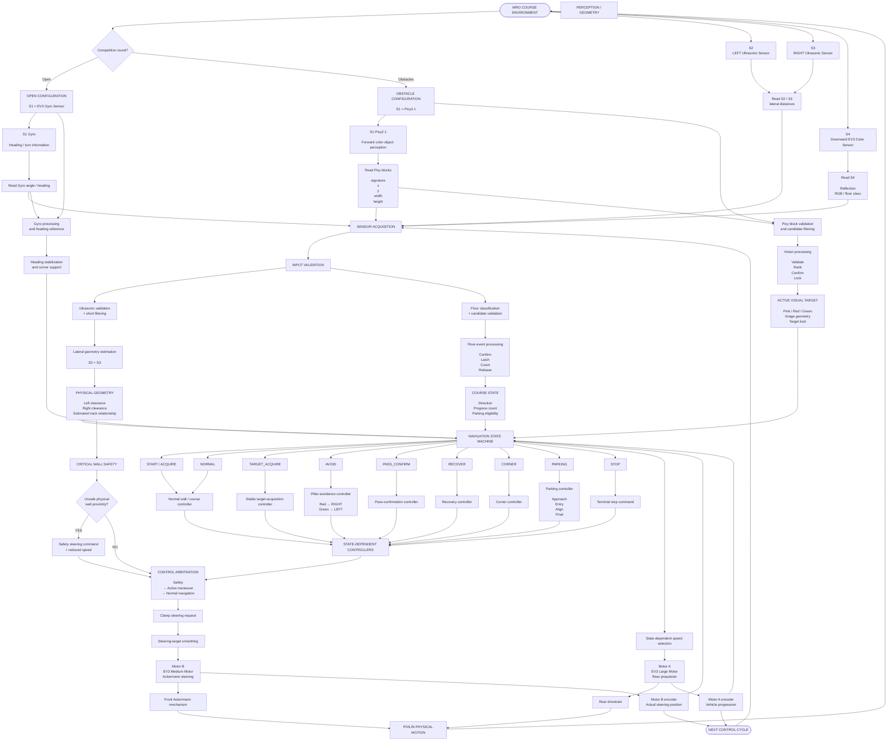

# Piolín System Architecture Flowchart

This flowchart represents Piolín's **complete autonomous-system architecture** for WRO Future Engineers 2026.

The architecture is organized as a layered control system rather than as a direct collection of sensor-to-motor reactions.

The general structure is:

```text
ENVIRONMENT
    ↓
SENSORS
    ↓
INPUT VALIDATION
    ↓
PERCEPTION / GEOMETRY
    ↓
STATE MACHINE
    ↓
ACTIVE CONTROLLER
    ↓
CONTROL ARBITRATION
    ↓
ACTUATION
    ↓
PHYSICAL VEHICLE
    ↓
NEW SENSOR FEEDBACK
```

The same mechanical vehicle is used in both competition rounds, while the S1 sensor changes according to the task.

---

## Complete System Architecture



---

## 1. Same Vehicle, Two Sensor Configurations

Piolín uses one common mechanical platform for both WRO rounds.

The shared architecture is:

```text
EV3 Brick

Motor A propulsion

Motor B steering

S2 LEFT ultrasonic

S3 RIGHT ultrasonic

S4 Color Sensor
```

Only S1 changes.

### Open Challenge

```text
S1
→ EV3 Gyro Sensor
```

### Obstacle Challenge

```text
S1
→ Pixy2.1
```

The Gyro Sensor and Pixy2.1 are therefore not simultaneously active in the current architecture.

---

## 2. Sensor Layer

The sensor layer collects information from the physical course.

### S2

```text
LEFT Ultrasonic Sensor
```

provides information about:

```text
left physical clearance

track geometry

wall safety
```

### S3

```text
RIGHT Ultrasonic Sensor
```

provides equivalent information on the opposite side.

The permanent convention is:

```text
S2 = LEFT

S3 = RIGHT
```

These physical identities do not change with course direction.

---

### S4

The downward Color Sensor provides floor information.

Its roles include:

```text
Blue / Orange detection

initial course direction

course progression

corner context

parking eligibility
```

It does not identify Red and Green pillars.

---

### Gyro

During Open:

```text
S1 = Gyro
```

The Gyro Sensor provides:

```text
heading stabilization

drift information

turn progression

corner support
```

---

### Pixy2.1

During Obstacles:

```text
S1 = Pixy2.1
```

Pixy provides forward visual information.

The current signature mapping is:

```text
sig1
→ PINK
→ Parking
```

```text
sig2
→ RED
→ PASS RIGHT
```

```text
sig3
→ GREEN
→ PASS LEFT
```

Useful block information includes:

```text
signature

x

y

width

height
```

---

## 3. Sensor Acquisition

The EV3 first gathers raw information.

Conceptually:

```text
READ SENSORS
      ↓
store latest measurements
```

The purpose of acquisition is only to obtain data.

The sensor-reading layer should not directly decide:

```text
which obstacle to pass

which state should run

which direction Motor B should steer
```

Those decisions occur later.

---

## 4. Input Validation

Raw sensor values are not automatically trusted.

Piolín applies validation before using them in control.

Examples include:

```text
ultrasonic range checking

short ultrasonic filtering

floor-color classification

Pixy block filtering

candidate validation
```

The intended principle is:

```text
RAW INPUT
→ VALIDATED INPUT
```

before:

```text
navigation decision
```

---

## 5. Ultrasonic Geometry

S2 and S3 are interpreted together.

The wall subsystem asks:

```text
What is Piolín's current lateral relationship
with the surrounding geometry?
```

rather than only:

```text
Is one sensor too close?
```

The result can contribute to:

```text
normal wall following

critical wall safety

pillar pass confirmation

recovery

parking
```

The same measurements can have different importance depending on the navigation state.

---

## 6. Floor Event Processing

S4 continuously observes the floor, but course navigation uses discrete events.

The processing chain is:

```text
CLASSIFY
→ CONFIRM
→ LATCH
→ COUNT
→ RELEASE
→ RE-ARM
```

This converts:

```text
many readings from one physical line
```

into:

```text
one course event
```

The first accepted marking can establish direction:

```text
BLUE first
→ COUNTERCLOCKWISE
```

```text
ORANGE first
→ CLOCKWISE
```

Later events contribute primarily to:

```text
course progression

corner context

parking eligibility
```

---

## 7. Pixy Vision Processing

Pixy detections follow a separate perception pipeline.

```text
READ BLOCKS
      ↓
VALIDATE
      ↓
BUILD CANDIDATES
      ↓
RANK RELEVANCE
      ↓
CONFIRM
      ↓
LOCK TARGET
```

This means:

```text
visible block
```

does not automatically become:

```text
active obstacle
```

The camera reports observations.

The perception layer determines which observation is relevant.

---

## 8. Perception Outputs

The perception layer creates higher-level information.

### Physical geometry

From:

```text
S2 + S3
```

the controller receives a representation of:

```text
lateral course geometry
```

### Course state

From S4:

```text
direction

accepted event count

parking eligibility
```

### Visual target

From Pixy:

```text
signature

image geometry

target confirmation

target lock

required passing side
```

### Heading

During Open, Gyro contributes:

```text
orientation / heading information
```

These higher-level signals are passed to the navigation state machine.

---

## 9. State Machine

The state machine determines:

> **What is Piolín currently trying to accomplish?**

The intended high-level states include:

```text
START / ACQUIRE

NORMAL

TARGET_ACQUIRE

AVOID

PASS_CONFIRM

RECOVER

CORNER

PARKING

STOP
```

The state controls:

```text
which information matters most

which controller becomes authoritative

which speed is appropriate

which transition may occur next
```

---

## 10. NORMAL

During `NORMAL`:

```text
wall / track geometry
```

has strong control authority.

Piolín also monitors:

```text
Pixy candidates

floor events

corner evidence

course progression
```

while continuing normal navigation.

---

## 11. TARGET_ACQUIRE

During `TARGET_ACQUIRE`, Piolín has detected a possible obstacle but has not yet committed fully.

The perception system performs:

```text
validation

relevance selection

confirmation
```

while the vehicle maintains a controlled approach.

---

## 12. AVOID

Once a target is confirmed:

```text
state = AVOID
```

The obstacle rule becomes authoritative.

```text
RED
→ RIGHT
```

```text
GREEN
→ LEFT
```

Normal wall-centering influence is reduced so that it does not cancel the required pillar trajectory.

---

## 13. PASS_CONFIRM

Piolín does not assume:

```text
target disappeared
→ target passed
```

Instead:

```text
PASS_CONFIRM
```

uses:

```text
Pixy history

S2 / S3 geometry

vehicle progression
```

to determine whether physical clearance has actually occurred.

---

## 14. RECOVER

After clearing a pillar, Piolín is intentionally displaced from its normal corridor.

`RECOVER` provides a controlled transition back toward useful geometry.

```text
pillar cleared
      ↓
countersteer
      ↓
reacquire corridor
      ↓
stabilize
      ↓
NORMAL
```

---

## 15. CORNER

During a corner, the normal straight-corridor ultrasonic model becomes less reliable.

The `CORNER` state therefore gives priority to:

```text
corner trajectory
```

while reducing:

```text
normal straight-wall authority
```

until a new corridor is acquired.

---

## 16. PARKING

After:

```text
course progression complete
+
Pink sig1 confirmed
```

parking becomes the high-level objective.

Its internal progression is:

```text
APPROACH
→ ENTRY
→ ALIGN
→ FINAL
→ STOP
```

Parking combines:

```text
Pixy visual geometry

S2/S3 lateral geometry

Motor A progression

Motor B steering state
```

rather than relying on timing alone.

---

## 17. STOP

`STOP` is the terminal state.

Once Piolín reaches the final parking condition:

```text
PARKING
→ STOP
```

the state machine should not reactivate:

```text
NORMAL

AVOID

CORNER

RECOVER
```

because of later sensor observations.

---

## 18. State-Dependent Controllers

Each state has a controller matched to its physical objective.

| State | Primary Controller |
| :--- | :--- |
| `NORMAL` | Wall / course geometry |
| `TARGET_ACQUIRE` | Stable target approach |
| `AVOID` | Pillar trajectory |
| `PASS_CONFIRM` | Committed pass |
| `RECOVER` | Recenter / recovery |
| `CORNER` | Corner trajectory |
| `PARKING` | Parking controller |
| `STOP` | Motor stop |

This prevents all controllers from having equal influence simultaneously.

---

## 19. Critical Wall Safety

Critical wall safety is independent from normal wall following.

It asks:

```text
Is Piolín physically too close to a dangerous boundary?
```

rather than:

```text
Is Piolín exactly where normal navigation prefers?
```

The intended priority is:

```text
CRITICAL SAFETY
      ↓
ACTIVE MANEUVER
      ↓
NORMAL NAVIGATION
```

If safety becomes active:

```text
steering may be overridden

speed may be reduced
```

until the immediate danger is reduced.

---

## 20. Control Arbitration

Piolín has several possible steering controllers but only:

```text
one Motor B
```

Therefore the software must produce:

```text
one final steering target
```

The arbitration layer resolves:

```text
safety request

state controller request

normal navigation request
```

into one command.

The system avoids unrestricted:

```text
wall + pillar + corner + recovery
```

command summation.

---

## 21. Command Limiting

After arbitration:

```text
requested steering
```

is bounded to a valid physical range.

Conceptually:

```python
final_cmd = clamp(
    requested_cmd,
    -MAX_STEER,
    MAX_STEER
)
```

This prevents a controller from requesting a steering target outside the calibrated mechanism range.

---

## 22. Steering Smoothing

The requested target can then be smoothed before reaching Motor B.

Conceptually:

```text
requested target
      ↓
limit target change per cycle
      ↓
new Motor B target
```

This can reduce:

```text
oscillation

steering shock

rapid command reversals
```

but must remain responsive enough for pillar avoidance.

---

## 23. State-Dependent Speed

Motor A speed is also selected according to state.

Conceptually:

```text
NORMAL
→ normal speed
```

```text
TARGET_ACQUIRE
→ controlled approach
```

```text
AVOID
→ obstacle speed
```

```text
RECOVER
→ recovery speed
```

```text
CORNER
→ corner speed
```

```text
PARKING
→ parking speed
```

```text
critical safety
→ reduced safe speed
```

Exact values remain calibration parameters.

---

## 24. Actuation Layer

The final commands are sent to the two active motors.

### Motor A

```text
EV3 Large Motor
→ rear propulsion
```

### Motor B

```text
EV3 Medium Motor
→ front Ackermann steering
```

Motor A primarily controls:

```text
how far / how fast Piolín moves
```

while Motor B primarily controls:

```text
trajectory curvature
```

---

## 25. Mechanical Motion

Motor B drives the front steering mechanism.

Motor A drives the rear drivetrain.

Together:

```text
steering angle
+
vehicle progression
→ physical trajectory
```

This produces:

```text
straight motion

corner arcs

pillar avoidance arcs

recovery

parking
```

Piolín therefore cannot be modeled as a robot that rotates independently of translation.

The software must respect its Ackermann vehicle geometry.

---

## 26. Encoder Feedback

Both motors also provide feedback.

### Motor B encoder

Used to observe:

```text
actual steering position
```

This allows comparison between:

```text
requested target

actual steering
```

### Motor A encoder

Used as evidence of:

```text
vehicle progression
```

especially during:

```text
event separation

maneuver progression

parking
```

Encoder information returns to the software in the next control cycle.

---

## 27. Closed-Loop Architecture

Piolín is therefore a closed-loop system.

```text
COURSE
   ↓
SENSORS
   ↓
SOFTWARE
   ↓
MOTORS
   ↓
VEHICLE MOVES
   ↓
COURSE RELATIONSHIP CHANGES
   ↓
SENSORS READ AGAIN
```

The robot continuously observes the result of its previous control action.

This is fundamentally different from a purely open-loop sequence such as:

```text
turn for 1 second

drive for 2 seconds

stop
```

although limited timed actions may still be useful for specific experimental or safety purposes.

---

## 28. Open Challenge Information Flow

During Open:

```text
               COURSE
                  │
        ┌─────────┼─────────┐
        │         │         │
        ▼         ▼         ▼
      S2/S3      S4       GYRO
        │         │         │
        ▼         ▼         ▼
    GEOMETRY   EVENTS    HEADING
        │         │         │
        └─────────┼─────────┘
                  ▼
             STATE / CONTROL
                  │
                  ▼
          CONTROL ARBITRATION
                  │
          ┌───────┴───────┐
          ▼               ▼
       Motor A          Motor B
```

The core separation is:

```text
S2/S3
→ lateral geometry
```

```text
Gyro
→ orientation
```

```text
S4
→ course landmarks
```

---

## 29. Obstacle Challenge Information Flow

During Obstacles:

```text
               COURSE
                  │
       ┌──────────┼──────────┐
       │          │          │
       ▼          ▼          ▼
     S2/S3       S4        PIXY
       │          │          │
       ▼          ▼          ▼
   GEOMETRY    EVENTS     TARGET
       │          │          │
       └──────────┼──────────┘
                  ▼
             STATE MACHINE
                  │
      ┌───────────┼───────────┐
      ▼           ▼           ▼
    NORMAL      AVOID       PARKING
      │           │           │
      └───────────┼───────────┘
                  ▼
             ARBITRATION
                  │
          ┌───────┴───────┐
          ▼               ▼
       Motor A          Motor B
```

Because there is no gyro during Obstacles, orientation-related maneuver progress must be inferred through:

```text
camera state

S2/S3 geometry

Motor A progression

Motor B position

state history
```

---

## 30. Architectural Separation of Responsibilities

Piolín's architecture deliberately avoids assigning every task to every sensor.

The main responsibilities are:

```text
S2 / S3
→ lateral physical geometry
```

```text
S4
→ floor state and course progression
```

```text
Gyro
→ Open heading information
```

```text
Pixy2.1
→ Obstacle visual perception
```

```text
State machine
→ behavioral context
```

```text
Controllers
→ trajectory generation
```

```text
Arbitration
→ final authority
```

```text
Motor A
→ propulsion
```

```text
Motor B
→ steering
```

This reduces ambiguity when the robot fails.

---

## 31. Failure Traceability

Because the system is layered, a failure can be traced through:

```text
SENSOR
   ↓
VALIDATION
   ↓
PERCEPTION
   ↓
STATE
   ↓
CONTROLLER
   ↓
ARBITRATION
   ↓
FINAL COMMAND
   ↓
MOTOR RESPONSE
   ↓
PHYSICAL RESULT
```

For example:

```text
Pixy reports RED

Rule reports RIGHT

Avoid controller reports RIGHT

Final command reports LEFT
```

indicates:

```text
problem after obstacle decision
```

rather than immediately blaming Pixy.

This traceability is one of the main advantages of the layered architecture.

---

## System Architecture Summary

```text
                       PHYSICAL COURSE
                             │
                             ▼
                    ROUND CONFIGURATION
                         /          \
                      OPEN        OBSTACLES
                       │              │
                    S1 Gyro        S1 Pixy
                       │              │
                       └──────┬───────┘
                              │
                S2 LEFT ──────┼────── S3 RIGHT
                              │
                            S4 COLOR
                              │
                              ▼
                       SENSOR ACQUISITION
                              │
                              ▼
                          VALIDATION
                              │
                              ▼
                         PERCEPTION
                  /             |             \
             GEOMETRY       COURSE STATE     TARGET
                  \             |             /
                   └────────────┼────────────┘
                                ▼
                          STATE MACHINE
                                │
                                ▼
                       ACTIVE CONTROLLER
                                │
                  ┌─────────────┴─────────────┐
                  │                           │
                  ▼                           ▼
            CRITICAL SAFETY              MANEUVER
                  │                           │
                  └─────────────┬─────────────┘
                                ▼
                       CONTROL ARBITRATION
                                │
                                ▼
                       CLAMP / SMOOTH / SPEED
                                │
                    ┌───────────┴───────────┐
                    ▼                       ▼
                 MOTOR A                  MOTOR B
                PROPULSION              STEERING
                    │                       │
                    └───────────┬───────────┘
                                ▼
                        PIOLÍN PHYSICAL MOTION
                                │
                                ▼
                          NEW SENSOR DATA
                                │
                                └──────► NEXT LOOP
```

---

## Final System Architecture Principle

PiolínTech's autonomous architecture follows one central principle:

> **Sensors describe the environment, perception converts those measurements into useful information, the state machine determines the current objective, controllers generate candidate actions, arbitration decides which action has authority, and the motors execute one final physical command whose result is measured again in the next control cycle.**

The architecture therefore avoids:

```text
one sensor
→ one immediate motor reaction
```

and instead follows:

```text
SENSE
→ VALIDATE
→ INTERPRET
→ DECIDE
→ CONTROL
→ ACT
→ MEASURE AGAIN
```

This layered structure allows Piolín's:

```text
Open navigation

obstacle avoidance

corner handling

recovery

course counting

parking

critical safety
```

to coexist within one understandable system while preserving clear responsibilities between hardware, perception, state logic, control, and actuation.
