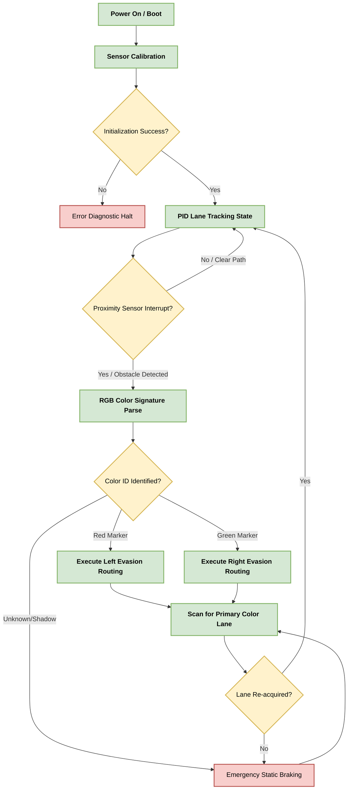
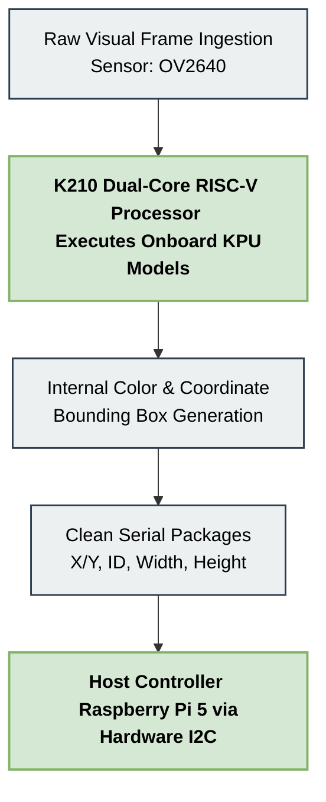

# Flowcharts and Resources

## 1. [Navigation State Flowchart](./01_NVStateFC.md)

The Navigation State Flowchart visualizes our core control loop. Upon system boot and sensor calibration, the robot enters a high speed PID state to track the lane. We utilize an interrupt driven architecture where the main execution pauses only when proximity sensors detect an obstacle. This triggers the RGB parsing routine to identify color coded markers. The logic then executes a pre defined evasion maneuver based on the color identification, either turning left for red or right for green. The robot constantly scans to reacquire the primary lane, defaulting to emergency braking if visual confirmation fails. This state machine approach ensures that our robot maintains stability during complex maneuvers without losing its orientation on the track.

---

## 2. [Vision Processing Logic](./02_VProcessing.md)

This diagram outlines the computer vision pipeline that powers our autonomous obstacle detection system. We employ the K210 dual core RISC V processor, which acts as a dedicated AI accelerator. It ingests raw visual frames from the OV2640 sensor. The onboard KPU model then executes real time feature extraction to identify red and green color signatures. Once detected, it generates precise bounding boxes for these objects. This coordinate data is formatted into clean serial packages containing X and Y offsets, ID tags, and dimensions. These packages are transmitted to the host Raspberry Pi 5 via hardware I2C protocols. This offloading strategy is critical for performance, allowing the main processor to focus on steering.

---

## 3. [Torque Calculation](./03_TorqueCalc.png)

This document details the mechanical analysis used to select the optimal drive motor for our chassis. We calculated the total tractive force required by summing the force of acceleration and the rolling resistance. With a vehicle mass of 0.72 kg and an acceleration of 0.50 m/s squared, our calculations resulted in a required force of 0.50 N. We then derived the required torque by multiplying this force by the radius of the rear wheels. The resulting value confirmed that our assembly maintains a torque capacity approximately 18 times greater than the threshold required to overcome static inertia. This significant safety margin ensures our robot can handle rapid accelerations and track surface changes without motor stalling.

