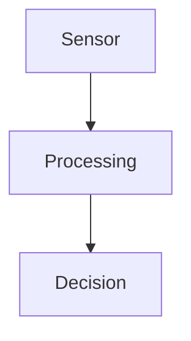

# PiolínTech Embedded Engineering Diagrams

The `embed/` directory contains the main **engineering diagrams, flowcharts, and visual architecture references** used throughout the PiolínTech WRO Future Engineers 2026 repository.

These files complement the detailed documentation under `docs/` by providing fast visual explanations of Piolín's:

```text
navigation architecture

Pixy2.1 vision processing

controller arbitration

obstacle strategy

floor-event processing

parking

calibration process

engineering workflow

complete system architecture
```

Most current diagrams are stored as Markdown files containing **Mermaid flowcharts** so they can be rendered directly by GitHub while remaining easy to edit and version-control.

The directory also contains a small number of PNG diagrams used as static engineering evidence or legacy documentation.

---

# 1. Directory Structure

```text
embed/
│
├── 01_NVStateFC.md
├── 02_VProcessing.md
├── 03_TorqueCalc.png
├── 04_ControlArbitration.md
├── 05_ObstacleStrategyFC.md
├── 06_ColorEventFC.md
├── 07_ParkingStateFC.md
├── 08_ParkingCalibrationFC.md
├── 09_EngineeringProcessFC.md
├── 10_SystemArchitectureFC.md
│
├── legacy_layered_testing.png
├── legacy_testing_cycle.png
│
└── README.md
```

The numbered files represent the current visual documentation set.

Files beginning with:

```text
legacy_
```

represent earlier development material and should not be interpreted as the current system architecture.

---

# 2. Visual Documentation Map

The diagrams can be understood as different levels of Piolín's system.

```text
                     10 SYSTEM ARCHITECTURE
                              │
                 ┌────────────┼────────────┐
                 │            │            │
                 ▼            ▼            ▼
           01 NAVIGATION   02 VISION   06 COLOR EVENTS
              STATES       PROCESSING
                 │            │
                 ├────────────┘
                 │
                 ▼
          04 CONTROL ARBITRATION
                 │
        ┌────────┼───────────┐
        │        │           │
        ▼        ▼           ▼
    05 PILLAR  07 PARKING  OTHER STATES
    STRATEGY      │
                  ▼
           08 PARKING CALIBRATION


         09 ENGINEERING PROCESS
                  │
                  ▼
          HOW THE SYSTEM EVOLVES
```

The files therefore do not duplicate each other.

Each one represents a different engineering layer.

---

# 3. Current Flowcharts

## 01 — Navigation State Flowchart

### [01_NVStateFC.md](01_NVStateFC.md)

This is the high-level **Obstacle Challenge navigation state machine**.

It shows how Piolín moves between:

```text
START

ACQUIRE

NORMAL

TARGET_ACQUIRE

AVOID

PASS_CONFIRM

RECOVER

CORNER

PARKING

STOP
```

Its main purpose is to answer:

> **What is Piolín currently trying to accomplish?**

This diagram should be used as the primary visual reference for the navigation-state architecture.

---

## 02 — Pixy2.1 Vision Processing

### [02_VProcessing.md](02_VProcessing.md)

This diagram shows how raw Pixy2.1 blocks become useful perception information.

The pipeline is:

```text
PIXY BLOCKS
      ↓
VALIDATE
      ↓
CLASSIFY
      ↓
BUILD CANDIDATES
      ↓
RANK RELEVANCE
      ↓
CONFIRM
      ↓
LOCK
      ↓
OUTPUT TARGET
```

It reinforces the architectural separation:

```text
Pixy2.1
→ perception
```

rather than:

```text
Pixy2.1
→ direct Motor B command
```

The current signature mapping is:

```text
sig1
→ Pink
→ Parking
```

```text
sig2
→ Red
→ PASS RIGHT
```

```text
sig3
→ Green
→ PASS LEFT
```

---

# 4. Torque Calculation Graphic

## 03 — Torque Calculation

`03_TorqueCalc.png`

This is a static engineering graphic related to torque calculations.

Unlike the Mermaid flowcharts, this file is a normal image and can be embedded directly in Markdown using:

```html

```

The exact relative path depends on the location of the Markdown document using the image.

This file is separate from Piolín's navigation architecture and belongs to the repository's supporting engineering-analysis material.

---

# 5. Control Architecture

## 04 — Control Arbitration

### [04_ControlArbitration.md](04_ControlArbitration.md)

This flowchart explains how Piolín selects **one final steering command** when several subsystems could request different actions.

The central priority is:

```text
CRITICAL SAFETY
      ↓
ACTIVE MANEUVER
      ↓
NORMAL NAVIGATION
```

This prevents uncontrolled combinations such as:

```text
wall correction
+
pillar correction
+
corner correction
+
recovery correction
```

from fighting each other.

It explains why:

```text
NORMAL
→ wall geometry authority
```

```text
AVOID
→ pillar trajectory authority
```

```text
CORNER
→ corner authority
```

```text
RECOVER
→ recovery authority
```

```text
PARKING
→ parking authority
```

while critical physical wall protection remains independent.

---

# 6. Obstacle Maneuver

## 05 — Obstacle Strategy Flowchart

### [05_ObstacleStrategyFC.md](05_ObstacleStrategyFC.md)

This diagram is a detailed view of **one complete pillar maneuver**.

The sequence is:

```text
NORMAL
   ↓
DETECT
   ↓
VALIDATE
   ↓
SELECT
   ↓
CONFIRM
   ↓
LOCK
   ↓
APPROACH
   ↓
AVOID
   ↓
PASS_CONFIRM
   ↓
RELEASE
   ↓
RECOVER
   ↓
NORMAL
```

It also shows the fixed WRO passing rules:

```text
RED
→ PASS RIGHT
```

```text
GREEN
→ PASS LEFT
```

This diagram is more detailed than `01_NVStateFC.md`.

`01_NVStateFC.md` explains:

```text
the complete navigation state system
```

while `05_ObstacleStrategyFC.md` explains:

```text
what happens inside one pillar-handling sequence
```

---

# 7. Floor Event Processing

## 06 — Color Event Flowchart

### [06_ColorEventFC.md](06_ColorEventFC.md)

This diagram explains how the downward S4 Color Sensor converts continuous floor observations into discrete navigation events.

The processing sequence is:

```text
READ FLOOR
      ↓
CLASSIFY
      ↓
CANDIDATE
      ↓
CONFIRM
      ↓
CHECK SEPARATION
      ↓
ACCEPT EVENT
      ↓
COUNT
      ↓
LATCH
      ↓
WAIT FOR NEUTRAL
      ↓
RELEASE
      ↓
RE-ARM
```

The primary objective is:

```text
one physical marking
→ one software event
```

rather than:

```text
one physical marking
→ many control-loop counts
```

The first confirmed event also supports course-direction initialization:

```text
BLUE first
→ COUNTERCLOCKWISE
```

```text
ORANGE first
→ CLOCKWISE
```

Later accepted events provide course-progress information.

---

# 8. Parking

## 07 — Parking State Flowchart

### [07_ParkingStateFC.md](07_ParkingStateFC.md)

This diagram represents the complete terminal parking-state sequence.

```text
COURSE COMPLETE
      ↓
PARKING ELIGIBLE
      ↓
PINK CONFIRMED
      ↓
TARGET LOCK
      ↓
APPROACH
      ↓
ENTRY
      ↓
ALIGN
      ↓
FINAL
      ↓
STOP
```

Parking is therefore not modeled as:

```text
Pink visible
→ turn
→ stop
```

Instead, course state, Pixy perception, physical geometry, encoder progression, and steering state contribute to the final maneuver.

`STOP` is terminal.

Once Piolín reaches it, normal autonomous navigation does not resume.

---

## 08 — Parking Calibration Flowchart

### [08_ParkingCalibrationFC.md](08_ParkingCalibrationFC.md)

This diagram explains **how the parking parameters are calibrated**, rather than how parking itself operates.

The engineering process is:

```text
FREEZE HARDWARE
      ↓
VERIFY SENSORS
      ↓
VERIFY STEERING
      ↓
CALIBRATE PIXY
      ↓
CALIBRATE APPROACH
      ↓
FREEZE APPROACH
      ↓
CALIBRATE ENTRY
      ↓
FREEZE ENTRY
      ↓
CALIBRATE ALIGNMENT
      ↓
FREEZE ALIGNMENT
      ↓
CALIBRATE FINAL POSITION
      ↓
CALIBRATE STOP
      ↓
REPEAT
      ↓
SAVE BASELINE
```

The key principle is:

> **A later parking phase should not be used to compensate for an earlier phase that is already incorrect.**

For example:

```text
FINAL
```

should not compensate for poor:

```text
ALIGNMENT
```

and alignment should not compensate for a poor:

```text
ENTRY
```

---

# 9. Engineering Development

## 09 — Engineering Process Flowchart

### [09_EngineeringProcessFC.md](09_EngineeringProcessFC.md)

This diagram represents the development methodology used by PiolínTech.

The cycle is:

```text
REQUIREMENT
      ↓
OBSERVE
      ↓
FIND FIRST INCORRECT LAYER
      ↓
FORM HYPOTHESIS
      ↓
PRESERVE BASELINE
      ↓
CHANGE ONE PRIMARY VARIABLE
      ↓
CONTROLLED TEST
      ↓
COLLECT EVIDENCE
      ↓
REPEAT
      ↓
KEEP OR REVERT
      ↓
REGRESSION TEST
      ↓
DOCUMENT
      ↓
INTEGRATE
```

The diagnostic layers include:

```text
MECHANICS

SENSORS

PERCEPTION

STATE / DECISION

CONTROL

ARBITRATION

ACTUATION
```

The main engineering rule is to correct the **first layer that becomes incorrect**, rather than immediately changing the subsystem associated with the final visible symptom.

---

# 10. Complete System Architecture

## 10 — System Architecture Flowchart

### [10_SystemArchitectureFC.md](10_SystemArchitectureFC.md)

This is the highest-level technical diagram in the `embed/` directory.

It connects:

```text
PHYSICAL COURSE
      ↓
SENSORS
      ↓
ACQUISITION
      ↓
VALIDATION
      ↓
PERCEPTION
      ↓
STATE MACHINE
      ↓
CONTROLLERS
      ↓
CONTROL ARBITRATION
      ↓
MOTORS
      ↓
PHYSICAL MOTION
      ↓
SENSOR FEEDBACK
```

It also documents the two round-specific S1 configurations.

### Open

```text
S1 → Gyro
S2 → LEFT Ultrasonic
S3 → RIGHT Ultrasonic
S4 → Color Sensor
```

### Obstacles

```text
S1 → Pixy2.1
S2 → LEFT Ultrasonic
S3 → RIGHT Ultrasonic
S4 → Color Sensor
```

The system architecture diagram should be used when a reader needs to understand **how all Piolín subsystems connect together**.

---

# 11. Relationship Between the Current Diagrams

The current visual set can be read from highest level to lowest level.

### Complete system

```text
10_SystemArchitectureFC.md
```

answers:

> How does the entire robot work as one closed-loop system?

### Navigation behavior

```text
01_NVStateFC.md
```

answers:

> Which autonomous state is active?

### Perception

```text
02_VProcessing.md
```

answers:

> How does Pixy information become a target?

```text
06_ColorEventFC.md
```

answers:

> How does a floor reading become a course event?

### Controller selection

```text
04_ControlArbitration.md
```

answers:

> Which controller is allowed to command steering?

### Specific maneuver

```text
05_ObstacleStrategyFC.md
```

answers:

> How does Piolín completely handle one pillar?

### Terminal maneuver

```text
07_ParkingStateFC.md
```

answers:

> How does Piolín execute parking?

```text
08_ParkingCalibrationFC.md
```

answers:

> How is that parking behavior calibrated?

### Development method

```text
09_EngineeringProcessFC.md
```

answers:

> How does PiolínTech improve the robot when something fails?

---

# 12. Current vs. Legacy Diagrams

The repository also contains:

```text
legacy_layered_testing.png

legacy_testing_cycle.png
```

These files represent earlier engineering-development material.

They are intentionally preserved because they provide evidence of:

```text
earlier testing methodology

architecture evolution

engineering iteration
```

However, they should not override the current architecture documented by the numbered flowcharts.

The distinction is:

```text
01–10
→ CURRENT VISUAL DOCUMENTATION
```

```text
legacy_*
→ HISTORICAL / DEVELOPMENT EVIDENCE
```

This follows the same current-vs-legacy philosophy used throughout the PiolínTech repository.

---

# 13. How to Use the Mermaid Files

Files such as:

```text
01_NVStateFC.md

02_VProcessing.md

04_ControlArbitration.md
```

contain Mermaid blocks.

For example:

````text

```mermaid
flowchart TD

    A[Sensor]
    B[Processing]
    C[Decision]

    A --> B
    B --> C
```
