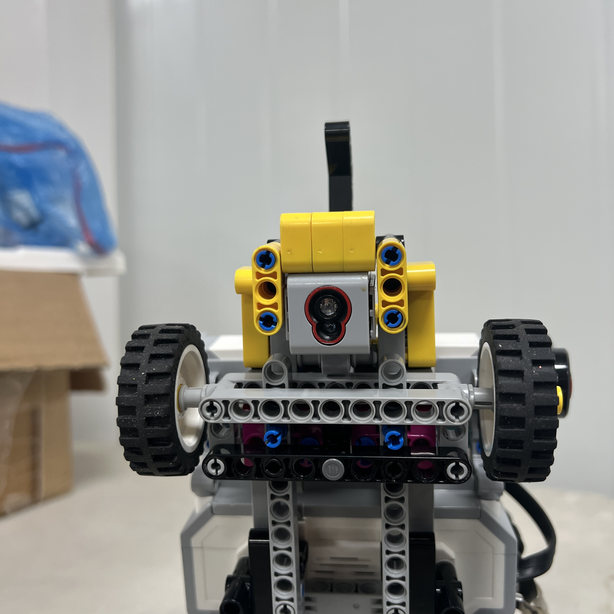
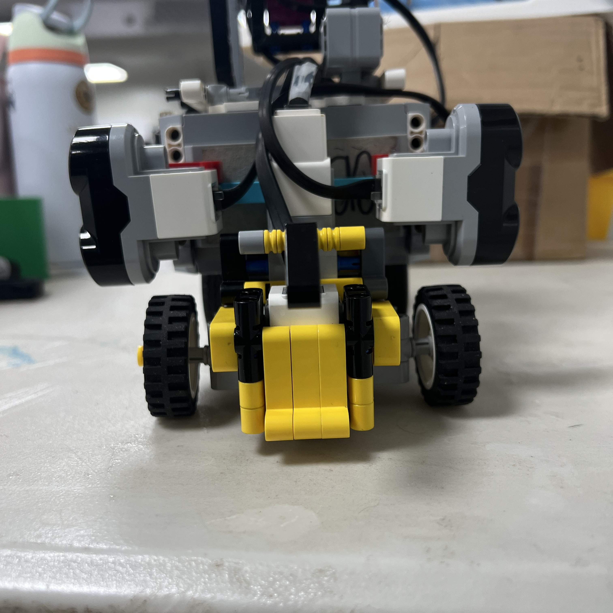
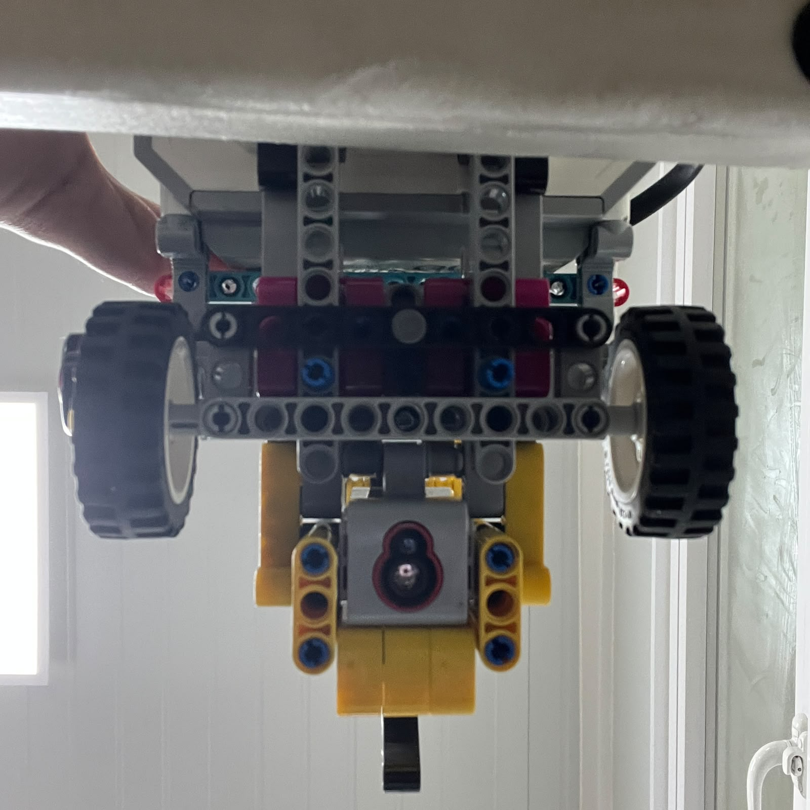
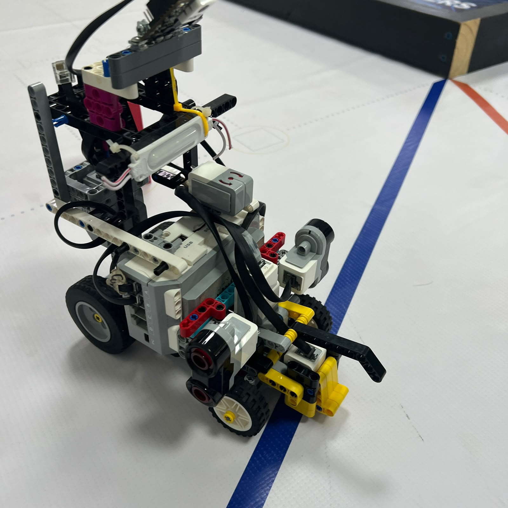
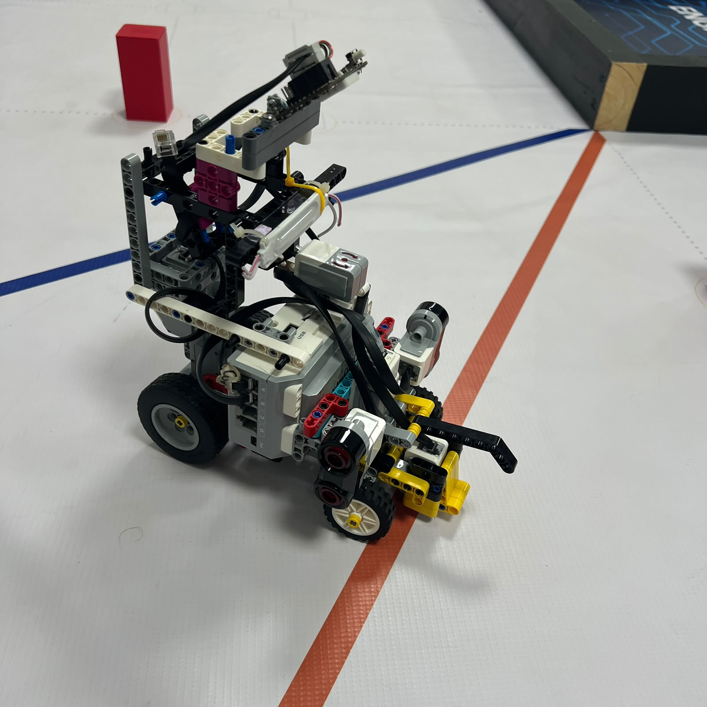

# Color Sensor Casing — 3D Printing and Installation

This document describes the manufacturing, installation, and verification process for Piolín's custom **EV3 Color Sensor casing**.

The casing is manufactured from:

```text
ColorSensorCasing.stl
```

and is installed around the downward-facing **LEGO EV3 Color Sensor connected to S4**.

Its purpose is not decorative. The component was introduced to create a more controlled physical environment around the sensor and reduce the influence of uncontrolled ambient light on floor readings.

This is particularly important because S4 is used to detect the WRO course's:

```text
BLUE markings

ORANGE markings
```

which contribute to:

```text
initial direction detection

course-event recognition

progress counting

corner context

parking eligibility
```

---

## 1. Component Overview

| Property | Current Implementation |
|---|---|
| File | `ColorSensorCasing.stl` |
| Component | S4 Color Sensor casing |
| Sensor | LEGO EV3 Color Sensor |
| Sensor port | S4 |
| Manufacturing method | FDM 3D printing |
| Printer | Anet ET4X |
| Material | OVERTURE High Speed PLA |
| Filament diameter | 1.75 mm |
| Nozzle temperature | 200 °C |
| Heated bed temperature | 80 °C |
| Print speed setting | 100% |
| Status | Current |

The casing is part of Piolín's current sensing installation.

---

## 2. Why the Casing Was Needed

The EV3 Color Sensor is mounted close to the floor and reads reflected light from the surface below Piolín.

Without some physical isolation, its measurements can be influenced by changes in the surrounding optical environment.

Possible sources of variation include:

```text
room lighting

competition-area lighting

shadows

light entering from the sides

different robot orientations relative to lights
```

The casing creates a more controlled region around the sensor.

The design objective is:

```text
UNCONTROLLED AMBIENT LIGHT
            ↓
     PHYSICAL CASING
            ↓
MORE CONTROLLED SENSOR AREA
            ↓
        S4 READING
            ↓
  FLOOR CLASSIFICATION
```

The casing does not make the Color Sensor completely immune to lighting changes.

For this reason, the sensor is still calibrated and physically tested after installation.

---

## 3. Physical Installation

Piolín's Color Sensor is mounted:

```text
downward-facing
```

with the casing surrounding the sensing area.

<div align="center">



<br>

<sub><b>Figure 1.</b> Piolín's downward-facing EV3 Color Sensor installed on S4.</sub>

</div>

The casing is installed so that it can shield the surrounding sensing region without preventing the sensor from observing the floor.

<div align="center">



<br>

<sub><b>Figure 2.</b> Custom 3D-printed casing used around Piolín's Color Sensor.</sub>

</div>

The bottom view is particularly important because the final installation must leave the sensing path unobstructed.

<div align="center">



<br>

<sub><b>Figure 3.</b> Bottom view of the Color Sensor installation and surrounding casing.</sub>

</div>

---

# 4. Manufacturing Parameters

The casing was printed using the same manufacturing setup documented for PiolínTech's current 3D-printed components.

| Parameter | Setting |
|---|---:|
| Printer | Anet ET4X |
| Material | OVERTURE High Speed PLA |
| Filament diameter | 1.75 mm |
| Nozzle temperature | 200 °C |
| Heated bed temperature | 80 °C |
| Print speed setting | 100% |

The `100%` value represents the printer's speed setting used during manufacturing. It is not documented as a measured speed in mm/s.

Parameters that were not formally recorded during manufacturing, such as exact:

```text
layer height

infill percentage

support configuration

print duration
```

are not presented here as measured values.

This avoids introducing unverified fabrication specifications into the repository.

---

# 5. Printing Process

The manufacturing sequence for the casing was:

```text
ColorSensorCasing.stl
        ↓
IMPORT INTO SLICER
        ↓
PREPARE MODEL
        ↓
SET PRINT PARAMETERS
        ↓
SLICE
        ↓
PREHEAT ANET ET4X
        ↓
BED → 80 °C
NOZZLE → 200 °C
        ↓
PRINT AT 100% SPEED SETTING
        ↓
REMOVE COMPONENT
        ↓
VISUAL INSPECTION
        ↓
FIT TEST
        ↓
INSTALL ON PIOLÍN
        ↓
VERIFY COLOR SENSOR
```

The printing stage is only one part of the complete process.

A finished print is not accepted until its fit and sensor behavior have also been checked.

---

## 6. Post-Print Inspection

After printing, the casing is inspected before being installed.

The main checks are:

```text
Is the main geometry complete?

Is the component visibly deformed?

Can the Color Sensor fit correctly?

Is the sensing opening unobstructed?

Can the S4 cable remain connected normally?

Does the casing interfere with nearby LEGO structure?
```

A casing that prints successfully but obstructs the sensor is not considered a successful component.

The inspection therefore evaluates:

```text
MANUFACTURING QUALITY
+
ROBOT COMPATIBILITY
+
SENSOR COMPATIBILITY
```

---

# 7. Installation Verification

After the casing is mounted on Piolín, the team checks the complete installation.

The verification sequence is:

```text
INSTALL CASING
      ↓
CHECK PHYSICAL FIT
      ↓
CHECK SENSOR ORIENTATION
      ↓
CHECK FLOOR CLEARANCE
      ↓
CHECK SENSOR OPENING
      ↓
CHECK S4 CABLE
      ↓
POWER ROBOT
      ↓
READ SENSOR
```

The casing should not:

```text
block the Color Sensor

touch the track surface

interfere with the cable

move the sensor into an unusable orientation
```

The objective is to improve the sensor environment without preventing normal sensing.

---

# 8. Blue and Orange Verification

After installation, the sensor must be tested again on the actual floor markings.

The two important course references are:

```text
BLUE
```

and:

```text
ORANGE
```

<div align="center">



<br>

<sub><b>Figure 4.</b> Color Sensor verification over a Blue course marking.</sub>

</div>

<div align="center">



<br>

<sub><b>Figure 5.</b> Color Sensor verification over an Orange course marking.</sub>

</div>

The testing objective is not simply to confirm that the sensor reports a value.

The team checks whether the readings are sufficiently distinguishable for the software's floor-classification logic.

The process is:

```text
NEUTRAL FLOOR
      ↓
record sensor behavior

BLUE
      ↓
record sensor behavior

ORANGE
      ↓
record sensor behavior
```

Then the software classification can be checked against the real physical installation.

---

# 9. Relationship with Software Calibration

Changing the physical environment around an optical sensor can change the measurements received by the software.

Therefore:

```text
NEW CASING
≠
OLD CALIBRATION AUTOMATICALLY VALID
```

The correct sequence is:

```text
PRINT CASING
      ↓
INSTALL CASING
      ↓
VERIFY SENSOR POSITION
      ↓
READ REAL FLOOR VALUES
      ↓
CHECK BLUE
      ↓
CHECK ORANGE
      ↓
CHECK NEUTRAL FLOOR
      ↓
ADJUST CLASSIFICATION IF REQUIRED
      ↓
TEST WHILE MOVING
```

Piolín's software can use information such as:

```text
reflection

red channel

green channel

blue channel
```

to distinguish course markings.

The physical casing and software classifier therefore form a combined sensing system.

---

# 10. Color Event Processing

The casing supports the sensing layer, but it does not directly control navigation.

The complete architecture is:

```text
PHYSICAL FLOOR
      ↓
3D-PRINTED CASING
      ↓
S4 COLOR SENSOR
      ↓
RGB / REFLECTION READING
      ↓
FLOOR CLASSIFICATION
      ↓
EVENT CONFIRMATION
      ↓
LATCH / DUPLICATE PROTECTION
      ↓
ACCEPTED COURSE EVENT
      ↓
NAVIGATION STATE MACHINE
```

This separation is important.

The casing improves the physical sensing environment.

The software is still responsible for:

```text
classification

confirmation

event counting

duplicate prevention

state interpretation
```

The detailed color-event architecture is documented in:

[Color Event Processing Flowchart](../../embed/06_ColorEventFC.md)

---

# 11. Engineering Iteration

The Color Sensor casing represents a hardware response to a sensing problem.

The development relationship is:

```text
OBSERVE VARIABLE SENSOR BEHAVIOR
              ↓
IDENTIFY LIGHT AS A POSSIBLE FACTOR
              ↓
ADD PHYSICAL SENSOR ISOLATION
              ↓
3D PRINT CASING
              ↓
INSTALL
              ↓
RETEST SENSOR
              ↓
RECALIBRATE SOFTWARE
```

This is important because the solution does not rely only on adding more software filtering.

Instead, PiolínTech addresses the problem at both:

```text
PHYSICAL LEVEL
```

and:

```text
SOFTWARE LEVEL
```

The physical system attempts to make the measurements more repeatable, while software handles classification and event processing.

---

# 12. Reproduction Procedure

To reproduce the current casing:

### Required file

```text
ColorSensorCasing.stl
```

### Printer

```text
Anet ET4X
```

### Material

```text
OVERTURE High Speed PLA
1.75 mm
```

### Printing parameters

```text
Nozzle: 200 °C

Bed: 80 °C

Speed setting: 100%
```

### After printing

```text
1. Inspect the printed geometry.

2. Test-fit the EV3 Color Sensor.

3. Install the casing on Piolín.

4. Verify that the sensing opening remains unobstructed.

5. Verify that the sensor does not contact the floor.

6. Verify the S4 connection.

7. Test neutral floor readings.

8. Test Blue.

9. Test Orange.

10. Recalibrate the software classifier if required.

11. Test color-event detection while Piolín is moving.
```

---

# Engineering Summary

The `ColorSensorCasing.stl` component connects mechanical design directly to autonomous sensing.

```text
3D MODEL
   ↓
FDM PRINT
   ↓
PHYSICAL CASING
   ↓
CONTROLLED SENSOR ENVIRONMENT
   ↓
S4 MEASUREMENTS
   ↓
BLUE / ORANGE CLASSIFICATION
   ↓
COURSE EVENTS
   ↓
NAVIGATION
```

The casing is therefore not simply an accessory around the sensor.

It is part of Piolín's complete:

```text
MECHANICAL
+
OPTICAL
+
SOFTWARE
```

sensing architecture.

The central design principle is:

> **The Color Sensor casing was introduced to make the physical sensing environment more controlled and repeatable. After manufacturing and installation, its effectiveness is verified through real S4 measurements and course-marking tests rather than assumed from the printed geometry alone.**

---

<div align="center">

### [← Back to 3D Printing Process](PrintingProcess.md)

</div>
