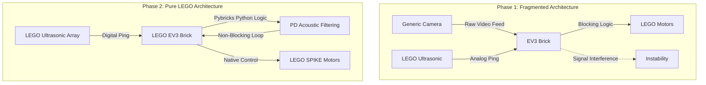

## The Evolution of our robot Piolín

The development of our kid Piolín was not a linear path. It required a rigorous iterative engineering process that moved from a highly unstable proof of concept prototype to a tightly integrated autonomous vehicle ready for competition. This section documents our engineering journey in absolute detail. We explore the mechanical, electrical, and software transformations across our primary development phases. By analyzing our past failures and documenting our iterative solutions, we demonstrate the robustness, reliability, and engineering logic behind our final design choices.
 

### [Phase 1: The Initial Prototype](./evolution/Phase1.md)

Phase 1 represents our foundational attempt at solving the WRO track challenges. The primary goal during this early stage was simply to achieve basic mobility, verify sensor integration, and test initial lane tracking capabilities. However, this phase was heavily constrained by our reliance on standard LEGO Technic parts, failing external sensors, and structurally weak components that could not handle the physical demands of autonomous racing.

#### Mechanical and Structural Baseline
During our initial mechanical drafting, we utilized standard plastic building elements to prototype the chassis. While this allowed for quick assembly, we immediately encountered severe structural limitations that degraded our physical performance. The most critical failure occurred in our front steering assembly. We used a standard technic piece that has exactly 3 holes (two horizontal and one vertical) to act as our primary steering knuckle. This specific component suffered from immense torsional flex when subjected to the lateral cornering forces of the track. This flex resulted in a shifting kingpin angle and unpredictable steering geometry, making reliable PD calibration nearly impossible. Furthermore, the center of gravity was excessively high, causing the inner wheels to lift during high speed turns and destabilizing the platform.

#### Electrical and Processing Architecture
The first iteration relied on a fragmented processing approach. We attempted to route sensor data through a chaotic mix of cables, leading to communication bottlenecks and hardware limitations.
*   **Motor Control:** We utilized standard LEGO EV3 motors connected directly to the EV3 brick. While these motors were reliable, our cable routing was disorganized, leading to loose connections and signal dropouts during high speed maneuvers.
*   **Vision Failures:** We initially utilized a generic external camera module that lacked any onboard processing. This generic camera sent raw video feeds directly to the main processor, completely overwhelming the system bandwidth. This caused severe frame drops and frequent false positives due to ambient track lighting changes. The integration of this external non standard part proved far too unstable for a reliable race run.

#### Software and Logic Limitations
The software architecture in Phase 1 was strictly synchronous and relied on inferior peripheral components that constantly failed under load.
*   **Latency:** This blocking architecture meant that whenever the generic camera processed a frame, the steering control loop paused. This resulted in a stuttering movement profile where the robot would zig zag violently down the straights instead of maintaining a smooth trajectory.
*   **Inefficient Loops:** Our code was fragmented and difficult to manage. This made debugging incredibly difficult and massively increased the time it took to iterate and test new code between track runs.

 

### [Phase 2: The "All LEGO" Pure Architecture](./evolution/Phase2.md)

Phase 2 marks a massive pivot in our engineering strategy. Realizing that complexity was our enemy, we completely discarded the unstable external camera and the weak structural components of Phase 1. Instead, we embraced a pure, centralized architecture built strictly from LEGO components. V2 was completely "blind" and had absolutely no external camera modules. We utilized the LEGO Mindstorms EV3 block, LEGO SPIKE structural elements, and LEGO Ultrasonic sensors to create a highly reliable, closed ecosystem.

#### Advanced Mechanical Redesign with LEGO SPIKE
To resolve the structural failures and flex of Phase 1, we transitioned entirely to an "All LEGO" framework. By leveraging the superior rigidity of modern LEGO SPIKE components, we eliminated the mechanical slop found in the older 3 hole technic pieces.
*   **SPIKE Integration:** We utilized LEGO SPIKE frames and wheels to build a bespoke chassis that maximized rigidity while minimizing weight. The SPIKE wheels provided vastly superior traction on the track surface compared to our earlier iterations, preventing wheel slip during hard acceleration.
*   **Centralized Balance:** The heavy battery packs and the EV3 controller were relocated to the absolute lowest deck of the chassis. This drastically improved cornering stability, lowered the roll center, and completely eliminated the wheel lift we experienced in Phase 1.

#### Pure LEGO Sensor and Processing Upgrades
The electrical architecture was completely rebuilt to integrate the EV3 as our primary, stand alone control hub. There was absolutely zero external or third party hardware in this iteration, entirely eliminating the signal instability of Phase 1.
*   **Memory and Storage Constraints:** A critical engineering challenge in Phase 2 was that our EV3 unit had no micro SD card connected. Without expandable storage, we had to heavily optimize our Python scripts. We stripped out all unnecessary libraries and logging functions so the code could deploy directly into the highly limited internal memory footprint of the EV3 brick.
*   **Blind Navigation Strategy:** We completely removed the failing generic camera from Phase 1. V2 was entirely blind. We relied 100 percent on two LEGO EV3 Ultrasonic sensors to feel the track walls. This forced us to develop highly advanced acoustic filtering algorithms. The robot calculated the delta (difference) between the left and right ultrasonic pings to determine its exact lateral position within the lane.

#### Software Integration with Python and Pybricks
The most significant leap in Phase 2 was the software overhaul. We rewrote the core logic using Python via the Pybricks ecosystem to function as efficiently as possible within our pure LEGO hardware constraints.
*   **Optimized Python Logic:** The PID lane tracking algorithm was programmed in Python to run continuously based purely on ultrasonic returns. Because there was no heavy video processing, the control loop ran at maximum speed. This ensured the LEGO steering motors received constant, uninterrupted updates to keep the robot perfectly centered between the track walls.
*   **Deterministic Parking:** Because the robot was blind, we could not use visual markers to stop at the finish line. We implemented precise motor encoder tracking using the Pybricks libraries. For the final lap, the robot calculated its exact spatial distance from the start row to execute a flawless position based deceleration sequence.

 

### [Phase 3: The Piolín Optimization](/evolution/Phase3.md)

Phase 3 represents the maturation of our engineering process, marking the shift from experimental prototyping to a refined, competition-ready platform. The primary objective in this phase was to maximize mechanical reliability and sensor deterministic performance for the WRO 2026 Future Engineers competition. By abandoning the fragmented architectures of earlier phases and centralizing our logic on the EV3 Intelligent Brick, we have transformed the robot into a high-performance machine optimized for consistent, autonomous path following.

#### Mechanical and Structural Evolution

In this phase, we moved away from generic structural designs to a hybrid engineering approach. We combined the rapid-prototyping versatility of LEGO Technic with custom 3D-printed structural components to create a rigid, cross-braced frame. We addressed the mechanical failures of previous versions by fabricating custom bevel gears and chassis connectors. By ensuring that all structural joints, including the critical 3-hole Technic pieces (two horizontal and one vertical), were properly fitted, we eliminated the torsional flex that plagued our early steering assemblies. This rigidity ensures the Ackermann geometry remains constant during high-speed cornering, allowing our PID loops to operate on a consistent physical baseline.

#### Electrical and Processing Integration

Phase 3 solidified our electrical architecture by prioritizing stability and clean signal paths. We moved away from complex, external computing dependencies, settling on the LEGO EV3 Intelligent Brick as our central processing unit.

* **Motor Configuration:** We resolved the previous mapping inconsistencies by accurately configuring our steering and drive motors to use $ain1$ and $ain2$, finally discarding the problematic $bin1$ and $bin2$ configuration.
* **System Stability:** To ensure a deterministic environment, we verified that the EV3 system runs independently of external memory devices, specifically confirming that no SD card is currently connected to the brick, which prevents potential I/O bottlenecks.
* **Sensor Reliability:** We integrated the PixyCam 2.1 using a custom, vibration-proofed wiring harness, ensuring that signal dropouts are a thing of the past.

#### Software and Control Logic

The software architecture in Phase 3 is built for speed and computational efficiency, moving entirely away from the blocking, synchronous code structures of Phase 1.

* **Asynchronous Processing:** We implemented an asynchronous control loop that allows the robot to handle vision data from the PixyCam and proximity data from the HC-SR04 ultrasonic array simultaneously. This ensures the robot never "stutters" and can react to obstacles in real time without pausing the steering correction logic.
* **Precision PID Tuning:** Our software now utilizes a fine-tuned PID controller that accounts for the specific mass and momentum of our custom chassis. By utilizing the EV3 native clock, we have achieved smooth, fluid steering that eliminates the erratic zig-zag behavior seen in previous iterations. This level of control allows "Piolín" to maintain a center line trajectory even under aggressive cornering conditions.

### Architectural Flowchart: V1 vs V2

The transition from a fragmented external system to a pure LEGO architecture drastically simplified our data pipeline. The flowchart below illustrates how we eliminated processing bottlenecks in Phase 2.

### Technical Comparison Matrix

This comparison highlights the specific metrics and hardware choices that defined the evolution of PiolínTech.

| Feature Category | Phase 1 (Initial Prototype) | Phase 2 (Pure LEGO V2) | Engineering Advantage of V2 |
| --- | --- | --- | --- |
| **Logic Controller** | LEGO EV3 | LEGO Mindstorms EV3 | Native hardware support, reliable ecosystem |
| **Programming** | C++ / Synchronous | Python / Pybricks | Rapid iteration, optimized loops |
| **Vision System** | Generic External Camera | **None (Completely Blind)** | Zero latency, 100% loop consistency |
| **Sensors** | Generic + LEGO Ultrasonic | LEGO EV3 Digital Ultrasonic | Highly accurate digital returns, zero external noise |
| **Motor Drivers** | Native EV3 | Native EV3 | Closed loop, zero signal interference |
| **Storage** | External Modules | Internal EV3 Memory | Forced highly optimized code footprint |
| **Chassis Frame** | Standard 3 hole Technic | LEGO SPIKE Elements | Extreme rigidity, zero torsional flex on kingpins |
| **Top Speed** | 0.6 m/s (Erratic) | 1.1 m/s (Stable) | 83% speed increase via acoustic tracking |
| **Stop Strategy** | Unreliable Timers | Pybricks Motor Encoders | Flawless, repeatable parking |

### Visualizing the Evolution

The physical transformation of Piolín is best understood by comparing the structural layouts of our iterations.

#### [PiolínTech V1 (Visual)](/PTechV1.png)
*(Click the link above to view the high resolution file in the repository)*

**V1 Design Analysis:**
As seen in the V1 render, the chassis is characterized by a higher profile and a reliance on a chaotic mix of hardware. The external generic camera is mounted too high, causing severe perspective distortion and massive balance issues. The steering geometry relies on the older, highly flexible 3 hole technic linkages that caused our initial tracking failures. The overall footprint is bulky, resulting in a larger turning radius that struggled to clear the inner corners of the WRO track.

#### [PiolínTech V2 (Visual)](/PTechV2.png)
*(Click the link above to view the high resolution file in the repository)*

**V2 Design Analysis:**
The V2 visual demonstrates a massive leap in our engineering capabilities by successfully integrating a pure, blind, All LEGO architecture.

1. **Streamlined SPIKE Chassis:** The main body is lower and much more compact. The integration of LEGO SPIKE structural components perfectly cradles the EV3 block, lowering the center of mass significantly.
2. **Blind Sensor Array:** The chaotic external camera is gone. In its place, the front assembly features a rigid, dual LEGO Ultrasonic sensor array. These sensors are angled perfectly to capture the track walls without processing unnecessary background acoustic noise.
3. **Optimized Pure LEGO Drivetrain:** The front steering and rear propulsion utilize standard LEGO SPIKE motors controlled natively by the EV3. All chaotic wiring is eliminated, creating a closed, clean, and highly reliable platform.

#### [PiolínTech V3 (Visual)](/PTechV3.jpeg)
*(Click the link above to view the high resolution file in the repository)*

### Summary of Evolution

The journey from V1 to V2 encapsulates the core engineering ethos of our team. By systematically identifying bottlenecks in our hardware flex and software latency in Phase 1, we successfully engineered a highly stable platform in Phase 2. The transition from a failing mix of external parts to a pure, blind, All LEGO architecture powered by the EV3, SPIKE components, and Pybricks Python logic ensured PiolínTech had a rock solid foundation. Mastering blind acoustic navigation proved that our fundamental math and chassis design were flawless.
