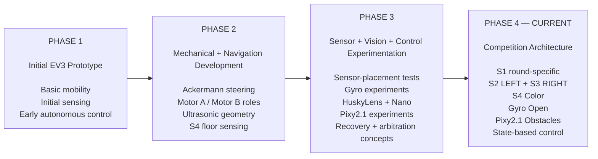

# Evolution of Piolín

This directory documents the engineering evolution of **Piolín**, PiolínTech's autonomous vehicle for the WRO Future Engineers 2026 competition.

Piolín did not evolve through a single complete redesign.

Instead, the robot developed through a sequence of mechanical, sensing, vision, and software iterations in which each prototype exposed limitations that influenced the next engineering decision.

One important fact remained constant throughout the project:

> **Piolín has always been developed around the LEGO MINDSTORMS EV3 platform.**

The evolution was therefore not:

```text
EV3
→ different computer
→ completely different robot
```

It was:

```text
EV3 INITIAL PROTOTYPE
        ↓
MECHANICAL + NAVIGATION DEVELOPMENT
        ↓
SENSOR + VISION + CONTROL EXPERIMENTATION
        ↓
CURRENT EV3 COMPETITION ARCHITECTURE
```

Earlier phases are preserved as engineering evidence.

**Phase 4 represents Piolín's current architecture.**

---

# Development Timeline


```mermaid
flowchart LR

    P1["PHASE 1<br/><br/>Initial EV3 Prototype<br/><br/>Basic mobility<br/>Initial sensing<br/>Early autonomous control"]

    P2["PHASE 2<br/><br/>Mechanical + Navigation Development<br/><br/>Ackermann steering<br/>Motor A / Motor B roles<br/>Ultrasonic geometry<br/>S4 floor sensing"]

    P3["PHASE 3<br/><br/>Sensor + Vision + Control Experimentation<br/><br/>Sensor-placement tests<br/>Gyro experiments<br/>HuskyLens + Nano<br/>Pixy2.1 experiments<br/>Recovery + arbitration concepts"]

    P4["PHASE 4 — CURRENT<br/><br/>Competition Architecture<br/><br/>S1 round-specific<br/>S2 LEFT + S3 RIGHT<br/>S4 Color<br/>Gyro Open<br/>Pixy2.1 Obstacles<br/>State-based control"]

    P1 --> P2
    P2 --> P3
    P3 --> P4
```

The four phases represent major architectural stages rather than individual software revisions.

Small tuning changes such as:

```text
steering gain adjustments

color thresholds

parking distances

Pixy confirmation values

speed changes
```

remain part of the current phase unless they create a major architectural redesign.

---

# Evolution Overview

| Phase | Main Engineering Focus | Controller | Status |
|---|---|---|---|
| [Phase 1](Phase1.md) | Initial mobility and autonomous-control prototype | LEGO EV3 | Legacy |
| [Phase 2](Phase2.md) | Mechanical design, Ackermann steering, navigation and sensor geometry | LEGO EV3 | Legacy development |
| [Phase 3](Phase3.md) | Sensor, vision and control experimentation | LEGO EV3 | Legacy development |
| [Phase 4](Phase4.md) | Current competition architecture | LEGO EV3 | **CURRENT** |

The purpose of preserving all four phases is to show not only:

```text
what Piolín looks like now
```

but also:

```text
why Piolín looks and behaves this way now
```

---

# Phase 1 — Initial EV3 Prototype

### [View Phase 1 Documentation](Phase1.md)

Phase 1 represents the beginning of Piolín.

The objective was to create a functional EV3 vehicle that could:

```text
move autonomously

respond to basic sensor information

test steering behavior

run early Python control logic
```

At this stage, the robot was primarily a learning and experimentation platform.

The development questions were relatively fundamental:

```text
Can the vehicle move predictably?

How does it react to steering commands?

How can distance sensing affect movement?

What mechanical problems become visible during real driving?
```

The architecture was intentionally simple.

```text
EV3
 ↓
basic sensing
 ↓
basic control
 ↓
motors
 ↓
vehicle movement
```

Phase 1 revealed that successful Future Engineers navigation would require more than simply commanding motors.

The team needed to understand the relationship between:

```text
mechanical geometry

sensor placement

vehicle speed

steering response

physical trajectory
```

These observations defined the goals of Phase 2.

---

# Phase 2 — Mechanical and Navigation Development

### [View Phase 2 Documentation](Phase2.md)

Phase 2 focused on transforming Piolín from a basic mobile prototype into a more deliberate autonomous vehicle architecture.

One of the most important developments was the adoption and refinement of:

```text
ACKERMANN-STYLE FRONT STEERING
```

The motor responsibilities also became clearly separated:

```text
Motor A
→ rear propulsion
```

```text
Motor B
→ front steering
```

This created the vehicle structure that would continue into later versions.

Phase 2 also expanded ultrasonic navigation.

The engineering question changed from:

```text
Is something nearby?
```

toward:

```text
Where is Piolín relative to the surrounding course geometry?
```

This encouraged experiments with:

```text
left sensing

right sensing

different sensor positions

different sensor orientations
```

and eventually established the importance of lateral course measurements.

---

## Floor Landmark Development

Phase 2 also strengthened the role of the downward EV3 Color Sensor.

The course contains:

```text
BLUE

ORANGE
```

floor markings.

These became navigation landmarks rather than simply isolated color readings.

The initial direction concept developed toward:

```text
FIRST BLUE
→ COUNTERCLOCKWISE
```

```text
FIRST ORANGE
→ CLOCKWISE
```

This allowed the course itself to provide information about the required driving direction.

---

## Main Phase 2 Contribution

Phase 2 established that:

> **Mechanical design, sensor geometry, and navigation software must be developed together.**

The robot's physical steering geometry directly affects:

```text
turning radius

wall distance

corner behavior

sensor readings

control response
```

This systems-level relationship became one of the foundations of later Piolín development.

---

# Phase 3 — Sensor, Vision, and Control Experimentation

### [View Phase 3 Documentation](Phase3.md)

Phase 3 was the most experimental stage of Piolín's development.

By this point, Piolín had a stronger mechanical and navigation foundation.

The new challenge was the Obstacle Challenge.

Piolín now needed to answer:

```text
What object is ahead?

Is it Red?

Is it Green?

Which side must I pass?

When have I physically cleared it?

How should I return to the normal course?
```

Distance sensing alone could not answer these questions.

Vision became necessary.

---

## Vision Experiments

Phase 3 included multiple approaches to camera-based perception.

One important experimental architecture used:

```text
HuskyLens
      ↓
Arduino Nano
      ↓
EV3
```

This demonstrated that external vision could be integrated with Piolín.

However, it also introduced additional:

```text
hardware

communication

wiring

debugging

software integration
```

layers.

The architecture became valuable development evidence but was eventually moved to legacy status.

---

## Pixy2.1 Development

Phase 3 also introduced Pixy2.1 experimentation.

Pixy could provide:

```text
signature

x

y

width

height
```

for detected objects.

This led to a major architectural distinction:

```text
SIGNATURE
→ tells Piolín WHAT the target is
```

while:

```text
x / y / width / height
→ describe WHERE and HOW RELEVANT it is
```

This became particularly important for obstacle rules.

```text
RED
→ PASS RIGHT
```

```text
GREEN
→ PASS LEFT
```

The pillar's position inside the camera image does not redefine these rules.

---

## Moving Beyond Direct Camera Reactions

One of the strongest lessons from Phase 3 was:

```text
CAMERA DETECTION
≠
DIRECT MOTOR COMMAND
```

Early obstacle logic could behave approximately like:

```text
camera sees Red
→ steer
```

but real testing exposed problems such as:

```text
temporary detection loss

multiple visible blocks

wrong target selection

controller conflict

late avoidance

incorrect recovery
```

This motivated the more structured pipeline:

```text
DETECT
   ↓
VALIDATE
   ↓
SELECT
   ↓
CONFIRM
   ↓
LOCK
   ↓
MANEUVER
```

---

## Recovery and Pass Confirmation

Phase 3 also revealed that obstacle avoidance does not end when the camera loses the pillar.

```text
TARGET LOST
≠
TARGET PASSED
```

Piolín may lose visual contact because the vehicle and camera rotate during the maneuver.

The development therefore moved toward:

```text
AVOID
   ↓
PASS_CONFIRM
   ↓
RECOVER
   ↓
NORMAL
```

This became one of the major software concepts carried into Phase 4.

---

## Controller Conflict

Another important failure mode occurred when several behaviors attempted to control Motor B at the same time.

For example:

```text
pillar avoidance
→ RIGHT
```

while:

```text
wall correction
→ LEFT
```

This showed that Piolín required a control-authority hierarchy.

The concept developed toward:

```text
CRITICAL SAFETY
      ↓
ACTIVE MANEUVER
      ↓
NORMAL NAVIGATION
```

which became explicit in Phase 4.

---

# Phase 4 — Current Competition Architecture

### [View Phase 4 Documentation](Phase4.md)

Phase 4 represents the **current Piolín architecture**.

The purpose of Phase 4 is not to maximize the number of sensors or algorithms.

Instead, each subsystem is assigned a clearly defined responsibility.

<div align="center">


<br>

<sub><b>Figure 1.</b> Piolín's current Phase 4 Open Challenge configuration.</sub>

</div>

The common architecture is:

```text
LEGO MINDSTORMS EV3
        │
        ├── Motor A → rear propulsion
        │
        ├── Motor B → Ackermann steering
        │
        ├── S2 → LEFT Ultrasonic
        │
        ├── S3 → RIGHT Ultrasonic
        │
        └── S4 → Color Sensor
```

S1 changes according to the competition round.

---

# Current Open Challenge Architecture

```text
S1
→ EV3 Gyro Sensor

S2
→ LEFT Ultrasonic

S3
→ RIGHT Ultrasonic

S4
→ Color Sensor
```

<div align="center">


<br>

<sub><b>Figure 2.</b> Phase 4 Open Challenge wiring and sensor configuration.</sub>

</div>

The Open architecture separates:

```text
S2/S3
→ lateral geometry
```

```text
Gyro
→ heading / vehicle rotation
```

```text
S4
→ course landmarks
```

This gives the navigation system different information about:

```text
WHERE THE VEHICLE IS

WHERE THE VEHICLE IS POINTING

WHERE IT IS IN THE COURSE SEQUENCE
```

---

# Current Obstacle Challenge Architecture

During Obstacles:

```text
S1
→ Pixy2.1

S2
→ LEFT Ultrasonic

S3
→ RIGHT Ultrasonic

S4
→ Color Sensor
```

There is no gyro installed in this configuration.

<div align="center">


<br>

<sub><b>Figure 3.</b> Piolín's Phase 4 Obstacle Challenge configuration with Pixy2.1.</sub>

</div>

The corresponding wiring architecture is:

<div align="center">


<br>

<sub><b>Figure 4.</b> Phase 4 Obstacle Challenge wiring and sensor configuration.</sub>

</div>

The design decision is:

```text
OPEN
needs strong heading information
→ GYRO
```

while:

```text
OBSTACLES
needs visual object identity
→ PIXY2.1
```

The two devices therefore share S1 as **round-specific alternatives**.

They are not installed simultaneously in the current architecture.

---

# Phase 4 Vision Architecture

Pixy2.1 is directly integrated with the EV3 through S1 during the Obstacle Challenge.

The current signature convention is:

```text
sig1
→ PINK
→ Parking
```

```text
sig2
→ RED
→ PASS RIGHT
```

```text
sig3
→ GREEN
→ PASS LEFT
```

The processing objective is:

```text
PIXY
   ↓
VALIDATION
   ↓
TARGET SELECTION
   ↓
CONFIRMATION
   ↓
TARGET LOCK
   ↓
STATE MACHINE
   ↓
CONTROLLER
```

rather than:

```text
PIXY
→ MOTOR B
```

This separation is one of the most significant architectural improvements produced by Piolín's evolution.

---

# Phase 4 Software Architecture

The current software direction is increasingly state-oriented.

Important behavioral states include:

```text
START / ACQUIRE

NORMAL

TARGET_ACQUIRE

AVOID

PASS_CONFIRM

RECOVER

CORNER

PARKING

STOP
```

Each state represents a different physical objective.

For example:

```text
NORMAL
→ maintain course geometry
```

```text
AVOID
→ execute required pillar trajectory
```

```text
PASS_CONFIRM
→ determine whether the pillar has actually been cleared
```

```text
RECOVER
→ return toward a usable course position
```

```text
PARKING
→ construct final parking pose
```

This structure prevents every navigation behavior from operating simultaneously with equal authority.

---

# Control Arbitration

Piolín has multiple possible controllers but only one physical steering actuator:

```text
Motor B
```

Phase 4 therefore introduces explicit controller arbitration.

```text
CRITICAL SAFETY
      ↓
ACTIVE MANEUVER
      ↓
NORMAL NAVIGATION
```

The software decides which controller currently owns the trajectory before sending the final command to Motor B.

This avoids uncontrolled combinations such as:

```text
wall correction
+
pillar correction
+
corner correction
+
recovery correction
```

which can otherwise create unstable or contradictory steering.

---

# Color Event Processing

The S4 Color Sensor also became more structured through the evolution.

Instead of counting every individual sensor reading:

```text
BLUE
BLUE
BLUE
BLUE
```

as multiple events, the current concept is:

```text
CLASSIFY
   ↓
CONFIRM
   ↓
LATCH
   ↓
COUNT ONCE
   ↓
WAIT FOR NEUTRAL
   ↓
RELEASE
   ↓
RE-ARM
```

The objective is:

```text
ONE PHYSICAL COURSE MARKING
→ ONE SOFTWARE EVENT
```

This supports:

```text
direction determination

course progression

corner context

parking eligibility
```

---

# 3D-Printed Sensor Integration

Phase 4 also includes custom 3D-printed sensor components.

Current models include:

```text
ColorSensorCasing.stl

PIXY_Case1.stl

PIXY_Case2.stl
```

The Color Sensor casing helps create a more controlled optical environment around S4.

The Pixy casing supports a more repeatable physical installation of the camera.

These parts demonstrate the relationship between:

```text
MECHANICAL DESIGN
      ↓
SENSOR INSTALLATION
      ↓
PERCEPTION
      ↓
SOFTWARE CALIBRATION
```

The manufacturing process is documented under:

[3D Printing Documentation](../3dprint/PrintingProcess.md)

---

# Architecture Evolution Matrix

| Engineering Area | Phase 1 | Phase 2 | Phase 3 | Phase 4 — Current |
|---|---|---|---|---|
| **Main controller** | EV3 | EV3 | EV3 | **EV3** |
| **Primary objective** | Basic prototype | Mechanical/navigation development | Sensor/vision experimentation | **Competition architecture** |
| **Propulsion** | Early EV3 implementation | Motor A role established | Refined | **Motor A rear propulsion** |
| **Steering** | Early mechanism | Ackermann development | Refinement | **Motor B Ackermann steering** |
| **Ultrasonic sensing** | Simple sensing | Placement experiments | Multiple configurations evaluated | **S2 LEFT + S3 RIGHT** |
| **Floor sensing** | Early | S4 integration | Event-processing development | **S4 event system** |
| **Open orientation** | Not mature | Experimental | Gyro evaluated | **S1 Gyro** |
| **Obstacle vision** | None | Not mature | HuskyLens/Nano/Pixy experiments | **S1 Pixy2.1** |
| **Camera architecture** | None | None | Multiple experimental paths | **Direct Pixy2.1 → EV3 S1** |
| **Obstacle decision** | None | Early | Reactive experimentation | **Structured perception + state logic** |
| **Target handling** | None | None | Confirmation/lock concepts | **Validate → select → confirm → lock** |
| **Pass verification** | None | None | Need identified | **PASS_CONFIRM architecture** |
| **Recovery** | None | Early | Need identified | **Dedicated RECOVER state** |
| **Controller priority** | Basic | Basic | Conflict discovered | **Explicit arbitration** |
| **Color counting** | Basic | Course landmarks | Event concepts | **Confirmed discrete events** |
| **Parking** | Not developed | Early concept | Experimental | **Dedicated subsystem under calibration** |

---

# What Remained Constant

The most important continuity throughout Piolín's evolution is the EV3 platform.

```text
PHASE 1 → EV3
PHASE 2 → EV3
PHASE 3 → EV3
PHASE 4 → EV3
```

The project did not achieve greater capability simply by replacing the central computer.

Instead, improvement came from progressively refining:

```text
MECHANICS

STEERING

SENSOR PLACEMENT

PERCEPTION

CONTROL

SOFTWARE ORGANIZATION

TESTING
```

This continuity makes it possible to trace current design decisions back to earlier experiments.

---

# What Changed the Most

Although the controller remained constant, almost everything around it became more structured.

The evolution of Piolín can be represented as:

```text
BASIC MOBILITY
      ↓
VEHICLE GEOMETRY
      ↓
COURSE GEOMETRY
      ↓
MULTI-SENSOR NAVIGATION
      ↓
VISUAL PERCEPTION
      ↓
TARGET VALIDATION
      ↓
STATE-BASED BEHAVIOR
      ↓
CONTROL ARBITRATION
      ↓
RECOVERY
      ↓
EVENT PROCESSING
      ↓
PARKING
```

The largest improvement was therefore not one individual component.

It was the increasing organization of the robot as a complete system.

---

# From More Hardware to Clearer Responsibilities

An important lesson from Phase 3 was that:

```text
MORE SENSORS
```

does not automatically mean:

```text
BETTER ROBOT
```

Every sensor must answer a useful question.

The current architecture follows this principle.

### S2 and S3

```text
What is Piolín's lateral relationship with the course?
```

### S4

```text
What floor landmark is Piolín crossing?
```

### Gyro during Open

```text
How is the vehicle oriented / rotating?
```

### Pixy2.1 during Obstacles

```text
What visual target is ahead?
```

### State machine

```text
What objective should Piolín currently execute?
```

### Arbitration

```text
Which controller is allowed to command Motor B?
```

This clarity is one of the defining characteristics of Phase 4.

---

# Current vs. Legacy

The evolution documentation deliberately preserves obsolete approaches.

```text
PHASE 1
PHASE 2
PHASE 3
→ DEVELOPMENT HISTORY / LEGACY
```

```text
PHASE 4
→ CURRENT ARCHITECTURE
```

Legacy material may include systems that were useful during experimentation but are no longer active, such as:

```text
HuskyLens

Arduino Nano vision bridge

temporary ultrasonic arrangements

earlier camera configurations

earlier navigation logic
```

These are retained because they provide evidence of:

```text
experimentation

failure analysis

design trade-offs

engineering decisions
```

They should not be interpreted as current hardware.

---

# Evolution of the Engineering Questions

The questions PiolínTech asked also became more sophisticated.

### Phase 1

```text
Can we make the robot move autonomously?
```

### Phase 2

```text
Can we make the vehicle follow a repeatable course geometry?
```

### Phase 3

```text
Can the robot understand obstacles and coordinate multiple sensors?
```

### Phase 4

```text
Can each subsystem have a clear role,
and can Piolín reliably decide which behavior
should control the vehicle at each moment?
```

This progression reflects the transition from:

```text
PROTOTYPING
```

to:

```text
SYSTEMS ENGINEERING
```

---

# Engineering Process Behind the Evolution

Each phase follows the same broader development cycle:

```text
OBSERVE
   ↓
IDENTIFY FAILURE
   ↓
FIND FIRST INCORRECT LAYER
   ↓
FORM HYPOTHESIS
   ↓
CHANGE ONE PRIMARY VARIABLE
   ↓
TEST
   ↓
COMPARE
   ↓
KEEP OR REVERT
   ↓
DOCUMENT
```

Failures therefore became part of the design process.

A prototype that was replaced still contributed information.

For example:

```text
HuskyLens + Nano
→ demonstrated external vision integration
→ revealed additional integration complexity
→ informed direct Pixy2.1 architecture
```

Likewise:

```text
multiple ultrasonic configurations
→ demonstrated different geometric information
→ helped identify the value of permanent lateral sensing
```

This is why earlier phases remain documented.

---

# Evolution Summary

The complete development path can be summarized as:

```text
                        PHASE 1
                 INITIAL EV3 PROTOTYPE
                          │
                          ▼
                  BASIC AUTONOMY WORKS
                          │
                          ▼
                        PHASE 2
             MECHANICAL + NAVIGATION DEVELOPMENT
                          │
             ┌────────────┼────────────┐
             ▼            ▼            ▼
         ACKERMANN      MOTOR A/B   COURSE SENSING
             │            │            │
             └────────────┼────────────┘
                          ▼
                        PHASE 3
             SENSOR + VISION EXPERIMENTATION
                          │
            ┌─────────────┼─────────────┐
            ▼             ▼             ▼
      SENSOR TESTS    CAMERA TESTS   CONTROL TESTS
            │             │             │
            └─────────────┼─────────────┘
                          ▼
                ENGINEERING LESSONS
                          │
                          ▼
                        PHASE 4
               CURRENT ARCHITECTURE
                          │
      ┌───────────────────┼───────────────────┐
      ▼                   ▼                   ▼
   OPEN                 COMMON             OBSTACLES
      │                   │                   │
 S1 GYRO             S2 LEFT US          S1 PIXY2.1
                     S3 RIGHT US
                     S4 COLOR
      │                   │                   │
      └───────────────────┼───────────────────┘
                          ▼
                     PERCEPTION
                          ↓
                    STATE MACHINE
                          ↓
                      CONTROL
                          ↓
                    ARBITRATION
                          ↓
                MOTOR A + MOTOR B
                          ↓
                   PIOLÍN MOVEMENT
```

---

# Current Development Status

Phase 4 is the current architecture, but this does not mean every calibration parameter is permanently finished.

The current Open system continues to refine areas such as:

```text
corner consistency

initial acquisition

course-event reliability

parking behavior
```

The current Obstacle architecture continues development in:

```text
target relevance

multi-block selection

pillar avoidance

pass confirmation

recovery

controller arbitration

parking
```

These are treated as **Phase 4 development and calibration**, not as additional robot generations.

A future Phase 5 should only be created if Piolín undergoes a significant architectural change.

---

# Recommended Reading Order

For a complete understanding of Piolín's evolution:

1. [Phase 1 — Initial EV3 Prototype](Phase1.md)
2. [Phase 2 — Mechanical and Navigation Development](Phase2.md)
3. [Phase 3 — Sensor, Vision, and Control Experimentation](Phase3.md)
4. [Phase 4 — Current Competition Architecture](Phase4.md)

The sequence should be read as:

```text
WHAT WE BUILT
      ↓
WHAT WE OBSERVED
      ↓
WHAT FAILED
      ↓
WHAT WE CHANGED
      ↓
WHY THE CURRENT DESIGN EXISTS
```

---

# Final Evolution Principle

Piolín's development demonstrates that engineering progress does not necessarily require replacing the entire platform.

The EV3 remained at the center of every generation.

What changed was the team's understanding of how the surrounding systems should interact.

```text
PHASE 1
Learn to control the vehicle
        ↓
PHASE 2
Understand mechanics and navigation
        ↓
PHASE 3
Understand sensors, vision and controller interaction
        ↓
PHASE 4
Assign clear responsibilities and integrate the complete system
```

The central principle of Piolín's evolution is:

> **Each phase of Piolín was built from the lessons of the previous one. The current robot is not the result of replacing the original concept, but of progressively refining its mechanics, sensing, perception, control, and software architecture until each subsystem had a clear purpose within the complete autonomous vehicle.**

---

<div align="center">

### [Phase 1](Phase1.md) · [Phase 2](Phase2.md) · [Phase 3](Phase3.md) · [Phase 4 — Current](Phase4.md)

<br>

### [← Back to PiolínTech Main README](../../README.md)

</div>
