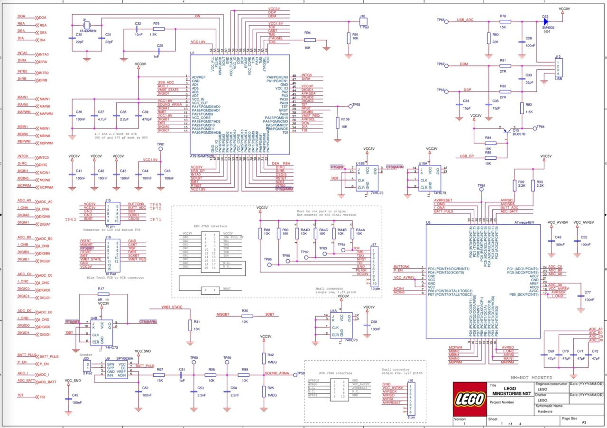
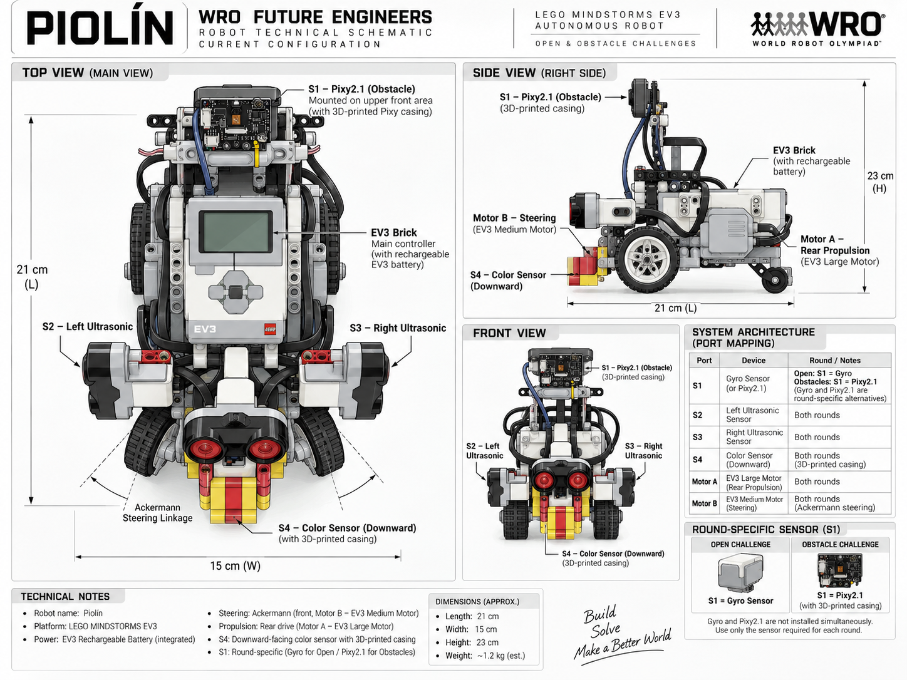

# PiolínTech Technical Schemes

The `schemes/` directory contains the main **electrical, hardware, port-mapping, and system-layout diagrams** used to document Piolín for WRO Future Engineers 2026.

These diagrams complement the rest of the repository by showing how the robot is physically and technically organized.

The purpose of this directory is different from `embed/`:

```text
schemes/
→ hardware
→ electrical architecture
→ EV3 connections
→ physical system organization
```

while:

```text
embed/
→ software architecture
→ state machines
→ control logic
→ perception pipelines
→ engineering processes
```

Together, both directories provide a complete representation of Piolín from hardware connection to autonomous behavior.

---

# Directory Structure

```text
schemes/
│
├── 01_EV3Kicad.png
├── 02_EV3PortMap.png
├── 03_OverallScheme.png
├── 04_OpenConfiguration.png
└── README.md
```

The four diagrams are ordered from the EV3 electronics level toward the complete robot configuration.

---

# 01 — EV3 KiCad Reference

## `01_EV3Kicad.png`

This image contains the **KiCad-based EV3 electrical reference** used as part of PiolínTech's hardware documentation.

It provides a more technical electronics-level view than the simplified diagrams used elsewhere in the repository.

Its purpose is to support understanding of the EV3 as the central hardware platform around which Piolín is built.

<div align="center">



<br>

<sub><b>Figure 1.</b> KiCad-based EV3 electrical reference used in PiolínTech's technical documentation.</sub>

</div>

Piolín continues to use the LEGO MINDSTORMS EV3 Brick as its main controller in the current architecture.

The robot does not use a Raspberry Pi or an external general-purpose computer as its autonomous-control core.

---

# 02 — EV3 Port Map

## `02_EV3PortMap.png`

The EV3 Port Map provides the clearest reference for Piolín's **motor and sensor assignments**.

<div align="center">


<br>

<sub><b>Figure 2.</b> Piolín's EV3 sensor and motor port mapping.</sub>

</div>

The permanent motor assignments are:

```text
PORT A
→ EV3 Large Motor
→ rear propulsion
```

```text
PORT B
→ EV3 Medium Motor
→ Ackermann steering
```

Ports C and D are not part of the current primary motor architecture.

The permanent common sensor assignments are:

```text
S2
→ LEFT EV3 Ultrasonic Sensor
```

```text
S3
→ RIGHT EV3 Ultrasonic Sensor
```

```text
S4
→ downward-facing EV3 Color Sensor
```

S1 is **round-specific**.

### Open Challenge

```text
S1
→ EV3 Gyro Sensor
```

### Obstacle Challenge

```text
S1
→ Pixy2.1
```

Therefore:

> **The Gyro Sensor and Pixy2.1 are not installed simultaneously in the current competition architecture.**

---

# 03 — Overall Robot Scheme

## `03_OverallScheme.png`

The Overall Scheme provides a broader technical representation of Piolín as a complete vehicle.

<div align="center">



<br>

<sub><b>Figure 3.</b> Overall technical scheme of Piolín's current mechanical and sensing architecture.</sub>

</div>

While the Port Map focuses primarily on:

```text
WHAT CONNECTS WHERE
```

the Overall Scheme focuses on:

```text
WHERE THE COMPONENTS ARE

WHAT THEY DO

HOW THE VEHICLE IS ORGANIZED
```

The major physical systems represented are:

```text
EV3 Brick
→ central controller

Motor A
→ rear propulsion

Motor B
→ front Ackermann steering

S2
→ left lateral sensing

S3
→ right lateral sensing

S4
→ floor sensing

S1
→ round-specific sensing
```

This diagram helps connect the electrical architecture with the actual physical robot.

---

# 04 — Open Challenge Configuration

## `04_OpenConfiguration.png`

This diagram documents Piolín's current **Open Challenge sensor configuration**.

<div align="center">


<br>

<sub><b>Figure 4.</b> Piolín's Open Challenge configuration using the EV3 Gyro Sensor on S1.</sub>

</div>

The Open configuration is:

```text
MOTOR A
→ EV3 Large Motor
→ rear propulsion

MOTOR B
→ EV3 Medium Motor
→ Ackermann steering

S1
→ EV3 Gyro Sensor

S2
→ LEFT EV3 Ultrasonic Sensor

S3
→ RIGHT EV3 Ultrasonic Sensor

S4
→ EV3 Color Sensor
→ downward-facing
```

Each sensor has a different responsibility.

### S1 — Gyro

```text
heading information

vehicle rotation

corner support

drift correction
```

### S2 + S3 — Lateral Ultrasonics

```text
course geometry

wall relationship

lateral-position information

safety context
```

### S4 — Color Sensor

```text
Blue course markings

Orange course markings

initial direction

course-event progression
```

The Open configuration therefore separates:

```text
LATERAL POSITION
→ S2 + S3
```

```text
ORIENTATION
→ S1 Gyro
```

```text
COURSE LANDMARKS
→ S4 Color Sensor
```

---

# Hardware Architecture Summary

The current common hardware architecture can be represented as:

```text
                    LEGO EV3 BRICK
                          │
          ┌───────────────┼───────────────┐
          │               │               │
          ▼               ▼               ▼
       MOTOR A          MOTOR B         SENSORS
       Large            Medium             │
          │               │                │
          ▼               ▼        ┌───────┼───────┐
        REAR          ACKERMANN      │       │       │
     PROPULSION       STEERING      S2      S3      S4
                                    LEFT    RIGHT   COLOR
                                     US      US
                                             
                          S1
                           │
                 ┌─────────┴─────────┐
                 ▼                   ▼
               GYRO                PIXY2.1
               OPEN               OBSTACLES
```

The architecture deliberately preserves a stable common platform while changing only the sensing capability required by each round.

---

# Scheme Hierarchy

Each image answers a different engineering question.

| Scheme | Main Question |
|---|---|
| `01_EV3Kicad.png` | What does the EV3 electrical reference look like at a more technical level? |
| `02_EV3PortMap.png` | Which device is connected to each EV3 port? |
| `03_OverallScheme.png` | How are the major systems physically and technically organized on Piolín? |
| `04_OpenConfiguration.png` | How is Piolín specifically configured for the Open Challenge? |

They should therefore be read as complementary diagrams rather than duplicates.

The progression is:

```text
EV3 ELECTRONICS
      ↓
PORT ASSIGNMENTS
      ↓
COMPLETE ROBOT
      ↓
ROUND-SPECIFIC CONFIGURATION
```

---

# Relationship with Other Repository Sections

The schemes should be interpreted together with the rest of PiolínTech's documentation.

## Schemes

```text
schemes/
→ electrical and physical architecture
```

## Embedded diagrams

```text
embed/
→ software and control architecture
```

Important visual software references include:

```text
Navigation State Machine

Pixy Vision Processing

Control Arbitration

Obstacle Strategy

Color Event Processing

Parking State Machine

System Architecture
```

## Robot photographs

```text
v-photos/v4/
→ photographic evidence of the real robot
```

## 3D models

```text
models/3dprint/
→ custom manufactured sensor components
```

## Evolution

```text
models/evolution/
→ development history from Phase 1 to Phase 4
```

This organization separates:

```text
SCHEMATIC EVIDENCE

SOFTWARE LOGIC

PHYSICAL EVIDENCE

MANUFACTURING

ENGINEERING EVOLUTION
```

while keeping the sections connected.

---

# Current Port Reference

For quick reference:

| Port | Current Device | Function | Configuration |
|---|---|---|---|
| A | EV3 Large Motor | Rear propulsion | Both rounds |
| B | EV3 Medium Motor | Ackermann steering | Both rounds |
| S1 | EV3 Gyro Sensor | Heading / rotation | Open |
| S1 | Pixy2.1 | Vision | Obstacles |
| S2 | EV3 Ultrasonic Sensor | Left lateral geometry | Both rounds |
| S3 | EV3 Ultrasonic Sensor | Right lateral geometry | Both rounds |
| S4 | EV3 Color Sensor | Floor landmarks | Both rounds |

The physical naming convention is always:

```text
S2 = LEFT

S3 = RIGHT
```

The software may interpret one as the:

```text
inner sensor
```

and the other as the:

```text
outer sensor
```

depending on course direction, but their physical identities never change.

---

# Documentation Accuracy

These schemes are intended as **technical documentation diagrams**, not manufacturing drawings with guaranteed scale.

Where dimensions or physical relationships require exact verification, the real robot and measured engineering documentation should take priority over approximate graphical representations.

Likewise, the diagrams should not be interpreted as evidence that every depicted software behavior is already fully calibrated.

The current competition architecture is documented separately from ongoing parameter tuning.

This distinction allows the repository to accurately represent:

```text
CURRENT HARDWARE ARCHITECTURE
```

while still acknowledging:

```text
ONGOING SOFTWARE CALIBRATION
```

---

# Final Scheme Overview

The complete `schemes/` section can be summarized as:

```text
01_EV3Kicad.png
      ↓
ELECTRONICS REFERENCE

02_EV3PortMap.png
      ↓
PORT CONNECTIONS

03_OverallScheme.png
      ↓
PHYSICAL + TECHNICAL ROBOT LAYOUT

04_OpenConfiguration.png
      ↓
CURRENT OPEN ROUND CONFIGURATION
```

Together, these diagrams provide a compact visual explanation of the hardware foundation on which Piolín's autonomous software operates.

The central principle of this section is:

> **Piolín's technical schemes document the path from the EV3 hardware platform to the physical vehicle configuration, making the robot's connections, sensor roles, motor assignments, and Open Challenge architecture understandable without requiring the reader to infer them from source code alone.**

---

<div align="center">

### [← Back to PiolínTech Main README](../README.md)

</div>
