# Electromechanical Evolution and Visual Documentation

This section provides a visual record of the physical evolution of **Piolín** throughout its development for WRO Future Engineers. Each group of images presents the robot from multiple viewpoints so that changes in chassis organization, steering geometry, sensor placement, controller position, drivetrain layout, and overall packaging can be compared between generations.

The purpose of these views is not simply to show how the robot looked at different moments. They document how the electromechanical architecture evolved as testing exposed new requirements. Changes to the position of a sensor, the steering structure, the EV3 Brick, or the drivetrain can significantly affect weight distribution, cable routing, turning behavior, sensing geometry, and software calibration. For this reason, PiolínTech treats the physical configuration of the robot as part of the autonomous system rather than as an independent mechanical shell.

The earlier configurations shown below are preserved as engineering history. Some contain arrangements that were later modified or abandoned, while others introduced mechanical ideas that continued into later versions. **V4 represents the current Piolín architecture** and should therefore be used as the main physical reference when comparing the current documentation with older designs.

---

## PARTIALLY LEGO

The **Partially LEGO** configuration represents an intermediate stage in Piolín's physical development. At this point, the team was still experimenting with the organization of the chassis and the integration of the different mechanical and sensing elements. The robot already reflected a more deliberate vehicle-oriented layout than the earliest prototypes, but several areas of the design were still being evaluated and modified through physical testing.

This stage was particularly useful for understanding how the position of major components influenced the available space for steering, sensing, wiring, and drivetrain mechanisms. Rather than considering each component independently, the team began evaluating how the complete arrangement affected the robot's ability to navigate the WRO track.

| Front View | Back View | Left View |
| :---: | :---: | :---: |
| 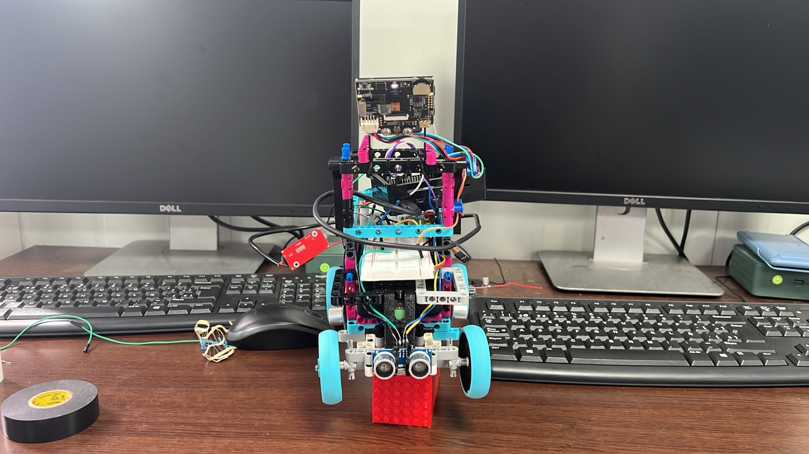 | 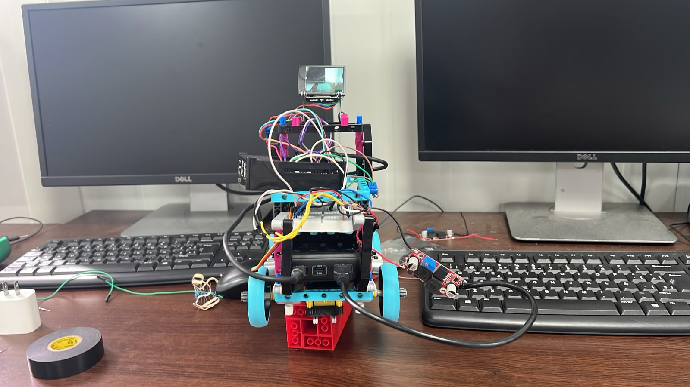 | 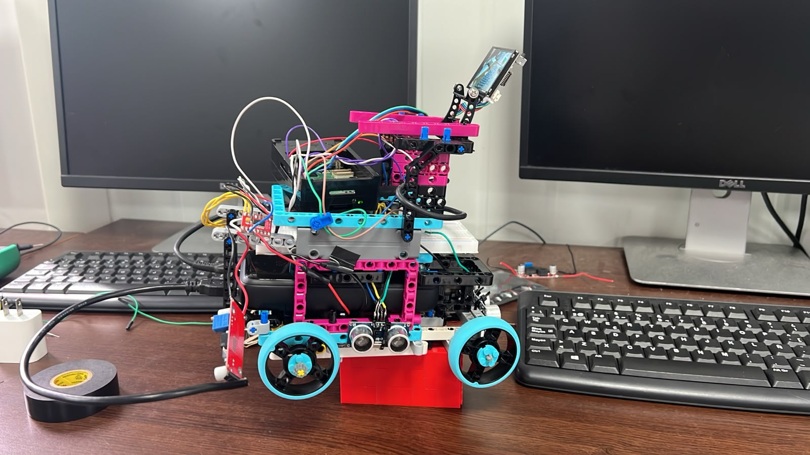 |
| **Right View** | **Top View** | **Bottom View** |
| 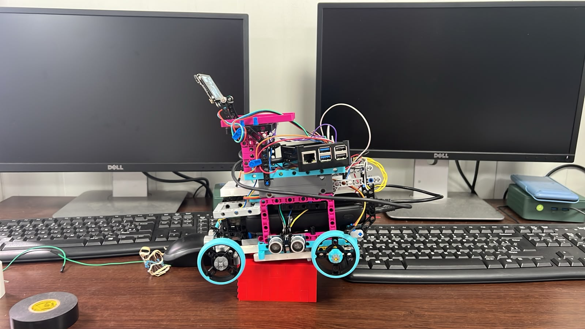 | 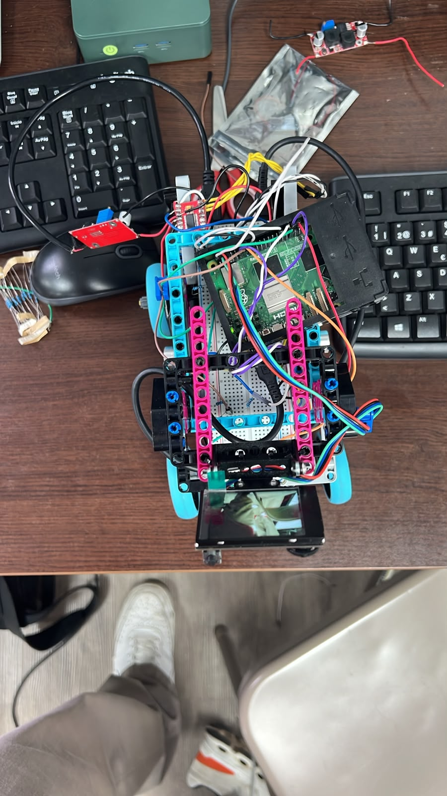 | 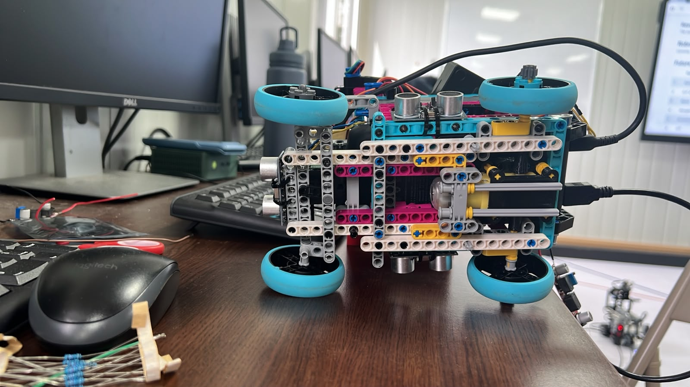 |

The six views make it possible to inspect the relationship between the vehicle footprint, wheel placement, structural members, and internal component organization. This configuration remains documented because it represents part of the iterative process that eventually led to the more organized layouts used in later versions.

---

## COMPLETE LEGO

The **Complete LEGO** configuration represents another important development stage in which the vehicle architecture was explored using a highly integrated LEGO-based structure. This version allowed PiolínTech to evaluate how much of the vehicle could be constructed within the LEGO ecosystem while still maintaining the mechanical characteristics required for Future Engineers.

One of the main benefits of this stage was the ability to rapidly reposition components and rebuild structural sections between tests. This made it possible to experiment with different chassis layouts without committing immediately to a single configuration. The resulting observations helped the team understand where additional rigidity, improved sensor placement, or different mechanical arrangements were necessary.

| **Front View** | **Back View** | **Left View** |
| :---: | :---: | :---: |
|  |  |  |
| **Right View** | **Top View** | **Bottom View** |
|  |  |  |

This version is useful as a visual reference for understanding how PiolínTech gradually moved from rapid structural experimentation toward a more deliberate electromechanical arrangement. Several decisions that later became permanent were shaped by observations made while working with these earlier LEGO structures.

---

## V3 LEGO

The **V3 LEGO** generation represents a much more mature stage of the robot's mechanical development. By this point, Piolín had evolved beyond the basic question of whether the robot could move autonomously. The focus increasingly shifted toward making the vehicle easier to control, easier to reproduce, and more predictable across repeated track runs.

The chassis organization became more closely connected to the requirements of Ackermann steering, rear propulsion, lateral sensing, and autonomous course navigation. V3 also became an important experimental platform for evaluating different sensor arrangements and vision concepts before the final round-specific architecture was selected.

| Front View | Back View | Left View |
| :---: | :---: | :---: |
| 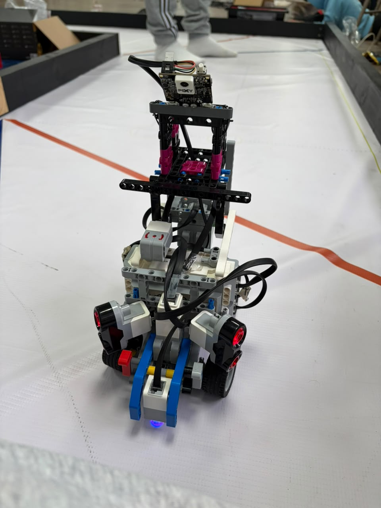 | 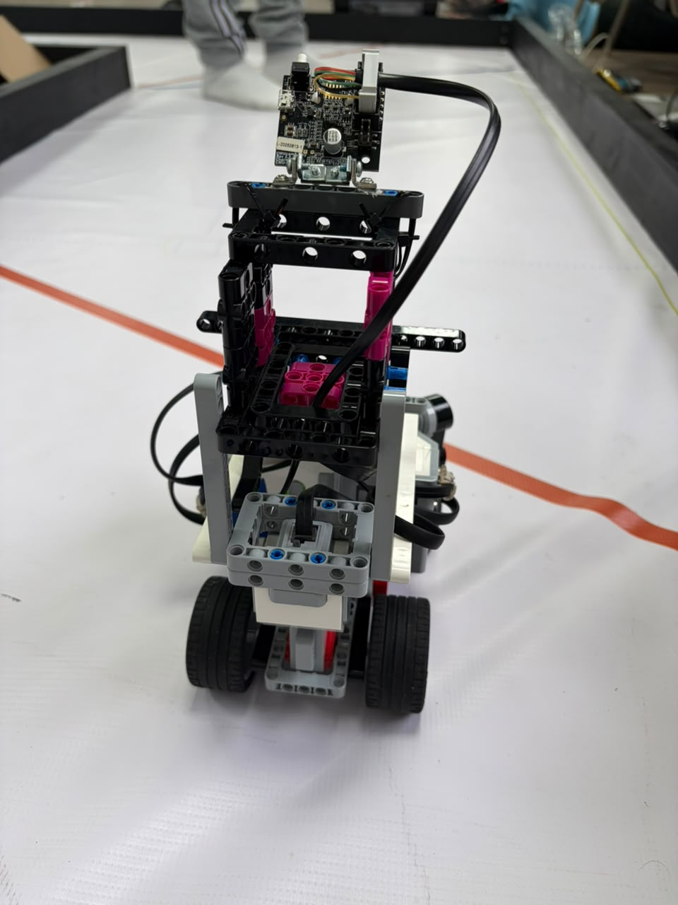 | 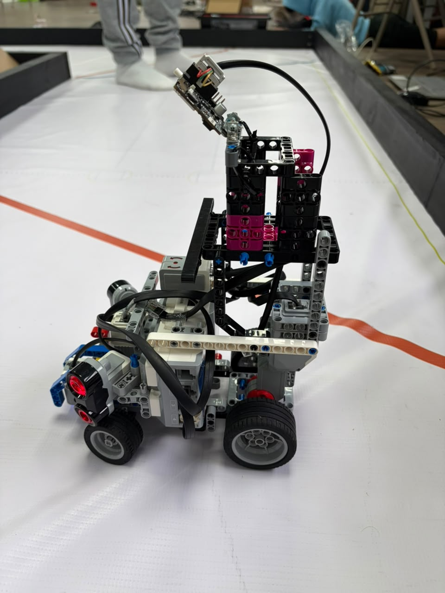 |
| **Right View** | **Top View** | **Bottom View** |
| 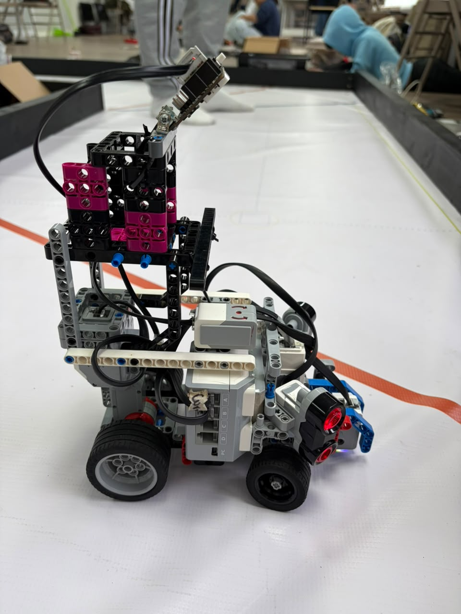 | 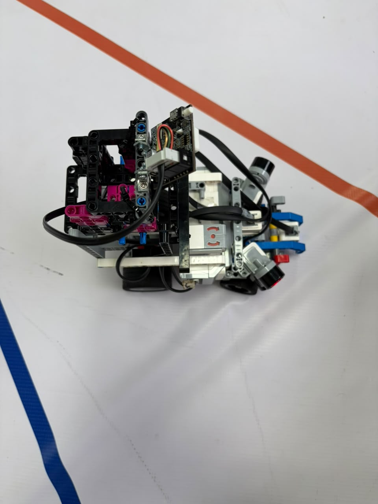 | 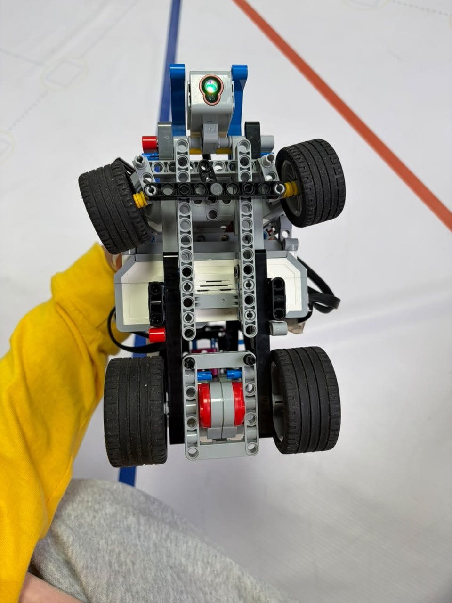 |

The different views show how the robot was becoming increasingly organized around a vehicle-specific architecture rather than a general-purpose EV3 chassis. This generation played an important role in the experiments that later determined which sensors should remain permanent and which should become round-specific.

V3 should therefore be understood as a **development platform**, not as the current competition configuration. Several of the ideas tested here were later retained, while others were simplified or replaced in V4.

---

## V4 — CURRENT PIOLÍN

**V4 is the current Piolín architecture for WRO Future Engineers 2026.** It represents the consolidation of the mechanical, sensing, and control decisions obtained through the previous development phases.

The current platform retains the LEGO MINDSTORMS EV3 Brick as the central controller and uses two clearly separated motor functions. **Motor A**, an EV3 Large Motor, provides rear propulsion, while **Motor B**, an EV3 Medium Motor, controls the front Ackermann-style steering mechanism. This separation between propulsion and steering is one of the defining characteristics of the current vehicle architecture.

The sensor arrangement was also simplified compared with several earlier experiments. Piolín now uses two permanent lateral EV3 Ultrasonic Sensors: **S2 is always the physical left ultrasonic sensor and S3 is always the physical right ultrasonic sensor**. The downward-facing EV3 Color Sensor remains on **S4** and is used to observe the Blue and Orange floor landmarks that contribute to direction detection and course progression.

S1 is intentionally round-specific. During the Open Challenge, an EV3 Gyro Sensor occupies S1 and provides heading and rotation information. During the Obstacle Challenge, the gyro is removed and Pixy2.1 occupies S1 to provide visual information about Red, Green, and Pink targets. These two devices are not installed simultaneously in the current competition architecture.

### V4 — Current Open Configuration

| Front View | Rear View | Left View |
| :---: | :---: | :---: |
|  |  |  |
| **Right View** | **Top View** | **Bottom View** |
|  |  |  |

These six views provide the main physical reference for the current Open Challenge robot. They show the actual relationship between the EV3 Brick, drivetrain, steering structure, lateral ultrasonic sensors, downward Color Sensor, wheels, structural members, and cable routing.

The Open photographs are especially useful because they document the configuration in which S1 is occupied by the Gyro Sensor. The same common mechanical platform is retained during the Obstacle Challenge, but S1 is instead occupied by Pixy2.1.

---

### V4 Mechanical Architecture

The most important mechanical characteristic of V4 is the clear separation between propulsion and steering. The rear of the robot is driven by Motor A, while Motor B operates the front Ackermann steering linkage. This allows the software to treat longitudinal progression and steering curvature as separate control variables while preserving the behavior of a car-like vehicle.

The Ackermann mechanism also means that Piolín cannot be modeled as a differential-drive robot. The robot follows curved trajectories produced by steering the front wheels while the vehicle moves forward or backward. As a result, steering geometry, vehicle speed, wheel alignment, and the timing of corrections all directly influence the physical path.

The current chassis also provides defined locations for the sensors instead of treating sensor mounting as temporary. This is particularly important for the ultrasonic sensors, because changing their physical position or orientation changes the geometry being measured and can invalidate previously calibrated navigation parameters.

---

### V4 Sensor Placement

The two ultrasonic sensors are mounted laterally so that the software can observe Piolín's relationship with the surrounding track boundaries. Their physical identities remain constant: S2 is left and S3 is right. Depending on whether Piolín travels clockwise or counterclockwise, the software may interpret one sensor as the inner sensor and the other as the outer sensor, but their physical names and ports never change.

The Color Sensor is mounted downward on S4. Its physical environment is supported by a custom 3D-printed casing designed to reduce uncontrolled light entering the immediate sensing area. Because changes to the casing or sensor height can affect reflection and RGB measurements, the Color Sensor is recalibrated whenever its physical installation changes significantly.

During the Obstacle Challenge, Pixy2.1 is installed as the forward vision sensor and uses a custom two-part 3D-printed casing. The casing contributes to mechanical support and repeatable camera positioning while preserving the required field of view. Because the physical orientation of the camera affects the position and apparent size of detected objects, camera mounting is treated as part of the vision calibration.

---

### V4 Electromechanical Integration

V4 represents a shift away from viewing the robot as a collection of independent hardware components. Instead, PiolínTech treats mechanical geometry, sensors, actuators, and software as parts of one closed-loop electromechanical system.

A change to the steering linkage can alter the curvature produced by Motor B. A change to ultrasonic positioning can alter the wall measurements received by the navigation controller. Moving Pixy2.1 can change the image coordinates used by the perception system, and modifying the Color Sensor casing can alter the optical values used for floor classification.

For this reason, mechanical modifications are followed by sensor and software verification rather than assuming that previous calibration remains valid.

---

## Evolution Across the Four Visual Generations

The visual progression from the earlier configurations to V4 demonstrates how Piolín gradually became more organized around clearly defined subsystem responsibilities. Early versions were primarily useful for rapid experimentation and discovering mechanical limitations. Later versions increasingly focused on repeatability, controlled sensor geometry, steering consistency, and simpler hardware integration.

| Engineering Area | Earlier Prototypes | V3 | V4 — Current |
| :--- | :--- | :--- | :--- |
| Central controller | EV3-based experimentation | EV3 | **EV3** |
| Vehicle structure | Rapidly changing layouts | More mature vehicle layout | **Current competition chassis** |
| Propulsion | Experimental arrangements | Dedicated drive development | **Motor A rear propulsion** |
| Steering | Evolving mechanisms | Ackermann refinement | **Motor B Ackermann steering** |
| Ultrasonic sensing | Multiple arrangements tested | Sensor-role experimentation | **S2 LEFT + S3 RIGHT** |
| Floor sensing | Developing | S4 integration and testing | **S4 downward Color Sensor** |
| Open orientation | Experimental | Gyro testing | **S1 Gyro** |
| Obstacle vision | Experimental | Multiple vision approaches tested | **S1 Pixy2.1** |
| Custom 3D printing | Limited / developing | Experimental use | **Sensor casings integrated into current architecture** |
| Software relationship | More reactive | Increasing subsystem organization | **Layered sensing, state logic, and control** |
| Status | Historical development | Legacy development platform | **CURRENT** |

The table is intentionally qualitative. It documents architectural evolution without assigning performance values that were not formally measured under controlled conditions.

---

## Why V4 Is the Current Reference

V4 does not represent a completely unrelated robot built after the previous versions. It is the result of decisions made while testing those versions. Ackermann steering was refined through repeated mechanical iterations. Sensor layouts were changed as the team learned what geometric information was actually useful. Vision systems were tested before Pixy2.1 was selected for the current Obstacle Challenge configuration, and the use of S1 became round-specific after experimenting with competing sensing requirements.

The result is a robot with a much clearer physical architecture. Motor A handles propulsion, Motor B handles steering, S2 and S3 provide lateral geometry, S4 provides floor information, and S1 provides the specialized information needed by the selected round.

This clarity also improves software development because a failure can be traced back to a specific physical subsystem rather than being hidden inside an ambiguous hardware arrangement.

---

## Visual Documentation as Engineering Evidence

These six-view records are maintained because physical configuration is part of the reproducibility of an autonomous robot. Knowing which program was used is not sufficient if the sensors, steering mechanism, or drivetrain are installed differently.

The images therefore provide evidence of component placement and overall vehicle organization at different development stages. They also make it possible to compare older configurations with the current robot and understand which physical changes correspond to decisions documented elsewhere in the repository.

For current reproduction and evaluation, **V4 should be treated as the authoritative physical reference**. Earlier views remain available to document the engineering path that produced it.

---

## Current Physical Reference

The current V4 architecture can be summarized as follows:

| Component | Current Role |
| :--- | :--- |
| LEGO MINDSTORMS EV3 Brick | Main controller |
| Motor A — EV3 Large Motor | Rear propulsion |
| Motor B — EV3 Medium Motor | Ackermann steering |
| S2 — EV3 Ultrasonic Sensor | Left lateral sensing |
| S3 — EV3 Ultrasonic Sensor | Right lateral sensing |
| S4 — EV3 Color Sensor | Downward floor sensing |
| S1 — EV3 Gyro Sensor | Open Challenge heading and rotation |
| S1 — Pixy2.1 | Obstacle Challenge vision |
| EV3 Rechargeable Battery 45501 | Main power source |
| `ColorSensorCasing.stl` | Color Sensor physical/optical casing |
| `PIXY_Case1.stl` + `PIXY_Case2.stl` | Pixy2.1 casing assembly |

The Gyro Sensor and Pixy2.1 are **round-specific alternatives on S1 and are not installed simultaneously**.

---

## Conclusion

The electromechanical evolution of Piolín reflects a gradual transition from experimental physical layouts toward a vehicle in which component placement and subsystem responsibilities are deliberately defined. Earlier configurations were essential for exposing problems related to mechanics, steering, sensing, packaging, and integration, while later versions increasingly transformed those observations into repeatable design decisions.

V4 represents the current result of that process. Its importance does not come from claiming that every mechanical or software parameter is permanently final, but from having a stable architecture in which propulsion, Ackermann steering, lateral sensing, floor sensing, round-specific orientation or vision, and EV3 control have clearly defined roles. This physical architecture now provides the baseline on which PiolínTech continues to calibrate and improve autonomous performance.
